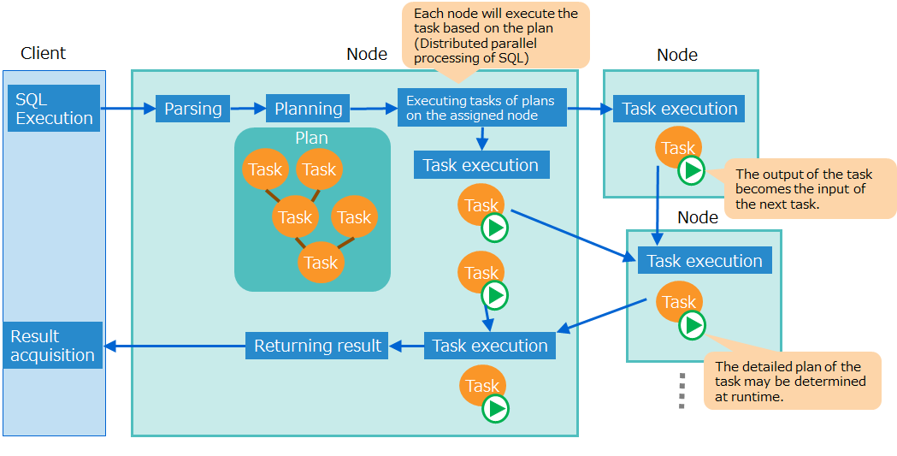
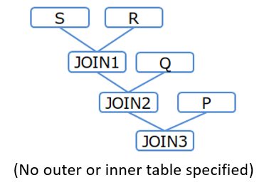
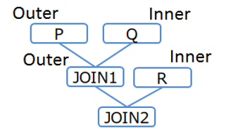
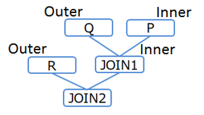
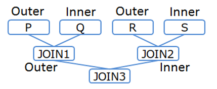

---
title: "Tuning Guide"
description: "Describes how to perform SQL tuning procedures and SQL optimization"
date: 2020-01-28T00:34:41+09:00
draft: false
weight: 25
---

## --- Introduction ---

## Aim & configuration of this manual

**This manual describes GridDB SQL tuning.**

This document is intended for developers who develop systems using SQL with GridDB.

The contents of this manual are as follows.

- Tuning steps
  - The steps for tuning SQL are described.

- Optimize SQL
  - Optimization rules in SQL scan and join processing are described.

- SQL plan (execution plan)
  - SQL plan, the result of SQL optimization, is described.


For optimization rules and tuning, the distinctive features of GridDB are mainly descried.


## --- Tuning steps ---

SQL tuning is performed in the following procedure, similar to the case of a general database system.

- STEP 1 Check a slow query

  - If there is a problem with SQL performance on the system, identify slow queries that take a long time to execute.


- STEP 2 Obtain the plan

  - Get the plan of the slow query.


- STEP 3 Tune the query

  - Analyze the plan to see whether it works as intended and which part of the query is taking longer time than expected.
  - Depending on the problem, tune the query by, such as, rewriting and indexing the query.


- STEP 4 Re-execute the query

  - Execute the tuned query to check the performance. If the problem is not solved, execute the procedure from STEP 2 again.


Details about STEP 1 to STEP 3 are explained below.


## Check a slow query

Among the queries running on the system, identify slow queries that are taking a long time.

A slow query that takes a long execution time can be set to output information about the query and the execution time to the event log.
Thereby, the bottleneck can be identified among the queries executed from an application.

The procedure to check the slow query is as follows.

1. Output setting of a slow query

  - GridDB node has parameters for the threshold of slow query execution time and the upper limit of the query character string size output to the event log.

    | Parameter                    | Description                                                                              | Default value |
    |------------------------------|-------------------------------------------------------|------|
    | /sql/traceLimitExecutionTime | Lower limit of execution time (unit: second) for the event logging as a slow query.      | 300s |
    | /sql/traceLimitQuerySize     | Size upper limit of the query character string for logging as a slow query. (unit: byte) | 1000 |

  - To change from the default value, use either of the following two methods.
    - Stop the node and set parameters in the node definition file (gs_node.json)
    - Change the setting online using the operating command gs_paramconf. Note that, the setting changed online is reset by restarting the node. To make the change permanent, set also the node definition file (gs_node.json) after changing the setting online.

    [Memo]
    - Since SQL is executed on any node of the cluster configuration, be sure to set the output setting of the slow query for all nodes.
    - See the "[GridDB Operation Tools Reference](../5.md_reference_operation_tool/md_reference_operation_tool.md)" for the details about gs_paramconf.


2. Execute a query.

  - Execute a query. The query exceeding the execution time set in 1 is output to the event log.


3. Check for slow queries

  - Check the log of a slow query. There are following two ways for checking. Identify the slow query using any one of these ways.

    | The ways for checking | Item |
    |-------------|----------|
    | Check the latest information online | Execute the option --slowlogs of operation tool gs_logs to display the information of a slow log. <br><br>- Only the information of the latest event log file is displayed. <br>The event log file is rotated when the file size exceeds the threshold or when the date changes. Once rotated, gs_logs will not show the contents of the old event log file.|
    | Check an event log file directly. | Check the event log file of a node directly. <br>Get the slow query log from the log file using "SQL_LONG_QUERY" as a keyword. |

    [Memo]
    - Since SQL is executed on any node of the cluster configuration, be sure to check the slow query log in all nodes.
    - See "[GridDB Operation Tools Reference](../5.md_reference_operation_tool/md_reference_operation_tool.md)" about how to use gs_logs.


## Obtain the plan

Execute the slow query identified in STEP 1 and get the query plan (global plan).

Use the operation tool gs_sh to get a plan. Execute the query with EXPLAIN ANALYZE syntax and get the plan with the sub-command getplantxt.


(1) Execute the query in the "EXPLAIN ANALYZE" syntax.

```
gs[public]> sql EXPLAIN ANALYZE select * from table1, table2 where table1.value=1 and table1.id=table2.id ;
A search was executed.  (19 ms)
```

(2) Get the plan.

```
gs[public]> getplantxt
Id Type       Input Rows Lead time Actual time Node                 And more..
--------------------------------------------------------------------------------------------------------------------
 0 SCAN       -     -           30          30 192.168.15.161:10001 table: {table1}
 1   SCAN     0     3000        21          21 192.168.15.161:10001 table: {table1, table2} INDEX SCAN JOIN_EQ_HASH
 2     RESULT 1     14           0           0 192.168.15.161:20001
```


GridDB processes SQL as follows:
A node parses queries and generate a plan. The plan consists of plans for each task, a unit of execution, which are executed by each node to which the task was assigned.

<figure>
  
  <figcaption>SQL plan and the flow of processing</figcaption>
</figure>

The sub-command getplantxt for showing a plan displays a plan for each task line by line. An output of a task becomes the input of the next task.

Using the execution example of "(2) Get the plan" the way to display the plan is explained specifically.

- "Input" of plan ID1 is "0", this means that the input of Plan ID1 is the result of plan ID0.
- "Rows" of plan ID1 is "3000", this means that the number of rows input from Plan ID0 is 3000.
- "Node" of plan ID1 is "192.168.15.161:10001", this means that this task was executed on the node "192.168.15.161."


## Tune the query

In the scan processing under a search condition in a WHERE clause and in the scan processing for joining a table, the performance may greatly change depending on whether the index is used or not.
As for joining a table, the performance depends greatly on the join order.
Note these points when tuning a query.


(1) Analyze a plan

Analyze a plan to check whether the index is used and the queries are executed as intended.
See the [SQL plan](#label_plan) for the details of a plan.

- How to check whether the index is used or not

  - In the scan processing under a search condition in a WHERE clause and in the scan processing for joining a table, the performance may greatly change depending on whether the index is used or not.
  - When "Type" of the slow task is "SCAN", check whether the index is used in the scan processing.
  - When the index is used, "INDEX SCAN" will be displayed under "And mode ..". If not, the index is not used.


(2) Tuning

Tune using the following methods depending on the problem identified from the analysis of a plan.

- Create an index
  - If a column that needs an index is not indexed yet, create an index.
  - Provided that, it is recommended not to create an index in the following cases, because the index is less effective.
    - When the index has almost no effect to narrow down values in query execution, because, for example, the cardinality of the column is low (the number of types of column value is smaller than the number of rows).

- Rewre a query
  - Rewrite statements such as WHERE clause search conditions and join order based on the result of [SQL optimization](#label_sql_optimization).
  - Use a hint phrase. For example, when the index is left unused or when the index should not be used for a certain query, modify the plan using a hint phrase.


Example)
A query for joining tables is explained as a tuning example.

Get a plan for a query which joins table1 and table2 with the value of the column value.

```
gs[public]> EXPLAIN ANALYZE select * from table1, table2 where table1.value=0 and table1.value=table2.value;
A search was executed.  (13 ms)
gs[public]> getplantxt
Id Type       Input Rows  Lead time Actual time Node                 And more..
-------------------------------------------------------------------------------------
 0 SCAN       -     -            20          20 192.168.15.161:10001 table: {table1}
 1 SCAN       -     -             9           9 192.168.15.161:10001 table: {table2}
 2   JOIN     0,1   10000,3000  891         891 192.168.15.161:20001 JOIN_EQ_HASH
 3     RESULT 2     32            2           2 192.168.15.161:20001
```

In this plan, table1 and table2 are scanned respectively, and join is processed without using an index.

Checking the index information of the table showed that the column value was not indexed, so an index is created.

Execute the same query to get a plan.

```
gs[public]> EXPLAIN ANALYZE select * from table1, table2 where table1.value=0 and table1.value=table2.value;
A search was executed.  (7 ms)
gs[public]> getplantxt
Id Type       Input Rows Lead time Actual time Node                 And more..
--------------------------------------------------------------------------------------------------------------------
 0 SCAN       -     -           20          20 192.168.15.161:10001 table: {table1}
 1   SCAN     0     10000       80          80 192.168.15.161:10001 table: {table1, table2} INDEX SCAN JOIN_EQ_HASH
 2     RESULT 1     32           3           3 192.168.15.161:20001
```

"INDEX SCAN" is displayed for plan ID2, and the plan has changed to use an index in join processing.


<a id="label_sql_optimization"></a>
## --- Optimize SQL ---


## Scan using an index

In a scan processing to find data that matches the search condition of WHERE clause, the "index scan" using the table index is often faster than the "full scan" which accesses all the rows of the table.


The index scan is more effective when the search condition of a WHERE clause can narrow down the data by reducing the hit ratio to the number of rows of a table.


<a id="scan_index_selection_rule"></a>
### Index selection rules

This section explains rules to select an index for scan processing when optimizing GridDB SQL.

Rules are different depending on the operator or expression specified in the search condition.


**AND**

Basically, when indexes are set on the columns used as search conditions, the first index is used.

Example:
```
a>1 AND b=2 (both a and b are indexed)
```
  - The index of a is used.


Provided that, in exceptional cases, the first index is not used. An example of such cases is shown below.

- If a constant false is added as an OR condition, "OR false", the index is not used.

  Specify this syntax not to use an index in a scan.

  Example) In order not to use the index of a in "a>1 AND b=2"
  ```
  (a>1 OR false) AND b=2 (both a and b are indexed)
  ```
    - The index of a is not used. The index of b is used.

  Example) In order not to use the indexes of both a and b in "a>1 AND b=2"
  ```
  (a>1 AND b=2) OR false    (both a and b are indexed)
  a>1 AND b=2 OR false      (both a and b are indexed)
  ```
    - The indexes of a and b are not used.


- If an AND condition contains OR or IN, the index is used only in the first expression (the leftmost expression) for which an index is available.

  Example:
  ```
  (a=1 OR a=3) AND b=2   (both a and b are indexed)
  a IN (1,3) AND b=2     (both a and b are indexed)
  ```
    - The index of a is used. The index of b is not used.

  Example:
  ```
  (a=1 OR a=3 OR false) AND b=2   (both a and b are indexed)
  (a IN (1,3) OR false) AND b=2   (both a and b are indexed)
  ```
    - Since the expression on the left side of AND includes a constant false as an OR condition, the index of "a" cannot be used, and the index of b on the right side is used.


If conditions for the same column overlap, merge the conditions before using the index

Example:
```
a>1 AND a<=4 AND a<=3 ("a" is indexed)
```
  - The conditions are merged into a condition "1<a<=3" before using the index of "a".


**OR**

In the case of OR, the index is used only when all the columns specified as search conditions are indexed.

Example:
```
a>1 OR b=2 (both a and b are indexed)
```
  - The indexes of a and b are used.

Example:
```
a>1 OR b=2 (b is indexed)
```
  - Since a is not indexed, indexed of both a and b are not used.


**Expressions for a comparison operator**

The index is used only when the expressions for a comparison operator consist of a single column value and a constant expression.

Example:
```
a> 10*1000-1 ("a" has an index)
```
  - The index of a is used.

Example:
```
a+1>10*1000-1 ("a" has an index)
```
  - The index of a is not used.

Example:
```
a>b (both a and b are indexed)
```
  - The indexes of a and b are not used.


**IN, BETWEEN**

IN and BETWEEN, expressions combining AND, OR, and a comparison operators, the rules mentioned above are applied to.

Example:
```
a IN (1,2)        → a=1 OR a=2     ("a" is indexed)
a BETWEEN 1 AND 2 → a>=1 AND a<=2   ("a" is indexed)
```
  - The index of a is used.


[Memo]
- Indexes used for index scan are only TREE indexes created with NoSQL or NewSQL interface, or those automatically set for a primary key.
  HASH indexes or spatial indexes created with the NoSQL interface are not used

- Using the SQL syntax hint "NoIndexScan", a scan without using an index can be specified. Refer to "[Hint phrases](#label_hint)" for the details of a hint.

### Composite index selection rules

This section explains rules to select a composite index for scan processing when optimizing GridDB SQL.

The range that uses an index differs depending on the column or the operator specified in the search condition.
The part from the beginning of a column that comprises a composite index to the end of consecutive column conditions joined by the AND condition is used as the composite index.

[Memo]
- Once the OR condition is added, the subsequent conditions are not used as the composite index.
- The order of SQL column description does not affect whether the composite index is used or not.
- If the values processed by a function are used as values to be compared against comparison criteria, indexes are not used.

Example:
```
where col1 = 1 and col2 = 1 and col3 = 2 (with a composite index of col1, col2, col3)
```
  - Use a composite index with the conditions of col1, col2, col3.
```
where col1 = 1 and col2> 1 and col3 <2 (with a composite index of col1, col2, col3)
```
  - Use a composite index with the conditions of col1, col2, col3.
```
where col1 = 1 and col2 = 1 (with a composite index of col1, col2, col3)
```
  - Use composite index up to col1, col2 conditions.
```
where col1 = 1 and col3 = 2 (with a composite index of col1, col2, col3)
```
  - The composite index is used up to the condition col1 because the second column col2 is not specified.
```
where col2 = 1 (with a composite index consisting of col1, col2, and col3)
```
  - The composite index is not used  because the first column col1 is not specified.
```
where col1 = 1 and (col3 >= 0 and col3 < 10) and col2 = 1  (with a composite index consisting of col1, col2, and col3)
```
  - Use a composite index with the conditions of col1, col2, col3.
```
where col1 = 1 and (col3 = 0 or col3 = 1) and col2 = 1 (with a composite index consisting of col1, col2, and col3)
```
  - The composite index is under the conditions starting from col1 up to col2.
```
where (col1 = 0 or col1 = 1) and col2 = 1 (with a composite index consisting of col1, col2, and col3)
```
  - Use composite index up to col1 condition.
```
where col1 = 1 and (col3 >= 0 and col3 < 10) (with a composite index consisting of col1, col2, and col3)
```
  - Use composite index up to col1 condition.  
```
where col1 = 1 and (col3 >= 0 and col3 < 10) and ABS(col2) = 1 (with a composite index consisting of col1, col2, and col3)
```
  - Use composite index up to col1 condition.


## Join

This section explains the rules for joining tables to optimize GridDB SQL.

- [Join order selection rules](#join_order_selection_rule)
  - Rules to determine the order of joining tables.

- [Rules for using an index](#join_index_adaption_rule)
  - Rules to determine whether to use an index for join processing.

- [Index selection rules](#join_index_selection_rule)
  - Rules to choose an index after it is determined to use an index following the rules for using an index.

- [Selection rules for join operation methods](#join_calculation_method_selection_rule)
  - Rules to choose operation methods for join processing.


For join processing without using indexes, the join order and the join operation method greatly influence the performance.


<a id="join_order_selection_rule"></a>
### Join order selection rules

In join processing, the table accessed first is called the driving table, and the table accessed next and joined is called the internal table.

The order of joins (driving table and inner table) is determined by the following rules.

When joining two tables, a table which has a conditional expression which is equal to a constant becomes a drive table.

Example:
```
t1.a=t2.x AND t2.y=1
```
  - t2, which has a search condition with an expression including a constant 1, is the driving table, and t1 is the internal table.


For joining three or more tables, the join order is determined by the strength of coupling or the strength of the search condition.

- Tables with a strong degree of coupling are joined consecutively.

  Example:
  ```
  FROM A, B, C
  ```
    - Without any conditions specified, the tables are joined in the order described. (A and B are joined, and the joined result and C are joined)

  Example:
  ```
  FROM A, B, C WHERE A.x=C.z AND C.z=B.y
  ```
    - Since the degree of coupling between A and C is strong, A, C, B are joined in this order. (A and C are joined, and the joined result and B are joined)

  Example:
  ```
  FROM A, B, C WHERE A.x>=C.z AND C.z>=B.y AND B.y=A.x
  ```
    - Since the degree of coupling between A and B is strong, A, B, C are joined in this order. (A and B are joined, and the joined result and C are joined)


- The tables with a stronger condition to narrow down the data, which is presumed to filter out fewer data, are joined earlier.

  Example:
  ```
  FROM A, B, C WHERE A.x=C.z AND C.z=B.y AND B.x=1
  ```
  - B has a stronger condition to narrow down the data, the join order will become B, C, and A.

  Example:
  ```
  FROM A, B, C WHERE A.x=C.z AND C.z=B.y AND A.x IN (1, 2) AND B.x IN (1, 2, 3)
  ```
  - A has a stronger condition to narrow down the data, the join order will become A, C, and B.


[Memo]
- The order of join can be changed using the SQL syntax hint "Leading". See the [hint phrase](#label_hint) for the details of the hint.


<a id="join_index_adaption_rule"></a>
### Rules for using an index

This section explains the rules for using indexes in join processing.

An index is used, when all five of the following rules are true:

- The driving table has an equivalent condition.

  Example:
  ```
  t1.a=t2.x AND t2.y=1   ("a" is indexed, the driving table is t2 and the internal table is t1)
  ```
    - The driving table has an equivalent condition (t2.y=1), so the index is used to join processing.

  Example:
  ```
  t1.a=t2.x AND t2.y>1 ("a" is indexed, the driving table is t2 and the internal table is t1)
  ```
    - The driving table does not have an equivalent condition (t2.y>1), so the index is not used to join processing.


- The first join condition is an equivalent condition.

  Example:
  ```
  t1.a>t2.x AND t1.b=t2.y AND t2.z=1 ("a" is indexed, the driving table is t2 and the internal table is t1)
  ```
    - The first join condition is not an equivalent condition (t1.a>t2.x), so the index is not used to join processing.


- The column of the internal table, which has an equivalent condition, of the first join condition is indexed.

  Example:
  ```
  t1.a=t2.x AND t2.y=1 ("a" is not indexed, the driving table is t2 and the internal table is t1)
  ```
    - The column of the internal table, which has an equivalent condition, of the first join condition is not indexed, so the index is not used to join processing.


- INNER JOIN

- Not disabled by NoIndexJoin hint.


[Memo]
- Selection of driving tables and internal tables when joining can be specified using a Leading hint. See the [hint phrase](#label_hint) for the details of the hint.
- To use an index or not while joining can also be specified using the IndexJoin hint/NoIndexJoin hint. See the [hint phrase](#label_hint) for the details of the hint.


<a id="join_index_selection_rule"></a>
### Index selection rules

When the join syntax applies to [the rules for using an index](#join_index_adaption_rule), an index is used to join.
This section explains the rules to choose the index used to join.

Basically, [the rules for using an index](#scan_index_selection_rule) are the same as the rules for choosing an index to scan.
All indexes set for columns are used in the order described.

Provided that, not all the indexes are used. An example of such cases is shown below.

When indexes are set on the columns used as search conditions, the first index is used.

  Example:
  ```
  t1.a=t2.x AND t1.b>t2.y AND t2.z=1 (a and b are indexed, the driving table is t2 and the internal table is t1)
  ```
  - Only the index of a is used.


In the OR condition (A OR B), when B is a false constant, the index of A is not used.

  Example:
  ```
  t1.a=t2.x AND (t1.b=t2.y OR false) AND t2.z=1 (a and b are indexed, the driving table is t2 and the internal table is t1)
  ```
  - The index of b is not used. The index of a is used.


<a id="join_calculation_method_selection_rule"></a>
### Selection rules for join operation methods

There are following three types of join operation methods:

| Join operation method | Description |
|------------------------|------|
| Hash join             | Create a temporary table in the memory by multiplying the join key of the driving table to the hash function, and then compare the table to the hash value of the internal table. |
| Sort merge join       | Sort the two tables to be joined by the join key, compare them in order and join them. |
| Nested loop join      | For the values of the join key of the driving table, find and join the data of the inner table that matched the join conditions.   |

Hash join, sort merge join, and nested loop join are quick in this order.


Depending on the type of the first join condition, chose one of these operation methods.

| The first condition | The operation method to choose                  |
|---------|----------------------------------|
| Equivalent condition | Hash join or sort merge join<br>(Even if hash join is chosen, some of the operations may switch to sort merge join due to memory resource restriction.) |
| Comarison condition | Sort merge join              |
| \- | Nested loop join          |


The first join condition of the join is selected in the following priority.

- A simple column expression is prioritized to be the first join condition.

  Example:
  ```
  t1.a=abs(t2.x)+10 AND t1.b=t2.y
  ```
    - t1.b=t2.y, a simple column expression, is selected as the first condition. Since the first condition is an equivalent condition, hash join or sort merge join is used.


- When there are two or more simple column expressions, the expression described earlier is selected as the first join condition.

  Example:
  ```
  t1.a>t2.x AND t1.b=t2.y
  ```
  - Since both "t1.a>t2.x" and "t1.b=t2.y" are simple column expressions, "t1.a>t2.x" is selected as the first condition in the order of description. Since the first condition is a comparison condition, sort merge join is used.


<a id="label_hint"></a>
## Hint phrase

An execution plan can be controlled by specifying a hint in a query to modify the execution plan, without changing the SQL statement.

[Points to note]
-   This function might change in future release.

### Terms

The following table explains the hint function related terms.

| Term        | Description                                                         |
|----------|--------------------------------------------------------------|
| Hint phrase | Information for controlling the execution plan                                 |
| Hints       | A list of hint phrases Specified in the query to control an execution plan. Specified in the query to control an execution plan. |

### Specifying hints

Write the hint in the block comment of the query to control the execution plan. The block comment for the hint, can only be written immediately before or after the first SELECT (INSERT/UPDATE/DELETE) statement in SQL. To distinguish a hint comment from regular comments, the block comment for the hint begin with "/\*+".

The target to give a hint is specified by the object name or alias in parentheses. The targets are separated by either space, tab, or newline.

In the following example, the Leading hint clause specifies the table join order.

``` example
/*+
Leading(t3 t2 t1)
 */
SELECT *
  FROM t1, t2, t3
    ON t1.x = t2.y and t2.y = t3.z
  ORDER BY t1.x
  LIMIT 10;
```

[Memo]
-   In case of using a table with the same name more than once in the query due to a schema difference or multiple use of the same table, distinguish each table by giving an alias to the table.

### List of hint phrases

The following table shows the available hint phrases.

| Class | Operation | Description                                          |
|------------------|------------------------------------------------|-----------------------------------------------|
| Parallelism | MaxDegreeOfTaskInput(upper_limit) | Maximum number of inputs for one task.                         |
|                  | MaxDegreeOfExpansion(upper_limit) | Maximum number of expansion nodes of planning.                    |
| Scanning method | IndexScan(table) | Index scan is used if possible.    |
|                  | NoIndexScan(table) | No index scan is used.              |
| Joining method | IndexJoin(table table) | Using index join if possible.    |
|                  | NoIndexJoin(table table) | No index join is used.              |
| Table joining order | Leading(table table \[table ...\]) | Join specified tables in the specified order.      |
|                  | Leading(( table set table set )) | Join the first specified table set as the outer table and<br>the second table set as the inner table indicates single table or table set)     |

Table set = { table or ( table set table set )

### Details of hint phrases

This chapter shows details for each category of hint phrases.

#### Parallelism

Control parallelization processing.

-   MaxDegreeOfTaskInput(upper_limit)
    -   Specify the maximum number of inputs for one task. It applies to the following processing:
        -   UNION ALL processing when scanning the partitioned table
-   MaxDegreeOfExpansion(upper_limit)
    -   UNION ALL processing when scanning the partitioned table It applies to the following processing:
        -   Push down join optimization processing

#### Scanning method

Specify scanning method.

-   IndexScan(table)
    -   Index scan is used if possible. If it cannot be used, nothing is done.
-   NoIndexScan(table)
    -   No index scan is used.

#### Joining method

Specify which joining method to select for a table combination.

-   IndexJoin(table table)
    -   Index join is used if possible.  If it cannot be used, nothing is done.
-   NoIndexJoin(table table)
    -   No index join is used.

#### Table joining order

Specify in what order the tables are joined.

**(1) Specify only joining order: Leading(table table \[table ...\])**

Specify the table names or aliases in order from the first table to be joined. In this method, using only Left-deep join orders.

[Example 1]

``` example
/*+ Leading(S R Q P) */
SELECT * FROM P,Q,R,S WHERE P.x = Q.x AND ...
```

<figure>

<figcaption>Table joining order (Example 1)</figcaption>
</figure>


**(2) Specify joining order and direction: Leading(( _table set_ _table set_ ))**

table set = { table or ( table set table set ) }

In case of specifying only joining order like (1), the joining direction (different for outer table or inner table) may be different from expectation.  To fix the joining direction, use the following expression.

``` example
/*+ Leading((t1 (t2 t3))) */
SELECT ...
```

In this expression, parentheses can be nested. It joins the first specified table set as the outer table and the second set as the inner table.

[Example 2-1]

``` example
/*+ Leading(((P Q) R)) */
SELECT * FROM P,Q,R WHERE P.x = Q.x AND ...
```

<figure>

<figcaption>Table joining order (Example 2-1)</figcaption>
</figure>


[Example 2-2]

``` example
/*+ Leading((R (Q P))) */
SELECT * FROM P,Q,R WHERE P.x = Q.x AND ...
```

<figure>

<figcaption>Table joining order (Example 2-2)</figcaption>
</figure>


[Example 2-3]

``` example
/*+ Leading(((P Q) (R S))) */
SELECT * FROM P,Q,R,S WHERE P.x = Q.x AND ...
```

<figure>

<figcaption>Table joining order (Example 2-3)</figcaption>
</figure>


[Memo]
-   When joining three or more tables with no join conditions between the tables, the join order cannot be specified using a hint.


### Error handling

In the following cases, a syntax error occurs.
-   Multiple block comments for hints are described
-   The hint is described in the wrong position
-   There is a syntax error in the description of the hint phrase
-   Duplicate hint of the same class are specified for the same table

In the following case, a table specification error occurs:
-   The table specification of the hint phrase is incorrect

[Memo]
-   When a table specification error occurs, ignore the error hint phrase and execute the query using the others.
-   When a syntax error and a table specification error occur at the same time, a syntax error occurs.


<a id="label_plan"></a>
## --- SQL plan (execution plan)  ---

The EXPLAIN ANALYZE statement of SQL indicates what operation and index were chosen by SQL optimization.

In SQL processing, SQL syntax is analyzed, optimized, and divided into processing units called "tasks", such as join and sort scan, and then a plan (execution plan) is generated.

Tasks are executed on any one of the nodes which constitute a cluster, in parallel execution, exchanging data between these tasks.

[Memo]
- When the plan by SQL optimization is not adequate, a hint can be used to modfy the plan. See the [hint phrase](#label_hint) for details.


Execution of the EXPLAIN ANALYZE sentence will output information, including the task plans, execution time, in JSON format for each task in a line.

The main items to be output are as follows.

| Item             | Description  |
|------|------|
| id               | Plan ID |
| type             | Type of processing |
| inputList        | List of plan IDs of the plans to be input |
| profile/leadtime | Processing time |
| profile/rows     | Number of inputs |
| profile/address  | The address and port number of the node which executed the processing |

[Memo]
- The number of inputs may fluctuate depending on the communication timing of control information between tasks.

The types of processing are as follows.

| Value of type          | Description |
|----------|-----|
| GROUP                  | Grouping operation |
| JOIN                   | Join operation  |
| LIMIT                  | Filter operation of the number of lines |
| SCAN                   | Table scan operation |
| SELECT                 | Selection operation (condition filter projection) |
| SORT                   | Sort operation |
| UNION                  | Combine and set operation  |
| INSERT, UPDATE, DELETE | Various operations to change the container |
| DDL                    | DDL/DCL sentnce |
| RESULT                 | Cointain the result |


A plan can be get using the operation tool gs_sh.


Example) To get the plan of a query "select \* from table1, table2 where table1.value = 0 and table1.id = table2.id"

```
gs[public]> EXPLAIN ANALYZE select * from table1, table2 where table1.value=0 and table1.id=table2.id;
A search was executed.  (11 ms)
gs[public]> getplantxt
Id Type       Input Rows Lead time Actual time Node                 And more..
--------------------------------------------------------------------------------------------------------------------
 0 SCAN       -     -            0           0 192.168.15.161:10001 table: {table1} INDEX SCAN
 1   SCAN     0     0            2           2 192.168.15.161:10001 table: {table1, table2} INDEX SCAN JOIN_EQ_HASH
 2     RESULT 1     0            0           0 192.168.15.161:20001
```

Execute the getplanjson subcommand with gs_sh to output the plan in JSON format.

[Notes]

- The JSON format of a plan may change the data structure in a future version.

Example of JSON format of a plan
```
{
  "nodeList" : [ {
    "cmdOptionFlag" : 65,
    "id" : 0,
    "indexInfoList" : [ 3, 3 ],
    "inputList" : [ ],
    "outputList" : [ {
      "columnId" : 0,
      "columnType" : "INTEGER",
          :
          :
}
```
