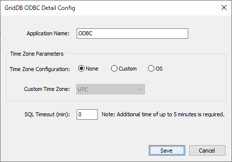

## --- Overview of application development ---

This chapter provides an overview of application development using the ODBC driver for GridDB.

## Overview of ODBC

ODBC (Open Database Connectivity) is a standard interface for accessing database management system (DBMS) from Windows-compatible application advocated by Microsoft.

<figure>
 
 <figcaption>Relationship between ODBC driver and GridDB cluster</figcaption>
</figure>

- ODBC-compatible application (Windows)
  - In order to issue SQL statements and retrieve the results, ODBC functions are processed and invoked by user-made applications and BI tools.
- ODBC driver manager (Windows)
  - For ODBC functions invoked from an ODBC-compatible application, the OS will control the connection to a specific database of the specified ODBC data source. In addition, management of the data source is also carried out.
- ODBC driver for GridDB (Windows)
  - This is a unique driver that can be used to connect to GridDB.
  - A 32-bit version and a 64-bit version are available and should be chosen carefully based on the application. For example, a 32-bit and 64-bit application should use 32-bit and 64-bit driver respectively.
- GridDB cluster (Linux)
  - This is a GridDB cluster operating in Linux OS on another machine.

## Operating environment

The ODBC driver used in GridDB can be used in the following OS.

- Windows Server 2012 R2, Windows Server 2016
- Windows 10

## Installation method

The ODBC driver for GridDB is included in the "\Windows\ODBC" directory of the installation media.

The installation method is as follows.

**When installing a 64-bit driver**

1. Select the "GridStoreODBC_64bit_setup.bat", right-click, and select Run as administrator.
2. Check that the following files are copied to the following directory: `C:\Program Files\TOSHIBA\GridStore\bin`.

 - GridStoreODBC64.dll
 - msvcp140.dll
 - vcruntime140.dll
 - vcruntime140_1.dll
 - gridstore_advanced.dll
 - libssl-1_1-x64.dll
 - libcrypto-1_1-x64.dll

3. Click the Windows button (Start), enter SystemPropertiesAdvanced.exe to open the , System Properties window and then click "Environment Variables" to open the settings screen for environment variables. Select Path under system environment variables, click on Enter, and add the installation directory `C:\Program Files\TOSHIBA\GridStore\bin` where the above files are located.


4. Make sure the following directories do not contain libssl-1_1-x64.dll and libcrypto-1_1-x64.dll. The SSL function of the ODBC drivers for GridDB uses these libraries. Be aware of the fact those libraries contained in the following directories are used in preference to those in the media package. If the following directories do contain these libraries, place those libraries contained in the media package in the current directory where software which uses ODBC is located.

- C:\Windows
- C:\Windows\System32


**When installing a 32-bit driver**

1. Select the "GridStoreODBC_32bit_setup.bat", right-click, and select Run as administrator.
2. Check that the following files are copied to the following directory: `C:\Program Files (x86)\TOSHIBA\GridStore\bin`

 - GridStoreODBC32.dll
 - msvcp140.dll
 - vcruntime140.dll
 - gridstore_advanced.dll
 - libssl-1_1.dll
 - libcrypto-1_1.dll

3. Click the Windows button (Start), enter SystemPropertiesAdvanced.exe to open the , System Properties window and then click "Environment Variables" to open the settings screen for environment variables. Select Path under system environment variables, click on Enter, and add the installation directory `C:\Program Files(x86)\TOSHIBA\GridStore\bin` where the above files are located.


4. Make sure the following directories do not contain libssl-1_1.dll and libcrypto-1_1.dll. The SSL function of the ODBC drivers for GridDB uses these libraries. Be aware of the fact those libraries contained in the following directories are used in preference to those in the media package. If the following directories do contain these libraries, place those libraries contained in the media package in the current directory where software which uses ODBC is located.

- C:\Windows
- C:\Windows\SysWOW64

## Registration of ODBC data source

In order to access the GridDB database using GridDB ODBC, it is necessary to register the ODBC data source in advance.  Registration of the ODBC data source is performed with the following procedure.

**For 64-bit**

1. Start [ODBC data source (64-bit)] from [Management tools].

2. Create a system data source (system DSN). Select "GridStore ODBC (x64)" when specifying the driver.
   
   <figure>
    
    <figcaption>Create system DSN</figcaption>
   </figure>

3. Set up the connection data to the GridDB cluster when the GridDB ODBC setup screen appears.
   
   <figure>
    
    <figcaption>Setup screen</figcaption>
   </figure>

[Input items]

- Data Source
  
  - Specify the data source name to be registered to the ODBC driver manager.
  - The application will specify the data source name specified here to connect to the GridDB cluster.

- Cluster Configuration "Multicast" "Fixed List" "Provider"
  
  - Select the method to connect a GridDB cluster. It needs to be matched with the cluster configuration on a server.

- Destination
  
  - For "Multicast", the value of `/sql/notificationAddress` and the value of `/sql/notificationPort` in the cluster definition file (gs_cluster.json) of GridDB node need to be specified.
    - Default: 239.0.0.1:41999
  - For "Fixed List", it is necessary to concatenate the follwoing items in the GridDB node cluster definition file (gs_cluster.json) with :, and specify the concatenated value of each node with a comma as a separator: `/sql/address` and `/sql/port` of `/cluster/notificationMember`.
    - e.g. (3 nodes): 192.168.10.11:20001,192.168.10.12:20001,192.168.10.13:20001
  - For "Provider", the value of `/cluster/notificationProvider/url` in the cluster definition file (gs_cluster.json) of the GridDB node needs to be specified.
    - Example: http\://example.com/notification/provider

- Cluster Name
  
  - Specify the cluster name of GridDB cluster.
  - Value of `/cluster/clusterName` in the cluster definition file (gs_cluster.json) of the GridDB node needs to be specified.

- Database
  
  - Specify the database in the cluster.
  - Database is a logical data management unit created in a cluster database. Default value is "public" (default database).

- User Name
  
  - Specify the user name connected to GridDB cluster.

- Password
  
  - Specify the password of the user mentioned above.

- SSL mode "Disabled" "Preferred" "Verify"

  - To disable SSL communication regardless of the settings on the GridDB cluster, specify "Disabled"; to enable SSL communication according to the settings on the GridDB cluster, specify "Preferred"; to enable SSL communication and perform server certificate verification, specify "Verify".

- SSL Cert File Path
 
  - Specify the path to the certificate issued by the Certificate Authority (CA). This is valid when SSL mode is set to Verify.

    [Note]
  - To confirm the connection to the GridDB cluster using the Connect Test button, exit from the ODBC data source administrator and restart connection reconfirmation.

- Authentication "INTERNAL" "LDAP"

  - To use internal authentication to authenticate with the GridDB cluster, specify "INTERNAL"; to validate LDAP authentication, specify "LDAP".

- Interface Address

  - To configure the cluster network in multicast mode when multiple network interfaces are available on the machine where the ODBC drivers are installed, the address of the interface to receive the multicast packets from can be specified.  It is not a mandatory setting.

[Buttons]

- Connect Test
  - Check the connection to the GridDB cluster.
- Save
  - Save the configurations to the registry and close the dialog.
- Cancel
  - Cancel the input value. Discard any changes made.
- Detail Settings
  - Open the detailed configuration screen. For details, see [Registration of detailed configuration](#register_detail_settings).

**For 32-bit**

1. Start [ODBC data source (32-bit)] from [Management tools].
2. Create a system data source (system DSN). Select "GridStore ODBC (x86)" when specifying the driver.
3. Set up the connection data to the GridDB server in the GridStore ODBC setup screen. The configuration method is the same as the 64-bit version.

[Notice]

- If [Data source (ODBC)] is started from the [Management tools] in a 64-bit OS, the 64-bit ODBC administrator will be started and it will not be possible to configure the 32-bit settings.
- Only GridDB cluster configured with multicast method can be connected.


<a id="register_detail_settings"></a>

## Registration of detailed configuration information

The detailed settings are optional, so set them when necessary.

<figure>
 
 <figcaption>Detailed configuration screen</figcaption>
</figure>

[Input items]

- Application Name
  - This item is used to identify the connection source application. Displayed when connection information and running events are checked with the operation tool gs_sh. The default value is "ODBC".
- Time Zone Configuration: "None", "Custom", "OS"
  - Defines the way to set the time zone. Time zone information is passed when connected to the GridDB server. It is also used in offset calculation to get time information using, such as, SQLFetch() function. The default value is "None."
  - For "None", the time zone is not considered: as in the case of UTC settings.
  - For "Custom", select a time zone from Custom Time Zone. Daylight saving time is not considered.
  - For "OS", the Windows time zone setting is obtained just before connecting to the GridDB server. When failed to obtain the OS time zone, the system operates as in the way "None" is selected. Daylight saving time cannot be used. If daylight saving time is already set when the Save button is clicked, an error occurs and the setting is switched to "None".
- Custom Time Zone
  - Select the time zone from the pull-down menu.
  - Only valid when Time Zone Configuration is set to "Custom".
- SQL Timeout (min)
  - Set the timeout time during SQL execution. The unit is minute. The minimum value is 0 and the maximum value is 1440 (24 hours). When 0 is set, timeout processing is not performed. The default setting is 0. Timeout processing may not be completed in the specified time, and additional time of up to about 5 minutes may be required.

[Buttons]

- Save
  - Save the configurations to the registry and close the dialog.
- Cancel
  - Cancel the input value. Discard any changes made.

## Connection method

If a BI/ETL tool is used, please specify the data source name set in the "GridStore ODBC setup screen".

If ODBC API is used, specify the data source name set in the "GridStore ODBC setup screen" as well.

- [Example] Specify in the second argument for SQLConnect functions.
  
  ```example
  SQLConnect(hdbc, (SQLTCHAR *)TEXT("GridStoreODBC-db1"), SQL_NTS, (SQLTCHAR *)TEXT(""), SQL_NTS, (SQLTCHAR *)TEXT(""), SQL_NTS);
  ```

## --- Supported APIs ---

This section describes the APIs supported by the GridDB ODBC driver.  All ODBC APIs version 3 and some of the APIs version 2 are supported by the GridDB ODBC driver.

## List of supported APIs

API support status is shown below.

| Function name               | Support status                                           |
| ------------------- | ------------------------------------------------ |
| SQLBindCol          | ✔                                                |
| SQLBindParameter    | Only return SQL_SUCCESS                                  |
| SQLBrowseConnect    | ×                                                |
| SQLCancel           | Only return SQL_SUCCESS                                  |
| SQLCloseCursor      |                                                  |
| SQLColAttribute       | △ (with some unsupported parameters)                                  |
| SQLColumnPrivileges | ✔                                                |
| SQLColumns          | ✔                                                |
| SQLConnect          | ✔                                                |
| SQLDescribeCol      | △ (with some unsupported parameters)                                  |
| SQLDescribeParam    | Only return SQL_SUCCESS                                  |
| SQLDisconnect       | ✔                                                |
| SQLDriverConnect    | ✔                                                |
| SQLEndTran          | * (Only returns SQL_SUCCESS. SQL_ERROR, SQL_INVALID_HANDLE) |
| SQLError            | ✔                                                |
| SQLExecDirect       | ✔                                                |
| SQLExecute          | ✔                                                |
| SQLFetch            | ✔                                                |
| SQLFetchScroll      | Only return SQL_SUCCESS                                  |
| SQLForeignKeys      | Only return SQL_SUCCESS                                  |
| SQLFreeHandle       | ✔                                                |
| SQLFreeStmt         | ✔                                                |
| SQLGetConnectAttr   | Only return SQL_SUCCESS                                  |
| SQLGetCursorName    | Only return SQL_SUCCESS                                  |
| SQLGetData          | ✔                                                |
| SQLGetDescField     | ×                                                |
| SQLGetDescRec       | ✔                                                |
| SQLGetDiagField     | Only return SQL_SUCCESS                                  |
| SQLGetDiagRec       | ✔                                                |
| SQLGetEnvAttr       | △ (only some parameters are supported)                                 |
| SQLGetFunctions     | ✔                                                |
| SQLGetInfo          | ✔                                                |
| SQLGetStmtAttr      | △ (with some unsupported parameters)                                  |
| SQLGetTypeInfo      | ✔                                                |
| SQLMoreResults      | ✔                                                |
| SQLNativeSql        | Only return SQL_SUCCESS                                  |
| SQLNumResultCols    | ✔                                                |
| SQLParamData        | ×                                                |
| SQLPrepare          | ✔                                                |
| SQLPrimaryKeys      | ✔                                                |
| SQLProcedureColumns | Only return SQL_SUCCESS                                  |
| SQLProcedures       | Only return SQL_SUCCESS                                  |
| SQLPutData          | ×                                                |
| SQLRowCount         | Only return SQL_SUCCESS                                  |
| SQLSetDescField     | ×                                                |
| SQLSetDescRec       | ×                                                |
| SQLSetEnvAttr       | Only return SQL_SUCCESS                                  |
| SQLSetStmtAttr      |Only return SQL_SUCCESS                                  |
| SQLSpecialColumns   | △ (Returns SUCCESS and only generates an empty ResultSet)                                               |
| SQLStatistics       | ✔                                                |
| SQLTablePrivileges  | ✔                                                |
| SQLTables           | ✔                                                |

- ✓: Supported
- partly supported with matters that require attention
- : Not supported.

See below for the API specifications.

- ODBC API Implementation Details
  - <https://msdn.microsoft.com/ja-jp/library/ms131675.aspx>

  

## --- Samples ---

Sample programs in the C language using ODBC API and VisualStudio project files are included in the file "gridstore-odbc-sample.zip". (These are stored under \Windows\ODBC in the installation media.)

The samples are written and tested (operation check) in VisualStudio 2005 SP1.

- GridStoreODBC-sample.sln
  - VisualStudio solution file
- GridStoreODBC-sample.cpp
  - Sample source
- GridStoreODBC-sample.vcproj
  - Project file

Try to perform table creation, data registration, and search. The project settings are configured for 64-bit and 32-bit use.

The following ODBC data source settings are required to execute a program.

**For 64-bit**

- Data source name: GridStoreODBC-test64bit

**For 32-bit**

- Data source name: GridStoreODBC-test32bit
