## ---  Introduction ---

This document describes design, build, and operations provided by GridDB.

It is for designers involved in system development with GridDB and administrators involved in operations management of GridDB.

This document is organized as follows:

- Overview
  - Describes an overview of the features and the architecture of GridDB required for its design, build, and operation.

- Physical design
  - Describes the design items for GridDB needed to implement the non-functional requirements of the system

- Build
  - Describes the installation and uninstallation of GridDB.

- Operation
  - Describes operations management, including monitoring and responses returned when a failure occurs


## --- Overview ---

## Features of GridDB

GridDB is a high performance distributional NoSQL-type database that delivers expandability and availability, featuring:


Data models and supporting interfaces

GridDB has a data model that evolved out of a key-value database. It stores data in a container corresponding to RDB tables.

<figure>
  
  <figcaption>Data model</figcaption>
</figure>

It supports client APIs and an SQL-like query language called TQL as the NoSQL interface, and JDBC/ODBC and SQL as the NewSQL interface.

<figure>
  
  <figcaption>NoSQL/New SQL interfaces</figcaption>
</figure>


Availability

GridDB works with the clusters consisting of multiple nodes (server process).

When a node fails, a cluster automatically detects a failure and moves the role of the failed node to another node to allow the cluster to continue running.
Further, within clusters, GridDB duplicates and multi-configures (replicate) data on multiple nodes.
As such, even after a failure has occurred, clusters automatically relocate replicas (autonomous data placement), which enables continuous data access.

<figure>
  
  <figcaption>Availability</figcaption>
</figure>


Scalability

One way to improve the performance of a cluster in GridDB is to scale up the server where the nodes are running; another is to perform a scale-out operation by adding nodes to a cluster.

In a scale-out operation, the system can be expanded online. Those nodes added to a system during a scale-out operation are easy to operate; data in the nodes will be properly placed depending on the system load.

<figure>
  
  <figcaption>Scalability</figcaption>
</figure>


High speed

To minimize latency for executing database, GridDB allocates memory and database files that threads occupy for each CPU core thread, which eliminates latency for assignment, exclusion, and synchronization.

<figure>
  
  <figcaption>High speed</figcaption>
</figure>

To achieve high speed, GridDB additionally has the following features:

- index feature
- table partitioning
- data compression
- expiration
- affinity

For details, see the [GridDB Features Reference](../3.md_reference_feature/md_reference_feature.md).


## GridDB: Architectural overview

This section gives an overview of the architecture of GridDB required for its design, build, and operation.


### Thread configuration

Nodes contain multiple threads (called services) which execute various types of processing.
This section describes thread configuration and what each thread does.

<figure>
  
  <figcaption>Service configuration</figcaption>
</figure>

| Thread name            | What thread do |
|-----------------------|--------------------------------------------------------------------------------------|
| Transaction services  | Executes transaction processing, including row registration and search operations, and database file write operations, among others. |
| Checkpoint services   | Executes checkpoint processing.                                                              |
| Cluster services  | Executes cluster configuration processing, including heartbeat and node participation and departure.                             |
| Sync services          | During partition relocation, executes long-term and short-term synchronization operations for data synchronization.                    |
| System services        | Accepts requests for production and management operations.                                                           |
| SQL services | Executes SQL processing                                                                        |


- Flow of processing from a client

  - Requested processing from a NoSQL client is assigned to transaction services where row registration, search processing, and other types of processing are executed.
  - Requested processing from a NewSQL client is first handled by SQL services to perform SQL processing, and then is assigned to transaction services.


### Data management

Database files and transaction services both of which manage data have a one-to-one relationship.

These database files have an internal structure called partition which manages multiple containers.
Each transaction service operates on only one partition; it can be executed without the need for exclusive processing from other transaction services.

<figure>
  
  <figcaption>Relationship of partitions, threads, and files managed by one node</figcaption>
</figure>


### File configuration

Files that nodes manage include definition files and database files. This section describes file configuration and content.

<figure>
  
  <figcaption>File configuration managed by nodes</figcaption>
</figure>

- definition files

  | name                       | description                                                     |
  |-----------------------------------------|----------------------------------------------------------|
  | node definition file<br>(gs_node.json)      | definition file which sets node resources and behavior.           |
  | cluster definition file<br>(gs_cluster.json) | definition file which sets cluster resources and behavior for cluster configuration. |
  | user defined file<br>(password)          | file for registering administrative users.                          |


- database files

  | name                       | description                                                                                   |
  |----------------------------|----------------------------------------------------------------------------------------|
  | data file     |  This is a file for storing data.<br>A data file can be placed after splitting it into multiple files. <br><br>number of files<br>\- One data file is created for each partition.<br>\-To place a data file after splitting it, as many files as the number of splits are created for each partition. |
  | checkpoint log file | This is a file for storing block management information for a database.<br>Block management information is written in smaller batches each time checkpoint is performed.<br>By default, a maximum of ten files are created for each partition. The number of files can be adjusted in /checkpoint/partialCheckpointInterval in the node definition file. |
  | transaction log file | This is a file for storing transaction logs.<br>Each file stores logs for those transactions executed between the start of a previo checkpoint and the start of the next checkpoint.<br>By default, a maximum of three files (current log file and previous two generations of log files) are created per partition. |


- other files

  | name                       | description                                                                                |
  |-----------------------------|------------------------------------------------------------------------------------|
  | backup files        | files created when an online backup is started. Backed-up database files and files for backup information are collectively called backup files. |
  | event log files         |  files for storing logs for node behavior, to which error and warning messages are issued.      |
  | temporary file for synchronization      | file for temporarily storing synchronous data during synchronization through partition relocation. |
  | swap file for intermediate SQL results | file for temporarily storing intermediate SQL results. Files are deleted in the event of node outage.  |


As mentioned above, each partition has its own database files consisting of one data file, checkpoint log files, and transaction log files.

In transaction log processing, data is sequentially written onto transaction log files to sync update, which provides transaction assurance.
In checkpoint processing, blocks of updated data on memory is regularly saved in data files and checkpoint log files, which provides data persistence.


### Memory structure

GridDB is provided with various memory areas to reduce disk I/O and make processing efficient.

<figure>
  
  <figcaption>Memory</figcaption>
</figure>

| name                            | description |
|----------------------------------|----------------------------------|
| database buffer               |I/O buffer for caching retrieved data.<br>It caches data image (block) retrieved from data files in memory. A larger database buffer size means blocks are more easily cached in memory, which improves search and registration performance.<br>Each node has one database buffer area; as such, multiple transaction processing threads share in its use. |
| memory area for transaction processing  | area used by transaction processing threads which perform row registration and search processing.|
| buffer for storing intermediate SQL results | area for storing intermediate results while SQL processing is taking place. <br>If the size of the intermediate results exceeds the buffer memory size limit, those results are temporarily exported in swap files for intermediate SQL results.|
| SQL work memory area | area for temporarily storing intermediate results in SQL processing, including join and aggregation operations.  |


GridDB is a hybrid-type database which uses both memory and disks.  It accelerates access using memory as data cache and stores data in disks to manage large volumes of data. A larger memory size means larger volumes of data are cached in memory, which reduces disk I/O and improves performance.


### Cluster management

GridDB configures a cluster with multiple nodes

Nodes have two roles: "master" and "follower."
A master manages the entire cluster.  All non-master nodes act as "followers."

When a cluster starts, one of the nodes composing a cluster will always be a "master." Followers then perform cluster processing including synchronous processing according to the instructions from the master.
A master node is automatically selected by GridDB.
If a master node fails, a new master will be automatically selected from a set of follower nodes to keep the cluster running.


Further, within a cluster, GridDB duplicates and multi-configures data (replicas) on multiple nodes.
Among replicas, master data is referred to as an owner, whereas duplicated data is referred to as backups.
Regardless of which node composing a cluster fails, GridDB will always continue processing through the use of replicas.
Moreover, the system automatically relocates data after a node failure (autonomous data placement) without a need for special production operations.
Data placed in the failed nodes is restored from replicas and then relocated to reach the automatically set number of replicas.

<figure>
  
  <figcaption>Replica</figcaption>
</figure>

Replicas are created per partition. If nodes are either added to a cluster or deleted from a cluster, partitions will automatically be reassigned and relocated to distribute replicas to each node.


## --- Physical design ---

Describes the design items for GridDB needed to implement the non-functional requirements of the system

## Points to consider when designing

As non-functional requirements an established system should meet, IPA (Information-Technology Promotion Agency, Japan) has formulated the "Non-Functional Requirements Grades," part of which are cited below:

"(source: Non-Functional Requirements Grades Usage Guide [Description Manual], p. 7) (c) 2010 IPA

| Non-functional requirements: Major category | Example requirements | Example implementation methods |
|------------------------|---------------|-------------|
| Availability   | - Operation schedule (operating hours, outage plans, etc.)<br>- Operation objectives for failure occurrences, disasters, etc.| - Equipment redundancy, backup center establishment, etc.<br>-Restoration/recovery methods, and restoration/recovery structure establishment |
| Performance and scalability | - Business volume, and estimates on future growth<br>- Attributes of business which will be systematized (peak times, normal operation, degraded operation, etc.) | - Sizing based on performance objectives<br>- Capacity planning (future-oriented equipment and network sizing and allocation) |
| Operability and maintainability | - System operation levels required for system operation<br >- Response levels in the event that a problem occurs | - Establishment of monitoring methods and backup methods<br>- Distribution of roles, organizational structure, training, and preparation of manuals in anticipation of problems that may arise |
| Migratability | - System migration period and schemes<br>- Types of assets to be migrated, and volume of migration | - Migration schedule establishment, migration tool development<br>- Migration organization establishment, migration rehearsal |
| Security  | Usage restrictions<br>- Unauthorized access prevention | - Access restrictions, data confidentiality<br >- Fraud tracking, monitoring, detection<br>- Information security training for operators, etc. |


To satisfy these non-functional requirements, GridDB needs the following design items:

- Data space design
- Memory space design
- Container design
- Cluster configuration design
- Network design
- Security design
- Monitoring design
- Backup design

Specific design varies considerably depending on the level and content of system requirements; this chapter focuses on points of design that should be considered to leverage "availability" and "performance and scalability" in the table above characterizing GridDB.


## Data space design

In GridDB, data is managed per unit of block, container, table, row, and partition. Data space design using these data units will be a crucial factor in determining "availability" and "performance and scalability".

<figure>
  
  <figcaption>Partition</figcaption>
</figure>


- Relationship between a block and a container
  - A block is the smallest unit of data management where row data and meta information for containers are stored. A block stores data for multiple containers.

- Relationship between containers and a partition
  - A partition which a container belong to is determined by a cluster based on a hash value calculated from a container name. The relationship between a container and a partition is permanent and does not change once a partition is determined upon creating a container.

- Relationship between a partition and a node
  - A partition is a unit of data placement between clusters. The placement of a partition is automatically determined by a cluster. The relationship between a partition and a node is fluid and a partition may move to other nodes through autonomous data placement on the occurrence of a failure.

- Access to a container in the same partition
  - Operations on a set of containers belonging to the same partition are processed by one processing thread (transaction service). Therefore, operations on this set of containers are subsequently executed.


<figure>
  
  <figcaption>Relationship of processing threads, partitions, and database files</figcaption>
</figure>


[notes]
- Node affinity features can force related containers to be stored in the same partition. This can reduce load during network access by tables placed in other nodes within the same cluster when SQL tables are joined in GridDB.  


The next several subsections summarize points of design for the following items:

- block size
- number of partitions
- number of processing threads (transaction services and SQL services)
- checkpoint processing
- file configuration


<a id="block_size"></a>
### Block size

A block is a physical data unit for storing row data and meta information for containers among others and is the smallest unit of disk I/O.

<figure>
  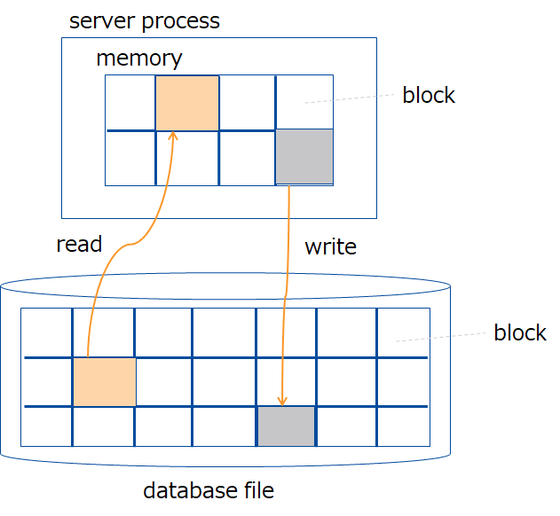
  <figcaption>Block</figcaption>
</figure>


Select the block size from 64KB, 1MB, 4MB, 8MB, 16MB and 32MB. The default is 64 KB. Normally, the default works fine; no change is necessary.

Note that the limit of the number of columns in a container varies depending on the block size.
To create more columns than the limit of the number of columns for the block size of 64 KB, change the block size.
For details about upper limits, see the section "System limiting values" in the [GridDB Features Reference](../3.md_reference_feature/md_reference_feature.md).


Data stored in a block

Data stored in a block are of several types, including row data, meta information for containers, and index data. Data is categorically organized by the types of data and stored in a block.

| block type  | description                              |
|-------------------|-----------------------------------|
| metaData	        | block for storing meta information for containers. |
| rowData	          | block for storing row data for containers (without expiration settings). |
| mapData	          | block for storing index data for containers (without expiration settings). |
| batchFreeRowData	| block for storing row data for containers (with expiration settings). |
| batchFreeMapData	| block for storing index data for containers (with expiration settings). |

One block stores data for multiple containers. Data is stored in the order that it was registered or updated by an application.
Storing data which are close in time or type in the same block will localize data and improve memory efficiency. It executes search processing for time-series data on the condition of elapsed time with less resources and at high speed.

**related parameters**

- cluster definition file (gs_cluster.json)

  | parameter                | initial value | description  | changes made after startup |
  |----------------------------------|----------------|----------------------------------------|-----|
  | /dataStore/storeBlockSize        | 64KB           |  block size                          | not allowed |


[notes]
- After the initial launch of nodes, block size cannot be changed.
- Specify the same block size for the entire nodes configuring a cluster.
- The heading "changes made after startup" in the table above denotes whether the parameter can be changed after launching.
  - not allowed: Once nodes are launched, the parameter cannot be changed. Initialization of database files is necessary to change parameters.
- The data affinity feature makes it possible to store only those data that are highly relevant to each block. This facilitates the localization of data access and thereby can increase the memory hit rate.
- Also, by specifying the string "#unique" for hint information provided by the data affinity feature, it is possible to occupy blocks on a per-container basis and place data. This can speed up scanning and data deletion performed for each container.
- For details on data affinity, see the "[GridDB Features Reference](../3.md_reference_feature/md_reference_feature.md)" .

### Number of partitions

As one way to manage data in a cluster, containers are managed using data boxes called partitions.

- Every container should belong to one partition, which stores multiple containers.
- Containers are assigned to transaction services and database files on a per-partition basis.

<figure>
  
  <figcaption>Relationship of partitions, threads, and files managed by one node</figcaption>
</figure>


The default number of partitions is 128. Normally, the default works fine. If, however, the following conditional expression is not met, increase the number of partitions.

**number of partitions \>= concurrency of transaction services X number of configuration nodes in a cluster**

- If the conditional expression is not met, transaction services with no partitions assigned will be created.
  Set the number of partitions so as to meet the expression above.
  - [Example] If concurrency = 32 and number of nodes =5,
    - The default number of partitions (128) does not meet the conditional expression: 128 < (32 x 5 =160)
    - Set the number of partitions to 160 or over.


**related parameters**

- cluster definition file (gs_cluster.json)

  | parameter                | initial value | description  | changes made after startup |
  |--------------------------------|---------------|----------------------------------------|-----|
  | /dataStore/partitionNum        | 128           | number of partitions                       | not allowed |

- node definition file (gs_node.json)

  | parameter                | initial value | description  | changes made after startup |
  |--------------------------------|---------------|----------------------------------------|-----|
  | /dataStore/concurrency         | 4             |  concurrency of transaction processing threads       | possible (Restart nodes)  |

[notes]
- The heading "changes made after startup" in the table above denotes whether the parameter can be changed after launching.
  - not allowed: Once nodes are launched, the parameter cannot be changed. Initialization of database files is necessary to change parameters.
  - possible (Restart nodes): The parameter can be changed by modifying the definition file specifying the parameter and then restarting the nodes.


<a id="num_of_threads"></a>
### Number of processing threads

A GridDB node consists of one process. Within a process are multiple threads (called services) running various operations.

This subsection describes how to determine the concurrency of "transaction services" and "SQL services" among the services available.


<figure>
  
  <figcaption>Service configuration</figcaption>
</figure>


| Thread name | Number of threads<br>(default) | What threads do |
|-----------------------|------------|--------------------------------------------------------------------------------------|
| Transaction services | 4 (default can be set) | Executes transaction processing, including row registration and search operations, and database file write operations, among others. |
| Checkpoint services   | 1 | Executes checkpoint processing                                                              |
| Cluster services  | 1 | Executes cluster configuration processing, including heartbeat and node participation and departure.                             |
| Sync services          | 1 | During partition relocation, executes long-term and short-term synchronization operations for data synchronization.                   |
| System services        | 1 | Accepts requests for production and management operations.                                                           |
| SQL services | 4 (default can be set) | Executes SQL processing                                                                        |

A processing done by each is called an "event." Each service has one event queue and sequentially processes those events registered in the event queue. For one service A to ask another service B to process events, service A registers them in the event queue which service B has.

<figure>
  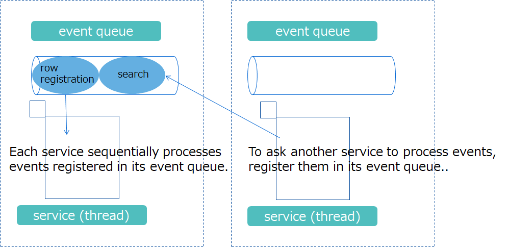
  <figcaption>Events processed by services</figcaption>
</figure>

- Types of events that can be registered in an event queue vary depending on the types of threads.
- Events registered in an event queue are sequentially processed by the corresponding threads. They are not processed in parallel.
- Information on ongoing events can be checked using the operation tool gs_sh.
  For details, see [GridDB Operation Tools Reference](../5.md_reference_operation_tool/md_reference_operation_tool.md).

[notes]
- Only transaction services and SQL services can set the number of threads using a node definition file.


The threads that especially affect the parallel performance in search and registration are the threads that run transaction processing (transaction services) and threads that run SQL processing (SQL services).  Set the concurrency of these processing threads to match the number of CPU cores of the machine that runs nodes.


- concurrency of transaction services
  - Transaction services are the threads that execute row registration and search operations, database file write processing, and other processing.
  - Increasing the concurrency of transaction services improves parallel accessibility to multiple containers.
  - Transaction services (threads) and database files (files) are in a one-to-one relationship, the latter of which are also in a one-to-one relationship with containers (data) as shown in the figure below:
    - Data in container A is processed by transaction service 0 and stored in database file 0. Transaction services 0 and 1 never access data in container A simultaneously.
    - Separating resources for data, threads, and files eliminates resource exclusion and locking conflicts, enabling fast processing.

    <figure>
      
      <figcaption>Relationship of data, threads, and files managed by one node</figcaption>
    </figure>

- concurrency of SQL services
  - SQL services are the threads that run SQL processing.
  - In SQL services, data and files are not related with each other as in transaction services. To access database files or run other transaction services, use transaction services.


Set the concurrency considering the following points:

- It is recommended to increase the concurrency of transaction services to match the number of CPU cores of the machine running the nodes.
  - Increasing concurrency improves parallel accessibility to multiple containers.
  - Note that increasing concurrency does not improve the processing performance of the operation on the same container, which is handled by one thread.

- It is recommended to make sure that the total of the concurrency of transaction services and SQL services does not exceed the number of the machine's CPU cores.
  - concurrency of transaction services (/dataStore/concurrency) + concurrency of SQL services (/sql/concurrency)

[notes]
- Concurrency of transaction and SQL services can changed by restarting the node.


**related parameters**

- node definition file (gs_node.json)

  | parameter                | initial value | description  | changes made after startup |
  |----------------------------------|----------------|-------------------------------------------------------|------------|
  | /dataStore/concurrency         | 4             |  concurrency of transaction processing threads          | possible (Restart nodes)  |
  | /sql/concurrency       | 4             | concurrency of SQL processing threads | possible (Restart nodes) |


[notes]
- The heading "changes made after startup" in the table above denotes whether the parameter can be changed after launching.
  - not allowed: Once nodes are launched, the parameter cannot be changed. Initialization of database files is necessary to change parameters.
  - possible (Restart nodes): The parameter can be changed by modifying the definition file specifying the parameter and then restarting the nodes.


### Checkpoint processing

Checkpoint processing refers to a processing in which updated blocks in a database buffer are written to data files and checkpoint log files.

In checkpoint processing, parameters are available to set the run cycle of checkpoints.

<figure>
  
  <figcaption>Executing checkpoint processing</figcaption>
</figure>

While checkpoint is running, block management information is split into chunks and written to checkpoint log files. The number of splits can be specified by the parameter, but in most cases, you do not need to change the default value. Setting a higher value can increase the amount of writing done to checkpoint log files for each writing session, but at the same time could possibly increase the recovery time taken during a node startup.

A checkpoint processing is run on the following occasions:

| occasion  |  description                                                                 |
|------------------|----------------------------------------------------------------------|
| regular run | automatically run at regularly scheduled intervals (Specify the cycle using a parameter. Regular run can be temporarily deactivated.). |
| manual run  | run when the user runs the gs_checkpoint command.).                      |
| node start/outage |  automatically run after a recovery process during a node startup or when stopping nodes in a normal manner. |
| long-term synchronization start/end  | automatically run when starting/ending long-term synchronization.                           |


Additionally, it is possible to specify whether to compress data files. Compressing data files can reduce the storage cost that increases in proportion to the amount of data.
For details on the data compression feature, see the section on "data block compression" in [GridDB Features Reference](../3.md_reference_feature/md_reference_feature.md).


**related parameters**

- node definition file (gs_node.json)

  | parameter                | initial value | description  | changes made after startup |
  |----------------------------------|----------------|-------------------------------------------------|----------|
  | /checkpoint/checkpointInterval   | 60s            | run cycle of checkpoints | possible (Restart nodes) |
  | /checkpoint/partialCheckpointInterval  |  5       | number of splits for processing to write block management information to checkpoint log files | possible (Restart nodes) |
  | /dataStore/storeCompressionMode  | NO_COMPRESSION | setting for exporting compressed data files<br>do not compress: "NO_COMPRESSION" or 0<br>compress: "COMPRESSION" or 1 | possible (Restart nodes) |


[notes]
- The heading "changes made after startup" in the table above denotes whether the parameter can be changed after launching.
  - possible (Restart nodes): The parameter can be changed by modifying the definition file specifying the parameter and then restarting the nodes.


### File configuration

Files that GridDB nodes create or output while running include database files and backup files.

Database files and backup files are characterized by a large file size, and their disk I/O have a great impact on performance; specify the appropriate deployment directory for these files, considering storage capacity and I/O performance.

<figure>
  
  <figcaption>Database files and other output files</figcaption>
</figure>


The default deployment directory is the directory under the GridDB home directory (/var/lib/gridstore).

- deployment directory for database files
  - Data files, checkpoint log files, and transaction log files are collectively called database files.
  - Specify the DB directory to store data files and checkpoint log files, and specify the txnlog directory to store transaction files. Placing the DB and txnlog directories on separate physical disks can enable load balancing among disks.
  - The number of directories equal to the that of partition IDs are automatically created under DB and txnlog directories. Placing each directory thus created on separate physical disks enables load balancing among disks.

- deployment directory for backup files
  - Set up the deployment directory for backup files to deploy them in a separate physical disk from that of database files, considering physical disk failures.
  - Performing a full backup requires the same capacity as database files.


**list of output files**

- database files

  | name                       | description                                                                        | file name |
  |----------------------------|----------------------------------------------------------------------------|-------------|
  | data file             | file for storing data.<br><br>number of files<br>\-One data file is created for each partition by default.<br>\-The data file can be split by modifying the settings. The number of splits of the data file can be defined in /dataStore/dbFileSplitCount in the node definition file.<br><br>file size<br>\- If the free space in the file runs out, the size of the file is automatically extended.| /\<PartitionID\>/\<PartitionID\>\_part\_\<n\>.dat<br> (n: consecutive number from 0) |
  | checkpoint log file   | file for storing block management information for a database.<br>When checkpoint is running, block management information is split into chunks and then written to checkpoint log files. <br><br>number of files<br>\- By default, a maximum of 10 files are retained for each partition. The number of files can be adjusted by /checkpoint/partialCheckpointInterval in the node definition file. | /\<PartitionID\>/\<PartitionID\>\_\<CheckpointNumber\>.cplog||
  | transaction log file  | file for storing transaction log.<br>Each file stores logs for those transactions executed between the start of a previous checkpoint and the start of the next checkpoint.<br><br>number of files<br>\- By default, a maximum of three files (current log file and previous two generations of log files) are retained per partition. | /\<PartitionID\>/\<PartitionID\>\_\<CheckpointNumber>.xlog|

- other files

  | name                       | description                                                                                |
  |--------------------------------|------------------------------------------------------------------------------------|
  | backup files             | files created when an online backup is started. Backed-up data files, checkpoint log files, transaction log files, and files for backup information are collectively called backup files. |
  | event log files          | files for storing logs for node behavior, to which error and warning messages are issued.      |
  | temporary file for synchronization      | file for temporarily storing synchronous data during synchronization through partition relocation. |
  | swap file for intermediate SQL results | file for temporarily storing intermediate SQL results. Files are deleted in the event of node outage.  |


**related parameters**

- node definition file (gs_node.json)

  The file origin of a node definition file is the GridDB home directory if the directory path is relative.

  | parameter                | initial value | description  | changes made after startup |
  |----------------------------------|----------------|-------------------------------------------------------|------------|
  | /dataStore/dbPath                | data           | deployment directory for data files and checkpoint log files                    | possible (Restart nodes)|
  | /dataStore/transactionLogPath               |txnlog          | deployment directory for transaction log files                    | possible (Restart nodes)|
  | /dataStore/backupPath            | backup         |  deployment directory for backup files                     | possible (Restart nodes)|
  | /dataStore/syncTempPath          | sync           | deployment directory for temporary files for synchronization                    | possible (Restart nodes)|
  | /system/eventLogPath             | log            | deployment directory for event log files                     | possible (Restart nodes)|
  | /sql/storeSwapFilePath           | swap           | deployment directory for swap files for intermediate SQL results     | possible (Restart nodes)|
  | /dataStore/dbFileSplitCount      | none       | number of data file splits <br>Example: If the number of data file splits is equal to four, data files are split into four files for each partition to create /\<PartitionID\>/\<PartitionID\>\_part\_0.dat  \-/\<PartitionID\>/\<PartitionID\>\_part\_3.dat. | not allowed  |

[notes]
- The heading "changes made after startup" in the table above denotes whether the parameter can be changed after launching.
  - not allowed: Once nodes are launched, the parameter cannot be changed. Initialization of database files is necessary to change parameters.
  - possible (Restart nodes): The parameter can be changed by modifying the definition file specifying the parameter and then restarting the nodes.

## Memory space design

GridDB is a hybrid-type database which uses both memory and disks.  It accelerates access using memory as data cache and stores data in disks to manage large volumes of data.

As shown in the figure below, a larger memory size means larger volumes of data are cached in memory, which reduces disk I/O and improves performance.  Memory size thus has a great impact on the performance of GridDB. Therefore, memory space should be designed with the system's performance requirements and the amount of data in mind.

<figure>
  
  <figcaption>Combined use of memory and disks</figcaption>
</figure>


GridDB nodes have various types of buffers and memory areas for different uses. The main types of memory are:

<figure>
  
  <figcaption>Memory</figcaption>
</figure>

| name                            | description                                        |
|---------------------------------|--------------------------------------------|
| database buffer  | I/O buffer for caching retrieved data.<br>caches data image (block) retrieved from data files in memory. A larger database buffer size means blocks are more easily cached in memory, which improves search and registration performance. <br>Each node has one database buffer area; as such, multiple transaction processing threads share in its use.|
| memory area for transaction processing  | area used by transaction processing threads which perform row registration and search processing.|
| buffer for storing intermediate SQL results | area for storing intermediate results while SQL processing is taking place. <br>If the size of the intermediate results exceeds the buffer memory size limit, those results are temporarily exported in swap files for intermediate SQL results.  |
| SQL work memory area | area for temporarily storing intermediate results in SQL processing, including join and aggregation operations.  |


In designing memory space, it is necessary to design the upper size limit and other related parameters for each memory area.
A key point here is the memory sizes of "database buffers" and "memory areas for SQL processing."

<figure>
  
  <figcaption>Memory</figcaption>
</figure>


The size of "database buffers" has the greatest impact on the system's performance.  If there is space in physical memory, it is recommended to assign as much memory size as possible to database buffers.

- Considering the characteristics of data stored in GridDB, classify data into frequently used data and infrequently used data.

  - Often, it is advisable to classify data based on the elapsed time for time-series data.
  - Examples
    - frequently used data → all sensor data from the previous hour
    - infrequently used data → a year-old data
    - Data for the past year is stored, but the search range used for regular tasks is limited to the data from the previous month.
    - Production data on five factories is stored, but only one factory's data requires high-speed searching.

  - To classify data based on the elapsed time, look for the data which most requires performance and examine the type and age of such data.

- Set the size of a database buffer so as to allow for the amount of frequently used data.


As for the size of a memory buffer for SQL processing, conduct its assessment with a typical SQL query used by the system and set the memory size.

- required design items
  - Determine the buffer size to match the amount of data to be used.

    | buffer name	          | Guidelines for design                      |
    |---------------------|--------------------------------|
    | database buffer  | Estimate the size of the data in the range frequently searched for and set the memory size. |
    | SQL-related buffer    | Conduct its assessment with an SQL query used by the system and set the memory size. |


- design items to be changed as needed

  - Change the buffer size depending on the operational status.

    | buffer name                   | The buffer size needs to be changed, if: |
    |--------------------------------|---------------------------------------------------|
    | memory area for transaction processing | a memory shortage error [CM\_MEMORY__LIMIT] occurs due to TQL or SQL operations. |


The next several subsections summarize points of design for the following items:
- database buffer
- memory area for transaction processing
- memory area for SQL processing
- Memory for other purposes


<a id="store_memory"></a>
### Database buffer

This is an area for caching in memory the blocks read from a data file.

A larger database buffer size means data blocks reside in memory, which improves search and registration performance.

Specify the upper buffer size limit using a node definition file. If the buffer reaches its capacity, old blocks are written to a data file using LRU to create a space and read the remaining blocks from files. Read operations from files and write operations to files are called swapping. If blocks are in use and hence cannot be loaded to create a space, the buffer size is temporarily expanded.
If blocks are in use and hence cannot be loaded to create a space, the buffer size is temporarily expanded. When the processing ends and a space is no longer needed, the buffer size is reduced to its upper limit.

The internal buffer is partitioned on a per-partition basis before use. The size allocated to each partition is dynamically determined by nodes according to the amount of data and accessibility status.

<figure>
  
  <figcaption>Database buffer</figcaption>
</figure>

Immediately after starting up nodes, no blocks are yet read into a database buffer. Therefore, in search and registration processing immediately after a startup, swap processing occurs frequently as a result of reading blocks, which may degrade the speed performance.


**related parameters**

- node definition file (gs_node.json)

  | parameter                | initial value | description  | changes made after startup |
  |------------------------------|-----------|-----------------------------------|-------------|
  | /dataStore/storeMemoryLimit  | 1024MB    | upper size limit of a database buffer   | allowed (online) |

  [notes]
  - The upper size limit can also be changed online while starting nodes. To make the change permanent, stop nodes and modify the node definition file.
  - To the upper size limit of a database buffer, allocate 60 to 70% of the physical memory available for GridDB. After launching, check the amount of swapping. If there is an excessive amount of swapping, a buffer shortage occurs which may downgrade performance. Consider adding memory and changing the upper size limit of a database buffer.
    - For details about swapping, see the column "How to check related information" in the table below to check information about read and write in swapping.
  - The heading "changes made after startup" in the table above denotes whether the parameter can be changed after launching.
    - allowed (online): The parameter can be changed online while starting nodes. To make the change permanent, modify the node definition file.


**How to check related information**

- Information on the setup value and the current value can be checked by running the operation command gs_stat while running nodes.

  | display item for gs_stat in JSON format     | setup value/current value | description                                               |
  |--------------------------------|--------------|----------------------------------------------------|
  | /performance/storeMemoryLimit  | setup value | upper size limit of a database buffer (in bytes)             |
  | /performance/storeMemory       | current value | current size of a database buffer (in bytes)             |
  | /performance/swapRead          | current value | number of reads from files in swapping (total) (unit: number of times)     |
  | /performance/swapReadSize      | current value | read size from files in swapping (total) (in bytes) |
  | /performance/swapReadTime      | current value | load time from files in swapping (total) (in milliseconds)   |
  | /performance/swapWrite         | current value | number of writes to files in swapping (total) (unit: number of times)       |
  | /performance/swapWriteSize     | current value | write size to files in swapping (total) (in bytes)   |
  | /performance/swapWriteTime     | current value | write time to files in swapping (total) (in milliseconds)     |

  [example of executing the command]
  ```
  $ gs_stat -u admin/admin -s 192.168.0.1:10040
  {
    ：
    "performance": {
      "storeMemory": 4294967296,
      "storeMemoryLimit": 4294967296,
      "storeTotalUse": 9792126976,
      "swapRead": 2072705,
      "swapReadSize": 135836794880,
      "swapReadTime": 3920574,
      "swapWrite": 2172,
      "swapWriteSize": 142344192,
      "swapWriteTime": 601,
      ：
  ```

### Memory area for transaction processing

This is a memory area used in transaction services where row registration and search processing are performed. Each transaction service retrieves from a memory area the portion of memory needed for processing before use. After one transaction process ends, the memory that has been made available is released back to the memory area.

The number of transaction services (concurrency) is equivalent to /dataStore/concurrency (4 by default).

<figure>
  
  <figcaption>Memory area for transaction processing</figcaption>
</figure>

If all the memory in a memory area is in use, and memory required for transaction services cannot be reclaimed, an error will occur.

A transaction may use a large amount of memory in such processing as running tens of millions of hits of queries using TQL, registering huge sized BLOBs, and registering a bulk of huge sized data using MultiPut.  Set the upper size limit of a memory area according to the content of transaction processing and the number of transaction services (concurrency: /dataStore/concurrency).


**related parameters**

- node definition file (gs_node.json)

  | parameter                | initial value | description  | changes made after startup |
  |----------------------------------|-----------|----------------------------------------------|-------------|
  | /transaction/totalMemoryLimit    | 1024MB    | upper size limit of a memory area for transaction processing | possible (Restart nodes) |
  | /transaction/workMemoryLimit     | 128MB     | upper size limit of the memory used by one transaction processing thread | possible (Restart nodes) |

  [notes]
  - The upper size limit cannot be changed online. To change the upper size limit, stop nodes and modify the node definition file.
  - If the memory needed for processing cannot be reclaimed, an error will occur. Check the current value set for the upper memory size limit and consider adding memory and changing the upper limit.
  - The heading "changes made after startup" in the table above denotes whether the parameter can be changed after launching.
    - possible (Restart nodes): The parameter can be changed by modifying the definition file specifying the parameter and then restarting the nodes.


**How to check related information**

- Information on the setup value can be checked by running the operation command gs_paramconf while running nodes.

  | display item for gs_paramconf in JSON format     | setup value/current value | description                      |
  |--------------------------------|-----------------|---------------------------|
  | /transaction/totalMemoryLimit  | setup value           | upper size limit of a memory area for transaction processing (in bytes) |
  | /transaction/workMemoryLimit   | setup value           | upper size limit of the memory used by one transaction processing thread (in bytes) |


### Memory area for SQL processing

There are two different types of memory areas for SQL processing: the buffer for storing intermediate SQL results and SQL work memory areas.

The buffer for storing intermediate SQL results is a memory for storing the data in the tables for intermediate results of such tasks in SQL processing as scan and join.
If the size of the intermediate results exceeds the buffer memory size limit, those results are temporarily exported in swap files for intermediate SQL results.

When executing analytical queries on large-volume data using an SQL, it is recommended to set the value of this buffer as high as possible, considering the balance with the database buffer.

SQL work memory is memory used in processing tasks in SQL processing. There is no need to change the default value for work memory.

However, be sure to set the sizes of a buffer for storing intermediate results and of work memory so as to satisfy the following expression:

- upper limit of a buffer for storing intermediate results (storeMemoryLImit) >= upper limit of work memory (workMemoryLImit) * concurrency for SQL processing

Unless the above expression is satisfied, exporting to swap files for intermediate results takes place often.

**related parameters**

- node definition file (gs_node.json)

  | parameter                | initial value | description  | changes made after startup |
  |--------------------------|-----------|----------------------------------------------------|--------------|
  | /sql/storeMemoryLimit    | 1024MB    | upper size limit of buffer for storing intermediate SQL results                 | possible (Restart nodes)   |
  | /sql/workMemoryLimit     | 32MB      | upper size limit of an SQL work memory buffer                  | possible (Restart nodes)   |
  | /sql/workCacheMemory     | 128MB     | of the memory specified in workMemoryLimit, the portion of the memory to cache instead of releasing it after use | possible (Restart nodes) |
  | /sql/storeSwapFilePath   | swap      | directory for deploying files for storing intermediate SQL results    | possible (Restart nodes)   |
  | /sql/concurrency         | 4         | concurrency for SQL processing                                    | possible (Restart nodes)   |

  [notes]
  - The upper size limit cannot be changed online. To change the upper size limit, stop nodes and modify the node definition file.
  - If the memory for SQL processing runs out, swapping (write operations to and read operation from swap files) will be performed.
    - If excessive swapping is occurring, increase the size of the memory for SQL processing. See the second table under "How to check related information" below and check the items sqlStoreSwapXXXX to track how much swapping is occurring.
  - The heading "changes made after startup" in the table above denotes whether the parameter can be changed after launching.
    - possible (Restart nodes): The parameter can be changed by modifying the definition file specifying the parameter and then restarting the nodes.


**How to check related information**

- Information on the setup value can be checked by running the operation command gs_paramconf while running nodes.

  | display item for gs_stat in JSON format     | setup value/current value | description                                               |
  |-----------------------------------|--------------|----------------------------------------------------|
  | /sql/storeMemoryLimit             | setup value | upper size limit of buffer for storing intermediate SQL results                           |
  | /sql/workMemoryLimit              | setup value | upper size limit of an SQL work memory buffer                               |
  | /sql/workCacheMemory              | setup value |  of the memory specified in workMemoryLimit, the portion of the memory to cache instead of releasing it after use |
  | /sql/storeSwapFilePath            | setup value | directory for deploying files for storing intermediate SQL results               |    


- Information on the current value can be checked by running the operation command gs_stat while running nodes.

  | display item for gs_stat in JSON format     | setup value/current value | description                                               |
  |-----------------------------------|--------------|----------------------------------------------------|
  | /performance/sqlStoreSwapRead         | current value | number of reads from files in swapping (total) (unit: number of times)     |
  | /performance/sqlStoreSwapReadSize       | current value | read size from files in swapping (total) (in bytes) |
  | /performance/sqlStoreSwapReadTime      | current value | load time from files in swapping (total) (in milliseconds)   |
  | /performance/sqlStoreSwapWrite           | current value | number of writes to files in swapping (total) (unit: number of times)       |
  | /performance/sqlStoreSwapWriteSize      | current value | write size to files in swapping (total) (in bytes)   |
  | /performance/sqlStoreSwapWriteTime     | current value | write time to files in swapping (total) (in milliseconds)     |


### Memory for other purposes

#### Memory for retaining container and data file management information

Memory is not only used for a buffer for processing, but also used to retain the management information on containers and files. The size of the next two types of memory (memory for container management and memory for data management) increases relative to the number of containers and the amount of data, respectively.

- Memory for container management
  - Always uses memory approximately amounting to (number of containers in the node) * 64 bytes.
  - For example, if the number of containers is 10 million, then approximately 640 MB of memory would be used.

- Memory for data file management
  - Always uses memory approximately amounting to (total amount of data) divided by (block size) * 32 bytes.
  - For example, if the total amount of data is 1 TB and the block size is 64 KB, then approximately 500 MB of memory would be used.   


## Container design

The optimal container design largely depends on system and application requirements.
This section describes the basics that help you with container design and provides related information.

### Recommended design

**Store data generated daily in time-series containers.**

Containers are of two types: collections and time-series containers.

First, see if time-series containers can be used to store data; only when time-series containers are not available, consider using collections.


Use time-series containers when device sensor data and logs are generated on a minute-by-minute basis that results in a continuous increase, like IoT systems.
Time-series containers are optimized for storing and referencing time-series data. As such, database buffer is more efficiently used than when collections are used.


The features of time-series containers include operation specific to time-series data. Gaining a better understanding of these features helps you with container design.

[References]
- This documentation (GridDB Database Administrators Guide)
  - [Database buffer](#store_memory)
- GridDB Features Reference
  - [Data model](../3.md_reference_feature/md_reference_feature.md#data_model)
  - [Function specific to time series data](../3.md_reference_feature/md_reference_feature.md#ts_data_functions)
- GridDB Programming Guide
  - [Handling time-series data (Java)](../10.md_programming_guide/md_programming_guide.md#java_timeseries_function)
- GridDB TQL Reference
  - [Aggregation Operations - Time Series](../11.md_reference_tql/md_reference_tql.md#aggregation_ts)
  - [Selection and Interpolation Operations on Time-Series Data](../11.md_reference_tql/md_reference_tql.md#ts_data_selection)

**Use a large number of containers rather than small.**

Processing for one container is handled on one processing thread for one node server.
As such, designing containers to store a large amount of data in every container using a few containers cannot take advantage of node processing concurrency (multicore).
 For another thing, such design leads to excessive access to particular nodes, which means performance does not scale out when adding nodes.


For example, for time-series data, create time-series containers for each data source as below:
- For sensor data, create one time-series container for each individual sensor.
- For production data, create one time-series container for each product.

Even in case of the same kind of data, it is recommended to split the container into as many containers as the number of cluster nodes multiplied by the processing concurrency per node.


Running operations of multiple containers serially can degrade performance.
Process split containers in parallel as much as possible using batch processing.

[References]
- This documentation (GridDB Database Administrators Guide)
  - [Number of processing threads](#num_of_threads)
- GridDB Features Reference
  - [Batch-processing function for multiple containers](../3.md_reference_feature/md_reference_feature.md#batch_functions)
- GridDB Programming Guide
  - [Performing a bulk of operations on multiple containers (Java)](../10.md_programming_guide/md_programming_guide.md#java_batch_functions)

**Split containers in a way that suits data.**

Three methods are available to split containers: row splitting, column splitting, and table partitioning.

- Row splitting  
  This method splits the same kind of data to match the search criteria. For example, do not continue to store sensor data of a particular type in one container; store only one day's sensor data in one container.
   Storing data like this will make it easier to process in parallel such search as all data for a certain day, or one week's data for a certain sensor and thus improve search performance.
  Storing data like this will make it easier to process in parallel such search as all data for a certain day, or one week's data for a certain sensor and thus improve search performance.

- Column splitting  
  This method splits data referenced infrequently to store in separate containers. For example, do not store all device logs in one container; store only information frequently used for analysis in the same container and other information in a separate container.

   Storing logs like this will remove the need to reference unnecessary data and thus improve search performance.

- table partitioning
  This method specifies particular columns as partitioning keys and thus automatically assigns data to multiple internal containers depending on the value of those columns.
   Split methods have classifications. Select a classification according to data.


Select the appropriate method to match search criteria or data characteristics.

[References]
- GridDB Features Reference
  - [Table partitioning function](../3.md_reference_feature/md_reference_feature.md#table_partitioning)

**Minimal indexing maximizes performance.**

Creating indexes appropriately to match the system's data search criteria will improve search performance.
 Multiple indexes can be created in one container, but the number of indexes must be minimized to what is required.


This is because index data stresses database buffers.
In systems where the memory size is not sufficient, excessive indexing decreases the buffer hit ratio and increases swapping, thereby leading to performance degradation.


It is possible to remove unnecessary indexes afterwards, but it may take a long time to complete removal, if a large amount of rows is already stored in the target container.

For this reason, take time beforehand to fully design containers and try to create only necessary indexes.

Designing containers in such a way that retrieval by primary key alone is enough to focus data will automatically result in minimal indexing.
 Moreover, such design automatically means splitting containers, which makes it possible to take advantage of each node's processing concurrency.


To create effective indexes in the Advanced Edition, refer to the SQL optimization rules in the GridDB Advanced Edition SQL Tuning Guide.


[References]
- This documentation (GridDB Database Administrators Guide)
  - [Database buffer](#store_memory)
  - [Block size](#block_size)
  - [Number of processing threads](#num_of_threads)
- GridDB Features Reference
  - [Primary key](../3.md_reference_feature/md_reference_feature.md#primary_key)
  - [Index function](../3.md_reference_feature/md_reference_feature.md#index_function)
- GridDB Programming Guide
  - [Creating an index (Java)](../10.md_programming_guide/md_programming_guide.md#java_create_index)
- GridDB SQL Tuning Guide
  - [Optimize SQL](..//15.md_sql_tuning_guide/md_sql_tuning_guide.md#label_sql_optimization)


## Cluster configuration design

In designing cluster configuration, it is necessary to design the following items, to fulfill the requirements for availability, including the system's utilization rates and RTO.

- Number of nodes configuring a cluster
-	Failure detection (heartbeat)
-	Replica processing (number of replicas, processing mode)
-	Client failover timeout


GridDB autonomously places replicas (data) in the clusters configured by multiple nodes (server processes) and automatically determines the master node that manages the entire clusters. Even if a node fails, processing from the client application (NoSQL interface) can continue using failover.

<figure>
  
  <figcaption>Failover</figcaption>
</figure>


### Number of nodes configuring a cluster

Depending on the number of node servers configuring clusters, the maximum number of node servers that can tolerate simultaneous node failures to allow cluster services to continue varies.

To meet the required utilization rates of the system, determine the number of nodes configuring the cluster, depending on the maximum number of node servers that can tolerate simultaneous node downs.

- Cluster services will stop if more than half of the number of node servers configuring a cluster results in a node down.

  <figure>
    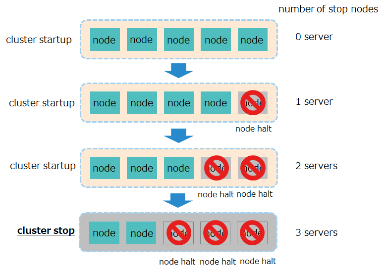
    <figcaption>Number of running cluster servers</figcaption>
  </figure>


- For a system that requires availability, it is recommended to have at least three node servers that configure a cluster. With less than three node servers available, clusters will go down if one node server stops.
  - The number of configured nodes and the maximum number of stop nodes where clusters can operate have the following relationships:

    | number of configured nodes | maximum number of stop nodes where clusters can operate |
    |--------------|-----------------|
    | 1 server          | 0 (low availability) |
    | 2 servers          | 0 (low availability) |
    | 3 servers         |  1 server             |
    | 4 servers         |  1 server             |
    | 5 servers         |  2 server             |

- For a system that does not require availability, it is possible to have one node server to run it with a single configuration.


[notes]
- In case of planned outages, including hardware maintenance, stop one node server at a time. If multiple nodes are stopped, in case a failure occurs in the rest of the nodes, the number of down servers might exceed half the total number of servers, which could stop the cluster.


If a node goes down, the following recovery processing will automatically be performed:
- Cases where the master goes down
  - Redetermine the master.
  - Relocate partitions (replicas).

- Cases where followers go down
  - Relocate partitions (replicas).


Partitions (replicas) are relocated not only when a cluster is contracted due to a node down, but also when a cluster is extended.

Before relocation, if backup data is older than owner data, the cluster will forward the delta data to the backup node and synchronize the owner and backup data.

<figure>
  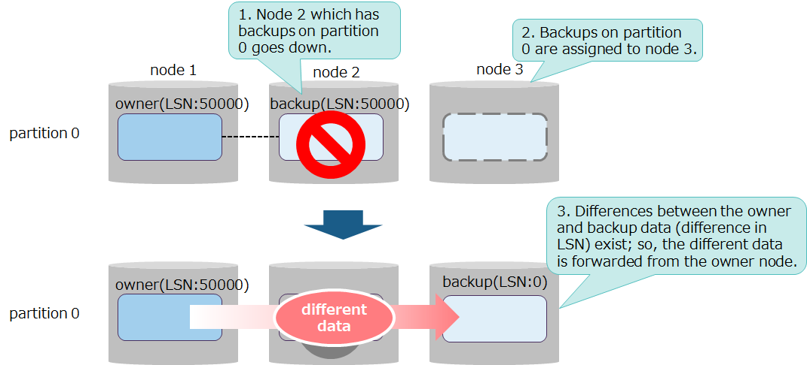
  <figcaption>Synchronization in cluster reconfiguration</figcaption>
</figure>


- Whether or not differences between the owner and backup data exist is determined by the value of LSN (Log Sequence Number) each piece of data has. The value of LSN increases for each data update; hence, a greater value means newer data.
- Synchronization are of two types, in terms of the differences between the owner and backup data.
  - short-term synchronization
    - performed when the data differences are small. The amount of data forwarded is small; processing completes in less processing time.
  - long-term synchronization
    - performed when the data differences are large. The amount of data forwarded is large; processing may take a long time to complete.

Synchronization described above is automatically performed by the server. There is no item that needs design work.


### Failure detection (heartbeat)

A cluster detects failure through a heartbeat between nodes.
To check the survival of nodes, the master sends a heartbeat to all followers at regularly scheduled intervals.  Followers receiving a heartbeat send back their responses to the master.

<figure>
  
  <figcaption>Heartbeat</figcaption>
</figure>

To check if a heartbeat sent from the master has arrived, followers check the received time of a heartbeat at regularly scheduled intervals.

To reflect the latest data between the master and followers, a heartbeat exchanges information on configured nodes and partition information management tables between the master and followers.


- Cases where the followers' responses are not sent to the master
  - If the followers' heartbeat responses are not sent to the master twice in succession, the master will assume the followers have gone down.
  - The master then updates the information on the configured nodes it has and sends it to each follower in the next heartbeat.
  - Finally the cluster performs processing for failure detection

  <figure>
    
    <figcaption>Cases where the followers' heartbeat responses are not sent</figcaption>
  </figure>

- Cases where the master's heartbeat is not sent to the followers
  - If the master's heartbeat is not sent to the followers twice in succession, the followers will assume the master has gone down.
  - To determine a new master, all followers temporarily become a submaster. Then, one node server is selected from among all nodes to be the next master and the rest will become followers again.
  - Finally the cluster performs processing for failure detection


The length of regularly scheduled intervals for both the master and followers is by default 5 seconds (value of /cluster/heartbeatInterval in gs_cluster).


**related parameters**

- cluster definition file (gs_cluster.json)

  | parameter                 | initial value    | description                               |
  |----------------------------|-----------|-----------------------------------|
  | /cluster/heartbeatInterval | 5 seconds       | - regular interval at which the master sends a heartbeat<br>- regular interval at which the followers check the time to receive a heartbeat from the master |


- node definition file (gs_node.json)

  | parameter                 | initial value    | description                               |
  |----------------------------|-----------|-----------------------------------|
  | /cluster/serviceAddress    | 127.0.0.1 | address used for sending/receiving a heartbeat |
  | /cluster/servicePort       | 10010     | port number used for sending/receiving a heartbeat |


### Replica processing (number of replicas, processing mode)

For greater data availability, GridDB creates replicas and retains them by distributing them among multiple nodes. For this reason, even if a node fails, GridDB can continue data access using replicas in the rest of the nodes.

The next several subsections explain points of design for replicas; replication in which replicas are created; and the mechanism of synchronization where replicas are recovered from failure.


#### Replica

A replica has the following features:

- The data unit for a replica is the partition.
- Among replicas, the master's data is called the "owner" and the duplicated data from the owner is called the "backup." Moreover, the nodes that have each of the data above are called the "owner nodes" and the "backup nodes," respectively.
- Registration and reference by an application are applied to the owner. Backup is intended to be data for recovery when a failure occurs in the owner. Therefore, an application never access it .

  <figure>
    
  <figcaption>Replica</figcaption>
  </figure>

- The owner and backup in each partition are distributed to place them in different nodes. In which nodes these replicas are placed is automatically determined by the cluster.


The number of replicas is determined by the maximum number of node servers that can withstand multiple failures to ensure data access, as dictated by the system's utilization rates.

A multiple failure refers to a failure occurring in multiple nodes which causes them to go down all at once.

- If the number of nodes where multiple failures are occurring is less than that of replicas, the client can continue data access.
- In this case, temporarily fewer replicas are present in a cluster, which results in a decreased availability state, called "replica loss." Eventually, new replicas are automatically created in synchronization, which sets the cluster back to the normal state.

<figure>
  
  <figcaption>3 replicas and 2 node servers where multiple failures are occurring</figcaption>
</figure>

-	If the number of nodes where multiple failures are occurring is equal to or greater than that of replicas and all the replicas in a partition are placed in the nodes which have gone down due to multiple failures, then data in that partition will be inaccessible.
-	A partition where none of the owner and backup data is available is in a state called "owner loss." Unless nodes which have replicas are recovered to enable them to participate in a cluster, the corresponding partition remains inaccessible.
-	However, in some multiple failures where multiple nodes have gone down, if node downs occur at certain intervals as opposed to simultaneously, synchronization may be run during this period to create replicas in other nodes, so that the client can continue data access.

<figure>
  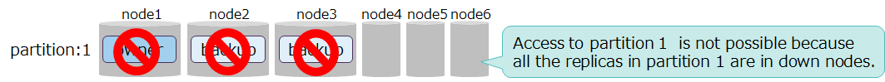
  <figcaption>3 replicas and 3 node servers where multiple failures are occurring</figcaption>
</figure>


More replicas means greater availability with the following adverse effects:

- effect on the amount of data

  - More replicas means greater amount of data, which in turn increases the amount of memory and disks needed for processing.

  <figure>
    
    <figcaption>Relationship between the number of replicas and the amount of data</figcaption>
  </figure>

  - While a cluster is in degraded operation, data in the nodes that are stopped is placed in other nodes, such that during degraded operation, the amount of data handled by a node increases.

  <figure>
    
    <figcaption>Relationship between the number of replicas and the amount of data</figcaption>
  </figure>


Below is a guideline for the number of replicas:

- For a multi-node cluster configuration, the recommended number of replicas is 2 (which is the default value in a definition file).
- For a single configuration, the recommended number of replicas is 1. Specifying 2 or above for the number of replicas does not have any effect on availability, because replicas are created in the same node.
- If the system has sufficient resources for memory and disks and requires high availability, consider having at least 3 replicas.
  - In this case, set the number of replicas to equal to or less than half the number of configured nodes, such that,
    - number of replicas <= (number of configured nodes + 1) /2
  - Unless the above expression is satisfied, if node servers of less than the number of replicas fail, the system cannot satisfy the criteria for running the services (more than half the nodes are running), which will stop the services, regardless of whether data exists in replicas.


**related parameters**

- cluster definition file (gs_cluster.json)

  | parameter                | initial value | description  | changes made after startup |
  |----------------------------|-----------|-----------------------------------|-------------|
  | /cluster/replicationNum    | 2         |  number of replicas                        | possible (Restart the cluster)  |


[notes]
- The heading "changes made after startup" in the table above denotes whether the parameter can be changed after launching.
  -possible (Restart the cluster): The parameter can be changed by modifying the definition file specifying the parameter and then restarting all the nodes and the cluster.


#### Replication processing

Data updated in transaction processing, including data registration and deletion can be written to disks and made permanent. This protects data updates from missing data in case of a node failure.  Further, availability can be increased by forwarding updated data to a node containing backup data and replicating it in this node through replication.

<figure>
  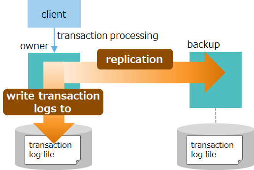
  <figcaption>Transaction log write and replication</figcaption>
</figure>


In transaction processing, each of writing to log files and replication has two modes, including synchronous and asynchronous modes. Select one based on the system's availability and performance requirements.

- Replication modes

  | mode                  | description                      |
  |-----------------------|--------------------------|
  | asynchronous<br>(default) | For each transaction processing, forwards updated data to a backup node but afterwards does not wait for receive completion afterwards. |
  | semi-synchronous              | For each transaction processing, forwards updated data to a backup node and afterwards waits for receive completion afterwards. (The process of reflecting updated data at the backup node is asynchronous. ) |

- transaction log write mode

  | mode                  | description                       |
  |-----------------------|----------------------------|
  | asynchronous<br>(default) | Regardless of the timing of transaction processing, flushes to transaction log files at regular intervals. |
  | synchronous                 | For each transaction processing, flushes to transaction log files. |


  - An asynchronous mode is a mode for such systems as IoT systems which register data frequently. Asynchronous writing improves speed. While the likelihood of missing data increases, GridDB simultaneously forwards data for replication which results in an increase in availability even in an asynchronous mode. For example, consider the case where, after notifying the application about completion of transaction processing, the machine for owner data goes down prior to the log write cycle. In this case, data updated by the owner is lost, but since updated data is forwarded to the backup node, the likelihood of missing data can be reduced.


The table below explains combinations of transaction logs and replication modes, and process flows and performance for each combination.

| mode<br>combination | process flow | performance | state of data upon notification of completion sent to the application |
|-----------------------|-------------|-------------------|------------------------|
| [1]<br>log:<br>asynchronous (1 sec.)<br><br>replication:<br>asynchronous<br><br>(default)  |  | high-speed    | - flushes updated data within a second<br><br>- forwards data to a backup node (but has not acknowledged receipt) |
| [2]<br>log:<br>asynchronous (1 sec.)<br><br>replication:<br>semi-synchronous    |  | moderately high speed    | - flushes updated data within a second<br><br>- forwards data to a backup node |
| [3]<br>log:<br>synchronous<br><br>replication:<br>asynchronous   |     | moderately low speed    | - completes flushing updated data<br><br>- forwards data to a backup node (but has not acknowledged receipt) |
| [4]<br>log:<br>synchronous<br><br>replication:<br>semi-synchronous  |     | low speed    | - completes flushing updated data<br><br>- forwards data to a backup node |

- in descending order by performance: [1] > [2] > [3] > [4] (where the number indicates the numbers under the heading "mode combination" in the table above)
- in descending order by availability: [4] > [3] > [2] > [1] (where the number indicates the numbers under the heading "mode combination" in the table above)


Below is a guideline for setups for transaction log write and replication modes.

- For normal systems, the recommended choice is a combination of asynchronous (1 sec.) for transaction logs and asynchronous for replication. (which is the default value in a definition file).
  - This is a setup which provides a minimum level of availability, since both modes are asynchronous and hence high-speed, together with the mechanism of how data is forwarded to an application.
- There is a trade-off between performance and availability. For systems which require very high availability and reliability, consider combining semi-synchronous and synchronous modes in terms of balance with performance requirements.


**related parameters**

- cluster definition file (gs_cluster.json)

  | parameter                | initial value | description  | changes made after startup |
  |-----------------------------------------|-----------|-----------------------------------|--------------|
  | /transaction/replicationMode            | 0 (asynchronous) | mode for replication<br>asynchronous: 0 or ASYNC<br>semi-synchronous: 1 or SEMISYNC | possible (Restart the cluster) |
  | /transaction/replicationTimeoutInterval | 10s      | in semi-synchronous replication, time to wait for receive completion by a backup node.| possible (Restart the cluster) |


- node definition file (gs_node.json)

  | parameter                | initial value | description  | changes made after startup |
  |----------------------------|-----------|-----------------------------------|--------------|
  | /dataStore/logWriteMode    | 1         | transaction log write mode<br>asynchronous: Specify cycle time in seconds using an integer x (where 1 ≤ x ≥ 2<sup>31</sup>).<br>synchronous: 0 or -1 | possible (Restart nodes) |

[notes]
- The heading "changes made after startup" in the table above denotes whether the parameter can be changed after launching.
  - possible (Restart the cluster): The parameter can be changed by modifying the definition file specifying the parameter and then restarting all the nodes and the cluster.
  - possible (Restart nodes): The parameter can be changed by modifying the definition file specifying the parameter and then restarting the nodes.


### Client failover timeout

Even if a node fails, the application can continue accessing data thanks to failover functionality provided by a node and a client API (NoSQL interface).

The rest of this subsection gives a detailed explanation of how failover is performed when a node fails by following all steps ranging from an occurrence of a failure to recovery.


| flow    | figure  | description |
|---------|------|--------|
| (1) client's request for processing | <p></p> | 1. The client requests processing by indicating what to do with a container through a client API. <br>The client API connects to node 1, which stores container A to operate on. |
| (2) failure occurrence | <p></p> | 2. While processing a request from the client, the node goes down due to a node failure in node 1. |
| (3) automatic recovery 1 | <p></p> | 3. The client API loses connection to node 1 and automatically retries processing. <br><br>4. The cluster automatically detects node 1 has gone down and reconfigures the cluster using the remaining nodes. |
| (4) automatic recovery 2 | <p></p> | >5. As a replacement for owner data in node 1, the cluster changes backup data in node 2 to owner data. <br>In the background, the cluster creates backup in other nodes. |
| (5)(5) continuation of processing | <p></p> | 6. The client API establishes connection to the new owner of container A, namely node 2, and automatically retries processing. <br><br>The client continues processing without causing an error. |


If the node in the partition the client API is accessing fails, the client API automatically retries processing.  If, thanks to the cluster's autonomous data placement, the partition recovers while retrying, the client API automatically continues processing.
The retrying time, or "failover timeout," can be changed by specifying a property for application connection processing for the application.

- Cases where processing cannot continue, leading to an error
  - Cases where extra time is required for synchronous processing for autonomous data placement and the partition does not recover within a failover timeout.
  - Cases where a node failure leads to missing data and the partition enters a state of owner loss.

[notes]
- Only the NoSQL interface has a client failover functionality.


**related parameters**

- property for connecting to a cluster from the client API

  | parameter                 | initial value    | description                               |
  |----------------------|-----------|-----------------------------------|
  | failoverTimeout      | 120 seconds     | client failover timeout<br>Use an application program to specify. |


## Network design

In GridDB, it is necessary to design two types of networks, namely nodes and clusters.


### Node network configuration

The GridDB nodes perform a variety of network communication tasks to communicate with the client and other nodes over the network. Communication paths used for this are of several types as shown in the table below:

<figure>
  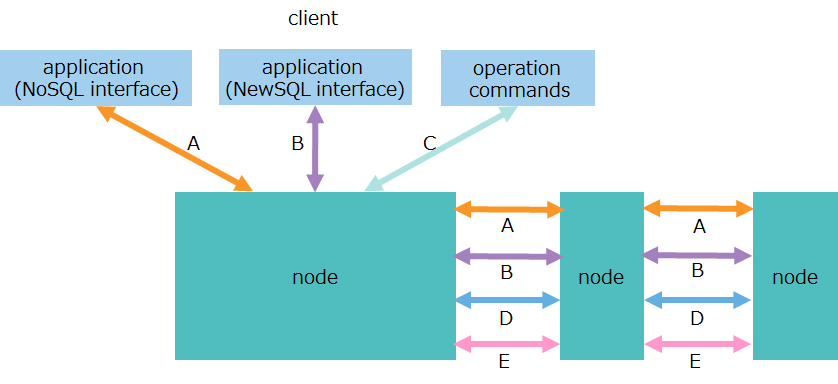
  <figcaption>communication to nodes</figcaption>
</figure>

| No. | item               | communication path                      | description                         |
|---|---------------------|-------------------------------|------------------------------|
| A | transaction processing | - client-node<br>- between nodes | - communication for data operations over a NoSQL interface<br>- communication for replication processing of transactions  |
| B | SQL processing     | - client-node<br>- between nodes | - communication for data operations over a NewSQL interface<br>- communication for processing SQL by parallel and distributed computing  |
| C | production and management operations         | client-node           | communication for accepting an operation request for production and management |
| D | cluster management         | between nodes                    | communication for sending and receiving a heartbeat used for checking the survival of nodes, as well as information on cluster management |
| E | synchronization            | between nodes                     | communication for data synchronization through partition relocation          |

Main operation tools provided by GridDB use multiple types of communication as illustrated in the figure below:

<figure>
  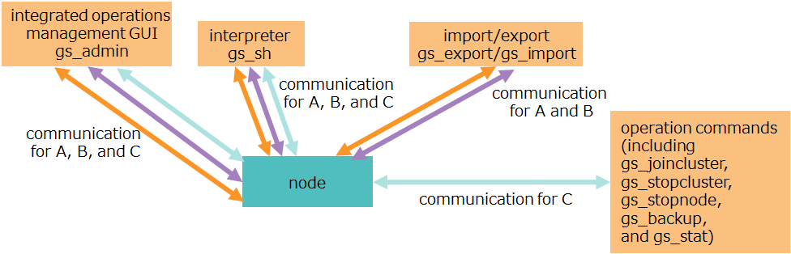
  <figcaption>Network communication used by operation tools</figcaption>
</figure>

| operation tools                                   | communication types to be used  |
|---------------------------------------------|----------------------------------------------------|
| integrated operations management GUI (gs_admin)                    | A. transaction processing<br>B. SQL processing<br>C. production and management operations |
| interpreter (gs_sh)                          | A. transaction processing<br>B. SQL processing<br>C. production and management operations |
| operation command (including gs_joincluster and gs_stat)  | C. production and management operations |
| export/import  tool (gs_export, gs_import)   | A. transaction processing<br>B. SQL processing|

[notes]
- For IP addresses to be used for communication, specify the ones that can communicate with the client and all other nodes.
- To specify a host name for an IP address, make sure that the name is resolvable for the client and all other nodes.
- If an IP address (seviceAddress) is omitted in a node definition file, the IP address associated with the machine's host name is used as a default.
  - How to check an IP address associated with a host name:
    ``` example
    $ hostname -i
    172.0.10.1
    ```


**related parameters**

- node definition file (gs_node.json)

  - For each communication, set an IP address (serviceAddress) and a port number (servicePort).

  | parameter                | initial value | description  | changes made after startup |
  |--------------------------------|------------------------------------------|-------------------------------|--------------|
  | /cluster/serviceAddress        | \-<br>(IP address that corresponds to a host name)  | address for cluster management         | possible (Restart nodes)   |
  | /cluster/servicePort           | 10010                                    | port number for cluster management       | possible (Restart nodes)   |
  | /sync/serviceAddress           | \-<br>(IP address that corresponds to a host name))  |address for synchronization             | possible (Restart nodes)   |
  | /sync/servicePort              | 10020                                    | port number for synchronization           | possible (Restart nodes)   |
  | /system/serviceAddress         | \-<br>(IP address that corresponds to a host name)  | address for production and management operations         | possible (Restart nodes)   |
  | /system/servicePort            | 10040                                    | port number for production and management operations        | possible (Restart nodes)   |
  | /transaction/serviceAddress    | \-<br>(IP address that corresponds to a host name)  |  address for transaction processing    | possible (Restart nodes)   |
  | /transaction/servicePort       | 10001                                    |port number for transaction processing | possible (Restart nodes)   |
  | /sql/serviceAddress            | \-<br>(IP address that corresponds to a host name))  |  address for SQL processing      | possible (Restart nodes)   |
  | /sql/servicePort               | 20001                                    | number for SQL processing    | possible (Restart nodes)   |

[notes]
- The heading "changes made after startup" in the table above denotes whether the parameter can be changed after launching.
  - possible (Restart nodes): The parameter can be changed by modifying the definition file specifying the parameter and then restarting the nodes.


In performing data operations using TQL or SQL, the client connects to a cluster through a NoSQL/NewSQL interface to perform processing. Note that in the case of SQL, data operations using SQL involve distributed processing between nodes and hence require a high amount of communication between nodes.

-	In TQL (NoSQL interface), data operations are performed on a per-container basis, which means the client communicates with the node which has that container.
-	In SQL (NewSQL interface), data operations are performed using parallel and distributed computing, which means the client randomly accesses one node server and processes the SQL by distributing it to each node .

<figure>
  
  <figcaption>Communication flow when performing data operations using a NoSQL/NewSQL interface</figcaption>
</figure>


The points of design required for a node network are port numbers and bandwidth. The next several subsections explain points of design for each.   


#### Port number

Port numbers GridDB nodes use are of several types as shown in the tables below:

By default, the numbers in the two tables are used. If the port number that the system plans to use is used by another application or elsewhere, then the default port number must be changed.

<figure>
  
  <figcaption>network communication</figcaption>
</figure>

| No | item                 | description                                                                          | port number |
|----|---------------------|-------------------------------------------------------------------------------|------------|
| A  | transaction processing  | communication port for performing transaction processing                                      | 10001     |
| B  | SQL processing                       | communication port for performing SQL processing (AE only)                                                                                     | 20001     |
| C  | production and management operations         | communication port for accepting an operation request for production and management                                  | 10040     |
| D  | cluster management         | communication port for sending and receiving a heartbeat used for checking the survival of nodes, as well as information on cluster management | 10010     |
| E  | synchronization             | communication port for data synchronization through partition relocation                        | 10020     |


To use multicast communication as a connection method, the following three additional port numbers in the table below are used:

| No | item                                       | port number |
|----|--------------------------------------------|-----------|
| F  | multicast for transaction processing          | 31999     |
| G  | multicast for SQL processing (AE only) | 41999     |
| H  | multicast for cluster management                 | 20000     |


#### Bandwidth

GridDB communicates a large volume of data. Therefore, the recommended bandwidth for the network bandwidth is 10 GbE.

The following three communication paths involve large data volumes:

<figure>
  
  <figcaption>Network communication with large data volumes</figcaption>
</figure>

- client-to-node communication over the NoSQL interface (A)
  - "The traffic will be high while large amounts of data are being obtained from the cluster, for example by running a search that returns many hits using TQL.

- client-to-node communication over the NewSQL interface (B)
  - "The traffic will be high while large amounts of data are being obtained from the cluster, for example by running a search that returns many hits using SQL.

- node-to-node communication by processing SQL using parallel and distributed computing (B)
  - The traffic will be high if processing SQL in multiple nodes using parallel and distributed computing, for example by joining multiple containers.


When there is a shortage of network bandwidth due to a large amount of data traffic, it is recommended to increase bandwidth using multiple network interface cards (NICs).


[Example] normal case
  - Use the same IP address for all types.

    | No. | item              | IP address  |
    |---|---------------------|------------|
    | A | transaction processing  | 172.0.10.1 |
    | B | SQL processing              | 172.0.10.1 |
    | C | production and management operations          | 172.0.10.1 |
    | D | cluster management         | 172.0.10.1 |
    | E | synchronization             | 172.0.10.1  |


[Example] case of high traffic
  - Using multiple NICS, set separate IP addresses for communication used for "transaction processing" and "SQL processing" both of which have high traffic.

    | No. | item              | IP address  |
    |---|---------------------|------------|
    | A | transaction processing  | 172.0.10.2 |
    | B | SQL processing              | 172.0.10.3 |
    | C | production and management operations          | 172.0.10.1 |
    | D | cluster management         | 172.0.10.1 |
    | E | synchronization             | 172.0.10.1  |


### Cluster network configuration

The following three connection methods are available to configure clusters between nodes and communicate with the client: a multicast method, a fixed list method, and a provider method.  The following explains the benefits and drawbacks of each connection method. Select one of the three methods to suit the network environment.


<figure>
  
  <figcaption>connection method</figcaption>
</figure>


| method name  | description  | settings/build | whether stop is needed when adding nodes | network environment |
|--------|-----|---------|-----------|---------|
| Multicast method	| Uses multicast communication.  | benefit: <br>easy to describe the definition file | benefit: <br>no need to stop the cluster | drawback:<br>Communication is not enabled unless all nodes and the client are placed in the same subnet. |
| Fixed list method	| Sets a list of addresses of all nodes in the client and the nodes. <br>It uses unicast communication to communicate in the cluster based on an address list. 	| drawback:<br>difficult to describe the definition file. | drawback:<br>need to stop the cluster. | benefit:<br>no restrictions on the environment. |
| Provider method	| Sets a list of addresses of all nodes in the provider. <br>The client and the nodes then obtain the address list from the provider to use unicast communication to communicate. 	| drawback:<br>need to implement a provider. | benefit: no need to stop the cluster. | benefit:<br>no restrictions on the environment.	|


Where multicast commutation can be used, a multicast method is recommended. (Specify the connection method using a cluster definition file. By default, the connection method is set to a multicast method.)

Keep in mind, however, that a multicast method has restrictions on the network environment.

In a multicast method, because of communication limitations in multicast communication, the client and all nodes should be placed in the same subnet. If they are placed in separate subnets, the multicast method cannot be used, unless multicast routing settings are configured on all routers in the network.


<figure>
  
  <figcaption>Multicast method</figcaption>
</figure>


In the cloud, such as AWS, there may be cases where multicast communication is not available. In such cases, use a fixed list method or a provider method.

Between the fixed list method and the provider method, the fixed method is easier in terms of settings and environment building. By comparison, the provider method requires to build a Web service which provides address lists.

On the other hand, the provider method is not affected by node addition. That is, in the provider method, all that is needed is to change information in the address list that the provider has; there is no need to stop the cluster. In comparison, the fixed list method requires to stop the cluster to modify the cluster definition file.
 It also requires to change the specifications of APIs for client-side connections.  For this reason, for systems expecting to add nodes, the provider method is recommended.


[notes]
- A client refers to an application which uses the NoSQL interface or the NewSQL interface to access the cluster. Among operation tools, examples include gs_admin for integrated operations management GUI, export/import tools, and the shell command gs_sh.

- Multiple cluster configurations can be build in the same network subnet.
    - In that case, make sure to use separate names for each configuration.
    - For the multicast method, use a different multicast address for each cluster.


The next three subsections give the details of each connection method.


<a id ="label_mode_multicast"></a>
#### Multicast method

A multicast method is a method that uses multicast for communication. Multicast refers to communication that sends from one sender the same data at the same time to given multiple destinations.

<figure>
  
  <figcaption>Multicast method</figcaption>
</figure>

To use a multicast method, place the client and all nodes in the cluster in the same subnet. If they are placed in separate subnets, the multicast method cannot be used, unless multicast routing settings are configured on all routers in the network.

In a multicast method, the nodes poll the network and receive data sent at regularly scheduled intervals using multicast communication. The nodes do not receive data immediately; it takes time amounting to at most one regular interval before communication starts. The length of a regular interval can be specified in the cluster definition file.

- Specify the multicast address and port number for the nodes and the client.
- Use the multicast address in the range of 239.0.0.0 to 239.255.255.255.


**related parameters**

- cluster definition file (gs_cluster.json)

  For each communication, set the three items: multicast address (notificationAddress), port number (notificationPort), and the interval (notificationInterval).

  | parameter                | initial value | description  | changes made after startup |
  |-------------------------------------|-----------|---------------------------------------------|------------|
  | /cluster/notificationAddress        | 239.0.0.1 | multicast address for cluster management           | possible (Restart the cluster) |
  | /cluster/notificationPort           | 20000     | multicast port number for cluster management       | possible (Restart the cluster) |
  | /cluster/notificationInterval       | 5s        | multicast interval for cluster management          | possible (Restart the cluster) |
  | /transaction/notificationAddress    | 239.0.0.1 | multicast address for transaction processing       | possible (Restart the cluster) |
  | /transaction/notificationPort       | 31999     | multicast port number for transaction processing   | possible (Restart the cluster) |
  | /transaction/notificationInterval   | 5s        | multicast interval for transaction processing      | possible (Restart the cluster) |
  | /sql/notificationAddress            | 239.0.0.1 | multicast address for SQL                          | possible (Restart the cluster) |
  | /sql/notificationPort               | 41999     | multicast port number for SQL                      | possible (Restart the cluster) |
  | /sql/notificationInterval           | 5s        |multicast interval for SQL                          | possible (Restart the cluster) |

[notes]
- The heading "changes made after startup" in the table above denotes whether the parameter can be changed after launching.
  - possible (Restart the cluster): The parameter can be changed by modifying the definition file specifying the parameter and then restarting all the nodes and the cluster.


#### Fixed list method

A fixed list method is a method to explicitly specify the IP address of all nodes in the cluster for the client and each of the nodes. It uses unicast communication to communicate in the cluster based on an address list.


<figure>
  
  <figcaption>Fixed list method</figcaption>
</figure>

- For the IP addresses and port numbers in the address list, specify those for [network communication](#label_network_communications).


**related parameters**

- cluster definition file (gs_cluster.json)

  | parameter                | initial value | description  | changes made after startup |
  |------------------------------------|-----------|---------------------------------------------|----------|
  | /cluster/notificationMember        | \-        | address list consisting of IP addresses and port numbers for [network communication] (#label_network_communications) each node has. | possible (Restart the cluster) |

  Example of an address list to be entered in a cluster definition file

  - Make a list of IP addresses and port numbers for [network communication](#label_network_communications) specified in a node definition file (gs_node.json).
  - If IP addresses are omitted in the node definition file, enter the IP address associated with a host name in the address list.

  ```
  "notificationMember": [
    {
        "cluster":     {"address":"172.0.0.1", "port":10010},
        "sync":        {"address":"172.0.0.1", "port":10020},
        "system":      {"address":"172.0.0.1", "port":10040},
        "transaction": {"address":"172.0.0.1", "port":10001},
        "sql":         {"address":"172.0.0.1", "port":20001}
    },
    {
        "cluster":     {"address":"172.17.0.2", "port":10010},
        "sync":        {"address":"172.17.0.2", "port":10020},
        "system":      {"address":"172.17.0.2", "port":10040},
        "transaction": {"address":"172.17.0.2", "port":10001},
        "sql":         {"address":"172.17.0.2", "port":20001}
    },
            :
            :
  ```

[notes]
- The heading "changes made after startup" in the table above denotes whether the parameter can be changed after launching.
  - possible (Restart the cluster): The parameter can be changed by modifying the definition file specifying the parameter and then restarting all the nodes and the cluster.


#### Provider method

A provider method is a method to locate a Web service that delivers a list of the IP addresses of all nodes in the cluster. The client and each node first access the provider to obtain the IP addresses of all nodes.

<figure>
  
  <figcaption>Provider method</figcaption>
</figure>

The nodes obtain an address list from the provider when they start. They continue to obtain the updated address list from the provider at regular intervals. This means that in such cases as node addition, once the provider's address list is updated, the new information is automatically available in the nodes.

- For the nodes and the client, specify the provider's IP address and port number.
- For the provider, specify the IP address and port number for [network communication](#label_network_communications).


**related parameters**

- cluster definition file (gs_cluster.json)

  | parameter                | initial value | description  | changes made after startup |
  |----------------------------------------------|-----------|----------------------------------------|------------|
  | /cluster/notificationProvider/url            | \-        | provider's URL                          | possible (Restart the cluster)|
  | /cluster/notificationProvider/updateInterval | 5s        | interval at which an address list is obtained from the provider    | possible (Restart the cluster)|

[notes]
- The heading "changes made after startup" in the table above denotes whether the parameter can be changed after launching.
  - possible (Restart the cluster): The parameter can be changed by modifying the definition file specifying the parameter and then restarting all the nodes and the cluster.


### Network configuration to isolate communication between external and internal networks

#### Objective

Of communication done by the GridDB nodes, communication for transaction processing and SQL processing has two types of communication paths.
These two are client-node client communication (external communication) and cluster internal communication between the nodes.
Both communicate through the same network interfaces.

The increasing scale of the system increases flow both in external and internal communications and hence the network can be a performance bottleneck.

In terms of system configuration, occasionally it might be necessary to isolate the interfaces for client communication into external networks and the interfaces for cluster internal communication into internal networks, respectively.


To deal with these cases, GridDB makes it possible to assign both a network interface for client communication and a network interface for cluster internal communication, to communication both for transaction processing and for SQL processing.
 This creates a network configuration that isolates communication between external and internal networks.


<figure>
  
  <figcaption>Isolation of network interfaces</figcaption>
</figure>

| No. | item               | communication path                      | description                         |
|-|-|-|-|
| A   | transaction processing | client-node   | external communication for data operations over a NoSQL interface |
| A'  |  transaction processing | between nodes               | internal communication replication processing of transactions |
| B   | SQL processing    | client-node  | external communication for data operations over a NewSQL interface |
| B'  | SQL processing     | between nodes                | internal communication for processing SQL by parallel and distributed processing |

#### Node network configuration

To create a network configuration that isolates communication between external and internal networks, first set up a node network configuration.

**related parameters**

- node definition file (gs_node.json)

  | parameter                | initial value | description  | changes made after startup |
  |---------------------------------------|---------------------------------------------|-------------------------------|--------------|
  | /cluster/notificationInterfaceAddress | ""                                          | address of the interface that sends multicast packets | possible (Restart nodes) |
  | /transaction/serviceAddress           | \-<br>(IP address that corresponds to a host name)  | address for transaction processing for client communication    | possible (Restart nodes) |
  | /transaction/localServiceAddress      | ""                                          | address for transaction processing for cluster internal communication | possible (Restart nodes) |
  | /transaction/servicePort              | 10001                                       | port number for transaction processing | possible (Restart nodes) |
  | /sql/serviceAddress                   | \-<br>(IP address that corresponds to a host name)  | address for SQL processing for client communication      | possible (Restart nodes) |
  | /sql/localServiceAddress              | ""  | address for SQL processing for cluster internal communication    | possible (Restart nodes) |
  | /sql/servicePort                      | 20001                                    | port number for SQL processing     | possible (Restart nodes) |

[notes]
- The heading "changes made after startup" in the table above denotes whether the parameter can be changed after launching.
  - possible (Restart nodes): The parameter can be changed by modifying the definition file specifying the parameter and then restarting the nodes.
- The GridDB requires to set up both /transaction/localServiceAddress and /sql/localServiceAddress.
- If the system has multiple network interfaces, in order to use the multicast method for a cluster network configuration, it is recommended to specify the appropriate interface IP address for /cluster/notificationInterfaceAddress.


Specify the IP address of the network interfaces in serviceAddress and localServiceAddress, each using a different network interface.
To configure a cluster with multiple nodes, all nodes must be set up.

Moreover, it is recommended to set up serverAddress for processing other than transaction processing and SQL processing without omitting it.

[Example]
```
"cluster":{
    "serviceAddress":"192.168.10.11",
    "servicePort":10010
},
"sync":{
    "serviceAddress":"192.168.10.11",
    "servicePort":10020
},
"system":{
    "serviceAddress":"192.168.10.11",
    "servicePort":10040,
          :
},
"transaction":{
    "serviceAddress":"172.17.0.11",
    "localServiceAddress":"192.168.10.11",
    "servicePort":10001,
          :
},
"sql":{
    "serviceAddress":"172.17.0.11",
    "localServiceAddress":"192.168.10.11",
    "servicePort":20001,
          :
},
```

#### Cluster network configuration

Set up a cluster network configuration according to the node network configuration.

In the multicast method, no special setup is required. See the section ["multicast method."](#label_mode_multicast)

In the fixed list method, information on localServiceAddress must be added to the address list set in the cluster definition file.


[Example]
```
"notificationMember": [
    {
        "cluster":           {"address":"192.168.10.11", "port":10010},
        "sync":              {"address":"192.168.10.11", "port":10020},
        "system":            {"address":"192.168.10.11", "port":10040},
        "transaction":       {"address":"172.17.0.11", "port":10001},
        "sql":               {"address":"172.17.0.11", "port":20001},
        "transactionLocal":  {"address":"192.168.10.11", "port":10001},
        "sqlLocal":          {"address":"192.168.10.11", "port":20001}
    },
    {
        "cluster":           {"address":"192.168.10.12", "port":10010},
        "sync":              {"address":"192.168.10.12", "port":10020},
        "system":            {"address":"192.168.10.12", "port":10040},
        "transaction":       {"address":"172.17.0.12", "port":10001},
        "sql":               {"address":"172.17.0.12", "port":20001},
        "transactionLocal":  {"address":"192.168.10.12", "port":10001},
        "sqlLocal":          {"address":"192.168.10.12", "port":20001}
    },
          :
          :
```

In the provider method, information on localServiceAddress must be added to the address list returned by the provider.


[Example]
```
[
    {
        "cluster":           {"address":"192.168.10.11", "port":10010},
        "sync":              {"address":"192.168.10.11", "port":10020},
        "system":            {"address":"192.168.10.11", "port":10040},
        "transaction":       {"address":"172.17.0.11", "port":10001},
        "sql":               {"address":"172.17.0.11", "port":20001},
        "transactionLocal":  {"address":"192.168.10.11", "port":10001},
        "sqlLocal":          {"address":"192.168.10.11", "port":20001}
    },
    {
        "cluster":           {"address":"192.168.10.12", "port":10010},
        "sync":              {"address":"192.168.10.12", "port":10020},
        "system":            {"address":"192.168.10.12", "port":10040},
        "transaction":       {"address":"172.17.0.12", "port":10001},
        "sql":               {"address":"172.17.0.12", "port":20001},
        "transactionLocal":  {"address":"192.168.10.12", "port":10001},
        "sqlLocal":          {"address":"192.168.10.12", "port":20001}
    },
          :
          :
```

The connection is made from the client through the network interfaces specified in serviceAddress like a normal network configuration.


[notes]
- For network configuration settings to isolate communication between external and internal networks, external multicast communication is not supported.
  For the connection from the client, use either the fixed list method or the provider method regardless of the cluster connection method.

## Security design

### Access control

In security design, it is necessary to first examine common security requirements, including the number of users with access rights and the range of data access and, based on the result, design the following:

- general users for connecting from the application, and the range of accessible data, or "database"
- correspondence between a user and a database


GridDB has "database" features which allow to separate the range of accessibility in order to set a different range of accessible data for each user.

A general user can have access to multiple databases but cannot execute a cross-database SQL query, for example, joining containers residing in different databases.
Therefore, it is recommended to group all the containers that one user accesses into one database as much as possible.

<figure>
  
  <figcaption>Database and SQL search</figcaption>
</figure>

- The type of access rights to database is "ALL" and "Read only". "ALL" allows performing all operations related to containers including container creation, row registration, search, and index creation, while "Read only" allows performing only search operation.
- A general user can only access containers within the database that he/she has access to.
- An administrative user can access containers within all the databases.

**user's role**

| user | role |
|--------|-----|
| administrative user   | Creates databases and general users; Grant the general user access to the database; grants general users access to database. |
| general user   | Accesses databases to which access is given to perform operations such as data registration and search.   |


#### Operational procedures

Below are the steps to create a general user and a database and to grant access. assuming that "ALL" is granted.

1. Connect to the cluster through an administrative user account.

```example
$ gs_sh
gs> setcluster cluster myCluster 239.0.0.1 31999 // Set information about the cluster to connect to.
gs> setuser admin admin       // Specify the name and password of the administrative user.
gs> connect $cluster          // Connect to the cluster.
gs[public]>
```

2. Create a general user.

```example
gs[public]> createuser userA password
```

3. Create a database.

```example
gs[public]> createdatabase databaseA
```

4. Grant the general user access to the database.

```example
gs[public]> grantacl ALL databaseA userA
```


### Encryption

In GridDB, communication between the client and the GridDB cluster can be secured through SSL. For details, see the [GridDB Features Reference](../manuals/3.md_reference_feature/md_reference_feature.md).

However, data stored in the database files is not encrypted. It is recommended to place such data in a secure network that should never be directly accessed from the outside world.


## Monitoring design

The following summarizes points to consider when designing monitoring for the GridDB cluster. Checking GridDB operations and resource usage is required to optimize performance and proactively avoid failures. Monitoring items are determined by the system's service level.

- GridDB status monitoring

  By using gs_stat, monitors the status of nodes and clusters to determine whether or not an anomaly has occurred in them.

    | item                   | description                                  | outlier                             |
    |------------------------|--------------------------------------|------------------------------------|
    | node status        | monitors /cluster/nodeStatus.          | anomalous if the value is ABNORMAL          |
    | partition status | monitors /cluster/partitionStatus.  | anomalous if the value is OWNER_LOSS        |


- OS resource monitoring

  By using OS commands, checks OS resource usage to determine whether resource shortage has occurred.

    | item        | description                                |
    |-------------|------------------------------------|
    | process monitoring | monitors the gsserver/gssvc process.   |
    | CPU monitoring      | monitors the CPU usage of nodes, processor queues, and other CPU-related metrics.         |
    | memory monitoring   | monitors the memory usage of nodes, the number of swap-ins and swap-outs, and other memory-related metrics.      |
    | disk monitoring     | monitors DB file size, IOPS, IO throughput, queues, and other monitor-related parameters. |


- GridDB resource monitoring

  checks the details of the operations of GridDB to determine whether failures or performance bottlenecks have occurred based on the event log of GridDB.

    | item        | description                                |
    |--------------|------------------------------------|
    | memory monitoring    | monitors the memory usage of storeMemory and its breakdowns (such as data, indexes, and metadata) and other memory-related parameters.   |
    | disk monitoring  | monitors the disk usage of data, indexes, and metadata, SwapRead/Write, and other disk-related parameters.         |
    | query monitoring   | retrieves slow query logs from the event logs of GridDB.      |

    - For information about how to check logs, see the command gs_logs in the section "Displaying recent event logs" in the [GridDB Operation Tools Reference](../5.md_reference_operation_tool/md_reference_operation_tool.md).
    - For information about how to set the threshold for slow queries and other parameters, see the command gs_paramconf in the section "Displaying and changing parameters" in the [GridDB Operation Tools Reference](../5.md_reference_operation_tool/md_reference_operation_tool.md).


  If node processing does not progress, heavy processing may be taking place. A list of events currently running in nodes can be checked using the operation tool gs_sh.

    - For information about how to check a list of processes that are currently running, see the command gs_sh in the section "Displaying executing event" in the [GridDB Operation Tools Reference](../5.md_reference_operation_tool/md_reference_operation_tool.md).


These three monitoring items can be monitored using Zabbix as shown in the figure below.

<figure>
  
  <figcaption>Example of a dashboard configuration for Zabbix</figcaption>
</figure>


For information about monitoring templates for Zabbix, see the [GridDB Zabbix Template Guide](../7.md_zabbix_template_guide/md_zabbix_template_guide.md).


## Backup design

### Purposes of backup

Backups are taken to guard against data corruption resulting from multiple failures in hardware, malfunctioning applications, and other causes.

- In case of data corruption resulting from multiple failures in hardware

  GridDB provides a replication feature, which keeps duplicate copies of data by distributing them to other nodes. Therefore, if the number of nodes which have resulted in data corruption is less than the number of replicas, data will be automatically restored from duplicates in other remaining nodes, without a need to recover from a backup.

  If, on the other hand, the number of nodes which have simultaneously resulted in data corruption is equal to or more than the number of replicas, recovery from a backup will be required due to data loss.

  In cases of multiple failures other than data corruption, data can be restored by reverting nodes, without a need to recover from a backup.

  - [Example] 5 nodes and 2 replicas

    <figure>
      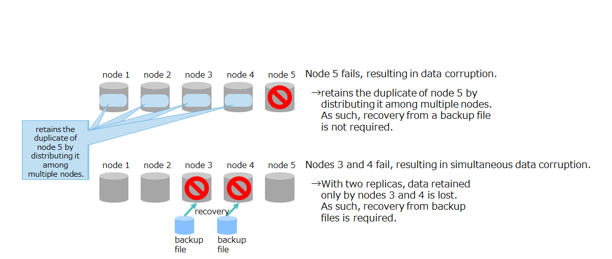
      <figcaption>Data corruption in multiple failed nodes</figcaption>
    </figure>


- Case of malfunctioning applications

  If data cannot be restored because incorrect data has accidentally been registered due to malfunctioning applications and data registration errors made by users, recovery from a backup will be required.  In this case, restore data from backups for all nodes in the cluster.

  <figure>
    
    <figcaption>Case of malfunctioning applications</figcaption>
  </figure>


### Points to consider when designing

Generally, backup and restore requirements are defined according to the system's service level.
A list of review items is shown below:

- problems to be reviewed (e.g. disasters, hardware failures, and operational errors)
- data range required for the system to continue operating (for example, all containers, some containers, and the most recent data)
- recovery point objective (What is the age of the data prior to the occurrence of a failure which need to be restored?)
- recovery time objective
- time zones in which backups can be performed and the conditions under which backups can be performed (for example, whether the cluster can be stopped)
- backup frequency
- number of generations of backups
- where to store backups (for example, on-site, or other media)

GridDB provides the following backup/restore methods: Choose the method that satisfies the requirements defined above.

| Use this backup method | Recovery point | Features |
|------------------|------------------|--------------------|
| automatic replica creation by cluster management | point immediately before the failure | benefit: If the number of replicas is specified in the cluster configuration, the cluster will automatically create replicas between the nodes and manage them. <br>drawback: This method is not applicable when pieces of hardware crash simultaneously and the number of those pieces is equal to or more than the number of replicas, or when data is lost because of a human error. |
| data export using the gs_export tool | point at which data is exported<br>*on a per-container basis | benefit: The backup size can be reduced by having only the required data backed up. <br>drawback: This method executes the export tool and hence may stress the currently running cluster. <br>drawback: Data recovery requires to reimport data. <br>drawback: Exports are dealt with on a per-container basis; hence, recovery points may differ for each container. |
| offline backup | point at which the cluster stops | benefit: Recovery points cannot differ from node to node. <br>drawback: This method requires to stop the cluster until the backup copy is complete. |
| Online backup by node (baseline with differential/incremental) | point at which backup is taken<br>*on a per-node basis | benefit: Backups can be taken online using a GridDB backup command. <br>drawback: Recovery points may differ between nodes depending on when backups are completed. |
| Online backup by node (automatic log) | point immediately before the failure | >benefit: Backups can be taken online using a GridDB backup command. This method also allows to restore to the point immediately before the failure. This method also allows to restore to the point immediately before the failure. <br>drawback: This method uses transaction logs to recover data to the latest state, which can result in longer recovery time. |
| File system level online backup (snapshot) | point at which snapshots are taken | benefit: Working with snapshots of OS and storage to take backups could shorten the time to perform backups. <br>drawback: Even if snapshots are run on each node simultaneously, a time difference of about one second may occur between nodes, given that the transaction log write mode is set to DELAYED_SYNC. |
| File system level online backup (snapshot with automatic log) | point immediately before the failure |benefit: Working with snapshots of OS and storage to take backups could shorten the time to perform backups. <br>drawback: This method uses transaction logs to recover data to the latest state, which can result in longer recovery time. |


The following table shows a guideline for selecting an appropriate backup method:

| Requirements and uses of backup                     | Use this backup method |
|--------------------------------------------|--------------------------------------|
| A simultaneous crash of pieces of hardware (the number being equal to or more than the number of replicas) or data loss a caused by a human error are acceptable. | automatic replica creation by cluster management |
| The data to be backed up can be specified.       | data export using the gs_export tool |
| The system can be stopped while running backups.   |  offline backup |
| The system cannot be stopped while running backups. | Online backup by node (automatic log backup)|
| Because of a huge size of a database file, online backups do not complete within the allotted time. |  File system level online backup (snapshot with automatic log) |


### How to back up and restore

This subsection describes each backup method, including what it is and how it works, the benefits and drawbacks, and the amount of time needed to back up and restore.
For details about operations, see the [GridDB Release Notes](../1.md_release_notes/md_release_notes.md).


#### Offline backup

Taking backups offline

Stop the cluster and all nodes to copy a database file, using OS commands and/or storage snapshots, or by other means. After completion of the copy in all the nodes, the system starts the nodes and the cluster.


<figure>
  
  <figcaption>Offline backup</figcaption>
</figure>

|               |          |
|---------------|----------|
| benefits     | Backups are taken after stopping the cluster, which results in the same recovery point for all nodes. <br>Backups are taken after stopping the nodes, which leads to faster restores. |
| drawbacks      | The method requires to stop the cluster and nodes; therefore, it is not applicable for systems where the services cannot be stopped from running. |
| backup time | time taken to copy a database file |
| recovery point      | point at which the cluster stops |
| recovery time  | time taken to copy a backup file |


#### Online backup

Backups of each node are taken online while the cluster is operating.

The following two main methods are available for online backup in terms of how to create a backup file:


- Online backup by the node
  - a method to create a backup file by the GridDB node using a backup command

- File system level online backup
  - a method to create a backup file at a file system level by working with snapshots of OS and storage.

<figure>
  
  <figcaption>Online backup</figcaption>
</figure>

The main differences between the two methods are indicated in the table below:

| method             | recovery point |
|---------------|----------------|
| Online backup by the node  | point at which the backup per node is completed<br>→The amount of data to back up differs for each node. This may result in a large time difference between nodes as to when backups are completed. |
| File system level online backup | point at which snapshot taking is completed<br>→All nodes can have almost the same recovery point, if, for each node, an identical value is specified for the time to take a snapshot. |


#### Online backup by the node

This subsection describes how to back up online by the node.

##### Full backup

The entire database is backed up.

If you indicate that full backups be taken using a backup command on a per-node basis, each node will copy all the data in databases to create a backup file.

|               |          |
|---------------|----------|
| benefits | Faster restores than differential and incremental backups. (recovery time: full backup < differential backup < incremental backup)<br>- Backups can be taken while the cluster is running. |
| drawbacks	| All data in the database files is copied; therefore, extra time is required for backups. (backup time: incremental backup < differential backup < full backup)<br>- To store multiple generations of backups, disk capacity equal to the size of database files multiplied by the number of generations is required. <br>Because the recovery point is a point at which backups per node are completed, there may be differences in recovery points between nodes.
| backup time | time for a node to create a backup file (depends on the size of a database file) |
| recovery point | point at which the backup per node is completed. |
| recovery time  | time taken to copy a backup file |


##### Differential backup

A differential backup first completes a full backup (baseline) that would serve as the base (base point) of the differential and then backs up only the data that has changed since that full backup.

If you indicate that differential backups be taken using a backup command on a per-node basis, each node will copy only the data that has changed since that full backup to create a backup file.

|            |          |
|------------|----------|
| benefits   | Faster backups than full backups. (backup time: incremental backup < differential backup < full backup)<br>- Faster restores than incremental backups. (recovery time: full backup < differential backup < incremental backup)<br>- Backups can be taken while the cluster is running.|
| drawbacks  | More time is required for backups than incremental backups. <br>Because the recovery point is a point at which backups per node are completed, there may be differences in recovery points between nodes.|
| backup time | time for a node to create a backup file (depends on the amount of data updated since the baseline) |
| recovery point | point at which the backup per node is completed. |
| recovery time | time taken to copy a backup file<br>time to taken to recover blocks that are different. |


##### Incremental backup

An incremental backup first completes a full backup (baseline) and then backs up only the data that has changed since the previous backup point. The previous backup point refers to a point at which a baseline backup, a differential backup, or an incremental backup is performed.

If you indicate that incremental backups be taken using a backup command on a per-node basis, each node will copy only the data that has changed since the previous backup to create a backup file.


|            |          |
|------------|----------|
| benefits    | Faster backups than full and differential backups. (backup time: incremental backup < differential backup < full backup)<br>- Backups can be taken while the cluster is running. |
| drawbacks | Because it is required to restore all the incremental backups since the baseline or differential backups, more time is required for restores than full and differential backups. (recovery time: full backup < differential backup < incremental backup)<br>- Because the recovery point is a point at which backups per node are completed, there may be differences in recovery points between nodes. |
| backup time | time for a node to create a backup file (depends on amount of the data that has changed since a previous backup) |
| recovery point | point at which the backup per node is completed. |
| recovery time | time taken to copy a backup file<br>time taken to recover differential and incremental blocks |


##### Automatic log backup

An automatic log backup first completes a full backup (baseline) and then collects transaction logs in a backup directory.


|            |          |
|------------|----------|
| benefits     | Because the latest transaction logs are reflected on backup files, this method allows to restore to the point immediately before the failure. |
| drawbacks  | Transaction logs are automatically copied during normal operations, which burdens operations to some extent. <br>Extra time is required for restores. |
| backup time | none (Once a baseline is created, logs are automatically copied. Therefore, there is no need to perform backups.) |
| recovery point    | point immediately before the failure |
| recovery time | time taken to copy a backup file<br>time taken to recover updated logs stored in transaction logs |


#### File system level online backup

This subsection describes a file system level online backup.

A file system level online backup uses a snapshot feature for LVM or storage, which allows to process huge database files at a high speed.  It also significantly reduces time required for backups and brings the recovery point of each node in the cluster close as much as possible.

Consider using a file system level online backup, if database files are huge.

|                |          |
|----------------|----------|
| benefits        | Using a snapshot feature for LVM or storage allows to process huge database files at a high speed. <br>Together with automatic log backups, it also allows to revert to the latest state. |
| drawbacks      | A snapshot feature for LVM or storage is required. <br>Even if snapshots are run on each node simultaneously, a time difference of about one second may occur between nodes, given that the transaction log write mode is set to DELAYED_SYNC. |
| backup time | none |
| recovery point        | point at which snapshots are taken |
| recovery time  | time taken to copy a backup file |


## --- Build ---

This chapter describes how to install and uninstall GridDB and configure environment settings.


## Media and RPM configuration for GridDB

The GridDB installation media contains files under the following directory configuration:

```
   RHEL/           RPM package for RHEL and CentOS
   Ubuntu/         deb package for Ubuntu Server 
   Windows/        C-API, JDBC, and ODBC  for Windows
   misc/           database file migration tool, samples, and others
   Fixlist.pdf     module revision history
   Readme.txt      Readme
```

The packages are available in the following types:


| type              | package name        | file name                               | description                                                  |
|-------------------|--------------------|-------------------------------------------|------------------------------------------------------|
| server             | griddb-ee-server    | griddb-ee-server-X.X.X-linux.x86_64.rpm <br> griddb-ee-server_X.X.X_amd64.deb | contains node modules and part of operation tools. |
| client<br>(operation tool) | griddb-ee-client | griddb-ee-client-X.X.X-linux.x86_64.rpm <br> griddb-ee-client_X.X.X_amd64.deb | contains a variety of operation tools.        |
| Web UI | griddb-ee-webui | griddb-ee-webui-X.X.X-linux.x86_64.rpm <br> griddb-ee-webui_X.X.X_amd64.deb | contains the integrated operations management GUI (gs_admin).        |
| Java libraries | griddb-ee-java_lib | griddb-ee-java-lib-X.X.X-linux.x86_64.rpm <br> griddb-ee-java-lib_X.X.X_amd64.deb | contains Java libraries and JDBC drivers.                       |
| C libraries        | griddb-ee-c_lib      | griddb-ee-c-lib-X.X.X-linux.x86_64.rpm <br> griddb-ee-c-lib_X.X.X_amd64.deb | contains C header files and libraries.            |
| Web API            | griddb-ee-webapi     | griddb-ee-webapi-X.X.X-linux.x86_64.rpm <br> griddb-ee-webapi_X.X.X_amd64.deb | contains Web API applications.                      |
| Python libraries   | griddb-ee-python_lib | griddb-ee-python-lib-X.X.X-linux.x86_64.rpm <br> griddb-ee-python-lib_X.X.X_amd64.deb | contains Python libraries.                       |
| Node.js libraries  | griddb-ee-nodejs_lib | griddb-ee-nodejs-lib-X.X.X-linux.x86_64.rpm <br> griddb-ee-nodejs-lib_X.X.X_amd64.deb | contains Node.js libraries.                      |
| Go libraries       | griddb-ee-go_lib     | griddb-ee-go-lib-X.X.X-linux.x86_64.rpm <br> griddb-ee-go-lib_X.X.X_amd64.deb | contains Go libraries.                      |

\* XXX indicates the GridDB version.


## Installation

### Checking the environment before installation

Check that the GridDB hardware and software requirements are met. For information about the requirements, see the "Release notes."

- Checking hardware requirements

  - Check that the physical memory size and the disk size meet the hardware requirements.

    - How to check physical memory size
      ```
      $ grep MemTotal /proc/meminfo
      ```

    - How to check disk space
      ```
      $ df -h
      ```

- Checking software requirements

  - Check that the OS type and version requirements are met.

    - How to check the OS version and other attributes for RHEL and CentOS.
      ```
      $ cat /etc/redhat-release
      ```

    - How to check the OS version and other attributes for Ubuntu Server.
      ```
      $ cat /etc/lsb-release
      ```

  - Check that Python 3.6 or later is installed.
    - How to check the Python version.
      ```
      $ python3 --version
      ```

    [notes]
    - Installation of the packages fails if Python is not installed.

### Time synchronization for nodes

It is assumed that OS times do not differ on the relevant node servers which configure a cluster.
It is not recommended to operate while OS times differ between node servers. GridDB does not synchronize time between nodes.

If OS times differ between node servers, the following problems may occur:

-	The NOW () function which uses the current time of nodes in SQL and TQL returns a different value depending on which server to run.
-	When an operation is performed to append the current time of a node server to a time-series container and register a row in that container (TimeSeries#append), if a request is almost simultaneously made to register the same row in a container in another node, the time appended to each row differs.
-	The time recorded in the trace file of each node differs between nodes, which has a negative effect on trace analysis when a failure occurs.
-	The expiration timing differs between the owner node and backup node of a replica; if the time of the backup node is ahead of the time of the owner node, the data which has not yet expired in the owner node expire in the backup node prior to expiration in the owner node.

For a multi-node cluster configuration, time synchronization using NTP is recommended. Use slew mode in NTP.

[note]
-	Once a cluster has started running, do not change the OS time manually or reset to an earlier time; if you do, data inconsistencies and/or an error may occur.


### Selecting a package to install

Packages that must be installed differ depending on which module to execute as well as what the machine is used for.

| purpose                        | packages that must be installed                  |
|-----------------------------|--------------------------------------------|
| To run GridDB nodes     | server                    : griddb-ee-server<br>client (operation tool): griddb-ee-client<br>Java library: griddb-ee-java-lib|
| To run an operation tool      | client (operation tool): griddb-ee-client<br>Java library: griddb-ee-java-lib|
| To develop an application | libraries that support the programming languages of the applications to be developed |

[notes]
- Packages other than "packages that must be installed" can be installed together without any problems.
- All packages can be installed on one machine without any problems.


For example, to achieve the following machine configuration, the following packages must be installed on each machine:


<figure>
  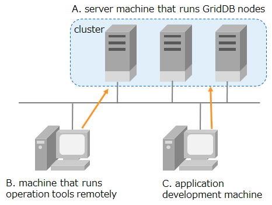
  <figcaption>Example machine configuration</figcaption>
</figure>


| machine | use purpose | packages to install |
|--------|--------|--------------|
| A. server machine that runs GridDB nodes | To run GridDB nodes and operation tools. .  | griddb-ee-server<br>griddb-ee-client<br>griddb-ee-java-lib |
| B. machine that runs operation tools remotely | To remotely run operation tools on GridDB nodes and clusters.  | griddb-ee-client<br>griddb-ee-java-lib |
| C. application development machine | To develop C applications.  | griddb-ee-c-lib |

[notes]
- The example above assigns a separate machine for each purpose of use. But all purposes can be achieved together on one machine.


### Installation procedures

Depending on the package to be installed, complete one of the following steps:

| step | what to do          | In which machine to install     |
|---|------------------------|--------------------|
| 1 | Install a package. | all machines                |
| 2 | Setting up the OS user         | machine on which the server package (griddb-ee-server)<br>or<br>the client package (griddb-ee-client) is installed |      
| 3 | Set up the network environment   | machine on which the server package (griddb-ee-server) is installed |
| 4 | Set up the node environment        | machine on which the server package (griddb-ee-server) is installed  |
| 5 | Setting up the environment for operation tools    | machine on which the client package (griddb-ee-client) is installed |
| 6 | Setting up the library environment    | machine on which library packages are installed |

In the case above, complete the steps shown in callouts pointed to each of the three machines.

<figure>
  
  <figcaption>Installation procedure</figcaption>
</figure>


### Installing the package

Install the packages needed on a machine where GridDB is used.

[example of running CentOS]
```
$ cd <mount paths for a CD-ROM or DVD-ROM＞/RHEL/rpm
$ sudo rpm -ivh griddb-ee-server-X.X.X-linux.x86_64.rpm
preparing...                ########################################### [100%]
User gsadm and group gridstore have been registered.
GridDB uses new user and group.
   1:griddb-ee-server          ########################################### [100%]
$
$ sudo rpm -ivh griddb-ee-client-X.X.X-linux.x86_64.rpm
preparing...                ########################################### [100%]
User and group has already been registered correctly.
GridDB uses existing user and group.
   1:griddb-ee-client          ########################################### [100%]
$
$ sudo rpm -ivh griddb-ee-java-lib-X.X.X-linux.x86_64.rpm
preparing...                ########################################### [100%]
   1:griddb-ee-java-lib        ########################################### [100%]
$
$ sudo rpm -ivh griddb-ee-c-lib-X.X.X-linux.x86_64.rpm
preparing...                ########################################### [100%]
   1:griddb-ee-c-lib           ########################################### [100%]
$
  :
  :
  :
```
[Memo]
- For Ubuntu Server, use the dpkg command to install the package.
```
$ sudo dpkg -i griddb-ee-server_X.X.X_amd64.deb
```

[note]
- To install Python library packages, Node.js library packages, and Go library packages, make sure to install C library packages first.
- To install Web API packages, make sure to install Java library packages together.


Installing the server package (griddb-ee-server) or the client package (griddb-ee-client) will automatically set up the following:

- Create a GridDB user and group.
  - Create an OS user "gsadm" and a group "gridstore" who run GridDB nodes.

    | user | group membership | home directory |
    |---------|-------|---------------------|
    | gsadm | gridstore | /var/lib/gridstore |

  - Define the following environment variables in the bash_profile file of the user "gsadm":

    | environment variables | value | description |
    |---------|----|------|
    | GS_HOME | /var/lib/gridstore | GridDB home directory |
    | GS_LOG  | /var/lib/gridstore/log | output directory for node event log files |

  - No change is made if the same user/group name exists.

- Create a GridDB home directory
  - Create the home directory /var/lib/gridstore for the user "gsadm."

- Register services (server package only)
  - Register GridDB nodes in the OS service.
  - The service name is gridstore. Configure the service to start automatically in OS runlevels 3, 4, and 5.


### Setting up the OS user

**This setup is required for a machine on which the server package (griddb-ee-server) or the client package (griddb-ee-client) is installed.**

Installing the server package or the client package will create the OS user "gsadm."
A password is not for gsadm. Set a password.

[example of executing the command]
```
$ sudo passwd gsadm
```

Change the upper limit for the number of available processes and the number of files that can be opened to make more resources available. Set the value in /etc/security/limits.conf.

[example of setting in limits.conf]
```
gsadm soft nproc 16384
gsadm hard nproc 16384
gsadm soft nofile 65536
gsadm hard nofile 65536
```

Log in again as gsadm and the settings are applied. Use the command ulmit -a to check the content of the settings.

### Setting up the network environment

**This setup is required for a machine on which the server package (griddb-ee-server) is installed.**

To run GridDB nodes, the host name of each node server must correspond to an IP address.

First check how a host name corresponds to an IP address.
Execute the command "hostname -i" to check the host settings and IP address settings.
If the IP address is already set as shown below, the task described in this section on network settings is not required.

- [example of executing the command]
    ```
    $ hostname -i
    192.168.11.10
    ```

The error message below and the loopback address 127.0.0.1 indicate that the IP address is not set yet.
Perform the steps 1 to 3 below:

- [example of executing the command]
  ```
  $ hostname -i
  hostname: no IP address corresponding to the host name
  ```
  OR
  ```
  $ hostname -i
  127.0.0.1
  ```


How to set the network
1. Check the host name and IP address set by OS.

  - Check the host name.

    [example of executing the command]
    ```
    $ hostname
    GS_HOST
    ```

  - Check the IP address.

    [example of executing the command]
    ```
    $ ip route | grep eth0 | cut -f 12 -d " " | tr -d "\n"
    192.168.11.10
    ```

2. Set how a host name corresponds to an IP address.

  - Add the host name and IP address checked in step 1 to the /etc/hosts file as a root user.

    [example as written in the file]
    ```
    192168.11.10   GS_HOST
    ```

3. Check that the correspondence is correctly set.

  - Execute the command "hostname -i" to check the host settings and IP address settings. Check that the IP address added in step 2 is shown.

    [example of executing the command]
    ```
    $ hostname -i
    192.168.11.10
    ```


### Setting up the node environment

**This setup is required for a machine which runs nodes. For all other machines, no setup is needed.** For all other machines, no setup is needed.**

Set up the definition files. Set up the environment in one of the machines that run nodes first; then, distribute the definition files in that machine to other machines.

<figure>
  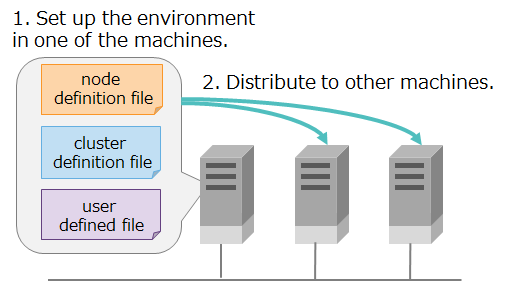
  <figcaption>Setting up the node environment</figcaption>
</figure>


#### Setting parameters

Definition files for a node are of two types: node definition files "gs_node.json" and cluster definition files "gs_cluster.json".

- cluster name
  - The setting of cluster names is required.

- other parameters
  - Change the parameters to match the physical design of the system.


#### Setting administrative users

An administrative user is used for running operation commands and performing operations only allowed to those with administrator authority.

The installation of a package creates the following administrative user by default:

| administrative user | password |
|-----------|-----------|
| admin     | admin     |
| system    | manager   |


For increased security, change the default password for administrative users.
Use the command gs_passwd to change the password for administrative users.

[example of executing the command]
```
# su - gsadm
$ gs_passwd admin
Password: (Enter the password)
Retype password: (Re-enter the password)
```


To add a new administrative user, use the command gs_adduser.
The name of an administrative user should start with "gs#". The characters gs\# should be followed by one or more characters which can contain only ASCII alphanumeric characters or underscores (_). The maximum number of characters allowed is 64.

[example of executing the command]
```
# su - gsadm
$ gs_adduser gs#newuser
Password: (Enter the password)
Retype password: (Re-enter the password)
```


Information on the administrative user is stored in the user defined file (/var/lib/gridstore/conf/password).

[notes]
- All the nodes configuring a cluster must have the same content. When adding or deleting an administrative user or changing a password within one node, always do the same for all other nodes.


#### Setting services

Services automatically start nodes.

To perform cluster configuration at the same time as nodes start up, the setting of services is required.
For details see the [GridDB Operation Tools Reference](../5.md_reference_operation_tool/md_reference_operation_tool.md).


#### Distributing definition files

Set up the environment in one of the machines that run nodes first; then, distribute the definition files in that machine to other machines.


###  Setting up the environment for operation tools

Set up the environment for operation tools to be used
For details about how to set up each tool, see the [GridDB Operation Tools Reference](../5.md_reference_operation_tool/md_reference_operation_tool.md).


### Setting up the library environment

#### Python libraries

To use Python libraries, install Python packages (griddb_python) using the following commands: Run the commands as gsadm user.

```
$ pip install /usr/griddb/lib/python
```

- Have pip installed before running the command above.

#### Node.js libraries

To use Node.js libraries include them in several different paths as shown below:

```
$ export LIBRARY_PATH=${LIBRARY_PATH}:/usr/griddb/lib
$ export NODE_PATH=/usr/griddb/lib/nodejs
$ export LD_LIBRARY_PATH=${LD_LIBRARY_PATH}:/usr/griddb/lib/nodejs
```

- Have glibc 2.14 or higher installed before running the commands above.

#### Go libraries

To use Go libraries, include them in several different paths as shown below and build the libraries.

```
$ export LIBRARY_PATH=${LIBRARY_PATH}:/usr/griddb/lib
$ export GOPATH=$GOPATH:/usr/griddb/lib/go
$ export LD_LIBRARY_PATH=${LD_LIBRARY_PATH}:/usr/griddb/lib/go
$ go install griddb/go_client
```

- Have gcc and gcc-c++ or higher installed before running the commands above.

#### Developing applications on the Windows environment

##### Developing applications using JDBC

Use the JDBC driver to develop applications using the Java language library while working in combination with applications and BI tools that access GridDB on the Windows environment.

Files for the JDBC driver are stored in the GridDB installation media for you to use. Copy the jar files in the \Windows\JDBC folder on the installation media into the folder referenced by the applications.


##### Developing applications using ODBC

Use the ODBC driver to develop applications using the C language library while working in combination with applications and BI tools that access GridDB on the Windows environment.
See the [GridDB ODBC Driver User Guide](../17.md_reference_odbc/md_reference_odbc.md) to install the driver and set up its environment.


## Uninstallation

If GridDB is no longer needed, uninstall all installed packages. To uninstall, complete the following steps:

1. Check the packages installed.
2. Uninstall them.

[example of running CentOS]
```
// Check the packages installed.
$ sudo rpm -qa | grep griddb
griddb-ee-server-X.X.X-linux.x86_64
griddb-ee-client-X.X.X-linux.x86_64
griddb-ee-java-lib-X.X.X-linux.x86_64
griddb-ee-c-lib-X.X.X-linux.x86_64

// uninstall
$ sudo rpm -e griddb-ee-server
$ sudo rpm -e griddb-ee-client
$ sudo rpm -e griddb-ee-java-lib
$ sudo rpm -e griddb-ee-c-lib
```

[example of running CentOS]
- For Ubuntu Server, use the dpkg command to uninstall the package.
```
$ sudo dpkg -r griddb-ee-server
```


[notes]

Note files under the GridDB home directory including the definition file and data files are not uninstalled. (For Ubuntu Server, a warning message might be issued stating the directories cannot be deleted and the like, but this is not a problem.) Delete them manually if not necessary.


## --- Operation ---

## Responses when a failure occurs

If a problem occurs while building a system using GridDB or while using the system, determine what the symptoms of the problem are and under which conditions the problem has occurred based on action taken, the error codes, and other information.
After checking the problem status, review possible solutions and apply them.


### Responses to node failures

Node Event log files record messages about events such as exceptions occurring within a node, as well as information about system activity.

If a problem exists with node behavior, check the node event logs for error or warning messages.
Because a cluster is composed of multiple nodes, make sure to check event logs for each of the nodes for such messages.


- How to check node event logs

  - Log in to the machine that runs the node and check the event log files.
  - Use the command gs_ogs to remotely check the node event logs (only applicable while the node is running)

    - [Example] Check error event logs for the node (172.0.10.1).
      ```
      $ gs_logs -u admin/admin -s 172.0.10.1 ERROR
      2017-11-17T19:34:46.895+0900 HOSTNAME 10933 ERROR SQL_SERVICE
       [10010:TXN_PARTITION_STATE_UNMATCH]
      (required={ON}, actual=STOP) <VVZk3btebewYF・・・
      ```

- output format for event logs

  - prints information about one event per line.

    ```
    (date, time, zone (yyyy-MM-ddTHH:mm:ss±hhmm))(host name)(thread number)(log level)(category)\[(error code)\](message)<(detailed information about base64: detailed information for analyzing problems with support services)>
    ```


  - Examples
    ```
    2019-03-20T04:01:50.423+0900 RHEL73-1 13057 INFO CLUSTER_OPERATION\[40906:CS_NORMAL_OPERATION\] Recovery checkpoint is completed, start all services
    ```


- How to respond

  - If an error occurred, see the [GridDB Error Codes](../6.md_error_code/md_error_code.md) to determine the meaning of an "error code" and check its causes and responses.


- event log file output

    |                   |                          |
    |-------------------|--------------------------|
    | destination directory  | log                      |
    | file name         | gridstore-%Y%m%d-n.log   |
    | when to switch log files     | - when staring a node<br>- when printing first logs after a date change since the last logs<br>- when the file size exceeds 1 MB |
    | maximum number of files   | 30 <br>(When the number of files exceeds 30, the oldest file is deleted.) |

  - The destination directory and the maximum size of log files can be changed by specifying them in the node definition file (gs_node_json).

    | parameter                | initial value | description  | changes made after startup |
    |-----------------------------|--------|--------------------------------------|--------------|
    | /system/eventLogPath        | log    |  deployment directory for event log files | possible (Restart nodes)   |
    | /trace/fileCount            | 30     | maximum number of event log files           | possible (Restart nodes)   |


### Responses to application failures

If a problem occurs while running an application that uses a client API (NoSQL/New SQL interface), check the error codes and error messages returned by the client API.

Depending on which client API is used, the steps for retrieving error codes and error messages are different. For details, see the references for each API.

See the [GridDB Error Codes](../6.md_error_code/md_error_code.md) to determine the meaning of an error code number, check its causes, and take measures.

If the error is due to the node, not the application, check the node event log with the time when the error occurred and check the status of the node when an error occurred.


[Example] Java API
- The following error information can be obtained by using GSException#getErrorMessage():

  ``` example
  [error code : error symbol] error message (supplementary information)
  ```

- an illegal container name is specified

  ``` example
  [145007:JC_ILLEGAL_SYMBOL_CHARACTER] Illegal character found (character="#", containerName="#Sample", index=0)
  ```


### Responses to failures in operation tools

If an error occurs in an operation tool, see the log file of that operation tool to check the description of the error that has occurred.

The log file destinations for selected operation tools are shown below:

| operation tools                      | output destination                 | How to specify an output destination       |
|--------------------------------|------------------------|-------------------|
| operation commands (such as gs_joincluster) | /var/lib/gridstore/log | environment variable GS_LOG for gsadm user    |
| integrated operations management GUI (gs_admin)          | /var/lib/gridstore/admin/log  | log settings file (WAS directory /webapps/gs_admin/WEB-INF/classes/logback.xml) |
| shell command gs_sh            | /var/lib/gridstore/log  | log settings file (/usr/griddb/prop/gs_sh_logback.xml)<br>parameter logPath |
| export/import tool   | /var/lib/gridstore/log | property file (/var/lib/gridstore/expimp/conf/gs_expimp.properties)<br>parameter logPath |


[Example] log file for the gs_startnode command file name: gs_startnode.log

``` example
2014-10-20 15:25:16,876 [25444] [INFO] <module>(56) /usr/bin/gs_startnode start.
2014-10-20 15:25:17,889 [25444] [INFO] <module>(156) wait for starting node. (node=127.0.0.1:10040 waitTime=0)
2014-10-20 15:25:18,905 [25444] [INFO] <module>(192) /usr/bin/gs_startnode end.
```

[notes]
- It is recommended to check event log information for the server together with information about operation tools.


## Configuration management

### Adding nodes


#### Points to consider when designing

One of the best practices to optimize resource placement is to start with a minimum number of machines at low cost in the initial operation of the system, and, if the system runs out of resources due to data growth, add nodes to scale out the system.

Estimate an increase in the amount of the system's data and plan the timing of adding nodes.


<figure>
  
  <figcaption>Node addition in proportion to the increase in data volume</figcaption>
</figure>


Consider scale-out if the system runs out of resources during its operation due to the following reasons:

- memory space shortage
  - The number of swap processing operations has increased.

- disk space shortage
  - The available disk space (=disk space minus file size) has decreased.


#### Procedures for adding nodes

Before adding node, it is recommended to stop clusters if possible. It is also possible to add nodes online during the system's operation.

1. Build a GridDB environment online during the system's operation.

  - Install GridDB that has the same version as the current cluster on a new machine to which nodes are added.
  - Copy the following three files in one of the nodes in the current cluster.
    - node definition file (conf/gs_node.json)
    - cluster definition file (conf/gs_cluster.json)
    - user defined file (conf/password)


2. Modify settings for applications and operation tools, and cluster configuration scripts.

  - applications (applicable if the fixed list method or provider method is selected as a connection method.)
    - Add the IP addresses of the nodes to add in an address list.

  - In commands that join nodes to the cluster, specify the number of nodes configured. To add nodes, this number must be changed before addition.

    - user-created scripts that use the operation command gs_joincluster.
    - settings for the shell command gs_sh
      - setcluster command
    - services
      - Change the number of MIN_NODE_NUM in the startup settings file (/etc/sysconfig/gridstore/gridstore.conf).
    - integrated operations management GUI (gs_admin)
      - Change the node configuration on the repository panel.


3. Add nodes.

  - Add nodes after stopping cluster.

    - Stop the cluster.
    - Join nodes to the cluster including new machines.


  - Add nodes while the cluster is running.

    - Verify that the status of the cluster is STABLE.
    - Execute the command "gs_appendcluster" for adding nodes.


<a id ="label_changing_parameters"></a>
### Changing parameters

Set the behavior of nodes and clusters using node definition files (gs_node.json) and cluster definition files (gs_cluster.json).
Three cases are possible as to whether parameter change is allowed after starting nodes or while running the cluster.

| allowed or not           | description                            |
|-------------------|---------------------------------|
| change not allowed           | Once nodes are started, setup values cannot be changed. To change setup values, database must be initialized. |
| change allowed (restart )     | Change setup values in the definition files and restart the nodes to apply new values. |
| change allowed (online) | Parameters can be changed online while nodes and the cluster are running. Use the command gs_paramconf to change them. Changes made online are not permanent. To make them permanent, manually modify the corresponding definition files. Otherwise, parameters are reset to the original value after restart. |


Procedures for changing parameters online

1. Change parameters using the gs_paramconf command for changing parameters.

  - [example of executing the command]
    ```
    $ gs_paramconf -u admin/admin --set storeMemoryLimit 2048MB
    ```

2. Verify that parameters have been changed.

  - [example of executing the command]
    ```
    $ gs_paramconf -u admin/admin --show storeMemoryLimit
    "2048MB"
    ```

3. Manually modify the definition files specifying parameters that have been changed online.


[notes]
- After changing parameters online, be sure to manually modify the corresponding definition files specifying parameters. Otherwise, parameters are reset to the original value after restart.


## Migrating data


### How to migrate data to a new machine

This section describes how to build a new cluster having the same settings as the currently working cluster to replace a machine or for other purposes.

In such cases, data migration can be completed just by stopping nodes and physically copying the database files to a new machine


1. Install GridDB on a new machine.

  - For installation, use the RMP whose version and edition are the same as the currently working nodes.

2. Copy definition files.

  - Copy three files (a cluster definition file, a node definition file, and a user defined file) to a new machine for deployment.

3. Stop the currently working cluster.

  - Stop the cluster using the gs_stopcluster command for stopping a cluster.
  - Stop each node using the gs_stopnode command for stopping a node.

4. Copy database files.

  - Copy all data under the directories specified in /dataStore/dataPath and /dataStore/transactionLogPath in the node definition file to a new machine.

5. Start the cluster on a new machine.


### How to migrate data if the existing database is not compatible

If the current database becomes incompatible after upgrading GridDB or for other reasons, make sure to perform data migration by exporting and importing data.

Exporting and importing may take time depending on the amount of data and the performance of disk I/O.

1. Export all data in the cluster.

  - gs_export -u admin/admin --all -acl

2. Perform an upgrade installation to install GridDB.

3. Import all data.

  - gs_import -u admin/admin --all --acl

[Memo]
A database conversion tool is available to upgrade GridDB from V4 to V5. For details, see the "[GridDB Operation Tools Reference](../5.md_reference_operation_tool/md_reference_operation_tool.md)" .
