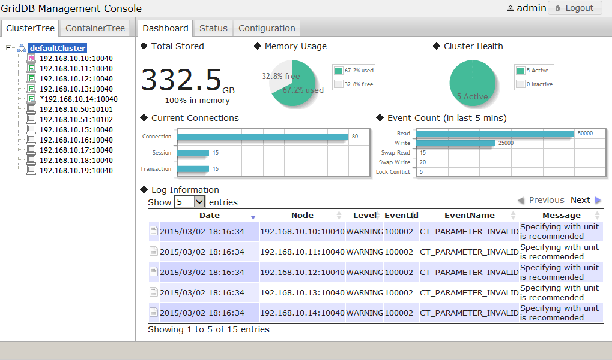
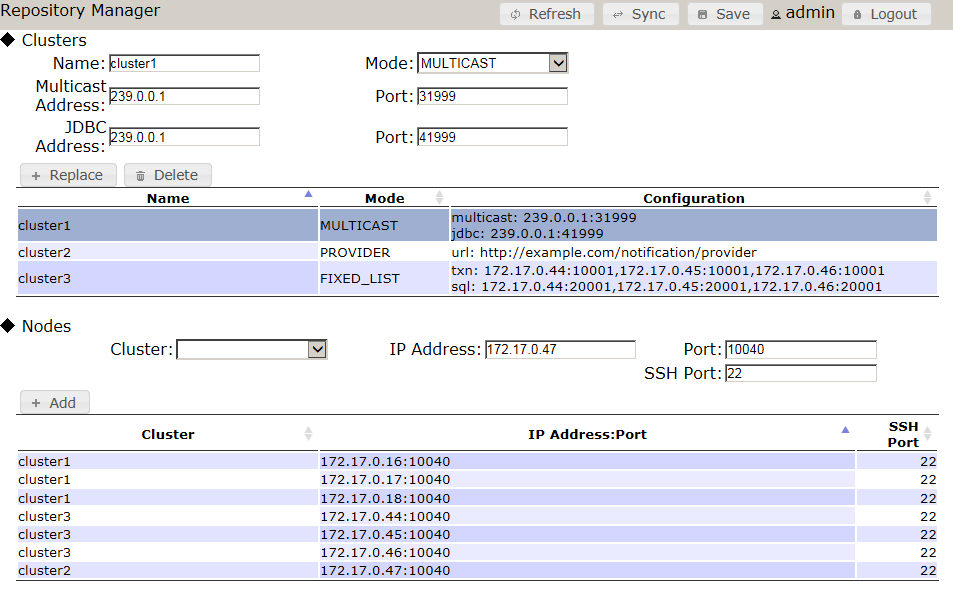
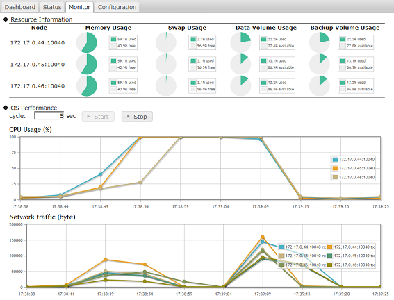
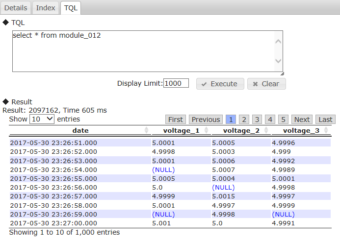

## --- Introduction ---

## Purpose and structure of this manual

This manual describes the operating tools of GridDB.

It is written for system designers and system administrators responsible for GridDB system's construction and operation management respectively.

The contents of each chapter is as follows:

* Service  
  This section explains the GridDB service performed automatically during OS start-up.

* Operating commands  
  This section explains the various operating commands of GridDB.

* Cluster operation control command interpreter (gs_sh)  
  This section explains the GridDB cluster operation control functions and the command interpreter (gs_sh) to provide data operations.

* Integrated operation control GUI (gs_admin)  
  This section explains the web-based integrated operation control GUI (gs_admin) integrating the operating functions of a GridDB cluster.

* Export/import tools  
  This section explains the export/import tools of GridDB.


<a id="griddb_service"></a>
## --- Service ---

<a id="preparing_to_use_the_service"></a>
## Preparing to use the service

The procedure to use and install GridDB service is as follows.

1.  Install GridDB server package and client package.
2.  Configure the respective GridDB nodes that constitute a GridDB cluster.
3.  Configure the start configuration file.

See the "[GridDB Administrator Guide](../4.md_administrators_guide/md_administrators_guide.md)" for the procedure to install GridDB and configure a GridDB node.

The table above shows the kinds of files used in GridDB services.

| Type | Meaning                                          |
|--------------------|----------------------------------------------|
| systemd unit file | systemd unit definition file. It is installed in /usr/lib/systemd/system/gridstore.service by the server package of GridDB and  registered on the system as GridDB service. |
| Service script | Script file is executed automatically during OS startup. <br />It is installed in /usr/griddb/bin/gridstore by the server package of GridDB. |
| PID file | File containing only the process ID (PID) of the gsserver process. This is created in $GS_HOME/conf/gridstore.pid when the gsserver process is started.     |
| Start configuration file | File containing the parameters that can be set while in service. <br />Depending on the GridDB server package, it is installed in /etc/sysconfig/gridstore/gridstore.conf. |


## Parameter setting

A list of parameters is available to control the GridDB service operations. A list of the parameters is given below.

| Property       | Default                          | Note                           |
|--------------|-------------------------------------|--------------------------------|
| GS_USER       | admin                            | GridDB user name               |
| GS_PASSWORD   | admin                            | `GS_USER` password         |
| CLUSTER_NAME  | INPUT_YOUR_CLUSTER_NAME_HERE | Cluster name to join              |
| MIN_NODE_NUM | 1                                | Number of nodes constituting a cluster   |

To change the parameters, edit the start configuration file (`/etc/sysconfig/gridstore/gridstore.conf` ).

When a server package is updated or uninstalled, the start configuration file will not be overwritten or uninstalled.

[Notes]
-   Do not directly edit a parameter described in service script. The edited file will be lost when the server package is uninstalled or updated.  When changing the parameters, edit the start configuration file.
-   When composing a cluster with multiple nodes, use the same parameter file for each node to be attached to the cluster.  In particular, if a cluster is expanded by an operation control command, command interpreter, etc. during system operation, the parameter `MIN_NODE_NUM` of all the nodes needs to be changed to the number of nodes constituting a cluster after the expansion.

## Log

See the boot log( `/var/log/boot.log` ) and operating command log(`$GS_HOME/log` ) for details of the service log.


## Command

GridDB service commands are shown below.

[Notes]
-   If, on the GridDB cluster, SSL connection is enabled and non-SSL connection is disabled (i.e., /system/serverSslMode is set to REQUIRED), set the environment variable `GS_SSL_MODE` and enable SSL connection for communication for issuing operation commands. For details on SSL connection, see the [GridDB Features Reference](../3.md_reference_feature/md_reference_feature.md).
    - Setting the environment variable `GS_SSL_MODE` to REQUIRED will validate SSL connection for communication for issuing operation commands; setting the variable to VERIFY will validate SSL connection for communication for issuing operation commands and perform server certificate verification.
    - To validate server certificate verification (by setting the environment variable `GS_SSL_MODE` to VERIFY), specify the path to the certificate by the Certificate Authority (CA) for the environment variable `SSL_CERT_FILE`.
    - Set the environment variable in the bash_profile file for the OS user gsadm.

``` example
vi .bash_profile
GS_SSL_MODE=VERIFY
export GS_SSL_MODE
SSL_CERT_FILE=$GS_HOME/security/ca.crt
export SSL_CERT_FILE
```

### start

Action:

-   Start a node and join to a cluster.

``` example
$ sudo systemctl start gridstore
```

-   This function executes gs_startnode command to start a node and gs_joincluster command to join to a cluster.
-   When the gs_startnode command is executed, the system waits for the recovery process to end.
-   When the gs_joincluster command is executed, the system doesn't wait for the cluster to start operation.
-   `Set the cluster name in `CLUSTER_NAME` .
-   `Set the number of nodes constituting a cluster in `MIN_NODE_NUM` .

[Notes]
-   If an error occurs in the middle of a cluster operation, the gsserver process will be stopped.

### stop

Action:

-   Leave from a cluster and stop a node.

``` example
$ sudo systemctl stop gridstore
```

-   End if there are no more processes, and error if the timeout time has passed (termination code 150).
-   If there are no processes started by the service, termination code 0 will be returned.
-   This function executes gs_leavecluster command to leave a node from a cluster before stopping a node.
-   This function executes gs_leavecluster command to leave a node from a cluster before stopping a node.
-   When the gs_leavecluster command is executed, the system waits for the node to leave from the cluster.
-   A node stopping process will be performed. regardless of the termination code of the gs_leavecluster command.

[Notes]
-   **When stopping the cluster, execute the gs_stopcluster command and leave/stop each node by a service stop. If you do not stop the cluster with the gs_stopcluster command, autonomous data arrangement may occur due to node leaving. If data relocation happens frequently, network or disk I/O may become a load. If you leave the node after stopping the cluster, data arrangement will not occur. To prevent unnecessary data arrangement, be sure to stop the cluster. To stop the cluster, execute an operating command gs_stopcluster, integrated operation control gs_admin, gs_sh, etc.
-   A node started by an operating command or command interpreter (gs_sh) cannot be stopped by a service stop.  Use the respective tools to stop the node.

### status

Action:

-   Display whether the node process is under execution or not.

``` example
$ sudo systemctl status gridstore
```

### restart

Action:

-   Stop and start continuously.

### condrestart

Action:

-   Restart if there is a lock file.


## Error message list

Service error messages are as shown below.

| Code   | Message                     | Meaning                                  |
|--------|-----------------------------|--------------------------------------|
| F00003 | Json load error             | Reading of definition file failed.     |
| F01001 | Stop service timed out      | Stop node process timed out.   |
| F01002 | Startnode error             | An error occurred in the node startup process.   |
| F01003 | Startnode timed out         | Start node process timed out.   |
| F01004 | Joincluster error           | An error occurred in the join cluster process. |
| F01005 | Joincluster timed out       | Join cluster process timed out. |
| F01006 | Leavecluster error          | An error occurred in the leave cluster process. |
| F02001 | Command execution error     | An error occurred in the command execution.     |
| F02002 | Command execution timed out | Command execution timed out.     |

[Memo]
-   If an error occurs with each command execution, the operating command error will be displayed and recorded at the same time.  Refer to the item on operating commands (gs_startnode, gs_joincluster, and gs_leavecluster) as well when troubleshooting errors.

<a id="griddb_commands"></a>
## --- Operating commands ---

## Command list

The following commands are available in GridDB.

| Type                   | Functions                                          | Command             | RPM package |
|------------------------------|----------------------------------|-------------------|-------------------|
| (1) Start/stop node    | start node                                         | gs_startnode       | server            |
|                              | stop node                                          | gs_stopnode        | client            |
| (2) User management    | Registration of administrator user                 | gs_adduser         | server            |
|                              | Deletion of administrator user                     | gs_deluser         | server            |
|                              | Change the password of an administrator user       | gs_passwd          | server            |
| (3) Cluster management | Joining a cluster configuration                    | gs_joincluster     | client            |
|                              | Leaving a cluster configuration                    | gs_leavecluster    | client            |
|                              | Stopping a cluster                                 | gs_stopcluster     | client            |
|                              | Getting cluster configuration data                 | gs_config          | client            |
|                              | Getting node status                                | gs_stat            | client            |
|                              | Adding a node to a cluster                         | gs_appendcluster   | client            |
|                              | Manual failover of a cluster                       | gs_failovercluster | client            |
|                              | Getting partition data                             | gs_partition       | client            |
|                              | Increasing the no. of nodes of the cluster         | gs_increasecluster | client            |
|                              | Set up autonomous data redistribution of a cluster | gs_loadbalance     | client            |
|                              | Set up data redistribution goal of a cluster       | gs_goalconf        | client            |
|                              | Controlling the checkpoint of the node             | gs_checkpoint      | server            |
| (4) Log data           | Displaying recent event logs                       | gs_logs            | client            |
|                              | Displaying and changing the event log output level | gs_logconf         | client            |
| (5) Backup/restoration | backup execution                                   | gs_backup          | server            |
|                              | Check backup data                                  | gs_backuplist      | server            |
|                              | Backup/restoration                                 | gs_restore         | server            |
| (6) Import/export      | Import                                             | gs_import          | client            |
|                              | Export                                             | gs_export          | client            |
| (7) Maintenance        | Displaying and changing parameters                 | gs_paramconf       | client            |
|                              | Managing user cache for authentication       | gs_authcache      | client            |

[Memo]
-   Operating commands can be executed by an administrator user only.
-   See the chapter on "Import/Export" for details on import/export.


## Common functions of operating commands

**[Command option]**

The options below are common options that can be used in all commands.

| Options    | Note                                   |
|------------|----------------------------------------|
| \-h｜--help | Display the command help.         |
| \--version | Display the version of the operating command. |

[Example]
- Display the command help and version.

  ``` example
  $ gs_startnode -h
  Usage: gs_startnode [-u USER/PASS [-w [WAIT_TIME]] ]

  Start the GridDB node.

  $ gs_stat --version
  gs_stat [V5.0.00]
  ```


The options below are common options that can be used in some of the commands.

| Options    | Note                                                            |
|-----------------------------------------|-----------------------------------------------------------------|
| [-s \<Server\>[:\<Port no.\>]| -p \<Port no.\>] | The host name or the server name (address) and port number,<br />that is, the connection port no. of the operating command. <br>The value "localhost (127.0.0.1):10040" is used by default.                |
| \-u \<User name\>/\<Password\> | Specify authentication user and password.                            |
| -w\|--wait \[\<No. of sec\>\] | Wait for the process to end. <br>There is no time limit if the time is not set or if the time is set to 0. |
| \-a | \--address\-type \<Address type\> | Specify the service type of the port, address to display.<br>system: Connection address of operating command<br>cluster: Reception address used for cluster administration<br>transaction: Reception address for transaction process<br>sync: Reception address used for synchronization process                   |
| \--no-proxy | If specified, the proxy will not be used.                                  |
| \--ssl｜--ssl-verify    | Specifying --ssl will validate SSL connection for communication for operation commands; specifying --ssl-verify will additionally perform server certificate verification as well.  |

[Memo]
-   When executing an operating command, specify the administrator user as the authentication user.
-   As a substitute for the --ssl ｜--ssl-verify option, the environment variable `GS_SSL_MODE` is available. Specifying REQUIRED for  the environment variable `GS_SSL_MODE` will validate connection for SSL communications for operation commands; specifying VERIF'Y will validate SSL connection for communication for operation commands and perform server certificate verification as well.

[Notes]
-   To enable SSL connection through communication for operational commands by setting the  --ssl ｜--ssl-verify option or the environment variable `GS_SSL_MODE`, the following is required:
    - Enable SSL connection on the GridDB cluster. For details, see the [GridDB Features Reference](../3.md_reference_feature/md_reference_feature.md) .
    - To validate server certificate verification (by specifying the --ssl-verify option or setting the environment variable `GS_SSL_MODE` to VERIFY), specify the path to the certificate by the Certificate Authority (CA) for the environment variable `SSL_CERT_FILE`.
- Set the environment variable in the bash_profile file for the OS user gsadm.
``` example
vi .bash_profile
GS_SSL_MODE=VERIFY
export GS_SSL_MODE
SSL_CERT_FILE=$GS_HOME/security/ca.crt
export SSL_CERT_FILE
```

**[Termination status]**

The end status of the command is shown below.
-   0:Normal
-   1:Error
-   2:Timeout

**[Log file]**

Log file of the command will be saved in ${GS_LOG}/command name.log.

[Example] The log file below is created if the GS_LOG value is "/var/lib/gridstore/log (default)" and the "gs_startnode" command is executed.

-   /var/lib/gridstore/log/gs_startnode.log

Points to note
--------------

**[Before using an operating command]**

- If a proxy variable (http_proxy) has been set up, specify the --no-proxy option or set the address (group) of the GridDB node in no_proxy and exclude it from the proxy.
  As an operating command will perform REST/http communications, the proxy server may be connected by mistake, thereby deactivating the operating command.

  ``` example
  $ export http_proxy=proxy.example.net:8080
  $ gs_paramconf -u admin/admin --show storeMemoryLimit
  A00110: Check the network setting. (HTTP Error 403: Forbidden)

  $ gs_paramconf -u admin/admin --show storeMemoryLimit --no-proxy
  "1024MB"
  ```

- For commands which has the optional setting "server: port", there is no need to specify the option if the port setting has not been changed from the default.
  In addition, if the optional setting "server: port" is specified, this command can be executed from a computer that is different from the one that started the node.
- When specifying the server:port used in an operating command, specify the value of /system/serviceAddress of the node definition file gs_node.json in the server and the value of /system/servicePort in the port.

**[To compose a cluster]**

A cluster is composed of a group of 1 or more nodes, consisting of a master with the rest being followers.

In a cluster configuration, the number of nodes already participating in a cluster and the number of nodes constituting a cluster are important. The number of nodes already participating in a cluster is the actual number of nodes joined to the cluster. The number of nodes constituting a cluster is the number of nodes that can join the cluster which is specified in the gs_joincluster command.

The number of nodes already participating in a cluster and the number of nodes constituting a cluster can be checked by executing a gs_stat command on the master node, with the values being /cluster/activeCount and /cluster/designatedCount respectively.

The main procedure to create/change a cluster configuration is shown below for reference purposes.  See the following sections for details of each command.

- To compose a cluster  
  - 1\. Start all nodes joining the cluster (gs_startnode command execution).
  - 2\. Specify the number of nodes constituting a cluster and cluster name for all nodes and attach them (join) to the cluster (gs_joincluster command execution).
  - 3\. When Step 1) and 2) are completed, the master node is determined and service will be started.
  - 4\. Check the cluster configuration status (gs_config command execution).

- To make a node stop  
  - 1\. Detach the node to stop from the cluster configuration (gs_leavecluster command execution).
  - 2\. Stop the node (gs_stopnode command execution).

- To stop a cluster  
  - 1\. Stop the cluster and let all the nodes leave the cluster configuration (gs_stopcluster command execution).
  - 2\. Stop each node when stopping all the nodes instead of just the cluster (gs_stopnode command execution).

- To restart a cluster  
  - 1\. Start a stopped node if the node has been stopped (gs_startnode command execution).
  - 2\. Attach (join) all nodes constituting the cluster to the cluster (gs_joincluster command execution).
  - 3\. Check the cluster configuration status (gs_config command execution).

- To add a node to a cluster in operation without stopping it  
  - 1\. Specify the destination cluster and attach (join) the nodes to the cluster (gs_appendcluster command execution).
  - 2\. Check the cluster configuration status (gs_config command execution).

- To remove a node from a cluster  
  - 1\. Detach the node from the cluster (gs_leavecluster command execution).
  - 2\. Check the cluster configuration status (gs_config command execution).


Starting/stopping a node
-----------------

### Starting a node

Execute the GridDB start node command on the machine executing the node. This command needs to be executed for each GridDB node.

- Command

  | Command | Option/argument |
  |--------------|------------------------------------------------|
  | gs_startnode | \[-w\|--wait \[\<No. of sec\>\] -u \<User name\>/\<Password\>]<br>\[--releaseUnusedFileBlocks\] <br>\[--ssl｜--ssl-verify\] |

- Options

  | Options    | Note                                           |
  |---------------------------|------------------------------------------------|
  | \--releaseUnusedFileBlocks | Deallocate unused file blocks. |

[Memo]
- Specify the user name and password with -u option. If omitted, [start configuration file](#preparing_to_use_the_service) will be referred.
  - If the specified user name or password is invalid, an authentication error occurs.
- By waiting for start completion with -w option, the following gs_joincluster command can be executed safely.
  - Start completion means that the recovery of the database is completed.
- See the [GridDB Features Reference](../3.md_reference_feature/md_reference_feature.md) for details of the --releaseUnusedFileBlocks option.


### Stopping a node

The following command is used to stop the GridDB node. To stop a node, the GridDB cluster management process needs to be stopped first.

- Command

  | Command | Option/argument |
  |-----------------------|-----------------------------------------------|
  | gs_stopnode | \[-f\|--force\]<br>\[-k\|--kill\]<br>\[-w\|--wait \[\<No. of sec\>]\]<br>\[-s \<Server\>\[:\<Port no.\>\] \| -p \<Port no.\>\]<br>-u \<User name\>/\<Password\> <br>\[--ssl｜--ssl-verify\] |

- Options

  | Options    | Note                                                   |
  |-------------|--------------------------------------------------------|
  | \-f｜--force | Stop a node by force.                           |
  | \-k｜--kill  | Force the node process of a local machine to stop. |


[Memo]
- When stopping a specific node, the node cannot be stopped if it is joined to the cluster configuration. Stop the node after its detachment from the cluster (gs_leavecluster).
- When stopping all nodes, stop the GridDB cluster management process (gs_stopcluster) first and then stop the nodes in sequence.
- When a node is stopped, it may take a while for the process to be actually terminated due to the checkpoint process. Wait for a while until the node has stopped completely.
- Although a node can be forced to stop by specifying a --force option or --kill option, there is a risk that data may be lost.
- The node process of a remote machine cannot be stopped with the --kill option.


User management
----------

The user management is used to perform registration/deletion/password change for GridDB administrator user.

The default user below exists after installation.

- Default user

  | User   | \<Password\> | Use case example                                             |
  |--------|------------|--------------------------------------------------|
  | admin  | admin        | Operation administrator user, for executing operation commands   |
  | system | manager      | Application user, for client operation |

[Notes]
- A GridDB user is different from an OS user.
- In order to use it for authentication purposes in the client, the same user data needs to be registered in all the nodes constituting the cluster.  Copy the user definition file etc. so that the same user data will be referenced by all the nodes.  The default file is as shown below.
  - `/var/lib/gridstore/conf/password`
- When user registration/deletion/password change is carried out, distribute the revised user definition file to all the nodes, stop the cluster, restart the nodes, and then recompose the cluster.


### Registration of administrator user

- Command

  | Command | Option/argument |
  |----------------------|-------------------------------|
  | gs_adduser | \<User name\><br>[-p\|--password \<Password\>] |

- Options

  | Options    | Note                         |
  |----------------------------|-----------------------------|
  | \<User name\>               | Specify the name of the user to be created. The username should start with "gs#", and only one or more ASCII alphanumeric characters and the underscore sign "_" can be used after "gs\#". |
  | \-p|--password \<Password\> | Specify the user password. A prompt to input the password interactively appears by default.    |

[Memo]
- Execute as an OS user gsadm.
- The password is encrypted during registration.
- When an administration user is registered, distribute the user definition file of the node which executed the command to all the nodes, stop the cluster, restart the nodes, and then recompose the cluster.
- Only "admin", "system" can be re-registered even after they are deleted.

[Example]
- Add an administrator user ("user name (gs\#someone)", "password (opensesame)") to the user definition file.

  ``` example
  $ gs_adduser -p opensesame gs#someone
  $ gs_stopcluster -u admin/admin
  Execute the following in all the nodes
  $ gs_stopnode -u admin/admin
  $ cp [User definition file with additional users] /var/lib/gridstore/conf/password
  $ gs_startnode
  $ gs_joincluster -c clsA  -n XX -u admin/admin
  ```


### Deletion of administrator user

- Command

  | Command | Option/argument |
  |----------------------|----------|
  | gs_deluser | \<User name\> |

[Memo]
- Execute as an OS user gsadm.
- When an administration user is deleted, distribute the user definition file of the node which executed the command to all the nodes, stop the cluster, restart the nodes, and then recompose the cluster.

[Example]
- Delete the specified administrator user (gs\#someone).

  ``` example
  $ gs_deluser gs#someone
  $ gs_stopcluster -u admin/admin    
  Execute the following in all the nodes
  $ gs_stopnode -u admin/admin
  $ cp [User definition file with deleted users] /var/lib/gridstore/conf/password
  $ gs_startnode
  $ gs_joincluster -c clsA  -n XX -u admin/admin
  ```


### Update password

- Command

  | Command | Option/argument |
  |---------------------|--------------------------------|
  | gs_passwd | \<User name\><br>[-p\|--password \<Password\>] |

- Options

  | Options    | Note                                                                                                     |
  |---------------------------|----------------------------------------------------------------------------------------------------------|
  | \<User name\>               | The name of the administrator user whose password is going to be changed.                                                           |
  | \-p|--password \<Password\> | Specify the password of the administrator user. A prompt to input the password interactively appears by default. |

[Memo]
- Execute as an OS user gsadm.
- The password is encrypted during registration.
- When the password of an administration user is changed, distribute the user definition file of the node which executed the command to all the nodes, stop the cluster, restart the nodes, and then recompose the cluster.

[Example]
- Change the password of a specified administrator user ("user name (gs\#someone)") to foobarxyz.

  ``` example
  $ gs_passwd -p foobarxyz gs#someone
  $ gs_stopcluster -u admin/admin    
  Execute the following in all the nodes
  $ gs_stopnode -u admin/admin
  $ cp [Revised user definition file] /var/lib/gridstore/conf/password
  $ gs_startnode
  $ gs_joincluster -c clsA  -n XX -u admin/admin
  ```


## Cluster management

### Joining a cluster configuration

When composing a GridDB cluster, the nodes need to be attached (joined) to the cluster.

- Command

  | Command | Option/argument |
  |--------------------------|----------------------------------------------|
  | gs_joincluster | [-c\|--clusterName \<Cluster name\>]<br>[-n\|--nodeNum \<No. of nodes constituting a cluster\>]<br>[-w\|--wait [\<No. of sec\>]]<br>[-s \<Server\>[:\<Port no.\>]\| -p \<Port no.\>]<br>-u \<User name\>/\<Password\> <br>\[--ssl｜--ssl-verify\]|

- Options

  | Options    | Note                                                                              |
  |------------------------------|-----------------------------------------------------------------------------------|
  | \-c\|--clusterName \<Cluster name\>                    | Specify the cluster name. Default value is "defaultCluster".                      |
  | \-n\|--nodeNum \<No. of nodes constituting a cluster\> | Specify the number of nodes of the cluster to be composed. Default value is 1 (single node configuration). |

[Memo]
- **It is recommended to use a different cluster name than the default.**
- If the cluster name of the cluster definition file (`/cluster/clusterName` ) has been set up, an error will occur if the specified cluster name does not match the value set.
- When attaching a new node to a stable cluster, use the node expansion command (gs_appendcluster).
- When composing a cluster by attaching a node to the cluster from a specific machine, use the -w option to wait for the process to complete.
- If a large scale expansion is required, stop the cluster once and then reconstitute the cluster with the new set of nodes.

[Example] Compose a 3-node cluster with the cluster name "example_three_nodes_cluster" using node A - C
- Start the nodes constituting the cluster and attach them to the cluster.

  ``` example
  Execute on node A
  $ gs_startnode
  $ gs_joincluster -c example_three_nodes_cluster -n 3 -u admin/admin -w
  Execute on node B
  $ gs_startnode
  $ gs_joincluster -c example_three_nodes_cluster -n 3 -u admin/admin -w
  Execute on node C
  $ gs_startnode
  $ gs_joincluster -c example_three_nodes_cluster -n 3 -u admin/admin -w
  ```

- Node commencement is done separately in each of the nodes (as shown above) and node entry is performed from a specific node (as shown below).

  ``` example
  Execute on node A - C respectively
  $ gs_startnode
  Execute on node A
  $ gs_joincluster -c example_three_nodes_cluster -n 3 -s <node B's server address> -u admin/admin
  $ gs_joincluster -c example_three_nodes_cluster -n 3 -s <node C's server address> -u admin/admin
  $ gs_joincluster -c example_three_nodes_cluster -n 3 -u admin/admin -w
  ```


### Leaving a cluster configuration

The following command is used to detach a node from a cluster.   
- Command

  | Command | Option/argument |
  |---------------------------|----------------------------------------------|
  | gs_leavecluster | [-f \| --force]<br>[-w \| --wait [\<No. of sec\>]]<br>[-s \<Server\>[:\<Port no.\>] \| -p \<Port no.\>]<br>-u \<User name\>/\<Password\><br>\[--ssl｜--ssl-verify\] |

- Options

  | Options    | Note                           |
  |-------------|--------------------------------|
  | \-f｜--force | Detach a node by force. |

[Memo]
- Use the cluster stop command (gs_stopcluster) to stop a cluster with a single node configuration.
- If there is a risk of data loss, the node cannot leave the cluster.
  - Use the --force option to force the node to leave the cluster.  **Stop the cluster first to detach the node safely off of the cluster.**
- A cluster will be stopped automatically if the number of nodes participating in a cluster is reduced to less than half the number of nodes constituting the cluster due to nodes leaving the cluster.

- **When stopping the cluster, execute the gs_stopcluster command, instead of executing gs_leavecluster command for each node.**
  you do not stop the cluster with the gs_stopcluster command, autonomous data arrangement may occur due to node leaving.
  If data relocation happens frequently, network or disk I/O may become a load.
  If you leave the node after stopping the cluster, data arrangement will not occur. To prevent unnecessary data arrangement, be sure to stop the cluster.
  To stop the cluster, execute an operating command gs_stopcluster, integrated operation control gs_admin, gs_sh, etc.

[Example]
- Execute a leave cluster command on the node that you want to detach from the cluster.

  ``` example
  $ gs_leavecluster -u admin/admin
  ```


### Stop all clusters

The following command is used to stop a cluster.   
- Command

  | Command | Option/argument |
  |--------------------------|---------------------------------------------|
  | gs_stopcluster | [-w\|--wait [\<No. of sec\>]]<br>[-s \<Server\>[:\<Port no.\>] \| -p \<Port no.\>]<br>-u \<User name\>/\<Password\><br>\[--ssl｜--ssl-verify\]  |

[Memo]
- To confirm that a cluster has come to a complete stop, check the status of all nodes constituting the cluster.
- To detach a node from a cluster not in operation, use the leave cluster command (gs_leavecluster).

[Example]
- Execute a cluster stop command.

  ``` example
  $ gs_stopcluster -u admin/admin
  ```


### Getting cluster configuration data

The following command is used to get the cluster configuration data (data on list of nodes joined to a cluster).   
- Command

  | Command | Option/argument |
  |---------------------|----------------------------------------------|
  | gs_config | [-s \<Server\>[:\<Port no.\>]\| -p \<Port no.\>]<br>-u \<User name\>/\<Password\><br>[-a\|--address-type \<Address type\>] <br>\[--ssl｜--ssl-verify\]|

- Options

  | Options    | Note                                                 |
  |--------------------------------|------------------------------------------------------|
  | \-a \| --address-type \<Address type\> | Specify the service type of the port, address to display. <br>system: Connection address of operating command<br>cluster: Reception address used for cluster administration<br>transaction: Reception address for transaction process<br>sync: Reception address used for synchronization process        |

[Memo]
- Address and port information of "master" (master node), "follower" (follower node), "self" (node which executed the command) will be displayed.
- Address and port information for multicast distribution to the clients will be displayed in "multicast".
- The system status (status) will be one of the following.
  - INACTIVE: Stop
  - ACTIVATING: Start operation
  - ACTIVE: In operation
  - DEACTIVATING: Start stop
  - ABNORMAL: Abnormal stop
  - NORMAL_SHUTDOWN: Start normal shutdown

[Example]
- The following data is output when the cluster is composed of 3 nodes and cluster configuration data is acquired from the master.

  ``` example
  $ gs_config -u admin/admin
  {
      "follower": [                       // [array] follower data
          {
              "address": "192.168.11.10", //   [string] connection address of operating command
              "port": 10040               //   [number] connection port of operating command
          },
          {
             "address": "192.168.11.11",
             "port": 10040
          }
      ],
      "master": {                         // master data
          "address": "192.168.11.12",     //   [string] connection address of operating command
          "port": 10040                   //   [number] connection port of operating command
      },
      "multicast": {                      // multicast data
          "address": "239.0.0.20",        //   [string] address for multi-cast distribution to client
          "port": 31999                   //   [number] Port for multi-cast distribution to client
      },
      "self": {                           // own node data
          "address": "192.168.11.12",     //   [string] connection address of operating command
          "port": 10040,                  //   [number] connection port of operating command
          "status": "ACTIVE"              //   [string] system status
      }
  }
  ```


### Getting node status

The following command gets the cluster data (cluster configuration data and internal data), or backup progress status.

- Command

  | Command | Option/argument |
  |-------------------|---------------------------------------------|
  | gs_stat | [-t\|--type \<Type\>]<br>[-a\|--address-type \<Address type\>]<br>[--member]<br>[--csv]<br>[-s \<Server\>[:\<Port no.\>]\| -p \<Port no.\>]<br>-u \<User name\>/\<Password\> <br>\[--ssl｜--ssl-verify\]   |

- Options

  | Options    | Note                                                                          |
  |---------------------------------|------------------------------------------------------------------------------|
  | -t\|--type \<Type\> | Display data of the specified type. <br>backup: Display the backup status             |
  | -a \| --address-type \<Address type\> | Specify the service type of the port, address to display. <br>system: Connection address of operating command<br>cluster: Reception address used for cluster administration<br>transaction: Reception address for transaction process<br>sync: Reception address used for synchronization process                   |
  | --csv | Cluster information is displayed in CSV format. |


[Memo]
- The cluster status (/cluster/clusterStatus) will be one of the following.
  - MASTER: Master
  - SUB_MASTER: Sub-master
  - FOLLOWER: Follower
  - SUB_FOLLOWER: Sub-follower
  - SUB_CLUSTER: cluster is not in operation
- The system status (/cluster/nodeStatus) will be one of the following.
  - INACTIVE: Stop
  - ACTIVATING: Start operation
  - ACTIVE: In operation
  - DEACTIVATING: Start stop
  - ABNORMAL: Abnormal stop
  - NORMAL_SHUTDOWN: Start normal shutdown
- The name of the backup process under execution or last executed is displayed in the backup status (/checkpoint/mode).
  - \-: Completed or not in operation
  - NORMAL_CHECKPOINT: Periodic checkpoint
  - REQUESTED_CHECKPOINT: Manual checkpoint
  - BACKUP: Full backup
  - RECOVERY_CHECKPOINT: Checkpoint (during recovery)
  - SHUTDOWN_CHECKPOINT: Checkpoint (during shutdown)
  - INCREMENTAL_BACKUP_LEVEL_0: baseline of differential/incremental backup
  - INCREMENTAL_BACKUP_LEVEL_1_CUMULATIVE: differential backup
  - INCREMENTAL_BACKUP_LEVEL_1_DIFFERENTIAL: Incremental backup

[Example]
- The following data is output when cluster data is acquired by nodes joined to the cluster in operation.

  ``` example
  $ gs_stat -u admin/admin
  {
                  ：
                  ：
      "cluster": {
          "activeCount": 1,
          "clusterName": "defaultCluster",
          "clusterStatus": "MASTER",
          "designatedCount": 1,
          "loadBalancer": "ACTIVE",
          "master": {
              "address": "192.168.10.11",
              "port": 10010
          },
          "nodeList": [
              {
                  "address": "192.168.10.11",
                  "port": 10010
              }
          ],
          "nodeStatus": "ACTIVE",
          "partitionStatus": "NORMAL",
          "startupTime": "2014-08-29T09:56:20+0900",
          "syncCount": 3
      },
                  ：
                  ：
  }
  ```


### Adding a node to a cluster

Add a new node to a cluster in operation.   
- Command

  | Command | Option/argument |
  |----------------------------|-----------------------------------------------|
  | gs_appendcluster | --cluster \<Server\>:\<Port no.\><br>[-w\|--wait [\<No. of sec\>]]<br>[-s \<Server\>[:\<Port no.\>] \| -p \<Port no.\>]<br>-u \<User name\>/\<Password\> <br>\[--ssl｜--ssl-verify\]  |

- Options

  | Options    | Note                                                                                 |
  |-----------------------------|--------------------------------------------------------------------------------------|
  | \--cluster \<Server\>:\<Port no.\> | Specify the server name (address) and port no. of the node to be added to the cluster. |

[Memo]
- It runs only when the cluster is running and it is in stable state.
- If a large scale expansion is required, stop the cluster once and then reconstitute the cluster with the new set of nodes.
- When expanding a cluster with a single node configuration that is in operation, stop the cluster once first before re-composing the cluster.

[Example]
- Add a new node to a cluster in operation.

  ``` example
  Check the status of the cluster to add the nodes
  $ gs_stat -s 192.168.33.29:10040  -u admin/admin
  {
          :
      "cluster":{                                 //cluster-related
          "activeCount":5,                        //number of nodes already participating in a cluster
          "clusterName":"function_1",             //cluster name
          "clusterStatus":"MASTER",               //cluster status
          "designatedCount":5,                    //number of nodes constituting a cluster
          :
  }
  Check that the number of nodes = number of nodes already participating in a cluster
  If the number of nodes constituting a cluster\> number of nodes already participating in a cluster, execute a gs_joincluster (add node to cluster configuration)

  Start the node you want to add and specify the server address and port no. of the node joined to the cluster in operation.
  $ gs_startnode
  $ gs_appendcluster --cluster 192.168.33.29:10040 -u admin/admin

  Check the cluster status to see if the node has been added successfully to the cluster.
  $ gs_stat  -u admin/admin
  {
          :
      "cluster":{                                 //cluster-related
          "activeCount":6,                        //number of nodes already participating in a cluster
          "clusterName":"function_1",             //cluster name
          "clusterStatus":"MASTER",               //cluster status
          "designatedCount":6,                    //number of nodes constituting a cluster
          :
  }
  ```


### Manual failover of a cluster

The following command is used to execute GridDB cluster failover.

- Command

  | Command | Option/argument |
  |------------------------------|-----------------------------------------------|
  | gs_failovercluster | \[--repair\]<br>\[-s \<Server\>\[:\<Port no.\>\] \| -p \<Port no.\>\]<br>-u \<User name\>/\<Password\> <br>\[--ssl｜--ssl-verify\]  |

- Options

  | Options    | Note                                                         |
  |------------|--------------------------------------------------------------|
  | \--repair | Accept the data lost and execute a forced failover. |

[Memo]
- This command can only be executed when the cluster is in operation.
- Basically, the command is valid in the following cases as the cluster algorithm will be executed as a normal process.
  - The user detects a cluster error and executes a failover immediately.
  - At the end of the data recovery from the backup data, database recovery will be deemed to be complete and the system will be started even if the partition LSN maintained by the cluster is younger than the final update LSN (Permit data lost).

[Example]
- Execute a cluster failover.

  ``` example
  $ gs_failovercluster -u admin/admin
  ```


### Getting partition data

The following command is used to display the partition data of a GridDB node.

- Command

  | Command | Option/argument |
  |------------------------|-----------------------------------------------|
  | gs_partition | [[-n\|--partitionId \<Partition ID\>]<br>[--loss]<br>[-a\|--address-type \<Address type\>]<br>[-s \<Server\>[:\<Port no.\>] \| -p \<Port no.\>]<br>-u \<User name\>/\<Password\> <br>\[--ssl｜--ssl-verify\] |

- Options

  | Options    | Note                                                                   |
  |------------------------------------|------------------------------------------------------------------------|
  | -n\|--partitionId \<Partition ID\> | Specify the partition ID to display data. (Display all data by default) |
  | --loss | Display only data from missing partitions.                               |
  | -a \| --address-type \<Address type\> | Specify the service type of the port, address to display.  <br>system: Connection address of operating command<br>cluster: Reception address used for cluster administration<br>transaction: Reception address for transaction process<br>sync: Reception address used for synchronization process                          |

[Memo]
- -- The loss option can be used only while a cluster is working.
- Missing partitions are partitions that cannot be accessed, including those holding replicas.

[Example]
- Get the partition data of a specific node of a cluster in operation.

  ``` example
  $ gs_partition -u admin/admin
  [
      {
          "backup": [],
          "catchup": [],
          "maxLsn": 300008,
          "owner": {
              "address": "192.168.11.10",
              "lsn": 300008,
              "port": 10010
          },
          "pId": "0",
          "status": "ON"
      },
          ：
  ]
  ```


### Increasing the no. of nodes of the cluster

Increase the no. of nodes of the GridDB cluster.

- Command

  | Command | Option/argument |
  |------------------------------|-----------------------------------------------|
  | gs_increasecluster | [-s \<Server\>[:\<Port no.\>] \| -p \<Port no.\>]<br>-u \<User name\>/\<Password\> <br>\[--ssl｜--ssl-verify\] |

[Memo]
- It runs only when the cluster is running and it is in stable state. Therefore, when adding a node to an active cluster, it is necessary to add one at a time.
- If you want to perform a large-scale expansion, stop the cluster and then reconfigure the cluster by specifying the number of expanded nodes as the number of initial configuration nodes.
- When a cluster is expanded by this command, if there is a node to be expanded, that node will join to the cluster. If there are multiple nodes to be added, one of the nodes will join to the cluster.
- If the node to be expanded is not present and the cluster is expanded by this command, if the node to be expanded is specified, that node will join to the cluster.
- It is not possible to extend a single node configuration cluster while it is running. Please reconfigure the cluster after stopping the cluster.

[Example]
- Increase the no. of nodes of the GridDB cluster and append node to the cluster.

  ``` example
  Confirm the cluster status.
  $ gs_stat -s 192.168.33.29:10040  -u admin/admin
  {
          :
      "cluster":{                                 //cluster-related
          "activeCount":5,                        //number of nodes already participating in a cluster
          "clusterName":"function_1",             //cluster name
          "clusterStatus":"MASTER",               //cluster status
          "designatedCount":5,                    //number of nodes constituting a cluster
          :
  }
  Check that the number of nodes = number of nodes already participating in a cluster

  Start the node to be expanded, execute the gs_joincluster command with the no. of nodes after expansion (6 nodes).
  $ gs_startnode -u admin/admin -w
  $ gs_joincluster -u admin/admin -c function_1 -n 6

  Execute the gs_increasecluster for the cluster to be expanded.
  $ gs_increasecluster -s 192.168.33.29:10040 -u admin/admin

  Confirm that the node to be expanded has been added to the cluster.
  $ gs_stat  -u admin/admin
  {
          :
      "cluster":{                                 //cluster-related
          "activeCount":6,                        //number of nodes already participating in a cluster
          "clusterName":"function_1",             //cluster name
          "clusterStatus":"MASTER",               //cluster status
          "designatedCount":6,                    //number of nodes constituting a cluster
          :
  }
  ```


<a id="set_up_autonomous_data_redistribution_of_a_cluster"></a>
### Set up autonomous data redistribution of a cluster

Enable/disable autonomous data redistribution of a GridDB cluster, or display the setting.  As in the case of stopping nodes and rejoining them in a cluster for rolling upgrade, by disabling autonomous data redistribution, you can eliminate redundant redistribution processing and reduce the load on the operations.

- Command

  | Command | Option/argument |
  |--------------------------|-----------------------------------------------|
  | gs_loadbalance | [--on\|--off] [--cluster]<br>[-s \<Server\>[:\<Port no.\>] \| -p \<Port no.\>]<br>-u \<User name\>/\<Password\> <br>\[--ssl｜--ssl-verify\]|

- Options

  | Options    | Note                                                                 |
  |-------------|----------------------------------------------------------------------|
  | --on｜--off | Enable (--on) or Disable (--off) autonomous data redistribution. <br>If these options are omitted, the current setting value is displayed.           |
  | --cluster | The setting is applied to all nodes of the cluster by specifying this option. <br>If this option is omitted, the setting is applied to only the specified node. |

[Memo]
- When you disable the autonomous data redistribution, you have to restore the setting to enable it again later.  While it is not active, data replication is not performed so that the availability against node failure becomes lower.

[Example]

  ``` example
  Confirm the settings of autonomous data redistribution on all nodes in a cluster.
  $ gs_loadbalance -s 192.168.33.29:10040  -u admin/admin --cluster
  192.168.33.29 ACTIVE
  192.168.33.30 ACTIVE
  192.168.33.31 ACTIVE

  Disable the setting of the node, "192.168.33.31".
  $ gs_loadbalance -s 192.168.33.31:10040  -u admin/admin --off

  ```


### Set up data redistribution goal of a cluster

Enabled/disable GridDB autonomous data redistribution, display the present data redistribution goal, and manual setting.
These commands are used during rolling upgrades, to detach the node safely off the cluster.

- Command

  | Command | Option/argument |
  |--------------------------|-----------------------------------------------|
  | gs_goalconf | [--on\|--off] [--cluster]<br>[-s \<Server\>[:\<Port no.\>] \| -p \<Port no.\>]<br>-u \<User name\>/\<Password\> <br>\[--ssl｜--ssl-verify\]|

  | Command | Option/argument |
  |--------------------------|-----------------------------------------------|
  | gs_goalconf | --manual [[--set JSON_FILE \| --switch PARTITION_ID \| --leaveNode HOST[:PORT]] [--cluster]]<br>[-s \<Server\>[:\<Port no.\>] \| -p \<Port no.\>]<br>-u \<User name\>/\<Password\> <br>\[--ssl｜--ssl-verify\]|

- Options

  | Options    | Note                                                                 |
  |------------------------------|----------------------------------------------------------------------|
  | --on｜--off | Enable (--on) or disable (--off) autonomous data redistribution. <br>If these options are omitted, the current setting value is displayed.           |
  | --cluster | The setting is applied to all nodes of the cluster by specifying this option. <br>If this option is omitted, the setting is applied to only the specified node. |
  | --manual | Display the present data redistribution goal. When setting up a data redistribution goal, specify also one of the following options: set, switch, or leaveNode.|
  | --set JSON_FILE | Set the specified JSON file as a data redistribution goal.|
  | --switch PARTITION_ID | Set a data redistribution goal with the owner and the backup of specified partition ID replaced with each other.|
  | --leaveNode HOST[:PORT] | Set a data redistribution goal with the owner and the backup of all the specified nodes replaced with each other.|

[Example]

  ``` example
  Confirm the settings of autonomous data redistribution on all nodes in a cluster.
  $ gs_goalconf -s 192.168.33.29:10040  -u admin/admin --cluster
  192.168.33.29 ACTIVE
  192.168.33.30 ACTIVE
  192.168.33.31 ACTIVE

  Disable the setting of the node, "192.168.33.31".
  $ gs_goalconf -s 192.168.33.31:10040  -u admin/admin --off

  Set up the data redistribution goal to leave the node of "192.168.33.31" for all the nodes in a cluster.
  $ gs_goalconf -u admin/admin --manual --leaveNode 192.168.33.31 --cluster
  Switching 43 owners to backup on 192.168.33.31:10040 ...
  Setting goal requests have been sent. Sync operations will be started when loadbalancer is active.
  ```


### Controlling the checkpoint

Enable/disable the periodic checkpoint of a GridDB node, or execute manual checkpoint.

- Command

  | Command | Option/argument |
  |-------------------------|-------------------------------------------------------|
  | gs_checkpoint | [--on\|--off] \| [--manual [-w\|--wait [No. of sec]]]<br>[-s \<Server\>[:\<Port no.\>] \| -p \<Port no.\>]<br>-u \<User name\>/\<Password\> <br>\[--ssl｜--ssl-verify\] |

- Options

  | Options    | Note                                                        |
  |-------------|-------------------------------------------------------------|
  | --on｜--off | Enable (--on) or Disable (--off) the periodic checkpoint. <br>If these options are omitted, the current setting value is displayed.  |
  | --manual | \# Perform the manual checkpoint and wait to complete.                      |

[Memo]
- In operation, in case of disabling the periodic checkpoint temporarily, please be sure to re-enable it. While it is disabled, the size of transaction log file become larger and the time of backup operation or the time of recovery operation when restarting gets longer.

[Example]

  ``` example
  Disable the periodic checkpoint
  $ gs_checkpoint -u admin/admin --off

  Perform the manual checkpoint and wait to complete.
  $ gs_checkpoint -u admin/admin --manual -w
  ...
  The manual checkpoint has been completed.

  Re-enable the periodic checkpoint
  $ gs_checkpoint -u admin/admin --on
  ```


Log data
--------

### Displaying recent event logs

The following command is used to get the most recent GridDB event log.   

- Command

  | Command | Option/argument |
  |-------------------|-----------------------------------------------|
  | gs_logs | [-l \| --lines \<No. of rows acquired\>]<br>[-g \| --ignore \<Exclusion key word\>]<br>[-s \<Server\>[:\<Port no.\>] \| -p \<Port no.\>]<br>[--tracestats] [--slowlogs] [--csv]<br>-u \<User name\>/\<Password\><br>[\<First key word\> [\<Second key word\>]] <br>\[--ssl｜--ssl-verify\] |

- Options

  | Options    | Note                                 |
  |-----------------------------------|--------------------------------------|
  | -l\|--lines \<No. of rows acquired\> | Specify the no. of rows to acquire.               |
  | -g\|--ignore \<Exclusion key word\> | Ignore rows that include exclusion key words. |
  | --tracestats | Display the performance trace information in an event log in JSON format. |
  | --slowlogs | Display the slow query information in an event log in JSON format. |
  | --csv | When specifies with --tracestats, display the performance trace information in an event log in CSV format. <br>When specifies with --slowlogs, display the slow query information in an event log in CSV format. |
  | \<First key word\> [\<Second key word\>] | Get only rows that contain the key word.   |

[Memo]
- Only the information of the latest event log file is displayed. The contents of the old event log files are not displayed.
- For the event log function and output format, refer to the event log function in "[GridDB Features Reference](../3.md_reference_feature/md_reference_feature.md)" .
- For details of the slow query information, refer to the [GridDB SQL Tuning Guide](../15.md_sql_tuning_guide/md_sql_tuning_guide.md).

[Example]
- Get logs terminated by the checkpoint 3 times.

  ``` example
  $ gs_logs -u admin/admin CP_END -l 3
  2014-08-04T11:02:52.754+0900 NODE1 1143 INFO CHECKPOINT_SERVICE ../server/checkpoint_service.cpp void CheckpointService::runCheckpoint(EventContext&, int32_t, const std::string&) line=866 : [CP_END] mode=NORMAL_CHECKPOINT, backupPath=, commandElapsedMillis=132
  2014-08-04T11:22:54.095+0900 NODE1 1143 INFO CHECKPOINT_SERVICE ../server/checkpoint_service.cpp void CheckpointService::runCheckpoint(EventContext&, int32_t, const std::string&) line=866 : [CP_END] mode=NORMAL_CHECKPOINT, backupPath=, commandElapsedMillis=141
  2014-08-04T11:42:55.433+0900 NODE1 1143 INFO CHECKPOINT_SERVICE ../server/checkpoint_service.cpp void CheckpointService::runCheckpoint(EventContext&, int32_t, const std::string&) line=866 : [CP_END] mode=NORMAL_CHECKPOINT, backupPath=, commandElapsedMillis=138
  ```


### Displaying and changing the event log output level

The following command is used to display or change the event log output level. Get the list of settings if the argument is not specified.   

- Command

  | Command | Option/argument |
  |----------------------|---------------------------------------------|
  | gs_logconf | [-s \<Server\>[:\<Port no.\>]\| -p \<Port no.\>]<br>-u \<User name\>/\<Password\><br>[\<Category name\> \<Output level\>] <br>\[--ssl｜--ssl-verify\]|

- Options

  | Options    | Note                                                                     |
  |-------------------------|--------------------------------------------------------------------------|
  | [\<Category name\> \<Output level\>] | Specify the category name and output level. |

[Memo]
- When displaying a list of the event log output level, omit \[Category output level\] and execute.
- All output log data with an output level higher than the level specified will be output. For example, if INFO is set, the INFO, WARNING, and ERROR logs will be output.
- A list of the output levels from high to low is shown below.
  - ERROR
  - WARNING
  - INFO
  - DEBUG
- When a node is shutdown, settings changed by the executed command will not be saved.
- The log output level is either the default value given in gs_node.json of the sample, or a level lower than that is recommended to be set.
  See the parameter list of "[GridDB Features Reference](../3.md_reference_feature/md_reference_feature.md)"  for initial values.

[Example]
- Change the log output level and display the event log status.

  ``` example
  $ gs_logconf -u admin/admin CHUNK_MANAGER INFO
  $ gs_logconf -u admin/admin
  {
      "levels": {
          "CHECKPOINT_SERVICE": "INFO",
          "CHECKPOINT_SERVICE_DETAIL": "ERROR",
          "CHUNK_MANAGER": "INFO",
          "CLUSTER_OPERATION": "INFO",
              ：
              ：
      }
  }
  ```


## Backup/restoration

### Backup

The following command is used to get GridDB backup data on a per-node basis while continuing services.

A backup of the entire cluster can be carried out while continuing services by backing up all the nodes constituting the cluster in sequence.

- Command

  | Command | Option/argument |
  |---------------------|--------------------------------------|
  | gs_backup | --mode \<Mode\> [--skipBaseline]]<br>-u \<User name\>/\<Password\><br>\<Backup name\> <br>\[--ssl｜--ssl-verify\]|

- Options

  | Options    | Note                                                                                                                            |
  |----------------|---------------------------------------------------------------------------------------------------------------------------------|
  | --mode \<Mode\> | Specify the backup mode. <br>- auto: auto backup_- auto_nostop: auto backup (no Node stop when an error occurs)- baseline: Create a full backup of the differential/incremental backup baseline- since: After creating a baseline, perform a differential backup from the baseline of the updated data blocks- incremental: After creating a baseline, or After the last incremental, since backup, perform an incremental backup of the updated data blocks |
  | --skipBaseline | If mode is auto or auto_nostop, omit a baseline backup operation. <br>Otherwise, ignore this option.   |
  | \<Backup name\> | Specify the directory name of the backup data.                                                                                |

\<mode option\>

- auto  
  - The transaction log file is automatically copied to the backup directory. As such, the user does not need to perform any backup. Note, however, recovery may take a while in the event of an error because backup is performed by capturing the transaction log file. A full backup is recommended to be performed regularly.

- auto_nostop  
  - Even if an error occurs in transaction log output at the backup site, the node does not stop while trace log output is generated and a duplicated output is stopped. If auto_nostop is not specified, the node will stop as a system error.

- baseline  
  - Create a backup data baseline. In a differential backup, differential data updated from the baseline is backed up.

- since  
  - After executing a backup with a specified baseline, updated data will be backed up (differential backup).

- incremental  
  - After executing a backup with a specified baseline, or after the last incremental, since backup was executed, updated data blocks will be backed up (incremental backup).

<figure>

<figcaption>Backup</figcaption>
</figure>

[Memo]
- Up to 12 alphanumeric characters can be set for the backup name.
- See "[GridDB Features Reference](../3.md_reference_feature/md_reference_feature.md)" for the details of backup.
- The backup file is created under the backup file directory specified in the node definition file (gs_node.json). It is recommended to store the backup file in a separate physical location from the data directory.
- When restoring a GridDB cluster database to the correct status, the backup and restoration processes need to be carried out for the entire cluster.
- Control will return after the command is executed but depending on the data size and online processing load, it may take several hours or more for the backup to complete. The progress status of the backup can be acquired with a gs_stat command.
- When a backup is performed while the cluster is in operation, the backup may be created with the entire cluster in a non-conforming state if multiple containers have are created. If necessary, ban transaction services so that the backup can be executed in the static state.
- In GridDB, data will be automatically re-arranged when a failure occurs. Therefore, if a failure occurs during backup, perform the backup again starting from the first node.
- When specifying --skipBaseline option with the automatic log backup, please take a backup using the other method instead of the online backup function of GridDB.
  For details, see the [GridDB Features Reference](../3.md_reference_feature/md_reference_feature.md) .

[Example]
- Perform a backup in the node being started

  ``` example
  Check the directory where the backup file is stored (backup directory)
  $ cat /var/lib/gridstore/conf/gs_node.json         # configuration check
  {
      "dataStore":{
          "dbPath":"/var/lib/gridstore/data",
          "transactionLogPath":"/var/lib/gridstore/txnlog",
          "backupPath":"/var/lib/gridstore/backup",  # backup directory
          "storeMemoryLimit":"1024MB",
          "concurrency":4,
          "logWriteMode":1,
          "persistencyMode":"NORMAL"
              ：
              ：
  }
  Execute backup
  $ gs_backup -u admin/admin 20150425        # backup execution

  Depending on the data size and load condition, it may take several hours or more for the backup to be completed.
  The progress status of the backup can be checked with a gs_stat command.
  $ gs_stat -u admin/admin --type backup        
  BackupStatus: Processing                          # backup in progress
  ```

- The backup status output by gs_stat (BackupStatus) is one of the following.
  - Processing: Full backup execution in progress
  - Processing (Baseline): Creation of differential/incremental backup baseline in progress (full backup)
  - Processing (Since): Differential backup in progress
  - Processing (Incremental): Incremental backup in progress
  - \-: Completed or not in operation

- The following file is created upon executing a backup.
  - Directory specified in BACKUPNAME will be created under the backup directory ( `/var/lib/gridstore/backup` ).  During a differential/incremental backup, BACKUPNAME_lv0 (baseline directory of differential/incremental backup ), BACKUPNAME_lv1_NNN_MMM (differential (Since) and incremental (Incremental) directory of differential/incremental backup) are created.
  - The backup files below will be created.
      -  data file (m_part_n.dat)
      -  checkpoint log file (m_n.cplog)
      -  transaction log file (m_n.xlog)
      -  backup data file (gs_backup_info.json,gs_backup_info_digest.json)
      -  LSN data file (gs_lsn_info.json)
       \* m and n denote numerals.


### Checking backup data

The following is used to get a list of the backup data in the backup directory set up in the node definition file (gs_node.json).   

- Command

  | Command | Option/argument |
  |-------------------------|----------------------------------------------------|
  | gs_backuplist | -u \<User name\>/\<Password\><br>[--partitionId \<Partition ID\>\|\<Backup name\>] <br>\[--ssl｜--ssl-verify\]|

- Options

  | Options    | Note                                              |
  |--------------------------------|---------------------------------------------------|
  | \--partitionId \<Partition ID\> | Display the LSN data of the specified partition in a list. |
  | \<Backup name\>                 | Specify the backup name.                      |

[Memo]
- A list of the backup data can be displayed regardless of the startup status of the nodes. The Status appears as "P" if the backup process is in progress with the nodes started.
- If the status displayed is NG, the backup file may be damaged and so restoration is not possible.
- Backup names marked with an "\*" at the start of the name in the list display is differential/incremental backup data.
- The status of the differential/incremental backup is always displayed as "-". Multiple backups taken in differential/incremental backup can be checked with detailed data specifying the backup name.

[Example]
- Verify the backup data in the node where you want to check the list of backup data.

  ``` example
  Display the list of backup names.
  $ gs_backuplist -u admin/admin

   BackupName   Status  StartTime                 EndTime
  -------------------------------------------------------------------------
  *201912           --  2019-12-01T05:20:00+09:00 2019-12-01T06:10:55+09:00
  *201911           --  2019-11-01T05:20:00+09:00 2019-11-01T06:10:55+09:00
    :
   20191025NO2      OK  2019-10-25T06:37:10+09:00 2019-10-25T06:38:20+09:00


  Specify the individual backup name and display the detailed data.
  $ gs_backuplist -u admin/admin 201911

  BackupName : 201911

  BackupData            Status StartTime                 EndTime
  --------------------------------------------------------------------------------
  201911_lv0                OK 2019-11-01T05:20:00+09:00 2019-11-01T06:10:55+09:00
  201911_lv1_000_001        OK 2019-11-02T05:20:00+09:00 2019-11-02T05:20:52+09:00
  201911_lv1_000_002        OK 2019-11-03T05:20:00+09:00 2019-11-03T05:20:25+09:00
  201911_lv1_000_003        OK 2019-11-04T05:20:00+09:00 2019-11-04T05:20:33+09:00
  201911_lv1_000_004        OK 2019-11-05T05:20:00+09:00 2019-11-05T05:21:25+09:00
  201911_lv1_000_005        OK 2019-11-06T05:20:00+09:00 2019-11-06T05:21:05+09:00
  201911_lv1_001_000        OK 2019-11-07T05:20:00+09:00 2019-11-07T05:22:11+09:00
  201911_lv1_001_001        OK 2019-11-08T05:20:00+09:00 2019-11-08T05:20:55+09:00


  When investigating the LSN no. of the data maintained in the partition.
  $ gs_backuplist -u admin/admin --partitionId=50
   BackupName    ID   LSN
  ----------------------------------------------------------
  *201912        50   2349
  *201911        50   118
   20190704      50   0
  ```


### Restoration

The following command is used to restore a GridDB backup file.

- Command

  | Command | Option/argument |
  |----------------------|---------------------------------------------|
  | gs_restore | [--test] [--updateLogs] \<Backup name\> |

- Options

  | Options    | Note                                                                       |
  |----------------|----------------------------------------------------------------------------|
  | --test | Get backup data used for restoration purposes without performing a restoration.       |
  | --updateLogs | If specified, restore only log and json files <br>and overwrite existing files.      |
  | \<Backup name\> | Specify the directory name of the backup file to restore.             |

[Memo]
- When restoring data, the node needs to be stopped.
- Pay attention to the number of partitions and the parameter value of the processing parallelism in the cluster definition file. Make sure that these configuration values of backup nodes and those of nodes to be restored are the same. If they are not the same, the node cannot start correctly.
- If the data file is set to be split, pay attention to the parameter value for the splitting count in the node definition file. Make sure that the backup nodes and the nodes to be restored should have the same number of splitting. If they are not the same, restoration will fail.
- If you want to restore the backup state correctly, the backup and restoration tasks need to be carried out for the entire cluster.
- For example, even if some of the nodes are restored, these nodes cannot be returned to the state they were in at the time of the backup. After restoration, it is necessary to attach the nodes to the cluster in operation in order to use the data. However, if the data is updated in the cluster after backup, the restored data will be updated by the (updated) cluster data.   In particular, if the cluster configuration has changed from the time the backup was created, there will be no restoration effect. As the data will be autonomously re-arranged if the node is forced to join a cluster, there is a high probability that the data will become invalid even when restored.
- If data is missing in the backup data file, or if the contents have been revised, a GridDB node will not be able to start services.
- If a signal (Ctrl+C) is sent in the middle of a restoration and the process gets interrupted, the data in the middle of the restoration will be deleted.

[Example]
- Restore backup data. Execute a restoration with the executing node stopped.

  ``` example
  Move the files in the database file directory
  Specify the database file directory with the node definition file (gs_node.json)
  $ mv ${GS_HOME}/data/* ${GS_HOME}/temp_db          # Move the data file and the checkpoint log file.
  $ mv ${GS_HOME}/txnlog/* ${GS_HOME}/temp_txnlog    # Move the transaction log file.

  Check the data to be restored prior to the restoration
  $ gs_restore --test 20190901

  BackupName : 20190901
  BackupFolder : /var/lib/gridstore/backup

  RestoreData           Status StartTime                 EndTime
  --------------------------------------------------------------------------------
  20190901_lv0              OK 2019-09-01T17:50:00+09:00 2019-09-01T17:52:10+09:00
  20190901_lv1_001_000      OK 2019-09-02T17:50:00+09:00 2019-09-02T17:50:15+09:00


  Execute a restoration
  $ gs_restore 20190901                       # restoration
  ```

- In this example, when a restore is run, backup files in the 20190901_lv0 directory under the backup directory ( /var/lib/gridstore/backup ) are copied to the database directories (/var/lib/gridstore/data and /var/lib/gridstore/txnlog) first; then, the data in 20190901_lv1_001_000 is copied in the same way.
- At the end of the restoration, follow the same procedure as a normal start-up to start the restored node and let it join a cluster.
- After start-up, the database file (backup file group) arranged by the restoration is imported and at the end of the import, the GridDB node starts services.


## Maintenance

### Displaying and changing parameters

The following command is used to display or change the node parameters.

- Command

  | Command | Option/argument |
  |------------------------|--------------------------------------------------|
  | gs_paramconf | [-s \<Server\>[:\<Port no.\>]\| -p \<Port no.\>]<br>-u \<User name\>/\<Password\><br>--show [\<Parameter name\>] \| --set \<Parameter name\> \<Value\> <br>\[--ssl｜--ssl-verify\]|

- Options

  | Options    | Note                                                                                                 |
  |-------------------------|------------------------------------------------------------------------------------------------------|
  | \--show [\<Parameter name\>]      | Display the specified parameter. If the parameter is not specified in the command, all parameters will be displayed instead. |
  | \--set \<Parameter name\> \<Value\> | Change the specified parameter to the specified value.                                                         |

[Memo]
- A parameter change (--set) changes the parameter value of a node in operation dynamically. When a node is shutdown, settings changed by the executed command will not be saved. Since the changes are not perpetuated, update the definition file manually.
- The following parameters can be specified.
  - storeMemoryLimit: Upper limit of the store memory
  - traceLimitExecutionTime : Lower limit of execution time of a slow query to write in an event log
  - traceLimitQuerySize : Upper limit of the query character string size to be regarded as a slow query
-   See the parameter list of "[GridDB Features Reference](../3.md_reference_feature/md_reference_feature.md)"
[Example]
- Change the parameter `storeMemoryLimit` and display the value.

  ``` example
  $ gs_paramconf -u admin/admin --set storeMemoryLimit 2048MB
  $ gs_paramconf -u admin/admin --show storeMemoryLimit
  "2048MB"
  ```
- Change the parameter traceLimitExecutionTime and display the value.

  ``` example
  $ gs_paramconf -u admin/admin --set traceLimitExecutionTime 30s
  $ gs_paramconf -u admin/admin --show traceLimitExecutionTime
  "30s"
  ```

### Managing user cache for authentication

The following command lists and deletes cache for user information for faster authentication of general users and of LDAP.

For details on the authentication method, see the [GridDB Features Reference](../3.md_reference_feature/md_reference_feature.md) .

- Command

  | Command | Option/argument |
  |--------------|------------------------------------------------|
  | gs_authcache | --show<br>\[-s server\[:port number\]  \| -p port number\] <br> -u user name/password <br> \[--db database name\] <br> \[--username user name \]<br>\[--cluster\] <br>\[--ssl-verify\]|
  | gs_authcache | --clear<br>\[-s server\[:port number\]  \| -p port number\] <br> -u user name/password <br> --db database name \| --username user name <br>\[--cluster\] <br>\[--ssl-verify\]|

- Options

  | Options    | Note                                           |
  |---------------------------|------------------------------------------------|
  | --show | Display a list of user information stored in cache. |
  | --clear | Delete user information stored in cache.|
  | --db | Specify the name of a database where users' information stored in cache is to be operated.|
  | --username | Specify the user name of the user whose information stored in cache is to be operated.|
  | --cluster | The setting is applied to all nodes of the cluster by specifying this option. <br>If this option is omitted, the setting is applied to only the specified node. |
[Memo]
- If the --show option is specified but the --db and --username options are left unspecified, information on all the users stored in cache will be displayed.
- --If the --clear option is specified, either the --db option or the --username option must be specified.

[Example]
``` example
Display a list of information on all the users stored in cache.
$ gs_authcache -u admin/admin --show
{
    "usercache": [
      {
        "count": 30,
        "dbname": "mydb",
        "username": "user01"
      },
      {
        "count": 8,
        "dbname": "mydb",
        "username": "user02"
      },
      ・・・
    ]
  }
}

```

<a id="griddb_gs_sh"></a>
## --- Cluster operation control command interpreter (gs_sh) ---

## Overview

The cluster operation control command interpreter (hereinafter referred to gs_sh) is a command line interface tool to manage GridDB cluster operations and data operations.

The following can be carried out by gs_sh.
-   Operation control of GridDB cluster
    -   Definition of GridDB cluster
    -   Starting and stopping a GridDB node and cluster
    -   Displaying status and logs
-   GridDB cluster data operation
    -   Database and user management
    -   Container management
    -   Index setting, deletion
    -   Search using a TQL/SQL

## Using gs_sh

### Preliminary preparations

Carry out the following preparations before using gs_sh.
-   GridDB setup
    -   Installation of GridDB node and client library
    -   User creation
    -   Network setting (GridDB cluster definition file, node definition file)

      \* For details of the procedure, refer to the "Installation of GridDB" section of "[GridDB Quickstart Guide](../2.md_quickstart_guide/md_quickstart_guide.md)" .

-   Remote connection setting using SSH
    -   This setting is necessary in order to connect to each GridDB node execution environment from the gs_sh execution environment as an OS user "gsadm".
      \* See the manual of each OS for details on the SSH connection procedure.
      [Memo]
      For Ubuntu Server, add a key exchange algorithm.
        ``` example
        $ vi /etc/ssh/sshd_config
        ...
        Kexalgorithms +diffie-hellman-group14-sha1

        $ sudo systemctl reload sshd
        ```

### gs_sh start-up

There are two types of start modes in gs_sh.

- Startup in interactive mode
  - The interactive mode is started when gs_sh is executed without any arguments. The gs_sh prompt will appear, allowing sub-commands to be entered.

    ``` example
    $ gs_sh
    //execution of sub-command "version"
    gs> version
    gs_sh version 5.0.0
    ```

- Startup in batch mode
  - When the script file for user creation is specified in gs_sh, the system will be started in the batch mode. Batch processing of a series of sub-commands described in the script file will be carried out. gs_sh will terminate at the end of the batch processing.

    ``` example
    // specify the script file (test.gsh) and execute
    $ gs_sh test.gsh
    ```

[Memo]
- When a sub-command is started in the interactive mode,
  - a .gssh_history file is created in the home directory of the execution user and saved in the history.
  - Click the arrow key to display/execute up to 20 sub-commands started earlier.
  - Enter some of the sub-commands and click the Tab key to display a list of the sub-command input candidates.
- Execute gs_sh commands as the OS user "gsadm".
- During gs_sh startup, .gsshrc script files under the gsadm user home directory are imported automatically. The .gsshrc contents will also be imported to the destination from other script files.
- Extension of script file is gsh.
- A script file is described using the character code UTF-8.


## Definition of a GridDB cluster

The definition below is required in advance when executing a GridDB cluster operation control or data operation.
- Define each node data in the node variable
- Use the node variable to define the GridDB cluster configuration in the cluster variable
- Define the user data of the GridDB cluster

An explanation of node variables, cluster variables, and how to define user data is given below. An explanation of the definition of an arbitrary variable, display of variable definition details, and how to save and import variable definition details in a script file is also given below.


### Definition of node variable

Define the IP address and port no. of a GridDB node in the node variable.

- Sub-command

  | |
  |-|
  | setnode \<Node variable\> \<IP address\> \<Port no.\> [\<SSH port no.\>] |

- Argument

  | Argument      | Note                                                                           |
  |---------------|--------------------------------------------------------------------------------|
  | Node variable | Specify the node variable name. If the same variable name already exists, its definition will be overwritten. |
  | IP address    | Specify the IP address of the GridDB node (for connecting operation control tools).                 |
  | Port no.      | Specify the port no. of the GridDB node (for connecting operation control tools).                 |
  | SSH port no.  | Specify the SSH port number. Number 22 is used by default.                  |

- Example:

  ``` example
  //Define 4 GridDB nodes
  gs> setnode node0 192.168.0.1 10000
  gs> setnode node1 192.168.0.2 10000
  gs> setnode node2 192.168.0.3 10000
  gs> setnode node3 192.168.0.4 10000
  ```

[Memo]
- Only single-byte alphanumeric characters and the symbol "_" can be used in the node variable name.
- Check the GridDB node "IP address" and "port no. " for connecting the operation control tools in the node definition file of each tool.
  - IP address: /system/serviceAddress
  - Port no. : /system/servicePort


### Definition of cluster variable

Define the GridDB cluster configuration in the cluster variable.

- Sub-command

  | | |
  |-|-|
  | Multicast method  | setcluster \<Cluster variable\> \<Cluster name\> \<Multicast address\> \<Port no.\> \[\<Node variable\> ...\] |
  | Fixed list method | setcluster \<Cluster variable\> \<Cluster name\> FIXED_LIST \<Address list of fixed list method\> \[\<Node variable\> ...\] |
  | Provider method   | setcluster \<Cluster variable\> \<Cluster name\> PROVIDER \<URL of provider method\> \[\<Node variable\> ...\]             |

- Argument

  | Argument      | Note                |
  |--------------------------------|-------------------------|
  | \<Cluster variable\> | Specify the cluster variable name. If the same variable name already exists, its definition will be overwritten.        |
  | cluster name | Specify the cluster name.                                                          |
  | Multicast address | \[For the multicast method\] Specify the GridDB cluster multicast address (for client connection).    |
  | Port no. | \[For the multicast method\] Specify the GridDB cluster multicast port no. (for client connection).  |
  | Node variable | Specify the nodes constituting a GridDB cluster with a node variable. When not performing operation management of GridDB clusters, the node variable may be omitted.               |
  | Address list of fixed list method | [For fixed list method] Specify the list of transaction addresses and ports. Example: 192.168.15.10:10001,192.168.15.11:10001<br>When the cluster configuration defined in the cluster definition file (gs_cluster.json) is a fixed list method, specify the transaction address and port list of /cluster/notificationMember in the cluster definition file. |
  | URL of provider method | [For the provider method] Specify the URL of the address provider. <br>If the cluster configuration defined in the cluster definition file (gs_cluster.json) is the provider method, specify the value of /cluster/notificationprovider/url in the cluster definition file.        |

- Example:

  ``` example
  //define the GridDB cluster configuration
  gs> setcluster cluster0 name 200.0.0.1 1000 $node0 $node1 $node2
  ```

[Memo]
- [For the provider method] Specify the URL of the address provider.Only single-byte alphanumeric characters and the symbol "_" can be used in the cluster variable name.
- Prepend a "$" to the node variable name.
- Check the "cluster name", "multicast address" and "port no." defined in a cluster variable in the cluster definition file of each GridDB node.
  - Cluster name: /cluster/clusterName
  - Multicast address: /transaction/notificationAddress
  - Port no.: /transaction/notificationPort

    *All settings in the cluster definition file of a node constituting a GridDB cluster have to be configured the same way. If the settings are configured differently, the cluster cannot be composed.


In addition, node variables can be added or deleted for a defined cluster variable.

- Sub-command

  | |
  |-|
  | modcluster \<Cluster variable\> add \| remove \<Node variable\> ... |

- Argument

  | Argument      | Note                                                                              |
  |----------------|-----------------------------------------------------------------------------------|
  | \<Cluster variable\> | Specify the name of a cluster variable to add or delete a node.                              |
  | add \| remove         | Specify "add" when adding node variables, and "remove" when deleting node variables. |
  | Node variable        | Specify node variables to add or delete a cluster variable.                      |

- Example:

  ``` example
  //Add a node to a defined GridDB cluster configuration
  gs> modcluster cluster0 add $node3
  //Delete a node from a defined GridDB cluster configuration
  gs> modcluster cluster0 remove $node3
  ```

[Memo]
- Prepend a "$" to the node variable name.


### Defining the SQL connection destination of a cluster

Define the SQL connection destination in the GridDB cluster configuration.  **This is set up only when using the GridDB NewSQL interface.**

- Sub-command

  | | |
  |-|-|
  | Multicast method  | setclustersql \<Cluster variable\> \<Cluster name\> \<SQL address\> \<SQL port no.\>             |
  | Fixed list method | setclustersql \<Cluster variable\> \<Cluster name\> FIXED_LIST \< SQL address list of fixed list method\>   |
  | Provider method   | setclustersql \<Cluster variable\> \<Cluster name\> PROVIDER \<URL of provider method\>                  |

- Argument

  | Argument      | Note                                      |
  |-----------------------------------|-------------------------------------------------------------------------------------|
  | \<Cluster variable\> | Specify the cluster variable name. If the same variable name already exists, the SQL connection data will be overwritten.      |
  | cluster name | Specify the cluster name.        |
  | SQL address | \[For multicast method\] Specify the reception address for the SQL client connection.     |
  | SQL port no. | \[For multicast method\] Specify the port no. for the SQL client connection.       |
  | SQL address list of fixed list method | \[For fixed list method\] Specify the list of transaction addresses and ports.  Example: 192.168.15.10:20001,192.168.15.11:20001<br>When the cluster configuration defined in the cluster definition file (gs_cluster.json) is a fixed list method, specify the sql address and port list of /cluster/notificationMember in the cluster definition file. |
  | URL of provider method | \[For the provider method\] Specify the URL of the address provider. <br>If the cluster configuration defined in the cluster definition file (gs_cluster.json) is the provider method, specify the value of /cluster/notificationprovider/url in the cluster definition file.            |

- Example:

  ``` example
  // Definition method when using both NoSQL interface and NewSQL interface to connect to a NewSQL server
  gs> setcluster    cluster0 name 239.0.0.1 31999 $node0 $node1 $node2
  gs> setclustersql cluster0 name 239.0.0.1 41999
  ```

[Memo]
- [For the provider method] Specify the URL of the address provider.Only single-byte alphanumeric characters and the symbol "_" can be used in the cluster variable name.
- When an existing cluster variable name is specified, only the section containing SQL connection data will be overwritten. When overwriting, the same method as the existing connection method needs to be specified.
- Execute only this command when using SQL only.
- Check the "SQL address" and "SQL port no." defined in a cluster variable in the cluster definition file of each GridDB node.
  - SQL address: /sql/notificationAddress
  - SQL port no.:/sql/notificationPort


### Definition of a user

Define the user and password to access the GridDB cluster.

- Sub-command

  | |
  |-|
  | setuser \<User name\> \<Password\> [\<gsadm password\>] |

- Argument

  | Argument      | Note                                                                |
  |------------------|---------------------------------------------------------------------|
  | \<User name\>  | Specify the name of the user accessing the GridDB cluster.                  |
  | \<Password\>   | Specify the corresponding password.                                    |
  | gsadm password | Specify the password of the OS user 'gsadm'. This may be omitted if start node (startnode sub-command) is not going to be executed. |

- Example:

  ``` example
  //Define the user, password and gsadm password to access a GridDB cluster
  gs> setuser admin admin gsadm
  ```

[Memo]
- After a user is defined, the following variables are set.

  | Variable Name | Value    |
  |------------|-----------------|
  | user          | \<User name\>        |
  | password      | \<Password\>      |
  | ospassword    | gsadm password |

- Multiple users cannot be defined. The user and password defined earlier will be overwritten. When operating multiple GridDB clusters in gs_sh, reset the user and password with the setuser sub-command every time the connection destination cluster is changed.


### Definition of arbitrary variables

Define an arbitrary variable.

- Sub-command

  | |
  |-|
  | set \<Variable name\> [\<Value\>] |

- Argument

  | Argument      | Note                                                                         |
  |--------|------------------------------------------------------------------------------|
  | Variable Name | Specify the variable name.                                                         |
  | Value         | Specify the setting value. The setting value of the variable concerned can be cleared by omitting the specification. |

- Example:

  ``` example
  //Define variable
  gs> set GS_PORT 10000
  //Clear variable settings
  gs> set GS_PORT
  ```

[Memo]
- Node variable and cluster variable settings can also be cleared with the set sub-command.
- Only single-byte alphanumeric characters and the symbol "_" can be used in the variable name.


### Displaying the variable definition

Display the detailed definition of the specified variable.

- Sub-command

  | |
  |-|
  | show [\<Variable name\>] |

- Argument

  | Argument      | Note                                                                                    |
  |--------|-----------------------------------------------------------------------------------------|
  | Variable Name | Specify the name of the variable to display the definition details. If the name is not specified, details of all defined variables will be displayed. |


- Example:

  ``` example
  //Display all defined variables
  gs> show
  Node variable:
    node0=Node[192.168.0.1:10000,ssh=22]
    node1=Node[192.168.0.2:10000,ssh=22]
    node2=Node[192.168.0.3:10000,ssh=22]
    node3=Node[192.168.0.4:10000,ssh=22]
  Cluster variable:
    cluster0=Cluster[name=name,200.0.0.1:1000,nodes=(node0,node1,node2)]
  Other variables:
    user=admin
    password=*****
    ospassword=*****
  ```

[Memo]
- Password character string will not appear. Display replaced by "\*\*\*".


### Saving a variable definition in a script file

Save the variable definition details in the script file.

- Sub-command

  | |
  |-|
  | save [\<Script file name\>] |

- Argument

  | Argument      | Note                                                                                |
  |----------------------|-------------------------------------------------------------------------------------|
  | Script file name | Specify the name of the script file serving as the storage destination. Extension of script file is gsh. If the name is not specified, the data will be saved in the .gsshrc file in the gsadm user home directory.      |

- Example:

  ``` example
  //Save the defined variable in a file
  gs> save test.gsh
  ```

[Memo]
- If the storage destination script file does not exist, a new file will be created. If the storage destination script file exists, the contents will be overwritten.
- A script file is described using the character code UTF-8.
- Contents related to the user definition (user, password, gsadm password) will not be output to the script file.
- Contents in the .gsshrc script file will be automatically imported during gs_sh start-up.


### Executing a script file

Read and execute a script file.

- Sub-command

  | |
  |-|
  | load [\<Script file name\>] |

- Argument

  | Argument      | Note                                                                                 |
  |----------------------|--------------------------------------------------------------------------------------|
  | Script file name | Specify the script file to execute. <br>If the script file is not specified, the .gsshrc file in the gsadm user home directory will be imported again. |

- Example:

  ``` example
  //Execute script file
  gs> load test.gsh
  ```

[Memo]
- Extension of script file is gsh.
- A script file is described using the character code UTF-8.


### Synchronizing cluster and node variable definitions

Connect to the running GridDB cluster and automatically define a cluster variable and a node variable.

- Sub-command

  | |
  |-|
  | sync IP address port number  \[cluster variable name \[node variable\] \] |

- Argument

  | Argument      | Note                                                                                 |
  |----------------------|--------------------------------------------------------------------------------------|
  | IP address | Specify the IP address of a GridDB node participating in the GridDB cluster. |
  | port number | port number of a GridDB node （for connecting to the operation control tool) |
  | cluster variable name | Specify the cluster variable name. <br>If omitted, the cluster variable name is set to "scluster". |
  | node variable name | Specify the node variable name. <br>If omitted, the node variable name is set to "snodeX" where X is a sequential number. |

- Example:

  ``` example
  gs> sync 192.168.0.1 10040 mycluster mynode

  // Check the settings.
  gs> show
  Node variable:
  mynode1=Node[192.168.0.1:10040,ssh=22]
  mynode2=Node[192.168.0.2:10040,ssh=22]
  mynode3=Node[192.168.0.3:10040,ssh=22]
  mynode4=Node[192.168.0.4:10040,ssh=22]
  mynode5=Node[192.168.0.5:10040,ssh=22]
  Cluster variable:
  mycluster=Cluster[name=mycluster,mode=MULTICAST,transaction=239.0.0.20:31999,sql=239.0.0.20:41999,nodes=($mynode1,$mynode2,$mynode3,$mynode4,$mynode5)]

  // Save the settings
  gs> save
  ```

[Memo]
- This command can be run by administrative users only.
- Only single-byte alphanumeric characters and the symbol "_" can be used in the variable name.
- If you exit the command gs_sh, variables will be discarded. Save them before exiting using the subcommand save.
- If a variable exists with the same name as the one you are working on, it will be overwritten in all cases.


## GridDB cluster operation controls

The following operations can be executed by the administrator user only as functions to manage GridDB cluster operations.
- GridDB node start, stop, join cluster, leave cluster (startnode/stopnode/joincluster/leavecluster)
- GridDB cluster operation start, operation stop (startcluster/stopcluster)
- Increase the number of new nodes in a GridDB cluster (appendcluster)
- Get various data


<a id="cluster_and_node_status"></a>
### Status

This section explains the status of a GridDB node and GridDB cluster.

A cluster is composed of 1 or more nodes.
A node status represents the status of the node itself e.g. start or stop etc.
A cluster status represents the acceptance status of data operations from a client. A cluster status is determined according to the status of the node group constituting the cluster.

An example of the change in the node status and cluster status due to a gs_sh sub-command operation is shown below.
A cluster is composed of 4 nodes.
When the nodes constituting the cluster are started (startnode), the node status changes to "Start". When the cluster is started after starting the nodes (startcluster), each node status changes to "Join", and the cluster status also changes to "In Operation".

<figure>

<figcaption>Status example</figcaption>
</figure>

A detailed explanation of the node status and cluster status is given below.

**Node status**

Node status changes to "Stop", "Start" or "Join" depending on whether a node is being started, stopped, joined or detached.
If a node has joined a cluster, there are 2 types of node status depending on the status of the joined cluster.

<figure>

<figcaption>Node status</figcaption>
</figure>

| Status | Status name | Note                                                                     |
|------------|--------------|--------------------------------------------------------------------------|
| Join   | SERVICING   | Node is joined to the cluster, and the status of the joined cluster is "In Operation" |
|            | WAIT        | Node is joined to the cluster, and the status of the joined cluster is "Halted" |
| Start  | STARTED     | Node is started but has not joined a cluster                           |
|            | STARTING    | Starting node                                                             |
| Stop   | STOP        | Stopped node                                                               |
|            | STOPPING    | Stopping node                                                         |


**Cluster status**

GridDB cluster status changes to "Stop", "Halted" or "In Operation" depending on the operation start/stop status of the GridDB cluster or the join/leave operation of the GridDB node.  Data operations from the client can be accepted only when the GridDB cluster status is "In Operation".

<figure>

<figcaption>Cluster status</figcaption>
</figure>


| Status | Status name | Note               |
|------------|----------------------------|-----------------------------------------------------------------------------|
| In Operation | SERVICE_STABLE   | All nodes defined in the cluster configuration have joined the cluster        |
|            | SERVICE_UNSTABLE | More than half the nodes defined in the cluster configuration have joined the cluster     |
| Halted       | WAIT              | Half and more of the nodes defined in the cluster configuration have left the cluster                                    |
|            | INIT_WAIT        | 1 or more of the nodes defined in the cluster configuration have left the cluster (when the cluster is operated for the first time, the status will not change to "In Operation" unless all nodes have joined the cluster) |
| Stop         | STOP              | All nodes defined in the cluster configuration have left the cluster          |

The GridDB cluster status will change from "Stop" to "In Operation" when all nodes constituting the GridDB cluster are allowed to join the cluster. In addition, the GridDB cluster status will change to "Halted" when half and more of the nodes have left the cluster, and "Stop" when all the nodes have left the cluster.

Join and leave operations (which affect the cluster status) can be applied in batch to all the nodes in the cluster, or to individual node.

| When the operating target is a single node | Operation                                                                                                                                            | When the operating targets are all nodes                                |
|------|------------------------------------------------------------------|----------------------------------------------------------|
| Join                                       | [startcluster](#batch_entry_of_nodes_in_a_cluster) : Batch entry of a group of nodes that are already operating but have not joined the cluster yet. | [joincluster](#node_entry_in_a_cluster) : Entry by a node that is in operation but has not joined the cluster yet. |
| Leave                                      | [stopcluster](#batch_detachment_of_nodes_from_a_cluster) : Batch detachment of a group of nodes joined to a cluster.                                 | [leavecluster](#detaching_a_node_from_a_cluster) : Detachment of a node joined to a cluster.   |

[Memo]
-   Join and leave cluster operations can be carried out on nodes that are in operation only.
-   A node which has failed will be detached automatically from the GridDB cluster.
-   The GridDB cluster status can be checked with the cluster status data display sub-command ([configcluster](#displaying_cluster_status_data)).


Details of the various operating methods are explained below.

### Starting a node

Start the specified node.

- Sub-command

  | |
  |-|
  | startnode \<Node variable\> | \<Cluster variable\> [ \<Timeout time in sec.\> ] |

- Argument

  | Argument      | Note                                                                                                |
  |--------------------------|-----------------------------------------------------------------------------------------------------|
  | Node variable \| cluster variable | Specify the node to start by its node variable or cluster variable. <br>If the cluster variable is specified, all nodes defined in the cluster variable will be started.                          |
  | Timeout time in sec. | Set the number of seconds the command or a script is allowed to run. <br>Timeout time = -1, return to the console immediately without waiting for the command to finish. Timeout time = 0 or not set, no timeout time, wait for the command to finish indefinitely. |

- Example:

  ``` example
  //Start the node
  gs> startnode $node1
  The GridDB node node1 is starting up.
  All GridDB node has been started.
  ```

[Memo]
- Command can be executed by an administrator user only.
- Prepend a "$" to the node variable name or the cluster variable name.
- The cluster start process (startcluster sub-command) can be executed in batches by waiting for the start process to complete.


### Stopping a node

Stop the specified node.

- Sub-command

  | |
  |-|
  | stopnode \<Node variable\> | \<Cluster variable\> [\<Timeout time in sec\>] |

- Argument

  | Argument      | Note                                                                                                |
  |----------------------|-----------------------------------------------------------------------------------------------------|
  | Node variable \| Cluster variable | Specify the node to stop by its node variable or cluster variable. <br>If the cluster variable is specified, all nodes defined in the cluster variable will be stopped.                          |
  | Timeout time in sec. | Set the number of seconds the command or a script is allowed to run. <br>Timeout time = -1, return to the console immediately without waiting for the command to finish. Timeout time = 0 or not set, no timeout time, wait for the command to finish indefinitely. |

- Example:

  ``` example
  //stop node
  gs> stopnode $node1
  The GridDB node node1 is stopping down.
  The GridDB node node1 has started stopping down.
  Waiting for a node to complete the stopping processing.
  All GridDB node has been stopped.
  ```

In addition, the specified node can be forced to stop as well.

- Sub-command

  | |
  |-|
  | stopnodeforce \<Node variable\> | \<Cluster variable\> [\<Timeout time in sec\>] |

- Argument

  | Argument      | Note                                                                                                |
  |----------------------|-----------------------------------------------------------------------------------------------------|
  | Node variable \| Cluster variable | Specify the node to stop by force by its node variable or cluster variable. <br>If the cluster variable is specified, all nodes defined in the cluster variable will be stopped by force.|
  | Timeout time in sec. | Set the number of seconds the command or a script is allowed to run. <br>Timeout time = -1, return to the console immediately without waiting for the command to finish. Timeout time = 0 or not set, no timeout time, wait for the command to finish indefinitely. |

- Example:

  ``` example
  //stop node by force
  gs> stopnodeforce $node1
  The GridDB node node1 is stopping down.
  The GridDB node node1 has started stopping down.
  Waiting for a node to complete the stopping processing.
  All GridDB node has been stopped.
  ```

[Memo]
- Command can be executed by an administrator user only.
- Prepend a "$" to the node variable name or the cluster variable name.
- In a stopnode sub-command, nodes which have joined the GridDB cluster cannot be stopped. In a stopnodeforce command, nodes which have joined the GridDB cluster can also be stopped but data may be lost.


<a id="batch_entry_of_nodes_in_a_cluster"></a>
### Batch entry of nodes in a cluster

Explanation on how to add batch nodes into a cluster is shown below. In this case when a group of unattached but operating nodes are added to the cluster, the cluster status will change to "In Operation".

- Sub-command

  | |
  |-|
  | startcluster \<Cluster variable\> [\<Timeout time in sec.\>] |

- Argument

  | Argument      | Note                                                                                                |
  |------------------|-----------------------------------------------------------------------------------------------------|
  | Cluster variable | Specify a GridDB cluster by its cluster variable.                                                        |
  | Timeout time in sec. | Set the number of seconds the command or a script is allowed to run. <br>Timeout time = -1, return to the console immediately without waiting for the command to finish. Timeout time = 0 or not set, no timeout time, wait for the command to finish indefinitely. |

- Example:

    ``` example
    //start GridDB cluster
    gs> startcluster $cluster1
    Waiting for the GridDB cluster to start.
    The GridDB cluster has been started.
    ```

[Memo]
- Command can be executed by an administrator user only.
- Prepend a "$" to the cluster variable name.
- To change the status of a GridDB cluster from "Stop" to "In Operation", all nodes must be allowed to join the cluster. Check beforehand that all nodes constituting the GridDB cluster are in operation.


<a id="batch_detachment_of_nodes_from_a_cluster"></a>
### Batch detachment of nodes from a cluster

To stop a GridDB cluster, simply make the attached nodes leave the cluster using the stopcluster command.

- Sub-command

  | |
  |-|
  | stopcluster \<Cluster variable\> [\<Timeout time in sec.\>] |

- Argument

  | Argument      | Note                                                                                                |
  |------------------|-----------------------------------------------------------------------------------------------------|
  | Cluster variable | Specify a GridDB cluster by its cluster variable.                                                        |
  | Timeout time in sec. | Set the number of seconds the command or a script is allowed to run. <br>Timeout time = -1, return to the console immediately without waiting for the command to finish. Timeout time = 0 or not set, no timeout time, wait for the command to finish indefinitely. |

- Example:

  ``` example
  //stop GridDB cluster
    gs> stopcluster $cluster1
    Waiting for the GridDB cluster to stop.
  The GridDB cluster has been stopped.
  ```

[Memo]
- Command can be executed by an administrator user only.
- Prepend a "$" to the cluster variable name.


<a id="node_entry_in_a_cluster"></a>
### Node entry in a cluster

Join a node that is temporarily left from the cluster by leavecluster sub-command or failure into the cluster.

- Sub-command

  | |
  |-|
  | joincluster \<Cluster variable\> \<Node variable\> [\<Timeout time in sec.\>] |

- Argument

  | Argument      | Note                                                                                                |
  |------------------|-----------------------------------------------------------------------------------------------------|
  | Cluster variable | Specify a GridDB cluster by its cluster variable.                                                        |
  | Node variable | Specify the node to join by its node variable.                                                        |
  | Timeout time in sec. | Set the number of seconds the command or a script is allowed to run. <br>Timeout time = -1, return to the console immediately without waiting for the command to finish. Timeout time = 0 or not set, no timeout time, wait for the command to finish indefinitely. |

- Example:

  ``` example
  //Start the node
    gs> startnode $node2
    The GridDB node node2 is starting up.
  All GridDB node has been started.
  //join node
joincluster $cluster1 $node2
Waiting for the GridDB node to join the GridDB cluster.
  The GridDB node has joined to the GridDB cluster.
  ```

[Memo]
- Command can be executed by an administrator user only.
- Prepend a "$" to the cluster variable name and the node variable name.
- Only nodes that are in operation can join a GridDB cluster. Check that the nodes joining a cluster are in operation.
- Use the appendcluster sub-command when adding a node that is not yet defined in the cluster's configuration to the cluster (the node is not part of the cluster).


<a id="detaching_a_node_from_a_cluster"></a>
### Detaching a node from a cluster

Detach the specified node from the cluster. Also force the specified active node to be detached from the cluster.

- Sub-command

  | |
  |-|
  | leavecluster \<Node variable\> [\<Timeout time in sec.\>] |
  | leaveclusterforce \<Node variable\> [\<Timeout time in sec.\>] |

- Argument

  | Argument      | Note                                                                                                |
  |------------------|-----------------------------------------------------------------------------------------------------|
  | Node variable | Specify the node to detach by its node variable.                                                          |
  | Timeout time in sec. | Set the number of seconds the command or a script is allowed to run. <br>Timeout time = -1, return to the console immediately without waiting for the command to finish. Timeout time = 0 or not set, no timeout time, wait for the command to finish indefinitely. |

- Example:

  ``` example
  //leave node
    gs> leavecluster $node2
    Waiting for the GridDB node to leave the GridDB cluster.
  The GridDB node has leaved the GridDB cluster.
  ```

[Memo]
- Command can be executed by an administrator user only.
- Prepend a "$" to the node variable name.
- A node can safely leave a GridDB cluster only when the data has been duplicated in other nodes. However, a leavecluster sub-command forces a node to leave regardless of whether the data has been duplicated or not and so there is always a risk of data loss. Use the gs_leavecluster command to detach a node.
  See "[GridDB Administrator Guide](../4.md_administrators_guide/md_administrators_guide.md)"  for the details about data duplication settings.
- A leaveclusterforce command forces a node to leave a cluster even if there is a risk that data may be lost due to the detachment.


### Adding a node to a cluster

Add an undefined node to a pre-defined cluster.

- Sub-command

  | |
  |-|
  | appendcluster \<Cluster variable\> \<Node variable\> [\<Timeout time in sec.\>] |

- Argument

  | Argument      | Note                                                                                                |
  |------------------|-----------------------------------------------------------------------------------------------------|
  | Cluster variable | Specify a GridDB cluster by its cluster variable.                                                        |
  | Node variable | Specify the node to join by its node variable.                                                        |
  | Timeout time in sec. | Set the number of seconds the command or a script is allowed to run. <br>Timeout time = -1, return to the console immediately without waiting for the command to finish. Timeout time = 0 or not set, no timeout time, wait for the command to finish indefinitely. |

- Example:

  ``` example
  //define node
    gs> setnode node5 192.168.0.5 10044
    //start node
    gs> startnode $node5
    //increase the number of nodes
    gs> appendcluster $cluster1 $node5
    Waiting for a node to be added to a cluster.
  A node has been added to the cluster.
  Add node variables $node5 to cluster variable $cluster1. (Execute a save command when saving changes to a variable. )

  Cluster[name=name1,239.0.5.111:33333,nodes=($node1,$node2,$node3,$node4,$node5)]
  ```

[Memo]
- Command can be executed by an administrator user only.
- Prepend a "$" to the cluster variable name and the node variable name.
- To increase the number of new nodes, all nodes that constitute a GridDB cluster needs to join the cluster. If there is any node detached from the GridDB cluster, re-attach the nodes first. In addition, check that the new node to be added is in operation.
- When executing an appendcluster sub-command, the node variable to be added is added to the cluster variable automatically. There is no need to manually change the cluster variable definition.
- If a variable is changed, execute a save command to save the data. Unsaved contents will be discarded when gs_sh is terminated.
- See the chapter "construction" of "[GridDB Administrator Guide](../4.md_administrators_guide/md_administrators_guide.md)"  about setting up a new node.


<a id="displaying_cluster_status_data"></a>
### Displaying cluster status data

Display the status of an active GridDB cluster, and each node constituting the cluster.

- Sub-command

  | |
  |-|
  | configcluster \<Cluster variable\> |

- Argument

  | Argument      | Note                                         |
  |--------------|----------------------------------------------|
  | Cluster variable | Specify a GridDB cluster by its cluster variable. |

- Example:

  ``` example
  //display cluster data
    gs> configcluster $cluster1
    Name                  : cluster1
    ClusterName           : defaultCluster
    Designated Node Count : 4
    Active Node Count     : 4
    ClusterStatus         : SERVICE_STABLE

    Nodes:
      Name    Role Host:Port              Status
    -------------------------------------------------
      node1     F  10.45.237.151:10040    SERVICING
      node2     F  10.45.237.152:10040    SERVICING
      node3     M  10.45.237.153:10040    SERVICING
      node4     F  10.45.237.154:10040    SERVICING
  ```

[Memo]
- Command can be executed by an administrator user only.
- ClusterStatus will be one of the following.
  - INIT_WAIT : Waiting for cluster to be composed
  - SERVICE_STABLE : In operation
  - SERVICE_UNSTABLE : Unstable (specified number of nodes constituting a cluster has not been reached)
- Role will be one of the following.
  - M: MASTER
  - F: FOLLOWER
  - S: SUB_CLUSTER (temporary status in a potential master candidate)
  - \-: Not in operation


### Displaying configuration data

Display the cluster configuration data.

- Sub-command

  | |
  |-|
  | config \<Node variable\> |

- Argument

  | Argument      | Note                                                                 |
  |------------|----------------------------------------------------------------------|
  | Node variable | Specify the node belonging to a GridDB cluster to be displayed with a node variable. |

- Example:

  ``` example
  //display cluster configuration data
    gs> config $node1
    {
      "follower" : [ {
        "address" : "10.45.237.151",
        "port" : 10040
      }, {
        "address" : "10.45.237.152",
        "port" : 10040
      }, {
        "address" : "10.45.237.153",
        "port" : 10040
      }, {
        "address" : "10.45.237.154",
        "port" : 10040
      } ],
      "master" : {
        "address" : "10.45.237.155",
        "port" : 10040
      },
      "multicast" : {
        "address" : "239.0.5.111",
        "port" : 33333
      },
      "self" : {
        "address" : "10.45.237.150",
        "port" : 10040,
        "status" : "ACTIVE"
      }
    }
  ```

[Memo]
- Command can be executed by an administrator user only.
- Prepend a "$" to the node variable name.
- The output contents differ depending on the version of the GridDB node. Check with the support desk for details.


### Displaying node status

Display the node configuration data.

- Sub-command

  | |
  |-|
  | stat \<Node variable\> |

- Argument

  | Argument      | Note                                         |
  |------------|----------------------------------------------|
  | Node variable | Specify the node to display by its node variable. |

- Example:

  ``` example
  //display node status, statistical data
    gs> stat $node1
    {
      "checkpoint" : {
        "archiveLog" : 0,
        "backupOperation" : 0,
        "duplicateLog" : 0,
        "endTime" : 1413852025843,
        "mode" : "NORMAL_CHECKPOINT",
                 :
                 :
    }
  ```

[Memo]
- Command can be executed by an administrator user only.
- Prepend a "$" to the node variable name.
- The output contents differ depending on the version of the GridDB node.


### Displaying event log

Displays the log of the specified node.

- Sub-command

  | |
  |-|
  | logs \<Node variable\> |

- Argument

  | Argument      | Note                                         |
  |------------|----------------------------------------------|
  | Node variable | Specify the node to display by its node variable. |

- Example:

  ``` example
  //display log of node
    gs> logs $node0
    2013-02-26T13:45:58.613+0900 c63x64n1 4051 INFO SYSTEM_SERVICE ../server/system_service.cpp void SystemService::joinCluster(const char8_t*, uint32_t) line=179 : joinCluster requested (clusterName="defaultCluster", minNodeNum=1)
    2013-02-26T13:45:58.616+0900 c63x64n1 4050 INFO SYSTEM_SERVICE ../server/system_service.cpp virtual void SystemService::JoinClusterHandler::callback(EventEngine&, util::StackAllocator&, Event*, NodeDescriptor) line=813 : ShutdownClusterHandler called g
    2013-02-26T13:45:58.617+0900 c63x64n1 4050 INFO SYSTEM_SERVICE ../server/system_service.cpp void SystemService::completeClusterJoin() line=639 : completeClusterJoin requested
    2013-02-26T13:45:58.617+0900 c63x64n1 4050 INFO SYSTEM_SERVICE ../server/system_service.cpp virtual void SystemService::CompleteClusterJoinHandler::callback(EventEngine&, util::StackAllocator&, Event*, NodeDescriptor) line=929 : CompleteClusterJoinHandler called
  ```


The output level of a log can be displayed and changed.

- Sub-command

  | |
  |-|
  | logconf \<Node variable\> \[\<Category name\> \[\<Log level\>\]\] |

- Argument

  | Argument      | Note                                                                                               |
  |------------|----------------------------------------------------------------------------------------------------|
  | Node variable | Specify the node to operate by its node variable.                                                       |
  | Category name | Specify the log category name subject to the operation. Output level of all log categories will be displayed by default. |
  | Log level  | Specify the log level to change the log level of the specified category. <br>Log level of the specified category will be displayed by default.   |

- Example:

  ``` example
  //display log level of node
    gs> logconf $node0
    {
      "CHECKPOINT_SERVICE" : "INFO",
      "CHUNK_MANAGER" : "ERROR",
             :
    }

    // change the log level
    gs> logconf $node0 SYSTEM WARNING

    // display the log level specifying the category name
    gs> logconf $node0 SYSTEM
    {
      "SYSTEM" : "WARNING"
    }
  ```

[Memo]
- Command can be executed by an administrator user only.
- Log levels are ERROR, WARNING, INFO, and DEBUG. Be sure to follow the instructions of the support desk when changing the log level.
- Log level is initialized by restarting the node. Changes to the log level are not saved.
- Batch changes cannot be made to the log level of multiple categories.


### Displaying SQL processing under execution

Display the SQL processing under execution.

- Sub-command

  | |
  |-|
  | showsql \<Query ID\> |

- Argument

  | Argument      | Note                                         |
  |------------|----------------------------------------------|
  | Query ID | ID to specify the SQL processing to be displayed. <br>When specified, display only the SQL processing information on specified query ID. <br>When not specified, display the list of SQL processes in progress. <br>Query ID can be obtained by displaying the SQL processing in progress. |

- Display item
  - elapsed time: Lapsed time calculated from the gs_sh start time and the system time of the terminal which is executing the gs_sh. (Unit: second)

- Example:
  ``` example
  gs[public]> showsql
    =======================================================================
    query id: e6bf24f5-d811-4b45-95cb-ecc643922149:3
    start time: 2019-04-02T06:02:36.93900
    elapsed time: 53
    database name: public
    application name: gs_admin
    node: 192.168.56.101:10040
    sql: INSERT INTO TAB_711_0101 SELECT a.id, b.longval FROM TAB_711_0001 a LEFT OU
      job id: e6bf24f5-d811-4b45-95cb-ecc643922149:3:5:0
      node: 192.168.56.101:10040
    #---------------------------
  ```
[Memo]
- For start time, the value that reflects the time zone set by the settimezone subcommand is displayed. If the time zone is not set, the value that reflects the default time zone value is displayed.


### Displaying executing event

Display the event list executed by the thread in each node in a cluster.

- Sub-command

  | |
  |-|
  | showevent |

- Display item
  - elapsed time: Lapsed time calculated from the gs_sh start time and the system time of the terminal which is executing the gs_sh. (Unit: second)

- Example:

  ``` example
  gs[public]> showevent
    =======================================================================
    worker id: 0
    start time: 2019-03-05T05:28:21.00000
    elapsed time: 1
    application name:
    node: 192.168.56.101:10040
    service type: TRANSACTION_SERVICE
    event type: PUT_MULTIPLE_ROWS
    cluster partition id: 5
    #---------------------------
  ```
[Memo]
- For start time, the value that reflects the time zone set by the settimezone subcommand is displayed. If the time zone is not set, the value that reflects the default time zone value is displayed.


### Displaying connection

Display the list of connections.

- Sub-command

  | |
  |-|
  | showconnection |

- Display item
  - elapsed time: Lapsed time calculated from the creation time and the system time of the terminal which is executing the gs_sh. (Unit: second)

- Example:

  ``` example
  gs[public]> showconnection
    =======================================================================
    application name: gs_admin
    creation time: 2019-04-02T06:09:42.52300 service type: TRANSACTION
    elapsed time: 106 node: 192.168.56.101:10001 remote: 192.168.56.101:56166
    dispatching event count: 5 sending event count: 5
    #---------------------------
  ```
[Memo]
- For creation time, the value reflecting the time zone set by the settimezone subcommand is displayed. If the time zone is not set, the value that reflects the default time zone value is displayed.


### SQL cancellation

Cancel the SQL processing in progress.

- Sub-command

  | |
  |-|
  | killsql \<query ID\> |

- Argument

  | Argument      | Note                                         |
  |------------|----------------------------------------------|
  | Query ID | ID to specify SQL processing to be canceled. <br>Can be obtained by displaying the SQL processing in progress. |

- Example:

  ``` example
  gs[public]> killsql 5b9662c0-b34f-49e8-92e7-7ca4a9c1fd4d:1
  ```

[Memo]
- Command can be executed by an administrator user only.


## Data operation in a database

To execute a data operation, there is a need to connect to the cluster subject to the operation.
Data in the database configured during the connection ("public" when the database name is omitted) will be subject to the operation.


### Connecting to a cluster

Establish connection to a GridDB cluster to execute a data operation.

- Sub-command

  | |
  |-|
  | connect \<Cluster variable\> [\<Database name\>] |

- Argument

  | Argument      | Note                                                     |
  |----------------|----------------------------------------------------------|
  | Cluster variable  | Specify a GridDB cluster serving as the connection destination by its cluster variable. |
  | \<Database name\> | Specify the database name.                             |

- Example:

  ``` example
  //connect to GridDB cluster
    //for NoSQL
    gs> connect $cluster1
    The connection attempt was successful(NoSQL).
  gs[public]>

    gs> connect $cluster1 userDB
    The connection attempt was successful(NoSQL).
  gs[userDB]>

    //For NewSQL (configure both NoSQL/NewSQL interfaces)
    gs> connect $cluster1
    The connection attempt was successful(NoSQL).
  The connection attempt was successful(NewSQL).
  gs[public]>
  ```

[Memo]
- Connect to the database when the database name is specified. Connect to the "public" database if the database name is omitted.
- If the connection is successful, the connection destination database name appears in the prompt.
- Prepend a "$" to the cluster variable name.
- When executing a data operation sub-command, it is necessary to connect to a GridDB cluster.
- If the SQL connection destination is specified (execution of setclustersql sub-command), SQL connection is also carried out.
- If the time zone setting is changed with the settimezone subcommand after executing the connect subcommand, the changed timezone setting is not reflected until the connect subcommand is executed again. After changing the time zone setting, execute the connect subcommand again.


### Search (TQL)

Execute a search and retain the search results.

- Sub-command

  | |
  |-|
  | tql \<Container name\> \<Query;\> |

- Argument

  | Argument      | Note                                                                |
  |------------|---------------------------------------------------------------------|
  | \<Container name\> | Specify the container subject to the search.                                |
  | Query;             | Specify the TQL command to execute. A semicolon (;) is required at the end of a TQL command. |

- Example:

  ``` example
  //execute a search
  gs[public]> tql c001 select *;
  5 results. (25 ms)
  ```

[Memo]
- When executing a data operation sub-command, it is necessary to connect to a GridDB cluster.
- A return can be inserted in the middle of a TQL command.
- Display the elapsed time of query as milliseconds.
- Retain the latest search result. Search results are discarded when a tql or sql sub-command is executed.
- See the chapter on TQL Syntax and Calculation Functions" in the "[GridDB TQL Reference](../11.md_reference_tql/md_reference_tql.md)"  for the TQL details.


### SQL command execution

Execute an SQL command and retains the search result.

- Sub-command

  | |
  |-|
  | sql <SQL command;> |

- Argument

  | Argument         | Note                                                                |
  |----------|---------------------------------------------------------------------|
  | \<SQL command;\> | Specify the SQL command to execute. A semicolon (;) is required at the end of the SQL command. |

- Example:

  ``` example
  gs[public]> sql select * from con1;          -> search for SQL
    10000 results. (52 ms)
    gs[public]> get 1                            -> display SQL results
    id,name
    ----------------------
    0,tanaka
    The 1 result has been acquired.
  ```


Sub-command name 'sql' can be omitted when the first word of SQL statement is one of the follows.
-   select update insert replace delete create drop alter grant revoke pragma explain

[Memo]
- Before executing a sql subcommand, there is a need to specify the SQL connection destination and perform a connection first.
- Retain the latest search result. Search results are discarded when a sql or tql sub-command is executed.
- Sub-command name 'sql' can not be omitted when specifying the 'set password' command or the command includes comments in header.
- Count the number of hits when querying.
- Display the elapsed time of query as milliseconds. It does not include the time of counting.
- The following results will appear depending on the type of SQL command.

  | Operation                   | Execution results when terminated normally                                                                  |
  |----------------------------|---------------------------------------------------------------------------------------|
  | Search SELECT               | Display the no. of search results found. Search results are displayed in sub-command get/getcsv/getnoprint. |
  | Update INSERT/UPDATE/DELETE | Display the no. of rows updated.                                                          |
  | DDL statement               | Nothing is displayed.                                                                  |

- See "[GridDB SQL Reference](../14.md_reference_sql/md_reference_sql.md)" for the SQL details.


### Getting search results

The following command gets the inquiry results and presents them in different formats. There are 3 ways to output the results as listed below.


(A) Display the results obtained in a standard output.

- Sub-command

  | |
  |-|
  | get [\<No. of acquires\>] |

- Argument

  | Argument         | Note                                                                             |
  |----------|----------------------------------------------------------------------------------|
  | No. of acquires | Specify the number of search results to be acquired. All search results will be obtained and displayed by default. |


(B) Save the results obtained in a file in the CSV format.

- Sub-command

  | |
  |-|
  | getcsv \<CSV file name\> [\<No. of acquires\>] |

- Argument

  | Argument      | Note                                                                                       |
  |------------|--------------------------------------------------------------------------------------------|
  | CSV file name   | Specify the name of the csv file where the search results are saved.                                                 |
  | No. of acquires | Specify the number of search results to be acquired. All search results will be obtained and saved in the file by default. |


(C) Results obtained will not be output.

- Sub-command

  | |
  |-|
  | getnoprint [\<No. of acquires\>] |

- Argument

  | Argument         | Note                                                                     |
  |----------|--------------------------------------------------------------------------|
  | No. of acquires | Specify the number of search results to be acquired. All search results will be obtained by default. |


Example:

  ``` example
  //execute a search
  gs[public]> tql c001 select *;
  5 results.   

  //Get first result and display
  gs[public]> get 1
  name,status,count
  mie,true,2
  The 1 result has been acquired.

  //Get second and third results and save them in a file
  gs[public]> getcsv /var/lib/gridstore/test2.csv 2
  The 2 results had been acquired.

  //Get fourth result
  gs[public]> getnoprint 1
  The 1 result has been acquired.

  //Get fifth result and display
  gs[public]> get 1
  name,status,count
  akita,true,45
  The 1 result has been acquired.
  ```

[Memo]
- When executing a data operation sub-command, it is necessary to connect to a GridDB cluster.
- Output the column name to the first row of the search results
- An error will occur if the search results are obtained when a search has not been conducted, or after all search results have been obtained or discarded.
- A NULL value is output by each command as follows.
  - get: (NULL)
  - getcsv: an unquoted empty string
- A value of TIMESTAMP is output as following format:
  - Date and time format: ISO8601 format
  - Time zone: Time zone value set by the settimezone subcommand, if no value is set, UTC is used
  - Example: 2018-11-07T12:30:00.417Z, 2019-05-01T09:30:00.000+09:00


### Getting the execution plan

Execute the specified TQL command and display the execution plan and actual measurement values such as the number of cases processed etc. Search is not executed.

- Sub-command

  | |
  |-|
  | tqlexplain \<Container name\> \<Query;\> |

- Argument

  | Argument      | Note                                                                          |
  |------------|-------------------------------------------------------------------------------|
  | \<Container name\> | Specify the target container.                                              |
  | Query;             | Specify the TQL command to get the execution plan. A semicolon (;) is required at the end of a TQL command. |

- Example:

  ``` example
  //Get an execution plan
  gs[public]> tqlexplain c001 select * ;
  0       0       SELECTION       CONDITION       NULL
  1       1       INDEX   BTREE   ROWMAP
  2       0       QUERY_EXECUTE_RESULT_ROWS       INTEGER 0
  ```

In addition, the actual measurement values such as the number of processing rows etc. can also be displayed together with the executive plan by actually executing the specified TQL command.

- Sub-command

  | |
  |-|
  | tqlanalyze \<Container name\> \<Query;\> |

- Argument

  | Argument      | Note                                                                          |
  |------------|-------------------------------------------------------------------------------|
  | \<Container name\> | Specify the target container.                                              |
  | Query;             | Specify the TQL command to get the execution plan. A semicolon (;) is required at the end of a TQL command. |

- Example:

  ``` example
  //Execute a search to get an execution plan
  gs[public]> tqlanalyze c001 select *;
  0       0       SELECTION       CONDITION       NULL
  1       1       INDEX   BTREE   ROWMAP
  2       0       QUERY_EXECUTE_RESULT_ROWS       INTEGER 5
  3       0       QUERY_RESULT_TYPE       STRING  RESULT_ROW_ID_SET
  4       0       QUERY_RESULT_ROWS       INTEGER 5
  ```

[Memo]
- When executing a data operation sub-command, it is necessary to connect to a GridDB cluster.
- See the chapter on "SQL execution plan" in the "[GridDB SQL Tuning Guide](../15.md_sql_tuning_guide/md_sql_tuning_guide.md)" for the detailed execution plan.
- Since search results are not retained, search results cannot be acquired and thus there is also no need to execute a tqlclose sub-command. When the search results are required, execute a query with the tql sub-command.
- A partitioned table (container) is not supported. If executed, an error will occur.


### Discarding search results

Close the tql and discard the search results saved.
- Sub-command

  | |
  |-|
  | tqlclose |

Close the query and discard the search results saved.
- Sub-command

  | |
  |-|
  | queryclose |

Example:

  ``` example
  //Discard search results
  gs[public]> tqlclose

  gs[public]> queryclose
  ```

[Memo]
- Search results are discarded at the following timing.
  - When a tqlclose or query close sub-command is executed
  - When executing a new search using a tql or sql sub-command
  - When disconnecting from a GridDB cluster using a disconnect sub-command
- An error will occur if search results are acquired (get sub-command, etc.) after they have been discarded.


### Disconnecting from a cluster

Disconnect from a GridDB cluster.

- Sub-command

  | |
  |-|
  | disconnect |

- Example:

  ``` example
  //Disconnect from a GridDB cluster
  gs[public]> disconnect
  gs>
  ```

[Memo]
- Retained search results are discarded.
- When disconnected, the connection database name will disappear from the prompt.


### Hit count setting

Set whether to execute count query when SQL querying.

- Sub-command

  | |
  |-|
  | sqlcount <Boolean> |

- Argument

  | Argument      | Note                       |
  |---------|--------------------------------------------------------------------------------------------------------------------------------------|
  | Boolean  | If FALSE is specified, gs_sh does not count the number of the result when querying by sql sub-command. And hit count does not be displayed. Default is TRUE. |

- Example:

  ``` example
  gs[public]> sql select * from mycontainer;
  25550 results. (33 ms)

  gs[public]> sqlcount FALSE

  gs[public]> sql select * from mycontainer;
  A search was executed. (33 ms)
  ```

[Memo]
- If FALSE is specified, the response will be faster instead of displaying no hit count. The execution time is not affected by this setting.


## Database management

This section explains the available sub-commands that can be used for database management.  Connect to the cluster first prior to performing database management with connect sub-command. (Subcommand connect)

### Creating a database

Create a database with the specified name.

- Sub-command

  | |
  |-|
  | createdatabase \<Database name\> |

- Argument

  | Argument      | Note                                     |
  |----------------|------------------------------------------|
  | \<Database name\> | Specify the name of the database to be created. |

- Example:

  ``` example
  //Create a database with the name "db1"
  gs[public]> createdatabase db1
  ```

[Memo]
- Command can be executed by an administrator user only.
- Only the administrator user can access a database immediately after it has been created. Assign access rights to general users where necessary.


### Deleting a database

Delete the specified database.

- Sub-command

  | |
  |-|
  | dropdatabase \<Database name\> |

- Argument

  | Argument      | Note                                     |
  |----------------|------------------------------------------|
  | \<Database name\> | Specify the name of the database to be deleted. |

- Example:

  ``` example
  //Delete databases shown below
  //db1：No container exists in the database
  //db2：Database does not exist
  //db3：Container exists in the database

  gs[public]> dropdatabase db1                  // No error occurs
  gs[public]> dropdatabase db2                  // An error occurs
  D20340: This database "db2" does not exists.
  gs[public]> dropdatabase db3                  // An error occurs
  D20336: An unexpected error occurred while dropping the database.  : msg=[[145045:JC_DATABASE_NOT_EMPTY]
  Illegal target error by non-empty database.]
  ```

[Memo]
- Command can be executed by an administrator user only.
- A public database which is a default connection destination cannot be deleted.


### Displaying current database

Display the current database name.

- Sub-command

  | |
  |-|
  | getcurrentdatabase |

- Example:

  ``` example
  gs[db1]> getcurrentdatabase
  db1
  ```


### Database list

List the databases with access right information.

- Sub-command

  | |
  |-|
  | showdatabase [\<Database name\>] |

- Argument

  | Argument      | Note                                     |
  |----------------|------------------------------------------|
  | \<Database name\> | Specify the name of the database to be displayed. |

- Example:

  ``` example
  gs[public]> showdatabase
  Name             ACL
  ---------------------------------
  public           ALL_USER
  DATABASE001      user01      ALL
  DATABASE001      user02      READ
  DATABASE002      user03      ALL
  DATABASE003

  gs[public]> showdatabase DATABASE001
  Name             ACL
  ---------------------------------
  DATABASE001      user01      ALL
  DATABASE001      user02      READ
  ```

[Memo]
- For general users, only databases for which access rights have been assigned will be displayed. For administrator users, a list of all the databases will be displayed.


### Granting access rights

Grant the database access rights to user.

- Sub-command

  | |
  |-|
  | grantacl \<Access rights\> \<Database name\> \<User name\> |

- Argument

  | Argument      | Note                                                   |
  |----------------|--------------------------------------------------------|
  | \<Access right\> | Specify the access right (ALL, READ). <br>"ALL" permission indicates all operations to a container are allowed such as creating a container, adding a row, searching, and creating an index. <br>"READ" permission indicates only search operations are allowed. |
  | \<Database name\> | Specify the name of the database for which access rights are going to be granted |
  | \<User name\> | Specify the name of the user to assign access rights to.         |

- Example:

  ``` example
  gs[public]> grantacl ALL DATABASE001 user01
  ```

[Memo]
- Command can be executed by an administrator user only.
- If a user who has already been granted any access right to the database is specified, an error will occur.
  - Execute this command after revoking the access rights ("revokeacl" command) if necessary.
- More than one user can be granted an access right to one database.


### Revoking access rights

Revoke access rights to the database.

- Sub-command

  | |
  |-|
  | revokeacl <Access right> <Database name> <User name> |

- Argument

  | Argument      | Note                                                   |
  |----------------|--------------------------------------------------------|
  | \<Access right\> | Specify the access right (ALL, READ). |
  | \<Database name\> | Specify the name of the database for which access rights are going to be revoked. |
  | \<User name\>     | Specify the name of the user whose access rights are going to be revoked.         |

- Example:

  ``` example
  gs[public]> revokeacl ALL DATABASE001 user02
  ```

[Memo]
- Command can be executed by an administrator user only.


<a id="user_management"></a>
## User management

This section explains the available sub-commands that can be used to perform user management.  Connect to the cluster first prior to performing user management (sub-command connect).

### Creating a general user

Create a general user (username and password).

- Sub-command

  | |
  |-|
  | createuser \<User name\> \<Password\> |

- Argument

  | Argument      | Note                                     |
  |------------|------------------------------------------|
  | \<User name\> | Specify the name of the user to be created.       |
  | \<Password\>  | Specify the password of the user to be created. |

- Example:

  ``` example
  gs[public]> createuser user01 pass001
  ```

[Memo]
- Command can be executed by an administrator user only.
- A name starting with "gs\#" cannot be specified as the name of a general user as it is reserved for use by the administrator user.
- When creating an administrator user, use the gs_adduser command in all the nodes constituting the cluster.


### Deleting a general user

Delete the specified general user

- Sub-command

  | |
  |-|
  | dropuser \<User name\> |

- Argument

  | Argument         | Note                               |
  |----------|------------------------------------|
  | \<User name\> | Specify the name of the user to be deleted. |

- Example:

  ``` example
  gs[public]> dropuser user01
  ```

[Memo]
- Command can be executed by an administrator user only.


### Update password

Update the user password.

- Sub-command

  | | |
  |-|-|
  | General user only       | setpassword \<password\> |
  | Administrator user only | setpassword \<User name\> \<Password\> |

- Argument

  | Argument      | Note                                           |
  |------------|------------------------------------------------|
  | \<Password\>  | Specify the password to change.               |
  | \<User name\> | Specify the name of the user whose password is going to be changed. |


- Example:
  ``` example
  gs[public]> setpassword newPass009
  ```

[Memo]
- The general user can change its own password only.
- An administrator user can change the passwords of other general users only.


### Listing general users

List information on a general user data and a role.

- Sub-command

  | |
  |-|
  | showuser \[user name \| role name\] |

- Argument

  | Argument         | Note                               |
  |----------|------------------------------------|
  | \<User name\> | Specify the name of the user or role to be displayed. |

- Example:
  ``` example
  gs[public]> showuser
  Name                            Type           
  --------------------------------------------
  user001                         General User  
  ldapUser                        Role
  ldapGroup                       Role

  gs[public]> showuser user01
  Name     : user001
  Type     : General User
  GrantedDB: public
             DATABASE001      ALL
             DATABASE003      READ

  gs[public]> showuser ldapUser
  Name     : ldapUser
  Type     : Role
  GrantedDB: public
             DATABASE002      ALL

  ```

[Memo]
- Command can be executed by an administrator user only.


## Container management

This section explains the available sub-commands that can be used when performing container operations.  Connect to the cluster first before performing container management (sub-command connect).  The container in the connected database will be subject to the operation.

### Creating a container

Create a container.

- Sub-command (Simple version)

  | | |
  |-|-|
  | Container (collection)           | createcollection \<Container name\> \<Column name\> \<Column type\> \[\<Column name\> \<Column type\> ...\] |
  | Container (timeseries container) | createtimeseries \<Container name\> \<Compression method\> \<Column name\> \<Column type\> \[\<Column name\> \<Column type\> ...\] |

- Sub-command (Detailed version)

  | | |
  |-|-|
  | Container (collection/timeseries container) | Createcontainer \<Container definition file\> \[\<Container name\>\] |

- Description of each argument

  | Argument      | Note                                                 |
  |----------------------|-----------------------------------------------------|
  | \<Container name\>  | Specify the name of the container to be created. If the name is omitted in the createcontainer command, a container with the name given in the container definition file will be created. |
  | Column name         | Specify the column name.                                 |
  | Column type         | Specify the column type.                           |
  | Compression method  | For time series data, specify the data compression method.       |
  | Container data file | Specify the file that stores the container definition information in JSON format.    |


**Simplified version**

Specify the container name and column data (column name and type) to create the container.

- The timeseries compression function is removed from GridDB V5.0. Only "NO" can be specified for the compression method of timeseries data. "SS" and "HI" cannot be specified.
- The collection will be created with a specified row key. The first column will become the row key.
- To specify a composite row key, a composite index, column constraints, and index names, use the detailed version.

**Detailed version**

Specify the container definition data in the json file to create a container.

- The container definition data has the same definition as the metadata file output by the export tool. See the [container data file format](#format_of_container_data_file) and [Metadata files](#metadata_file) for the column type and data compression method, container definition format, etc. However, the following data will be invalid in this command even though it is defined in the metadata file of the export command.
  - Version : Export tool version
  - database : Database name
  - ContainerFileType : Export data file type
  - ContainerFile : Export file name
  - PartitionNo : Partition no.
- Describe a single container definition in a single container definition file.
- If the container name is omitted in the argument, create the container with the name described in the container definition file.
- If the container name is specified in the argument, ignore the container name in the container definition file and create the container with the name described in the argument.
- An error will not occur even if the database name is described in the container definition file but the name will be ignored and the container will be created in the database currently being connected.
- Partitioned tables are not applicable. An error will occur when table partitioning data is described in the container definition file.
- When using the container definition file, the metadata file will be output when the --out option is specified in the [export function](#export_function). The output metadata file can be edited and used as a container definition file.

- Example: When using the output metadata file as a container definition file

  ``` example
  {
      "version":"2.1.00",                              ←unused
      "container":"container_354",
      "database":"db2",                                ←unused
      "containerType":"TIME_SERIES",
      "containerFileType":"binary",                    ←unused
      "containerFile":"20141219_114232_098_div1.mc",   ←unused
      "rowKeyAssigned":true,
      "partitionNo":0,                                 ←unused
      "columnSet":[
          {
              "columnName":"timestamp",
              "type":"timestamp",
              "notNull":true
          },
          {
              "columnName":"active",
              "type":"boolean",
              "notNull":true
          },
          {
              "columnName":"voltage",
              "type":"double",
              "notNull":true
          }
      ]
  }
  ```


### Deleting container

Delete a container

- Sub-command

  | |
  |-|
  | dropcontainer \<Container name\> |

- Argument

  | Argument      | Note                                 |
  |------------|--------------------------------------|
  | \<Container name\> | Specify the name of the container to be deleted. |

- Example:
  ``` example
  gs[public]> dropcontainer  Con001
  ```

[Memo]
- A partitioned table (container) is not supported. If executed, an error will occur.
  - To drop partitioned table (container), use SQL.


### Registering a row

Register a row in a container

- Sub-command

  | |
  |-|
  | putrow container name value [value...]|

- Argument

  | Argument      | Note                                 |
  |------------|--------------------------------------|
  | container name | Specify the name of a container where a row is to be registered. |
  | value | Specify the value of a row to be registered, |

- Example:
  ``` example
  gs[public]> putrow mycontainer 'key1' 1 1.0
  gs[public]> putrow mycontainer 'key2' 2 2.0
  gs[public]> putrow mycontainer 'key3' 3 null

  // Check the results.
  gs[public]> tql mycontainer select *;
  3 results. (1 ms)

  gs[public]> get
  key,val1,val2
  key1,1,1.0
  key2,2,2.0
  key3,3,(NULL)
  3 results had been acquired.
  ```


### Deleting a row

Delete a row from a container

- Sub-command

  | |
  |-|
  | removerow container name row key value [row key value...]|

- Argument

  | Argument      | Note                                 |
  |------------|--------------------------------------|
  | container name | Specify the name of a container from which a row is to be deleted. |
  | value | Specify the row key value of a row to be deleted. |

- Example:
  ``` example
  gs[public]> removerow mycontainer 'key1'
  gs[public]> removerow mycontainer 'key2'

  // Check the results.
  gs[public]> tql mycontainer select *;
  1 results. (1 ms)

  gs[public]> get
  key,val1,val2
  key3,3,(NULL)
  1 results had been acquired.
  ```

[Memo]
- If a composite row key is set in the container, all the row keys must be specified.


### Displaying a container data

Display the container data.

- Sub-command

  | |
  |-|
  | showcontainer [\<Container name\>] |

- Argument

  | Argument      | Note                                                                               |
  |------------|------------------------------------------------------------------------------------|
  | \<Container name\> | Specify the container name to be displayed. Display a list of all containers if omitted. |


- Example:

  ``` example
  //display container list
  gs[public]> showcontainer
  Database : public
  Name                 Type        PartitionId
  ---------------------------------------------
  TEST_TIME_0001       TIME_SERIES           3
  TEST_TIME_0004       TIME_SERIES          12
  TEST_TIME_0005       TIME_SERIES          26
  cont003              COLLECTION           27
  TABLE_01             COLLECTION           58
  TEST_COLLECTION_0001 COLLECTION           79

  //display data of specified container
  gs[public]> showcontainer cont003
  Database    : public
  Name        : cont003
  Type        : COLLECTION
  Partition ID: 27
  DataAffinity: -

  Columns:
  No  Name                  Type            CSTR  RowKey
  ------------------------------------------------------------------------------
   0  col1                  INTEGER         NN    [RowKey]
   1  col2                  STRING
   2  col3                  TIMESTAMP

  Indexes:
  Name        :
  Type        : TREE
  Columns:
  No  Name
  --------------------------
   0  col1

  Name        :
  Type        : TREE
  Columns:
  No  Name
  --------------------------
   0  col2

  Name        : myIndex
  Type        : TREE
  Columns:
  No  Name
  --------------------------
   0  col2
   1  col3
  ```

[Memo]
- Container data of the current database will be displayed.
- The data displayed in a container list are the "Container name", "Container type" and "Partition ID".
- The data displayed in the specified container are the "Container name", "Container type", "Partition ID", "Defined column name", "Column data type", "Column constraints" as CSTR, "Index information", and "Table partitioning data".
- In "Column constraints" column, "NOT NULL constraint" as NN is displayed.
- In the case of connecting through JDBC, the details of "Table partitioning data" are displayed. The displayed items are "Partitioning Type", "Partitioning Column", "Partition Interval Value", "Partition Interval Unit" of interval partitioning, and "Partition Division Count" of hash partitioning. For interval-hash partitioning, the items of interval partitioning and hash partitioning are both displayed.


- Example:
  ``` example
  //Display the specified container data (in the case of connecting through JDBC)
  gs[userDB]> showcontainer time018
  Database    : userDB
  Name        : time018
  Type        : TIME_SERIES
  Partition ID: 37
  DataAffinity: -
  Partitioned : true
  Partition Type           : INTERVAL
  Partition Column         : date
  Partition Interval Value : 730
  Partition Interval Unit  : DAY
  Sub Partition Type           : HASH
  Sub Partition Column         : date
  Sub Partition Division Count : 16
        :
        :

  //Display the specified container data (not in the case of connecting through JDBC)
  gs[userDB]> showcontainer time018
  Database    : userDB
  Name        : time018
  Type        : TIME_SERIES
  Partition ID: 37
  DataAffinity: -
  Partitioned : true (need SQL connection for details)
        :
        :
  ```


### Displaying a table data

Display the table data. It is compatible command of showcontainer.

- Sub-command

  | |
  |-|
  | showtable [\<Table name\>] |

- Argument

  | Argument      | Note                                                                               |
  |------------|------------------------------------------------------------------------------------|
  | \<Table name\> | Specify the table name to be displayed. Display a list of all tables if omitted. |


### Searching for container

Search for a container by specifying a container name.

- Sub-command

  | |
  |-|
  | searchcontainer \[container name\] |

- Argument

  | Argument      | Note                                                                               |
  |------------|------------------------------------------------------------------------------------|
  | container name | Specify the container name to search for. Otherwise, all containers are displayed. Wild cards (where % represents zero or more characters, and _ represents a single character) can be specified for a container name. |

- Example:
  ``` example
  gs[public]> searchcontainer mycontainer
  mycontainer

  gs[public]> searchcontainer my%
  my
  my_container
  mycontainer

  gs[public]> searchcontainer my\_container
  my_container
  ```

### Searching for a view

Search for a view by specifying a view name.

- Sub-command

  | |
  |-|
  | searchview \[view name\] |

- Argument

  | Argument      | Note                                                                               |
  |------------|------------------------------------------------------------------------------------|
  | view name | Specify the view name to search for. Otherwise, all views are displayed. Wild cards (where % represents zero or more characters, and _ represents a single character) can be specified for a view name. |

- Example:
  ``` example
  gs[public]> searchview myview
  myview

  gs[public]> searchview my%
  my
  my_view
  myview

  gs[public]> searchview my\_view
  my_view
  ```

### Creating an index

Create an index in the column of a specified container.

- Sub-command

  | |
  |-|
  | createindex \<Container name\> \<Column name\> \<Index type\> ... |

- Argument

  | Argument      | Note                                                                                          |
  |---------------|-----------------------------------------------------------------------------------------------|
  | \<Container name\> | Specify the name of container that the column subject to the index operation belongs to.                                        |
  | Column name        | Specify the name of the column subject to the index operation.                                                          |
  | Index type ...     | Specify the index type. Specify TREE or SPATIAL for the index type. |

- Example:

  ``` example
  //create index
  gs[public]> createindex cont003 col2 tree

  gs[public]> showcontainer cont003
  Database    : public
  Name        : cont003
  Type        : COLLECTION
  Partition ID: 27
  DataAffinity: -

  Columns:
  No  Name                  Type            CSTR  RowKey
  ------------------------------------------------------------------------------
   0  col1                  INTEGER         NN    [RowKey]
   1  col2                  STRING                
   2  col3                  TIMESTAMP             

  Indexes:
  Name        :
  Type        : TREE
  Columns:
  No  Name                  
  --------------------------
   0  col1

  Name        :
  Type        : TREE
  Columns:
  No  Name                  
  --------------------------
   0  col2
  ```

[Memo]
- An error will not occur even if an index that has already been created is specified.
- An index name is not supported. In case of specifying an index name, use the detailed version or SQL.


### Creating a compound index

Create a composite index on the column of a specified container.

- Sub-command

  | |
  |-|
  | createcompindex <Container name> <Column name> ... |

- Argument

  | Argument      | Note                                                                                          |
  |---------------|-----------------------------------------------------------------------------------------------|
  | \<Container name\> | Specify the name of container that the column subject to the index operation belongs to.                                        |
  | Column name        | Specify the name of the column subject to the index operation. Specify more than one.                                          |

- Example:

  ``` example
  //create index
  gs[public]> createcompindex cont003 col2 col3

  gs[public]> showcontainer cont003
  Database    : public
  Name        : cont003
  Type        : COLLECTION
  Partition ID: 27
  DataAffinity: -

  Columns:
  No  Name                  Type            CSTR  RowKey
  ------------------------------------------------------------------------------
   0  col1                  INTEGER         NN    [RowKey]
   1  col2                  STRING
   2  col3                  TIMESTAMP

  Indexes:
  Name        :
  Type        : TREE
  Columns:
  No  Name
  --------------------------
   0  col1

  Name        :
  Type        : TREE
  Columns:
  No  Name
  --------------------------
   0  col2
   1  col3
  ```
[Memo]
- An error will not occur even if an index that has already been created is specified.
- An index name is not supported. In case of specifying an index name, use the detailed version or SQL.
- Operations on the partition table are not supported. An error will occur if a partition table is specified for the container name.


### Deleting an index

Delete the index in the column of a specified container.

- Sub-command

  | |
  |-|
  | dropindex \<Container name\> \<Column name\> \<Index type\> ... |

- Argument

  | Argument      | Note                                                                                          |
  |---------------|-----------------------------------------------------------------------------------------------|
  | \<Container name\> | Specify the name of container that the column subject to the index operation belongs to.                                        |
  | Column name        | Specify the name of the column subject to the index operation.                                                          |
  | Index type ...     | Specify the index type. Specify TREE or SPATIAL for the index type. |

- Example:

  ``` example
  //delete index
  gs[public]> showcontainer cont004
  Database    : public
  Name        : cont004
      :
      :
  Indexes:
  Name        :
  Type        : TREE
  Columns:
  No  Name                  
  --------------------------
   0  id

  Name        : myIndex
  Type        : TREE
  Columns:
  No  Name                  
  --------------------------
   0  value

  gs[public]> dropindex cont004 value tree
  gs[public]> showcontainer cont004
  Database    : public
  Name        : cont004
      :
      :
  Indexes:
  Name        :
  Type        : TREE
  Columns:
  No  Name                  
  --------------------------
   0  id
  ```

[Memo]
- An error will not occur even if an index that has not been created is specified.


### Deleting a compound index

Delete the compound index in the column of a specified container.

- Sub-command

  | |
  |-|
  | dropcompindex <Container name> <Column name> ... |

- Argument

  | Argument      | Note                                                                                          |
  |---------------|-----------------------------------------------------------------------------------------------|
  | \<Container name\> | Specify the name of container that the column subject to the index operation belongs to.                                        |
  | Column name        | Specify the name of the column subject to the index operation. Specify more than one.                                          |

- Example:

  ``` example
  //delete index
  gs[public]> showcontainer cont003
  Database    : public
  Name        : cont003
  Type        : COLLECTION
  Partition ID: 27
  DataAffinity: -

  Columns:
  No  Name                  Type            CSTR  RowKey
  ------------------------------------------------------------------------------
   0  col1                  INTEGER         NN    [RowKey]
   1  col2                  STRING
   2  col3                  TIMESTAMP

  Indexes:
  Name        :
  Type        : TREE
  Columns:
  No  Name
  --------------------------
   0  col1

  Name        :
  Type        : TREE
  Columns:
  No  Name
  --------------------------
   0  col2
   1  col3

  gs[public]> dropcompindex cont003 col2 col3

  gs[public]> showcontainer cont003
  Database    : public
  Name        : cont003
  Type        : COLLECTION
  Partition ID: 27
  DataAffinity: -

  Columns:
  No  Name                  Type            CSTR  RowKey
  ------------------------------------------------------------------------------
   0  col1                  INTEGER         NN    [RowKey]
   1  col2                  STRING
   2  col3                  TIMESTAMP

  Indexes:
  Name        :
  Type        : TREE
  Columns:
  No  Name
  --------------------------
   0  col1
  ```

[Memo]
- An error will not occur even if an index that has not been created is specified.
- Operations on the partition table are not supported. An error will occur if a partition table is specified for the container name.


## Execution plan

This section explains subcommands to displays an SQL execution plan.

### Getting an SQL analysis result (global plan)

Display an SQL analysis result (global plan) in text format or in JSON format.

#### Text format

- Sub-command

  | |
  |-|
  | getplantxt [\<Text file name\>] |

- Argument

  | Argument      | Note                                  |
  |------------------|---------------------------------------|
  | Text file name | Specify the name of the file where the results are saved.   |

- Example:

  ``` example
  gs[public]> EXPLAIN ANALYZE select * from table1, table2 where table1.value=0 and table1.id=table2.id;
  Search is executed (11 ms).

  gs[public]> getplantxt
  Id Type       Input Rows Lead time Actual time Node                 And more..
  --------------------------------------------------------------------------------------------------------------------
  0 SCAN       -     -            0           0 192.168.15.161:10001 table: {table1} INDEX SCAN
  1   SCAN     0     0            2           2 192.168.15.161:10001 table: {table1, table2} INDEX SCAN JOIN_EQ_HASH
  2     RESULT 1     0            0           0 192.168.15.161:20001
  ```

[Memo]
- This subcommand is for an SQL statement executed using EXPLAIN or EXPLAIN ANALYZE immediately before running the subcommand.
- The contents to be displayed
  - ID: Plan ID
  - Type: Type of processing
  - Input: Plan ID of the input plan
  - Rows: The number of input rows
  - Lead time: Processing time
  - Actual time: Time the thread was occupied for processing
  - Node: Node the processing was executed
- See the chapter on "SQL execution plan" in the "[GridDB SQL Tuning Guide](../15.md_sql_tuning_guide/md_sql_tuning_guide.md)" for the details about the displayed contents.

#### JSON format

- Sub-command

  | |
  |-|
  | getplanjson [\<JSON file name\>] |

- Argument

  | Argument      | Note                                  |
  |------------------|---------------------------------------|
  | JSON file name | Specify the name of the file where the results are saved.   |


- Example:
  ``` example
  gs[public]> getplanjson
  {
    "nodeList" : [ {
      "cmdOptionFlag" : 65,
      "id" : 0,
      "indexInfoList" : [ 2, 0, 0 ],
      "inputList" : [ ],
      "outputList" : [ {
        "columnId" : 0,
        "columnType" : "STRING",
        "inputId" : 0,
        "op" : "EXPR_COLUMN",
        "qName" : {
          "db" : "public",
          "name" : "id",
          "table" : "collection_nopart_AA22"
        },
        "srcId" : 1
      }, {
  ・
  ・
  ・
  ```

[Memo]
- This subcommand is for an SQL statement executed using EXPLAIN or EXPLAIN ANALYZE immediately before running the subcommand.
- See the chapter on "SQL execution plan" in the "[GridDB SQL Tuning Guide](../15.md_sql_tuning_guide/md_sql_tuning_guide.md)" for the details about the displayed contents.

### Getting detailed information about an SQL analysis result

Display the detailed information of an SQL analysis result in JSON format.

- Sub-command

  | |
  |-|
  | gettaskplan \<plan ID\> |

- Argument

  | Argument      | Note                                  |
  |------------------|---------------------------------------|
  | Plan ID  | Specify the plan ID of the plan to display.   |


- Example:
  ``` example
  gs[public]> gettaskplan 0
  {
    "cmdOptionFlag" : 65,
    "id" : 0,
    "indexInfoList" : [ 2, 0, 0 ],
    "inputList" : [ ],
    "outputList" : [ {
      "columnId" : 0,
      "columnType" : "STRING",
      "inputId" : 0,
      "op" : "EXPR_COLUMN",
      "qName" : {
        "db" : "public",
        "name" : "id",
        "table" : "collection_nopart_AA22"
      },
      "srcId" : 1
    }, {
  ・
  ・
  ・
  ```

[Memo]
- This subcommand is for an SQL statement executed using EXPLAIN or EXPLAIN ANALYZE immediately before running the subcommand.
- See the chapter on "SQL execution plan" in the "[GridDB SQL Tuning Guide](../15.md_sql_tuning_guide/md_sql_tuning_guide.md)" for the details about the displayed contents.

## Other operations

This section explains the sub-commands for other operations.

### Echo back setting

Display the executed sub-command in the standard output.

- Sub-command

  | |
  |-|
  | echo <boolean> |

- Argument

  | Argument      | Note                                                                              |
  |---------|-----------------------------------------------------------------------------------|
  | Boolean  | Display the executed sub-command in the standard output when TRUE is specified. Default value is FALSE. |

- Example:

  ``` example
  //display the executed sub-command in the standard output
  gs> echo TRUE
  ```

[Memo]
- gs_sh prompt "gs\>" always appear in the standard output.


### Displaying a message

Display the definition details of the specified character string or variable.

- Sub-command

  | |
  |-|
  | print \<message\> |

- Argument

  | Argument      | Note                                     |
  |------------|------------------------------------------|
  | Message  | Specify the character string or variable to display. |

- Example:

  ``` example
  //display of character string
  gs> print print executed.
  print executed.
  ```

[Memo]
- Append "$" in front of the variable name when using a variable.


### Sleep

Set the time for the sleeping function.

- Sub-command

  | |
  |-|
  | sleep \<No. of sec\> |

- Argument

  | Argument      | Note                           |
  |------|--------------------------------|
  | No. of sec | Specify the no. of sec to go to sleep. |

- Example:

  ``` example
  //sleep for 10 sec
  gs> sleep 10
  ```

[Memo]
- Specify a positive integer for the no. of sec number.


### Executing external commands

Execute an external command.

- Sub-command

  | |
  |-|
  | exec \<External command\> [\<External command arguments\>] |

- Argument

  | Argument      | Note                             |
  |------------------|----------------------------------|
  | External command           | Specify an external command.       |
  | External command arguments | Specify the argument of an external command. |

- Example:

  ``` example
  //display the file data of the current directory
  gs> exec ls -la
  ```

[Memo]
- Pipe, redirect, and hear document cannot be used.


### Terminating gs_sh

The above command is used to terminate gs_sh.

- Sub-command

  | |
  |-|
  | exit<br>quit |

- Example:

  ``` example
  // terminate gs_sh.
  gs> exit
  ```

In addition, if an error occurs in the sub-command, the setting can be configured to end gs_sh.

- Sub-command

  | |
  |-|
  | errexit <boolean> |

- Argument

  | Argument      | Note                                                                                                         |
  |---------|--------------------------------------------------------------------------------------------------------------|
  | If TRUE is specified, gs_sh ends when an error occurs in the sub-command. Default is FALSE. |

- Example:

  ``` example
  //configure the setting so as to end gs_sh when an error occurs in the sub-command
  gs> errexit TRUE
  ```

[Memo]
- There is no functional difference between the exit sub-command and quit sub-command.


### Help

Display a description of the sub-command.

- Sub-command

  | |
  |-|
  | help [\<Sub-command name\>] |

- Argument

  | Argument      | Note                                                                                     |
  |----------------|------------------------------------------------------------------------------------------|
  | Sub-command name | Specify the sub-command name to display the description Display a list of the sub-commands if omitted. |

- Example:

  ``` example
  //display the description of the sub-command
  gs> help exit
  exit
  terminate gs_sh.
  ```

[Memo]
- A description of gs_sh can be obtained with the command "gs_sh --help".


### Version

Display the version of gs_sh.

- Sub-command

  | |
  |-|
  | version |

- Example:

  ``` example
  //display the version
  gs> version
  gs_sh version 2.0.0
  ```

[Memo]
- The gs_sh version data can be obtained with the command "gs_sh --version" as well.


### Setting the time zone

Set the time zone.

- Sub-command

  | |
  |-|
  | settimezone [setting value] |

- Argument

  | Argument      | Note                                                                                     |
  |----------------|------------------------------------------------------------------------------------------|
  | Value | The format of the setting value is "±hh:mm", "±hhmm", "Z", and "auto". For example, for Japan time, the setting value is "+09:00". <br>When the value is not specified, the setting value for the time zone is cleared. |

[Memo]
- If the time zone setting is changed with the settimezone subcommand after executing the connect subcommand, the changed timezone setting is not reflected until the connect subcommand is executed again. After changing the time zone setting, execute the connect subcommand again.


### Specifying the authentication method

Specify the authentication method. For details on the authentication method, see the [GridDB Features Reference](../3.md_reference_feature/md_reference_feature.md) .

- Sub-command

  | |
  |-|
  | setauthmethod \[authentication method\] |

- Argument

  | Argument      | Note                                                                                     |
  |----------------|------------------------------------------------------------------------------------------|
  | authentication method | Specify either INTERNAL (internal authentication) or LDAP (LDAP authentication) as an authentication method to be used. If unspecified, the set value is cleared. The set value can be checked by using the authentication variable. |

- Example:

  ``` example
  gs[public]> setauthmethod ldap

  // Check the settings.
  gs[public]> print $authentication
  ldap
  ```

[Memo]
- Rerun the connect subcommand after modifying the settings.


### Setting SSL connection

Secure communication with the GridDB cluster with SSL,

After enabling SSL connection on the GridDB cluster, enable SSL connection with the following subcommand of the gs_sh command. For details on SSL connection, see the [GridDB Features Reference](../3.md_reference_feature/md_reference_feature.md).

- Sub-command

  | |
  |-|
  | setsslmode \[SSL connection settings\] |

- Argument

  | Argument      | Note                                                                                     |
  |----------------|------------------------------------------------------------------------------------------|
  |  For SSL connection settings, specify DISABLED (SSL is invalid), REQUIRED (SSL is valid), or VERIFY (SSL is valid and performs server certificate verification). The default value is DISABLED. The set value can be checked by using the variable sslMode. |

- Example:

  ``` example
  gs> setsslmode REQUIRED

  //Check the settings.
  gs[public]> print $sslMode
  REQUIRED
  ```

[Memo]
- Rerun the connect subcommand after modifying the settings.
- If the SSL connection settings are invalid on the GridDB cluster, SSL communications cannot be enabled regardless of the settings of this tool.
- To specify VERIFY for the settings for SSL communications (sslMode), a certificate by the Certificate Authority (CA) is required; import the certificate using the keytool command. To set a truststore (-Djavax.net.ssl.trustStore) and a password (-Djavax.net.ssl.trustStorePassword) as arguments upon launching java, specify them for the environment variable `GS_COMMON_JVM_ARGS`. Note that the command interpreter does not support the checking of the expiration date of a CA certificate to ensure it is valid.

Example:
``` example
GS_COMMON_JVM_ARGS="-Djavax.net.ssl.trustStore=/var/lib/gridstore/admin/keystore.jks -Djavax.net.ssl.trustStorePassword=changeit"
export GS_COMMON_JVM_ARGS
```

### Setting the address of the interface to receive the multicast packets from

To configure the cluster network in multicast mode when multiple network interfaces are available, specify the IP address of the interface to receive the multicast packets from.

- Sub-command

  | |
  |-|
  | setntfif \[IP address\] |

- Argument

  | Argument      | Note                                                                                     |
  |----------------|------------------------------------------------------------------------------------------|
  | IP address | Specify in IPv4 the IP address of the interface from which the multicast packet is received. If unspecified, the set value is cleared. The set value can be checked by using the variable notificationInterfaceAddress. |

- Example:

  ``` example
  gs[public]> setntfif 192.168.1.100

  // Check the settings.
  gs[public]> print $notificationInterfaceAddress
  192.168.1.100
  ```

[Memo]
- Rerun the connect subcommand after modifying the settings.

### Displaying history and rerunning a previous subcommand

Display previously run subcommands.

- Sub-command

  | |
  |-|
  | history |

Rerun recent subcommands from the subcommand history displayed with the history subcommand.

- Sub-command

  | |
  |-|
  |!history number|

- Argument

  | Argument      | Note                                                                                     |
  |----------------|------------------------------------------------------------------------------------------|
  | history number | Specify the history number of the subcommand you want to rerun from the subcommand history displayed with the history subcommand.|

Rerun the previously run subcommand.

- Sub-command

  | |
  |-|
  |!!|


- Example:

  ``` example
  gs> history
    1  connect $mycluster
    2  showcontainer
    3  select * from mytable;
    :
    210  configcluster $mycluster
    211  history

  gs> !210
  gs> configcluster $mycluster
             :

  gs> !!
  gs> configcluster $mycluster
             :

  ```

[Memo]
- Up to 500 most recent commands can be displayed.


## Options and sub-commands specifications

### Option

- Command list

  | |
  |-|
  | gs_sh [\<Script file\>] |
  | gs_sh -v\|--version         |
  | gs_sh -h\|--help           |

- Options

  | Options       | Required | Note                                             |
  |---------------|------|--------------------------------------------------|
  | \-v\|--version |          | Display the version of the tool.                 |
  | \-h\|--help    |          | Display the command list as a help message. |

[Memo]
- In order to batch process the gs_sh sub-command, a script file can be created. Extension of script file is gsh.
- During gs_sh startup, .gsshrc script files under the gsadm user home directory are imported automatically. The .gsshrc contents will also be imported to the destination from other script files.


### Sub-command list

- GridDB cluster definition sub-command list

  | Sub-command   | Argument                                                                                                      | Note                                                                | \*1 |
  |---------------|----------------------------------------|------------------------------------------------------------|-----|
  | setnode       | \<Node variable\> \<IP address\> \<Port no.\> \[\<SSH port no.\>\]                                            | Define the node variable.                          |     |
  | setcluster    | setcluster \<Cluster variable\> \<Cluster name\> \<Multicast address\> \<Port no.\> \[\<Node variable\> ...\] | Define the cluster variable.  |     |
  | setclustersql | setclustersql \<Cluster variable\> \<Cluster name\> \<SQL address\> \<SQL port no.\>                          | Define the SQL connection destination in the cluster configuration.                |     |
  | modcluster    | \<Cluster variable\> add | remove \<Node variable\> ...                                                       | Add or delete a node variable to or from the cluster variable.             |     |
  | setuser       | \<User name\> \<Password\> \[\<gsadm password\>\]                                                             | Define the user and password to access the cluster. |     |
  | set           | \<Variable name\> \[\<Value\>\]                                                                               | Define an arbitrary variable.                                            |     |
  | show          | \[\<Variable name\>\]                                                                                         | Display the detailed definition of the variable.                                         |     |
  | save          | \[\<Script file name\>\]                                                                                      | Save the variable definition in the script file.                             |     |
  | load          | \[\<Script file name\>\]                                                                                      | Execute a read script file.                               |    |
  | sync     | IP address port number  \[cluster variable name \[node variable\] \]       | Connect to the running GridDB cluster and automatically define a cluster variable and a node variable.                                | \*   |

  - \*1 : Commands marked with an \* can be executed by the administrator user only.


- GridDB cluster operation sub-command list

  | Sub-command       | Argument                                                              | Note                                                                         | \*1 |
  |-----------------------|----------------------------------------------------|----------------------------------------------|-----|
  | startnode         | \<Node variable\> \| \<Cluster variable\> \[\<Timeout time in sec\>\]  | Start the specified node.                                | \*  |
  | stopnode          | \<Node variable\> \| \<Cluster variable\> \[\<Timeout time in sec\>\]  | Stop the specified node.                                | \*  |
  | stopnodeforce     | \<Node variable\> \| \<Cluster variable\> \[\<Timeout time in sec\>\]  | Stop the specified node by force.                            | \*  |
  | startcluster      | \<Cluster variable\> \[ \<Timeout time in sec.\> \]                   | Attach the active node groups to a cluster, together at once.                | \*  |
  | stopcluster       | \<Cluster variable\> \[ \<Timeout time in sec.\> \]                   | Detach all of the currently attached nodes from a cluster, together at once.            | \*  |
  | joincluster       | \<Cluster variable\> \<Node variable\> \[ \<Timeout time in sec.\> \] | Attach a node individually to a cluster.                    | \*  |
  | leavecluster      | \<Node variable\> \[ \<Timeout time in sec.\> \]                      | Detach a node individually from a cluster.                  | \*  |
  | leaveclusterforce | \<Node variable\> \[ \<Timeout time in sec.\> \]                      | Detach a node individually from a cluster by force.          | \*  |
  | appendcluster     | \<Cluster variable\> \<Node variable\> \[ \<Timeout time in sec.\> \] | Add an undefined node to a pre-defined cluster.  | \*  |
  | configcluster     | Cluster variable                                                      | Display the cluster status data.               | \*  |
  | config            | Node variable                                                         | Display the cluster configuration data.                     | \*  |
  | stat              | Node variable                                                         | Display the node configuration data and statistical information.                | \*  |
  | logs              | Node variable                                                         | Displays the log of the specified node.                      | \*  |
  | logconf           | \<Node variable\> \[ \<Category name\> \[ \<Output level\> \] \]      | Display and change the log settings.                          | \*  |
  | showsql           | Query ID                                                              | Display the SQL processing under execution.                         |   |
  | showevent         |                                                                       | Display the event list under execution.                    |   |
  | showconnection    |                                                                       | Display the list of connections.                      |   |
  | killsql           | Query ID                                                              | Cancel the SQL processing in progress.                    | \* |

  - \*1 : Commands marked with an \* can be executed by the administrator user only.


- Data operation sub-command list

  | Sub-command       | Argument                                                              | Note                                                                         | \*1 |
  |------------|---------------------------------|------------------------------------------------------|-----|
  | connect     | \<Cluster variable\> \[\<Database name\>\] | Connect to a GridDB cluster.                                 |     |
  | tql         | \<Container name\> \<Query;\>              | Execute a search and retain the search results.                         |     |
  | get         | \[ \<No. of acquires\> \]                  | Get the search results and display them in a stdout.                    |     |
  | getcsv      | \<CSV file name\> \[\<No. of acquires\>\]  | Get the search results and save them in a file in the CSV format.             |     |
  | getnoprint  | \[ \<No. of acquires\> \]                  | Get the query results but do not display them in a stdout.          |     |
  | tqlclose    |                                            | Close the TQL and discard the search results saved.               |     |
  | tqlexplain  | \<Container name\> \<Query;\>              | Execute the specified TQL command and display the execution plan and actual measurement values such as the number of cases processed etc.                            |     |
  | tqlanalyze  | \<Container name\> \<Query;\>              | Displays the execution plan of the specified TQL command.   |     |
  | sql         | \<SQL command;\>                           | Execute an SQL command and retains the search result.                       |     |
  | sqlcount    | Boolean                                    | Set whether to execute count query when SQL querying. |     |
  | queryclose  |                                            | Close the query and discard the search results saved.            |     |
  | disconnect  |                                            | Disconnect user from a GridDB cluster.                             |       |

  - \*1 : Commands marked with an \* can be executed by the administrator user only.


- Database management sub-command list

  | Sub-command       | Argument                                                              | Note                                                                         | \*1 |
  |--------------------|-------------------------|-------------------------------------------|-----|
  | createdatabase     | \<Database name\>                                 | Create a database.                        | \*  |
  | dropdatabase       | \<Database name\>                                 | Delete a database.                        | \*  |
  | getcurrentdatabase |                                                   | Display the current database name.             |     |
  | showdatabase       | \<Database name\>                                 | List the databases with access right information. |     |
  | grantacl           | \<access rights\> \<Database name\> \<User name\> | Grant the database access rights to user.            | \*  |
  | revokeacl          | \<access rights\> \<Database name\> \<User name\> | Revoke access rights to the database.            | \*  |

  - \*1 : Commands marked with an \* can be executed by the administrator user only.


- User management sub-command list

  | Sub-command       | Argument                                                              | Note                                                                         | \*1 |
  |-----------------|----------------------|--------------------------------|-----|
  | createuser  | \<User name\> \<Password\> | Create a general user.            | \*  |
  | dropuser    | \<User name\>              | Delete a general user.           | \*  |
  | setpassword | \<Password\>               | Change the own password.     |     |
  | setpassword | \<User name\> \<Password\> | Change the password of a general user.  | \*  |
  | showuser | \[user name | role name\]  |  Display information on a general user and a role.    | \*   |

  - \*1 : Commands marked with an \* can be executed by the administrator user only.


- Container management sub-command list

  | Sub-command       | Argument                                                              | Note                                                                         | \*1 |
  |------------------|--------------------------------------------------------|------------------------------------------------|-----|
  | createcollection | \<Container name\> \<Column name\> \<Column type\> \[\<Column name\> \<Column type\> ...\]                        | Create a container (collection).           |     |
  | createtimeseries | \<Container name\> \<Compression method\> \<Column name\> \<Column type\> \[\<Column name\> \<Column type\> ...\] | Create a container (timeseries container).         |     |
  | createcontainer  | \<Container definition file\> \[\<Container name\>\]                                                              | Create a container based on the container definition file. |     |
  | dropcontainer    | \<Container name\>                                                                                                | Delete a container                         |     |
  | putrow     | container name value [value...]       | Register a row in a container.    |    |
  | removerow     | container name row key value [row key value...]  | Delete a row from a container.        |    |
  | showcontainer    | \[ \<Container name\> \]                                                                                          | Display the container data.                     |     |
  | showtable        | \[ \<Table name\> \]                                                                                              | Display the table data.                     |     |
  | searchcontainer   | \[container name\]  | Search for a container by specifying a container name.    |    |
  | searchview    | \[view name\]  | Search for a view by specifying a view name.  |    |
  | createindex      | \<Container name\> \<Column name\> \<Index type\> ...                                                             | Create an index in the specified column.                 |     |
  | createcompindex  | \<Container name\> \<Column name\> ...                                                                            | Create a composite index on the specified column.             |     |
  | dropindex        | \<Container name\> \<Column name\> \<Index type\> ...                                                             | Delete an index of the specified column.                 |     |
  | dropcompindex    | \<Container name\> \<Column name\> ...                                                                            | Deletes the composite index of the specified column.               |     |

  - \*1 : Commands marked with an \* can be executed by the administrator user only.


- Execution plan sub-command list

  | Sub-command       | Argument                                                              | Note                                                                         | \*1 |
  |------------------|--------------------------------------------------------|------------------------------------------------|-----|
  | getplantxt  | \[Text file name\] | Display an SQL analysis result in text format.        |     |
  | getplanjson | \[JSON file name\] | Display an SQL analysis result in JSON format.            |     |
  | gettaskplan | Plan ID            | Display the detailed information of an SQL analysis result in JSON format.  |     |

  - \*1 : Commands marked with an \* can be executed by the administrator user only.


- Other operation sub-command list

  | Sub-command       | Argument                                                              | Note                                                                         | \*1 |
  |----------|--------------------------------------|--------------------------------------------------|-----|
  | echo        | Boolean                                         | Set whether to echo back.                    |     |
  | print       | Message                                         | Display the definition details of the specified character string or variable.  |     |
  | sleep       | No. of sec                                      | Set the time for the sleeping function.                        |     |
  | exec        | External command \[External command arguments\] | Execute an external command.                            |     |
  | exit        |                                                 | The above command is used to terminate gs_sh.                               |     |
  | quit        |                                                 | The above command is used to terminate gs_sh.                               |     |
  | errexit     | Boolean                                         | Set whether to terminate gs_sh when an error occurs.        |     |
  | help        | \[ \<Sub-command name\> \]                      | Display a description of the sub-command.                    |     |
  | version     |                                                 | Display the version of gs_sh.                       |     |
  | settimezone | \[setting value\]                               | Set the time zone.                      |     |
  | setauthmethod | \[ authentication method \]            | Specify the authentication method.                      |     |
  | sslMode | \[ SSL connection settings \]            | Specify whether to secure communication with the GridDB cluster through SSL.  
  | setntfif | \[ IP address \]       | Specify the IP address of the interface from which the multicast packet is received. |     |
  | history | | Display previously run subcommands. |   |
  | !\[history number \]| | Specify the history number of the subcommand you want to rerun from the subcommand history displayed with the history subcommand. |   |
  | !! | |Rerun the previously run subcommand. |   |

  - \*1 : Commands marked with an \* can be executed by the administrator user only.


<a id="griddb_gs_admin"></a>
## --- Integrated operation control GUI (gs_admin) ---


## Overview

The integrated operation control GUI (hereinafter described as gs_admin) is a Web application that integrates GridDB cluster operation functions.

The following operations can be carried out using gs_admin.

-   Management and operation of cluster configuration
    -   Consolidate cluster data and node data in node repository
    -   Edit node repository
    -   Operation of cluster configuration
-   Compare cluster and node data
    -   Display a dashboard to show the performance data and log analysis data
    -   Cluster status and configuration data
    -   Node version and data (checkpoint) written to a data disk
    -   Container data arranged in a node
    -   Viewing event log of a node, dynamic changes in the event log output level for error analysis purposes
    -   Execute SQL command on a cluster and display results
-   See node performance data
    -   Display node performance data in a graph
    -   The performance data of the node at a specific point is stored and compared with the current performance data
-   Database-related function in a cluster.
    -   Database list display
    -   Tree display of database and container
    -   Create a database in a cluster, delete database from a cluster
    -   Assign, revoke database access rights for a general user
    -   Execution of SQL commands on a database, result display
-   General user-related functions in a cluster.
    -   Creating a general user in a cluster, deleting a general user from a cluster
    -   Changing the password of a general user
-   Container-related functions in a database.
    -   Create a container in a database, delete a container from a database
    -   Save the container search and search tree structural
    -   Display container data and set indexes in a container
    -   Execute a TQL command on a container (inquiry language) and display results

### gs_admin configuration

gs_admin needs to be installed on a machine in which nodes constituting a cluster have been started, or in a machine on the network with the same subnet and multicast distribution.


## Setting up gs_admin

gs_admin is a Web application that contains Web containers.

To use gs_admin, Java have to be installed beforehand.  The supported versions are as follows.

-   Oracle Java 8
-   Oracle Java 11
-   OpenJDK 8
-   OpenJDK 11

The GridDB version supported by gs_admin Ver. 5.0 is:

-   GridDB V5.0 Enterprise Edition

The procedure to use gs_admin is as follows.

1.  Configure the respective GridDB nodes that constitute a GridDB cluster.
2.  Install and configure gs_admin.
3.  Access the gs_admin application URI with a browser, and log in as a gs_admin user.

See the "[GridDB Quickstart Guide](../2.md_quickstart_guide/md_quickstart_guide.md)"  for the procedure to configure a GridDB node.

The procedure to install and configure gs_admin is as follows.

1.  Installation of GridDB client package
2.  gs_admin user settings
3.  gs_admin.properties file settings
4.  Node repository settings

### Installation of client package

Install the GridDB Web UI package (griddb-ee-webui).

On a machine where the Web application is placed, install the package using the command below.

``` example(CentOS)
$ sudo rpm -Uvh griddb-ee-webui-X.X.X-linux.x86_64.rpm
```

``` example(Ubuntu Server)
$ sudo dpkg -i griddb-ee-webui_X.X.X_amd64.deb
```
*X.X.X indicates the GridDB version.

When a client package is installed, a directory named admin is created in the GridDB home directory ( `/var/lib/gridstore` ). This directory (`/var/lib/gridstore/admin` ) is known as adminHomehereinafter.

The configuration under adminHome is as follows.

``` example
capture/                                                # snapshot storage directory (*)
        \<Node address\>_\<port\>/YYYYMMDDHHMMSS.json   # snapshotfile(*)
conf/                                                   # configuration file directory
     gs_admin.properties                                # Static parameter file to be configured initially
     gs_admin.settings                                  # dynamic parameter file to configure display-related settings
     password                                           # gs_admin user definition file
     repository.json                                    # node repository file
log/                                                    # log file directory of gs_admin (*)
    gs_admin-YYYYMMDD.log                               # log file (*)
tree/                                                   # structural file directory of container tree (*)
     foldertree-\<cluster name\>-\<user name\>.json     # folder tree file (*)

```

Files and directories marked with a (\*) are created automatically by gs_admin.

[Notes]
-   Files and directories under adminHome will not be deleted even if the client package is uninstalled.  Manually delete the files if they are not required.


### gs_admin user settings

When using gs_admin, perform authentication as a gs_admin user.

Administrator users of GridDB clusters under management need to be set up as gs_admin users.

The gs_admin user definition file is found in `/var/lib/gridstore/admin/conf/password`

**This file will not be created when a client package is installed.**

To create this file easier, overwrite the user definition file of the node in the cluster you want to manage (`/var/lib/gridstore/conf/password` ) to the gs_admin user definition file ( `/var/lib/gridstore/admin/conf/password` ). In this case, all administrator users listed in the copied user definition file will become gs_admin users.


[Memo]
-   See [User management](#user_management) for details about user management in GridDB.
-   See Managing multiple clusters if you want to [manage multiple clusters](#managing_multiple_clusters) in gs_admin.

### gs_admin.properties file settings

The configuration file is found in `/var/lib/gridstore/admin/conf/gs_admin.properties` . Set together with the GridDB cluster configuration as a gsadm user.

**If the property file has been modified, restart the griddb-webui service.**

gs_admin.properties contains the following settings.

| Property | Default | Description                                                                             |
|------------|------------|----------------------------------------------------------------------------------|
| adminUser | admin | Set the gs_admin administrator user. Multiple user names can be set by separating the names with commas. This function can be used by a gs_admin administrator user. <br>- cluster operation function<br>- Repository management function |
| ospassword | - | Set the password of the node gsadm user (OS user). The following functions can be used when the password is set. <br>- Node start operation (start) in the cluster operation functions<br>- OS information display screen |
| timeZone | - | Set timeZone as a property for cluster connection. <br>The set value is used as the time zone of the TIMESTAMP type column value on the TQL screen and SQL screen. If not specified, the time zone will be UTC. |
| logging.performance  | FALSE    | Specify TRUE to retrieve the performance log. |
| gs_admin.debug  | FALSE    | Specify TRUE to start in debug mode. |
| sqlLoginTimeout  |    | Specify the SQL login timeout in seconds. |
| authenticationMethod     | \*dependent on the GridDB cluster settings | Specify either INTERNAL (internal authentication) or LDAP (LDAP authentication) as an authentication method to be used. |
| notificationInterfaceAddress  | \*OS-dependent  | To configure the cluster network in multicast mode when multiple network interfaces are available, specify the IP address of the interface to receive the multicast packets from. |
| sslMode   |    DISABLED    |  For SSL connection settings, specify DISABLED (SSL is invalid), REQUIRED (SSL is valid), or VERIFY (SSL is valid and performs server certificate verification). |


[Memo]
- When installing GridDB, gsadm is created as an OS user to use GridDB. As no password has been set for the gsadm user, a password needs to be set if `ospassword` is required for the gs_admin.
- For details on LDAP authentication  and SLL connection, see the [GridDB Features Reference](../3.md_reference_feature/md_reference_feature.md).
- If the SSL connection settings are invalid on the GridDB cluster, SSL communications cannot be enabled regardless of the settings of this tool.
- To specify VERIFY for the settings for SSL communications (sslMode), a certificate by the Certificate Authority (CA) is required; import the certificate using the keytool command. To set a truststore (-Djavax.net.ssl.trustStore) and a password (-Djavax.net.ssl.trustStorePassword) as arguments upon launching java, specify them for the environment variable `GS_COMMON_JVM_ARGS`. Note that the command interpreter does not support the checking of the expiration date of a CA certificate to ensure it is valid.
- Set the environment variable `GS_COMMON_JVM_ARGS` in /etc/environment, referring to the example below. Restart gs_admin to apply the settings.

Example:
``` example
GS_COMMON_JVM_ARGS="-Djavax.net.ssl.trustStore=/var/lib/gridstore/admin/keystore.jks -Djavax.net.ssl.trustStorePassword=changeit"
```

- To enable SSL communications between the Web browser and gs_admin, set up /usr/griddb-webui/application.properties by referring to the following:

Example:
``` example
server.ssl.enabled=true
server.port=8443
server.ssl.key-store-type=JKS
server.ssl.key-store=/var/lib/gridstore/admin/keystore.jks
server.ssl.key-store-password=changeit
server.ssl.key-alias=tomcat
```


### Node repository settings

Node repository files are files to centrally manage cluster configuration data and node data (`/var/lib/gridstore/admin/conf/repository.json` ). They are used to specify cluster under management and cluster operation functions.  Set together with the GridDB cluster configuration as a gsadm user.

The default file contents are as follows.

``` json
{
    "header" : {
        "lastModified" : "",
        "version" : "5.0.0"
    },
    "clusters" : [
        {
            "name" : "INPUT_YOUR_CLUSTER_NAME_HERE",
            "address" : "239.0.0.1",
            "port" : 31999,
            "jdbcAddress" : "239.0.0.1",
            "jdbcPort" : 41999
        }
    ],
    "nodes" : [
        {
            "address" : "192.168.1.10",
            "port" : 10040,
            "sshPort" : 22,
            "clusterName" : "INPUT_YOUR_CLUSTER_NAME_HERE"
        }
    ]
}
```

To configure a node repository, either edit the file directly or use the repository management screen. Repository management screen is recommended.
When configuring using the repository management screen, see [the functions on the repository management screen](#repository_management_screen) and [Starting management of a cluster in operation with gs_admin](#start_cluster_management).

**Use of the operation control command or command interpreter (gs_sh) is recommended when performing cluster configuration for the first time.**


### Start and stop

Use the systemctl command to start and stop gs_admin.

``` example
$ sudo systemctl [start|stop|status|restart] griddb-webui
```

## Login and login destination screen

### Login screen

Access the application URI below to access gs_admin.

``` example
http://[Tomcat operating machine address]:8080/gs_admin
```

he login screen appears when you access the gs_admin application URI.

<figure>

<figcaption>Login screen</figcaption>
</figure>

In the log-in screen, you can choose from 2 different environment; cluster or repository manager. In the former option, you need to select the cluster that you would like to manage from the drop-down list. Once logged in, you will be taken to [the Integrated operation control screen](#integrated_operation_control_screen)

On the other hand, for the latter option, you will be taken to the [Repository management screen](#repository_management_screen).

When logging in, enter your gs_admin user name and password in the box next to "user" and "password" respectively, and press the Login button.

[Memo]
-   The port no. of the Tomcat operating machine differs depending on the environment. Default port is 8080.
-   It is possible to log into the integrated operation control screen even if the node has not been started.

<a id="integrated_operation_control_screen"></a>
### Integrated operation control screen

The integrated operation control screen is shown below.

<figure>

<figcaption>Integrated operation control screen</figcaption>
</figure>

The integrated operation control screen is made up of the following elements.

| Element                        | Abbreviation | Location | Functions                        |
|-----------------|------|------|---------------------------|
| Tree view                      | Tree         | Left     | Display, select a list of operating targets      |
| Data display and input section | View         | Right    | Data display and data input subject to operation   |
| Menu area                      | ―            | Top      | Log out                   |
| Message area                   | ―            | Bottom   | ―                           |

**Tree function**

In Tree, a cluster or container can be selected as the main operation target by switching tabs at the top.

| Tab           | Tree name                         | Main functions                                            |
|---------------|------------------------------------------|---------------------------------------------------|
| ClusterTree   | [Cluster tree](#cluster_tree)     | Display a list of the clusters and nodes, select the operating targets             |
| ContainerTree | [Container tree](#container_tree) | Display a list of the databases, search for containers, select operating targets  |

**View function**

In View, the tab displayed at the top of View differs for each operating target selected in Tree.  The function can be switched by selecting the tab at the top.

See the items of each tree and screen for details.

<a id="repository_management_screen"></a>
### Repository management screen

**This function can be used by a gs_admin administrator user only.**

Select repository manager in the login screen and login as a gs_admin administrator user to arrive at the repository management screen.

The repository management screen is shown below.

<figure>

<figcaption>Repository management screen</figcaption>
</figure>

The following functions are available in the repository management screen.
-   Displaying repository data
    -   Display of the node repository file (`/var/lib/gridstore/admin/conf/repository.json` ) is divided into 2 sections. The top half of the screen shows the cluster data, whereas the bottom half displays the node data.
-   Editing repository data
    -   **Any changes/edit in the repository data will not be applied unless it is saved.**
    -   To add clusters and nodes to the repository, enter the cluster and node data in the boxes provided, and click the Add button.
        -   A cluster cannot be added or replaced when the cluster name is duplicated.
        -   A node cannot be added or replaced when the combination of the IP address and port is duplicated.
    -   Replace and Delete can be performed by selecting a row in the table.
        -   Upon selecting a row, the contents of the row will be copied to the input column.
        -   Multiple rows cannot be selected.
    -   Besides the cluster name, one of the following data is required to add or replace a cluster depending on the cluster connection method.
        -   If the cluster connection method is "MULTICAST": multicast address, multicast port
        -   f the cluster connection method is "FIXED_LIST": connection destination list of the fixed list method
        -   If the cluster connection method is "PROVIDER": provider URL of the provider method
    -   IP address and port are required to add or replace a node.
    -   When deleting a cluster, if there are registered nodes in the deleted cluster after deletion, a dialog to confirm deletion of the cluster from these nodes will appear. Select Yes to delete.
-   Cluster synchronization
    -   Data of a cluster in operation can be acquired and registered in a repository.
    -   Click the Sync button to display the dialog for inputting the IP address and port.  Enter the IP address and port of any node constituting the cluster in here and press the Sync button. Click Yes in the confirmation dialog to overwrite and update the display in the repository management screen.
        -   The specified node need not be a master node.
        -   Specify `/system/serviceAddress` of the node definition file (gs_cluster.json) as the IP address.
        -   Specify `/system/servicePort` of the node definition file (gs_node.json) as the port.
        -   SSH port is registered as 22 by default. Change this setting if needed.
-   Updating repository data
    -   Click the Refresh button to import the node repository file again.
    -   **Unsaved contents will be discarded.**
-   Saving repository data
    -   Click the Save button to save the contents displayed on the screen.
    -   **As long as the data is not saved yet, no changes will be made to the node repository file.**

The specifications of the input column are as follows.

**Cluster**

-   Cluster name (Name)
    -   Specify `/cluster/clusterName` of the cluster definition file (gs_cluster.json).
-   Cluster connection method (Mode)
    -   Select from the following methods.
        -   MULTICAST: multicast method
        -   FIXED_LIST: fixed list method
        -   PROVIDER: provider method
-   Multicast address (Multicast Address)
    -   Specify `/transaction/notificationAddress` of the cluster definition file (gs_cluster.json).
    -   Must be specified when using the multicast method.
-   Multicast port (Multicast Port)
    -   Specify `/transaction/notificationAddress` of the cluster definition file (gs_cluster.json).
    -   Must be specified when using the multicast method.
-   JDBC address (JDBC Address)
    -   Specify `/sql/notificationAddress` of the cluster definition file (gs_cluster.json).
    -   Specify when using the multicast method. (optional)
    -   This is necessary when using the SQL screen.
-   JDBC port (JDBC Port)
    -   Specify `/sql/notificationPort` of the cluster definition file (gs_cluster.json).
    -   Specify when using the multicast method. (optional)
    -   This is necessary when using the SQL screen.
-   Connection destination list of fixed list method (Transaction Member)
    -   Combine the `/cluster/notificationMember/transaction/address` and `/cluster/notificationMember/transaction/port` in the cluster definition file (gs_cluster.json) with a ":" and specify the value of each node by separating them with a comma.
    -   Example: 192.168.10.1:10001,192.168.10.2:10001,192.168.10.3:10001
-   Connection destination list of fixed list method (SQL Member)
    -   Combine the `/cluster/notificationMember/sql/address` and `/cluster/notificationMember/sql/port` in the cluster definition file (gs_cluster.json) with a ":" and specify the value of each node by separating them with a comma.
    -   Example: 192.168.10.1:20001,192.168.10.2:20001,192.168.10.3:20001
-   Provider URL of provider method (Provider URL)
    -   Specify /cluster/notificationProvider/url`  ` of the cluster definition file (gs_cluster.json).
    -   This is necessary when using the provider method.

**Node**

-   Cluster
    -   Select a registered cluster in the selection box.
-   IP Address
    -   Specify `/system/serviceAddress` of the node definition file (gs_node.json).
-   Port
    -   Specify `/system/servicePort` of the node definition file (gs_node.json).
-   SSH Port
    -   Specify the SSH port of the machine with operating nodes. Default port is 22.

## Cluster tree-related functions

<a id="cluster_tree"></a>
### Cluster tree

**Summary**

In a cluster tree, the nodes constituting a cluster under management, i.e the repository nodes (clusterName is the cluster under management) are displayed in a tree format.

<figure>

<figcaption>Cluster tree</figcaption>
</figure>

An \* will appear at the beginning of a node which has not been registered in the repository.

A description of the icons shown in a cluster tree is given below.

| Icon                         | Note             |
|------------------------------|------------------|
|  | Cluster         |
|  | Master node     |
|  | Follower node   |
|  | Started node   |
|  | Stopped node     |
|  | Status unconfirmed node |
|  | Message       |

**Context menu**

When an element of the tree is right clicked, a context menu appears according to which element is clicked, cluster or node.  Data update and element operation can then be performed by selecting an item from the menu.

The menus and functions for the respective selected elements are as follows.

| Selection element | Menu    | Functions                         |
|----------|----------|------------------------------|
| Cluster           | refresh | Get list of nodes in a tree again     |
| Node              | refresh | Display the latest node information in View |

**Operating target and view tab**

When an element in the tree is left clicked, the functions appear in the View according to which element is clicked, cluster or node.  The function can be changed by tapping the top section of the View.

| Selection element | Tab           | Screen name                                           | Functions                                                                  |
|----------|---------------|---------------------------------------------|---------------------------------------------------------------------|
| Cluster           | Dashboard     | [Dashboard screen](#dashboard_screen)                 | The dashboard screen contains a variety of information related to the entire cluster such as memory usage, cluster health, log information, etc.                                  |
|          | Status        | [Cluster status screen](#cluster_status_screen)       | Display configuration data and information of cluster under management.                     |
|          | Monitor       | [OS data display screen](#os_data_display_screen)     | Display OS data of a machine with operating nodes.                           |
|          | Configuration | [Cluster operation screen](#cluster_operation_screen) | The cluster operations screen consists of a list of table of the running nodes, as well as the start and end node features.               |
| Node              | System        | [System data screen](#system_data_screen)             | Display system data of the node.                                     |
|          | Container     | [Container list screen](#container_list_screen)       | The container list screen contains containers information such as the name of the containers and to which database it belongs to.                        |
|          | Performance   | [Performance data screen](#performance_data_screen)   | Display performance data of the node as a graph.                                 |
|          | Snapshot      | [Snapshot screen](#snapshot_screen)                   | The snapshot screen shows the node's performance at a point in time. The values can be compared with the values measured earlier.   |
|          | Log           | [Log screen](#log_screen)                             | The log screen contains the event log information of a node and the corresponding setting of its output level.   |

[Memo]
-   If the master node of a cluster is changed, re-acquisition of the node list may fail. Log out once first before logging in again.

<a id="dashboard_screen"></a>
### Dashboard screen

**Summary**

The dashboard screen contains a variety of information related to the entire cluster such as memory usage, cluster health, log information, etc.

**Method of use**

| Type of tree | Operating target | Tab    |
|----------------|---------|-----------|
| Cluster tree | Cluster          | Dashboard |

**Screen**

<figure>

<figcaption>Dashboard screen</figcaption>
</figure>

**Functions**

The following functions are available in the dashboard screen.
-   Total volume of data in the cluster (◆Total Stored)
    -   Display the total volume of data in the cluster along with its unit. (KB - TB)
    -   The % of the total volume of data saved in the memory is also displayed.
-   Total amount of memory used (◆Memory Usage)
    -   The utilization rate of memory is displayed on a pie chart.
-   Cluster health (◆Cluster Health)
    -   Display the proportion of operating nodes and non-operating nodes on a pie chart.
-   Network connection in a cluster (◆Current Connections)
    -   Display the current connection, session and number of transactions of the cluster on a bar chart.
-   Number of cluster events (in the past 5 minutes) (◆Event Count)
    -   Display the read command, write command, swap read, swap write and event count of the lock bids which occurred in the past 5 minutes (*1) in a cluster.
      - (*1) Past 5 minutes refers to the past 5 minutes starting from the time the latest performance data is output to the log.
-   Log analysis data (◆Log Information)
    -   Display the WARNING and ERROR logs of each node constituting a cluster.
    -   Move and hover the cursor to the icon on the far left to display detailed data of the target log.

<a id="cluster_status_screen"></a>
### Cluster status screen

**Summary**

Display configuration data and information of cluster under management.

**Method of use**

| Type of tree | Operating target | Tab |
|--------------|---------|--------|
| Cluster tree | Cluster          | Status |

**Screen**

<figure>

<figcaption>Cluster status screen</figcaption>
</figure>

**Functions**

The cluster status screen is comprised of the following components.
-   Cluster data display (◆Cluster Information)
    -   Display the following data acquired from a master node.
        -   Cluster name, operation node number, number of nodes constituting a cluster, partition status, multicast address and port
-   Data-related information display (◆Stored Data Information)

    -   Display the following data acquired from a cluster.
        -   No. of partitions, total no. of containers
-   Display data on nodes constituting a cluster (◆Node Information)
    -   Display the following data of each node.
        -   IP address and port, node status, cluster status, composite status, node version
        -   Composite status is the status of a node displayed on [the cluster operation screen](#cluster_operation_screen).

<a id="os_data_display_screen"></a>
### OS data display screen

**Summary**

The OS data display screen is comprised of two components, Resource Information and OS Performance of the current cluster. The GridDB performance analysis, and the CPU and Network load status are displayed by pie charts and line graphs respectively.

**Method of use**

| Type of tree | Operating target | Tab  |
|---------------|---------|---------|
| Cluster tree | Cluster          | Monitor |

**Screen**

<figure>

<figcaption>OS data display screen</figcaption>
</figure>

**Functions**

The OS data display screen is comprised of the following components.
-   Display resource Information of a node (◆Resource Information)
    -   Display the following data acquired from a node.
        -   Memory, swap memory capacity, utilization rate
        -   Capacity of the data directory and backup directory, disk usage <br>\* If the option is set to divide data files, the free space in the directory where the divided data files are placed is not displayed.
-   OS performance data display (◆OS Performance)
    -   Clicking the Start button will bring up 2 graphs showing the performance of the node at a specified interval.
        -   CPU utilization rate
        -   Network transfer volume
    -   Click the Stop button to stop the graph drawing.

[Memo]
-   This function cannot be used if the `ospassword` has not been set up in gs_admin.properties.
-   This setting is necessary in order to connect to the node execution environment from the gs_admin execution environment as an OS user "gsadm". See the manual of each OS for details on the SSH connection procedure.

<a id="cluster_operation_screen"></a>
### Cluster operation screen

**This function can be used by the gs_admin administrator only.**

**Summary**

The cluster operations screen consists of a list of table of the running nodes, as well as the start and end node features.

**Method of use**

| Type of tree | Operating target | Tab        |
|---------------|---------|---------------|
| Cluster tree | Cluster          | Configuration |

**Screen**

<figure>

<figcaption>Cluster operation screen</figcaption>
</figure>

**Functions**

The following functions are available in the cluster operation screen.
-   Displaying list of nodes
    -   The cluster operation screen can display three of the following types of nodes, which have been registered to the repository:
        -   Nodes that constitute the actual cluster (displayed at the top of the table)
        -   Nodes that have been allocated to the current (being managed) cluster but do not constitute (not yet configured to) the actual cluster
        -   Nodes that have NOT been allocated to any cluster
-   Displaying node data
    -   Display the following data of each node.
        -   Cluster registration status (check box)
        -   Role in the cluster (Role)
        -   IP address and port, and SSH port
        -   Node status
    -   The cluster registration status indicates whether the nodes are registered in the current cluster.
    -   There are 3 types of role - master node (M), follower node (F), and unassigned role (-).
    -   [Node status](#cluster_and_node_status) appears only for the nodes that constitute the actual cluster, and the nodes that have been allocated to the current (being managed) cluster but do not constitute (not yet configured to) the actual cluster
-   Registration and removal of nodes
    -   *Contents of a node repository are edited by this function. So, a confirmation dialog will be displayed.
    -   Click the check box next to the cluster registration status to register or delete a node to/from a cluster.
    -   In this screen, only nodes that have been registered into a cluster can be operated.
    -   When a cluster is in operation, the check box is disabled.
-   Cluster operations components
    -   Start cluster
        -   Compose a cluster with all the nodes registered in the cluster.
        -   This command can be executed only when the [node status](#cluster_and_node_status) of all the nodes is STARTED.
    -   Stop cluster
        -   Stop a cluster in operation.
        -   This command can be executed only when the cluster is in operation.
-   Node operations components
    -   Executable operating buttons will appear in the operations column of each node.
        -   Display buttons differ depending on the [node status](#cluster_and_node_status).
    -   Starting a node (Start)
        -   Start a node which has been stopped (status STOPPED)
    -   Joining a cluster (Join)
        -   Add or re-add a node to a cluster.
    -   Leave a cluster (Leave)
        -   Remove a node from the active cluster.
    -   Increase the number of nodes in a cluster (Append)
        -   Increase the no. of nodes of the active cluster.
    -   Stopping a node (Stop)
        -   Stop the node in operation.
        -   Cannot be executed while a cluster is operating. Stop the node after removing it from the cluster.

[Memo]
-   To start a node, this setting is necessary in order to connect to the node execution environment from the gs_admin execution environment as an OS user "gsadm". See the manual of each OS for details on the SSH connection procedure.

<a id="system_data_screen"></a>
### System data screen

**Summary**

Display system data of the node.

**Method of use**

| Type of tree | Operating target | Tab |
|---------------|---------|--------|
| Cluster tree | Node             | System |

**Screen**

<figure>

<figcaption>Cluster operation screen</figcaption>
</figure>

**Functions**

The following functions are available in the system data screen.
-   Displaying node data (◆Configuration Information)
    -   Display the following data acquired from a node.
        -   Node version, IP address and port, node status
-   Displaying checkpoint, backup data (◆ CheckPoint/Backup Information)
    -   Display the number of checkpoint executions, number of backups performed, etc., as shown in the screenshot above.

<a id="container_list_screen"></a>
### Container list screen

**Summary**

The container list screen contains containers information such as the name of the containers and to which database it belongs to.

**Method of use**

| Type of tree | Operating target | Tab    |
|---------------|---------|-----------|
| Cluster tree | Node             | Container |

**Screen**

<figure>

<figcaption>Container list screen</figcaption>
</figure>

**Functions**

The following functions are available in the container list screen.
-   Displaying the container list (◆Own Containers Information)
    -   Display a list of the containers stored in a node.
        -   Display the database name, container name and partition ID.
-   Hyperlink to the [container details screen](#container_details_screen)
    -   Click on the container name to move to [the container details screen](#container_details_screen) and get detailed information of the container.

[Memo]
-   The container tree needs to be initialized before moving to the container details screen. If the container details cannot be displayed, click the ContainerTree tab on the Tree once to initialize the container tree.

<a id="performance_data_screen"></a>
### Performance data screen

**Summary**

Display performance data of the node as a graph.

**Method of use**

| Type of tree | Operating target | Tab      |
|---------------|---------|-------------|
| Cluster tree | Node             | Performance |

**Screen**

<figure>

<figcaption>Performance data screen</figcaption>
</figure>

**Functions**

The following functions are available in the performance data screen.
-   Plot a graph (◆Performance Capture)
    -   Clicking the Start button will bring up 3 graphs showing the performance of the node at a specified interval.
    -   The operation can be stopped with the Stop button.
-   Memory/Storage Information
    -   Display the volume of data saved in the memory and stored in a disk.
    -   Unit is in MB.
-   Read/Write Count Information
    -   Display the number of times the memory or disk is read from or written to over time.
-   Misc Count Information
    -   Display the current connection, session, transaction, and number of lock bids generated.

<a id="snapshot_screen"></a>
### Snapshot screen

**Summary**

The snapshot screen shows the node's performance at a point in time. The values can be compared with the values measured earlier.

**Method of use**

| Type of tree | Operating target | Tab   |
|---------------|---------|----------|
| Cluster tree | Node             | Snapshot |

**Screen**

<figure>

<figcaption>Snapshot screen</figcaption>
</figure>

**Functions**

The following functions are available in the snapshot screen.
-   Gathering of performance data
    -   Click the Capture button to get the current performance data of the node.
-   Differential display
    -   Click the Capture button several times to save and display the baseline and the difference (Diff) between the previous performance data (Start) and current performance data (End).
-   Display and save baseline
    -   Click the Baseline button to save the displayed differential value per second as the Baseline.
    -   Saved data can be selected from the selection box. Only the latest 10 cases will be displayed in the selection box.
    -   The baseline is saved in the capture directory of adminHome with the time indicated in Start as its name.

<a id="log_screen"></a>
### Log screen

**Summary**

The log screen contains the event log information of a node and the corresponding setting of its output level.

**Method of use**

| Type of tree | Operating target | Tab |
|---------------|---------|--------|
| Cluster tree | Node             | Log    |

**Screen**

<figure>

<figcaption>Log screen</figcaption>
</figure>

**Functions**

The following functions are available in the log screen.
-   Displaying event log (◆Log Information)
    -   Display the last 30 event logs of the node.
    -   Event logs can be acquired again with the reload button.
-   Event log output level display setting (◆Current Capture Level)
    -   The current event log output level can be checked for each category.
    -   The log output levels are ERROR, WARNING, INFO and DEBUG.
    -   By restarting the node, the changed log level will get back to the level before the change.
        -   Edit the node definition file (gs_node.json) of the target node to be perpetuated.

[Notes]
-   **Be sure to follow the instructions of the support desk when changing the log output level.**

Container tree-related functions
--------------------------

<a id="container_tree"></a>
### Container tree

**Summary**

In a container tree, the databases and containers which exist in a cluster under management are displayed in a tree format.

The cluster under management is displayed at the top of the tree (the figure within the parentheses () refer to the total number of databases in the cluster).

<figure>

<figcaption>Container tree</figcaption>
</figure>

A description of the icons shown in a container tree is given below.

| Icon                         | Note                             |
|------------------------------|----------------------------------|
|  | Cluster                         |
|  | Database                     |
|  | Database (does not exist)         |
|  | Container (collection)           |
|  | Container (timeseries container)         |
|  | Partitioned table (container) |
|  | Search folder                     |
|  | Temporary work folder               |
|  | Message                       |

**Functions**

The following functions are available in a container tree.
-   Displaying cluster operation functions
    -   Upon selecting a cluster, a list of functions such as database creation etc. will appear in View.
-   Auto detection of database
    -   Automatically detects all databases existing in a cluster and displays them under the cluster.
    -   If the displayed database no longer exists in the cluster, it can be deleted from the Tree.
-   Selecting database subject to operation
    -   Upon selecting a database, a list of functions such as container creation etc. will appear in View.
-   Searching for container
    -   Containers in each database can be searched using key words. Search conditions can be added by separating them with a single-byte space.
    -   A search is conducted by selecting a database or search folder, entering the key words in the search bar at the top, and then clicking the search button or pressing the Enter key.
    -   A search folder is created during a search. Figure within parentheses () indicates the number of containers found.
    -   Search results can be filtered by stratifying the search folder.
    -   Search folders can be deleted with the context menu or Delete key. Even if it is deleted, containers in clusters that are displayed in the folder will not be deleted.
-   Deleting container
    -   A container can be deleted from a cluster with the context menu or Delete key. Display a confirmation dialog prior to deletion.
-   Selecting container subject to operation
    -   Icon changes depending on the type of container selected.
    -   Upon selecting a container, detailed information etc. of the container will appear in View.
-   Temporary work folder
    -   This folder is created under the database when a container is created in the container creation screen, or when the container name is clicked from the container data screen.
    -   Can be deleted with the context menu or Delete key. Even if it is deleted, containers in clusters that are displayed in the folder will not be deleted.
-   Saving tree structure
    -   Tree structure after the search is saved and imported during the next login. (File differs for each cluster and user)
    -   Objects saved include clusters, databases and search folders. Search results, containers and temporary work folders will not be saved.
    -   These are saved in `/var/lib/gridstore/admin/tree/foldertree-[cluster name]-[user name].json` in the Tomcat operating machine.

After login, the ClusterTree tab and node list are displayed automatically. Upon switching to the ContainerTree tab, the tree structure of the container tree will be added automatically if it has been saved.  However, search folders will not be searched again automatically.

The following operations cannot be carried out in a container tree.
-   Search for containers across the database
    -   Containers in a cluster cannot be searched across a database.
-   Creation/deletion of database
    -   Perform the operation from the [database management screen](#database_management_screen).
-   Creating a container
    -   Perform the operation from the [container creation screen](#container_creation_screen).
-   Deletion of partitioned table (container)
    -   Perform the operation from the SQL screen with a [SQL command](#sql_screen).

**Context menu**

When an element of the tree is right clicked, a context menu appears according to which element is clicked, cluster or node.  Data update and element operation can then be performed by selecting an item from the menu.

The menus and functions for the respective selected elements are as follows.

| Selection element | Menu    | Functions                                         |
|-------------------|----------|----------------------------------------------|
| Cluster               | refresh | Read the tree structure of the tree again and automatically detect the database |
| Database              | refresh | Check the database existence and search for containers again       |
| Container             | refresh | Display the latest container information in View               |
|                   | drop    | Deletion of container (with confirmation dialog)           |
| Search folder         | refresh | Search for container again                             |
|                   | remove  | Deletion of the search folder                               |
| Temporary work folder | remove  | Deletion of a temporary work folder                    |

[Memo]
-   Each function of a container tree can be used only when a cluster is in operation.

**Operating target and view tab**

When an element in the tree is left clicked, the functions appear in the View according to which element is clicked, cluster or node.  The function can be changed by tapping the top section of the View.

| Selection element | Tab      | Screen name                                               | Function overview                                       |
|----------------|----------|-------------------------------------------|-----------------------------------------------|
| Cluster           | Database | [Database management screen](#database_management_screen) | A database can be created or deleted, and access rights can be assigned or revoked.                        |
|                | User     | [User management screen](#user_management_screen)         | In the user management window, addition and deletion of general user, as well as modification of the password can be performed.                    |
|                | SQL      | [SQL screen](#sql_screen)                                 | The results of a SQL command executed on the database can be displayed.             |
| Database          | Create   | [Container creation screen](#container_creation_screen)   | A container can be created in a database.                               |
|                | SQL      | [SQL screen](#sql_screen)                                 | The results of a SQL command executed on the database can be displayed.             |
| Container         | Details  | [Container details screen](#container_details_screen)     | The container details screen contains column and index configuration data of a container.                     |
|                 | Index    | [Index setting screen](#index_setting_screen)             | Index setting window allows an index to be created or deleted for each column of a container.                   |
|                 | TQL      | [TQL screen](#tql_screen)                                 | Execute a TQL (query language) on a container and display the results.       |
| Partition         | Details  | [Container details screen](#container_details_screen)     | Column, index and table partitioning data of a container will be displayed. |


<a id="database_management_screen"></a>
### Database management screen

**Summary**

A database can be created or deleted, and access rights can be assigned or revoked.

**Method of use**

| Type of tree | Operating target | Tab   |
|---------------|---------|----------|
| Container tree | Cluster          | Database |

**Screen**

<figure>

<figcaption>Database management screen</figcaption>
</figure>


**Functions**

The following functions are available in the database management screen.
-   Creating database (◆Create Database)
    -   Input the database name and click the Create button to create a database in a cluster.
-   Displaying database list (◆Database List)
    -   Display a list of the databases existing in a cluster.
        -   Display the database name, access rights (Privileges), and operations in the database.
    -   Display general users who have access rights to the database and their roles in the access rights (Privilege) column.
    -   Public database cannot be operated.
-   Deleting database (Drop)
    -   Delete a database from a cluster.
    -   **An error will occur if a container exists in the database.**
-   Assignment of access rights (Grant)
    -   Assign database access rights to a general user.
    -   Click Grant to display the user selection dialog. A general user existing in a cluster and selectable roles can be selected from the selection box.
-   Revoking access rights (Revoke)
    -   Revoke database access rights from a general user.
    -   In the [user management screen tab](#user_management_screen), when a general user is deleted from the user list, all access rights of that user will be automatically deleted.

<a id="user_management_screen"></a>
### User management screen

**Summary**

In the user management window, addition and deletion of general user, as well as modification of the password can be performed.

**Method of use**

| Type of tree | Operating target | Tab |
|---------------|---------|--------|
| Container tree | Cluster          | User   |

**Screen**

<figure>

<figcaption>User management screen</figcaption>
</figure>

**Functions**

-   Creating a user (◆Create User)
    -   Input the desired user name and password, and click the Create button to register a general user into the cluster.
-   Displaying a list of the users (◆User List)
    -   Display a list of the general users existing in the cluster.
        -   Display the user name and operation on the user.
-   Deleting user (Drop)
    -   Delete a general user from the cluster.
    -   If the user has access rights to the database, all access rights will be automatically revoked.
-   Changing password (Change Password)
    -   The password of a user can be changed. The original password is not needed.
    -   Click Change Password to display the input dialog for a new password.  Enter the new password and click Change to change the password.

<a id="sql_screen"></a>
### SQL screen

**Summary**

The results of a SQL command executed on the database can be displayed.

**Method of use**

| Type of tree | Operating target | Tab |
|---------------|-------------|--------|
| Container tree | Cluster          | SQL    |
| Container tree | Database         | SQL    |

**Screen**

<figure>

<figcaption>SQL screen</figcaption>
</figure>

**Functions**

The following functions are available in the SQL screen.
-   Selecting a database subject to execution (◆Database)
    -   A database existing in a cluster can be selected with the selection box.
    -   If a database is selected in a container tree, it will be fixed in the selected database.
-   SQL execution (◆SQL)
    -   Enter the SQL command and click the Execute button to execute the command. The results are displayed in ◆Result.
        -   Although a new line can be returned for input to be carried out, there is only 1 SQL command that can be executed.
        -   Inputs can be deleted with the Clear button.
    -   By checking the count check box, the number of hits is displayed. Otherwise, the number is not displayed. (In the latter case, by not getting the number, the response is faster).
    -   The number of rows to display is indicated in Display Limit.
    -   See "[GridDB SQL Reference](manuals/14.md_reference_sql/md_reference_sql.md)" for details of the SQL syntax that can be used.
-   Displaying result (◆Result)
    -   If the SELECT command is executed, the number of hits, the number of rows located, and elapsed time (ms) will be displayed (in a table format).
        -   The execution time of the SQL statement is displayed as elapsed time in ms.
        -   A NULL value and a value of array type are displayed as (NULL). A value of BLOB is displayed as (BLOB).
        -   A value of TIMESTAMP is displayed as following format:
            -   Date and time format: ISO8601 format
            -   Time zone: Time zone value, UTC if not specified
            -   Example: 2018-11-07T12:30:00.417Z, 2019-05-01T09:30:00.000+09:00
    -   If the INSERT/DELETE/UPDATE command is executed, the no. of rows will be displayed. If other DCL commands or DDL commands are executed, SUCCESS will be displayed in the results.

[Memo]
-   When using this screen, the JDBC address and port need to be added to the cluster data of the node repository.
    -   Settings in the node repository can be executed from the [repository management screen](#repository_management_screen).
-   When the number of displaying columns is over 1024, the number of displaying rows at once is decreased and some displaying formats are changed.

<a id="container_creation_screen"></a>
### Container creation screen

**Summary**

A container can be created in a database.

**Method of use**

| Type of tree | Operating target | Tab |
|---------------|-------------|--------|
| Container tree | Database         | Create |

**Screen**

<figure>

<figcaption>Container creation screen (collection)</figcaption>
</figure>

<figure>

<figcaption>Container creation screen (timeseries container)</figcaption>
</figure>

**Functions**

The following functions are available in the container creation screen.
-   Creation of container (◆Create Container)
    -   Specify the container name and container type, followed by the parameters according to the container type, and then click the Create button to create a container in a database.
    -   The container type can be either a collection (Collection) or timeseries container (TimeSeries).
    -   The parameters and column contents that can be set differ depending on the container type.
-   Setting a column (◆Column Definition)
    -   Column settings can be configured when creating a container. The upper limit of the number of columns is 100.
    -   A column can be added with the Add Column button and deleted with the Del button on the right side of the column.
    -   All settings except the container type can be returned to their initial status with the Reset button.
    -   If Row Key Assigned is set to true when a collection is selected for the container type, the first column will be set up as the row key.
        -   When a row key is set up, the data type of the first column will be limited to those that can be used. And a NOT NULL constraint will be fixed as true.
    -   If a timeseries container is selected for the container type, the data type of the first column will be fixed as TIMESTAMP and index settings will be disabled. And a NOT NULL constraint will be fixed as true.
-   Add to container tree
    -   If a container is created successfully, a temporary work folder will be created under the database of the container tree and the created container will be added automatically under the folder.

[Memo]
-   See the "[GridDB Java API Reference](../12.md_reference_java_api/md_reference_java_api.html)"  for the detailed settings.
-   A container that contains a composite row key or composite index cannot be created.
-   The following functions are removed from GridDB V5.0. If they are specified in the container creation window, an error occurs due to an unsupported function.
    - Hash Index (Index Types: Hash)
    - Row Expiration (Row Expiration Time)
    - Timeseries Compression (Compression Method: SS/HI)


<a id="container_details_screen"></a>
### Container details screen

**Summary**

The container details screen contains column and index configuration data of a container.

**Method of use**

| Type of tree | Operating target | Tab  |
|---------------|----------|---------|
| Container tree | Container        | Details |

**Screen**

<figure>

<figcaption>Container details screen</figcaption>
</figure>

**Functions**

The following functions are available in the container details screen.
-   Display container parameters (◆Container Details)
    -   Displaying the container parameters, including the container name, container type etc.
-   Displaying column data of a container (Columns:)
    -   Display the following data as column data of a container.
        -   Column name, data type, column constraints, row key setting, table partitioning data (partitioned table only)
-   Display container index information (Indexes :)
    -   Display the following data as column data of a container.
        -   Index name, index type, column name

<a id="index_setting_screen"></a>
### Index setting screen

**Summary**

An index can be created or deleted for each container.

**Method of use**

| Type of tree | Operating target | Tab |
|---------------|----------|--------|
| Container tree | Container        | Index  |

**Screen**

<figure>

<figcaption>Index setting screen</figcaption>
</figure>

**Functions**

The following functions are available in the index setting screen.
-   Creating an index (◆Create Index)
    -   Specify an index name, an index type, and columns and click the Create button to create an index. A confirmation dialog is displayed before creating an index.
-   Displaying an index (◆Indexes)
    -   Display the index name, column names, and the index type.
    -   Click the Drop button to delete the index. A confirmation dialog is displayed before deleting the index.
    -   Click the Refresh button to reload.

[Memo]
-   A composite index cannot be created.

<a id="tql_screen"></a>
### TQL screen

**Summary**

Execute a TQL (query language) on a container and display the results.

**Method of use**

| Type of tree | Operating target | Tab |
|---------------|----------|--------|
| Container tree | Container        | TQL    |

**Screen**

<figure>

<figcaption>TQL screen</figcaption>
</figure>

**Functions**

The following functions are available in the TQL screen.
-   TQL execution (◆TQL)
    -   Input the TQL command and click the Execute button to execute the command. The results are displayed in ◆Result.
    -   Although a new line can be used as an input, 1 TQL command can be executed at a time.
    -   The FROM phrase can be omitted since this command will be executed on containers subject to the operation.
    -   Inputs can be deleted with the Clear button.
    -   The number of rows to display is indicated in Display Limit.
-   Displaying result (◆Result)
    -   Display the number of hits, the number of rows located (in a table format), and elapsed time (ms).
        -   The number of hits is not displayed for a partitioned table. The execution time of the TQL statement is displayed as elapsed time in ms.
        -   A NULL value is displayed as (NULL). A value of BLOB is displayed as (BLOB).
        -   A value of TIMESTAMP is displayed as following format:
            -   Date and time format: ISO8601 format
            -   Time zone: Time zone value, UTC if not specified
            -   Example: 2018-11-07T12:30:00.417Z, 2019-05-01T09:30:00.000+09:00

[Memo]
-   See "[GridDB TQL Reference](../11.md_reference_tql/md_reference_tql.md)"  for the TQL details.
-   When the number of displaying columns is over 1024, the number of displaying rows at once is decreased and some displaying formats are changed.

## How to use gs_admin

This section provides a guide on how to use various functions accessible by gs_admin.

<a id="start_cluster_management"></a>
### Commencing management of a cluster in operation

To manage the current active cluster in gs_admin, use the repository management function  and follow the procedure below.

1.  Select the repository manager in the login screen and login as a gs_admin administrator user.
2.  Click the Sync button, enter the following data of any cluster in operation, and then click Sync to synchronize the data.
    -   Specify `/system/serviceAddress` of the node definition file (gs_node.json) as the IP address.
    -   Specify `/system/servicePort` of the node definition file (gs_node.json) as the port.

3.  Data of a cluster in operation will be reflected in the cluster list and node list.
4.  Click the Save button to save repository data.
5.  Click the Logout button to return to the login screen.
6.  Select the name of the cluster in operation from the list of clusters on the login screen.
7.  Log in as a gs_admin administrator user or a normal user to commence the operating functions.

<a id="managing_multiple_clusters"></a>
### Managing multiple clusters

When managing multiple clusters as a single gs_admin user, take note of the gs_admin user settings.

gs_admin user is managed in a single file, therefore if an administrator managing multiple clusters use different passwords for each of the cluster, the admin cannot be specified as a gs_admin user.

Therefore, the appropriate settings need to be configured according to number of admin in charge of the entire clusters.

-   When multiple clusters are managed by different users
    -   Choose unique names for each of the gs_admin users.
-   When multiple clusters are managed by a single user
    -   Register gs_admin users with the same password in all the clusters to-be-managed.

The procedure to register a new gs_admin user is shown below.

1.  Use the gs_adduser command to add an administrator user to a single node among the clusters that you want to manage as a new user.

    Example: If the new user name/password is gs\#newuser/newuser

``` example
  $ su - gsadm
  $ gs_adduser gs#newuser -p newuser
  $ cat /var/lib/gridstore/conf/password
  admin,8c6976e5b5410415bde908bd4dee15dfb167a9c873fc4bb8a81f6f2ab448a918
  gs#newuser,9c9064c59f1ffa2e174ee754d2979be80dd30db552ec03e7e327e9b1a4bd594e
  system,6ee4a469cd4e91053847f5d3fcb61dbcc91e8f0ef10be7748da4c4a1ba382d17
```

2.  Distribute the above-mentioned user definition file to all the other nodes of the cluster that you want to manage as a new user.
3.  All nodes will be restarted to reconstitute the cluster.
4.  Add the user name and password added above to the gs_admin user definition file as a Tomcat execution user.

    Example: If the new user name/password is gs\#newuser/newuser

``` example
  $ echo gs#newuser,9c9064c59f1ffa2e174ee754d2979be80dd30db552ec03e7e327e9b1a4bd594e >> /var/lib/gridstore/admin/conf/password
```

## Gathering of error data

gs_admin error data and other logs are output to the adminHome log directory.

The default output level is info.

This command is used in collecting data when a gs_admin problem occurs, or when there is a request from the support desk, etc.

The log output level can be set in the `/webapps/gs_admin/WEB-INF/classes/logback.xml` under the Tomcat home directory ( `/usr/local/tomcat` by default).

## Error list

| Error type | Error no. | Message | Treatment method                             |
|-----------------------|------------|------------------------------------------------|--------------------------------------|
| Internal Server Error | E00104 | Cluster is not servicing. | Cluster under management is not operating. Use the configuration tab and other operation tools to operate the cluster, refresh the clusters from the cluster tree, or login again. |
| Internal Server Error | E00105 | D10135: Failed to check a node status. | Nodes from Ver.1.5 or lower may have been registered in the nodes registered in the repository. Check the version of each node.                                      |
| Internal Server Error | | Failed to create \<File path\>. | File creation failed. Check if there is any directory which does not exist in the displayed path, or any directory for which access rights of Tomcat user have not been assigned.       |
| Internal Server Error | E0030C | \[Code:\*\*\*\*\*\*\] \<Error message\> | Error message of GridDB node. <br>See [GridDB Error Codes](../6.md_error_code/md_error_code.md) and check the countermeasure with the corresponding code.   |
| Bad Request | E00300 | Container "Container name" already exists. | Container name is duplicated. Specify another container name to create a container.       |
| Bad Request | E00303 | Container "Container name" not found. | Specified container does not exist. Right click the ContainerTree cluster, select refresh and search for the container again.                                                 |
| Bad Request | | \[Code:\*\*\*\*\*\*\] \<Error message\> | Error message of GridDB node. <br>See [GridDB Error Codes](../6.md_error_code/md_error_code.md) and check the countermeasure with the corresponding code.  |
| Input Error | | \<Field name\> is required. | The input field has been left blank. Enter a value in the \<Field name\> input file.          |
| Input Error | | \<Field name\> is invalid. | An invalid value has been entered in the \<Field name\> input field. See "[GridDB Operation Tools Reference](../5.md_reference_operation_tool/md_reference_operation_tool.md)" and input a possible types value.|


<a id="expimp_function"></a>
## --- Export/import tools ---

In the GridDB export/import tools, to recover a database from local damages or the database migration process, save/recovery functions are provided in the database and container unit.

## Installed directories and files

The export tool saves the container and row data of a GridDB cluster in the file below. A specific container can also be exported by specifying its name.
- **Container data file**
  -   Save GridDB container data and row data.
  -   There are 2 types of format available, one for saving data in a container unit and the other for consolidating and saving data in multiple containers.
- **Export execution data file**
  -   Save the data during export execution. This is required to directly recover exported data in a GridDB cluster.

The import tool imports the container and export execution data files, and recover the container and row data in GridDB. A specific container data can also be imported as well.

<figure>

<figcaption>Export/import configuration</figcaption>
</figure>

### Container data files

Container data files are composed of **metadata files** and **row data files**.

A metadata file is a json-format file which contains the container type and schema, and the index data that has been set up.

There are 2 types of row data file, one of which is the **CSV data file** in which container data is stored in the CSV format, and the other is the **binary data file** in which data is stored in a zip format.

- CSV data file:
  -   Stores container row data as CSV data. Readability is high, and the file can be imported and edited with generic tools.
  -   If the row data is a specific data type such as BLOB, spatial data, array etc., the data is stored in an external object file while only the external object file name is stored in a CSV data file. An external object file is created for each row data.
- Binary data file:
  -   Stores container row data in the Zip format. Can be created with the command gs_export only.  Size is smaller compared to a CSV data file. In addition, the number of files can be reduced as there is no need to create external object files. However, binary data files are not readable and cannot be edited.

See [Format of a container data file](#format_of_container_data_file) for details of the contents described in each file.

In addition, there are 2 types of container data file as shown below depending on the number of containers to be listed.
- Single container configuration: Holds 1 container data file for each container
- Multi-container configuration: Consolidates multiple containers into a single container data file

Hereinafter, container data files of various configurations will be written as **single container data file** and **multi-container data file**.

<figure>

<figcaption>Container data file</figcaption>
</figure>

When a large container is specified as a single container data file and export is executed, management becomes troublesome as a large amount of metadata files and row data files are created.  On the other hand, even if a large container is specified as a multi-container data file, only 1 metadata file and row data file is output.

Therefore, it is recommended that these 2 configurations be **used differently depending on the application**.

A single container data file is used in the following cases.
- To output the current data of a specific container to perform data analysis.
- To create many containers with the same schema as existing containers to register data.

A multi-container data file is used in the following cases.
- To backup a specific container group.
- To move a database to a different GridDB cluster.

### Export execution data file

Data such as the export date and time, the number of containers, container name etc. is saved in the export execution data file. This file is required to directly recover exported data in a GridDB cluster.

[Memo]
- The file name of an export execution data file is gs_export.json.
- Delete the export execution data if an exported container data file is edited manually. A registration error may occur due to discrepancies in the data.
- When importing without any export execution data file, it is essential that the container metadata file be specified. If not, import will fail.


## Configuration of export/import execution environment

The following settings are required to execute an export/import command.

### RPM package installation

To execute the export/import commands, the client package containing the export/import functions and Java library package need to be installed.

[Example]

``` example
# rpm -Uvh griddb-ee-client-X.X.X-linux.x86_64.rpm
Preparing...                ########################################### [100%]
User and group has already been registered correctly.
GridDB uses existing user and group.
   1:griddb-ee-client          ########################################### [100%]

# rpm -Uvh griddb-ee-java_lib-X.X.X-linux.x86_64.rpm
Preparing...                ########################################### [100%]
   1:griddb-ee-java_lib        ########################################### [100%]
```


<a id="property_file_settings"></a>
### Property file settings

Set the property file in accordance with the GridDB cluster configuration used by a gsadm user. Property file is `/var/lib/gridstore/expimp/conf/gs_expimp.properties`.

The property file contains the following settings.

| Property | Required | Default value | Note         |
|--------------------------|--------------|--------------------|--------------------|
| mode | Required | MULTICAST | Specify the type of connection method. If the method is not specified, the method used will be the multicast method. <br>MULTICAST ・・MULTICAST: multicast method<br>FIXED_LIST・・fixed list method<br>PROVIDER ・・provider method    |
| hostAddress | Essential if mode=MULTICAST | 239.0.0.1 | Specify the /transaction/notificationAddress in the GridDB cluster definition file (gs_cluster.json). Multicast address used by the export/import tool to access a cluster.    |
| hostPort | Essential if mode=MULTICAST | 31999 | Specify the /transaction/notificationPort in the GridDB cluster definition file (gs_cluster.json). Port of multicast address used by the export/import tool to access a cluster.  |
| jdbcAddress | Essential if mode=MULTICAST | 239.0.0.1 | Specify /sql/notificationAddress in the GridDB cluster definition file (gs_cluster.json) when using the multicast method. |
| jdbcPort | Essential if mode=MULTICAST | 41999 | Specify /sql/notificationPort in the GridDB cluster definition file (gs_cluster.json) when using the multicast method. |
| notificationMember | Essential if mode=FIXED_LIST | － | Specify /cluster/notificationMember/transaction of the cluster definition file (gs_cluster.json) when using the fixed list method to connect. Connect address and port with a ":" in the description. For multiple nodes, link them up using commas. <br>Example)192.168.0.100:10001,192.168.0.101:10001 |
| jdbcNotificationMember | Essential if mode=FIXED_LIST | － | Specify sql/address and sql/port under the /cluster/notificationMember of the cluster definition file (gs_cluster.json) when using the fixed list method to connect. Connect address and port with a ":" in the description. For multiple nodes, link them up using commas. <br>Example)192.168.0.100:20001,192.168.0.101:20001       |
| notificationProvider.url | Essential if mode=PROVIDER | － | Specify /cluster/notificationProvide/url of the cluster definition file (gs_cluster.json) when using the provider method to connect.   |
| restAddress | － | 127.0.0.1 | Specify /system/listenerAddress of the GridDB node definition file (gs_node.json). Parameter for future expansion. |
| restPort | － | 10040 | Specify /system/listenerPort of the GridDB node definition file (gs_node.json). Parameter for future expansion. |
| clusterName | Required | INPUT_YOUR_CLUSTER_NAME_HERE | Specify the cluster name of GridDB which is used in the command "gs_joincluster". |
| logPath | － | /var/lib/gridstore/log | Specify the directory to output the error data and other logs when using the export/import tools. Log is output in gs_expimp-YYYYMMDD.log under the directory.   |
| commitCount | － | 1000 | Specify the number of rows as a unit to register data when registering container data with the import tool. When the numerical value becomes larger, the buffer for data processing gets larger too. If the row size is small, raise the numerical value, and if the row size is large, lower the numerical value. The parameter affects the registration performance for data import. |
| transactionTimeout | － | 2147483647 | Specify the time allowed from the start until the end of a transaction. When registering or acquiring a large volume of data, a large numerical value matching the data volume needs to be set. A maximum value has been specified for processing a large volume of data by default. (Unit: second)   |
| failoverTimeout | － | 10 | Specify the failover time to repeat retry starting from the time a node failure is detected. This is also used in the timeout of the initial connection to the cluster subject to import/export. Increase the value when performing a process such as registering/acquiring a large volume of data in/from a container. (Unit: second)    |
| jdbcLoginTimeout | － | 10 | Specify the time of initial connection timeout for JDBC. (Unit: second)       |
| authenticationMethod     | －   | \*dependent on the GridDB cluster settings | Specify either INTERNAL (internal authentication) or LDAP (LDAP authentication) as an authentication method to be used.  |
| notificationInterfaceAddress  | － | \*OS-dependent  | To configure the cluster network in multicast mode when multiple network interfaces are available, specify the IP address of the interface to receive the multicast packets from.  |
| sslMode   |   －              | DISABLED    |  For SSL connection settings, specify DISABLED (SSL is invalid), REQUIRED (SSL is valid), or VERIFY (SSL is valid and performs server certificate verification).  |

[Memo]
- For details on LDAP authentication  and SLL connection, see the [GridDB Features Reference](../3.md_reference_feature/md_reference_feature.md).
- If the SSL connection settings are invalid on the GridDB cluster, SSL communications cannot be enabled regardless of the settings of this tool.
- To specify VERIFY for the settings for SSL communications (sslMode), a certificate by the Certificate Authority (CA) is required; import the certificate using the keytool command. To set a truststore (-Djavax.net.ssl.trustStore) and a password (-Djavax.net.ssl.trustStorePassword) as arguments upon launching java, specify them for the environment variable `GS_COMMON_JVM_ARGS`. Note that export/import tools do not support the checking of the expiration date of a CA certificate to ensure it is valid.

Example:
``` example
GS_COMMON_JVM_ARGS="-Djavax.net.ssl.trustStore=/var/lib/gridstore/admin/keystore.jks -Djavax.net.ssl.trustStorePassword=changeit"
export GS_COMMON_JVM_ARGS
```

<a id="export_function"></a>
## Export function

The options that can be specified when using the export function is explained here (based on usage examples of the export function).

### Specifying a process target

#### How to specify a container  

There are 3 ways to specify a container from a GridDB cluster, by specifying all the containers of the cluster: by specifying the database, and by specifying the container individually.

**(1) Specify all containers**

- The entire containers and databases in the cluster are applicable.
- Specify --all option.

- [Example]

  ``` example
  $ gs_export --all -u admin/admin
  ```

- [Memo]
  - When executed by a general user, all the containers in the database (in which the general user has access rights to) will be applicable.


**(2) Specify the database**
- All containers in the specified database are applicable.
- Specify the database name with the --db option. Multiple database names can also be specified repeatedly by separating the names with a " " (blank).

- [Example]

  ``` example
  $ gs_export --db db001 db002 -u admin/admin  //Enumerate DB name. Container in the DB Container in the DB
  ```

- [Memo]
  - When executed by a general user, an error will occur if the general user has no access rights to the database specified in --db. (Process can continue if executed by --force.)


**(3) Specify container individually**

- Specified container is applicable
- $ gs_export --container c001 c002 -u admin/admin // Enumerate container name
  - Separate multiple container names with " " (blank) and specify them repeatedly in the --container option.
- Regular expression and specification of the container names
  - Specify the regular expression of the container names with a --containerregex option. A Java regular expression can be used in the specification. Enclose the specification with "" (double quotation) when specifying with a regular expression.

- [Example]

  ``` example
  $ gs_export --container c001 c002 -u admin/admin       //Enumerate container name
  $ gs_export --containerregex "^c0" -u admin/admin      //regular expression specification: Specify containers whose container name start with c0
  ```

- [Memo]
  - Specify the name of the applicable database with the --prefixdb option in the --container/--containerregex option.
    If the --prefixdb option is omitted, the container in the default connection destination database "public" will be processed.
  - When executed by a general user, an error will occur if the general user has no access rights to the database where the container specified in the --container/--containerregex option is stored. (Process can continue if executed by --force.)


#### How to specify a row  

Rows located by a search query can be exported by specifying a search query to remove rows from a container.
All rows stored in a container which has not been specified in the search query will be exported.

Specify search query  
- Specify the definition file describing the container name and search query with the --filterfile option. Describe the search query and its corresponding container in the definition file.

[Example] Execution example

``` example
$ gs_export -c c001 c002 -u admin/admin --filterfile filter1.txt

$ gs_export --all -u admin/admin --filterfile filter2.txt
```

[Example] Description of definition file

``` example
^cont_month     :select * where time > 100
^cont_minutes_.*:select * where flag = 0
cont_year2014   :select * where timestamp > TIMESTAMP('2014-05-21T08:00:00.000Z')
```

[Memo]
- Specify the containers with a regular Java expression.  Example: If "container1" is used in the description, all containers containing container1 will be relevant (container10, container12 etc.). If fully consistent, use "^container1$" in the description.
- Among the containers subject to export which are specified in the --all and -c options, all rows in containers which the definition described in the definition file does not apply to will be exported.
- To describe the container and search query in 1 line, use a ":" for the separation.
- If the container applies to multiple definitions, the definition described at the beginning will be applied.
- Describe the file in the UTF-8 format.
- Execute the export test function to check whether the description of the definition file is correct.


#### How to specify user access rights  

Information on GridDB cluster users and their access rights can also be exported.  Use the following command when migrating all data in the cluster.

- Specify the --all option and --acl option. However, only user information of a general user can be exported. Migrate the data on the administrator user separately (copy the user definition file).

[Example]

``` example
$ gs_export --all -u admin/admin --acl
```

[Memo]
-   The command needs to be executed by an administrator user.


#### How to specify a view

A view of a GridDB cluster can also be exported as well as the container.

  Specify --all option or --db option to export the view of the database to be exported.

``` example
$ gs_export --db public -u admin/admin
Export Start.
Directory : /tmp/export
     :
Number of target container:5 ( Success:5 Failure:0 )

The number of target  views : 15
Export Completed.
```


### Specifying the output format of a row data file

A CSV data file or binary data file can be specified as the output format of a row data file.

- Output in the CSV data file  
  - Execute an export command without specifying the --binary option

- Output in the binary data file  
  - Specify the --binary \[file size upper limit\] option.
  - Split the binary data file using the specified file size upper limit and export the file.
  - The file size upper limit is specified in Mbytes. If the file size upper limit is not specified, the size upper limit will be 100 Mbytes. The maximum file size that can be specified is 1,000 Mbytes.

[Example]

``` example
$ gs_export -c c001 c002 -u admin/admin --binary

$ gs_export --all -u admin/admin --binary 500       //Export Completed.
```

### Specifying the output configuration of container data file

A single container data file to create container data file in a container unit, or a multi-container data file to output all containers to a single container data file can be specified.

- Output using a single container data file  
  - If the --out option is not specified during export, the data will be output using a single container data file.

- Output using a multi-container data file  
  - It specifies the --out \[file identifier\] option. By specifying the file identifier, the file name of the metadata file will become "file identifier_properties.json".
    The file will be named "file identifier.csv" or "file identifier_divN.mc" (N is the sequential number of the divided files) if the multi-container data file format is CSV, or binary respectively.
    The number of characters in the file identifier is limited to 20.
  - If the file identifier is omitted in the --out \[file identifier\] option, the file identifier is the representation of executed date. (Example: 20131031_155015_810_properties.json, 20131031_155015_810.csv)

[Example]

``` example
$ gs_export -c c001 c002 -u admin/admin --out test

$ gs_export --all -u admin/admin --out           //file is created with the date
```

### Specifying the output destination

The directory of the container data file can be specified as the output destination. Create a directory if the specified directory does not exist.
If the directory is not specified, data will be output to the current directory when a command is executed. Use the -d option to specify the output destination.

[Example]

``` example
$ gs_export --all -u admin/admin --out test -d /tmp
```

[Memo]
-   A directory which already contains container data files cannot be specified.

### Specifying the number parallel executions

Get data to access a cluster in parallel with the export tool. If a command is executed in parallel on a cluster composed of multiple nodes, data can be acquired at a high speed as each node is accessed in parallel.
-   Execute in parallel for the specified number by specifying the --parallel option. When executed in parallel, the export data will be divided by the same number as the number of parallel executions. A range from 2 to 32 can be specified.

[Memo]
-   The --parallel option can be specified only if the binary format (--binary option) and multi-container format (--out option) are specified.

[Example]

``` example
$ gs_export --all -u admin/admin --binary --out --parallel 4
```

### Test execution function

Before exporting a container, the user can assess whether the export can be carried out correctly.

- Specify test execution  
  - The export sequence can be checked simply by adding the --test option to the export command. No files will be created as the process simply checks but does not actually acquire any data.
  - The information on the container name, partition ID, and the number of rows is displayed during the test.

[Example]

``` example
$ gs_export -u admin/admin --all --test
Export Start.
[TEST Mode]
Directory : /var/lib/gridstore/export
The number of target containers  : 5

Name                                      PartitionId Row
------------------------------------------------------------------
public.container_2                                 15          10
public.container_3                                 25          20
public.container_0                                 35          10
public.container_1                                 53          10
public.container_4                                 58          20

Number of target container:5 ( Success:5 Failure:0 )

The number of target views : 15
Export Completed.
```

### Error continuation specification

Export processing can be continued even if a row data acquisition error were to occur due to a lock conflict with another application.

-   By specifying the --force option, the export process will continue from the row data of the next container even if an acquisition error were to occur in a row data.

[Example]

``` example
$ gs_export --all -u admin/admin --force
```

[Memo]
-   Regarding containers which skipped the processing due to an error, data will still be output to the container data file even though it is not complete. However, import processing will not be carried out as the data will not be recorded in the export execution file. After resolving the row data acquisition error, execute the export process for the relevant container again.

### Other functions

**Detailed settings in the operating display**
-   Processing details can be displayed by specifying the --verbose option.

[Example]

``` example
$ gs_export --containerregex "^c0" -u admin/admin --verbose
Export Start.
Directory : /data/exp
Number of target container : 4

public.c003 : 1
public.c002 : 1
public.c001 : 1
public.c010 : 1
The row data has been acquired. : time=[5080]

Number of target container:4 ( Success:4 Failure:0 )
Export Completed.
```

**Suppressed settings in the operating display**  
-   The processing status display can be suppressed by specifying the --silent option.

[Example]

``` example
$ gs_export -c c002 c001 -u admin/admin --silent
```

## Import function

Import the container data file data into the GridDB cluster.

### Types of data source for import

The input data sources used by the import tool are as follows.

- Container data file: Container data saved by the export function, or container data created by the user

### Importing from a container data file

Use the export function to import data in the exported data format into a GridDB cluster.

#### Specifying a process target

Processing data to be imported from the container data file needs to be specified.

##### How to specify a container

There are 3 ways to specify a container, by specifying all the containers in the container data file, by specifying the database, and by specifying the container individually.

**(1) Specify all containers**

- All containers in all the databases are applicable
- Specify --all option.

- [Example]

  ``` example
  $ gs_import --all -u admin/admin
  ```

**(2) Specify the database**  

- All containers in the specified database are applicable.
- Enumerate a database name.
  - Specify multiple database names repeatedly by separating the names with a " " (blank) in the --db option.

- [Example]

  ``` example
  $ gs_import --db db001 db002 -u admin/admin  //Enumerate DB name. Container in the DB Container in the DB
  ```

**(3) Specify container individually**

- Specified container is applicable.
- $ gs_export --container c001 c002 -u admin/admin // Enumerate container name
  - Separate multiple container names with " " (blank) and specify them repeatedly in the --container option.
- Regular expression and specification of the container names
  - Specify the regular expression of the container names with a --containerregex option. A Java regular expression can be used in the specification. Enclose the specification with "" (double quotation) when specifying with a regular expression.

- [Example]

  ``` example
  $ gs_import --container c001 c002 -u admin/admin  //Enumerate container name
  $ gs_import --containerregex "^c0" -u admin/admin      //regular expression specification: Specify containers whose container name start with c0
  ```

[Points to note]
- If the exported data in GridDB V3.2 or earlier includes the NewSQL tables created using NewSQL I/F, the NewSQL tables will be imported as collections (tables) in GridDB V3.5 or later. In addition, the index names attached to the indices of the NewSQL tables are not imported.

[Memo]
- When executed by an administrator user, a database will be created if the database does not exist at the storage location of the container.
- When executed by a general user, an error will occur if the general user has no access rights, or if the database does not exist at the storage location of the container. (Process can continue if executed by --force.)
- Specify the name of the applicable database with the --prefixdb option if the --container/--containerregex option is specified.
  If the --prefixdb option is omitted, the default connection destination database "public" will be processed.
- Check the container list stored in the container data file with the --list option.


##### How to specify user access rights

If data is exported by specifying the --acl option in the export function, data on the user and access rights can also be imported.  Use the following command when migrating all data in the cluster.

- Specify the --all option and --acl option.

[Example]

``` example
$ gs_import --all --acl -u admin/admin
```

[Memo]
- The command needs to be executed by an administrator user.
- Use the following command when migrating all data in the cluster. Execute the command without any databases and general users existing in the migration destination.


##### How to specify a view

If the view was exported using the export function, a view can also be imported together with the container data.

Specify --all option or --db option to import the view of the database to be imported.


[Memo]
- When --replace option is specified, the view is imported as follows:
  - An error will occur if a container with the same name exists, even if --force option is specified.
  - When the view with the same name exists, the existing view is deleted and a new one is create.
- If some of the created views cannot be referred to, a message will appear.


#### Specifying a container data file

Specify the container data file. If this is not specified, the file in the current directory will be processed.

- Specify the directory
  - Specify the directory address of the container data file using the -d option.
  - If the directory is not specified, the container data file in the current directory will be chosen instead.

[Example]

``` example
//Specify all containers from the current directory
$ gs_import --all -u admin/admin

//Specify multiple databases from a specific directory
$ gs_import --db db002 db001 -u admin/admin  -d /data/expdata

//Specify multiple containers from a specific directory
$ gs_import -c c002 c001 -u admin/admin  -d /data/expdata
```

[Memo]
- If the export execution data file (gs_export.json) does not exist, e.g. because the container data file is created manually; specify the metadata file (XXXXX_properties.json) using the -f option. If the -f command is not specified, import will fail.


#### Getting a container list

The container data can be checked before importing.

[Example]

``` example
$ gs_import --list
Container List in local export file
DB            Name              Type            FileName
public        container_2       COLLECTION      container_2.csv
public        container_0       TIME_SERIES     container_0.csv
public        container_1       COLLECTION      container_1.csv
userDB        container_1_db    TIME_SERIES     userDB.container_1_db.csv
userDB        container_2_db    TIME_SERIES     userDB.container_2_db.csv
userDB        container_0_db    COLLECTION      userDB.container_0_db.csv
```

### Data registration option

When importing, if a specific option is not specified, an error will occur if the container that you are trying to register already exists in the GridDB cluster.
Data can be added or replaced by specifying the next option. During data registration, the number of containers registered successfully and the number of containers which failed to be registered are shown.

- Add/update data  
  - Data can be registered and updated in an existing container by specifying the --append option
  - Data can be added, registered or updated only if the  existing container and the specified container have the same container definition data, including the container schema and index setting data.
  - The registration procedure according to the type of container is as follows.

    | Container type | Row key assigned | Behavior                                                                     |
    |----------------|------------|--------------------------------------------------------------------------|
    | Collection | TRUE | Columns with the same key will be updated while data with different keys will be added.           |
    |                | FALSE | All row data will be added and registered.                                         |
    | Timeseries | TRUE | The data will be added and registered if it has more recent time than the existing registration data. <br>If the data has the same time as the existing data, the column data will be updated. |

  - For timeseries containers, if the time of the data to be registered is the same as the existing data, the existing row is overwritten. The number of rows is not increased.
  - By specifying the --schemaCheckSkip option, the existing container definition data is not checked.
    Specify this option, when you import data different from the existing container definition, such as importing a new index.

- Replace container  
  - Delete the existing container, create a new container, and register data in it by specifying the --replace option.

[Example]

``` example
$ gs_import -c c002 c001 -u admin/admin  --append
Import initiated (Append Mode)
Import completed
Success:2 Failure:0

$ gs_import -c c002 c001 -u admin/admin  --replace
Import initiated (Replace Mode)
Import completed
Success:2 Failure:0

$ gs_import --all  -u admin/admin  -d /datat/expdata   --replace
```


### Error continuation specification

The import process can be continued even if a registration error were to occur in a specific row data due to a user editing error in the container data file.
-   By specifying the --force option, the import process will continue from the row data of the next container even if a registration error were to occur in the row data.

[Example]

``` example
$ gs_import --all -u admin/admin -d /data/expdata --force
```

[Memo]
-   Specify the container replacement option (--replace) to re-register a collection in which an error has occurred after revising the container data file.

### Other functions

**Detailed settings in the operating display**  
-   Processing details can be displayed by specifying the --verbose option.


## Command/option specifications

### Export command

- Command list

  | Command | Option/argument |
  |----------|----------------------------------------------------------------|
  | gs_export | -u｜--user \<User name\>/\<Password\><br>--all ｜ --db \<database name\> \[\<database name\>\] \| ( --container \<container name\> \[\<container name\>\] ... \| --containerregex \<regular expression\> \[\<regular expression\>\] ...)<br>\[-d｜--directory \<output destination directory path\>\] <br>\[--out \[\<file identifier\>\] <br>\[--binary \[\<file size\>\]\] <br>\[--filterfile definition file name\] <br>\[--parallel \<no. of parallel executions\>\] <br>\[--acl\] <br>\[--prefixdb \<database name\>\] <br>\[--force\] <br>\[-t｜--test\] <br>\[-v｜--verbose\] <br>\[--silent\] <br>\[--schemaOnly\]    |
  | gs_export | --version                                |
  | gs_export | \[-h｜--help\]                           |

- Options

  | Options       | Required | Note      |
  |----------------------------------------|------|-----------|
  | -u\|--user \<user name\>/\<password\> | ✓ | Specify the user and password used for authentication purposes.       |
  | --all | ✓ | All containers of the cluster shall be exported. Either --all, --container, --containerregex, --db option needs to be specified.  |
  | --db | ✓ | All containers in the specified database shall be exported. Either --all, --container, --containerregex, --db option needs to be specified.       |
  | -c\|--container \<container name\> ... | ✓ | Specify the container to be exported. Multiple specifications are allowed by separating them with blanks. Either --all, --container, --containerregex, --db option needs to be specified.        |
  | --containerregex \<regular expression\> ... | ✓ | Specify the containers by the regular expression to be exported. Multiple specifications are allowed by separating them with blanks. When using a regular expression, enclose it within double quotations to specify it. Either --all, --container, --containerregex, --db option needs to be specified. This option can be used in combination with --container option.      |
  | -d\|--directory \<output destination directory path\> | | Specify the directory path of the export destination. Default is the current directory.        |
  | --out \[\<file identifier\>\] | | Specify this when using the multi-container format for the file format of the output data. The single container format will be used by default. The number of characters in the file identifier is limited to 20. <br>If the file identifier is specified, the file identifier will be used as the file name, and if it is omitted, the output start date and time will be used as the file name.    |
  | --binary \[\<file size\>\] | | Specify this when using the binary format for the output format of the row data file. The CSV format will be used by default. <br>Specify the output file size in MB. Default is 100MB. A range from 1 to 1000 (1GB) can be specified.      |
  | --filterfile \<definition file name\> | | Specify the definition file in which the search query used to export rows is described. All rows are exported by default.   |
  | --parallel \<no. of parallel executions\> | | Execute in parallel for the specified number. When executed in parallel, the export data will be divided by the same number as the number of parallel executions. This can be specified only for the multi-container format (when the --out option is specified). A range from 2 to 32 can be specified.      |
  | --acl | | Data on the database, user, access rights will also be exported. This can be specified only if the user is an administrator user and --all option is specified. |
  | --prefixdb \<database name\> | | If a --container option is specified, specify the database name of the container. The containers in the default database will be processed if they are omitted. |
  | --force | | Processing is forced to continue even if an error occurs. Error descriptions are displayed in a list after processing ends.          |
  | -t\|--test | | Execute the tool in the test mode.                  |
  | -v\|--verbose | | Output the operating display details.     |
  | --silent | | Operating display is not output.   |
  | --schemaOnly                |   | Export container definitions only; row data is not exported.   |
  | --version | | Display the version of the tool.      |
  | \-h\|--help    |          | Display the command list as a help message.         |

[Memo]
-   If the -t (--test) option is specified, a query will be executed until the data is fetched. Container data file will not be created.
-   If the -v (--verbose) option is specified, a message will appear during processing. If omitted, a message will appear only when there is an error.
-   Create the respective directory and file if the specified directory path does not exist in the -d (--directory) option, and the specified file name does not exist in the --out option.
-   If a --containerregex option is specified, Java regular expressions can be specified for the container names. See the Java "Class Pattern" for details.

### Import command

- Command list

  | Command | Option/argument |
  |---------------------|--------------------------------------|
  | gs_import | -u｜--user \<User name\>/\<Password\><br>--all ｜ --db \<database name\> \[\<database name\>\] \| ( --container \<container name\> \[\<container name\>\] ... \| --containerregex \<regular expression\> \[\<regular expression\>\] ...)<br>--db \<database name\> \[\<database name\>\]<br>\[--append｜--replace\]<br>\[-d｜--directory \<import target directory path\>\]<br>\[-f｜--file \<file name\> \[\<file name\> ...\]\]<br>\[--count \<commit count\>\]<br>\[--acl\]<br>\[--prefixdb \<database name\>\]<br>\[--force\]<br>\[--schemaCheckSkip\]<br>\[-v｜--verbose\]<br>\[--silent\]      |
  | gs_import | -l｜--list<br>\[-d｜--directory \<directory path\>\]<br>\[-f｜--file \<file name\> \[\<file name\> ...\]\]      |
  | gs_import | --version                                   |
  | gs_import | \[-h｜--help\]                                         |

- Options

  | Options       | Required | Note                                  |
  |------------------------------------|------|--------------------------------------|
  | \-u\|--user \<user name\>/\<password\>            | ✓        | Specify the user and password used for authentication purposes.                          |
  | \--all                                           | ✓        | All containers in the import source file shall be imported. Either --all, --container, --containerregex, --db option needs to be specified.                                                                                    |
  | \--db                                            | ✓        | All containers in the specified database shall be imported. Either --all, --container, --containerregex, --db option needs to be specified.                                                                                                                     |
  | \-c\|--container \<container name\> ...           | ✓        | Specify the container subject to import. Multiple specifications are allowed by separating them with blanks. Either --all, --container, --containerregex, --db option needs to be specified.                                                                                                            |
  | \--containerregex \<regular expression\> ...     | ✓        | Specify the containers by regular expressions subject to import. Multiple specifications are allowed by separating them with blanks. When using a regular expression, enclose it within double quotations to specify it. Either --all, --container, --containerregex, --db option needs to be specified. This option can be used in combination with --container option. |
  | \--append                                        |          | Register and update data in an existing container.  |
  | \--replace                                       |          | Delete the existing container, create a new container, and register data.          |
  | \-d\|--directory \<import target directory path\> |          | Specify the directory path of the import source. Default is the current directory.|
  | \-f\|--file \<file name\> [\<file name\> ...]   |          | Specify the container data file to be imported. Multiple specifications allowed. All container data files of the current directory or directory specified in d (--directory) will be applicable by default.   |
  | \--count \<commit count\>                        |          | Specify the number of input cases until the input data is committed together. |
  | \--acl                                           |          | Data on the database, user, access rights will also be imported. This can be specified only if the user is an administrator user and the --all option is specified for data exported by specifying the --acl option.   |
  | \--prefixdb \<database name\>                    |          | If a --container option is specified, specify the database name of the container. The containers in the default database will be processed if they are omitted.        |
  | \--force                                         |          | Processing is forced to continue even if an error occurs. Error descriptions are displayed in a list after processing ends.   |
  | \--schemaCheckSkip                               |          | When --append option is specified, a schema check of the existing container will not be executed.   |
  | \-v\|--verbose                                    |          | Output the operating display details.      |
  | \--silent                                        |          | Operating display is not output.  |
  | \-l\|--list                                       |          | Display a list of the specified containers to be imported.  |
  | \--version                                       |          | Display the version of the tool.   |
  | \-h\|--help    |          | Display the command list as a help message.  |

[Memo]
-   If -l (--list) option is specified, and options other than the -d (--directory) and -f (--file) option are specified, an option argument error will occur.
-   If the -v (--verbose) option is specified, a message will appear during processing. If omitted, a message will appear only when there is an error.
-   If --containerregex option is specified, Java regular expressions can be used to specify the container names. See the Java "Class Pattern" for details.


<a id="format_of_container_data_file"></a>
## Format of container data file

The respective file formats to configure container data files are shown below.

<a id="metadata_file"></a>
### Metadata file

The metadata file stores the container data in the JSON format.  The container data to be stored is shown below.

| Item | Note                                                                                      |
|--------------------------------|-----------------------------------------------------------------------------------------|
| \<Container name\>                | Name of the container.                                               |
| Container type                    | Refers to a collection or time series container.                         |
| Schema data                       | Data of a group of columns constituting a row. Specify the column name, data type, and column constraints.         |
| Index setting data                | Index type data set in a container. Availability of index settings. Specify the type of index, including tree index and spatial index.   |
| Row key setting data              | Set up a row key when collection container is used. For time series containers, either there is no row key set or the default value, if set, will be valid. |
| Table partitioning data           | Specify table partitioning data.                      |

The tag and data items of the metadata in the JSON format are shown below. Tags that are essential for new creations by the user are also listed (tag setting condition).

| field | Item | Note | Setting conditions        |
|-------------------------|-----------------------------|---------|------------------|
| Common parameters           |                             |                                |                   |
| database | \<Database name\> | \<Database name\> | Arbitrary, "public" by default        |
| container | \<Container name\> | \<Container name\> | Required                                |
| containerType | Container type | Specify either COLLECTION or TIME_SERIES | Required       |    
| containerFileType | Container data file type | Specify either csv or binary. | Required             |
| containerFile | Container data file name | File name | Arbitrary             |
| dataAffinity | Data affinity name | Specify the data affinity name. | Arbitrary             |
| partitionNo | Partition | Null string indicates no specification. | Arbitrary, output during export. Not used even if it is specified when importing.    |
| columnSet | Column data set (, schema data) | Column data needs to match when adding data to an existing container | Required    |
|     columnName | Column name | | Required              |
|     type | JSON Data type | Specify either of the following values: BOOLEAN/ STRING/ BYTE/ SHORT/ INTEGER/ LONG/ FLOAT/ DOUBLE/ TIMESTAMP/ GEOMETRY/ BLOB/ BOOLEAN\[\]/ STRING\[\]/ BYTE\[\] /SHORT. \[\]/ INTEGER\[\]/ LONG\[\]/ FLOAT\[\]/ DOUBLE\[\]/ TIMESTAMP\[\]. | Required    |
|     notNull | NOT NULL constraint | true/false | Arbitrary, "false" by default   |
| rowKeyAssigned | Row key setting (\*1) | specify either true/false<br>Specifying also rowKeySet causes an error | Arbitrary, "false" by default     |
| rowKeySet | Row key column names | Specify row key column names in array format.<br>The row key needs to match when adding data to an existing container | Arbitrary (\*2)    |
| indexSet | Index data set | Can be set for each column.  Non-existent column name will be ignored or an error will be output. | Arbitrary      |
|     columnNames | Column names | Specify column names in array format. | Arbitrary (essential when indexSet is specified)     |
|     type | Index type | Specify one of the following values: TREE (STRING/ BOOLEAN/ BYTE/ SHORT/ INTEGER/ LONG/ FLOAT/ DOUBLE/ TIMESTAMP) or SPATIAL (GEOMETRY). | Arbitrary (essential when indexSet is specified)      |
|     indexName | Index name | Index name | Arbitrary, not specified either by default or when null is specified.     |
| Table partitioning data  |                 |     |      |
| tablePartitionInfo | Table partitioning data | For Interval-Hash partitioning, specify the following group of items for both Interval and Hash as an array in that order | Arbitrary     |
| type | Table partitioning type | Specify either HASH or INTERVAL | Essential if tablePartitionInfo is specified |
| column | Partitioning key | Column types that can be specified are as follows<br>Any type if type=HASH<br>BYTE, SHORT, INTEGER, LONG, TIMESTAMP if type=INTERVAL | Essential if tablePartitionInfo is specified     |
| divisionCount | Number of hash partitions | (Effective only if type=HASH) Specify the number of hash partitions | Essential if type=HASH     |
| intervalValue | Interval value | (Effective only if type=INTERVAL) Specify the interval value | Essential if type=INTERVAL |
| intervalUnit | Interval unit | (Effective only if type=INTERVAL) DAY only | Essential if type=INTERVAL and column=TIMESTAMP  |
| Interval or interval-hash partitioning only parameter |         |     |
| expirationType | Type of expiry release function | Specify "partition", when specifying partition expiry release. | Arbitrary   |
| expirationTime | Length of expiration | Integer value | Essential if expirationType is specified  |
| expirationTimeUnit | Elapsed time unit of row expiration | Specify either of the following values: DAY/ HOUR/ MINUTE/ SECOND/ MILLISECOND. | Essential if expirationType is specified    |

- \* 1: Information output to metadata file before V4.2. Use rowKeySet in V4.3 or later.
- \* 2: Required when containerType is TIME_SERIES and rowKeyAssigned is false.


[Memo]
- Metadata file is written in UTF-8.
- Container metadata is described in the json format in the metadata file of a single container data file.
- Container metadata is described in a json **array** in the metadata file of a multi-container data file.

- When exporting, the metadata file is named according to the following rules.
  - When the format is a single container format
    - \<database name\>.\<container name\>_properties.json
    - The database and container name in the file name are URL-encoded. If the length of "encoded database name.encoded container name" is over 140 characters, the file name is modified as connecting 140 characters from the beginning and the sequential number.

    - Example:

      ``` example
      In the case of importing the next three containers,
      * database "db1", container "container_ ... _2017/08/01" (the container name that contains over 140 characters)
      * database "db1", container "container_ ... _2017/09/01" (the container name that contains over 140 characters)
      * database "db1", container "container_ ... _2017/10/01" (the container name that contains over 140 characters)

      the name of each metadata file will be the container name encoded, trimmed to be less than 140 characters, and consecutive numbers added, like as follows:
      db1.container・・・2017%2f08_0_properties.json
      db1.container・・・2017%2f09_1_properties.json
      db2.container・・・2017%2f10_2_properties.json
      ```

  - When the format is a multi-container format
    - A file identifier is specified by --out option: \<file identifier\>_properties.json
    - The file identifier is omitted in --out option: YYYYMMDD_HHmmss_SSS_properties.json

[Notes]
-   Do not edit metadata files if row data files are exported in the binary format.


[Example1] Example of a collection in a single container data file (public.c001_properties.json)
- A single collection is described.

  ``` json
  {
      "container": "c001",
      "containerFile": "public.c001.csv",
      "containerFileType": "csv",
      "containerType": "COLLECTION",
      "columnSet": [
          { "columnName": "COLUMN_ID",  "type": "INTEGER" },
          { "columnName": "COLUMN_STRING", "type": "STRING"}
      ],
      "indexSet": [
          { "columnName": "COLUMN_ID", "type": "TREE"},
          { "columnName": "COLUMN_STRING", "type": "TREE" }
      ],
      "rowKeyAssigned": true
  }
  ```

[Example 2] Example of a collection and timeseries container in a multi-container data file (public.container01_properties.json)
- For collections and timeseries containers >

  ``` json
  [
      {
          "container": "c001",
          "containerType": "collection",
          "containerFileType":"csv",
          "containerFile":"public.container01.csv",
          "rowKeyAssigned":true,
          "columnSet": [
              { "columnName": "COLUMN_FLAG", "type": "BOOLEAN" },
              { "columnName": "COLUMN_BLOB_DATA", "type": "BLOB" },
              { "columnName": "COLUMN_STRING", "type": "STRING" }
          ],
          "indexSet":[
              { "columnName":" COLUMN_STRING ", "indexType": "TREE" }
          ]
      },
      {
          "container": "c002",
          "containerType": "timeSeries",
          "containerFileType":"csv",
          "containerFile":"public.container01.csv",
          "rowKeyAssigned":true,
          "dataAffinity":"month",
          "columnSet": [
              { "columnName": "COLUMN_TIMESTAMP", "type": "TIMESTAMP" },
              { "columnName": "COLUMN_FLAG", "type": "BOOLEAN" },
              { "columnName": "COLUMN_BLOB_DATA", "type": "BLOB" },
              { "columnName": "COLUMN_INTEGER", "type": "INTEGER" }
          ],
          "indexSet":[
              { "columnName":" COLUMN_FLAG ", "indexType": "TREE" }
          ]
      }
  ]
  ```

[Example 3] Example of a description for table partitioning

- For hash partitioning (Showing only the description for table partitioning data) >

  ``` example
    "tablePartitionInfo":{
        "type": "HASH",
        "column": "column03",
        "divisionCount": 16
    }
  ```

- For interval partitioning (Showing only the description for table partitioning data) >

  ``` example
    "tablePartitionInfo":{
        "type": "INTERVAL",
        "column": "timecolumn05",
        "intervalValue": 20,
        "intervalUnit": "DAY"
    }
  ```

- For interval-hash partitioning (Showing only the description for table partitioning data) >

  ``` example
    "tablePartitionInfo":[
         {
             "type": "INTERVAL",
             "column": "timecolumn05",
             "intervalValue": 10,
             "intervalUnit": "DAY"
         },
         {
             "type": "HASH",
             "column": "column03",
             "divisionCount": 16
         }
    ]
  ```

[Memo]
-   For interval-hash partitioning, it is necessary to describe the partitioning data under the tablePartitionInfo in the order of INTERVAL, HASH. An error occurs if the order of description is not right.

### Row data file (binary data file)

A row data file, binary data file, is in zip format and can be created by gs_export only. No readability, and cannot be edited as well.

### Row data file (CSV data file)

A row data file, csv file, is in CSV format and describes the references to the metadata file, which defines rows, in the container data file data section.

[Memo]
-   A CSV data file is described using the UTF-8 character code.

\<CSV data file format\>

**1. Header section (1st - 2nd row)**

Header section contains data output during export. Header data is not required during import.
- Assign a "\#" at the beginning of the command to differentiate it. The format will be as follows.

  ``` example
  "#(Date and time) GridDB release version"
  "#User:(user name)"
  ```

[Example]

``` example
"#2017-10-01T17:34:36.520+0900 GridDB V4.0.00"
"#User:admin "
```

**2. Container data file data section (3rd and subsequent rows)**

Describe the references to the metadata file.
- Assign a "%" at the beginning of the command to differentiate it. The format of one row will be as follows.

  ``` example
  "%","metadata file name"
  ```

**3. Row data section (container data and subsequent sections)**

The following section describes the row data.
- Assign "$" at the beginning of the container name and describe the row data for the number of cases that you want to register in the container.
- Separate the row data of the column with commas and describe them in one line of the CSV file.

  ``` example
  "$","database name.container name"
  "value","value","value", ... (number of column definitions)
  "value","value","value", ... (number of column definitions)
      ：
      ：        //Describe the number of row cases you want to register
      ：
  ```

[Memo]
- Backslash \ and double quote " included in row data must be escaped with a backslash.
- For TIMESTAMP type, specify the value in "yyyy-MM-dd'T'HH:mm:ss.SSSZ" format.
  - Example: "2016-12-25T00:22:30.000+0900"

**4. Comments section**

The comment section can be described anywhere in the CSV data file except the header section.
-   Assign a "\#" at the beginning of the command to differentiate it.

[Memo]
-   The CSV data file of a single container data file is configured as follows.
    -     1. Header section, 2. Container data file data section, 3. Row data section
-   The CSV data file of a multi-container data file is configured as follows.
    -     1. Header section, 2. Container data file data section, 3. Row data section (multiple)

\<File name format\>

The name of the CSV data file output by the export tool is as follows.

-   When the format is a single container format
    -   <database name>.<container name>.csv
    -   The database and container name in the file name are URL-encoded. If the length of "encoded database name.encoded container name" is over 140 characters, the file name is modified as connecting 140 characters from the beginning and the sequential number.
-   When the format is a multi-container format
    -   File identifier is specified by --out option: <file identifier>.csv
    -   File identifier is omitted by --out option: YYYYMMDD_HHmmss_SSS.csv

[Example] a meta data file in CSV format ,including external object file, for Example 1

``` example
"#2017-10-01T11:19:03.437+0900  GridDB V4.0.00"
"#User:admin"
"%","public.c001_properties.json"
"$","public.c001"
"1","Tokyo"
"2","Kanagawa"
"3","Osaka"
```


When the data below is included in some of the rows of the CSV data file, prepare an external object file separate from the CSV data file as an external object. List the references of the external data file in the target column of the CSV file as below.
   "@data type": (file name)

-   BLOB data
    -   List "@BLOB:" + (file name) as BLOB data in the "value" section of the relevant column.
    -   The file naming section has a format which is the file name + ".blob".
    -   The binary file is located according to the rules of the file naming section.
-   Spatial data
    -   List "@GEOMETRY:" + (file name) as GEOMETRY data in the relevant "value" section.
    -   The file naming section has a format which is the file name + ".geometry".
    -   List a spatial column in the external object file.
    -   Describe using character code UTF-8.
-   Array (BOOLEAN\[\]/ STRING\[\]/ BYTE\[\]/ SHORT\[\]/ INTEGER\[\]/LONG\[\]/ FLOAT\[\]/ DOUBLE\[\]/ TIMESTAMP\[\])
    -   List "@(Data Type)_ARRAY:" + (file name) as ARRAY data in the relevant "value" section.
    -   The file naming section has a format which is the file name + ".(data type)_array".
    -   If the length of the character string exceeds 100 characters, list down array data in the external object file.
    -   Describe using character code UTF-8.
-   Character string data
    -   List "@STRING:" + (file name) as STRING data in the relevant "value" section.
    -   The file naming section has a format which is the file name + ".string".
    -   If the length of the character string exceeds 100 characters, or if it includes a line return (\r), list down string data in the external object file.
    -   Describe using character code UTF-8.

When an external object file is exported, the external object file name is created in accordance with the following rules during export.
-   When the format is a single container format
    -   \<Database name\>.\<container name\>_\<row no.\>_\<column no.\>.\<data type\>
    -   The row no. and column no. shows the sequence no. of the container data and they are numbered starting from 0.
    -   Example) When the column of an container is a Byte array, an external object file name is as follows: database name.container name_ROW number_COLUMN number .byte_array.
-   When the format is a multi-container format
    -   File identifier specified in the --out option \<File identifier\>_\<database name\>_\<container name\>_\<row no.\>_\<column no.\>.\<data type\>
    -   File identifier omitted in --out option \<Date and time\>_\<database name\>_\<container name\>_\<row no.\>_\<column no.\>.\<data type\>
-   The database and container name in the file name are URL-encoded. If the length of "encoded database name.encoded container name" is over 140 characters, the file name is modified as connecting 140 characters from the beginning and the sequential number.

For import purposes, any file name can be used for the external object file. List down the CSV data file with a file name of any data type in the relevant column.

[Example] Naming example of an external object file

``` example
//When a collection (colb) having a BYTE array in the 3rd column is exported

10月  4 12:51 2017 public.colb.csv
10月  4 12:51 2017 public.colb_0_3.byte_array
10月  4 12:51 2017 public.colb_1_3.byte_array
10月  4 12:51 2017 public.colb_2_3.byte_array
10月  4 12:51 2017 public.colb_3_3.byte_array
10月  4 12:51 2017 public.colb_4_3.byte_array
10月  4 12:51 2017 public.colb_properties.json
```


[Example] Description of an external object file in a single container data file is shown below.

- Metadata file public.col01_properties.json

  ``` json
  {
          "version": "4.0.0",
          "container": "col01",
          "containerFile": "public.col01.csv",
          "containerFileType": "csv",
          "containerType": "COLLECTION",
          "columnSet": [
              { "columnName": "name","type": "string"  },
              { "columnName": "status", "type": "boolean"},
              { "columnName": "count", "type": "long" },
              { "columnName": "lob", "type": "byte[]"
              }
          ],        
          "indexSet": [
              {
                  "columnName": "name",
                  "type": "TREE"
              },
              {
                  "columnName": "count",
                  "type": "TREE"
              }
          ],
          "rowKeyAssigned": true
  }
  ```

- CSV data file public.col01.csv

  ```example
  "#2017-10-01T19:41:35.320+0900  GridDB V4.0.00"
  "#User:admin"
  "%","public.col01_properties.json"  
  "$","public.col01"
  "name02","false","2","@BYTE_ARRAY:public.col01_0_3.byte_array"
  ```

- External object file public.col01_03.byte_array

  ``` example
  1,10,15,20,40,70,71,72,73,74
  ```

## --- Database file migration tool ---

## Overview

Migrate the database files created in GridDB V4 to the format that can be used in GridDB V5. The following section provides the procedure for migration by using the migration tool on a single machine.

- (1) preparation for migration
- (2) GridDB V5 installation
- (3) execution of the database file migration tool
- (4) start of a GridDB V5 cluster


[Notes]
- Before migration, be sure to run backups of the database files.

- The settings file (gs_node.json/gs_cluster.json) for V4 can also be used as the settings file for V5. The parameters added in V5 are enabled using the default value. The parameters that have been discontinued in V5 are ignored, and the following warning is recorded in the event log.

```example
2021-12-26T16:10:41.211+09:00 RHEL83-1 31897 WARNING MAIN [100002:CT_PARAMETER_INVALID] Unknown parameter (source=gs_node.json, group=dataStore, name=storeWarmStart)
```

- This migration tool supports migration of database files created in GridDB V4. Use the export/import tools to migrate database files for GridDB V3 or earlier.

- Functions not supported in V5 (trigger, HASH, row expiry release, and timeseries compression) cannot be migrated. In SQL, check whether unsupported functions are used. They must be deleted. To delete them, see [Preparation for migration](#prepare_for_migration).


<a id="prepare_for_migration"></a>

## Preparation for migration

If the V4 database meets any of the following conditions, the database file migration tool fails to run.
 - Functions not supported in GridDB V5 are used.
 - The background process is currently running.

Before using the database file migration tool, delete the functions not supported in V5 from the database to be migrated and complete the background process.

### Starting a GridDB V4 cluster

To check the V4 database, start a GridDB V4 cluster. GridDB clusters can be started using the GridDB service and various tools. For detailed operation, see the following chapters:
- [Service](#griddb_service)
- [Operating command](#griddb_commands)
- [Cluster operation control command interpreter](#griddb_gs_sh)
- [Integrated operation control GUI](#griddb_gs_admin)

<a id="unsupported_function"></a>

### Checking unsupported functions and deleting them

Functions not supported in V5 (trigger, HASH, row expiry release, and timeseries compression) cannot be migrated. In SQL, check whether unsupported functions are used. They must be deleted. The following procedure is based on the sections on [Cluster operation control command interpreter (gs_sh)](#griddb_gs_sh) and [Export/import tools](#expimp_function).

#### Checking and deleting a trigger

Execute the following SQL statement using gs_sh to check if there is any trigger.

```
gs[public]> select database_name, table_name, trigger_name from "#event_triggers";
```

- If it results in no hit, then there is no trigger.

- If it results in one or more hits, there is at least one trigger; delete trigger(s) using the gs_sh subcommand droptrigger.

  \> Sample output when there is any trigger

  ```
  # Searching for a trigger
  gs[public]> select count(*) from "#event_triggers"
  3 hits are returned.

  gs[public]> get
  DATABASE_NAME,TABLE_NAME,TRIGGER_NAME
  public,c01,trigger1
  public,c01,trigger1
  public,c01,trigger1
  Completed retrieving 3 hits.
  ```

  \> Example of deleting a trigger

  ```
  # Deleting the trigger1 trigger in the c01 container.
  gs[public]> droptrigger c01 trigger1

  gs[public]> select database_name, table_name, trigger_name from "#event_triggers";
  No hit is returned.
  ```

#### Checking and deleting a Hash index

Execute the following SQL statement using gs_sh to check if there is any Hash index.

```
gs[public]> select database_name, table_name, column_name from "#index_info" where index_type='HASH';
```

- If it results in no hit, then there is no Hash index.

- If it results in one or more hits, there is at least one Hash index; delete Hash index(es) using the gs_sh subcommand dropindex.

  \> Sample output when there is any Hash index

  ```
  # Searching for a Hash index
  gs[public]> select database_name, table_name, column_name from "#index_info" where index_type='HASH';
  1 hit is returned.

  gs[public]> get
  DATABASE_NAME,TABLE_NAME,COLUMN_NAME
  public,c02,status
  Completed retrieving 1 hit.
  ```

  \> Example of deleting a Hash index

  ```
  # Deleting the Hash index in the status column in the c02 container.
  gs[public]> dropindex c02 status HASH

  gs[public]> select database_name, table_name, column_name from "#index_info" where index_type='HASH';
  No hit is returned.
  ```

#### Checking and deleting row expiry release

Execute the following SQL statement using gs_sh to check if there is any container with row expiry release.

```
gs[public]> select database_name, table_name from "#tables" where EXPIRATION_TYPE='ROW';
```

- If it results in no hit, then there is no container with row expiry release.

- If it results in one or more hits, there is at least one container with row expiry release. Run the backups using gs_export and delete container(s) using the gs_sh subcommand dropcontainer.

  \> Sample output when there is any container with row expiry release

  ```
  # Searching for a container with row expiry release
  gs[public]> select database_name, table_name from "#tables" where EXPIRATION_TYPE='ROW';
  1 hit is returned.

  gs[public]> get
  DATABASE_NAME,TABLE_NAME
  public,c03
  Completed retrieving 1 hit.
  ```

  \> Example of running the backups of a container with row expiry release

  ```
  # Using the gs_export command, run backups of the c03 container.
  $ mkdir c03
  $ cd c03
  $ gs_export -u admin/admin -d public -c c03
  ```

  \> Example of deleting a container with row expiry release

  ```
  # Deleting the c03 container with row expiry release
  gs[public]> dropcontainer c03

  gs[public]> select database_name, table_name from "#tables" where EXPIRATION_TYPE='ROW';
  No hit is returned.
  ```

#### Checking and deleting timeseries compression

Execute the following SQL statement using gs_sh to check if there is any container with timeseries compression.

```
gs[public]> select database_name, table_name from "#tables" where COMPRESSION_METHOD is not null;
```

- If it results in no hit, then there is no container with timeseries compression.

- If it results in one or more hits, there is at least one container with timeseries compression. Run the backups using gs_export and delete container(s) using the gs_sh subcommand dropcontainer.

  \> Sample output when there is any container with timeseries compression

  ```
  # Searching for a container with timeseries compression
  gs[public]> select database_name, table_name from "#tables" where COMPRESSION_METHOD is not null;
  1 hit is returned.

  gs[public]> get
  DATABASE_NAME,TABLE_NAME
  public,c04
  Completed retrieving 1 hit.
  ```

  \> Example of running the backups of a container with timeseries compression

  ```
  # Using the gs_export command, run backups of the c04 container.
  $ mkdir c04
  $ cd c04
  $ gs_export -u admin/admin -d public -c c04
  ```

  \> Example of deleting a container with timeseries compression

  ```
  # Deleting the c04 container with timeseries compression
  gs[public]> dropcontainer c04

  gs[public]> select database_name, table_name from "#tables" where EXPIRATION_TYPE='ROW';
  No hit is returned.
  ```

### Checking the completion of a background process

Using the cluster information retrieval command gs_stat, check the completion of a background process. If numBackground is equal to 0, the background process is completed.

```
$ gs_stat -u admin/admin | grep numBackground
        "numBackground": 0,
```

Check the completion on all the GridDB clusters. If numBackground is one or more, the background process is currently running. Wait with the GridDB cluster running until the background process is completed (i.e., until numBackground reaches 0).

###  Stopping a GridDB V4 cluster

After checking the deletion of the functions not supported in V5 and the completion of the background process, stop the V4 cluster and then each node. To prepare for the installation of GridDB V5, rename the storage directory for database files.

Example:

```
$ mv /var/lib/gridstore/data /var/lib/gridstore/data-v4
```

## Installing GridDB V5

Before installing GridDB V5, uninstall all the GridDB V4 packages.

[example of running CentOS]
```
$ sudo rpm -e griddb-ee-server
$ sudo rpm -e griddb-ee-client
$ sudo rpm -e griddb-ee-java-lib
$ sudo rpm -e griddb-ee-c-lib
```

[Memo]
- For Ubuntu Server, use the dpkg command to uninstall the packages.
  ```
  $ sudo dpkg -r griddb-ee-server
  ```

After uninstalling GridDB V4, install GridDB V5. For details on installation, see the "[GridDB Administrator Guide](../4.md_administrators_guide/md_administrators_guide.md)" .


## Running the database file migration tool

On the machine where V4 databases reside, run the database file migration tool.

- Command

  | Command     | Option/argument |
  |-------------|---------------|
  | gs_convdbv4tov5 | --v4data: storage directory for V4 database files. <br> --v5data: storage directory for V5 data files. <br> --v5txnlog: storage directory for V5 transaction log files. <br> \[ --v5splitCount: number of data file splits. \] <br> \[ --parallel: number of parallel runs. \]] |

- Options

  | Options | Description |
  |----------|------|
  | --v4data: storage directory for V4 database files. | Specify the storage directory for V4 database files. |
  | --v5data: storage directory for V4 data files. | Specify the storage directory for V5 data files generated from V4 database files. |
  | --v5txnlog: storage directory for V5 transaction log files. | Specify the storage directory for V5 transaction log files generated from V4 databases. |
  | --v5splitCount: data file splits. | Specify the number of V5 data file splits generated from V4 database files. The default value is zero (no split). |
  | --parallel: number of parallel runs | The specified number of parallel runs. The numbers that can be specified for the number of parallel runs are 1, 2, 4, and 8. The default value is 1. |

[example of running the command]

  ``` example
  $ gs_convdbv4tov5 --v4data /var/lib/gridstore/data-v4 --v5data /var/lib/gridstore/data --v5txnlog /var/lib/gridstore/txnlog
  ```

[Notes]

- Before running the database file migration tool, change the upper limit for the number of processes available to the user gsadm and the number of files that gsadm can open. Otherwise, the database file migration tool might fail to run. After editing /etc/security/limits.conf, log in again as gsadm and the settings are applied. Use the command ulmit -a to check the content of the settings.

  [example of setting in limits.conf]

  ``` example
  gsadm soft nproc 16384
  gsadm hard nproc 16384
  gsadm soft nofile 65536
  gsadm hard nofile 65536
  ```


## Starting a GridDB V5 cluster

After completing running the database file migration tool, start a GridDB V5 cluster and make sure that the data has been migrated. Import the container exported in the section [7.2.2. Checking unsupported functions and deleting them](#unsupported_function) as needed.

[Notes]

- Before running the database file migration tool, edit the [metadata file] (#metadata_file) exported by the export tool and delete the settings for row expiry release and timeseries compression. If they are not deleted, importing from the V5 cluster fails.
  - The tags (settings for row expiry release and timeseries compression) that should be deleted from the metadata file are:
     - timeSeriesProperties
     - compressionInfo

  [example of running import]

  ``` example
  $ cd c03
  $ gs_import --all -u admin/admin
  ```
