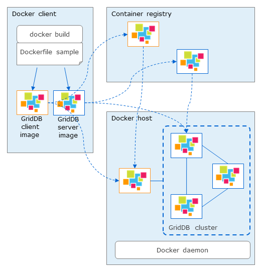

## --- Overview ---

## Purpose of this document

This document explains how to use the GridDB Dockerfile sample.

## Precautions

Make sure you can connect to the Internet. If you are behind a proxy, uncomment the proxy settings in the Dockerfiles.

## --- GridDB Dockerfile sample ---

## Overview

You can use GridDB Dockerfile sample to create GridDB server image and GridDB client image.
You can run GridDB server and GridDB client on docker hosts.

## Architecture

GridDB Dockerfile sample includes two types of Dockerfile:

  - Dockerfile for GridDB server
    
    Used to build GridDB server image

  - Dockerfile for GridDB client
    
    Used to build GridDB client image which can run operation tools, SQL interface, Java library, and WebAPI

After building GridDB server and client image successfully, you can run
these images to compose a GridDB cluster or you can push them in a
container registry then you are able to pull them from other machines.

<figure>

<figcaption>GridDB docker usage</figcaption>
</figure>

## Component of GridDB Dockerfile sample
- Docker\_server/: GridDB server directory
  - rpm/: GridDB installer directory
  - Dockerfile\_server
  - docker-entrypoint\_server.sh
- Docker\_client/: GridDB client directory
  - 3rd/: external software directory
  - rpm/: GridDB installer directory
  - Dockerfile\_client
  - docker-entrypoint\_client.sh
- Provider/:
  - Provider
  - provider.json
- sample/:
  - JDBCClient.java
  - MultiNodesClient.java
- docker-compose.yml: config file for docker-compose
- .env: environment variables for docker-compose

## Supported environment condition

GridDB Dockerfile sample has been confirmed to work in the following

- On-premises:
    
  - Host OS: RHEL / CentOS 8.3
  - Docker: Docker CE 20.10.10 (with docker-compose V1.21.2)

This sample has been tested and proven compatible with GridDB Enterprise Edition 5.0.

## --- How to use GridDB Dockerfile sample on-premise ---

## Build image

### Build GridDB server image

Copy the following files to **Docker\_server\\rpm** directory:

```
$ ls rpm
griddb-ee-client-5.0.0-linux.x86_64.rpm
griddb-ee-server-5.0.0-linux.x86_64.rpm
```

Execute the following command in the **Docker\_server** directory to build GridDB server image:
```
$ docker build -t griddb/griddb-server:5.0 -f Dockerfile_server .
```

### Build GridDB client image

Copy the following files to **Docker\_client\\rpm** directory:

```
$ ls rpm
griddb-ee-client-5.0.0-linux.x86_64.rpm
griddb-ee-java-lib-5.0.0-linux.x86_64.rpm
griddb-ee-webapi-5.0.0-linux.x86_64.rpm
griddb-ee-webui-5.0.0-linux.x86_64.rpm
```

Copy the following file to **Docker\_client\\3rd** directory:

  - Java SE 8 (jdk-8uXXX-linux-x64.rpm)

Execute the following command in the **Docker\_client** directory to build GridDB client image:
```
$ docker build -t griddb/griddb-client:5.0 -f Dockerfile_client .
```

## Run GridDB image

### Run GridDB server image

Use the following command to start GridDB server container built in the previous section:
```
$ docker run -d --name <docker_container_name> \
    -e GRIDDB_CLUSTERNAME=<cluster_name> \
    -e GRIDDB_NODE_NUM=<node_number> \
    -e NOTIFICATION_ADDRESS=<notification_address> \
    griddb/griddb-server:5.0
```

The following environment variables need to be specified when starting GridDB server container:

| Enviroment variable name | Description                                                          | Default value |
| ------------------------ | -------------------------------------------------------------------- | ------------- |
| GRIDDB\_CLUSTERNAME      | cluster name                                                         | myCluster     |
| GRIDDB\_NODE\_NUM        | number of nodes of the cluster                                       | 1             |
| NOTIFICATION\_ADDRESS    | multicast address (MULTICAST mode)                                   | (\*1)         |
| NOTIFICATION\_MEMBER     | list of IP addresses of nodes, separated by comma (FIXED\_LIST mode) | (\*1)         |
| NOTIFICATION\_PROVIDER   | provider url (PROVIDER mode)                                         | (\*1)         |
| SERVICE\_ADDRESS         | ip address of a node                                                 | \-            |

(\*1) only specify one of them

### Run GridDB client image

Use the following command to start GridDB client container built in the previous section:
```
$ docker run -d --name <docker_container_name> \
    -e GRIDDB_NODE=<node_ip> \
    -e GRIDDB_PORT=<node_operation_port> \
    griddb/griddb-client:5.0
```

The following environment variables need to be specified when starting GridDB client container:

| Enviroment variable name | Description                     | Default value |
| ------------------------ | ------------------------------- | ------------- |
| GRIDDB\_NODE             | IP address of a node (any node) | \-(required)  |
| GRIDDB\_PORT             | port of a node                  | \-(required)  |

## Compose a GridDB cluster (on the same Docker host)

### Single node

- Start GridDB cluster

  Start a GridDB server container and build a cluster with a single node configuration.

  Run the following command. The container name is **griddb**:
  ```
  $ docker run -d --name griddb \
      -e GRIDDB_CLUSTERNAME=<cluster_name> \
      -e GRIDDB_NODE_NUM=1 \
      -e NOTIFICATION_ADDRESS=<notification_address> \
      griddb/griddb-server:5.0
  ```
  
  Use **--mount** option persisting data GridDB home directory as a docker volume:
  ```
  $ docker run -d --name griddb \
      -e GRIDDB_CLUSTERNAME=<cluster_name> \
      -e GRIDDB_NODE_NUM=1 \
      -e NOTIFICATION_ADDRESS=<notification_address> \
      --mount source=<volume_name>,target=/var/lib/gridstore/ \
      griddb/griddb-server:5.0
  ```

- Connect from GridDB client

  Connect with NoSQL API:
  ```
  $ cd sample
  $ javac -cp /usr/share/java/gridstore.jar SingleNodeClient.java
  $ java -cp .:/usr/share/java/gridstore.jar SingleNodeClient <IP Address> 10001 myCluster
  ```
    
  Connect with JDBC:
  ```
  $ cd sample
  $ javac JDBCClient.java
  $ java -cp .:/usr/share/java/gridstore-jdbc.jar JDBCClient <IP Address> 20001 myCluster
  ```

- Connect from GridDB client container
    
  Specify a running GridDB server by **--link** option and start the GridDB client container.
  ```
  $ docker run -d --name griddb-client \
      --link <container_name>:griddb \
      griddb/griddb-client:5.0
  ```

### Multiple nodes

The following steps will start and compose a three-node GridDB cluster and GridDB home directory of each node is persisted.
The client container will also run on the same docker host.

<figure>

<figcaption>GridDB cluster on the same docker host</figcaption>
</figure>

By using **docker-compose.yml** file, you can start multiple containers including client at once:
```
version: '3'
services:
    griddb1:
        container_name: myNode1
        image: griddb-server:${GRIDDB_VERSION}
        build:
            context: ./Docker_server
            dockerfile: Dockerfile_server
        env_file: .env
        networks:
            griddb_net:
                ipv4_address: ${IPADDR_NODE1}
        volumes:
            - "node1:/var/lib/gridstore/"
    griddb2:
        container_name: myNode2
        image: griddb-server:${GRIDDB_VERSION}
        env_file: .env
        networks:
            griddb_net:
                ipv4_address: ${IPADDR_NODE2}
        volumes:
            - "node2:/var/lib/gridstore/"
    griddb3:
        container_name: myNode3
        image: griddb-server:${GRIDDB_VERSION}
        env_file: .env
        networks:
            griddb_net:
                ipv4_address: ${IPADDR_NODE3}
        volumes:
            - "node3:/var/lib/gridstore/"
    client:
        container_name: client
        image: griddb-client:${GRIDDB_VERSION}
        build:
            context: ./Docker_client
            dockerfile: Dockerfile_client
        env_file: .env
        networks:
            griddb_net:
                ipv4_address: ${IPADDR_CLIENT}
        volumes:
            - "client:/var/lib/gridstore/log"
        depends_on:
            - "griddb1"
            - "griddb2"
            - "griddb3"
        ports:
            - 8080:8080
            - 8081:8081

volumes:
    node1:
    node2:
    node3:
    client:

networks:
    griddb_net:
        driver: bridge
        ipam:
            config:
                - subnet: ${SUBNET}
```


Define environment variable corresponding to the GridDB cluster connection method (FIXED\_LIST, MULTICAST, PROVIDER).
The environment variables for starting container in section 3.2 and for above docker-compose are described in `.env` file:

| Environment variable   | Description                                                          | Example                           |
| ---------------------- | -------------------------------------------------------------------- | --------------------------------- |
| GRIDDB\_NODE\_NUM      | number of nodes of the cluster                                       | 3                                 |
| GRIDDB\_CLUSTERNAME    | cluster name                                                         | dockerCluster                     |
| GRIDDB\_VERSION        | version                                                              | 5.0                               |
| NOTIFICATION\_ADDRESS  | multicast address (MULTICAST mode)                                   | 239.0.0.1                         |
| NOTIFICATION\_MEMBER   | list of IP addresses of nodes, separated by comma (FIXED\_LIST mode) | 172.18.0.2,172.18.0.3,172.18.0.4  |
| NOTIFICATION\_PROVIDER | provider url (PROVIDER mode)                                         | http\://providerhost/provider.json|
| GRIDDB\_NODE           | IP address of a node (any node)                                      | 172.18.0.2                        |
| GRIDDB\_PORT           | port of a node                                                       | 10040                             |
| IPADDR\_NODE1          | IP address of myNode1                                                | 172.18.0.2                        |
| IPADDR\_NODE2          | IP address of myNode2                                                | 172.18.0.3                        |
| IPADDR\_NODE3          | IP address of myNode3                                                | 172.18.0.4                        |
| IPADDR\_CLIENT         | IP address of client                                                 | 172.18.0.5                        |
| SUBNET                 | subnetwork of the cluster                                            | 172.18.0.0/24                     |

## Compose a GridDB cluster (multiple Docker hosts)

Starting multiple containers on the same docker host in previous section does not provide the full benefit of clustering in the following respects:

- Ensure availability through node redundancy
- High-speed processing by parallel use of independent resources

Building a GridDB cluster on multiple docker hosts offers these benefits.

### MULTICAST method

When building cluster in MULTICAST mode, the network of container must be **host** mode.

The following commands will build a three-node GridDB cluster on 3 docker hosts in **MULTICAST** method.

<figure>

<figcaption>GridDB cluster on multiple docker hosts (MULTICAST method)</figcaption>
</figure>

On host1:
```
$ docker run --net=host \
    -e GRIDDB_NODE_NUM=3 \
    -e GRIDDB_CLUSTERNAME=dockerCluster \
    -e NOTIFICATION_ADDRESS=239.0.0.2 \
    -e SERVICE_ADDRESS=192.168.56.101 \
    --name myNode1 griddb/griddb-server:5.0
```

On host2：
```
$ docker run --net=host \
    -e GRIDDB_NODE_NUM=3 \
    -e GRIDDB_CLUSTERNAME=dockerCluster \
    -e NOTIFICATION_ADDRESS=239.0.0.2 \
    -e SERVICE_ADDRESS=192.168.56.102 \
    --name myNode2 griddb/griddb-server:5.0
```

On host3：
```
$ docker run --net=host \
    -e GRIDDB_NODE_NUM=3 \
    -e GRIDDB_CLUSTERNAME=dockerCluster \
    -e NOTIFICATION_ADDRESS=239.0.0.2 \
    -e SERVICE_ADDRESS=192.168.56.103 \
    --name myNode3 griddb/griddb-server:5.0
```

### FIXED\_LIST method

In FIXED\_LIST method, you can use either **macvlan** or **overlay** network for containers.
With **macvlan** network, each container uses the same subnet with docker host, so it is no need to expose ports.
With **overlay** network, it is necessary to expose 3 ports: 10001, 20001 (when using NewSQL) and 10040.

The following commands will build a three-node GridDB cluster on 3 docker hosts in **FIXED\_LIST** method using **overlay** network.

<figure>

<figcaption>GridDB cluster on multiple docker hosts (FIXED\_LIST method)</figcaption>
</figure>

- Using docker in **swarm** mode to create an **overlay** network

  On host1：
  ```  
  $ docker swarm init --advertise-addr=192.168.56.101
  ```
  This command will return the token for other nodes to join the swarm
    
  On host2：
  ```
  $ docker swarm join --token <TOKEN> \
      --advertise-addr 192.168.56.102 192.168.56.101:2377
  ```

  On host3：
  ```
  $ docker swarm join --token <TOKEN> \
      --advertise-addr 192.168.56.103 192.168.56.101:2377
  ```

- Create an **overlay** network (griddb-net)
  ```
  $ docker network create -d overlay \
      --subnet 10.0.1.0/24 --attachable griddb-net
  ```

- Start GridDB server containers:

  On host1：
  ```
  $ docker run \
      -e GRIDDB_NODE_NUM=3 \
      -e GRIDDB_CLUSTERNAME=dockerCluster \
      -e NOTIFICATION_MEMBER=10.0.1.4,10.0.1.5,10.0.1.6 \
      -p 10001:10001 -p 10040:10040 -p 20001:20001 \
      --network griddb-net --ip 10.0.1.4 \
      --name myNode1 griddb/griddb-server:5.0
  ```

  On host2：
  ```
  $ docker run -e GRIDDB_NODE_NUM=3 \
      -e GRIDDB_NODE_NUM=3 \
      -e GRIDDB_CLUSTERNAME=dockerCluster \
      -e NOTIFICATION_MEMBER=10.0.1.4,10.0.1.5,10.0.1.6 \
      -p 10001:10001 -p 10040:10040 -p 20001:20001 \
      --network griddb-net --ip 10.0.1.5 \
      --name myNode2 griddb/griddb-server:5.0
  ```

  On host3：
  ```
  $ docker run -e GRIDDB_NODE_NUM=3 \
      -e GRIDDB_NODE_NUM=3 \
      -e GRIDDB_CLUSTERNAME=dockerCluster \
      -e NOTIFICATION_MEMBER=10.0.1.4,10.0.1.5,10.0.1.6 \
      -p 10001:10001 -p 10040:10040 -p 20001:20001 \
      --network griddb-net --ip 10.0.1.6 \
      --name myNode3 griddb/griddb-server:5.0
  ```

- Modify 2 files: `gs_node.json` and `gs_cluster.json` in each container:
    
  `gs_node.json` of myNode1:
  Modify `/transaction/serviceAddress` and `/sql/serviceAddress` to "192.168.56.101"
    
  `gs_node.json` of myNode2:
  Modify `/transaction/serviceAddress` and `/sql/serviceAddress` to "192.168.56.102"
    
  `gs_node.json` of myNode3:
  Modify `/transaction/serviceAddress` and `/sql/serviceAddress` to "192.168.56.103"
    
  `gs_cluster.json` of 3 nodes:
  ```
  {
    ...
    "cluster": {
      ...
      "notificationMember": [
        {
          "cluster": {"address": "10.0.1.4","port": 10010},
          "sync": {"address": "10.0.1.4","port": 10020},
          "system": {"address": "10.0.1.4","port": 10040},
          "transaction": {"address": "192.168.56.101","port": 10001},
          "sql": {"address": "192.168.56.101","port": 20001}
        },
        {
          "cluster": {"address": "10.0.1.5","port": 10010},
          "sync": {"address": "10.0.1.5","port": 10020},
          "system": {"address": "10.0.1.5","port": 10040},
          "transaction": {"address": "192.168.56.102","port": 10001},
          "sql": {"address": "192.168.56.102","port": 20001}
        },
        {
          "cluster": {"address": "10.0.1.6","port": 10010},
          "sync": {"address": "10.0.1.6","port": 10020},
          "system": {"address": "10.0.1.6","port": 10040},
          "transaction": {"address": "192.168.56.103","port": 10001},
          "sql": {"address": "192.168.56.103","port": 20001}
        }
      ]
      ...
    }
    ...
  }
  ```

### PROVIDER method

PROVIDER method is the same as FIXED\_LIST method
On docker host with **overlay** network, 3 ports: 10001, 20001 (when using NewSQL) and 10040 must be exposed.

The following commands will build a three-node GridDB cluster on 3 docker hosts in **PROVIDER** method using **overlay** network.

Assume that the **provider host** is http\://192.168.56.104/provider.json and provides the following host information:
```
$ curl http://192.168.56.104/provider.json
[
  {
    "cluster": {"address": "10.0.1.4","port": 10010},
    "sync": {"address": "10.0.1.4","port": 10020},
    "system": {"address": "10.0.1.4","port": 10040},
    "transaction": {"address": "192.168.56.101","port": 10001},
    "sql": {"address": "192.168.56.101","port": 20001}
  },
  {
    "cluster": {"address": "10.0.1.5","port": 10010},
    "sync": {"address": "10.0.1.5","port": 10020},
    "system": {"address": "10.0.1.5","port": 10040},
    "transaction": {"address": "192.168.56.102","port": 10001},
    "sql": {"address": "192.168.56.102","port": 20001}
  },
  {
    "cluster": {"address": "10.0.1.6","port": 10010},
    "sync": {"address": "10.0.1.6","port": 10020},
    "system": {"address": "10.0.1.6","port": 10040},
    "transaction": {"address": "192.168.56.103","port": 10001},
    "sql": {"address": "192.168.56.103","port": 20001}
  }
]
```

- Using docker in **swarm** mode to create an **overlay** network
    
  On host1：
  ```
  $ docker swarm init --advertise-addr=192.168.56.101
  ```
  This command will return the token for other nodes to join the swarm.
    
  On host2：
  ```
  $ docker swarm join --token <TOKEN> \
      --advertise-addr 192.168.56.102 192.168.56.101:2377
  ```
    
  On host3：
  ```
  $ docker swarm join --token <TOKEN> \
      --advertise-addr 192.168.56.103 192.168.56.101:2377
  ```

- Create an **overlay** network (griddb-net)
  ```
  $ docker network create -d overlay \
      --subnet 10.0.1.0/24 --attachable griddb-net
  ```

- Start GridDB server containers:

  On host1：
  ```
  $ docker run -e GRIDDB_NODE_NUM=3 \
      -e GRIDDB_CLUSTERNAME=dockerCluster \
      -e NOTIFICATION_PROVIDER=http://192.168.56.104/provider.json \
      -p 10001:10001 -p 10040:10040 -p 20001:20001 \
      --network griddb-net --ip 10.0.1.4 \
      --name myNode1 griddb/griddb-server:5.0
  ```

  On host2：
  ```
  $ docker run -e GRIDDB_NODE_NUM=3 \
      -e GRIDDB_CLUSTERNAME=dockerCluster \
      -e NOTIFICATION_PROVIDER=http://192.168.56.104/provider.json \
      -p 10001:10001 -p 10040:10040 -p 20001:20001 \
      --network griddb-net --ip 10.0.1.5 \
      --name myNode2 griddb/griddb-server:5.0
  ```

  On host3：
  ```
  $ docker run -e GRIDDB_NODE_NUM=3 \
      -e GRIDDB_CLUSTERNAME=dockerCluster \
      -e NOTIFICATION_PROVIDER=http://192.168.56.104/provider.json \
      -p 10001:10001 -p 10040:10040 -p 20001:20001 \
      --network griddb-net --ip 10.0.1.6 \
      --name myNode3 griddb/griddb-server:5.0
  ```

- Modify file `gs_node.json` in each container, (`gs_cluster.json` is not necessaty)
    
  `gs_node.json` of myNode1:
  Modify `/transaction/serviceAddress` and `/sql/serviceAddress` to "192.168.56.101"

  `gs_node.json` of myNode2:
  Modify `/transaction/serviceAddress` and `/sql/serviceAddress` to "192.168.56.102"
    
  `gs_node.json` of myNode3:
  Modify `/transaction/serviceAddress` and `/sql/serviceAddress` to "192.168.56.103"

## --- Operations ---

## Start a shell in a container

```
$ docker exec -it <node_name> bash
```

## Check GridDB cluster status

```
$ docker exec -it <node_name> bash
$ su - gsadm
$ gs_stat -u admin/admin
```

## Access to GridDB cluster

### Access GridDB cluster in MULTICAST mode from docker host

- Set a multicast route from the host network to the container's docker0 interface.
  ```
  $ ip route add 239.0.0.1/32 dev docker0
  ```

- The client accesses the multicast route
  ```
  $ cd sample
  $ javac -cp /usr/share/java/gridstore.jar MultiNodesClient.java
  $ java -cp .:/usr/share/java/gridstore.jar MultiNodesClient 239.0.0.1 31999 myCluster
  ```

### Access from GridDB client outside Docker host

- Keep the necessary ports exposed when starting the container
  ```
  $ docker run -P -d --name griddb griddb/griddb-server:5.0
  ```
    
  or forward port:
  ```
  $ docker run -p 40001:10001 -d --name griddb griddb/griddb-server:5.0
  ```

- You can check the exposed port with the following command
  ```
  $ docker port griddb
  ```

- The client accesses the exposed port
  ```
  $ cd sample
  $ javac -cp /usr/share/java/gridstore.jar SingleNodeClient.java
  $ java -cp .:/usr/share/java/gridstore.jar SingleNodeClient <Docker Host IP Address> 40001 myCluster
  ```

## --- Trademark ---

- GridDB is a registered trademark of Toshiba Digital Solutions Corporation in Japan.
- Docker is a registered trademark of Docker Inc. in the United States and other countries.

