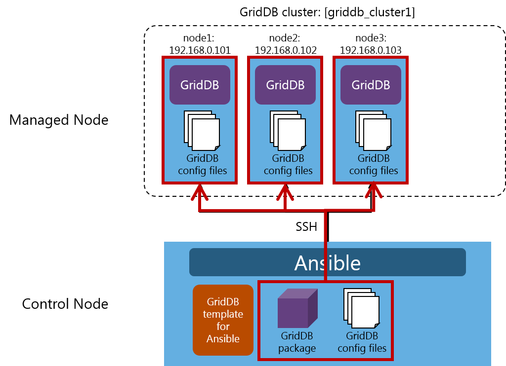
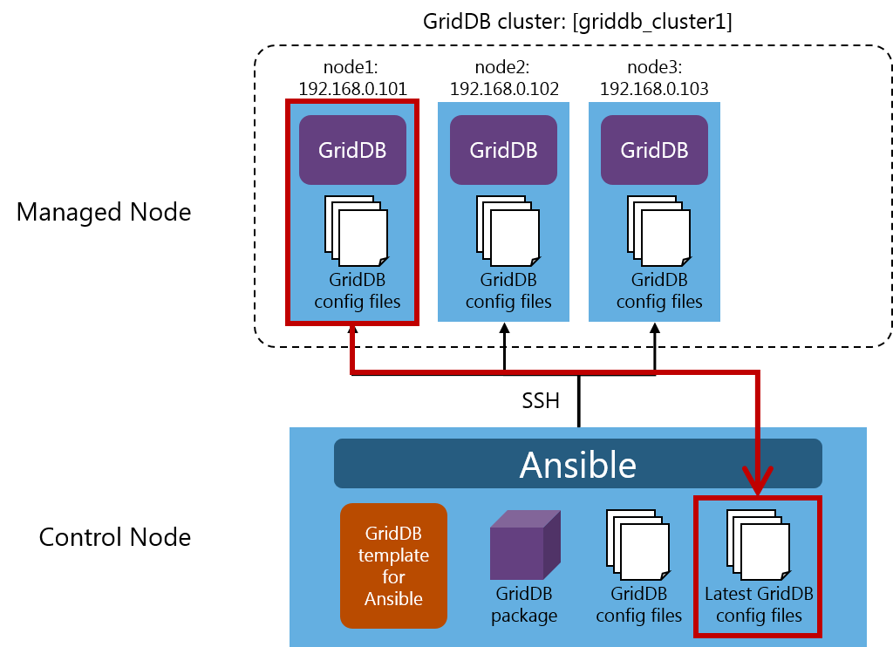
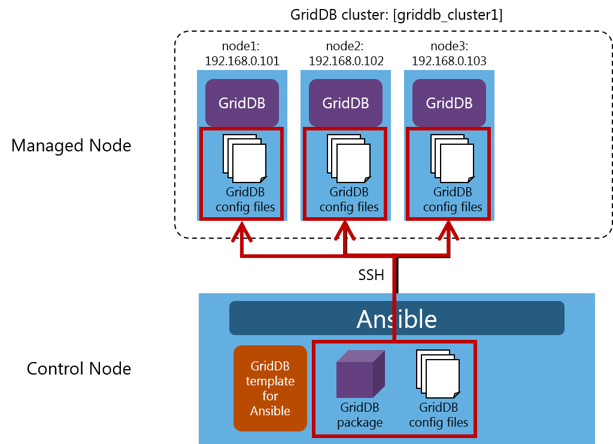

## --- Introduction ---

## Purpose of this documentation

This documentation describes how to set up the GridDB Template for Ansible.

## Considerations

The GridDB Template for Ansible is a template to help build GridDB.
Customize the template as required by the system to operate.

Inquiries about the operation and behavior of GridDB using the templates and about Ansible fall outside the scope of GridDB support services.

## --- Summary ---

## What is the GridDB Template for Ansible?

Ansible is a tool that automates application and system building.

<figure>

<figcaption>example system configuration</figcaption>
</figure>

Prepare in advance a Control Node (a machine in which Ansible is installed) and a Managed Node (a managed machine) .

Place the GridDB template for Ansible, the GridDB package, and the GridDB config files on the Control Node.

If you execute Ansible on the Control Node, Ansible connects to the Managed Node using SSH to install and set up GridDB.

## Use cases handled in the template

The GridDB template for Ansible is a template to support the initial construction, configuration retrieval, configuration change, and node addition of GridDB using Ansible.

The connection method for the cluster configuration supports the multicast method.

|use cases|description|multicast method|
|-|-|-|
|initial construction | Newly creates a GridDB cluster. |✔|
|configuration retrieval |Retrieves the configuration for a GridDB cluster. |✔|
|configuration change | Changes the configuration for a GridDB cluster. |✔|
|node addition | Adds a node to a GridDB cluster. |✔|

<!--
|use cases|description|multicast method|fixed list method|provider method|
|-|-|-|-|-|
|initial construction|Newly creates a GridDB cluster. |✔|-|-|
|configuration retrieval|Retrieves the configuration for a GridDB cluster. |✔|-|-|
|configuration change|Changes the configuration for a GridDB cluster. |✔|-|-|
|node addition|Adds a node to a GridDB cluster. |✔|-|-|
-->

## File configuration

The GridDB Template for Ansible is included in the installation media `/misc/ansible-template/ansible-template.zip`. To use the template, expand the zip file.
To use the template, expand the zip file.

The file configuration after expanding the zip file is as follows:

```
ansible-template
│  initial-construction.yml (playbook file:  initial construction)
│  get-setting.yml          (playbook file:  configuration retrieval)
│  change-setting.yml       (playbook file:  configuration change)
│  add-node.yml             (playbook file:  node addition)
│  
├─conf (directory for placing the GridDB config files.)
│      
├─roles (files that describe the processing performed by the playbook.)
│  └─toshiba.griddb
│      │  
│      ├─defaults
│      │      main.yml
│      │      
│      ├─handlers
│      │      main.yml
│      │      
│      ├─meta
│      │      main.yml
│      │      
│      ├─tasks
│      │      main.yml                   (a list of tasks)
│      │      variables.yml              (task file: validation of the configuration value)
│      │      setup-griddb.yml           (task file: distribution of the GridDB package and the installation of GridDB)
│      │      configure.yml              (task file: distribution of the GridDB config files and the restart of the GridDB cluster)
│      │      get-setting.yml            (task file: retrieval of the GridDB config files)
│      │      detect-cluster-setting.yml (task file: information retrieval of the GridDB cluster)
│      │      add-node.yml               (task file: node addition)
│      │      
│      └─vars
│              main.yml
│              griddb.yml
│              
└─vars
        initial-construction.yml (variable definition file: initial construction)
        get-setting.yml          (variable definition file: configuration retrieval)
        change-setting.yml       (variable definition file: configuration change)
        add-node.yml             (variable definition file: node addition)
```

## Operating environment

This template has been tested and proven compatible with the following environments:

Control Node

- CentOS 8
- Ansible 2.11.6
- Python 3.6

Managed Node

- environments in which the GridDB administration command can be run.

This template has been tested and proven compatible with GridDB Enterprise Edition 5.0.

## --- Installation steps ---

This section describes the installation steps for the GridDB template for Ansible.

## Setting up SSH

Make sure the Control Node can be connected to the Managed Node using SSH.

## Installing Python

Make sure Python is installed on the Control Node.

Ansible refers to `/usr/bin/python`; check the path.

## Installing Ansible

Install Ansible on the Control Node.

```
$ sudo yum install ansible
```

Check the version of Ansible installed.

```
$ ansible --version
ansible 2.X.X
```

The home directory of Ansible is `/etc/ansible`; check the path.

## Setting up the template

Expand the template file (`ansible-template.zip`) and place it in the home directory of Ansible.

```
/etc/ansible
├── ansible.cfg
├── hosts
├── <playbook.yml>
├── conf
├── roles
│   └── toshiba.griddb
│       └...
└── vars
    └── <vars.yml>
```

## Ansible configuration file

Edit the Ansible configuration file and specify the destination for the execution log (log_path).

The Ansible configuration file is `/etc/ansible/ansible.cfg`. Use the format "item name=value".

/etc/ansible/ansible.cfg

```
[defaults] 
log_path=/var/log/ansible.log
```

For details about the configuration settings, see the [Ansible Documentation](https://docs.ansible.com/ansible/2.8/reference_appendices/config.html).

The configuration settings of Ansible are preferentially applied in the order below.
If the settings are not applied, check each file.

- ANSIBLE_CONFIG (environment variable)
- ansible.cfg (file in the current directory)
- ~/.ansible.cfg (file in the home directory)
- /etc/ansible/ansible.cfg

This completes installation.

## --- Procedures for an initial construction ---

This section describes the procedures for creating a three-node GridDB cluster.

## Advance preparation

<figure>

<figcaption>initial construction</figcaption>
</figure>

Prepare in advance three machines for a Managed Node.

Suppose the name of the GridDB cluster to configure is `griddb_cluster1`.

Suppose also that the three nodes that configure the cluster are: node1：`192.168.0.101`, node2：`192.168.0.102`, node3：`192.168.0.103`.

## What is an initial construction?

An initial construction is performed in the following steps:

|steps|description|
|-|-|
|1|Validate the configuration value.|
|2|Distribute the GridDB package.|
|3|Install GridDB.|
|4|Distribute the GridDB config files.|
|5|Start the GridDB cluster.|

## Editing the inventory file

Use the Control Node to edit the inventory file.

/etc/ansible/hosts

```
[local]
localhost

[griddb_cluster1]
192.168.0.101
192.168.0.102
192.168.0.103
```

Enclose the GridDB cluster name in square brackets and specify it as `[griddb_cluster1]`.

Specify the node name as: `192.168.0.101`, `192.168.0.102`, and `192.168.0.103`.

For details about the inventory file, see [the inventory file](#hosts_file).

## Editing the playbook file

Use the Control Node to edit the playbook files.

The playbook file for an initial construction is `/etc/ansible/initial-construction.yml`.

/etc/ansible/initial-construction.yml

```
---
- hosts: griddb_cluster1
  become: yes
  vars_files:
    - vars/initial-construction.yml
  roles:
    - toshiba.griddb
```

Set the cluster name `griddb_cluster1` that has been specified in the inventory file to `hosts`.

Set `yes` to `become` and allow users other than the connection user to operate the Managed Node.

Set the variable definition file for an initial construction `vars/initial-construction.yml` to `vars_files`.

Set `toshiba.griddb` where the processing to be performed by the playbook is stored to `roles`.

For details about the [playbook files](#playbook_file), see the playbook files.

## Editing the variable definition file

Use the Control Node to edit the variable definition file.

The variable definition file for an initial construction is `/etc/ansible/vars/initial-construction.yml`.

/etc/ansible/vars/initial-construction.yml

```
---
env: 'on-premises'
griddb_deploy_mode: 'multicast'
griddb_package_path: '/home/griddb/5.0.0'
griddb_config_files: '/etc/ansible/conf'
```

Set `on-premises` to `env`.

Set the multicast method `multicast` to `griddb_deploy_mode`.

Set the path to the directory where the GridDB package is placed `/home/griddb/5.0.0` to `griddb_package_path`.

Set the path to the directory where the GridDB config files are placed `/etc/ansible/conf` to `griddb_config_files`.

For details about the variable definition file, see the [variable definition file](#vars_file).

<!-- 
- In the multicast method, specify `multicast` as `griddb_deploy_mode`.
- In the fixed list method, specify `fixed_list` as `griddb_deploy_mode`.
- In the provider method, specify `provider` as `griddb_deploy_mode`
-->

## Placing the GridDB package

Place the GridDB package in the directory specified in `griddb_package_path`.

```
/home/griddb/5.0.0
├── griddb-ee-server-5.0.0-linux.x86_64.rpm
└── griddb-ee-client-5.0.0-linux.x86_64.rpm
```

## Placing the GridDB config files

Edit the GridDB config files and place them in the directory specified in `griddb_config_files` `/etc/ansible/conf`.

The GridDB config files that are placed are of three types: gs_cluster.json (cluster definition file), gs_node.json (node definition file), and gridstore.conf (start configuration file).

```
/etc/ansible/conf
├── gs_cluster.json (cluster definition file)
├── gs_node.json    (node definition file)
└── gridstore.conf  (start configuration file)
```

### Editing the cluster definition file

In the cluster definition file, edit the `cluster name`.

/etc/ansible/conf/gs_cluster.json
```
...
"cluster":{
  "clusterName":"griddb_cluster1",
  ...
```

Set `griddb_cluster1` to `clusterName`.

For details about the file, see the [GridDB Features Reference](GridDB_FeaturesReference.html#label_parameters).

### Editing the node definition file

Edit the node definition file to set the `memory usage`.

/etc/ansible/conf/gs_node.json
```
...
"dataStore":{
  ...
  "storeMemoryLimit":"1024MB",
  ...
```

Set the initial value `1024MB` to `storeMemoryLimit`.

For details about the file, see the [GridDB Administrators Guide](GridDB_AdministratorsGuide.html).

### Editing the start configuration file

Edit the start configuration file of the service and set the `cluster name` and the `number of the nodes`.

/etc/ansible/conf/gridstore.conf
```
CLUSTER_NAME=griddb_cluster1
MIN_NODE_NUM=3
```

Set `griddb_cluster1` as a `cluster name` to `CLUSTER_NAME`.

Set `3` as `the number of the nodes` to `MIN_NODE_NUM`.

For details about the file, see the [GridDB Operation Tools Reference](GridDB_OperationToolsReference.html).

## Running the playbook files

Run the playbook for an initial construction in the Ansible home directory.

```
$ ansible-playbook -i hosts initial-construction.yml
```

## --- Procedures for configuration retrieval ---

This section describes the procedures for retrieving the configuration from the existing three-node GridDB cluster.

## Advance preparation

<figure>

<figcaption>configuration retrieval</figcaption>
</figure>

In the figure above, the GridDB cluster `griddb_cluster1` operates with the configuration, consisting of three nodes: node1:`192.168.0.101`, node2:`192.168.0.102`, and node3:`192.168.0.103`).

## What is configuration retrieval?

Configuration retrieval is performed in the following steps:

|steps|description|
|-|-|
|1|Validate the configuration value.|
|2|Retrieve the information about the GridDB cluster.|
|3|Retrieve the GridDB config files.|

## Editing the inventory file

Use the Control Node to edit the inventory file.

/etc/ansible/hosts

```
[local]
localhost

[griddb_cluster1]
192.168.0.101
192.168.0.102
192.168.0.103
```

Enclose the GridDB cluster name in square brackets and specify it as `[griddb_cluster1]`.

Specify the node name as: `192.168.0.101`, `192.168.0.102`, and `192.168.0.103`.

For details about the inventory file, see [the inventory file](#hosts_file).

## Editing the playbook file

Use the Control Node to edit the playbook files.

The playbook file for configuration retrieval is`/etc/ansible/get-setting.yml`.

/etc/ansible/get-setting.yml

```
---
- hosts: griddb_cluster1
  become: yes
  vars_files:
    - vars/get-setting.yml
  tasks:
    - name: Get setting
      include_role:
        name: toshiba.griddb
        tasks_from: get-setting.yml
```

Set the cluster name `griddb_cluster1` that has been specified in the inventory file to `hosts`.

Set `yes` to `become` and allow users other than the connection user to operate the Managed Node.

Set the variable definition file for configuration retrieval `vars/get-setting.yml` to `vars_files`.

Set the processing to be performed by the playbook to `tasks`; set `Get setting` to `name`.

Set `toshiba.griddb` where the processing to be performed by the playbook is stored to `name` under `include_role`.

Specify `get-setting.yml` for `tasks_from` to specify `roles/toshiba.griddb/tasks/get-setting.yml`.

For details about the [playbook files](#playbook_file), see the playbook files.

## Editing the variable definition file

Use the Control Node to edit the variable definition file.

The variable definition file for configuration retrieval is `/etc/ansible/vars/get-setting.yml`.

/etc/ansible/vars/get-setting.yml

```
---
griddb_get_setting: '/etc/ansible/conf_latest'
```

Set the path to the directory where the GridDB config files retrieved from the node are placed `/etc/ansible/conf_latest` to `griddb_get_setting`.

For details about the variable definition file, see the [variable definition file](#vars_file).

## Running the playbook files

Run the playbook for configuration retrieval in the Ansible home directory.

```
$ ansible-playbook -i hosts get-setting.yml
```

## Reviewing the GridDB config files

The GridDB config file retrieved from the node is placed in the directory `/etc/ansible/conf_latest` specified in `griddb_get_setting`.

The GridDB config files that can be retrieved are of four types: gs_cluster.json (cluster definition file), gs_node.json (node definition file), gridstore.conf (start configuration file), and version.txt (GridDB version file).

```
/etc/ansible/conf_latest
├── gs_cluster.json (cluster definition file)
├── gs_node.json    (node definition file)
├── gridstore.conf  (start configuration file)
└── version.txt     (GridDB version file)
```

## --- Procedures for a configuration change ---

This section describes the procedures for changing the configuration from the existing three-node GridDB cluster.

## Advance preparation

<figure>

<figcaption>configuration change</figcaption>
</figure>

In the figure above, the GridDB cluster `griddb_cluster1` operates with the configuration, consisting of three nodes: node1:`192.168.0.101`, node2:`192.168.0.102`, and node3:`192.168.0.103`).

## What is a configuration change?

A configuration change is performed in the following steps:

|steps|description|
|-|-|
|1|Validate the configuration value.|
|2|Distribute the GridDB config files.|
|3|Restart the GridDB cluster.|

## Editing the inventory file

Use the Control Node to edit the inventory file.

/etc/ansible/hosts

```
[local]
localhost

[griddb_cluster1]
192.168.0.101
192.168.0.102
192.168.0.103
```

Enclose the GridDB cluster name in square brackets and specify it as `[griddb_cluster1]`.

Specify the node name as: `192.168.0.101`, `192.168.0.102`, and `192.168.0.103`.

For details about the inventory file, see [the inventory file](#hosts_file).

## Editing the playbook file

Use the Control Node to edit the playbook files.

The playbook file for a configuration change is /etc/ansible/change-setting.yml.

/etc/ansible/change-setting.yml

```
---
- hosts: griddb_cluster1
  become: yes
  vars_files:
    - vars/change-setting.yml
  tasks:
    - name: Change setting
      include_role:
        name: toshiba.griddb
        tasks_from: configure.yml
```

Set the cluster name `griddb_cluster1` that has been specified in the inventory file to `hosts`.

Set `yes` to `become` and allow users other than the connection user to operate the Managed Node.

Set the variable definition file for a configuration change vars/change-setting.yml to vars_file.

Set the processing to be performed by the playbook to `tasks`; set `Change setting` to `name`.

Set `toshiba.griddb` where the processing to be performed by the playbook is stored to `name` under `include_role`.

Specify `configure.yml` for `tasks_from` to specify `roles/toshiba.griddb/tasks/configure.yml`.

For details about the [playbook files](#playbook_file), see the playbook files.

## Editing the variable definition file

Use the Control Node to edit the variable definition file.

The variable definition file for a configuration change is `/etc/ansible/vars/change-setting.yml`.

/etc/ansible/vars/change-setting.yml

```
---
griddb_config_files: '/etc/ansible/conf'
```

Set the path to the directory where the GridDB config files are placed `/etc/ansible/conf` to `griddb_config_files`.

For details about the variable definition file, see the [variable definition file](#vars_file).

## Placing the GridDB config files

Edit the GridDB config files and place them in the directory specified in `griddb_config_files` `/etc/ansible/conf`.

The GridDB config files that are placed are of three types: gs_cluster.json (cluster definition file), gs_node.json (node definition file), and gridstore.conf (start configuration file).

```
/etc/ansible/conf
├── gs_cluster.json (cluster definition file)
├── gs_node.json    (node definition file)
└── gridstore.conf  (start configuration file)
```

### Editing the cluster definition file

In the cluster definition file, edit the `cluster name`.

/etc/ansible/conf/gs_cluster.json
```
...
"cluster":{
  "clusterName":"griddb_cluster1",
  ...
```

Set `griddb_cluster1` to `clusterName`.

For details about the file, see the [GridDB Features Reference](GridDB_FeaturesReference.html#label_parameters).

### Editing the node definition file

Edit the node definition file to set the `memory usage`.

/etc/ansible/conf/gs_node.json
```
...
"dataStore":{
  ...
  "storeMemoryLimit":"2048MB",
  ...
```

Set `2048MB` to `storeMemoryLimit`.

For details about the file, see the [GridDB Administrators Guide](GridDB_AdministratorsGuide.html).

### Editing the start configuration file

Edit the start configuration file of the service and set the `cluster name` and the `number of the nodes`.

/etc/ansible/conf/gridstore.conf
```
CLUSTER_NAME=griddb_cluster1
MIN_NODE_NUM=3
```

Set `griddb_cluster1` as a `cluster name` to `CLUSTER_NAME`.

Set `3` as `the number of the nodes` to `MIN_NODE_NUM`.

For details about the file, see the [GridDB Operation Tools Reference](GridDB_OperationToolsReference.html).

## Running the playbook files

Run the playbook for a configuration change in the Ansible home directory.

```
$ ansible-playbook -i hosts change-setting.yml
```

## --- Procedures for node addition ---

This section describes the procedures for adding a node to the existing three-node GridDB cluster.

## Advance preparation

<figure>

<figcaption>node addition</figcaption>
</figure>

In the figure above, the GridDB cluster `griddb_cluster1` operates with the configuration, consisting of three nodes: node1:`192.168.0.101`, node2:`192.168.0.102`, and node3:`192.168.0.103`).

If a node (node4: `192.168.0.104`) is added, the GridDB cluster `griddb_cluster1` will be configured by four nodes.

## What is node addition?

Node addition is performed in the following steps:

|steps|description|
|-|-|
|1|Validate the configuration value.|
|2|Retrieve the information about the GridDB cluster.|
|3|Create a group of additional nodes.|
|4|Distribute the GridDB package to the additional node.|
|5|Install GridDB on the additional node.|
|6|Distribute the GridDB config files to the additional node.|
|7|Start the additional node.|
|8|Append the additional node to the GridDB cluster configuration (Run gs_appendcluster)|

## Editing the inventory file

Use the Control Node to edit the inventory file.

/etc/ansible/hosts

```
[local]
localhost

[griddb_cluster1]
192.168.0.101
192.168.0.102
192.168.0.103
192.168.0.104
```

Enclose the GridDB cluster name in square brackets and specify it as `[griddb_cluster1]`.

Specify the node name as: `192.168.0.101`, `192.168.0.102`, `192.168.0.103`, and `192.168.0.104`.

For details about the inventory file, see [the inventory file](#hosts_file).

## Editing the playbook file

Use the Control Node to edit the playbook files.

The playbook file for node addition is /etc/ansible/add-node.yml.

/etc/ansible/add-node.yml

```
---
- hosts: griddb_cluster1
  become: yes
  vars_files:
    - vars/add-node.yml
  tasks:
    - name: Include detect-cluster-setting.yml
      include_role:
        name: toshiba.griddb
        tasks_from: detect-cluster-setting.yml
    - name: Create new host group
      add_host:
        hostname: "{{ item }}"
        groups: new_nodes_for_griddb_cluster1
        griddb_deploy_mode: "{{griddb_deploy_mode}}"
        griddb_svc_user: "{{griddb_svc_user}}"
        griddb_svc_password: "{{griddb_svc_password}}"
        griddb_system_service_port: "{{griddb_system_service_port}}"
        extra_nodes: "{{ extra_nodes }}"
      with_items: "{{ ansible_play_batch + extra_nodes|list }}"
      delegate_to: 127.0.0.1
      run_once: true
- hosts: new_nodes_for_griddb_cluster1
  become: yes
  vars_files:
    - vars/add-node.yml
  tasks:
    - name: Setup new nodes
      include_role:
        name: toshiba.griddb
        tasks_from: add-node.yml
```

Set the cluster name `griddb_cluster1` that has been specified in the inventory file to `hosts`.

Set `yes` to `become` and allow users other than the connection user to operate the Managed Node.

Set the variable definition file for node addition vars/add-node.yml to vars_file.

Set the processing to be performed by the playbook to `tasks`;

Set `toshiba.griddb` where the processing to be performed by the playbook is stored to `name` under `include_role`.

Specify `detect-cluster-setting.yml` for `tasks_from` to specify `roles/toshiba.griddb/tasks/detect-cluster-setting.yml`.

Next, specify settings for temporarily creating a group of additional nodes.

Set `new_nodes_for_griddb_cluster1` to `hosts`.

Set `yes` to `become` and allow users other than the connection user to operate the Managed Node.

Set the variable definition file for node addition vars/add-node.yml to vars_file.

Set the processing to be performed by the playbook to `tasks`;

Set `toshiba.griddb` where the processing to be performed by the playbook is stored to `name` under `include_role`.

Specify `add-node.yml` for `tasks_from` to specify `roles/toshiba.griddb/tasks/add-node.yml`.

For details about the [playbook files](#playbook_file), see the playbook files.

## Editing the variable definition file

Use the Control Node to edit the variable definition file.

The variable definition file for node addition is `/etc/ansible/vars/add-node.yml`

/etc/ansible/vars/add-node.yml

```
---
griddb_package_path: '/home/griddb/5.0.0'
griddb_config_files: '/etc/ansible/conf'
extra_nodes:
  - 192.168.0.104
```

Set the path to the directory where the GridDB package is placed `/home/griddb/5.0.0` to `griddb_package_path`.

Set the path to the directory where the GridDB config files are placed `/etc/ansible/conf` to `griddb_config_files`.

Set the node to add `192.168.0.104` to `extra_nodes`.

For details about the variable definition file, see the [variable definition file](#vars_file).

## Placing the GridDB package

Place the GridDB package in the directory specified in `griddb_package_path`.

```
/home/griddb/5.0.0
├── griddb-ee-server-5.0.0-linux.x86_64.rpm
└── griddb-ee-client-5.0.0-linux.x86_64.rpm
```

## Placing the GridDB config files

Edit the GridDB config files and place them in the directory specified in `griddb_config_files` `/etc/ansible/conf`.

The GridDB config files that are placed are of three types: gs_cluster.json (cluster definition file), gs_node.json (node definition file), and gridstore.conf (start configuration file).

```
/etc/ansible/conf
├── gs_cluster.json (cluster definition file)
├── gs_node.json    (node definition file)
└── gridstore.conf  (start configuration file)
```

### Editing the cluster definition file

In the cluster definition file, edit the `cluster name`.

/etc/ansible/conf/gs_cluster.json
```
...
"cluster":{
  "clusterName":"griddb_cluster1",
  ...
```

Set `griddb_cluster1` to `clusterName`.

For details about the file, see the [GridDB Features Reference](GridDB_FeaturesReference.html#label_parameters).

### Editing the node definition file

Edit the node definition file to set the `memory usage`.

/etc/ansible/conf/gs_node.json
```
...
"dataStore":{
  ...
  "storeMemoryLimit":"1024MB",
  ...
```

Set the initial value `1024MB` to `storeMemoryLimit`.

For details about the file, see the [GridDB Administrators Guide](GridDB_AdministratorsGuide.html).

### Editing the start configuration file

Edit the start configuration file of the service and set the `cluster name` and the `number of the nodes`.

/etc/ansible/conf/gridstore.conf
```
CLUSTER_NAME=griddb_cluster1
MIN_NODE_NUM=4
```

Set `griddb_cluster1` as a `cluster name` to `CLUSTER_NAME`.

Set `4` as `the number of the nodes` to `MIN_NODE_NUM`.

For details about the file, see the [GridDB Operation Tools Reference](GridDB_OperationToolsReference.html).

## Running the playbook files

Run the playbook for node addition in the Ansible home directory.

```
$ ansible-playbook -i hosts add-node.yml
```

<a id="hosts_file"></a>

## --- Inventory file ---

## What is the inventory file?

The inventory file is where cluster configuration is set.

Specify `the name of the cluster` and `the name of nodes that configure the cluster`.

Place the inventory file in the Ansible home directory as hosts.

/etc/ansible/hosts

```
[local]
localhost

[griddb_cluster1]
192.168.0.101
192.168.0.102
192.168.0.103
192.168.0.104

[griddb_cluster2]
node1
node2
node3
...
```

## Parameters of the inventory file

|item name|description|examples for setting values|
|-|-|-|
|cluster name|Enclose the GridDB cluster name in square brackets []. To specify multiple clusters, begin each cluster configuration on a new line. |[griddb_cluster1]|
|node name    | Specify the host name or the IP address for the node name. To specify multiple nodes, begin each node on a new line. |192.168.0.101|

<a id="vars_file"></a>

## --- Variable definition file ---

## What is the variable definition file?

The variable definition file is a file for specifying variables used in the playbook. The file must be in yaml format.

Place the variable definition file in the vars directory under the Ansible home directory.

/etc/ansible/vars/\<vars.yml\>

```
---
env: 'on-premises'
griddb_deploy_mode: 'multicast'
griddb_package_path: '/home/griddb/5.0.0'
griddb_config_files: '/etc/ansible/conf'
```

## Parameters of the variable definition file

|item name|description|examples for setting values|initial construction|configuration retrieval|configuration change|node addition|
|-|-|-|-|-|-|-|
|`env`|Environment where the GridDB cluster is placed (on-premises)|on-premises|✔||||
|`griddb_deploy_mode`|connection method for the cluster configuration (multicast)|multicast|✔||||
|`griddb_package_path`|path to the directory where the GridDB package is placed|/home/griddb/5.0.0|✔|||✔|
|`griddb_config_files`|path to the directory where the GridDB config files (gs_cluster.json, gs_node.json, and gridstore.conf)|/etc/ansible/conf|✔||✔|✔|
|`griddb_get_setting`|path to the directory where the GridDB config files retrieved during configuration retrieval are placed|/etc/ansible/conf_latest||✔|||
|`extra_nodes`|name of the node to be added to the GridDB cluster (Multiple nodes can be specified)|node4||||✔|

<!--
|`env` | Environment where the GridDB cluster is placed (either on-premises or aws) | on-premises | ✔||||
|`griddb_deploy_mode` | connection method for the cluster configuration (fixed_list, multicast, or provider) | multicast | ✔||||
-->

<a id="playbook_file"></a>

## --- Playbook filea ---

## What are the playbooks?

The playbook file is a configuration file for Ansible. The file must be in yaml format.

Place the playbook file in the Ansible home directory.

/etc/ansible/\<playbook.yml\>

```
---
- hosts: griddb_cluster1
  become: yes
  vars_files:
    - vars/get-setting.yml
  roles:
    - toshiba.griddb
  tasks:
    - name: Get setting
      include_role:
        name: toshiba.griddb
        tasks_from: get-setting.yml    
  environment:
    http_proxy: http://proxy.example.com:8080
    https_proxy: http://proxy.example.com:8080
```

## Parameters of the playbook file

|item name|description|examples for setting values|
|-|-|-|
|hosts|Specifies the name of the cluster specified in the inventory file. |griddb_cluster1|
|become|Allows users other than the connection user to operate the Managed Node. |yes|
|vars_files|Specifies the variable definition file. |vars/initial-construction.yml|
|roles|Specifies the processing performed by the playbook. |toshiba.griddb|
|tasks|Specifies multiple operations performed by the playbook. |toshiba.griddb|
|environment|Sets a proxy. |http://proxy.example.com:8080|

## How to run the playbook

Run the playbook in the Ansible home directory.

```
$ ansible-playbook -i hosts <playbook.yml>
```

Use the ansible-playbook command to run the playbook.

Specify the `hosts` file in the inventory file with the option `-i` and specify the playbook at the end.

## Error codes

While running the playbook, error messages may be displayed along with error codes.

This template validates the configuration value; refer to the causes and workarounds for the error and review the configuration value.

|error codes|error message|cause of the error|workarounds|
|-|-|-|-|
|E01001 | Environment is not valid. It should be `on-premises` or `aws` | The value of env is invalid |Review the value of env..|
|E01002 | Deploy mode is not valid. Deploy mode should be `multicast`, `fixed_list` or `provider`.| The value of `griddb_deploy_mode` is invalid. |Review the value of `griddb_deploy_mode`.|
|E01003 | Path to find packages is not defined. | `griddb_package_path` is not set. |Review the value of `griddb_package_path`.|
|E01004 | Path to config files is not defined. | `griddb_config_files` is not set. |Review the value of `griddb_config_files`.|
|E01006 | Path to folder get setting is not defined. | `griddb_get_setting` is not set. |Review the value of `griddb_get_setting`.|
|E02001|Cannot access RPM package(s) on control node.|The GridDB package cannot be found in the path set in `griddb_package_path`. |Place the GridDB package on the path specified in `griddb_package_path`.|
<!--
|E01005 | Deploy mode `multicast` is not supported on AWS | The value of `env` is set to `aws`, and the value of `griddbdeploymode` is set to `multicast`, which is invalid.  | The fixed method or the provider method is available on AWS.|
| |Review the value of `griddb_target_edition`.|
-->

The execution results of a task is displayed in the status according to the Ansible specifications (ok/changed/unreachable/failed/skipped/rescued/ignored).

For information about error handling, see the [Ansible Documentation](https://docs.ansible.com/ansible/2.8/user_guide/playbooks_error_handling.html).
