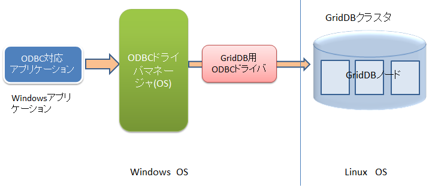
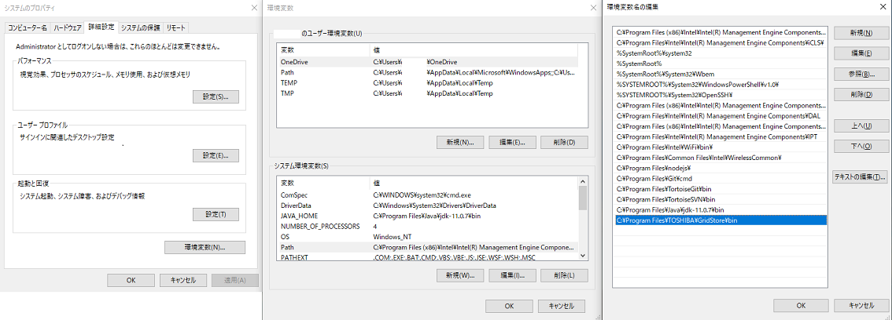
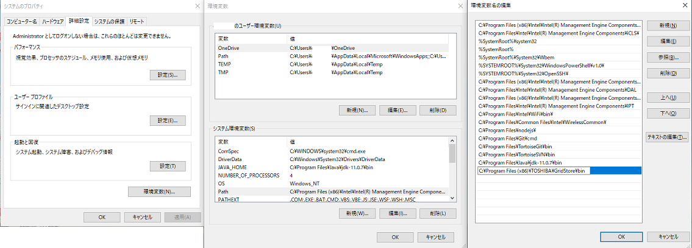
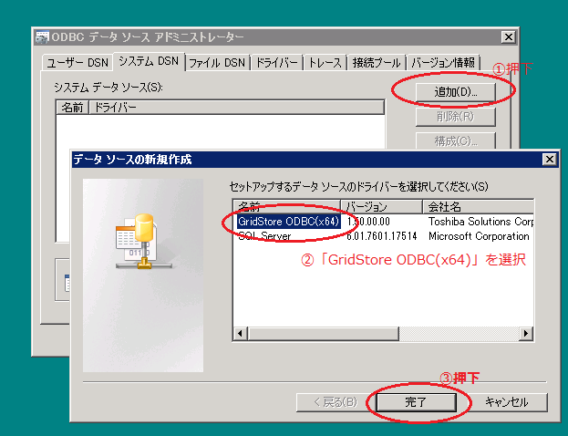
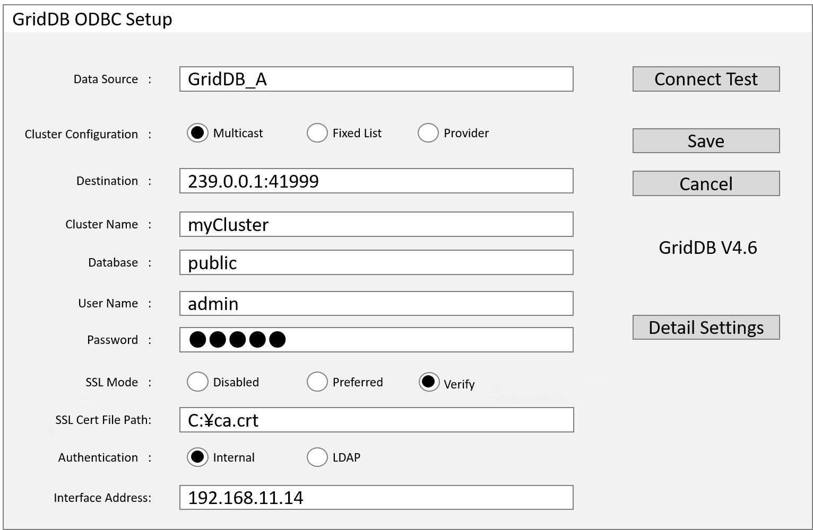
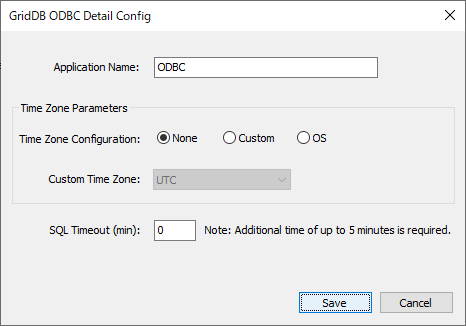

# アプリケーション開発概要

本章では、GridDB用ODBCドライバを利用したアプリケーション開発の概要について説明します。

## ODBCの概要

ODBC(Open Database Connectivity)は、Microsoft社が提唱したWindows対応のアプリケーションからデータベース管理システム(DBMS)にアクセスするための標準的なインタフェースです。

<figure>
 
 <figcaption>ODBCドライバとGridDBクラスタの関係</figcaption>
</figure>

- ODBC対応アプリケーション (Windows)
  - SQL文の発行と結果の取得などを行うために、ODBC関数を呼び出します。ユーザが作成したアプリケーションやBIツールです。
- ODBCドライバマネージャ (Windows)
  - ODBC対応のアプリケーションから呼び出されたODBC関数に対して、指定されたODBCデータソースの特定のデータベースに接続するなどの制御をOSが行います。データソースの管理も行います。
- GridDB用ODBCドライバ (Windows)
  - GridDBに接続するための、GridDB固有のドライバです。
  - 32ビット用と64ビット用があります。ODBCを使用するアプリケーションが32ビットの場合は、32ビットのODBCドライバが必要です。アプリケーションが64ビットの場合は、64ビットのODBCドライバが必要です。
- GridDBクラスタ (Linux)
  - 別マシンのLinux OS上で動作しているGridDBのクラスタです。

## 動作環境

GridDB用のODBCドライバは以下のOSでご利用できます。

- Windows Server 2012 R2、Windows Server 2016
- Windows 10

## インストール方法

GridDB用のODBCドライバは、インストールメディアの 「\Windows\ODBC」ディレクトリに含まれています。

インストール方法は以下になります。

**64ビットドライバをインストールする場合**

1. Windowsのエクスプローラで”GridStoreODBC_64bit_setup.bat”を選択し、右クリックで **管理者として実行** を選択し実行します。
2. `C:\Program Files\TOSHIBA\GridStore\bin` ディレクトリに下記のファイルがコピーされていることを確認します。

 - GridStoreODBC64.dll
 - msvcp140.dll
 - vcruntime140.dll
 - vcruntime140_1.dll
 - gridstore_advanced.dll
 - libssl-1_1-x64.dll
 - libcrypto-1_1-x64.dll

3. Windowsのシステムのプロパティ(Windowsマークを押下し、SystemPropertiesAdvanced.exeを入力)を開き、環境変数の設定画面を開きます。システム環境変数のPathを選択、編集ボタンを押下し、上記ファイルのインストールディレクトリ `C:\Program Files\TOSHIBA\GridStore\bin` を追加します。



4. 下記のディレクトリにlibssl-1_1-x64.dllとlibcrypto-1_1-x64.dllが含まれないことを確認してください。GridDBのODBCドライバのSSL通信機能はこれらのライブラリを利用します。この際、本メディアに同梱されているものよりも下記ディレクトリに含まれるものが優先的に利用されるためご注意ください。もし含まれる場合は、同梱されているライブラリをODBCを利用するソフトウェアのカレントディレクトリに配置することで対応できます。

- C:\Windows
- C:\Windows\System32


**32ビットドライバをインストールする場合**

1. Windowsのエクスプローラで”GridStoreODBC_32bit_setup.bat”を選択し、右クリックで **管理者として実行** を選択し実行します。
2. `C:\Program Files (x86)\TOSHIBA\GridStore\bin` ディレクトリに下記のファイルがコピーされていることを確認します。

 - GridStoreODBC32.dll
 - msvcp140.dll
 - vcruntime140.dll
 - gridstore_advanced.dll
 - libssl-1_1.dll
 - libcrypto-1_1.dll

3. Windowsのシステムのプロパティ(Windowsマークを押下し、SystemPropertiesAdvanced.exeを入力)を開き、環境変数の設定画面を開きます。システム環境変数のPathを選択、編集ボタンを押下し、上記ファイルのインストールディレクトリ `C:\Program Files (x86)\TOSHIBA\GridStore\bin` を追加します。



4. 下記のディレクトリにlibssl-1_1.dllとlibcrypto-1_1.dllが含まれないことを確認してください。GridDBのODBCドライバのSSL通信機能はこれらのライブラリを利用します。この際、本メディアに同梱されているものよりも下記ディレクトリに含まれるものが優先的に利用されるためご注意ください。もし含まれる場合は、同梱されているライブラリをODBCを利用するソフトウェアのカレントディレクトリに配置することで対応できます。

- C:\Windows
- C:\Windows\SysWOW64

## ODBCデータソースの登録

GridDB ODBCを利用してGridDBのデータベースにアクセスするためには、ODBCデータソースの登録を事前に行う必要があります。 ODBCデータソースの登録は、以下の手順で行います。

**64ビットの場合**

1. \[管理ツール\]から\[ODBCデータソース(64ビット)\]を起動します。

2. システムデータソース(システムDSN)を作成します。ドライバ指定時に「GridStore ODBC(x64)」を選択してください。

   <figure>
    
    <figcaption>システムDSNの作成</figcaption>
   </figure>

3. GridDB ODBCセットアップ画面が表示されますのでGridDBクラスタへの接続情報を設定します。

   <figure>
    
    <figcaption>セットアップ画面</figcaption>
   </figure>

\[入力項目\]

- Data Source

  - ODBCドライバマネージャに登録するデータソース名を指定。
  - アプリケーションは、ここで指定したデータソース名を指定してGridDBクラスタに接続します。

- Cluster Configuration 「Multicast」「Fixed List」「Provider」

  - GridDBクラスタとの接続方式を選択。サーバのクラスタ構成方式の設定と合わせる必要があります。

- Destination

  - "Multicast"の場合、GridDBノードのクラスタ定義ファイル(gs_cluster.json)の `/sql/notificationAddress` の値と `/sql/notificationPort` の値を指定する必要があります。
    - デフォルト: 239.0.0.1:41999
  - "Fixed List"の場合、GridDBノードのクラスタ定義ファイル(gs_cluster.json)の `/cluster/notificationMember` の `/sql/address` と `/sql/port` を:で連結して、各ノードの値をカンマ区切りで指定する必要があります。
    - 3ノード構成の例: 192.168.10.11:20001,192.168.10.12:20001,192.168.10.13:20001
  - "Provider"の場合、GridDBノードのクラスタ定義ファイル(gs_cluster.json)の `/cluster/notificationProvider/url` の値を指定する必要があります。
    - 例: http\://example.com/notification/provider

- Cluster Name

  - GridDBクラスタのクラスタ名を指定。
  - GridDBノードのクラスタ定義ファイル(gs_cluster.json)の `/cluster/clusterName` の値を指定する必要があります。

- Database

  - GridDBクラスタ内のデータベース名を指定します。
  - クラスタデータベースに作成される論理的なデータ管理の単位です。クラスタデータベース内にデフォルトではpublicというデータベースが作成されています。

- User Name

  - GridDBクラスタへの接続ユーザ名を指定します。

- Password

  - 上記のユーザのパスワードを指定します。

- SSL mode 「Disabled」「Preferred」「Verify」

  - GridDBクラスタ側の設定にかかわらずSSL通信を無効にする場合は「Disabled」、GridDBクラスタ側の設定に従いSSL通信を有効にする場合は「Preferred」、SSL有効かつサーバ証明書検証を実施する場合には「Verify」を指定します。

- SSL Cert File Path

  - 信頼する認証局の証明書のパスを指定します。SSL modeがVerifyの場合に有効です。

  　[注意]
  - SSL Cert File Pathの設定後、Connect TestボタンでGridDBクラスタへの接続確認を行いたい場合は、ODBCデータソースアドミニストレーターを一旦終了し、もう一度実行してください。

- Authentication 「INTERNAL」「LDAP」

  - GridDBクラスタとの認証に内部認証を利用する場合は「INTERNAL」、LDAP認証を有効にする場合は「LDAP」を指定します。

- Interface Address

  - ODBCドライバをインストールしたマシンに複数のネットワークインターフェースがあり、クラスタのネットワーク構成をマルチキャスト方式にする場合、マルチキャストパケットを受信するインターフェースを指定できます。指定はIPアドレスで行います。必須の設定ではありません。

\[ボタン\]

- Connect Test
  - GridDBクラスタへの接続確認を行います。
- Save
  - 設定情報をレジストリに保存し、ダイアログを閉じます。
- Cancel
  - 入力値のキャンセルを行います。入力値は保存されません。
- Detail Settings
  - 詳細情報設定画面を開きます。詳しくは[詳細設定情報の登録](#register_detail_settings)を参照してください。

**32ビットの場合**

1. \[管理ツール\]から\[ODBCデータソース(32ビット)\]を起動します。
2. システムデータソース(システムDSN)を作成します。ドライバ指定時に「GridStore ODBC(x86)」を選択してください。
3. GridDB ODBCセットアップ画面でGridDBサーバへの接続情報を設定します。設定方法は、64ビット版と同様です。

【注意】

- 64ビットOSで\[管理ツール\]から\[データソース(ODBC)\]で起動した場合は、64ビット用のODBCアドミニストレータが起動され、32ビット用の設定は行えません。
- クラスタ構成方式がマルチキャスト方式のGridDBクラスタのみ接続可能です。


<a id="register_detail_settings"></a>

## 詳細設定情報の登録

詳細設定の項目は必須の設定ではありません。必要に応じて設定してください。

<figure>
 
 <figcaption>詳細設定画面</figcaption>
</figure>

[入力項目]

- Application Name
  - 接続元のアプリケーションを識別するために利用します。運用ツールgs_shでコネクション情報や実行中イベントを確認する時に表示されます。デフォルト設定は「ODBC」です。
- Time Zone Configuration 「None」「Custom」「OS」
  - タイムゾーンの扱いを設定します。GridDBサーバとの接続時にタイムゾーン情報が渡されます。また、SQLFetch()関数などで時刻情報を取得する際のオフセット計算に利用されます。デフォルト設定は「None」です。
  - "None"の場合、タイムゾーンは考慮しません。UTC設定と同等の動作となります。
  - "Custom"の場合、Custom Time Zoneよりタイムゾーンを選択します。夏時間は考慮されません。
  - "OS"の場合、GridDBサーバへの接続の直前に、Windowsのタイムゾーン設定を取得します。取得に失敗した場合、"None"として動作します。夏時間は利用できません。Save押下時に夏時間設定が行われている場合はエラーとなり、"None"に設定されます。
- Custom Time Zone
  - プルダウンメニューよりタイムゾーンを選択します。
  - Time Zone Configurationが"Custom"に設定されている場合のみ有効になります。
- SQL Timeout (min)
  - SQL実行時のタイムアウト時間を設定します。単位は分です。最小値は0で最大値は1440(24時間)です。0を設定した場合はタイムアウト処理は行いません。デフォルト設定は0です。指定した時間でタイムアウト処理が完了せず、最大5分程度の追加時間が必要なことがあります。

[ボタン]

- Save
  - 設定情報をレジストリに保存し、ダイアログを閉じます。
- Cancel
  - 入力値のキャンセルを行います。入力値は保存されません。

## 接続方法

BI/ETLツールから使用する場合は、「GridDB ODBCセットアップ画面」で設定したデータソース名を指定してください。

ODBC APIを使用したアプリケーションで接続する場合も「GridDB ODBCセットアップ画面」で設定したデータソース名を指定してください。

- (例)SQLConnect関数の場合は第2引数で指定します。

  ```example
  SQLConnect(hdbc, (SQLTCHAR *)TEXT("GridStoreODBC-db1"), SQL_NTS, (SQLTCHAR *)TEXT(""), SQL_NTS, (SQLTCHAR *)TEXT(""), SQL_NTS);
  ```

# サポートAPI

GridDB ODBCドライバがサポートするAPIについて説明します。 GridDB ODBCドライバでは、ODBCバージョン3のAPIとバージョン2の一部のAPIをサポートしています。

## サポートAPI一覧

APIのサポート状況を以下に示します。

| 関数名                 | サポート状況                                           |
| ------------------- | ------------------------------------------------ |
| SQLBindCol          | ○                                                |
| SQLBindParameter    | △（SUCCESSを返すのみ）                                  |
| SQLBrowseConnect    | ×                                                |
| SQLCancel           | △（SUCCESSを返すのみ）                                  |
| SQLCloseCursor      |                                                  |
| SQLColAttribute     | △（未サポートパラメータあり）                                  |
| SQLColumnPrivileges | ○                                                |
| SQLColumns          | ○                                                |
| SQLConnect          | ○                                                |
| SQLDescribeCol      | △（未サポートパラメータあり）                                  |
| SQLDescribeParam    | △（SUCCESSを返すのみ）                                  |
| SQLDisconnect       | ○                                                |
| SQLDriverConnect    | ○                                                |
| SQLEndTran          | △（SQL_SUCCESS、SQL_ERROR、SQL_INVALID_HANDLEを返すのみ） |
| SQLError            | ○                                                |
| SQLExecDirect       | ○                                                |
| SQLExecute          | ○                                                |
| SQLFetch            | ○                                                |
| SQLFetchScroll      | △（SUCCESSを返すのみ）                                  |
| SQLForeignKeys      | △（SUCCESSを返すのみ）                                  |
| SQLFreeHandle       | ○                                                |
| SQLFreeStmt         | ○                                                |
| SQLGetConnectAttr   | △（SUCCESSを返すのみ）                                  |
| SQLGetCursorName    | △（SUCCESSを返すのみ）                                  |
| SQLGetData          | ○                                                |
| SQLGetDescField     | ×                                                |
| SQLGetDescRec       | ○                                                |
| SQLGetDiagField     | △（SUCCESSを返すのみ）                                  |
| SQLGetDiagRec       | ○                                                |
| SQLGetEnvAttr       | △（一部パラメータのみサポート）                                 |
| SQLGetFunctions     | ○                                                |
| SQLGetInfo          | ○                                                |
| SQLGetStmtAttr      | △（未サポートパラメータあり）                                  |
| SQLGetTypeInfo      | ○                                                |
| SQLMoreResults      | ○                                                |
| SQLNativeSql        | △（SUCCESSを返すのみ）                                  |
| SQLNumResultCols    | ○                                                |
| SQLParamData        | ×                                                |
| SQLPrepare          | ○                                                |
| SQLPrimaryKeys      | ○                                                |
| SQLProcedureColumns | △（SUCCESSを返すのみ）                                  |
| SQLProcedures       | △（SUCCESSを返すのみ）                                  |
| SQLPutData          | ×                                                |
| SQLRowCount         | △（SUCCESSを返すのみ）                                  |
| SQLSetDescField     | ×                                                |
| SQLSetDescRec       | ×                                                |
| SQLSetEnvAttr       | △（SUCCESSを返すのみ）                                  |
| SQLSetStmtAttr      | △（SUCCESSを返すのみ）                                  |
| SQLSpecialColumns   | △（SUCCESSを返し、空のResultSetを生成するのみ）                                               |
| SQLStatistics       | ○                                                |
| SQLTablePrivileges  | ○                                                |
| SQLTables           | ○                                                |

- ○: サポート。
- △: サポート。ただし、注意事項あり。
- ×: 未サポート。

APIの仕様に関しては以下をご参照ください。

- ODBC API 実装の詳細
  - <https://msdn.microsoft.com/ja-jp/library/ms131675.aspx>

　

# サンプル

ODBC APIを使用したC言語のサンプルプログラムとVisualStudio用のプロジェクトファイルがファイル「gridstore-odbc-sample.zip」に含まれます。(インストールメディアの\Windows\ODBCに存在します。)

VisualStudio 2005 SP1でビルドし、動作確認を行っています。

- GridStoreODBC-sample.sln
  - VisualStudio ソリューションファイル
- GridStoreODBC-sample.cpp
  - サンプルソース
- GridStoreODBC-sample.vcproj
  - プロジェクトファイル

テーブルの作成、データ登録、検索を行います。64ビット用と32ビット用のプロジェクト設定になっています。

プログラムの実行には、以下のODBCデータソースの設定が必要です。

**64ビットの場合**

- データソース名：GridStoreODBC-test64bit

**32ビットの場合**

- データソース名：GridStoreODBC-test32bit
