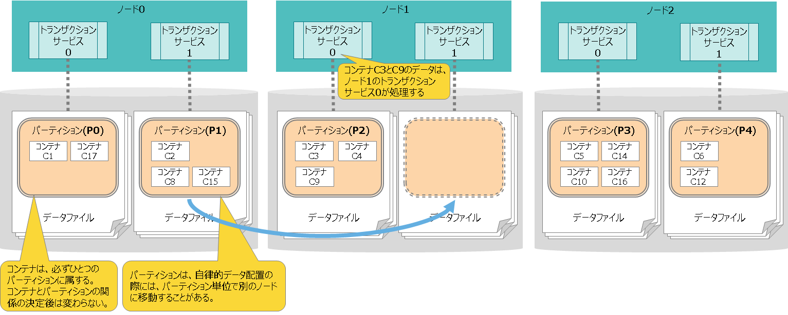

## --- はじめに ---

本書はGridDBの提供する設計・構築・運用について説明したものです。

本書は、GridDBを用いたシステム開発を行う設計者、GridDBの運用管理を行う管理者の方を対象としています。

本書は、以下のような構成となっています。

- 概要
  - GridDBの特徴と、設計・構築・運用に必要なGridDBアーキテクチャの概要について説明します。

- 物理設計
  - システムの非機能要求を実装するために必要なGridDBの設計項目について説明します。

- 構築
  - GridDBのインストールおよびアンインストールについて説明します。

- 運用
  - 監視や障害発生時の対応など、運用管理を説明します。

　

## --- 概要 ---

## GridDBの特徴

GridDBは、高性能でかつ拡張性と可用性を備えた分散NoSQL型のデータベースで、以下の特徴があります。

　

■データモデルとサポートするインターフェース

Key-Valueを発展させたデータモデルです。RDBのテーブルに相当するコンテナに対して、データを格納します。

<figure>
  
  <figcaption>データモデル</figcaption>
</figure>

NoSQLインターフェースのクライアントAPIやSQLライクなクエリ言語TQLだけでなく、NewSQLインターフェースとしてJDBC/ODBCやSQLも利用可能です。

<figure>
  
  <figcaption>NoSQL/NewSQLインタフェース</figcaption>
</figure>

　

■可用性

GridDBは、複数のノード（サーバプロセス）で構成されたクラスタで動作します。

ノードで障害が発生した場合、クラスタが自動的に障害を検知して、障害が発生したノードの役割を他のノードに移してクラスタの稼動を継続することができます。
また、クラスタ内ではデータを複製して複数のノード上に多重配置(レプリケーション)しています。
ノードに障害が発生した場合でも、クラスタが自動的にレプリカを再配置するため(自律的データ配置)、継続的にデータアクセスすることができます。

<figure>
  
  <figcaption>可用性</figcaption>
</figure>

　

■拡張性

GridDBのクラスタの性能を向上させるには、ノードが稼働するサーバをスケールアップする方法だけでなく、クラスタにノードを追加するスケールアウトも選択することができます。

スケールアウトでのシステム拡張はオンラインで行うことができます。また、スケールアウトでシステムに追加したノードには、システムの負荷に応じて適切にデータが配置されるため、運用も容易です。

<figure>
  
  <figcaption>拡張性</figcaption>
</figure>

　

■高速性

データベースの実行待ちとなる時間をできるだけ少なくするために、GridDBでは、CPUコア・スレッドごとに専有するメモリとデータベースファイルを割当て、排他、同期処理の待ちをなくしています。

<figure>
  
  <figcaption>高速性</figcaption>
</figure>

また、高速化のために、他にも以下の機能を持ちます。

- 索引機能
- テーブルパーティショニング
- データ圧縮
- 期限解放
- アフィニティ

詳細は、『[GridDB 機能リファレンス](../3.md_reference_feature/md_reference_feature.md)』をご参照ください。

　

## GridDBのアーキテクチャ概要

設計・構築・運用に必要なGridDBアーキテクチャの概要について説明します。

　

### スレッド構成

ノードには、さまざまな処理を行うスレッド(サービスと呼びます)が複数存在します。
ノードのスレッド構成と処理内容を説明します。

<figure>
  
  <figcaption>サービスの構成</figcaption>
</figure>

| スレッド名称            | スレッドの処理内容 |
|-----------------------|--------------------------------------------------------------------------------------|
| トランザクションサービス | ロウの登録、検索処理などのトランザクション処理や、データベースファイル書き込み処理などを行う |
| チェックポイントサービス | チェックポイント処理を行う   |
| クラスタサービス        | ハートビートや、ノードの参加・離脱などのクラスタ構成処理を行う  |
| シンクサービス          | パーティション再配置の際にデータ同期のための長期同期、短期同期処理を行う |
| システムサービス        | 運用管理操作の要求を受け付ける  |
| SQLサービス   | SQL処理を行う |

　
- クライアントからの処理の流れ

  - NoSQLクライアントからの処理要求は、トランザクションサービスに処理が割り当てられ、ロウの登録、検索処理などを行います。
  - NewSQLクライアントからの処理要求は、一度SQLサービスがSQL処理を行ってから、トランザクションサービスに処理を割当てます。

　

### データ管理

データを管理するデータベースファイルとトランザクションサービスは、一対一の関係にあります。

このデータベースファイルには、複数コンテナを管理するパーティションという内部構造があります。
各トランザクションサービスは、ひとつのパーティションのみを操作するため、他のトランザクションサービスとの排他処理なく実行可能です。

<figure>
  
  <figcaption>ひとつのノードが管理するパーティション・スレッド・ファイルの関係</figcaption>
</figure>

　

　

### ファイル構成

ノードが管理するファイルには、定義ファイルやデータベースファイルなどのファイルがあります。ファイルの構成と内容について説明します。

<figure>
  
  <figcaption>ノードが管理するファイル構成</figcaption>
</figure>

- 定義ファイル

  | 名前                                    |  内容                                                     |
  |-----------------------------------------|----------------------------------------------------------|
  | ノード定義ファイル<br>(gs_node.json)      | ノードのリソースや動作を設定する定義ファイルです。           |
  | クラスタ定義ファイル<br>(gs_cluster.json) | クラスタ構成のためのリソースや動作を設定する定義ファイルです。 |
  | ユーザ定義ファイル<br>(password)          | 管理ユーザを登録するファイルです。                          |


- データベースファイル

  | 名前                       |  内容                                                                                   |
  |----------------------------|----------------------------------------------------------------------------------------|
  | データファイル     | データを格納するファイルです。<br>データファイルは複数に分割して配置することも可能です。<br><br>○ファイル数<br>・パーティションごとにファイルを1つ作成します。<br>・データファイルを分割して配置する場合は、パーティションごとに分割数分のファイルを作成します。 |
  | チェックポイントログファイル | データベースのブロック管理情報を格納するファイルです。<br>チェックポイントのタイミングで、ブロック管理情報の書き込みを分割で行います。<br>パーティションごとにファイルをデフォルトで最大10個作成します。ノード定義ファイルの/checkpoint/partialCheckpointIntervalで調整できます。|
  | トランザクションログファイル | トランザクションログを格納するファイルです。<br>ひとつのファイルには、前回のチェックポイント開始から次のチェックポイント開始までに実行されたトランザクションログを格納します。<br>パーティションごとにファイルをデフォルトで最大3個(現在のログファイルと過去2世代分のログファイル)作成します。    |


- その他のファイル

  | 名前                        | 内容                                                                                |
  |-----------------------------|------------------------------------------------------------------------------------|
  | バックアップファイル          | オンラインバックアップを開始した時に作成されるファイルです。バックアップしたデータベースファイルやバックアップ情報のファイルを総称してバックアップファイルと呼びます。 |
  | イベントログファイル          | ノードの動作ログを格納するファイルです。エラーや警告などのメッセージが出力されます。      |
  | 同期処理用一時ファイル        | パーティション再配置による同期処理の時に、同期データを一時的に格納するためのファイルです。 |
  | SQL中間結果用スワップファイル | SQLの中間結果を一時的に格納するためのファイルです。ノード停止時にファイルは削除されます。  |

　

上記に説明したとおり、データベースファイルとして、パーティション単位に、データファイル、チェックポイントログファイル、トランザクションログファイルを持ちます。

更新に同期してデータをシーケンシャルにトランザクションログファイルに書き込むトランザクションログ処理により、トランザクション保証を行います。
また、メモリ上の更新データをブロック単位にデータファイルとチェックポイントログファイルに定期的に保存するチェックポイント処理により、データの永続化を行います。

　

### メモリ構造

GridDBは、ディスクI/Oを減らし、効率的に処理を行うために各種メモリエリアを持ちます。

<figure>
  
  <figcaption>メモリ</figcaption>
</figure>

| 名称                             | 内容 |
|----------------------------------|----------------------------------|
| データベースバッファ               | 読み込んだデータをキャッシュするためのI/Oバッファです。<br>データファイルから読み込んだデータイメージ（ブロック）をメモリ上にキャッシュします。データベースバッファのサイズが大きい程、ブロックがメモリ上にキャッシュされやすくなるため検索および登録性能が向上します。<br>ノード上にデータベースバッファの領域はひとつで、複数のトランザクション処理スレッドが共有して使用します。 |
| トランザクション処理用メモリエリア	 | ロウの登録や検索処理などを行うトランザクション処理スレッドが使用する領域です。|
| SQL中間結果格納バッファ  | SQL処理中の中間結果を格納するための領域です。<br>中間結果がバッファのメモリサイズ上限を超える場合は、一時的にSQL中間結果用スワップファイルに書き出します。|
| SQLワークメモリエリア     | SQL処理において、ジョインや集計などの途中結果を一時的に格納するための領域です。  |


GridDBは、メモリとディスクの両方を用いるハイブリッド方式のデータベースです。 メモリをデータのキャッシュとして用いてアクセスを高速化し、データをディスクに格納して大容量データの管理を実現しています。メモリのサイズが大きい方がより多くのデータがメモリ上にキャッシュされるため、ディスクI/Oが減って性能が向上します。


### クラスタ管理

GridDBは、複数のノードでクラスタを構成します。

ノードには「マスタ」と「フォロワ」という二つの役割があります。
マスタはクラスタ全体の管理を行います。 マスタ以外のノードはすべて「フォロワ」になります。

クラスタが開始する時には、クラスタを構成するノードのひとつが必ず「マスタ」になり、フォロワはマスタからの指示に基づいて同期などのクラスタ処理を行います。
マスタノードはGridDBが自動的に決定します。
もしマスタノードに障害が発生した場合、フォロワノード群から新たなマスタを自動で決定してクラスタの稼動を継続します。


また、クラスタ内ではデータを複製して、複数のノード上にデータ(レプリカ)を多重配置します。
レプリカの中で、マスタのデータをオーナ、複製したデータをバックアップと呼びます。
クラスタを構成するいずれかのノードに障害が発生した場合でも、レプリカを使用することで処理を継続できます。
ノード障害発生後のデータ再配置もシステムが自動的に行うため(自律的データ配置）、特別な運用操作は不要です。
障害対象のノードに配置されていたデータはレプリカから復旧され、自動的に設定されたレプリカ数となるようにデータは再配置されます。

<figure>
  
  <figcaption>レプリカ</figcaption>
</figure>

レプリカは、パーティション単位で作成します。クラスタにノード増設/削除を行った場合は、パーティションを自動で再割り当て・再配置することにより、各ノードにレプリカを分散配置します。

　
　　

## --- 物理設計 ---

システムの非機能要求を実装するために必要なGridDBの設計項目について説明します。

## 設計のポイント

システムで実現すべき非機能要求として、IPAにより「非機能要求グレード」が定義されています。以下にその一部を引用します。

非機能要求グレード2018 利用ガイド[解説編]　「非機能要求グレードの6大項目」より 　　(c)2010-2018 独立行政法人情報処理推進機構

| 非機能要求 大項目      | 要求の例       | 実現方法の例 |
|------------------------|---------------|-------------|
| 可用性                  | ・運用スケジュール(稼働時間・停止予定など)<br>・障害、災害時における稼働目標 | ・機器の冗長化やバックアップセンターの設置<br>・復旧・回復方法および体制の確立 |
| 性能・拡張性            | ・業務量および今後の増加見積り<br>・システム化対象業務の特性(ピーク時、通常時、縮退時など) | ・性能目標値を意識したサイジング<br>・将来へ向けた機器・ネットワークなどのサイズと配置＝キャパシティ・プランニング |
| 運用・保守性            | ・運用中に求められるシステム稼働レベル<br>・問題発生時の対応レベル | ・監視手段およびバックアップ方法の確立<br>・問題発生時の役割分担、体制、訓練、マニュアルの整備 |
| 移行性                 | ・新システムへの移行期間および移行方法<br>・移行対象資産の種類および移行量 | ・移行スケジュール立案、移行ツール開発<br>・移行体制の確立、移行リハーサルの実施 |
| セキュリティ            | ・利用制限<br>・不正アクセスの防止 | ・アクセス制限、データの秘匿<br>・不正の追跡、監視、検知<br>・運用員などへの情報セキュリティ教育 |


これらの非機能要求を満たすために必要なGridDBの設計項目は、以下になります。

- データ領域の設計
- メモリ領域の設計
- コンテナ設計
- クラスタ構成設計
- ネットワーク設計
- セキュリティ設計
- 監視設計
- バックアップ設計

設計内容は、システム要件のレベルや内容によって大きく変わりますが、GridDBの特徴である可用性および性能・拡張性を生かすために考慮すべき設計ポイントを中心に説明します。

　

## データ領域の設計

GridDBのデータは、ブロック、コンテナ、テーブル、ロウ、パーティションという単位でデータ管理されています。これらのデータ領域の設計は、可用性および性能・拡張性を決める重要な要因となります。

<figure>
  
  <figcaption>パーティション</figcaption>
</figure>


- ブロックとコンテナの関係
  - ブロックはデータ管理の最小単位でありブロックにコンテナのロウデータやメタ情報を格納します。ブロックには複数コンテナのデータが格納されます。

- コンテナとパーティションの関係
  - コンテナが所属するパーティションは、コンテナの名前から算出したハッシュ値によってクラスタが決定します。コンテナとパーティションの関係は恒久的なものであり、コンテナ作成時にパーティションが決定した後は変わりません。

- パーティションとノードの関係
  - パーティションは、クラスタ間でのデータ配置の単位です。パーティションの配置は、クラスタが自動的に決定します。パーティションとノードの関係は流動的なものであり、障害発生時の自律的データ配置によって、パーティションは別のノードに移動することがあります。

- 同一パーティション上のコンテナへのアクセス
  - 同じパーティションに属するコンテナ群への操作は、ひとつの処理スレッド（トランザクションサービス）が処理します。そのため、これらのコンテナ群に対する操作は逐次実行になります。


<figure>
  
  <figcaption>処理スレッドとパーティション、データベースファイルの関係</figcaption>
</figure>

　

[メモ]
- ノードアフィニティ機能を使用すると、関連の強いコンテナを同じパーティションに強制的に格納することができます。GridDBのSQLのテーブルのジョイン時にクラスタの別ノードに配置されたテーブルのネットワークアクセスでの負荷を減少させることができます。　

　

下記項目の設計ポイントについてまとめます。

- ブロックサイズ
- パーティション数
- 処理スレッド数（トランザクションサービス、SQLサービス）
- チェックポイント処理
- ファイル構成

　

<a id="block_size"></a>
### ブロックサイズ

ブロックとは、コンテナのロウデータやメタ情報などを格納するための物理的なデータ単位であり、GridDBのディスクI/Oの最小単位です。

<figure>
  
  <figcaption>ブロック</figcaption>
</figure>


ブロックのサイズは64KB、1MB、4MB、8MB、16MB、32MBから選択します。デフォルトは64KBで、通常はデフォルト値のままで変更不要です。

ただし、ブロックサイズにより、コンテナのカラム数の上限値が異なります。
ブロックサイズ64KBの場合のカラム数の上限値より多くのカラムを作成する場合は、ブロックサイズを変更してください。
上限値の詳細は『[GridDB 機能リファレンス](../3.md_reference_feature/md_reference_feature.md)』の「システムの制限値」をご参照ください。


■ブロックに格納するデータ

ブロックに格納するデータは、ロウのデータやコンテナのメタ情報、索引データなどの種類があります。データの種類ごとに分類してブロックに格納します。

| ブロック種別       | 説明                              |
|-------------------|-----------------------------------|
| metaData	        | コンテナのメタ情報を格納するブロック |
| rowData	          | コンテナ(期限解放設定なし)のロウのデータを格納するブロック |
| mapData	          | コンテナ(期限解放設定なし)の索引のデータを格納するブロック |
| batchFreeRowData	| コンテナ(期限解放設定あり)のロウのデータを格納するブロック |
| batchFreeMapData	| コンテナ(期限解放設定あり)の索引のデータを格納するブロック |

また、ひとつのブロックには、複数のコンテナのデータを格納します。アプリケーションから登録・更新された順にブロックに格納します。
時間または種類が近いデータをまとめてブロックに格納することで、データが局所化してメモリ効率が向上します。期間を条件とするような時系列データの検索処理を、少ないリソースで高速に行えます。

**関連するパラメータ**

- ●クラスタ定義ファイル(gs_cluster.json)

  | パラメータ                        | 初期値         | 内容                                   | 起動後の変更 |
  |----------------------------------|----------------|----------------------------------------|-----|
  | /dataStore/storeBlockSize        | 64KB           | ブロックサイズ                          | 不可 |


[メモ]
- ノードの初期起動後は、ブロックサイズは変更できません。
- クラスタを構成する全ノードで同じブロックサイズを指定してください。
- 表の「起動後の変更」は、運用開始後にパラメータを変更できるかどうかを表します。
  - 不可：ノードを一度でも起動した後は、変更することができません。変更するためにはデータベースファイルの初期化が必要になります。
- データアフィニティ機能を利用して各ブロックに関連性の強いデータのみを格納することで、データアクセスの局所化を図り、メモリヒット率を高めることができます。
- また、データアフィニティ機能のヒント情報に文字列「#unique」を指定すると、コンテナ単位にブロックを占有してデータを配置することができます。コンテナ単位のスキャンや、データ削除を高速化することができます。
- データアフィニティの詳細は、『[GridDB 機能リファレンス](../3.md_reference_feature/md_reference_feature.md)』をご参照ください。

### パーティション数

クラスタ上のデータ管理の仕組みとして、コンテナをパーティションと呼ぶデータの入れ物で管理します。

- コンテナは必ずひとつのパーティションに属し、パーティションは複数のコンテナを格納します。
- トランザクションサービスとデータベースファイルには、パーティション単位でコンテナを割り当てます。

<figure>
  
  <figcaption>ひとつのノードが管理するパーティション・スレッド・ファイルの関係</figcaption>
</figure>


パーティション数のデフォルトは128です。通常はデフォルト値のままで変更不要ですが、以下の条件式を満たさない場合はパーティション数を増やす必要があります。

**パーティション数 >= トランザクションサービスの並列度 × クラスタの構成ノード数**

- 条件式を満たさない場合、パーティションが割当たらないトランザクションサービスが出来てしまいます。
  そのため、上記の式を満たすようにパーティション数を設定してください。
  - 例) 並列度32でノード数5の場合
    - パーティション数128(デフォルト)では条件式を満たさない：128 < (32 × 5=160)
    - パーティション数は160以上に設定してください。


**関連するパラメータ**

- ●クラスタ定義ファイル(gs_cluster.json)

  | パラメータ                      | 初期値        | 内容                                   | 起動後の変更 |
  |--------------------------------|---------------|----------------------------------------|-----|
  | /dataStore/partitionNum        | 128           | パーティション数                        | 不可 |

- ■ノード定義ファイル(gs_node.json)

  | パラメータ                      | 初期値        | 内容                                   | 起動後の変更 |
  |--------------------------------|---------------|----------------------------------------|-----|
  | /dataStore/concurrency         | 4             | トランザクション処理スレッドの並列度          | 可(ノード再起動)  |

[メモ]
- 表の「起動後の変更」は、運用開始後にパラメータを変更できるかどうかを表します。
  - 不可：ノードを一度でも起動した後は、変更することができません。変更するためにはデータベースファイルの初期化が必要になります。
  - 可(ノード再起動)：パラメータを記載している定義ファイルを書き換えて、ノードを再起動すると変更できます。


　

<a id="num_of_threads"></a>
### 処理スレッド数

GridDBノードは1つのプロセスから構成されています。プロセス内にはさまざまな処理を行うスレッド（サービスと呼びます）が複数存在します。

ここでは、サービスの中で「トランザクションサービス」と「SQLサービス」の並列度を決定します。


<figure>
  
  <figcaption>サービスの構成</figcaption>
</figure>


| スレッド名称            | スレッド数<br>(デフォルト) | スレッドの処理内容 |
|-----------------------|------------|--------------------------------------------------------------------------------------|
| トランザクションサービス | 4　(設定可) | ロウの登録、検索処理などのトランザクション処理や、データベースファイル書き込み処理などを行う |
| チェックポイントサービス | 1　 | チェックポイント処理を行う  |
| クラスタサービス        | 1           | ハートビートや、ノードの参加・離脱などのクラスタ構成処理を行う |
| シンクサービス          | 1           | パーティション再配置の際にデータ同期のための長期同期、短期同期処理を行う  |
| システムサービス        | 1           | 運用管理操作の要求を受け付ける  |
| SQLサービス   | 4　(設定可)  | SQL処理を行う  |

各サービスが行う処理を「イベント」と言います。サービスはひとつのイベントキューを持ち、イベントキューに登録されたイベントを順次処理します。他のサービスに処理を依頼する時には、そのサービスが持つイベントキューにイベントを登録します。

<figure>
  
  <figcaption>サービスが処理するイベント</figcaption>
</figure>

- スレッドの種類ごとに、イベントキューに登録できるイベントの種類が異なります。
- イベントキューに登録されたイベントは、そのスレッドで順番に処理します。並列実行されません。
- 実行中のイベントの情報は、運用ツールのgs_shで確認することができます。
  『[GridDB 運用ツールリファレンス](../5.md_reference_operation_tool/md_reference_operation_tool.md』を参照してください。

[メモ]
- ノード定義ファイルでスレッド数を設定可能なのは、トランザクションサービスとSQLサービスのみです。 　

　

検索や登録の並列性能に特に影響するスレッドは、トランザクション処理を行うスレッド(トランザクションサービス)とSQLの処理を行うスレッド(SQLサービス)です。 ノードを稼動するマシンのCPUコア数に合わせて、これらの処理スレッドの並列度(concurrency)を設定します。


- トランザクションサービスの並列度
  - トランザクションサービスは、ロウの登録・検索処理、データベースファイルへの書き込み処理などを行うスレッドです。
  - トランザクションサービスの並列度を増やすと、複数のコンテナへの並列アクセス性能が向上します。
  - トランザクションサービス(スレッド)とデータベースファイル(ファイル)とコンテナ(データ)との関係は下図のように1対1対1になります。
    - コンテナAのデータは、トランザクションサービス0が処理して、データベースファイル0に格納します。コンテナAのデータを、トランザクションサービス0と1が同時にアクセスすることはありません。
    - データとスレッドとファイルのリソースを分離することで、リソースの排他やロック競合がなくなり、高速に処理できます。

    <figure>
      
      <figcaption>ひとつのノードが管理するデータ・スレッド・ファイルの関係</figcaption>
    </figure>

- SQLサービスの並列度
  - SQLサービスは、SQLの処理を行うスレッドです。
  - SQLサービスは、トランザクションサービスのようなデータとファイルとの関係はありません。データベースファイルへのアクセスが必要な場合やその他トランザクション処理が必要な場合は、トランザクションサービス経由で行います。


並列度設定の目安は以下になります。

- ノードを稼動するマシンのCPUコア数に合わせて、トランザクションサービスの並列度を大きくすることを推奨します。
  - 並列度を増やすと、複数のコンテナへの並列アクセス性能が向上します。
  - ただし、同一コンテナへの操作はひとつのスレッドが行うので、並列度を増やしても同一コンテナへの処理性能は向上しません。

- トランザクションサービスとSQLサービスの並列度の合計が、マシンのCPUコア数を超えないことを推奨します。
  - トランザクションサービスの並列度(/dataStore/concurrency) + SQLサービスの並列度(/sql/concurrency)

[メモ]
- トランザクションサービスおよびSQLサービスの並列度は、ノードの再起動で変更可能です。


**関連するパラメータ**

- ■ノード定義ファイル(gs_node.json)

  | パラメータ                        | 初期値         | 内容                                                   | 起動後の変更 |
  |----------------------------------|----------------|-------------------------------------------------------|------------|
  | /dataStore/concurrency           | 4              | トランザクション処理スレッドの並列度                     | 可(ノード再起動)       |
  | /sql/concurrency                 | 4              | SQL処理スレッドの並列度                         | 可(ノード再起動) |


[メモ]
- 表の「起動後の変更」は、運用開始後にパラメータを変更できるかどうかを表します。
  - 不可：ノードを一度でも起動した後は、変更することができません。変更するためにはデータベースファイルの初期化が必要になります。
  - 可(ノード再起動)：パラメータを記載している定義ファイルを書き換えて、ノードを再起動すると変更できます。

　

### チェックポイント処理

チェックポイント処理は、データベースバッファ上の更新されたブロックをデータファイル、チェックポイントログファイルに書き込む処理です。

チェックポイント実行周期をパラメータで設定できます。通常は、パラメータはデフォルト値のままで変更は不要です。

<figure>
  
  <figcaption>チェックポイント処理の実行</figcaption>
</figure>

また、チェックポイント実行時、チェックポイントログファイルへブロック管理情報を分割で書き込みます。この分割数はパラメータで設定できますが、通常はデフォルト値のままで変更は不要です。設定値を大きくすることで、チェックポイントログファイルへの1回の書き込み量を減少させることができますが、ノード起動時のリカバリ時間が増える可能性があります。

チェックポイント処理は、以下のタイミングで実行されます。

| タイミング        | 内容                                                                 |
|------------------|----------------------------------------------------------------------|
| 定期             | 一定周期で自動的に実行する(周期はパラメータで指定。定期実行を一時的に無効に設定することもできる) |
| 手動             | ユーザがgs_checkpointコマンドを実行した時に実行する                      |
| ノード起動/停止   | ノード起動時のリカバリ処理の後、およびノードの通常停止の時に自動的に実行する |
| 長期同期開始/終了 | 長期同期処理を開始/終了する時に自動的に実行する                           |


データファイルの圧縮を指定することもできます。データファイルを圧縮することで、データ量に伴って増加するストレージコストを削減できます。
データ圧縮の機能の詳細については『[GridDB 機能リファレンス](manuals/3.md_reference_feature/md_reference_feature.md)』の「データブロック圧縮」をご参照ください。


**関連するパラメータ**

- ■ノード定義ファイル(gs_node.json)

  | パラメータ                        | 初期値         | 内容                                             | <span style="white-space: nowrap;">起動後</span><span style="white-space: nowrap;">の変更</span> |
  |----------|----------|-------------------------------------------------|---------------------------------------------------|
  | /checkpoint/checkpointInterval   | 60s            | チェックポイント実行周期 | 可(ノード再起動) |
  | /checkpoint/partialCheckpointInterval  |  5       | チェックポイントログファイルへブロック管理情報を書き込む処理の分割数  | 可(ノード再起動) |
  | /dataStore/storeCompressionMode  | NO_COMPRESSION | データファイル圧縮書き出し設定<br>圧縮しない："NO_COMPRESSION"または0<br>圧縮する："COMPRESSION"または1 | 可(ノード再起動) |


[メモ]
- 表の「起動後の変更」は、運用開始後にパラメータを変更できるかどうかを表します。
  - 可(ノード再起動)：パラメータを記載している定義ファイルを書き換えて、ノードを再起動すると変更できます。

　
　　　
### ファイル構成

GridDBノードが稼働中に作成および出力するファイルには、データベースファイルやバックアップファイルなどの種類があります。

データベースファイルおよびバックアップファイルは、ファイルサイズが大きくなることやディスクI/Oが性能に大きく影響することから、ストレージの容量やI/O性能を考慮して適切な配置ディレクトリを指定してください。

<figure>
  
  <figcaption>データベースファイルとその他の出力ファイル</figcaption>
</figure>


配置ディレクトリは、デフォルトではGridDBホームディレクトリ(/var/lib/gridstore)下のディレクトリになります。

- データベースファイルの配置ディレクトリ
  - データファイル、チェックポイントログファイル、トランザクションログファイルを総称してデータベースファイルと呼びます。
  - データファイル、チェックポイントログファイルの格納先として、DBディレクトリを指定します。また、トランザクションログファイルの格納先として、txnlogディレクトリを指定します。それぞれのディレクトリを別の物理ディスクに配置することで、ディスクに対する負荷分散が可能です。
  - DBディレクトリ、txnlogディレクトリ以下に、パーティションID数分のディレクトリを自動で作成します。パーティションID数分作成されるディレクトリ毎に別の物理ディスクに配置することで、ディスクに対する負荷分散が可能です。

- バックアップファイルの配置ディレクトリ
  - ディスクの物理障害を考慮して、データベースファイルとは異なる物理ディスクに配置するように設定してください。
  - フルバックアップを取ると、データベースファイルと同じ容量が必要になります。


**出力ファイル一覧**

- データベースファイル

  | <span style="white-space: nowrap;">名前</span>&nbsp;&nbsp;&nbsp;&nbsp;   |  内容                                                                       | ファイル名 |
  |----------------------------|----------------------------------------------------------------------------|-------------|
  | データファイル     | データを格納するファイルです。<br><br>○ファイル数<br>・デフォルトでは、パーティションごとにファイルを1つ作成します。<br>・設定により、データファイルを分割することも可能です。ノード定義ファイルの/dataStore/dbFileSplitCountで、データファイルの分割数を定義できます。<br><br>○ファイルサイズ<br>・ファイル内の空き容量が少なくなった場合は自動的にファイルサイズを拡張します。 | /\<PartitionID\>/\<PartitionID\>\_part\_\<n\>.dat<br>（n：0からの連番） |
  | チェックポイントログファイル | データベースのブロック管理情報を格納するファイルです。<br>チェックポイントのタイミングで、ブロック管理情報の書き込みを分割で行います。<br><br>○ファイル数<br>パーティションごとにファイルをデフォルトで最大10個保持します。ノード定義ファイルの/checkpoint/partialCheckpointIntervalで調整できます。|　/\<PartitionID\>/\<PartitionID\>\_\<CheckpointNumber\>.cplog|
  | トランザクションログファイル | トランザクションログを格納するファイルです。<br>ひとつのファイルには、前回のチェックポイント開始から次のチェックポイント開始までに実行されたトランザクションログを格納します。<br><br>○ファイル数<br>・パーティションごとにファイルをデフォルトで最大3個(現在のログファイルと過去2世代分のログファイル)保持します。 | /\<PartitionID\>/\<PartitionID\>\_\<CheckpointNumber\>.xlog   |

- その他のファイル

  | 名前                           | 内容                                                                                |
  |--------------------------------|------------------------------------------------------------------------------------|
  | バックアップファイル             | オンラインバックアップを開始した時に作成されるファイルです。バックアップしたデータファイル、チェックポイントログファイル、トランザクションログファイル、およびバックアップ情報のファイルを総称してバックアップファイルと呼びます。 |
  | イベントログファイル             | ノードの動作ログを格納するファイルです。エラーや警告などのメッセージが出力されます。      |
  | 同期処理用一時ファイル           | パーティション再配置による同期処理の時に、同期データを一時的に格納するためのファイルです。 |
  | SQL中間結果用スワップファイル | SQLの中間結果を一時的に格納するためのファイルです。ノード停止時にファイルは削除します。  |


**関連するパラメータ**

- ■ノード定義ファイル(gs_node.json)

  ディレクトリパスが相対パスの場合の起点は、GridDBホームディレクトリになります。

  | パラメータ                        | 初期値         | 内容                                                   | <span style="white-space: nowrap;">起動後</span><span style="white-space: nowrap;">の変更</span> |
  |----------------------------------|----------------|-------------------------------------------------------|------------|
  | /dataStore/dbPath                | data           | データファイル、チェックポイントログファイル配置ディレクトリ                      | 可(ノード再起動) |
  | /dataStore/transactionLogPath    | txnlog         | トランザクションログファイル配置ディレクトリ                      | 可(ノード再起動) |
  | /dataStore/backupPath            | backup         | バックアップファイル配置ディレクトリ                      | 可(ノード再起動) |
  | /dataStore/syncTempPath          | sync           | 同期処理用一時ファイル配置ディレクトリ                      | 可(ノード再起動) |
  | /system/eventLogPath             | log            | イベントログファイル配置ディレクトリ                      | 可(ノード再起動) |
  | /sql/storeSwapFilePath           | swap           | SQL中間結果用スワップファイル配置ディレクトリ     | 可(ノード再起動) |
  | /dataStore/dbFileSplitCount      | なし           | データファイルの分割数。<br>例) データファイルの分割数=4の場合<br>データファイルはパーティションごとに4分割され、/\<PartitionID\>/\<PartitionID\>\_part\_0.dat ～ /\<PartitionID\>/\<PartitionID\>\_part\_3.datを作成  | 不可       |

[メモ]
- 表の「起動後の変更」は、運用開始後にパラメータを変更できるかどうかを表します。
  - 不可：ノードを一度でも起動した後は、変更することができません。変更するためにはデータベースファイルの初期化が必要になります。
  - 可(ノード再起動)：パラメータを記載している定義ファイルを書き換えて、ノードを再起動すると変更できます。

## メモリ領域の設計

GridDBは、メモリとディスクの両方を用いるハイブリッド方式のデータベースです。 メモリをデータのキャッシュとして用いてアクセスを高速化し、データをディスクに格納して大容量データの管理を実現しています。

下図のように、メモリのサイズが大きい方がより多くのデータがメモリ上にキャッシュされるため、ディスクI/Oが減って性能が向上します。 メモリサイズの大きさはGridDBの性能に大きく影響するため、システムの性能要件やデータ量を考慮して設計を行います。

<figure>
  
  <figcaption>メモリとディスクの併用</figcaption>
</figure>

　

GridDBノードには、用途に応じて様々なバッファやメモリエリアがあります。主なメモリは以下の通りです。

<figure>
  
  <figcaption>メモリ</figcaption>
</figure>

| 名称                            | 内容                                        |
|---------------------------------|--------------------------------------------|
| データベースバッファ              | 読み込んだデータをキャッシュするためのI/Oバッファです。<br>データファイルから読み込んだデータイメージ（ブロック）をメモリ上にキャッシュします。データベースバッファのサイズが大きい程、ブロックがメモリ上にキャッシュされやすくなるため検索および登録性能が向上します。<br>ノード上にデータベースバッファの領域はひとつで、複数のトランザクション処理スレッドが共有して使用します。|
| トランザクション処理用メモリエリア  | ロウの登録や検索処理などを行うトランザクション処理スレッドが使用する領域です。|
| SQL中間結果格納バッファ | SQL処理中の中間結果を格納するための領域です。<br>中間結果がバッファのメモリサイズ上限を超える場合は、一時的にSQL中間結果用スワップファイルに書き出します。  |
| SQLワークメモリエリア     | SQL処理において、ジョインや集計などの途中結果を一時的に格納するための領域です。  |

　

メモリ領域の設計では、各メモリ領域の上限サイズや関連するパラメータの値を設計する必要があります。
特にポイントとなるのが「データベースバッファ」と「SQL処理用メモリエリア」のメモリサイズです。

<figure>
  
  <figcaption>メモリ</figcaption>
</figure>


システムの性能に最も影響がでるのは「データベースバッファ」のサイズです。 物理メモリの容量に余裕があれば、このバッファに出来るだけ多くサイズを割り当てることを推奨します。

- GridDBに格納するデータの特性から、頻繁に使うもの／使わないものを分類する

  - 多くの場合、時系列データの経過時間による分類を行うと良い
  - 例
    - 頻繁に使うもの→直近１時間のセンサーデータ
    - 頻繁に使わないもの→１年前のデータ
    - 1年分のデータを格納しているが、通常業務で検索する範囲は直近の1ヶ月分のデータ
    - 5つの工場の生産データを格納しているが、高速に検索する必要があるのは1つの工場のみ

  - そのため、一番性能が必要な処理が使うデータの種類と期間を調査します

- 頻繁に使うデータが入り切るようにデータベースバッファのサイズを設定する


SQL処理用メモリバッファのサイズについては、システムで使用する代表的なSQLクエリで評価を実施して、メモリサイズを設定してください。

- 必須の設計項目
  - 使用するデータ量に合わせてバッファのサイズを決めます。

    | バッファ名	          | 設計の目安                      |
    |---------------------|--------------------------------|
    | データベースバッファ  | 頻繁に検索する範囲のデータサイズを見積り、メモリサイズを設定する |
    | SQL関連のバッファ    | システムで使用するSQLのクエリで評価を実施してメモリサイズを設定する |


- 必要に応じて変更する設計項目

  - 運用状況に応じて、バッファのサイズを変更します。

    | バッファ名                      | 変更が必要なケース |
    |--------------------------------|---------------------------------------------------|
    | トランザクション処理用メモリエリア | TQLやSQLによる操作でメモリ不足エラー[CM_MEMORY_LIMIT]が発生する場合は、変更が必要 |

　

下記項目の設計ポイントについてまとめます。
- データベースバッファ
- トランザクション処理用メモリエリア
- SQL処理用メモリエリア
- その他のメモリ

　

<a id="store_memory"></a>
### データベースバッファ

データファイルから読み込んだブロックをメモリ上にキャッシュするための領域です。

データベースバッファのサイズが大きい程、データのブロックがメモリ上にあるため、検索および登録性能が向上します。

バッファのサイズ上限値は、ノード定義ファイルで指定します。 バッファの空きが無くなった時は、LRUで古いブロックをデータファイルに書き出して空き領域を作り、ファイルから残りのブロックを読み込みます。ファイルからの読み込み/ファイルへの書き込み処理をスワップ処理と呼びます。
もし、ブロックが使用中で書き出せずに空き領域を作れない場合は、バッファサイズを一時的に拡張します。処理が終了して領域が不要になると、サイズ上限値まで縮小します。

バッファの内部は、パーティション単位で分割して使用します。パーティションごとのサイズは、データ量やアクセス状況に応じてノードが動的に決定します。

<figure>
  
  <figcaption>データベースバッファ</figcaption>
</figure>

ノード起動直後は、データベースバッファに何もブロックが読み込まれていないため、起動直後の検索や登録処理では頻繁にブロックの読込みによるスワップ処理が発生して性能が遅くなる場合があります。


**関連するパラメータ**

- ■ノード定義ファイル(gs_node.json)

  | パラメータ                    | 初期値    | 内容                               | 起動後の変更 |
  |------------------------------|-----------|-----------------------------------|-------------|
  | /dataStore/storeMemoryLimit  | 1024MB    | データベースバッファのサイズ上限値 　| 可(オンライン) |

  [メモ]
  - サイズ上限値は、ノード起動中にオンラインでの変更も可能です。ただし、変更を永続化するためにはノードを停止して定義ファイルを書き換える必要があります。
  - データベースバッファのサイズ上限については、GridDBが使用可能な物理メモリの60~70%を割り当ててください。運用開始後、スワップ処理の量を確認してください。スワップ処理が大量に発生している場合は、データベースバッファが足りずに性能が低下している可能性があります。メモリ増設とデータベースバッファサイズの上限値の見直しを検討してください。
    - スワップ処理については、以下の「関連する情報の確認方法」でスワップ処理の読み込みと書き込みの情報を確認してください。
  - 表の「起動後の変更」は、運用開始後にパラメータを変更できるかどうかを表します。
    - 可(オンライン)：ノード稼動中にオンラインでパラメータを変更できます。永続化するためには定義ファイルの書き換えが必要です。


**関連する情報の確認方法**

- 設定値や現在値の情報は、ノード稼働中に運用コマンドgs_statを実行して確認することができます。

  | gs_statのJSON形式の表示項目     | 設定値/現在値  | 内容                                               |
  |--------------------------------|--------------|----------------------------------------------------|
  | /performance/storeMemoryLimit  | 設定値 | データベースバッファのサイズ上限値 (単位：バイト)             |
  | /performance/storeMemory       | 現在値 | データベースバッファの現在のサイズ (単位：バイト)             |
  | /performance/swapRead          | 現在値 | スワップ処理のファイルからの読み込み回数(累計) (単位：回数)     |
  | /performance/swapReadSize      | 現在値 | スワップ処理のファイルからの読み込みサイズ(累計) (単位：バイト) |
  | /performance/swapReadTime      | 現在値 | スワップ処理のファイルからの読み込み時間(累計) (単位：ミリ秒)   |
  | /performance/swapWrite         | 現在値 | スワップ処理のファイルへの書き込み回数(累計) (単位：回数)       |
  | /performance/swapWriteSize     | 現在値 | スワップ処理のファイルへの書き込みサイズ(累計) (単位：バイト)   |
  | /performance/swapWriteTime     | 現在値 | スワップ処理のファイルへの書き込み時間(累計) (単位：ミリ秒)     |

  [実行例]
  ```
  $ gs_stat -u admin/admin -s 192.168.0.1:10040
  {
    ：
    "performance": {
      "storeMemory": 4294967296,
      "storeMemoryLimit": 4294967296,
      "storeTotalUse": 9792126976,
      "swapRead": 2072705,
      "swapReadSize": 135836794880,
      "swapReadTime": 3920574,
      "swapWrite": 2172,
      "swapWriteSize": 142344192,
      "swapWriteTime": 601,
      ：
  ```

### トランザクション処理用メモリエリア

ロウの登録や検索処理などを行うトランザクションサービスが使用するメモリエリアです。各トランザクションサービスは、処理に必要なサイズ分のメモリをメモリエリアから確保して使用します。1回のトランザクション処理が終了すると、確保していたメモリをメモリエリアに戻します。

トランザクションサービスの数（並列度）の値は、/dataStore/concurrency(デフォルト4)になります。

<figure>
  
  <figcaption>トランザクション処理用メモリエリア</figcaption>
</figure>

メモリエリア上のメモリが全て使用中で、トランザクションサービスに必要なメモリを確保できない時はエラーになります。

トランザクションサービスでは、TQLでの数千万ヒットのクエリを実行、巨大なサイズのBLOBの登録、MultiPutによる巨大なサイズのデータの一括登録などの処理でメモリを多く使う場合があります。 トランザクションの処理内容や、トランザクションサービスの数(並列度/dataStore/concurrency)に応じて、メモリエリアのサイズ上限値を設定する必要があります。


**関連するパラメータ**

- ■ノード定義ファイル(gs_node.json)

  | パラメータ                        | 初期値    | 内容                                          | 起動後の変更 |
  |----------------------------------|-----------|----------------------------------------------|-------------|
  | /transaction/totalMemoryLimit    | 1024MB    | トランザクション処理用メモリエリアのサイズ上限値 | 可(ノード再起動)   |
  | /transaction/workMemoryLimit     | 128MB     | ひとつのトランザクション処理スレッドが使用するメモリのサイズ上限値 | 可(ノード再起動)   |

  [メモ]
  - サイズ上限値は、オンラインでの変更はできません。変更するためにはノードを停止して定義ファイルを書き換える必要があります。
  - 処理に必要なメモリが確保できない時にはエラーになります。現在の上限値の設定を確認し、メモリ増設と上限値の見直しを検討してください。
  - 表の「起動後の変更」は、運用開始後にパラメータを変更できるかどうかを表します。
    - 可(ノード再起動)：パラメータを記載している定義ファイルを書き換えて、ノードを再起動すると変更できます。


**関連する情報の確認方法**

- 設定値の情報は、ノード稼働中に運用コマンドgs_paramconfを実行して確認することができます。

  | gs_paramconfのJSON形式の表示項目 | 設定値/現在値    | 内容                      |
  |--------------------------------|-----------------|---------------------------|
  | /transaction/totalMemoryLimit  | 設定値           | トランザクション処理用メモリエリアのサイズ上限値 (単位：バイト) |
  | /transaction/workMemoryLimit   | 設定値           | ひとつのトランザクション処理スレッドが使用するメモリのサイズ上限値 (単位：バイト) |

　

### SQL処理用メモリエリア

SQL処理用のメモリエリアには、SQL中間結果格納バッファとSQLワークメモリエリアがあります。

SQL中間結果格納バッファは、SQL処理におけるスキャンやジョインなどのタスクの中間結果のテーブルのデータを格納するためのメモリです。
中間結果がバッファのメモリサイズ上限を超える場合は、一時的にSQL中間結果用スワップファイルに書き出します。

SQLを利用した大量データに対する分析クエリを実行する場合は、データベースバッファとのバランスを考慮しながらできるだけ値を大きくすることを推奨します。

SQLワークメモリは、SQL処理におけるタスクの処理で使用するメモリです。ワークメモリについては、デフォルト値を変更する必要はありません。

ただし、中間結果格納バッファとワークメモリのサイズは、次の式を満たすように設定してください。

- 中間結果格納バッファの上限値(storeMemoryLimit) >= ワークメモリの上限値(workMemoryLimit) × SQL処理の並列度(concurrency)

満たさない場合は、中間結果用スワップファイルへの書き出しが頻発してしまいます。

**関連するパラメータ**

- ■ノード定義ファイル(gs_node.json)

  | パラメータ                | 初期値     | 内容                                               | 起動後の変更 |
  |--------------------------|-----------|----------------------------------------------------|--------------|
  | /sql/storeMemoryLimit    | 1024MB    | SQL中間結果格納バッファのサイズ上限値                 | 可(ノード再起動)    |
  | /sql/workMemoryLimit     | 32MB      | SQLワークメモリバッファのサイズ上限値                 | 可(ノード再起動)    |
  | /sql/workCacheMemory     | 128MB     | workMemoryLimitのメモリのうち、使用後に解放せずにキャッシュするサイズ | 可(ノード再起動) |
  | /sql/storeSwapFilePath   | swap      | SQL中間結果を格納するファイルを配置するディレクトリ    | 可(ノード再起動)    |
  | /sql/concurrency         | 4         | SQL処理の並列度                                     | 可(ノード再起動)    |

  [メモ]
  - サイズ上限値は、オンラインでの変更はできません。変更するためにはノードを停止して定義ファイルを書き換える必要があります。
  - SQL処理用のメモリが不足している場合、スワップ処理(スワップファイルへの書き込みやスワップファイルからの読み込み処理)が行われます。
    - スワップ処理が多く発生している場合は、SQL処理用メモリのサイズを大きくしてください。スワップ処理の発生状況は、「関連する情報の確認方法」のsqlStoreSwapXXXXの項目で確認できます。
  - 表の「起動後の変更」は、運用開始後にパラメータを変更できるかどうかを表します。
    - 可(ノード再起動)：パラメータを記載している定義ファイルを書き換えて、ノードを再起動すると変更できます。


**関連する情報の確認方法**

- 設定値の情報は、ノード稼働中に運用コマンドgs_paramconfを実行して確認することができます。

  | gs_statのJSON形式の表示項目        | 設定値/現在値  | 内容                                               |
  |-----------------------------------|--------------|----------------------------------------------------|
  | /sql/storeMemoryLimit             | 設定値 | SQL中間結果格納バッファのサイズ上限値                           |
  | /sql/workMemoryLimit              | 設定値 | SQLワークメモリバッファのサイズ上限値                               |
  | /sql/workCacheMemory              | 設定値 | workMemoryLimitのメモリのうち、使用後に解放せずにキャッシュするサイズ |
  | /sql/storeSwapFilePath            | 設定値 | SQL中間結果を格納するファイルを配置するディレクトリ               |  


- 現在値の情報は、ノード稼働中に運用コマンドgs_statを実行して確認することができます。

  | gs_statのJSON形式の表示項目        | 設定値/現在値  | 内容                                               |
  |-----------------------------------|--------------|----------------------------------------------------|
  | /performance/sqlStoreSwapRead          | 現在値 | スワップ処理のファイルからの読み込み回数(累計) (単位：回数)     |
  | /performance/sqlStoreSwapReadSize      | 現在値 | スワップ処理のファイルからの読み込みサイズ(累計) (単位：バイト) |
  | /performance/sqlStoreSwapReadTime      | 現在値 | スワップ処理のファイルからの読み込み時間(累計) (単位：ミリ秒)   |
  | /performance/sqlStoreSwapWrite         | 現在値 | スワップ処理のファイルへの書き込み回数(累計) (単位：回数)       |
  | /performance/sqlStoreSwapWriteSize     | 現在値 | スワップ処理のファイルへの書き込みサイズ(累計) (単位：バイト)   |
  | /performance/sqlStoreSwapWriteTime     | 現在値 | スワップ処理のファイルへの書き込み時間(累計) (単位：ミリ秒)     |

　

### その他のメモリ

#### コンテナ、データファイル管理情報保持用メモリ

処理用のバッファ以外にも、コンテナやファイルの管理情報を保持するためにメモリを使用します。次の2つのメモリのサイズは、それぞれコンテナ数とデータ容量に比例して大きくなります。

- コンテナ管理用メモリ
  - ノード上のコンテナ数 × 64バイト程度のメモリを常時使用します。
  - 例えば、コンテナ数が1000万の場合、約640MBのメモリを使用します。

- データファイル管理用メモリ
  - ノード上の全データ容量 ÷ ブロックサイズ × 32バイト程度のメモリを常時使用します。
  - 例えば、全データ容量が1TBでブロックサイズ64KBの場合、約500MBのメモリを使用します。 　

　

## コンテナ設計

コンテナの最適な設計はシステムやアプリケーションの要件によって大きく異なります。
本節ではコンテナ設計の参考になる基本的なポイントを説明し、関連する情報を示します。

### 推奨する設計

**日々生成されるデータは時系列コンテナに格納**

コンテナの種別にはコレクションと時系列コンテナの2つがあります。

まずは、格納するデータに対して時系列コンテナが利用できるかを検討し、
時系列コンテナが利用できない場合にのみコレクションの利用を検討します。

IoTシステムのように機器のセンサデータやログが時々刻々生成され、増加していく
場合は、時系列コンテナを使いましょう。時系列コンテナは時系列データの格納と
参照に対して最適化されているため、データベースバッファの利用効率がコレクションを
利用したときと比べて高くなります。

また、時系列コンテナには、時系列データ特有の演算機能があります。この機能への理解を深めると、コンテナ設計に役立ちます。

[参考]
- 本書
  - [データベースバッファ](#store_memory)
- GridDB 機能リファレンス
  - [データモデル](../3.md_reference_feature/md_reference_feature.md#data_model)
  - [時系列データ特有の機能](../3.md_reference_feature/md_reference_feature.md#ts_data_functions)
- GridDB プログラミングガイド
  - [時系列データを扱う(Java)](../10.md_programming_guide/md_programming_guide.md#java_timeseries_function)
- GridDB TQLリファレンス
  - [集計演算 ― 時系列](../11.md_reference_tql/md_reference_tql.mdl#aggregation_ts)
  - [時系列データ選択・補間演算](../11.md_reference_tql/md_reference_tql.md#ts_data_selection)

**コンテナは少数より多数**

1つのコンテナに対する処理は、1台のノードの1つの処理スレッドで行われます。そのため、
少数のコンテナにそれぞれ大量のデータを格納するようなコンテナ設計を行うと、ノードの
処理並列度(マルチコア)が活かせません。また、特定のノードにアクセスが集中することにも
繋がるため、ノードを増設した場合に性能がスケールアウトしません。

例えば、時系列データの場合は、次のようにデータソースごとに時系列コンテナを作成します。
- センサデータは個々のセンサごとに1つの時系列コンテナを作成する
- 生産データは個々の製品ごとに1つの時系列コンテナを作成する

また、同種のデータであっても、クラスタのノード数 * ノードあたりの処理並列度を目安とした
複数のコンテナに分割することを推奨します。

複数のコンテナの操作を直列に実行してしまうと、性能の低下に繋がります。
分割したコンテナは一括処理機能を使ってなるべく並列に処理しましょう。

[参考]
- 本書
  - [処理スレッド数](#num_of_threads)
- GridDB 機能リファレンス
  - [複数コンテナへの一括処理機能](../3.md_reference_feature/md_reference_feature.md#batch_functions)
- GridDB プログラミングガイド
  - [複数のコンテナに対して一括で操作を行う(Java)](../10.md_programming_guide/md_programming_guide.md#java_batch_functions)

**データに合った方法でコンテナを分割する**

コンテナを分割する方法は3つあります。

- ロウの分割  
  同種のデータを検索条件に合わせて分割する方法です。例えば、あるセンサデータを1つのコンテナに
  格納し続けるのではなく、1日分のデータのみを1つのコンテナに格納します。このように格納すると、
  ある日のすべてのデータやあるセンサの1週間分のデータといった検索で並列処理が容易になり、
  検索性能が向上します。
- カラムの分割  
  参照頻度の低いデータを別のコンテナに分けて分割する方法です。例えば、機器のログすべてを1つの
  コンテナに格納するのではなく、解析によく使用する情報のみ同じコンテナに格納し、それ以外の
  情報を別のコンテナに格納します。このように格納すると、余計なデータを参照する必要がなくなり、
  検索性能が向上します。
- テーブルパーティショニング
  特定のカラムをパーティショニングキーに指定することで、そのカラムの値によって自動的に複数の
  内部コンテナにデータを振り分ける方法です。分割の方法には種別があり、データに合わせて種別を
  選択します。

検索の条件やデータの特徴に合わせて、適切な分割方法を選択しましょう。

[参考]
- GridDB 機能リファレンス
  - [テーブルパーティショニング機能](../3.md_reference_feature/md_reference_feature.md#table_partitioning)

**最小限の索引が最大限の性能を引き出す**

システムのデータ検索条件に合わせて適切に索引を作成することで、検索性能を
向上させることができます。1つのコンテナには複数の索引を作成することが
できますが、必要最低限としなければなりません。

なぜなら、索引のデータがデータベースバッファを圧迫するためです。
メモリサイズが潤沢ではないシステムにおいて、余分な索引をつけてしまうと、
バッファヒット率が下がってスワップ処理が多くなり、性能低下に繋がります。

必要のない索引を後から削除することもできますが、対象のコンテナに大量の
ロウが既に格納されている場合、削除完了までに長い時間を要することがあります。
そのため、あらかじめ十分に設計し、必要な索引のみを作成するようにしましょう。

主キーによる検索のみでデータの絞り込みを行えるようにコンテナを設計すると、
自然と最小限の索引になります。また、そのような設計を行った場合、自ずと
コンテナを分割することになるため、各ノードの処理並列度を活かせるように
なります。

また、効果的な索引を作成するには、SQLの最適化
ルールを参考にしてください。

[参考]
- 本書
  - [データベースバッファ](#store_memory)
  - [ブロックサイズ](#block_size)
  - [処理スレッド数](#num_of_threads)
- GridDB 機能リファレンス
  - [主キー](../3.md_reference_feature/md_reference_feature.md#primary_key)
  - [索引機能](../3.md_reference_feature/md_reference_feature.md#index_function)
- GridDB プログラミングガイド
  - [索引を作成する(Java)](../10.md_programming_guide/md_programming_guide.md#java_create_index)
- GridDB SQLチューニングガイド
  - [SQLの最適化](../15.md_sql_tuning_guide/md_sql_tuning_guide.md#label_sql_optimization)

　

## クラスタ構成設計

クラスタ構成設計では、システムの稼働率やRTOなどの可用性の要件に合わせて、以下の項目を設計する必要があります。

- クラスタ構成ノード数
-	障害検知（ハートビート）
-	レプリカ処理（レプリカ数、処理モード）
-	クライアントフェイルオーバタイムアウト


GridDBは、複数のノード（サーバプロセス）で構成されたクラスタ上に、レプリカ（データ）を自律的に配置し、クラスタ全体の管理を行うマスタノードを自動的に決定します。ノードに障害が発生しても、フェイルオーバによってクライアントアプリケーション(NoSQLインタフェース)からの処理を継続することができます。

<figure>
  
  <figcaption>フェイルオーバ</figcaption>
</figure>

　　

### クラスタ構成ノード数

クラスタを構成するノードの台数によって、何台まで同時にノード障害が発生してもクラスタのサービスが継続できるかが異なります。

システムの稼動率を満たすために、同時にダウンするノードは何台まで許容できるかでクラスタを構成するノード数を決めます。

- クラスタは、構成ノード数の半数以上の台数がダウンするとサービスが停止します。

  <figure>
    
    <figcaption>クラスタの稼動台数</figcaption>
  </figure>


- 可用性が必要なシステムであれば、クラスタを構成するノードの台数は3台以上を推奨します。2台以下の場合は、ノードが1台停止するとクラスタの稼動も停止します。
  - 構成ノード数と、クラスタが稼働可能な停止ノード数の関係は以下の通りです。

    | 構成ノード数  | クラスタ稼働が可能な停止ノード数 |
    |--------------|-----------------|
    | 1台          |  0台 (低可用性) |
    | 2台          |  0台 (低可用性) |
    | 3台          |  1台             |
    | 4台          |  1台             |
    | 5台          |  2台             |

- 可用性が要求されないシステムであれば、ノード1台のシングル構成で稼動することも可能です。


[メモ]
- ハードウェアメンテナンスなどの計画停止の場合は、1台ずつノードを停止してください。複数のノードを停止すると、他のノードで障害が発生した場合に、停止している台数が過半数を超えてクラスタが停止してしまう可能性があります。


また、ノードがダウンした場合には、自動的に以下の復旧処理を行います。
- マスタがダウンした場合
  - マスタの再決定
  - パーティション（レプリカ）再配置

- フォロワがダウンした場合
  - パーティション（レプリカ）再配置


パーティション（レプリカ）再配置は、ノードダウンによるクラスタ縮退だけでなく、クラスタ拡張時にも発生します。

再配置を行う際にバックアップのデータがオーナよりも古い場合、クラスタは差分のデータをバックアップノードへ転送してオーナとバックアップの同期をとります。

<figure>
  
  <figcaption>クラスタ再構成における同期処理</figcaption>
</figure>


- オーナとバックアップのデータの差は、各データが持つLSN(Log Sequence Number)の値で判断します。LSNの値はデータを更新するごとに加算するので、値が大きい方が新しいデータであることを意味します。
- 同期処理には、オーナとバックアップのデータの差の大きさによって2種類の処理があります。
  - 短期同期
    - データの差が小さい場合に行う同期処理です。データの転送量が少ないので短い処理時間で終わります。
  - 長期同期
    - データの差が大きい場合に行う同期処理です。データの転送量が多く、時間がかかる場合があります。

上記の同期処理は、サーバが自動で行うため、設計が必要な項目はありません。

　

### 障害検知（ハートビート）

クラスタは、ノード間のハートビートによって、障害を検知します。
ノードの生存を確認するために、マスタは一定周期で全フォロワにハートビートを送信します。 ハートビートを受信したフォロワは、応答をマスタに返します。

<figure>
  
  <figcaption>ハートビート</figcaption>
</figure>

また、フォロワはマスタからのハートビートが届いていることを確認するために、ハートビートの受信時間を一定周期で確認します。

ハートビートでは、マスタとフォロワ間で最新のデータを反映するために、構成ノード情報やパーティション情報管理テーブルの情報も一緒にやり取りします。


- フォロワの応答がマスタに届かなかった場合
  - 2回連続でフォロワからのハートビート応答がマスタに届かなかった場合、マスタはフォロワがダウンしたと判断します。
  - マスタは持っている構成ノード情報を更新し、次のハートビートで各フォロワに送信します。
  - クラスタは障害検知時の処理を行います。

  <figure>
    
    <figcaption>フォロワのハートビート応答が届かなかった場合</figcaption>
  </figure>

- マスタのハートビートがフォロワに届かなかった場合
  - 2回連続でマスタからのハートビートがフォロワに届かなかった場合、フォロワはマスタがダウンしたと判断します。
  - 新たにマスタを決めるため、全フォロワが一度サブマスタに変わった後、ノードの中から1台がマスタ、それ以外がフォロワになります。
  - クラスタは障害検知時の処理を行います。


一定周期の時間は、マスタとフォロワともにデフォルト5秒(gs_cluster.jsonの/cluster/heartbeatIntervalの値)です。


**関連するパラメータ**

- ●クラスタ定義ファイル(gs_cluster.json)

  | パラメータ                  | 初期値    | 内容                               |
  |----------------------------|-----------|-----------------------------------|
  | /cluster/heartbeatInterval | 5秒       | ・マスタがハートビートの送信を行う周期<br>・フォロワがマスタからのハートビート受信時間の確認を行う周期 |


- ■ノード定義ファイル(gs_node.json)

  | パラメータ                  | 初期値    | 内容                               |
  |----------------------------|-----------|-----------------------------------|
  | /cluster/serviceAddress    | 127.0.0.1 | ハートビート送受信に使用するアドレス |
  | /cluster/servicePort       | 10010     | ハートビート送受信に使用するポート番号 |


### レプリカ処理（レプリカ数、処理モード）

GridDBでは、データの可用性のために、レプリカを作成して複数ノードで分散して保持します。これにより、ノード障害が発生した場合でも残りのノード上のレプリカを使ってデータへのアクセスを継続することができます。

以下に、レプリカ、レプリカを作成するレプリケーション、および障害からレプリカを復旧する同期処理の仕組みの設計ポイントについて説明します。

　

#### レプリカ

レプリカは以下のような特徴を持ちます。

- レプリカのデータ単位はパーティションです。
- レプリカのうち、マスタのデータを「オーナ」、オーナから複製したデータを「バックアップ」と呼びます。また、それぞれのデータを持つノードを「オーナノード」・「バックアップノード」と呼びます。
- アプリケーションからの登録や参照は、オーナに対して行います。バックアップは、オーナに障害が発生した時のリカバリ用のデータのため、アプリケーションがバックアップに対してアクセスすることはありません。

  <figure>
    
    <figcaption>レプリカ</figcaption>
  </figure>

- パーティションのオーナとバックアップは、異なるノード上に分散して配置します。どのノードに配置するかはクラスタが自動的に決定します。


レプリカ数はシステムの稼動率として、何台のノードの多重障害までデータアクセスを保証するべきかによって決めます。

多重障害とは、複数のノードで障害が発生して一度にダウンすることです。

- 多重障害のノード数がレプリカ数よりも少ない場合には、データアクセスは継続できます。
- 一時的にクラスタ上のレプリカの数が少なくなり、クラスタは「レプリカロス」という可用性が低い状態になりますが、同期処理によってレプリカが新たに自動作成されて正常な状態に戻ります。

<figure>
  
  <figcaption>レプリカ数3で多重障害のノード2台の場合</figcaption>
</figure>

-	多重障害のノード数がレプリカ数以上の場合には、多重障害でダウンしたノードにすべてのレプリカが配置されているパーティションのデータにアクセスできなくなります。
-	オーナとバックアップがすべて無くなったパーティションは「オーナロス」という状態になります。レプリカを持っているノードを復旧してクラスタに参加させるまで、該当のパーティションにはアクセスできません。
-	ただし、複数のノードがダウンしている多重障害であっても、ダウンが同時にではなく時間間隔が空いている場合は、その間に同期処理が行われて別のノードにレプリカが作成されて、クライアントのデータアクセスが継続できることもあります。

<figure>
  
  <figcaption>レプリカ数3で多重障害のノード3台の場合</figcaption>
</figure>


レプリカ数を増やすと可用性は上がりますが、以下のような影響があります。

- データ容量への影響

  - レプリカ数を増やすとデータ容量が増えるので、処理するために必要なメモリとディスクの容量が増加します。

  <figure>
    
    <figcaption>レプリカ数とデータ容量の関係</figcaption>
  </figure>

  - クラスタが縮退運転している場合は、停止しているノードのデータを他のノード上に配置して運用するので、縮退運転中はひとつのノードで扱うデータ容量が増えます。

  <figure>
    
    <figcaption>レプリカ数とデータ容量の関係</figcaption>
  </figure>
　
　

レプリカ数の目安は以下になります。

- 複数ノードのクラスタ構成の場合は、レプリカ数は2が推奨値です。(定義ファイルのデフォルト値です)
- シングル構成の場合は、レプリカ数は1が推奨値です。レプリカ数2以上を指定しても、同一ノード上にレプリカを作成するため可用性の効果はありません。
- メモリやディスクのリソースが十分にあり、かつ、高い可用性を求められるシステムの場合は、レプリカ数を3以上にすることを検討してください。
  - その場合、構成ノード数の過半数以下の値を設定してください。
    - レプリカ数 <= (構成ノード数 + 1) / 2
  - 上記の式を満たさない場合、レプリカ数より少ない台数の障害時に、レプリカのデータが存在していても、サービスの稼動条件(過半数のノードが稼動)を満たせずにサービスが停止してしまいます。

　

**関連するパラメータ**

- ●クラスタ定義ファイル(gs_cluster.json)

  | パラメータ                  | 初期値    | 内容                               | 起動後の変更 |
  |----------------------------|-----------|-----------------------------------|-------------|
  | /cluster/replicationNum    | 2         | レプリカの数                       | 可(クラスタ再起動)   |


[メモ]
- 表の「起動後の変更」は、運用開始後にパラメータを変更できるかどうかを表します。
  - 可(クラスタ再起動)：パラメータを記載している定義ファイルを書き換えて、全ノードとクラスタを再起動すると変更できます。


　

#### レプリケーション処理

データの登録や削除などのトランザクション処理で更新したデータは、ディスクに書き込んで永続化することでノード障害発生時などのデータ欠損から保護します。 また、更新したデータをバックアップのノードにレプリケーションで転送して複製することで可用性を高めます。

<figure>
  
  <figcaption>トランザクションログの書き込みとレプリケーション</figcaption>
</figure>


トランザクション処理におけるログファイルへの書き込みやレプリケーションには同期や非同期のモードがあり、システムの可用性や性能要件に応じて選択します。

- レプリケーション方式

  | 方式                  | 内容                      |
  |-----------------------|--------------------------|
  | 非同期<br>(デフォルト) | トランザクション処理ごとにバックアップノードに更新データを転送した後、受信完了を待ち合わせません。 |
  | 準同期                | トランザクション処理ごとにバックアップノードに更新データを転送した後、受信完了を待ち合わせます。(バックアップノード側の更新データの反映処理は非同期です) |

- トランザクションログの書き込みモード

  | 方式                  | 内容                       |
  |-----------------------|----------------------------|
  | 非同期<br>(デフォルト) | トランザクション処理のタイミングとは関係なく、一定の周期でトランザクションログファイルへのフラッシュを行います。 |
  | 同期                  | トランザクション処理ごとに、トランザクションログファイルへのフラッシュを行います。 |


  - 非同期モードは、IoTシステムのように高頻度にデータを登録するシステムのためのモードです。非同期に書き込むことで速度は向上します。一方でデータ欠損の可能性が高まりますが、GridDBではレプリケーションのためのデータ転送を同時に行うことで、非同期の場合も可用性を高めています。例えば、アプリケーションにトランザクション処理の完了を通知した後、ログ書き込み周期より前にオーナのマシンがダウンしてしまった場合、オーナ側では更新したデータは失われてしまいますが、バックアップ側に更新データは転送されているためデータ欠損の可能性を低くすることができます。


以下に、トランザクションログとレプリケーションのモードの組合せと、それぞれの処理の流れや性能などを説明します。

| モードの<br>組合せ | 処理の流れ | 性能 | アプリケーションにトランザクション処理の完了を通知した時点のデータの状態 |
|-----------------------|-------------|-------------------|------------------------|
| [1]<br>ログ:<br>非同期(1秒)<br><br>レプリケーション:<br>非同期<br><br>(デフォルト値)  |  | 高速    | ・1秒以内に更新データをフラッシュする<br><br>・バックアップノードにデータ転送(受信は未確認) |
| [2]<br>ログ:<br>非同期(1秒)<br><br>レプリケーション:<br>準同期    |  | やや高速    | ・1秒以内に更新データをフラッシュする<br><br>・バックアップノードにデータ転送完了 |
| [3]<br>ログ:<br>同期<br><br>レプリケーション:<br>非同期   |     | やや低速    | ・更新データをフラッシュ完了<br><br>・バックアップノードにデータ転送(受信は未確認) |
| [4]<br>ログ:<br>同期<br><br>レプリケーション:<br>準同期   |     | 低速    | ・更新データをフラッシュ完了<br><br>・バックアップノードにデータ転送完了 |

- 高性能の順： [1] > [2] > [3] > [4]　(数字は、上表の「モードの組合せ」の番号)
- 高可用の順： [4] > [3] > [2] > [1]　(数字は、上表の「モードの組合せ」の番号)


トランザクションログの書き込みモード・レプリケーションモード設定の目安は以下になります。

- 通常のシステムにおいては、トランザクションログは非同期(1秒)・レプリケーションは非同期の組合せを推奨します。(この組合せが定義ファイルのデフォルト値です)。
  - 両方とも非同期のため高速で、かつ、上記の通りレプリケーションのデータ転送の仕組みで最低限の可用性を見込んだ設定です。
- 性能と可用性はトレードオフの関係です。非常に高い可用性や信頼性を求められるシステムにおいては、性能要件とのバランスで準同期や同期のモードの組合せを検討してください。


**関連するパラメータ**

- ●クラスタ定義ファイル(gs_cluster.json)

  | パラメータ                               | 初期値    | 内容                               | 起動後の変更 |
  |-----------------------------------------|-----------|-----------------------------------|--------------|
  | /transaction/replicationMode            | 0(非同期) | レプリケーションのモードです。<br>非同期：0またはASYNC<br>準同期：1またはSEMISYNC | 可(クラスタ再起動) |
  | /transaction/replicationTimeoutInterval | 10s      | レプリケーションが準同期モードの場合に、バックアップノードの受信完了を待ち合せるタイムアウト時間です。 | 可(クラスタ再起動) |


- ■ノード定義ファイル(gs_node.json)

  | パラメータ                  | 初期値    | 内容                               | 起動後の変更 |
  |----------------------------|-----------|-----------------------------------|--------------|
  | /dataStore/logWriteMode    | 1         | トランザクションログの書き込みモードです。<br>非同期:1以上2<sup>31</sup>未満の整数で周期の時間(秒)を指定<br>同期：0または-1 | 可(ノード再起動) |

[メモ]
- 表の「起動後の変更」は、運用開始後にパラメータを変更できるかどうかを表します。
  - 可(クラスタ再起動)：パラメータを記載している定義ファイルを書き換えて、全ノードとクラスタを再起動すると変更できます。
  - 可(ノード再起動)：パラメータを記載している定義ファイルを書き換えて、ノードを再起動すると変更できます。


　

### クライアントフェイルオーバタイムアウト

ノード障害が発生しても、ノードやクライアントAPI(NoSQLインタフェース)のフェイルオーバ機能により、アプリケーションは継続してデータにアクセスすることができます。

ノード障害が発生した時のフェイルオーバの仕組みを、障害発生から復旧までの流れに沿って詳細に説明します。


| 流れ     | 図  | 説明 |
|---------|------|--------|
| (1)クライアントの処理要求 | <p></p> |①クライアントは、クライアントAPIを用いて、コンテナに対する操作を要求します。<br>クライアントAPIは、操作対象のコンテナAを格納しているノード1に接続して操作を行います。 |
| (2)障害発生 | <p></p> | ②クライアントからの要求処理中に、ノード1で障害が発生してダウンします。 |
| (3)自動復旧1 | <p></p> | ③クライアントAPIは、ノード1との接続が切れたため、自動的に処理をリトライします。<br><br>④クラスタは、ノード1がダウンしたことを自動的に検知して、残りのノードでクラスタを再構成します。 |
| (4)自動復旧2 | <p></p> | ⑤クラスタは、ノード1上のオーナの代わりとして、ノード2のバックアップをオーナに変更します。<br>バックグラウンドで別のノードにバックアップを作成します。 |
| (5)処理継続 | <p></p> | ⑥クライアントAPIは、新たにコンテナAのオーナとなったノード2に接続して、自動的に処理をリトライします。<br><br>クライアントは処理を継続でき、エラーは発生しません。 |


クライアントAPIがアクセスしているパーティションのノードに障害が発生した場合、クライアントAPIは処理を自動的にリトライします。 リトライしている間に、クラスタの自律的データ配置によってパーティションが復旧した場合、クライアントAPIは自動的に処理を継続します。
リトライする時間「フェイルオーバタイムアウト」は、アプリケーションの接続処理のプロパティで変更することができます。

- 処理が継続できずにエラーになるケース
  - 自律的データ配置の同期処理に時間がかかり、フェイルオーバタイムアウト時間までにパーティションが復旧しなかった場合
  - ノード障害によりデータが欠損して、パーティションがオーナロスの状態になった場合

[メモ]
- クライアントフェイルオーバの機能を持つのは、NoSQLインタフェースのみです。


**関連するパラメータ**

- クライアントAPIからクラスタに接続する際のプロパティ

  | パラメータ            | 初期値    | 内容                               |
  |----------------------|-----------|-----------------------------------|
  | failoverTimeout      | 120秒     | クライアントのフェイルオーバタイムアウト時間<br>アプリケーションのプログラムで指定します。 |

　


## ネットワーク設計

GridDBでは、ノードとクラスタ２種類のネットワークを設計する必要があります。

　

### ノードのネットワーク構成

GridDBノードは、クライアントや他のノードと様々なネットワーク通信を行います。その通信経路には、以下のような種類があります。

<figure>
  
  <figcaption>ノードに対する通信</figcaption>
</figure>

| No. | 項目               | 通信経路                      | 説明                         |
|---|---------------------|-------------------------------|------------------------------|
| A | トランザクション処理  | ・クライアント-ノード<br>・ノード間 | ・NoSQLインタフェースを通じたデータ操作のための通信<br>・トランザクションのレプリケーション処理のための通信  |
| B | SQL処理      | ・クライアント-ノード<br>・ノード間 | ・NewSQLインタフェースを通じたデータ操作のための通信<br>・SQLの並列分散処理のための通信  |
| C | 運用管理操作         | クライアント-ノード           | 運用管理の操作要求を受け付けるための通信 |
| D | クラスタ管理         | ノード間                     | ノードの生存を確認するためのハートビートやクラスタ管理情報を授受するための通信 |
| E | 同期処理             | ノード間                     | パーティションの再配置によるデータ同期処理のための通信          |

GridDBの主な運用ツールはこれらの通信を使用します。

<figure>
  
  <figcaption>運用ツールの使用するネットワーク通信</figcaption>
</figure>

| 運用ツール                                   | 使用する通信  |
|---------------------------------------------|----------------------------------------------------|
| 統合運用管理GUI(gs_admin)                    | A. トランザクション処理<br>B. SQL処理<br>C. 運用管理操作 |
| インタプリタ(gs_sh)                          | A. トランザクション処理<br>B. SQL処理<br>C. 運用管理操作 |
| 運用コマンド(gs_joincluster,gs_statなど)  | C. 運用管理操作 |
| エクスポート/インポートツール(gs_export,gs_import)   | A. トランザクション処理<br>B. SQL処理|

[メモ]
- 通信で使用するIPアドレスは、クライアントや他の全ノードと通信できるアドレスを指定してください。
- IPアドレスにホスト名を指定する場合は、クライアントや他の全ノードにおいて名前解決できる必要があります。
- ノード定義ファイルにIPアドレスの指定(serviceAddress)を省略した場合は、マシンのホスト名に対応付けられているIPアドレスをデフォルト値として使用します。
  - ホスト名に対応付けられているIPアドレスを確認する方法
    ``` example
    $ hostname -i
    172.0.10.1
    ```


**関連するパラメータ**

- ■ノード定義ファイル(gs_node.json)

  - 各通信ごとに、IPアドレス(serviceAddress)とポート番号(servicePort)を設定します。

  | パラメータ                      | 初期値                                   | 内容                          | 起動後の変更 |
  |--------------------------------|------------------------------------------|-------------------------------|--------------|
  | /cluster/serviceAddress        | －<br>(ホスト名と対応付けられたIPアドレス)  | クラスタ管理用のアドレス         | 可(ノード再起動)    |
  | /cluster/servicePort           | 10010                                    | クラスタ管理用のポート番号       | 可(ノード再起動)    |
  | /sync/serviceAddress           | －<br>(ホスト名と対応付けられたIPアドレス)  | 同期処理用のアドレス             | 可(ノード再起動)    |
  | /sync/servicePort              | 10020                                    | 同期処理用のポート番号           | 可(ノード再起動)    |
  | /system/serviceAddress         | －<br>(ホスト名と対応付けられたIPアドレス)  | 運用管理操作用のアドレス          | 可(ノード再起動)    |
  | /system/servicePort            | 10040                                    | 運用管理操作用のポート番号        | 可(ノード再起動)    |
  | /transaction/serviceAddress    | －<br>(ホスト名と対応付けられたIPアドレス)  | トランザクション処理用のアドレス   | 可(ノード再起動)    |
  | /transaction/servicePort       | 10001                                    | トランザクション処理用のポート番号 | 可(ノード再起動)    |
  | /sql/serviceAddress            | －<br>(ホスト名と対応付けられたIPアドレス)  | SQL処理用のアドレス      | 可(ノード再起動)    |
  | /sql/servicePort               | 20001                                    | SQL処理用のポート番号    | 可(ノード再起動)    |

[メモ]
- 表の「起動後の変更」は、運用開始後にパラメータを変更できるかどうかを表します。
  - 可(ノード再起動)：パラメータを記載している定義ファイルを書き換えて、ノードを再起動すると変更できます。

    　

また、TQLやSQLによるデータ操作では、NoSQL/NewSQLインタフェースを通じてクラスタに接続して処理を行いますが、SQLによるデータ操作はノード間での分散処理を行うため、ノード間の通信量が多くなります。

-	TQL(NoSQLインタフェース)の場合は、データ操作をコンテナ単位で処理するので、クライアントはそのコンテナを持っているノードに対して通信を行います。
-	SQL(NewSQLインタフェース)の場合は、データ操作を並列分散で処理するため、クライアントはランダムに1台のノードにアクセスし、SQLの処理を各ノードに分散させて行います。

<figure>
  
  <figcaption>NoSQL/NewSQLインタフェースを用いてデータ操作を行った時の通信の流れ</figcaption>
</figure>


ノードのネットワークに関して設計すべき点は、ポート番号、帯域幅です。それぞれの設計のポイントについて説明します。 　

　

#### ポート番号

GridDBのノードが使用するポート番号には次の種類があります。

デフォルトでは以下の番号を使用します。もし他のアプリケーションなどで既に使用済みの場合は、デフォルトのポート番号を変更する必要があります。

<figure>
  
  <figcaption>ネットワーク通信</figcaption>
</figure>

| No | 項目                 | 内容                                                                          | ポート番号 |
|----|---------------------|-------------------------------------------------------------------------------|------------|
| A  | トランザクション処理  | トランザクション処理を行うための通信用ポート                                      | 10001     |
| B  | SQL処理              | SQL処理を行うための通信用ポート                                          | 20001     |
| C  | 運用管理操作         | 運用管理の操作要求を受け付けるための通信用ポート                                   | 10040     |
| D  | クラスタ管理         | ノードの生存を確認するためのハートビートやクラスタ管理情報を授受するための通信用ポート | 10010     |
| E  | 同期処理             | パーティション再配置によるデータ同期処理のための通信用ポート                        | 10020     |


接続方式としてマルチキャスト方式を使用する場合には、以下の3つのポート番号も使用します。

| No | 項目                                       | ポート番号 |
|----|--------------------------------------------|-----------|
| F  | トランザクション処理用マルチキャスト          | 31999     |
| G  | SQL処理用マルチキャスト             | 41999     |
| H  | クラスタ管理用マルチキャスト                 | 20000     |

　

#### 帯域幅

GridDBでは多くのデータを通信するため、ネットワークの帯域は10GbEの利用を推奨します。

特にデータ量が多くなる通信経路は以下の3箇所です。

<figure>
  
  <figcaption>データ量が多いネットワーク通信</figcaption>
</figure>

- NoSQLインタフェースによるクライアントとノード間の通信(A)
  - TQLで大量ヒットする検索を行った場合など、クラスタから大量のデータを取得する場合に通信量が多くなります。

- NewSQLインタフェースによるクライアントとノード間の通信(B)
  - SQLで大量ヒットする検索を行った場合など、クラスタから大量のデータを取得する場合に通信量が多くなります。

- SQLの分散処理によるノード間の通信(B)
  - 複数コンテナのジョインなど、複数のノードでSQLを分散処理する場合にノード間での通信量が多くなります。

　

データ通信量が多くネットワーク帯域が不足する場合には、複数のNICを用いて帯域を増やすことを推奨します。


例) 通常の場合
  - すべて同一IPアドレスで通信します。

    | No. | 項目              | IPアドレス  |
    |---|---------------------|------------|
    | A | トランザクション処理  | 172.0.10.1 |
    | B | SQL処理              | 172.0.10.1 |
    | C | 運用管理操作          | 172.0.10.1 |
    | D | クラスタ管理          | 172.0.10.1 |
    | E | 同期処理             | 172.0.10.1  |


例) 通信量の多い場合
  - 通信量が多い「トランザクション処理」や「SQL処理」の通信のIPアドレスを複数のNICを用いて分けます。

    | No. | 項目              | IPアドレス  |
    |---|---------------------|------------|
    | A | トランザクション処理  | 172.0.10.2 |
    | B | SQL処理              | 172.0.10.3 |
    | C | 運用管理操作          | 172.0.10.1 |
    | D | クラスタ管理          | 172.0.10.1 |
    | E | 同期処理             | 172.0.10.1  |

　

### クラスタのネットワーク構成

ノード間でクラスタを構成し、クライアントと通信する方法として、マルチキャスト方式、固定リスト方式、プロバイダ方式の3つの接続方式があります。 各接続方式のメリット・デメリットを説明します。ネットワーク環境に合わせて、いずれかひとつの接続方式を選択します。


<figure>
  
  <figcaption>接続方式</figcaption>
</figure>

　

| 方式名 | 内容 | 設定・構築 | ノード増設時の停止 | ネットワーク環境 |
|--------|-----|---------|-----------|---------|
| マルチキャスト方式	| マルチキャスト通信を行う。 | ○<br>定義ファイルの記述が容易 | ○<br>クラスタ停止不要 | ×<br>全ノードとクライアントを同一サブネットに配置しないと通信できない |
| 固定リスト方式	| 全ノードのアドレス一覧をクライアントとノードに設定する。<br>アドレス一覧を基にユニキャスト通信を行う。	| ×<br>定義ファイルの記述が複雑 | ×<br>クラスタ停止が必要 | ○<br>環境の制約はない |
| プロバイダ方式	| 全ノードのアドレス一覧をプロバイダに設定する。<br>クライアントとノードはプロバイダからアドレス一覧を取得してユニキャスト通信を行う。	| ×<br>プロバイダの構築作業が必要 | ○クラスタ停止不要 | ○<br>環境の制約はない	|


マルチキャスト通信が使用できる環境では、マルチキャスト方式を推奨します。(接続方式はクラスタ定義ファイルで指定します。デフォルトではマルチキャスト方式が設定されています。)

ただしマルチキャスト方式の場合は、ネットワーク環境に制約があるため注意が必要です。

マルチキャスト方式では、マルチキャスト通信の制限のため、クライアントとすべてのノードを同一サブネットに配置する必要があります。もし別のサブネットに存在している場合は、マルチキャスト通信できないため、ネットワーク上の全ルータでマルチキャストルーティングの設定を行う必要があります。


<figure>
  
  <figcaption>マルチキャスト方式</figcaption>
</figure>


また、AWSなどのクラウド上ではマルチキャスト通信が使用できない場合があります。これらのマルチキャスト通信を使用できないケースでは、固定リスト方式またはプロバイダ方式を選択してください。

固定リスト方式とプロバイダ方式を比較した場合、設定や環境構築の面では固定リスト方式の方が容易です。プロバイダ方式では、アドレス一覧を提供するWebサービスを構築する必要があります。

一方、ノード増設に強いのはプロバイダ方式です。プロバイダが持つアドレス一覧の情報を変更すれば良いので、クラスタの停止は必要ありません。固定リスト方式の場合は、クラスタ定義ファイルを書き換え
る必要があるのでクラスタ停止が必要です。クライアント側の接続用APIの指定も変更する必要があります。 よって、ノードの増設が見込まれるシステムの場合は、プロバイダ方式を推奨します。


[メモ]
- クライアントとは、NoSQLインタフェース/NewSQLインタフェースを用いてクラスタにアクセスするアプリケーションのことです。運用ツールの中では、統合運用管理GUI(gs_admin)やエクスポート/インポートツール、シェルコマンドgs_shなどが該当します。

- 同一サブネット内に、複数のクラスタ構成を構築することは可能です。
    - クラスタ名は必ず異なる名前にしてください。
    - マルチキャスト方式の場合は、クラスタごとに異なるマルチキャストアドレスにしてください。


各接続方式の詳細について、以下にまとめます。

　

<a id ="label_mode_multicast"></a>
#### マルチキャスト方式

マルチキャスト方式は、通信にマルチキャストを使用する方式です。マルチキャストとは、ひとつの送信元から、特定の複数の送信先に、同じデータを同時に送る通信のことです。

<figure>
  
  <figcaption>マルチキャスト方式</figcaption>
</figure>

マルチキャスト方式を使用する場合は、クライアントとクラスタの全ノードをすべて同じサブネットに配置してください。もし別のサブネットに存在している場合は、そのままではマルチキャスト通信はできませんので、ネットワーク上の全ルータでマルチキャストルーティングの設定を行う必要があります。

マルチキャスト方式の場合、ノードはネットワークをポーリングして、マルチキャスト通信で一定周期で送信されたデータを受信します。即時受信しないので、通信開始までに一定周期分の時間が最大かかります。この周期の時間はクラスタ定義ファイルで指定できます。

- ノードおよびクライアントには、マルチキャストのアドレスとポート番号を指定します。
- マルチキャストのアドレスは、「239.0.0.0～239.255.255.255」の範囲が使用できます。


**関連するパラメータ**

- ●クラスタ定義ファイル(gs_cluster.json)

  各通信ごとに、マルチキャストアドレス(notificationAddress)とポート番号(notificationPort)、周期(notificationInterval)の3つの項目を設定します。

  | パラメータ                           | 初期値    | 内容                                         | 起動後の変更 |
  |-------------------------------------|-----------|---------------------------------------------|------------|
  | /cluster/notificationAddress        | 239.0.0.1 | クラスタ管理用のマルチキャストアドレス          | 可(クラスタ再起動) |
  | /cluster/notificationPort           | 20000     | クラスタ管理用のマルチキャストポート番号        | 可(クラスタ再起動) |
  | /cluster/notificationInterval       | 5s        | クラスタ管理用のマルチキャスト周期              | 可(クラスタ再起動) |
  | /transaction/notificationAddress    | 239.0.0.1 | トランザクション処理用のマルチキャストアドレス   | 可(クラスタ再起動) |
  | /transaction/notificationPort       | 31999     | トランザクション処理用のマルチキャストポート番号 | 可(クラスタ再起動) |
  | /transaction/notificationInterval   | 5s        | トランザクション処理用のマルチキャスト周期       | 可(クラスタ再起動) |
  | /sql/notificationAddress            | 239.0.0.1 | SQL用のマルチキャストアドレス          | 可(クラスタ再起動) |
  | /sql/notificationPort               | 41999     | SQL用のマルチキャストポート番号        | 可(クラスタ再起動) |
  | /sql/notificationInterval           | 5s        | SQL用のマルチキャスト周期              | 可(クラスタ再起動) |

[メモ]
- 表の「起動後の変更」は、運用開始後にパラメータを変更できるかどうかを表します。
  - 可(クラスタ再起動)：パラメータを記載している定義ファイルを書き換えて、全ノードとクラスタを再起動すると変更できます。

　

#### 固定リスト方式

固定リスト方式は、クラスタの全ノードのIPアドレスを、クライアントと各ノードに明示的に指定する方式です。アドレス一覧を基にユニキャスト通信を行います。


<figure>
  
  <figcaption>固定リスト方式</figcaption>
</figure>

- アドレス一覧のIPアドレスとポート番号には、[ネットワーク通信](#label_network_communications)のIPアドレスとポート番号を指定します。

　

**関連するパラメータ**

- ●クラスタ定義ファイル(gs_cluster.json)

  | パラメータ                          | 初期値    | 内容                                         | 起動後の変更 |
  |------------------------------------|-----------|---------------------------------------------|----------|
  | /cluster/notificationMember        | －        | 各ノードの[ネットワーク通信](#label_network_communications)IPアドレスとポート番号の一覧 | 可(クラスタ再起動) |

  例）クラスタ定義ファイルに記載するアドレス一覧

  - ノード定義ファイル(gs_node.json)に記載されている、[ネットワーク通信](#label_network_communications)のIPアドレスとポート番号を一覧にします。
  - ノード定義ファイルでIPアドレスの指定を省略している場合は、ホスト名と対応付けられているIPアドレスをアドレス一覧に記載してください。

  ```
  "notificationMember": [
    {
        "cluster":     {"address":"172.0.0.1", "port":10010},
        "sync":        {"address":"172.0.0.1", "port":10020},
        "system":      {"address":"172.0.0.1", "port":10040},
        "transaction": {"address":"172.0.0.1", "port":10001},
        "sql":         {"address":"172.0.0.1", "port":20001}
    },
    {
        "cluster":     {"address":"172.17.0.2", "port":10010},
        "sync":        {"address":"172.17.0.2", "port":10020},
        "system":      {"address":"172.17.0.2", "port":10040},
        "transaction": {"address":"172.17.0.2", "port":10001},
        "sql":         {"address":"172.17.0.2", "port":20001}
    },
            :
            :
  ```

[メモ]
- 表の「起動後の変更」は、運用開始後にパラメータを変更できるかどうかを表します。
  - 可(クラスタ再起動)：パラメータを記載している定義ファイルを書き換えて、全ノードとクラスタを再起動すると変更できます。


　　

#### プロバイダ方式

プロバイダ方式は、クラスタの全ノードのIPアドレス一覧を配信するWebサービスを設置する方式です。クライアントや各ノードは、まずプロバイダにアクセスして、クラスタの全ノードのIPアドレスを取得します。

<figure>
  
  <figcaption>プロバイダ方式</figcaption>
</figure>

ノードは、起動時にプロバイダからアドレス一覧を取得します。その後も一定周期でプロバイダから最新のアドレス一覧を取得します。そのため、ノード増設などの場合はプロバイダのアドレス一覧を変更すれば、自動的にノードに情報が反映されます。

- ノードおよびクライアントには、プロバイダのURLを指定します。
- プロバイダには、[ネットワーク通信](#label_network_communications)のIPアドレスとポート番号を指定します。

　

**関連するパラメータ**

- ●クラスタ定義ファイル(gs_cluster.json)

  | パラメータ                                    | 初期値    | 内容                                    | 起動後の変更 |
  |----------------------------------------------|-----------|----------------------------------------|------------|
  | /cluster/notificationProvider/url            | －        | プロバイダのURL                          | 可(クラスタ再起動) |
  | /cluster/notificationProvider/updateInterval | 5s        | プロバイダからアドレス一覧を取得する間隔   | 可(クラスタ再起動) |

[メモ]
- 表の「起動後の変更」は、運用開始後にパラメータを変更できるかどうかを表します。
  - 可(クラスタ再起動)：パラメータを記載している定義ファイルを書き換えて、全ノードとクラスタを再起動すると変更できます。

　

### 外部と内部の通信を分離するネットワーク構成

#### 目的

GridDBノードが行う通信のうち、トランザクション処理とSQL処理の通信は、それぞれ2種類の通信経路を持ちます。
その2種類とは、クライアント-ノード間のクライアント通信(外部通信)と、ノード間のクラスタ内部通信です。
その両方が同じネットワークインタフェースを介して通信を行います。

システムの規模が大きくなると、外部通信、内部通信共に流量が多くなり、ネットワークが性能のボトルネックになり得ます。

また、システムの構成上、クライアント通信のインタフェースを外部ネットワークに、クラスタ内部通信のインタフェースを
内部ネットワークにそれぞれ分離しなければならない場合もあります。

GridDBでは、それらのケースに対応するため、トランザクション処理とSQL処理の通信それぞれに対して、クライアント通信用の
ネットワークインタフェースとクラスタ内部通信用のネットワークインタフェースを割り当てることが可能です。これにより、
外部と内部の通信を分離するネットワーク構成にできます。

<figure>
  
  <figcaption>ネットワークインタフェースの分離</figcaption>
</figure>

| No. | 項目                 | 通信経路                | 説明                         |
|-|-|-|-|
| A   | トランザクション処理 | クライアント-ノード間   | NoSQLインタフェースを通じたデータ操作のための外部通信 |
| A'  | トランザクション処理 | ノード間                | トランザクションのレプリケーション処理のための内部通信 |
| B   | SQL処理      | クライアント-ノード間   | NewSQLインタフェースを通じたデータ操作のための外部通信 |
| B'  | SQL処理      | ノード間                | SQLの並列分散処理のための内部通信 |

#### ノードのネットワーク構成

外部と内部の通信を分離するネットワーク構成にするには、最初にノードのネットワーク構成を設定します。

**関連するパラメータ**

- ■ノード定義ファイル(gs_node.json)

  | パラメータ                            | 初期値                                      | 内容                          | 起動後の変更 |
  |---------------------------------------|---------------------------------------------|-------------------------------|--------------|
  | /cluster/notificationInterfaceAddress | ""                                          | マルチキャストパケットを送信するインタフェースのアドレス| 可(ノード再起動)|
  | /transaction/serviceAddress           | －<br>(ホスト名と対応付けられたIPアドレス)  | クライアント通信向けトランザクション処理用のアドレス   | 可(ノード再起動)    |
  | /transaction/localServiceAddress      | ""                                          | クラスタ内部通信向けトランザクション処理用のアドレス | 可(ノード再起動)    |
  | /transaction/servicePort              | 10001                                       | トランザクション処理用のポート番号 | 可(ノード再起動)    |
  | /sql/serviceAddress                   | －<br>(ホスト名と対応付けられたIPアドレス)  | クライアント通信向けSQL処理用のアドレス      | 可(ノード再起動)    |
  | /sql/localServiceAddress              | ""  | クラスタ内部通信向けSQL処理用のアドレス      | 可(ノード再起動)    |
  | /sql/servicePort                      | 20001                                    | SQL処理用のポート番号    | 可(ノード再起動)    |

[メモ]
- 表の「起動後の変更」は、運用開始後にパラメータを変更できるかどうかを表します。
  - 可(ノード再起動)：パラメータを記載している定義ファイルを書き換えて、ノードを再起動すると変更できます。
- /transaction/localServiceAddressと/sql/localServiceAddressの両方を設定する必要があります。
- 複数のネットワークインタフェースがあるとき、クラスタのネットワーク構成をマルチキャスト方式にする場合は、
  /cluster/notificationInterfaceAddressに適切なインタフェースのIPアドレスを指定することを推奨します。

serviceAddressとlocalServiceAddressにそれぞれ異なるネットワークインタフェースのIPアドレスを指定します。
複数のノードでクラスタを構成する場合は、すべてのノードの設定が必要です。

また、トランザクション処理用、SQL処理用以外のserviceAddressも省略せずに設定することを推奨します。

例)
```
"cluster":{
    "serviceAddress":"192.168.10.11",
    "servicePort":10010
},
"sync":{
    "serviceAddress":"192.168.10.11",
    "servicePort":10020
},
"system":{
    "serviceAddress":"192.168.10.11",
    "servicePort":10040,
          :
},
"transaction":{
    "serviceAddress":"172.17.0.11",
    "localServiceAddress":"192.168.10.11",
    "servicePort":10001,
          :
},
"sql":{
    "serviceAddress":"172.17.0.11",
    "localServiceAddress":"192.168.10.11",
    "servicePort":20001,
          :
},
```

#### クラスタのネットワーク構成

ノードのネットワーク構成に合わせて、クラスタのネットワーク構成を設定します。

マルチキャスト方式の場合、特別な設定は不要です。[マルチキャスト形式](#label_mode_multicast)を参照ください。

固定リスト形式の場合、クラスタ定義ファイルに設定するアドレス一覧にlocalServiceAddressの情報を追加する
必要があります。

例)
```
"notificationMember": [
    {
        "cluster":           {"address":"192.168.10.11", "port":10010},
        "sync":              {"address":"192.168.10.11", "port":10020},
        "system":            {"address":"192.168.10.11", "port":10040},
        "transaction":       {"address":"172.17.0.11", "port":10001},
        "sql":               {"address":"172.17.0.11", "port":20001},
        "transactionLocal":  {"address":"192.168.10.11", "port":10001},
        "sqlLocal":          {"address":"192.168.10.11", "port":20001}
    },
    {
        "cluster":           {"address":"192.168.10.12", "port":10010},
        "sync":              {"address":"192.168.10.12", "port":10020},
        "system":            {"address":"192.168.10.12", "port":10040},
        "transaction":       {"address":"172.17.0.12", "port":10001},
        "sql":               {"address":"172.17.0.12", "port":20001},
        "transactionLocal":  {"address":"192.168.10.12", "port":10001},
        "sqlLocal":          {"address":"192.168.10.12", "port":20001}
    },
          :
          :
```

プロバイダ形式の場合、プロバイダから返却するアドレス一覧にlocalServiceAddressの情報を追加する
必要があります。

例)
```
[
    {
        "cluster":           {"address":"192.168.10.11", "port":10010},
        "sync":              {"address":"192.168.10.11", "port":10020},
        "system":            {"address":"192.168.10.11", "port":10040},
        "transaction":       {"address":"172.17.0.11", "port":10001},
        "sql":               {"address":"172.17.0.11", "port":20001},
        "transactionLocal":  {"address":"192.168.10.11", "port":10001},
        "sqlLocal":          {"address":"192.168.10.11", "port":20001}
    },
    {
        "cluster":           {"address":"192.168.10.12", "port":10010},
        "sync":              {"address":"192.168.10.12", "port":10020},
        "system":            {"address":"192.168.10.12", "port":10040},
        "transaction":       {"address":"172.17.0.12", "port":10001},
        "sql":               {"address":"172.17.0.12", "port":20001},
        "transactionLocal":  {"address":"192.168.10.12", "port":10001},
        "sqlLocal":          {"address":"192.168.10.12", "port":20001}
    },
          :
          :
```

なお、クライアントからの接続は、通常のネットワーク構成と同様に、serviceAddressに指定した
ネットワークインタフェースを介して行います。

[注意]
- 外部と内部の通信を分離するネットワーク構成を設定した場合、外部からのマルチキャスト通信は未サポートです。
  クライアントからの接続には、クラスタの接続方式にかかわらず、固定リスト方式、もしくはプロバイダ方式をご利用ください。

## セキュリティ設計

### アクセス制御

セキュリティ設計では、アクセスするユーザ数やデータのアクセス範囲などの一般的なセキュリティ要件を検討した後、それに基づいて次の点を設計する必要があります。

- アプリケーションから接続するための「一般ユーザ」とアクセスするデータの範囲「データベース」
- ユーザとデータベースの対応付け

　

GridDBでは、ユーザごとにデータにアクセスする範囲を分ける場合には、「データベース」機能を用いてアクセス範囲を分離することができます。

一般ユーザは複数のデータベースに対するアクセス権を持つことができますが、データベースをまたがったSQL検索(異なるデータベース上のコンテナのジョインなど)はできないため、
ひとりのユーザがアクセスするコンテナはなるべくひとつのデータベースにまとめることを推奨します。

<figure>
  
  <figcaption>データベースとSQL検索</figcaption>
</figure>

- データベースへのアクセス権の種類は「ALL」「リードオンリー」です。「ALL」権限はコンテナ作成やロウ登録、検索、索引作成などコンテナに関するすべての操作が実行できます。「リードオンリー」権限は検索の操作のみ実行できます。
- 一般ユーザは、アクセス権限があるデータベース上のコンテナにしかアクセスできません。
- 管理ユーザは、すべてのデータベース上のコンテナにアクセスできます。

**ユーザの役割**

| ユーザ | 役割 |
|--------|-----|
| 管理ユーザ   | データベース、一般ユーザを作成します。一般ユーザにデータベースへのアクセス権を付与します。 |
| 一般ユーザ   | アクセス権が付与されたデータベースにアクセスして、データ登録や検索などの操作を行います。   |


#### 操作手順

一般ユーザとデータベースを作成して、アクセス権を付与する手順を説明します。ここでは「ALL」権限を付与するものとします。

1. 管理ユーザでクラスタに接続します。

```example
$ gs_sh
gs> setcluster cluster myCluster 239.0.0.1 31999 // 接続先のクラスタの情報を設定
gs> setuser admin admin       // 管理ユーザのユーザ名とパスワードを指定
gs> connect $cluster          // クラスタに接続
gs[public]>
```

2. 一般ユーザを作成します。

```example
gs[public]> createuser userA password
```

3. データベースを作成します。

```example
gs[public]> createdatabase databaseA
```

4. 一般ユーザにデータベースへのアクセス権を付与します。

```example
gs[public]> grantacl ALL databaseA userA
```

　
### 暗号化

GridDBでは、クライアントとGridDBクラスタ間の通信をSSLで保護することができます。詳細は『[GridDB 機能リファレンス](../3.md_reference_feature/md_reference_feature.md)』を参照ください。

一方、データベースファイルに保存しているデータは暗号化していません。外部から直接アクセスできない安全なネットワーク上への配置を推奨します。

　

## 監視設計

GridDBクラスタの監視設計のポイントについて、以下にまとめます。GridDBの稼働状況やリソースの使用状況の確認は、パフォーマンスの最適化、障害発生の未然回避のために必要です。監視項目は、システムのサービスレベルにより異なります。

- GridDBステータス監視

  ノードやクラスタに異常が発生していないかgs_statでステータス監視します。

    | 項目                   | 内容                                  | 異常値　                           |
    |------------------------|--------------------------------------|------------------------------------|
    | ノードステータス        | /cluster/nodeStatusを監視します        | ABNORMALになった場合は異常          |
    | パーティションステータス | /cluster/partitionStatusを監視します   | OWNER_LOSSになった場合は異常        |


- OSリソース監視

  OSリソース不足が発生していないか、OSコマンドで使用状況を確認します。

    | 項目        | 内容                                |
    |-------------|------------------------------------|
    | プロセス監視 | gsserver/gssvcプロセスを監視します   |
    | CPU監視     | ノードのCPU使用率、プロセッサキューなどを監視します         |
    | メモリ監視   | ノードのメモリ使用量、スワップイン・アウト量などを監視します      |
    | ディスク監視     | DBファイルサイズ、IOPS、IOスループット、キューなどを監視します |


- GridDBリソース監視

  障害や性能ボトルネックが発生していないか、GridDBのイベントログより、GridDBの稼働状況詳細を確認します。

    | 項目         | 内容                                |
    |--------------|------------------------------------|
    | メモリ監視    | storeMemoryのメモリ使用量やその内訳(データ、索引、メタデータなど)を監視します。   |
    | ディスク監視  | データ、索引、メタデータのディスク使用量やSwapRead/Writeなどを監視します。         |
    | クエリ監視    | GridDBのイベントログより、遅いクエリのログを取得します。      |

    - ログの確認方法は、『[GridDB 運用ツールリファレンス](../5.md_reference_operation_tool/md_reference_operation_tool.md)』のgs_logs「ログの表示」をご参照ください。
    - スロークエリの閾値などの設定方法は、『[GridDB 運用ツールリファレンス](../5.md_reference_operation_tool/md_reference_operation_tool.md)』のgs_paramconf「パラメータ表示と変更」をご参照ください。


  ノードの処理が進まない場合、重たいトランザクション処理が行われている可能性があります。ノードで現在実行中のイベントの一覧は、運用ツールgs_shで確認することができます。

    - 現在実行中の処理一覧の確認方法は、『[GridDB 運用ツールリファレンス](../5.md_reference_operation_tool/md_reference_operation_tool.md)』のgs_sh「実行中イベントの表示」をご参照ください。


これらの監視項目は、以下のようにZabbixを使用して監視することもできます。

<figure>
  
  <figcaption>Zabbixのダッシュボード構成例</figcaption>
</figure>


Zabbix用の監視テンプレートについては、『[GridDB 監視テンプレートfor Zabbix 説明書](../7.md_zabbix_template_guide/md_zabbix_template_guide.md)』をご参照ください。

　

## バックアップ設計

### バックアップの目的

ハードウェアの多重障害やアプリケーションの誤動作によるデータ破壊に備えるために、バックアップを採取します。

- ハードウェア多重障害によるデータ破壊の場合

  GridDBでは、レプリケーション機能によってデータの複製を他のノードに分散して保持しています。そのため、レプリカ数未満のノードでデータ破壊が発生した場合は、自動的に他のノードの複製からデータが復元されるため、バックアップからのリカバリは不要です。

  レプリカ数以上のノードでデータ破壊が同時に発生した場合には、データが消失してしまうため、バックアップからのリカバリが必要になります。

  なお、データ破壊以外の多重障害の場合は、障害が発生したノードを復帰すればデータは復元されるので、バックアップからのリカバリは不要です。

  - 例) ノード5台、レプリカ数2の場合

    <figure>
      
      <figcaption>複数のノードで発生したデータ破壊の場合</figcaption>
    </figure>


- アプリケーションの誤動作の場合

  アプリケーションの誤動作やユーザのデータ登録ミスなどによって、誤ったデータが登録されてしまい復元できない場合には、バックアップからのリカバリが必要になります。 この場合は、クラスタの全ノードに対してバックアップからリストアします。

  <figure>
    
    <figcaption>アプリケーションの誤動作の場合</figcaption>
  </figure>


### 設計のポイント

一般的に、バックアップ・リストア要件は、システムのサービスレベルより定義します。
検討項目は以下です。

- 対象となる課題（災害、ハードウェア故障、オペレーションミスなど）
- システム継続に必須なデータ範囲（全コンテナ、一部コンテナ、直近データなど）
- 目標の復旧時点（障害発生前のどの時点のデータが必要か）
- 復旧までの目標時間
- バックアップを実行可能な時間帯と条件（クラスタ停止可能かなど）
- バックアップの頻度
- バックアップの世代数
- バックアップの保管場所（オンサイト、別メディアなど）

GridDBでは、以下のバックアップ・リストア方式を提供します。上記で定義した要件を満たす方式を選択してください。

| バックアップ方式 | 復旧時点 | 特徴 (○：メリット、×：デメリット) |
|------------------|------------------|--------------------|
| クラスタ管理によるレプリカ自動作成 | 障害直前時点 | ○：クラスタ設定でレプリカ数を指定すれば、クラスタがノード間で自動的にレプリカを作成、管理します。<br>×：レプリカ数以上HWが同時破損した場合、もしくは人的ミスが発生した場合には対応できません。 |
| gs_exportツールによるデータのエクスポート | データのエクスポート時点<br>※コンテナごと | ○：必要なデータのみバックアップでき、バックアップサイズを小さくすることができます。<br>×：エクスポートツールを実行するため、運用中のクラスタに負荷をかける可能性があります。<br>×：データの復旧には、データの再インポートが必要です。<br>×：エクスポートはコンテナごとに処理するため、コンテナごとに復旧時点が異なる可能性があります。 |
| オフラインバックアップ | クラスタ停止時点 | ○：ノード間で復旧時点が異なることはありません。<br>×：バックアップコピー完了までクラスタ停止が必要です。 |
| ノードによるオンラインバックアップ（フル+差分・増分) | バックアップ採取時点<br>※ノードごと | ○：GridDBバックアップコマンドを利用して、オンラインでバックアップが取得できます。<br>×：バックアップの取得完了のタイミングにより、ノード間で復旧時点が異なることがあります。 |
| ノードによるオンラインバックアップ（自動ログ） | 障害直前時点 | ○：GridDBバックアップコマンドを利用して、オンラインでバックアップが取得できます。また、障害直前時点まで復旧が可能です。<br>×：トランザクションログから最新状態にリカバリするため、リカバリ時間が長くなることがあります。 |
| ファイルシステムレベルのオンラインバックアップ（スナップショット等） | スナップショット取得時点 | ○：OSのスナップショットやストレージのスナップショットと連携してバックアップを行うことでバックアップの実行時間を短くすることが可能です。<br>×：各ノードに対して同時にスナップショットを実行しても、トランザクションログの書き込みモードがDELAYED_SYNCの場合、ノード間で１秒程度ずれが発生する場合があります。 |
| ファイルシステムレベルのオンラインバックアップ（スナップショット等+自動ログ） | 障害直前の時点 | ○：OSのスナップショットやストレージのスナップショットと連携してバックアップを行うことでバックアップの実行時間を短くすることが可能です。<br>×：トランザクションログから最新状態にリカバリするため、リカバリ時間が長くなることがあります。 |

　

バックアップ方式の選択の目安は以下になります。

| バックアップの要件や用途                     | バックアップ方式 |
|--------------------------------------------|--------------------------------------|
| レプリカ数以上のHW同時破損もしくは人的ミスによるデータ損失を許容できる場合 | クラスタ管理によるレプリカ自動作成 |
| バックアップすべきデータを選択できる場合       | gs_exportツールによるデータのエクスポート |
| バックアップ実行時に、システム停止可能な場合   | オフラインバックアップ |
| バックアップ実行時に、システム停止できない場合 | ノードによるオンラインバックアップ（＋自動ログバックアップ）|
| データベースファイルが巨大で、時間内にオンラインバックアップが終わらない場合 | ファイルシステムレベルのオンラインバックアップ（スナップショット+自動ログ） |

　

### バックアップ・リストアの方法

各バックアップ方法について、バックアップやリストアにかかる時間やメリット・デメリットを説明します。
操作の詳細は『[GridDB 機能リファレンス](../3.md_reference_feature/md_reference_feature.md)』を参照ください。

　

#### オフラインバックアップ

オフラインでバックアップを採取します。

クラスタと全ノードを停止して、OSのコマンドやストレージのスナップショットによってデータベースファイルをコピーします。全ノードでのコピー完了後に、ノードとクラスタを起動します。


<figure>
  
  <figcaption>オフラインバックアップ</figcaption>
</figure>

|               |          |
|---------------|----------|
| メリット       | - クラスタを停止してからバックアップを採取するので、ノード間で復旧時点が同じになります。<br>- ノードを停止して採取したバックアップなので、リストアが高速です。 |
| デメリット      | - クラスタ・ノードの停止が必要なので、サービスの稼動を停止できないシステムでは利用できません。 |
| バックアップ時間 | データベースファイルのコピー時間 |
| 復旧時点        | クラスタ停止時点 |
| リカバリ時間    | バックアップファイルコピー時間 |

　

#### オンラインバックアップ

クラスタ稼動中に、オンラインで各ノードのバックアップを採取します。

オンラインバックアップは、バックアップファイルの作成方法で大きく2つの方法があります。


- ノードによるオンラインバックアップ
  - バックアップコマンドを用いてGridDBノードでバックアップファイルを作成する方法

- ファイルシステムレベルのオンラインバックアップ
  - OSのスナップショットやストレージのスナップショットと連携してファイルシステムレベルでバックアップファイルを作成する方法

<figure>
  
  <figcaption>オンラインバックアップ</figcaption>
</figure>

2つの方法の大きな違いは、次の点になります。

| 方法              | 復旧時点 |
|---------------|----------------|
| ノードによるオンラインバックアップ  | ノードごとのバックアップ採取完了時点<br>→ノードごとにバックアップするデータ量が異なるので、完了時点が大きくずれる場合がある |
| ファイルシステムレベルのオンラインバックアップ | ノードごとのスナップショット取得時点<br>→ノード間でスナップショット取得時間をそろえれば、復旧時点をほぼ同じにすることができる |

　

#### ノードによるオンラインバックアップ

ノードによってオンラインバックアップを採取する方法を説明します。

##### フルバックアップ

データベース全体をバックアップします。

ノード単位でバックアップコマンドを用いてフルバックアップを指示すると、ノードがデータベースファイルのすべてのデータをコピーしてバックアップファイルを作成します。

|               |          |
|---------------|----------|
| メリット | - 差分・増分バックアップよりもリストアが高速です。( リカバリ時間：フル < 差分 < 増分 )<br>- クラスタを稼動中にバックアップを採取できます。 |
| デメリット	| - データベースファイルのすべてのデータをコピーするため、バックアップに時間がかかります。( バックアップ時間：増分 < 差分 < フル )<br>- 複数世代のバックアップを保管する場合、データベースファイルのサイズ×世代数のディスク容量が必要になります。<br>- 復旧時点はノードごとのバックアップ採取完了時点になるので、ノード間での復旧時点に差ができる場合があります。
| バックアップ時間 | ノードがバックアップファイルを作成する時間(データベースファイルのサイズに依存する) |
| 復旧時点 | ノードごとのバックアップ採取完了時点。 |
| リカバリ時間 | バックアップファイルコピー時間 |


##### 差分バックアップ

基点となるフルバックアップ(ベースライン)を採取した後、ベースラインからの更新分のみをバックアップします。

ノード単位でバックアップコマンドを用いて差分バックアップを指示すると、ノードがベースラインからの更新データのみをコピーしてバックアップファイルを作成します。

|            |          |
|------------|----------|
| メリット    | - フルバックアップよりはバックアップが高速です。( バックアップ時間：増分 < 差分 < フル )<br>- 増分バックアップよりもリカバリが高速です。( リカバリ時間：フル < 差分 < 増分 )<br>- クラスタを稼動中にバックアップを採取できます。|
| デメリット  | - 増分バックアップよりはバックアップに時間がかかります。<br>- 復旧時点はノードごとのバックアップ採取完了時点になるので、ノード間での復旧時点に差ができる場合があります。|
| バックアップ時間 | ノードがバックアップファイルを作成する時間(ベースライン以降の更新データ量に依存する) |
| 復旧時点    | ノードごとのバックアップ採取完了時点 |
| リカバリ時間 | バックアップファイルコピー時間<br>差分のあるブロックのリカバリ時間 |


##### 増分バックアップ

基点となるフルバックアップ(ベースライン)を採取した後、前回バックアップ時点からの更新分のみをバックアップします。前回バックアップ時点は、ベースライン、差分、増分のいずれかのバックアップを実行した時点を指します。

ノード単位でバックアップコマンドを用いて増分バックアップを指示すると、ノードが前回バックアップ時点からの更新データのみをコピーしてバックアップファイルを作成します。


|            |          |
|------------|----------|
| メリット    | - フルバックアップや差分バックアップよりもバックアップが高速です。( バックアップ時間：増分 < 差分 < フル )<br>- クラスタを稼動中にバックアップを採取できます。 |
| デメリット  | - ベースラインまたは差分バックアップ以降の増分バックアップをすべてリストアする必要があるため、フルバックアップや差分バックアップよりはリストアに時間がかかります。( リカバリ時間：フル < 差分 < 増分 )<br>- 復旧時点はノードごとのバックアップ採取完了時点になるので、ノード間での復旧時点に差ができる場合があります。 |
| バックアップ時間 | ノードがバックアップファイルを作成する時間(前回バックアップ時点以降の更新データ量に依存する) |
| 復旧時点    | ノードごとのバックアップ採取完了時点 |
| リカバリ時間 | バックアップファイルコピー時間<br>差分、増分ブロックリカバリ時間 |

　

##### 自動ログバックアップ

基点となるフルバックアップ(ベースライン)を採取した後、トランザクションログをバックアップディレクトリに収集します。


|            |          |
|------------|----------|
| メリット    | - 最新のトランザクションログがバックアップファイルに反映されるので、障害直前の状態までリストアすることができます。 |
| デメリット  | - 通常運用中に自動的にトランザクションログをコピーするので、運用に多少の負荷がかかります。<br>- リストアに時間がかかります。 |
| バックアップ時間 | なし（ベースラインの作成後は自動的にログをコピーするので、バックアップを実行する必要はありません) |
| 復旧時点    | 障害直前の時点 |
| リカバリ時間 | バックアップファイルコピー時間<br>トランザクションログに格納された更新ログのリカバリ時間 |

　

#### ファイルシステムレベルのオンラインバックアップ

ファイルシステムレベルのオンラインバックアップについて説明します。

LVMスナップショットやストレージのスナップショット機能を用いてオンラインバックアップを実行できます。 バックアップに要する時間を大幅に短縮できるほか、クラスタの各ノードの復旧時点を可能な限りそろえることができます。

データベースファイルが巨大な場合に、利用を検討してください。

|                |          |
|----------------|----------|
| メリット        | - LVMやストレージのスナップショット機能を利用して、巨大なデータベースファイルを高速に処理することができます。<br>- 自動ログバックアップと組合わせて、最新の状態まで戻すことも可能です。 |
| デメリット      | - LVMやストレージのスナップショット機能が必要です。<br>- 各ノードに対して同時にスナップショットを実行しても、トランザクションログの書き込みモードがDELAYED_SYNCの場合、ノード間で１秒程度ずれが発生する場合があります。 |
| バックアップ時間 | なし |
| 復旧時点        | スナップショット取得時点 |
| リカバリ時間     | バックアップファイルコピー時間 |

　

## --- 構築 ---

本章では、GridDBのインストールや環境設定方法、アンインストールの方法について説明します。

　

## GridDBのメディア・RPMの構成

GridDBのインストールメディアには、以下のディレクトリ構成でファイルが格納されています。

```
   RHEL/          RHEL,CentOS用RPMパッケージ
   Ubuntu/        Ubuntu Server用debパッケージ
   Windows/       Windows用C-API, JDBC, ODBC
   misc/          データベースファイル移行ツール, サンプルなど
   Fixlist.pdf    モジュールの修正履歴
   Readme.txt     Readme
```

パッケージには以下の種類があります。


| 分類              | パッケージ名         | ファイル名                                | 内容                                                  |
|-------------------|--------------------|-------------------------------------------|------------------------------------------------------|
| サーバ             | griddb-ee-server    | ・griddb-ee-server-X.X.X-linux.x86_64.rpm <br> ・griddb-ee-server_X.X.X_amd64.deb    | ノードモジュールと運用ツールの一部が含まれます。 |
| クライアント<br>(運用ツール) | griddb-ee-client | ・griddb-ee-client-X.X.X-linux.x86_64.rpm <br> ・griddb-ee-client_X.X.X_amd64.deb | さまざまな運用ツールが含まれます。 |
| Web UI | griddb-ee-webui | ・griddb-ee-webui-X.X.X-linux.x86_64.rpm <br> ・griddb-ee-webui_X.X.X_amd64.deb | 統合運用管理GUI(gs_admin)が含まれます。 |
| Javaライブラリ     | griddb-ee-java-lib   | ・griddb-ee-java-lib-X.X.X-linux.x86_64.rpm <br> ・griddb-ee-java-lib_X.X.X_amd64.deb   | Javaのライブラリ、JDBCドライバが含まれます。|
| Cライブラリ        | griddb-ee-c-lib      | ・griddb-ee-c-lib-X.X.X-linux.x86_64.rpm <br> ・griddb-ee-c-lib_X.X.X_amd64.deb      | Cのヘッダファイルとライブラリが含まれます。|
| Web API            | griddb-ee-webapi     | ・griddb-ee-webapi-X.X.X-linux.x86_64.rpm <br> ・griddb-ee-webapi_X.X.X_amd64.deb     | Web APIアプリケーションが含まれます。|
| Pythonライブラリ   | griddb-ee-python-lib | ・griddb-ee-python-lib-X.X.X-linux.x86_64.rpm <br> ・griddb-ee-python-lib_X.X.X_amd64.deb | Pythonライブラリが含まれます。|
| Node.jsライブラリ  | griddb-ee-nodejs-lib | ・griddb-ee-nodejs-lib-X.X.X-linux.x86_64.rpm <br> ・griddb-ee-nodejs-lib_X.X.X_amd64.deb | Node.jsライブラリが含まれます。|
| Goライブラリ       | griddb-ee-go-lib     | ・griddb-ee-go-lib-X.X.X-linux.x86_64.rpm <br> ・griddb-ee-go-lib_X.X.X_amd64.deb     | Goライブラリが含まれます。|

※: X.X.XはGridDBのバージョン

　

## インストール

### インストール前の環境確認

GridDBのハードウェア要件・ソフトウェア要件を満たしていることを確認します。要件については「リリースノート」をご参照ください。

- ハードウェア要件の確認

  - 物理メモリのサイズ、および、ディスクのサイズが、ハードウェア要件を満たしていることを確認します。

    - 物理メモリサイズの確認方法
      ```
      $ grep MemTotal /proc/meminfo
      ```

    - ディスク容量の確認方法
      ```
      $ df -h
      ```

- ソフトウェア要件の確認

  - オペレーティングシステムの種類やバージョンが要件を満たしていることを確認します。

    - RHEL、CentOSの確認方法
      ```
      $ cat /etc/redhat-release
      ```

    - Ubuntu Serverの確認方法
      ```
      $ cat /etc/lsb-release
      ```

  - Python 3.6以降がインストール済みであることを確認します。
    - Pythonバージョンの確認方法
    ```
    $ python3 --version
    ```

    [注意]
    - Pythonが未インストールの場合、パッケージのインストールに失敗します。

### ノードの時刻同期

クラスタを構成するノードにおいては、OSの時刻に差がないことが前提です。
ノード間でOSの時刻に乖離がある状態で運用することは推奨されません。GridDBではノード間での時刻合わせは行っていません。

各ノードのOSの時刻が乖離していると、以下のような問題が発生する可能性があります。

-	SQLやTQLでノードの現時刻を用いるNOW()関数が、実行するノードによって時刻の差が出る
-	サーバの現時刻を付与して時系列コンテナにロウを登録する操作(TimeSeries#append)を実行する場合、別のノード上にあるコンテナにほぼ同時に登録要求したにも関わらず、それぞれのロウに付与される時刻に乖離が発生する
-	各ノードのトレースファイルに記録される時刻がノード間で異なり、障害発生時のトレース分析に支障が出る
-	レプリカのオーナノードとバックアップノードで期限解放のタイミングが異なる(バックアップノードの時刻がオーナノードの時刻より進んでいると、オーナではまだ期限解放されていないデータがバックアップで先に解放されてしまう)

複数ノードのクラスタ構成の場合は、NTPを使用した時刻同期を推奨します。NTPではslewモードを使用してください。

[注意]
-	クラスタ稼働後に、OSの時刻を手動で変更したり古い時刻に巻き戻したりすると、データの不整合やエラーが発生する可能性がありますので行わないでください。


### インストールするパッケージの選択

実行するモジュールやマシンの用途によって、インストールが必須なパッケージが異なります。

| 用途                        | インストール必須のパッケージ                  |
|-----------------------------|--------------------------------------------|
| GridDBノードを実行する場合    | サーバ　　　　　　　 　：griddb-ee-server<br>クライアント(運用ツール) 　：griddb-ee-client<br>Javaライブラリ　　　　　：griddb-ee-java-lib|
| 運用ツールを実行する場合      | クライアント(運用ツール)　：griddb-ee-client<br>Javaライブラリ　　　　　：griddb-ee-java-lib|
| アプリケーションを開発する場合 | 開発するアプリケーションのプログラミング言語に対応するライブラリ |

[メモ]
- 「インストール必須のパッケージ」以外のパッケージを一緒にインストールしても問題ありません。
- 全パッケージをひとつのマシンにインストールしても問題ありません。


例えば、以下のマシン構成を構築する場合、それぞれインストールするパッケージは以下の通りです。


<figure>
  
  <figcaption>マシン構成例</figcaption>
</figure>


| マシン | 利用用途 | インストールするパッケージ |
|--------|--------|--------------|
|  A. GridDBノードを稼働するサーバマシン | GridDBノードを稼働します。運用ツールも実行します。 | griddb-ee-server<br>griddb-ee-client<br>griddb-ee-java-lib |
| B. リモートで運用ツールを実行するマシン | リモートからGridDBノードやクラスタに対して運用ツールを実行します。 | griddb-ee-client<br>griddb-ee-java-lib |
| C. アプリケーション開発マシン | Cのアプリケーションを開発します。 | griddb-ee-c-lib |

[メモ]
- 上記の例ではマシンを別にしていますが、ひとつのマシンをすべての用途に使うことも可能です。

　

### インストールの手順

インストールするパッケージに応じて、インストールの手順は以下のようになります。

| 実行No. | 実行内容          | 実行が必要な場合     |
|---|------------------------|--------------------|
| 1 | パッケージのインストール | 共通                |
| 2 | OSユーザの設定          | サーバパッケージ(griddb-ee-server)<br>または<br>クライアントパッケージ(griddb-ee-client)をインストールしたマシンの場合 |      
| 3 | ネットワークの環境設定   | サーバパッケージ(griddb-ee-server)をインストールしたマシンの場合 |
| 4 | ノードの環境設定        | サーバパッケージ(griddb-ee-server)をインストールしたマシンの場合  |
| 5 | 運用ツールの環境設定    | クライアントパッケージ(griddb-ee-client)をインストールしたマシンの場合 |
| 6 | ライブラリの環境設定    | ライブラリパッケージをインストールしたマシンの場合 |

例えば、次のような用途別のマシンの場合はそれぞれ以下のインストール手順になります。

<figure>
  
  <figcaption>インストール手順</figcaption>
</figure>


### パッケージのインストール

GridDBを利用するマシンに対して、必要なパッケージをインストールします。

[CentOS実行例]
```
$ cd  <CD－ROMまたはDVD-ROMのマウントパス＞/RHEL/rpm
$ sudo rpm -ivh griddb-ee-server-X.X.X-linux.x86_64.rpm
準備中...                ########################################### [100%]
User gsadm and group gridstore have been registered.
GridDB uses new user and group.
   1:griddb-ee-server          ########################################### [100%]
$
$ sudo rpm -ivh griddb-ee-client-X.X.X-linux.x86_64.rpm
準備中...                ########################################### [100%]
User and group has already been registered correctly.
GridDB uses existing user and group.
   1:griddb-ee-client          ########################################### [100%]
$
$ sudo rpm -ivh griddb-ee-java-lib-X.X.X-linux.x86_64.rpm
準備中...                ########################################### [100%]
   1:griddb-ee-java-lib        ########################################### [100%]
$
$ sudo rpm -ivh griddb-ee-c-lib-X.X.X-linux.x86_64.rpm
準備中...                ########################################### [100%]
   1:griddb-ee-c-lib           ########################################### [100%]
$
  :
  :
  :
```
[メモ]
- Ubuntu Serverでは、dpkgでパッケージをインストールします。
```
$ sudo dpkg -i griddb-ee-server_X.X.X_amd64.deb
```

[注意]
- Pythonライブラリ、Node.jsライブラリ、Goライブラリのパッケージをインストールするときには、必ず先にCライブラリのパッケージをインストールしてください。
- Web APIのパッケージをインストールするときには、必ずJavaライブラリのパッケージを併せてインストールしてください。


サーバパッケージ(griddb-ee-server)、またはクライアントパッケージ(griddb-ee-client)をインストールすると、以下の設定を自動的に行います。

- GridDBユーザとグループの作成
  - GridDBノードを実行するOSユーザgsadm、グループgridstoreを作成します。

    | ユーザ | 所属グループ | ホームディレクトリ |
    |---------|-------|---------------------|
    | gsadm | gridstore | /var/lib/gridstore |

  - ユーザgsadmの.bash_profileファイルには、以下の環境変数を定義します。

    | 環境変数 | 値 | 意味 |
    |---------|----|------|
    | GS_HOME | /var/lib/gridstore | GridDBホームディレクトリ |
    | GS_LOG  | /var/lib/gridstore/log | ノードのイベントログファイルの出力ディレクトリ |

  - 同名のユーザ・グループが存在する場合は、変更は行いません。

- GridDBホームディレクトリの作成
  - ユーザgsadmのホームディレクトリとして、/var/lib/gridstoreを作成します。

- サービスの登録（サーバパッケージのみ）
  - GridDBノードをOSのサービスに登録します。
  - サービス名はgridstoreです。サービスは、OSのランレベル3,4,5で自動起動するように設定します。


### OSユーザの設定

**サーバパッケージ(griddb-ee-server)、またはクライアントパッケージ(griddb-ee-client)をインストールしたマシンには、本設定を行う必要があります。**

サーバパッケージまたはクライアントパッケージをインストールすると、OSユーザgsadmが作成されます。
gsadmにはパスワードが設定されていないので、パスワードを設定してください。

[実行例]
```
$ sudo passwd gsadm
```

次に、利用可能なプロセス数とオープン可能なファイル数の上限値を変更し、リソースを多く使えるようにしてください。/etc/security/limits.confに設定してください。

[limits.confの設定例]
```
gsadm soft nproc 16384
gsadm hard nproc 16384
gsadm soft nofile 65536
gsadm hard nofile 65536
```

gsadmで再ログインすると、設定が反映されます。ulimit -aで設定内容をご確認ください。

### ネットワークの環境設定

**サーバパッケージ(griddb-ee-server)をインストールしたマシンには、本設定を行う必要があります。**

GridDBノードを稼動するためには、ホスト名とIPアドレスが対応付けられている必要があります。

まず、ホスト名とIPアドレスの対応付けを確認します。
ホストとIPアドレスの設定を確認する「hostname -i」コマンドを実行してください。
以下のようにマシンのIPアドレスが表示される場合は設定済みですので、本節のネットワーク設定の作業は不要です。

- [実行例]
    ```
    $ hostname -i
    192.168.11.10
    ```

以下のようなメッセージやループバックアドレス127.0.0.1が表示される場合は、設定が行われていません。
以下の1から3の手順を実施してください。

- [実行例]
  ```
  $ hostname -i
  hostname: 名前に対応するアドレスがありません
  ```
  または
  ```
  $ hostname -i
  127.0.0.1
  ```

　

ネットワークの設定手順
1. OSで設定されているホスト名とIPアドレスを確認する

  - ホスト名を確認します

    [実行例]
    ```
    $ hostname
    GS_HOST
    ```

  - IPアドレスを確認します

    [実行例]
    ```
    $ ip route | grep eth0 | cut -f 12 -d " " | tr -d "\n"
    192.168.11.10
    ```

2. ホスト名とIPアドレスの対応付けを設定する

  - 1で確認したホスト名とIPアドレスを、rootユーザで/etc/hostsファイルに追加します。

    [ファイルの記述例]
    ```
    192.168.11.10   GS_HOST
    ```

3. 設定されたことを確認する

  - ホストとIPアドレスの設定を確認する「hostname -i」コマンドを実行してください。2で追加したIPアドレスが表示されることを確認してください。

    [実行例]
    ```
    $ hostname -i
    192.168.11.10
    ```

　

### ノードの環境設定

**ノードを稼働するマシンには、本節の設定を行う必要があります。それ以外のマシンの場合は、設定は不要です。**

定義ファイルの設定を行います。ノードを稼働するマシンの1台で環境設定した後、定義ファイルを他のマシンに配布します。

<figure>
  
  <figcaption>ノードの環境設定</figcaption>
</figure>


#### パラメータ設定

ノードの定義ファイルには、ノード定義ファイル"gs_node.json"とクラスタ定義ファイル"gs_cluster.json"の2種類があります。

- クラスタ名
  - クラスタ名の設定は必須です。

- その他のパラメータ
  - 物理設計の内容に応じて、変更します。

　

#### 管理ユーザの設定

管理ユーザは、運用コマンドの実行や、管理者権限のみ許可されている操作を実行する際に用います。

インストールによって、次の管理ユーザがデフォルトで作成されます。

| 管理ユーザ | パスワード |
|-----------|-----------|
| admin     | admin     |
| system    | manager   |


セキュリティ上の安全のため、デフォルトの管理ユーザのパスワードを変更してください。
管理ユーザのパスワードの変更は、gs_passwdコマンドを使用します。

[実行例]
```
# su - gsadm
$ gs_passwd admin
Password:（パスワードを入力します）
Retype password:（パスワードを再入力します）
```

　

新規に管理ユーザを作成する場合は、gs_adduserを使用します。
管理ユーザ名は"gs#"で始まる必要があります。gs#以降は1文字以上のASCII英数字ならびにアンダースコア「\_」を使用可能です。文字数の上限は64文字です。

[実行例]
```
# su - gsadm
$ gs_adduser gs#newuser
Password:（パスワードを入力します）
Retype password:（パスワードを再入力します）
```

　　

管理ユーザの情報は、ユーザ定義ファイル(/var/lib/gridstore/conf/password)に保存されます。

[メモ]
- ユーザ定義ファイルは、クラスタを構成する全ノードで同じ内容でなければなりません。ひとつのノード上で管理ユーザの追加/削除やパスワードの変更を行った場合は、他のノードにも反映する必要があります。


#### サービスの設定

サービスによってノードは自動起動します。

起動と同時にクラスタ構成も行う場合は、サービスの設定が必要になります。
詳細は『[GridDB 運用ツールリファレンス](../5.md_reference_operation_tool/md_reference_operation_tool.md)』を参照ください。


#### 定義ファイルの配布

ノードを稼働するマシンの1台で環境設定した後、定義ファイルを他のマシンに配布します。

　

###  運用ツールの環境設定

利用する運用ツールの環境設定を行います。
各ツールの設定方法の詳細は、『[GridDB 運用ツールリファレンス](../5.md_reference_operation_tool/md_reference_operation_tool.md)』を参照ください。

　

### ライブラリの環境設定

#### Pythonライブラリ

Pythonライブラリを利用するには、下記コマンドにより、Pythonパッケージ(griddb_python)をインストールします。gsadmユーザで実行します。

```
$ pip install /usr/griddb/lib/python
```

- pipをあらかじめインストールしておく必要があります。

#### Node.jsライブラリ

Node.jsライブラリを利用するには、下記のようにライブラリを各種パスに含める必要があります。

```
$ export LIBRARY_PATH=${LIBRARY_PATH}:/usr/griddb/lib
$ export NODE_PATH=/usr/griddb/lib/nodejs
$ export LD_LIBRARY_PATH=${LD_LIBRARY_PATH}:/usr/griddb/lib/nodejs
```

- glibc 2.14以上をあらかじめインストールしておく必要があります。

#### Goライブラリ

Goライブラリを利用するには、下記のようにライブラリを各種パスに含め、ビルドする必要があります。

```
$ export LIBRARY_PATH=${LIBRARY_PATH}:/usr/griddb/lib
$ export GOPATH=$GOPATH:/usr/griddb/lib/go
$ export LD_LIBRARY_PATH=${LD_LIBRARY_PATH}:/usr/griddb/lib/go
$ go install griddb/go_client
```

- gcc, gcc-c++をあらかじめインストールしておく必要があります。

#### Windows上でアプリケーション開発を行う場合

##### JDBCを利用したアプリケーション開発

Windows上でGridDBにアクセスするアプリケーションやBIツールなどと連携した開発をJava言語のライブラリを用いて行うには、JDBCドライバを用います。

GridDBのインストールメディアにJDBCドライバのファイルが格納されています。インストールメディアの\Windows\JDBCフォルダ下のjarファイルを、アプリケーションの参照するフォルダにコピーしてご利用ください。


##### ODBCを利用したアプリケーション開発

Windows上でGridDBにアクセスするアプリケーションやBIツールなどと連携した開発をC言語のライブラリを用いて行うには、ODBCドライバを用います。
『[GridDB ODBCドライバ説明書](../17.md_reference_odbc/md_reference_odbc.md)』を参照してインストール・環境設定してください。

　

## アンインストール

GridDBが不要となった場合には、インストールされているパッケージをアンインストールします。以下の手順でアンインストールを実行してください。

1. インストールされているパッケージを確認する
2. アンインストールする

[CentOS実行例]
```
// インストールされているパッケージを確認する
$ sudo rpm -qa | grep griddb
griddb-ee-server-X.X.X-linux.x86_64
griddb-ee-client-X.X.X-linux.x86_64
griddb-ee-java-lib-X.X.X-linux.x86_64
griddb-ee-c-lib-X.X.X-linux.x86_64

// アンインストールする
$ sudo rpm -e griddb-ee-server
$ sudo rpm -e griddb-ee-client
$ sudo rpm -e griddb-ee-java-lib
$ sudo rpm -e griddb-ee-c-lib
```

[CentOS実行例]
- Ubuntu Serverでは、dpkgでパッケージをアンインストールします。
```
$ sudo dpkg -r griddb-ee-server　
```


[注意]

定義ファイルやデータファイルなど、GridDBホームディレクトリ下のファイルはアンインストールされません。（Ubuntu Serverの場合、ディレクトリが削除できない等の警告が出力される場合がありますが問題ありません。）不要な場合は手動で削除してください。


## ---  運用 ---

## 障害発生時の対応

GridDBを用いたシステムの構築時やシステムの使用時に問題が発生した場合は、どのような問題がどのような状況で発生したかを、実行した動作やエラーコードなどから確認します。
状況確認後、対策を検討/実行します。


### ノードの場合の対応

ノードのイベントログファイルには、ノード内部で発生した例外などのイベントに関するメッセージやシステム稼働情報を記録します。

ノードの動作に問題がある場合には、ノードのイベントログを参照して、エラーや警告のメッセージが出力されていないか確認してください。
クラスタは複数のノードで動作しているので、すべてのノードのイベントログでメッセージの有無を確認する必要があります。


- ノードのイベントログを確認する方法

  - ノードを稼動しているマシンにログインして、イベントログファイルを直接確認する
  - コマンドgs_logsを利用して、リモートでノードのイベントログを確認する(ノード稼動中のみ)

    - 例) ノード(172.0.10.1)に対して、エラーのイベントログを確認する
      ```
      $ gs_logs -u admin/admin -s 172.0.10.1 ERROR
      2017-11-17T19:34:46.895+0900 HOSTNAME 10933 ERROR SQL_SERVICE
       [10010:TXN_PARTITION_STATE_UNMATCH]
      (required={ON}, actual=STOP) <VVZk3btebewYF・・・
      ```

- イベントログの出力形式

  - 1行にひとつのイベントの情報を出力します。

    ```
    (日付時刻) (ホスト名) (スレッド番号) (ログレベル) (カテゴリ) [(エラーコード)]
    (メッセージ) <(base64詳細情報: サポートサービスにて問題点分析用の詳細情報)>
    ```

  - 例
    ```
    2019-03-20T04:01:50.423+0900 RHEL73-1 13057 INFO CLUSTER_OPERATION
    [40906:CS_NORMAL_OPERATION] Recovery checkpoint is completed, start all services
    ```

- 対応方法

  - エラーが発生していた場合は「エラーコード」を『[GridDB エラーコード](../6.md_error_code/md_error_code.md)』で参照して、原因や対応方法を確認します。


- イベントログファイルの出力

    |                   |                          |
    |-------------------|--------------------------|
    | 出力先ディレクトリ  | log                      |
    | ファイル名         | gridstore-%Y%m%d-n.log   |
    | ファイルの切替     | ・ノードを起動した時<br>・日付が変わって初めてログを出力する時<br>・ファイルのサイズが1MBを超えた時 |
    | ファイルの上限数   | 30 <br>(30ファイルを超えると古いファイルから削除します) |

  - 出力先ディレクトリとファイルの上限数は、ノード定義ファイル(gs_node.json)で設定変更できます。

    | パラメータ                   | 初期値 | 内容                                 | 起動後の変更 |
    |-----------------------------|--------|--------------------------------------|--------------|
    | /system/eventLogPath        | log    | イベントログファイルの出力先ディレクトリ | 可(ノード再起動)    |
    | /trace/fileCount            | 30     | イベントログファイルの上限数            | 可(ノード再起動)    |

　
　
### アプリケーションの場合の対応

クライアントAPI(NoSQL/NewSQLインタフェース)を利用したアプリケーションの実行でエラーが発生した場合は、クライアントAPIが出力するエラーコードとエラーメッセージを確認します。

クライアントAPIごとに、エラーコードやエラーメッセージの取得方法は異なります。各リファレンスをご参照ください。

エラーコードの番号を『[GridDB エラーコード](../6.md_error_code/md_error_code.md)』で参照してエラーの原因を確認し、対策を実施してください。

エラーの原因がアプリケーションではなくノード側の場合は、エラーが発生した時刻のノードのイベントログを確認することで、エラー発生時のノードの状況を確認します。


例) Java APIの場合
- GSException#getErrorMessage()で、以下のエラー情報を取得できます。

  ``` example
  [エラーコード:エラー記号] エラーメッセージ (補足情報)
  ```

- 不正なコンテナ名を指定した場合

  ``` example
  [145007:JC_ILLEGAL_SYMBOL_CHARACTER] Illegal character found
  (character="#", containerName="#Sample", index=0)
  ```

　
　
### 運用ツールの場合の対応

運用ツールでエラーが発生した場合は、運用ツールのログファイルを参照して、発生したエラーの内容を確認します。

主な運用ツールのログファイルの出力先は以下の通りです。

| 運用ツール                      | 出力先                 | 出力先の指定方法       |
|--------------------------------|------------------------|-------------------|
| 運用コマンド(gs_joinclusterなど) | /var/lib/gridstore/log | gsadmユーザの環境変数GS_LOG    |
| 統合運用管理GUI(gs_admin)            | /var/lib/gridstore/admin/log  | ログ設定ファイル(WASのディレクトリ/webapps/gs_admin/WEB-INF/classes/logback.xml) |
| シェルコマンドgs_sh             | /var/lib/gridstore/log  | ログ設定ファイル(/usr/griddb/prop/gs_sh_logback.xml)<br>パラメータlogPath |
| エクスポート/インポートツール     | /var/lib/gridstore/log | プロパティファイル(/var/lib/gridstore/expimp/conf/gs_expimp.properties)<br>パラメータlogPath |


例) gs_startnodeコマンドのログファイル　　　　ファイル名：gs_startnode.log

``` example
2014-10-20 15:25:16,876 [25444] [INFO] <module>(56) /usr/bin/gs_startnode start.
2014-10-20 15:25:17,889 [25444] [INFO] <module>(156) wait for starting node. (node=127.0.0.1:10040 waitTime=0)
2014-10-20 15:25:18,905 [25444] [INFO] <module>(192) /usr/bin/gs_startnode end.
```

[メモ]
- 運用ツールの情報と併せてサーバのイベントログ情報も確認することをお勧めします。

　

## 構成管理

### ノードの増設


#### 設計のポイント

システム初期稼働時は低コストの最小台数でスタートし、データが増加してリソースが不足した時はノードを増設してスケールアウトすることができます。

システムのデータ容量の増加を見積もり、ノード増設のタイミングを計画します。


<figure>
  
  <figcaption>データ量の増加に伴うノード増設</figcaption>
</figure>


システム稼働中に以下のようなリソース不足の状態になった場合には、スケールアウトを検討してください。

- メモリ容量の不足
  - スワップ処理の回数が増加した場合

- ディスク容量の不足
  - ディスク容量-ファイルサイズが少なくなった場合

　

#### 増設の手順

ノードの増設は、クラスタが停止できる場合には停止して行うことを推奨します。稼働中にオンラインで増設することもできます。

1. 新マシンにGridDBの環境を構築する

  - 増設する新マシンに、現クラスタと同じバージョンのGridDBをインストールします。
  - 現クラスタのノードから、次の3つのファイルをコピーします。
    - ノード定義ファイル(conf/gs_node.json)
    - クラスタ定義ファイル(conf/gs_cluster.json)
    - ユーザ定義ファイル(conf/password)


2. アプリケーションや運用ツールの設定、クラスタ構成のスクリプトを修正する

  - アプリケーション（接続方式が、固定リスト方式、または、プロバイダ方式の場合）
    - 増設するノードのIPアドレスを、アドレス一覧に追加する。

  - ノードをクラスタに参加させるコマンドでは、ノードの構成台数を指定します。増設する場合には、この数を変更しておく必要があります。

    - ユーザ作成のスクリプトで、運用コマンドgs_joinclusterを使用しているもの
    - シェルコマンドgs_shの設定
      - setclusterコマンド
    - サービス
      - 起動設定ファイル/etc/sysconfig/gridstore/gridstore.confのMIN_NODE_NUMの数を変更する
    - 統合運用管理GUI(gs_admin)
      - リポジトリ画面でノード構成を変更する


3. ノードを増設する

  - クラスタ停止して行う場合

    - クラスタを停止します。
    - 新マシンも含めて、ノードの参加を実行します。


  - クラスタ稼働中に行う場合

    - クラスタの状態がSTABLEであることを確認します。
    - ノード増設コマンドgs_appendclusterを実行します。


<a id ="label_changing_parameters"></a>
### パラメータの変更

ノード定義ファイル(gs_node.json)やクラスタ定義ファイル(gs_cluster.json)でノードやクラスタの動作を設定します。
ノードを起動した後やクラスタ稼働中にパラメータを変更できるかどうかは次の3つのパターンがあります。

| 変更可否           | 内容                            |
|-------------------|---------------------------------|
| 変更不可           | ノードを一度起動した後は、設定値を変更することはできません。変更する場合は、データベースを初期化する必要があります。 |
| 変更可(再起動)     | 定義ファイルの設定値を変更し、ノードを再起動すると設定値が反映されます。 |
| 変更可(オンライン) | ノード・クラスタ稼働中にオンラインでパラメータを変更できます。変更にはコマンドgs_paramconfを用います。ただし、オンラインで変更した内容は永続化されないので、定義ファイルの内容を手動で書き換える必要があります。書き換えない場合は、再起動によって元の設定値に戻ります。 |


オンラインのパラメータ変更手順

1. パラメータ変更コマンドgs_paramconfで変更を実施する

  - [実行例]
    ```
    $ gs_paramconf -u admin/admin --set storeMemoryLimit 2048MB
    ```

2. パラメータが変更されたことを確認する

  - [実行例]
    ```
    $ gs_paramconf -u admin/admin --show storeMemoryLimit
    "2048MB"
    ```

3. 変更したパラメータを定義ファイルに手動で書き換える。


[メモ]
- オンラインでパラメータの変更を行った場合は、必ず定義ファイルの内容も手動で書き換えてください。書き換えない場合は、ノードを再起動すると元の設定値に戻ります。

　
## データ移行


### 新しいマシンへのデータ移行の方法

マシンのリプレースなどのために、現在稼動しているクラスタと同じ設定の新しいクラスタを構築するための方法を説明します。

このようなケースでは、ノードを停止してデータベースファイルを物理的にコピーするだけでデータ移行できます。


1. 新マシンにGridDBをインストールします。

  - 現在稼動しているノードと同じバージョン・エディションのRPMを用いてインストールします。

2. 定義ファイルをコピーします。

  - 現在稼動しているノードから、クラスタ定義ファイル、ノード定義ファイル、ユーザ定義ファイルの3つのファイルをコピーして配置します。

3. 現在稼動しているクラスタを停止します。

  - クラスタ停止コマンドgs_stopclusterを用いて、クラスタを停止します。
  - ノード停止コマンドgs_stopnodeを用いて、各ノードを停止します。

4. データベースファイルをコピーします。

  - ノード定義ファイルの/dataStore/dataPath,および/dataStore/transactionLogPathに記載されているディレクトリ下のデータを、すべて新マシンにコピーします。

5. 新マシンでクラスタを稼動します。

　

### DB互換性が無い場合のデータ移行の方法

GridDBのバージョンアップなどでDB互換性が無い場合には、データをエクスポート・インポートしてデータ移行する必要があります。

エクスポート・インポートは、データ容量やディスクI/Oの性能によって時間がかかる場合があります。

1. クラスタ上の全データをエクスポートします。

  - gs_export -u admin/admin --all -acl

2. GridDBをバージョンアップインストールします。

3. 全データをインポートします。

  - gs_import -u admin/admin --all --acl

[メモ]
- GridDB V4から、V5へバージョンアップする場合、データベースファイル変換ツールを利用することができます。詳細は、『[GridDB 運用ツールリファレンス](../5.md_reference_operation_tool/md_reference_operation_tool.md)』をご参照ください。
