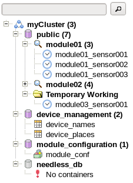
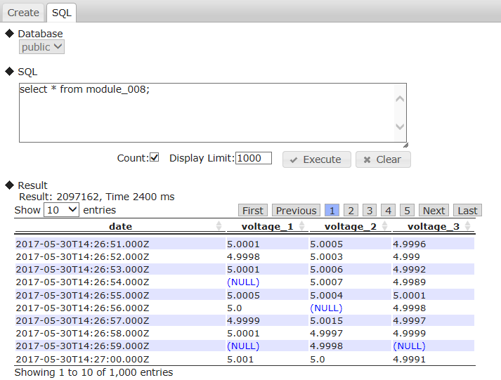
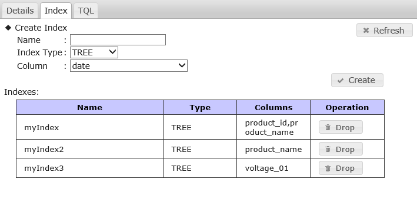
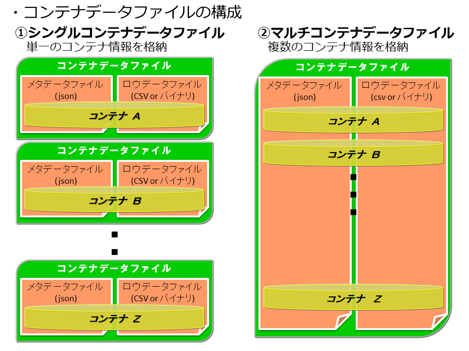

## --- はじめに ---

## 本書の目的と構成

本書はGridDBの提供する運用ツールについて説明したものです。

本書は、GridDBを用いたシステム構築を行う設計者、GridDBの運用管理を行う管理者の方を対象としています。

各章は次の内容です。

* サービス  
  OS起動時に自動的に実行されるGridDBのサービスについて説明します。

* 運用コマンド  
  GridDBの各種運用コマンドについて説明します。

* クラスタ運用管理コマンド・インタプリタ(gs_sh)  
  GridDBクラスタの運用管理機能、およびデータ操作を提供するコマンドインタプリタ(gs_sh)について説明します。

* 統合運用管理GUI(gs_admin)  
  GridDBクラスタの運用機能を統合した、Webベースの統合運用管理GUI(gs_admin)について説明します。

* エクスポート/インポートツール  
  GridDBのデータのエクスポート/インポートを行うツールについて説明します。


<a id="griddb_service"></a>
## --- サービス ---

<a id="preparing_to_use_the_service"></a>
## サービスを利用するには

サービスのインストールと設定の手順は、以下のとおりです。

1.  GridDBサーバパッケージ、クライアントパッケージのインストール
2.  クラスタを構成するすべてのノードの設定
3.  起動設定ファイルの設定

GridDBのインストール、ノードを設定する手順に関しては、『[GridDB データベース管理者ガイド](../4.md_administrators_guide/md_administrators_guide.md)』を参照してください。

サービスで用いるファイルの種類です。

| 種類               | 意味                                          |
|--------------------|----------------------------------------------|
| systemd ユニットファイル | systemdのユニット定義ファイル。GridDBのサーバパッケージにより、/usr/lib/systemd/system/gridstore.service にインストールされ、GridDBサービスとしてシステムに登録される。 |
| サービススクリプト | OS起動時に自動的に実行されるスクリプトファイル。<br>GridDBのサーバパッケージにより、/usr/griddb/bin/gridstoreにインストールされる。 |
| PIDファイル        | gsserverプロセスのプロセスID(PID)のみを記載したファイル。gsserverプロセス起動時に、$GS_HOME/conf/gridstore.pidに作成される。     |
| 起動設定ファイル   | サービスの中で設定可能な変数を記載するファイル。<br>GridDBのサーバパッケージにより、/etc/sysconfig/gridstore/gridstore.confにインストールされる。 |


## パラメータ設定

GridDBのサービスの動作を制御するパラメータを用意しています。パラメータの一覧は以下のとおりです。

| パラメータ    | デフォルト                           | 説明                           |
|--------------|-------------------------------------|--------------------------------|
| GS_USER      | admin                               | GridDBのユーザ名               |
| GS_PASSWORD  | admin                               | `GS_USER` のパスワード         |
| CLUSTER_NAME | INPUT_YOUR_CLUSTER_NAME_HERE        | 参加するクラスタ名              |
| MIN_NODE_NUM  | 1                                  | 参加するクラスタの構成ノード数   |

パラメータを変更するには起動設定ファイル( `/etc/sysconfig/gridstore/gridstore.conf` )を編集します。

サーバパッケージのアップデートインストールやアンインストールのとき、起動設定ファイルは上書き・アンインストールされません。

【注意】
-   サービススクリプトに記載されているパラメータは直接編集しないでください。アンインストールやアップデートインストールの際に編集したファイルは失われます。 パラメータを変更するときは、起動設定ファイルを編集してください。
-   複数ノードでクラスタを構成する場合、参加する各ノードの起動設定ファイルはすべて同じ設定にしてください。 特に、システム稼働中に運用管理コマンド、コマンド・インタプリタなどでクラスタを拡張した場合、すべてのノードの `MIN_NODE_NUM` を拡張後のクラスタ構成ノード数に変更する必要があります。

## ログ

サービスのログに関しては、ブートログ( `/var/log/boot.log` )や運用コマンドのログ( `$GS_HOME/log` )を参照してください。


## コマンド

GridDBのサービスのコマンドを以下に説明します。

【注意】
-   GridDBクラスタで、SSL接続有効かつ非SSL接続が不可に設定されている場合(/system/serverSslModeがREQUIRED)、環境変数`GS_SSL_MODE`を設定して、運用コマンド用通信のSSL接続を有効にする必要があります。SSL接続の詳細は『[GridDB 機能リファレンス](../3.md_reference_feature/md_reference_feature.md)』を参照してください。
    - 環境変数`GS_SSL_MODE`にREQUIREDを指定すると、運用コマンド用通信のSSL接続を有効にします。VERIFYを指定すると、運用コマンド用通信のSSL接続を有効、かつサーバ証明書検証を実施します。
    - サーバ証明書検証を有効にする(環境変数`GS_SSL_MODE`にVERIFYを指定する)場合、環境変数`SSL_CERT_FILE`に、信頼する認証局の証明書のパスを指定してください。
    - 環境変数は、OSユーザgsadmの.bash_profileファイルに設定してください。

``` example
vi .bash_profile
GS_SSL_MODE=VERIFY
export GS_SSL_MODE
SSL_CERT_FILE=$GS_HOME/security/ca.crt
export SSL_CERT_FILE
```

### start

動作：

-   ノードを起動し、クラスタへ参加します。

``` example
$ sudo systemctl start gridstore
```

-   ノードの起動はgs_startnodeコマンド、クラスタへの参加はgs_joinclusterコマンドをそれぞれ用います。
-   gs_startnodeコマンド実行時、リカバリ処理の終了を待合せます。
-   gs_joinclusterコマンド実行時、クラスタ稼働まで待合せません。
-   `CLUSTER_NAME` にクラスタ名を設定します。
-   `MIN_NODE_NUM` にクラスタを構成するノード台数を設定します。

【注意】
-   クラスタを稼働する途中にエラーが発生した場合は、プロセスの終了処理が行われます。

### stop

動作：

-   クラスタから離脱してからノードを停止します。

``` example
$ sudo systemctl stop gridstore
```

-   プロセスが無くなれば完了、タイムアウト時間が経過すればエラーとします(終了コード150)。
-   サービスで起動したプロセスが無ければ、終了コード0とします。
-   クラスタからの離脱はgs_leaveclusterコマンドを用います。
-   ノードの停止前にgs_leaveclusterコマンドを実行します。
-   gs_leaveclusterコマンド実行時、クラスタ離脱を待ち合わせます。
-   gs_leaveclusterの終了コードにかかわらず、ノード停止処理を行います。

【注意】
-   **クラスタ全体を停止する時は、必ずgs_stopclusterコマンドを実行してから、サービスのstopで各ノードを離脱・停止してください。** gs_stopclusterコマンドでクラスタを停止しなかった場合、ノードの離脱のたびにデータ再配置が行われる可能性があります。データ再配置が頻繁に発生すると、ネットワークやディスクI/Oに負荷がかかる場合があります。クラスタを停止してからノードを離脱した場合はデータ再配置は行われません。不要なデータ再配置を防ぐために、必ずクラスタを停止してください。クラスタの停止は、運用コマンドgs_stopclusterや、統合運用管理gs_admin、gs_shなどを用いて実行してください。
-   運用コマンドやコマンド・インタプリタ(gs_sh)で起動したノードはサービスのstopで停止することはできません。 それぞれのツールで停止を行ってください。

### status

動作：

-   ノードのプロセスが実行中かどうかを表示します。

``` example
$ sudo systemctl status gridstore
```

### restart

動作：

-   stopとstartを連続で行います。

### condrestart

動作：

-   ロックファイルがあればrestartを行います。


## エラーメッセージ一覧

サービスのエラーメッセージは以下のとおりです。

| コード | メッセージ                   | 意味                                  |
|--------|-----------------------------|--------------------------------------|
| F00003 | Json load error             | 定義ファイルの読込みに失敗しました。     |
| F01001 | Stop service timed out      | ノード停止処理がタイムアウトしました。   |
| F01002 | Startnode error             | ノード起動処理でエラーが発生しました。   |
| F01003 | Startnode timed out         | ノード起動処理がタイムアウトしました。   |
| F01004 | Joincluster error           | クラスタ参加処理でエラーが発生しました。 |
| F01005 | Joincluster timed out       | クラスタ参加処理がタイムアウトしました。 |
| F01006 | Leavecluster error          | クラスタ離脱処理でエラーが発生しました。 |
| F02001 | Command execution error     | コマンド実行でエラーが発生しました。     |
| F02002 | Command execution timed out | コマンド実行がタイムアウトしました。     |

【メモ】
-   各コマンド実行でエラーが発生した場合、運用コマンドのエラーが合わせて表示・記録されます。 エラーへの対応の際は、運用コマンドの項(gs_startnode、gs_joincluster、gs_leavecluster)も合わせて参照してください。

<a id="griddb_commands"></a>
## --- 運用コマンド ---

## コマンド一覧

GridDBでは、以下のコマンドを提供します。

| 種類                         | 機能                             | コマンド           | 格納RPMパッケージ |
|------------------------------|----------------------------------|-------------------|-------------------|
| (1) ノードの起動／停止         | ノードの起動                     | gs_startnode       | server            |
|                              | ノードの停止                     | gs_stopnode        | client            |
| (2) ユーザ管理                | 管理ユーザの登録                 | gs_adduser         | server            |
|                              | 管理ユーザの削除                 | gs_deluser         | server            |
|                              | 管理ユーザのパスワードの変更      | gs_passwd          | server            |
| (3) クラスタ管理              | クラスタ構成への参加              | gs_joincluster     | client            |
|                              | クラスタ構成からの離脱            | gs_leavecluster    | client            |
|                              | クラスタの全停止                 | gs_stopcluster     | client            |
|                              | クラスタ構成情報取得             | gs_config          | client            |
|                              | クラスタ情報取得                 | gs_stat            | client            |
|                              | クラスタへのノード増設           | gs_appendcluster   | client            |
|                              | クラスタの手動フェイルオーバー    | gs_failovercluster | client            |
|                              | パーティション情報取得            | gs_partition       | client            |
|                              | クラスタ構成ノード数の拡張        | gs_increasecluster | client            |
|                              | クラスタの自律的データ配置の設定  | gs_loadbalance     | client            |
|                              | クラスタのデータ配置目標の設定    | gs_goalconf        | client            |
|                              | チェックポイント処理の制御        | gs_checkpoint      | server            |
| (4) ログ情報                 | ログの表示                       | gs_logs            | client            |
|                              | イベントログ出力レベルの表示と変更 | gs_logconf         | client            |
| (5) バックアップ／リストア     | バックアップの実行               | gs_backup          | server            |
|                              | バックアップデータの確認          | gs_backuplist      | server            |
|                              | バックアップデータのリストア      | gs_restore         | server            |
| (6) インポート／エクスポート   | インポート                       | gs_import          | client            |
|                              | エクスポート                     | gs_export          | client            |
| (7) 保守                     | パラメータ表示と変更              | gs_paramconf       | client            |
|                              | 認証用ユーザキャッシュの管理       | gs_authcache      | client            |

【メモ】
-   運用コマンドは、管理ユーザのみが実行可能です。
-   インポート/エクスポートについては、「インポート/エクスポート」の章を参照してください。

　

## GridDBコマンド共通

**【コマンドオプション】**

以下のオプションは、すべてのコマンドで共通して使えるオプションです。

| オプション | 説明                                   |
|------------|----------------------------------------|
| -h｜--help | コマンドのヘルプを表示します。         |
| --version  | 運用コマンドのバージョンを表示します。 |

【例】
- コマンドのヘルプおよびバージョンを表示します。

  ``` example
  $ gs_startnode -h
  Usage: gs_startnode [-u USER/PASS [-w [WAIT_TIME]] ]

  Start the GridDB node.

  $ gs_stat --version
  gs_stat [V5.0.00]
  ```


以下のオプションは、一部のコマンドで共通して使えるオプションです。

| オプション                              | 説明                                                            |
|-----------------------------------------|-----------------------------------------------------------------|
| -s サーバ\[:ポート番号\]｜-p ポート番号 | 操作したいノードのサーバ名(アドレス)とポート番号<br>(運用コマンドの接続ポート番号)を指定します。<br>デフォルトは、"localhost(127.0.0.1):10040"です。                |
| -u ユーザ名/パスワード                  | 認証ユーザとパスワードを指定します。                            |
| -w｜--wait \[秒数\]                     | 処理完了の待合わせを行います。<br>秒数指定が無い場合または秒数が0の場合は時間制限無しとなります。 |
| -a｜--address-type アドレス種別         | 表示するアドレス、ポートのサービス種別を指定します<br>system : 運用コマンドの接続アドレス<br>cluster : クラスタ管理のために使用する受信アドレス<br>transaction : トランザクション処理の受付アドレス<br>sync : 同期処理のために使用する受信アドレス                   |
| --no-proxy                              | プロキシを使わずに接続します。                                  |
| --ssl｜--ssl-verify    | --sslを指定した場合、運用コマンド用通信のSSL接続を有効にします。--ssl-verifyを指定を指定した場合、サーバ証明書検証も併せて実施します。  |

【メモ】
-   運用コマンドの実行時に指定する認証ユーザは、管理ユーザを指定してください。
-   --ssl｜--ssl-verifyオプションの代替として、環境変数`GS_SSL_MODE`が利用できます。環境変数`GS_SSL_MODE`にREQUIREDを指定すると、運用コマンド用のSSL通信接続を有効にします。VERIFYを指定すると、運用コマンド用通信のSSL接続を有効に、かつサーバ証明書検証を実施します。

【注意】
-   --ssl｜--ssl-verifyオプションもしくは環境変数`GS_SSL_MODE`を設定して、運用コマンド用通信でSSL接続するには、以下が必要です。
    - GridDBクラスタでSSL接続を有効にしてください。詳細は、『[GridDB 機能リファレンス](../3.md_reference_feature/md_reference_feature.md)』を参照してください。
    - サーバ証明書検証を有効にする(--ssl-verifyオプションの利用、もしくは環境変数`GS_SSL_MODE`にVERIFYを指定する）場合、環境変数`SSL_CERT_FILE`に、信頼する認証局の証明書のパスを指定してください。
- 環境変数は、OSユーザgsadmの.bash_profileファイルに設定してください。
``` example
vi .bash_profile
GS_SSL_MODE=VERIFY
export GS_SSL_MODE
SSL_CERT_FILE=$GS_HOME/security/ca.crt
export SSL_CERT_FILE
```

**【終了ステータス】**

以下は、コマンドの終了ステータスです。
-   0:正常
-   1:エラー
-   2:タイムアウト

**【ログファイル】**

コマンドのログファイルは、${GS_LOG}/コマンド名.logに保存されます。

【例】 GS_LOGの値が"/var/lib/gridstore/log(デフォルト)"の場合、"gs_startnode"コマンドを実行すると以下のログファイルが作成されます。

-   /var/lib/gridstore/log/gs_startnode.log

利用上の注意
--------------

**【運用コマンドを利用する前に】**

- プロキシ変数(http_proxy)が設定されている場合、--no-proxyオプションを指定するか、GridDBノードのアドレス(群)を、no_proxyで設定し、proxyから除外してください。
  運用コマンドはREST/http通信を行うため、誤ってproxyサーバ側に接続されてしまい、運用コマンドが動作しません。

  ``` example
  $ export http_proxy=proxy.example.net:8080
  $ gs_paramconf -u admin/admin --show storeMemoryLimit
  A00110: Check the network setting. (HTTP Error 403: Forbidden)

  $ gs_paramconf -u admin/admin --show storeMemoryLimit --no-proxy
  "1024MB"
  ```

- 「サーバ:ポート」のオプション指定があるコマンドの場合、ポート設定をデフォルトから変更していなければ、このオプションを指定する必要はありません。
  また、「サーバ:ポート」のオプションを指定すれば、ノードを起動した計算機とは別の計算機上からこのコマンドを実行できます。
- 運用コマンドで利用するサーバ:ポートの指定には、ノード定義ファイルgs_node.jsonの/system/serviceAddressの値をサーバに /system/servicePortの値をポートに指定します。

**【クラスタを構成するには】**

クラスタは、1台以上のノードから成り、1台のマスタとその他のフォロワと呼ばれるノードの集合から構成されます。

クラスタ構成では、有効ノード数と構成ノード数が重要になります。有効ノード数は、クラスタを構成している実際のノード数です。構成ノード数は、クラスタに参加できるノード数で、gs_joinclusterコマンドで指定します。

有効ノード数と構成ノード数はマスタノードに対してgs_statコマンドを実行することで確認でき、それぞれ/cluster/activeCountと/cluster/designatedCountの値となります。

参考までに、以下にクラスタ構成を作成/変更するための主な手順を示します。 各コマンドの詳細については以降の節を参照してください。

- クラスタを構成する場合  
  - 1)　クラスタに参加する全てのノードを起動します(gs_startnode コマンド実行)。
  - 2)　全てのノードに対して、構成ノード数、クラスタ名を指定してクラスタに参加させます(gs_joincluster コマンド実行)。
  - 3)　1)、2)が全て完了した時点でマスタノードが決定され、サービスが開始されます。
  - 4)　クラスタ構成の状態を確認します(gs_config コマンド実行)。

- あるノードを停止させる場合  
  - 1)　停止するノードをクラスタ構成から離脱させます(gs_leavecluster コマンド実行)。
  - 2)　ノードを停止させます(gs_stopnode コマンド実行)。

- クラスタを停止する場合  
  - 1)　クラスタを停止し、すべてのノードをクラスタ構成から離脱させます(gs_stopcluster コマンド実行)。
  - 2)　クラスタのみでなく各ノードも停止する場合は、各ノードを停止させます(gs_stopnode コマンド実行)。

- 停止したクラスタを再起動させる場合  
  - 1)　ノードが停止している場合は、停止しているノードを起動します(gs_startnode コマンド実行)。
  - 2)　クラスタを構成していたすべてのノードをクラスタに参加させます(gs_joincluster コマンド実行)。
  - 3)　クラスタ構成の状態を確認します(gs_config コマンド実行)。

- 稼働中のクラスタに、無停止でノードを増設する場合  
  - 1)　増設するノードに対して、参加させるクラスタを指定してクラスタへの増設を行います(gs_appendclusterコマンド実行)。
  - 2)　クラスタ構成の状態を確認します(gs_config コマンド実行)。

- クラスタからノードを離脱させる場合  
  - 1)　クラスタから離脱させるノードに対して、クラスタの離脱を行います(gs_leaveclusterコマンド実行)。
  - 2)　クラスタ構成の状態を確認します(gs_config コマンド実行)。


ノードの起動/停止
-----------------

### ノードの起動

ノードを実行するマシン上でGridDBノード起動コマンドを実行します。このコマンドはGridDBノード毎に実行する必要があります。

- コマンド

  | コマンド     | オプション/引数 |
  |--------------|------------------------------------------------|
  | gs_startnode | \[-w｜--wait \[秒数\] -u ユーザ名/パスワード\]<br>\[--releaseUnusedFileBlocks\] <br>\[--ssl｜--ssl-verify\] |

- オプション

  | オプション                | 説明                                           |
  |---------------------------|------------------------------------------------|
  | --releaseUnusedFileBlocks | データベースファイルの未使用領域を解放します。 |

【メモ】
- -uオプションでユーザ名/パスワードを指定してください。省略する場合は[起動設定ファイル](#preparing_to_use_the_service)を設定してください。
  - ユーザ名/パスワードに誤りがある場合は、認証エラーとなります。
- -wオプションで起動完了を待ち合わせることで、gs_joinclusterを続けて正常に行うことができます。
  - 起動完了とは、データベースのリカバリ処理完了を意味します。
- --releaseUnusedFileBlocksオプションについては、『[GridDB 機能リファレンス](../3.md_reference_feature/md_reference_feature.md)』を参照してください。

　

### ノードの停止

GridDBノードを停止します。ノードを停止するためには、まず、GridDBクラスタ管理処理を停止させる必要があります。

- コマンド

  | コマンド     | オプション/引数 |
  |-----------------------|-----------------------------------------------|
  | gs_stopnode | \[-f｜--force\]<br>\[-k｜--kill\]<br>\[-w｜--wait \[秒数\]\]<br>\[-s サーバ\[:ポート番号\] ｜ -p ポート番号\] <br>-u ユーザ名/パスワード  <br>\[--ssl｜--ssl-verify\] |

- オプション

  | オプション  | 説明                                                   |
  |-------------|--------------------------------------------------------|
  | -f｜--force | 強制的にノードを停止します。                           |
  | -k｜--kill  | ローカルマシンのノードのプロセスを強制的に停止します。 |


【メモ】
- 特定のノードを停止する場合、そのノードがクラスタ構成に参加しているとノードの停止を行えません。ノードをクラスタ構成から離脱(gs_leavecluster)させてから、ノードの停止を行ってください。
- すべてのノードを停止する場合、GridDBクラスタ管理処理を停止(gs_stopcluster)した後、順次、ノードを停止してください。
- ノードの停止を始めると、チェックポイント処理のため、実際にプロセスが終了するまでに時間を要することがあります。停止するまでしばらくお待ちください。
- --forceオプションや--killオプションを指定すると強制的にノードを停止できますが、データをロストする恐れがあります。
- --killオプションによりリモートマシンのノードのプロセスを停止することはできません。

　

ユーザ管理
----------

GridDBの管理ユーザの登録／削除／パスワード変更を行います。

インストール直後、下記のデフォルトユーザが存在します。

- デフォルトユーザ

  | ユーザ | パスワード | 用途                                             |
  |--------|------------|--------------------------------------------------|
  | admin  | admin      | 運用管理ユーザです。運用コマンドの実行用です。   |
  | system | manager    | アプリケーションユーザです。クライアント操作用です。 |

【注意】
- GridDBの利用ユーザはOSのユーザとは異なります。
- クライアントで認証に用いるため、クラスタを構成する全ノードで同一のユーザ情報が登録されている必要があります。 ユーザ定義ファイルをコピーするなどして、全ノードで同一のユーザ情報が参照されるようにしてください。 デフォルトは以下のファイルです。
  - `/var/lib/gridstore/conf/password`
- ユーザ登録／削除／パスワード変更を行った場合は、変更を行ったユーザ定義ファイルを全ノードに配布し、クラスタを停止してノードの再起動、クラスタの再構成を行ってください。

　

### 管理ユーザの登録

- コマンド

  | コマンド     | オプション/引数 |
  |----------------------|-------------------------------|
  | gs_adduser | ユーザ名<br>\[-p｜--password パスワード\] |

- オプション

  | オプション                 | 説明                         |
  |----------------------------|-----------------------------|
  | ユーザ名                   | 作成する管理ユーザ名を指定します。先頭が"gs\#"で始まる名前を指定します。"gs\#"以降には1文字以上のASCII英数字、"\_"(アンダースコア)のみ使用可能です。 |
  | -p｜--password　パスワード | ユーザのパスワードを指定します。省略時は対話的にパスワードを入力するためのプロンプトが表示されます。    |

【メモ】
- OSユーザgsadmで実行してください。
- パスワードは登録の際に暗号化されます。
- 管理ユーザの登録を行った場合は、コマンド実行したノードのユーザ定義ファイルを全ノードに配布し、クラスタを停止してノードの再起動、クラスタの再構成を行ってください。
- 「admin」、「system」のみ、削除しても再登録が可能です。

【例】
- 管理ユーザ(「ユーザ名(gs\#someone)」、「パスワード(opensesame)」)をユーザ定義ファイルに追加します。

  ``` example
  $ gs_adduser -p opensesame gs#someone
  $ gs_stopcluster -u admin/admin
  全てのノードで以下を実施
  $ gs_stopnode -u admin/admin
  $ cp [ユーザを追加したユーザ定義ファイル] /var/lib/gridstore/conf/password
  $ gs_startnode
  $ gs_joincluster -c clsA  -n XX -u admin/admin
  ```

　

### 管理ユーザの削除

- コマンド

  | コマンド     | オプション/引数 |
  |----------------------|----------|
  | gs_deluser | ユーザ名 |

【メモ】
- OSユーザgsadmで実行してください。
- 管理ユーザの削除を行った場合は、コマンド実行したノードのユーザ定義ファイルを全ノードに配布し、クラスタを停止してノードの再起動、クラスタの再構成を行ってください。

【例】
- 指定した管理ユーザ(gs\#someone)を削除します。

  ``` example
  $ gs_deluser gs#someone
  $ gs_stopcluster -u admin/admin　　
  全てのノードで以下を実施
  $ gs_stopnode -u admin/admin
  $ cp [ユーザを削除したユーザ定義ファイル] /var/lib/gridstore/conf/password
  $ gs_startnode
  $ gs_joincluster -c clsA  -n XX -u admin/admin
  ```

　

### パスワード変更

- コマンド

  | コマンド     | オプション/引数 |
  |---------------------|--------------------------------|
  | gs_passwd | ユーザ名 <br>\[-p｜--password　パスワード\] |

- オプション

  | オプション                | 説明                                                                                                     |
  |---------------------------|----------------------------------------------------------------------------------------------------------|
  | ユーザ名                  | パスワードを変更する管理ユーザ名を指定します。                                                           |
  | -p｜--password パスワード | 管理ユーザのパスワードを指定します。省略時は対話的にパスワードを入力するためのプロンプトが表示されます。 |

【メモ】
- OSユーザgsadmで実行してください。
- パスワードは登録の際に暗号化されます。
- 管理ユーザのパスワード変更を行った場合は、コマンド実行したノードのユーザ定義ファイルを全ノードに配布し、クラスタを停止してノードの再起動、クラスタの再構成を行ってください。

【例】
- 指定した管理ユーザ(「ユーザ名(gs\#someone)」)のパスワードを(foobarxyzに)変更します。

  ``` example
  $ gs_passwd -p foobarxyz gs#someone
  $ gs_stopcluster -u admin/admin　　
  全てのノードで以下を実施
  $ gs_stopnode -u admin/admin
  $ cp [変更したユーザ定義ファイル] /var/lib/gridstore/conf/password
  $ gs_startnode
  $ gs_joincluster -c clsA  -n XX -u admin/admin
  ```


## クラスタ管理

### クラスタ構成への参加

GridDBクラスタにノードを参加させてクラスタを構成します。

- コマンド

  | コマンド     | オプション/引数 |
  |--------------------------|----------------------------------------------|
  | gs_joincluster | \[-c｜--clusterName クラスタ名\]<br>\[-n｜--nodeNum 構成ノード数\]<br>\[-w｜--wait \[秒数\]\] <br>\[-s サーバ\[:ポート番号\]｜ -p ポート番号\]<br>-u ユーザ名/パスワード <br>\[--ssl｜--ssl-verify\]|

- オプション

  | オプション                   | 説明                                                                              |
  |------------------------------|-----------------------------------------------------------------------------------|
  | -c｜--clusterName クラスタ名 | クラスタ名を指定します。デフォルトは、"defaultCluster"です。                      |
  | -n｜--nodeNum 構成ノード数   | 構成するクラスタのノード数を指定します。デフォルトは、1(シングルノード構成)です。 |

【メモ】
- **クラスタ名はデフォルト以外の名前を指定することを推奨します。**
- クラスタ定義ファイルのクラスタ名( `/cluster/clusterName` )が設定されている場合、指定したクラスタ名が設定した値と一致しないとエラーとなります。
- 安定状態のクラスタに新たにノードを参加させる場合は、クラスタへのノード増設コマンド(gs_appendcluster)を実行してください。
- ノードへの参加をある特定のマシンから行ってクラスタを構成する際、構成完了の待合わせを行う場合は、最後に参加させるノードに-wオプションを指定してください。
- 大規模な拡張を行いたい場合は、一旦クラスタを停止させた後で、構成ノード数に拡張後のノード数を指定してクラスタを再構成してください。

【例】ノードA～C 3台でクラスタ名「example_three_nodes_cluster」のクラスタを構成する。
- クラスタを構成する各ノードで、ノードの起動およびノードへの参加を行います。

  ``` example
  ノードAで実行
  $ gs_startnode
  $ gs_joincluster -c example_three_nodes_cluster -n 3 -u admin/admin -w
  ノードBで実行
  $ gs_startnode
  $ gs_joincluster -c example_three_nodes_cluster -n 3 -u admin/admin -w
  ノードCで実行
  $ gs_startnode
  $ gs_joincluster -c example_three_nodes_cluster -n 3 -u admin/admin -w
  ```

- ノードの起動は各ノードから行い、ノードへの参加はある特定のノードから行います。

  ``` example
  ノードA～Cそれぞれで実行
  $ gs_startnode
  ノードAで実行
  $ gs_joincluster -c example_three_nodes_cluster -n 3 -s ノードBのサーバアドレス -u admin/admin
  $ gs_joincluster -c example_three_nodes_cluster -n 3 -s ノードCのサーバアドレス -u admin/admin
  $ gs_joincluster -c example_three_nodes_cluster -n 3 -u admin/admin -w
  ```


### クラスタ構成からの離脱

ノードをクラスタから離脱させます。 　
- コマンド

  | コマンド     | オプション/引数 |
  |---------------------------|----------------------------------------------|
  | gs_leavecluster | \[-f｜--force\]<br>\[-w｜--wait \[秒数\]\]<br>\[-s サーバ\[:ポート番号\]｜ -p ポート番号\] <br>-u ユーザ名/パスワード<br>\[--ssl｜--ssl-verify\] |

- オプション

  | オプション  | 説明                           |
  |-------------|--------------------------------|
  | -f｜--force | 強制的にノードを離脱させます。 |

【メモ】
- シングルノード構成のクラスタのクラスタ停止には、クラスタ停止コマンド(gs_stopcluster)を使用してください。
- データをロストする恐れがある場合、ノードをクラスタから離脱させることはできません。
  - --forceオプションを指定すると強制的にクラスタから離脱させます。 **安全にクラスタを離脱させるためには、一度クラスタを停止してください。**
- ノードを離脱させることで有効ノード数が構成ノード数の過半数に満たなくなる場合、クラスタは停止します。

- **クラスタ全体を停止する時は、ノード1台ずつにgs_leaveclusterを実行するのではなく、クラスタの停止gs_stopclusterコマンドを1回実行してください。**
  gs_stopclusterコマンドでクラスタを停止しなかった場合、ノードの離脱のたびにデータ再配置が行われる可能性があります。
  データ再配置が頻繁に発生すると、ネットワークやディスクI/Oに負荷がかかる場合があります。
  クラスタを停止してからノードを離脱した場合はデータ再配置は行われません。不要なデータ再配置を防ぐために、必ずクラスタを停止してください。
  クラスタの停止は、運用コマンドgs_stopclusterや、統合運用管理gs_admin、gs_shなどを用いて実行してください。

【例】
- 離脱させたいノードでクラスタ離脱コマンドを実行します。

  ``` example
  $ gs_leavecluster -u admin/admin
  ```

　

### クラスタの全停止

クラスタを停止します。 　
- コマンド

  | コマンド     | オプション/引数 |
  |--------------------------|---------------------------------------------|
  | gs_stopcluster | \[-w｜--wait \[秒数\]\]<br>\[-s サーバ\[:ポート番号\]｜-p ポート番号\]<br>-u ユーザ名/パスワード<br>\[--ssl｜--ssl-verify\]  |

【メモ】
- クラスタが完全に停止したことを確認する場合は、クラスタを構成していた全ノードの状態を確認してください。
- 稼働していないクラスタから離脱する場合は、クラスタ離脱コマンド(gs_leavecluster)を使用してください。

【例】
- クラスタ停止コマンドを実行します。

  ``` example
  $ gs_stopcluster -u admin/admin
  ```

　

### クラスタ構成情報取得

クラスタ構成情報(クラスタに参加しているノードの一覧情報)を取得します。 　
- コマンド

  | コマンド     | オプション/引数 |
  |---------------------|----------------------------------------------|
  | gs_config | \[-s サーバ\[:ポート番号\]｜ -p ポート番号\] <br> -u ユーザ名/パスワード <br> \[-a｜--address-type アドレス種別\] <br>\[--ssl｜--ssl-verify\]|

- オプション

  | オプション                      | 説明                                                 |
  |--------------------------------|------------------------------------------------------|
  | -a｜--address-type アドレス種別 | 表示するアドレス、ポートのサービス種別を指定します<br>system : 運用コマンドの接続アドレス<br>cluster : クラスタ管理のために使用する受信アドレス <br>transaction : トランザクション処理の受付アドレス <br>sync : 同期処理のために使用する受信アドレス        |

【メモ】
- "master"(マスタノード)、"follower"(フォロワノード)、"self"(コマンドを実行したノード)のアドレスとポート情報が表示されます。
- "multicast"にはクライアントへのマルチキャスト用アドレスとポート情報が表示されます。
- システム状態(status)は、以下のいずれかになります。
  - INACTIVE : 停止
  - ACTIVATING : 稼働開始
  - ACTIVE : 稼働
  - DEACTIVATING : 停止開始
  - ABNORMAL : 異常停止
  - NORMAL_SHUTDOWN : 通常終了開始

【例】
- クラスタが3台のノードで構成されている場合、マスタからクラスタ構成情報取得を行うと以下のような出力となります。

  ``` example
  $ gs_config -u admin/admin
  {
      "follower": [                       // [array] フォロワ情報
          {
              "address": "192.168.11.10", // 　[string] 運用コマンドの接続アドレス
              "port": 10040               // 　[number] 運用コマンドの接続ポート
          },
          {
             "address": "192.168.11.11",
             "port": 10040
          }
      ],
      "master": {                         // マスタ情報
          "address": "192.168.11.12",     // 　[string] 運用コマンドの接続アドレス
          "port": 10040                   // 　[number] 運用コマンドの接続ポート
      },
      "multicast": {                      // マルチキャスト情報
          "address": "239.0.0.20",        // 　[string] クライアントへのマルチキャスト用アドレス
          "port": 31999                   // 　[number] クライアントへのマルチキャスト用ポート
      },
      "self": {                           // 自ノード情報
          "address": "192.168.11.12",     // 　[string] 運用コマンドの接続アドレス
          "port": 10040,                  // 　[number] 運用コマンドの接続ポート
          "status": "ACTIVE"              // 　[string] システム状態
      }
  }
  ```

　

### クラスタ情報取得

クラスタ情報(クラスタ構成情報および内部情報)、または、バックアップ進捗状況を取得します。

- コマンド

  | コマンド     | オプション/引数 |
  |-------------------|---------------------------------------------|
  | gs_stat | \[-t｜--type タイプ\] <br> \[-a｜--address-type アドレス種別\] <br> \[--csv\] <br> \[-s サーバ\[:ポート番号\]｜-p ポート番号\] <br>-u ユーザ名/パスワード <br>\[--ssl｜--ssl-verify\]   |

- オプション

  | オプション                      | 説明                                                                          |
  |---------------------------------|------------------------------------------------------------------------------|
  | -t｜--type タイプ               | 指定されたタイプの情報を表示します。<br>backup：バックアップ状態を表示             |
  | -a｜--address-type アドレス種別 | 表示するアドレス、ポートのサービス種別を指定します。<br>system : 運用コマンドの接続アドレス<br>cluster : クラスタ管理のために使用する受信アドレス<br>transaction : トランザクション処理の受付アドレス<br>sync : 同期処理のために使用する受信アドレス                   |
  | --csv                           | クラスタ情報をCSV形式で表示します。 |


【メモ】
- クラスタ状態(/cluster/clusterStatus)は、以下のいずれかになります。
  - MASTER　　：　マスタ
  - SUB_MASTER　：　サブマスタ
  - FOLLOWER　：　フォロワ
  - SUB_FOLLOWER　：　サブフォロワ
  - SUB_CLUSTER 　：　クラスタが稼働していない
- システム状態(/cluster/nodeStatus)は、以下のいずれかになります。
  - INACTIVE　：　停止
  - ACTIVATING　：　稼働開始
  - ACTIVE　：　稼働
  - DEACTIVATING　：　停止開始
  - ABNORMAL　：　異常停止
  - NORMAL_SHUTDOWN　：　通常終了開始
- バックアップ状態(/checkpoint/mode)は、実行中もしくは最後に実行されたバックアップの処理名が表示されます。
  - -　：　完了もしくは未稼働
  - NORMAL_CHECKPOINT　：　自動チェックポイント
  - REQUESTED_CHECKPOINT　：　強制チェックポイント
  - BACKUP　　：　フルバックアップ
  - RECOVERY_CHECKPOINT　：　チェックポイント(リカバリ時)
  - SHUTDOWN_CHECKPOINT　：　チェックポイント(シャットダウン時)
  - INCREMENTAL_BACKUP_LEVEL_0: 差分・増分バックアップのベースライン
  - INCREMENTAL_BACKUP_LEVEL_1_CUMULATIVE : 差分バックアップ
  - INCREMENTAL_BACKUP_LEVEL_1_DIFFERENTIAL : 増分バックアップ

【例】
- 稼働しているクラスタに参加しているノードでクラスタ情報取得を行うと以下のような出力となります。

  ``` example
  $ gs_stat -u admin/admin
  {
  　　　　　　　　：
  　　　　　　　　：
      "cluster": {
          "activeCount": 1,
          "clusterName": "defaultCluster",
          "clusterStatus": "MASTER",
          "designatedCount": 1,
          "loadBalancer": "ACTIVE",
          "master": {
              "address": "192.168.10.11",
              "port": 10010
          },
          "nodeList": [
              {
                  "address": "192.168.10.11",
                  "port": 10010
              }
          ],
          "nodeStatus": "ACTIVE",
          "partitionStatus": "NORMAL",
          "startupTime": "2014-08-29T09:56:20+0900",
          "syncCount": 3
      },
  　　　　　　　　：
  　　　　　　　　：
  }
  ```

　

### クラスタへのノード増設

稼働中のクラスタに新たにノードを増設します(追加します)。 　
- コマンド

  | コマンド     | オプション/引数 |
  |----------------------------|-----------------------------------------------|
  | gs_appendcluster | --cluster サーバ:ポート番号 <br> \[-w｜--wait \[秒数\]\] <br> \[-s サーバ\[:ポート番号\] ｜ -p ポート番号\] <br> -u ユーザ名/パスワード <br>\[--ssl｜--ssl-verify\]  |

- オプション

  | オプション                  | 説明                                                                                 |
  |-----------------------------|--------------------------------------------------------------------------------------|
  | --cluster サーバ:ポート番号 | 増設対象のクラスタに参加しているノードのサーバ名(アドレス)とポート番号を指定します。 |

【メモ】
- クラスタが稼働中で、安定状態(有効ノード数=構成ノード数)のときのみ動作します。
- 大規模な拡張を行いたい場合は、一旦クラスタを停止させた後で、構成ノード数に拡張後のノード数を指定してクラスタを再構成してください。
- 稼働中のシングルノード構成のクラスタを拡張する場合、一旦クラスタを停止させた後で、クラスタの再構成を行ってください。

【例】
- 稼働中のクラスタに新たにノードを追加します。

  ``` example
  追加対象のクラスタの状態を確認
  $ gs_stat -s 192.168.33.29:10040  -u admin/admin
  {
          :
      "cluster":{                                 //クラスタ関連
          "activeCount":5,                        //有効ノード数
          "clusterName":"function_1",             //クラスタ名
          "clusterStatus":"MASTER",               //クラスタ状態
          "designatedCount":5,                    //構成ノード数
          :
  }
  構成ノード=有効ノード数であることを確認
  構成ノード数>有効ノード数の場合、gs_joincluster(クラスタ構成への参加)を実行

  追加したいノードを起動し、稼働中のクラスタに参加しているノードのサーバアドレスおよびポート番号を指定
  $ gs_startnode
  $ gs_appendcluster --cluster 192.168.33.29:10040 -u admin/admin

  クラスタに追加できているか、クラスタの状態を確認
  $ gs_stat  -u admin/admin
  {
          :
      "cluster":{                                 //クラスタ関連
          "activeCount":6,                        //有効ノード数
          "clusterName":"function_1",             //クラスタ名
          "clusterStatus":"MASTER",               //クラスタ状態
          "designatedCount":6,                    //構成ノード数
          :
  }
  ```

　

### クラスタの手動フェイルオーバー

GridDBクラスタのフェイルオーバーを実行します。

- コマンド

  | コマンド     | オプション/引数 |
  |------------------------------|-----------------------------------------------|
  | gs_failovercluster | \[--repair\] <br> \[-s サーバ\[:ポート番号\] ｜ -p ポート番号\] <br>-u ユーザ名/パスワード <br>\[--ssl｜--ssl-verify\]  |

- オプション

  | オプション | 説明                                                         |
  |------------|--------------------------------------------------------------|
  | --repair   | データロストを許容して強制的にフェイルオーバーを実行します。 |

【メモ】
- クラスタが稼働中のときのみ実行可能です。
- 基本的にはクラスタアルゴリズムの通常処理として実行されるので、以下の場合に有効です。
  - ユーザがクラスタ異常を検知し、即時フェイルオーバーを実行する。
  - バックアップデータからのデータリカバリ終了後、クラスタが保持するパーティションのLSNが最終更新LSNより若い番号でも、データベースリカバリ完了とみなしてシステムを起動する。(データロストを許容する。)

【例】
- クラスタのフェイルオーバーを実行します。

  ``` example
  $ gs_failovercluster -u admin/admin
  ```

　

### パーティション情報取得

GridDBノードのパーティション情報を表示します。

- コマンド

  | コマンド     | オプション/引数 |
  |------------------------|-----------------------------------------------|
  | gs_partition | \[-n｜--partitionId パーティションID\] <br> \[--loss\] <br> \[-a｜--address-type アドレス種別\]  <br> \[-s サーバ\[:ポート番号\] ｜ -p ポート番号\] <br> -u ユーザ名/パスワード <br>\[--ssl｜--ssl-verify\] |

- オプション

  | オプション                         | 説明                                                                   |
  |------------------------------------|------------------------------------------------------------------------|
  | -n｜--partitionId パーティションID | 情報を表示するパーティションIDを指定します。(省略時は全ての情報を表示) |
  | --loss                             | 欠損パーティションの情報のみ表示します。                               |
  | -a｜--address-type アドレス種別    | 表示するアドレス、ポートのサービス種別を指定します。 <br>system : 運用コマンドの接続アドレス  <br>cluster : クラスタ管理のために使用する受信アドレス  <br>transaction : トランザクション処理の受付アドレス  <br>sync : 同期処理のために使用する受信アドレス                          |

【メモ】
- --lossオプションは、クラスタが稼働中のときのみ利用できます。
- 欠損パーティションとは、レプリカを保有するパーティションを含め、アクセスできないパーティションを示します。

【例】
- 稼働中のクラスタの特定のノードのパーティション情報を取得します。

  ``` example
  $ gs_partition -u admin/admin
  [
      {
          "backup": [],
          "catchup": [],
          "maxLsn": 300008,
          "owner": {
              "address": "192.168.11.10",
              "lsn": 300008,
              "port": 10010
          },
          "pId": "0",
          "status": "ON"
      },
          ：
  ]
  ```

　

### クラスタ構成ノード数の拡張

GridDBクラスタの構成ノード数を拡張します。

- コマンド

  | コマンド     | オプション/引数 |
  |------------------------------|-----------------------------------------------|
  | gs_increasecluster | \[-s サーバ\[:ポート番号\] ｜ -p ポート番号\] <br> -u ユーザ名/パスワード  <br>\[--ssl｜--ssl-verify\] |

【メモ】
- クラスタが稼働中で、安定状態（有効ノード数=構成ノード数）のときのみ動作します。従って、稼動しているクラスタへノードを増設する場合は、1台ずつ増設する必要があります。
- 大規模な拡張を行いたい場合は、一旦クラスタを停止させた後で、初期構成ノード数に拡張後のノード数を指定してクラスタを再構成してください。
- このコマンドによってクラスタが拡張された際に、増設対象のノードがある場合は、そのノードがクラスタに参加します。増設対象のノードが複数ある場合は、いずれかのノードがクラスタに参加します。
- 増設対象のノードがない状態で、このコマンドによってクラスタが拡張された後で増設対象のノードを指定した場合は、そのノードがクラスタに参加します。
- シングルノード構成のクラスタを稼働中に拡張することはできません。一旦クラスタを停止させた後で、クラスタを再構成してください。

【例】
- クラスタ構成ノード数を拡張して、クラスタにノードを増設します。

  ``` example
  ノードを増設したいクラスタの状態を確認
  $ gs_stat -s 192.168.33.29:10040  -u admin/admin
  {
          :
      "cluster":{                                 //クラスタ関連
          "activeCount":5,                        //有効ノード数
          "clusterName":"function_1",             //クラスタ名
          "clusterStatus":"MASTER",               //クラスタ状態
          "designatedCount":5,                    //構成ノード数
          :
  }
  構成ノード=有効ノード数であることを確認

  増設したいノードを起動し、増設後のノード数(6)を指定して、gs_joincluster(クラスタ構成への参加)を実行(増設対象に指定)
  $ gs_startnode -u admin/admin -w
  $ gs_joincluster -u admin/admin -c function_1 -n 6

  ノードを増設したいクラスタに対して、gs_increasecluster(クラスタ構成ノード数の拡張)を実行
  $ gs_increasecluster -s 192.168.33.29:10040 -u admin/admin

  増設対象のノードがクラスタに追加できているか、クラスタの状態を確認
  $ gs_stat  -u admin/admin
  {
          :
      "cluster":{                                 //クラスタ関連
          "activeCount":6,                        //有効ノード数
          "clusterName":"function_1",             //クラスタ名
          "clusterStatus":"MASTER",               //クラスタ状態
          "designatedCount":6,                    //構成ノード数
          :
  }
  ```


<a id="set_up_autonomous_data_redistribution_of_a_cluster"></a>
### クラスタの自律的データ配置の設定

GridDBクラスタの自律的データ配置機能の有効無効の設定および設定の表示を行います。 ローリングアップデートを行う際など、計画的にノードを停止して再びクラスタに戻す場合には、一時的に自律的データ配置機能を無効に設定しておくと、不要なデータ再配置が行われずに負荷を軽減することができます。

- コマンド

  | コマンド     | オプション/引数 |
  |--------------------------|-----------------------------------------------|
  | gs_loadbalance | \[--on｜--off\] \[--cluster\] <br> \[-s サーバ\[:ポート番号\] ｜ -p ポート番号\] <br> -u ユーザ名/パスワード <br>\[--ssl｜--ssl-verify\]|

- オプション

  | オプション  | 説明                                                                 |
  |-------------|----------------------------------------------------------------------|
  | --on｜--off | 自律的データ配置を有効(--on)、無効(--off)に設定します。<br>本オプションを省略した場合は、現在の設定値が表示されます。           |
  | --cluster   | クラスタの全ノードに対して設定を行います。<br> 本オプションを省略した場合は、指定されたノードのみに設定を行います。 |

【メモ】
- 本コマンドで自律的データ配置を無効にした場合は、必ず設定を有効に戻してください。 無効の場合レプリカが更新されないため、ノード障害に対する可用性は低くなります。

【例】

  ``` example
  クラスタを構成する全ノードの自律的データ配置の設定を確認
  $ gs_loadbalance -s 192.168.33.29:10040  -u admin/admin --cluster
  192.168.33.29 ACTIVE
  192.168.33.30 ACTIVE
  192.168.33.31 ACTIVE

  "192.168.33.31"のノードを無効に設定
  $ gs_loadbalance -s 192.168.33.31:10040  -u admin/admin --off

  ```

　

### クラスタのデータ配置目標の設定

GridDBクラスタのデータ配置目標の自動設定の有効無効の設定、および、現在のデータ配置目標の表示や手動設定を行います。
ローリングアップグレードの際に、安全にノードを離脱させるために使用します。

- コマンド

  | コマンド     | オプション/引数 |
  |--------------------------|-----------------------------------------------|
  | gs_goalconf | \[--on｜--off\] \[--cluster\] <br> \[-s サーバ\[:ポート番号\] ｜ -p ポート番号\] <br> -u ユーザ名/パスワード <br>\[--ssl｜--ssl-verify\]|

  | コマンド    | オプション/引数 |
  |--------------------------|-----------------------------------------------|
  | gs_goalconf | --manual \[\[--set JSON_FILE \| --switch PARTITION_ID \| --leaveNode HOST\[:PORT\]\] \[--cluster\]\] <br> \[-s サーバ\[:ポート番号\] ｜ -p ポート番号\] <br> -u ユーザ名/パスワード <br>\[--ssl｜--ssl-verify\]|

- オプション

  | オプション                   | 説明                                                                 |
  |------------------------------|----------------------------------------------------------------------|
  | --on｜--off                  | データ配置目標の自動設定を有効(--on)、無効(--off)に設定します。<br>本オプションを省略した場合は、現在の設定値が表示されます。           |
  | --cluster                    | クラスタの全ノードに対して設定を行います。<br> 本オプションを省略した場合は、指定されたノードのみに設定を行います。 |
  | --manual                     | 現在のデータ配置目標を表示します。配置目標を設定する場合は、set、switchまたはleaveNodeのうち、いずれかのオプションを合わせて指定します。|
  | --set JSON_FILE              | 指定されたJSONファイルを配置目標として設定します。|
  | --switch PARTITION_ID        | 指定されたパーティションIDのオーナとバックアップを入れ替えた配置目標を設定します。|
  | --leaveNode HOST\[:PORT\]    | 指定されたノードのすべてのオーナとバックアップを入れ替えた配置目標を設定します。|

【例】

  ``` example
  クラスタを構成する全ノードのデータ配置目標の自動設定を確認
  $ gs_goalconf -s 192.168.33.29:10040  -u admin/admin --cluster
  192.168.33.29 ACTIVE
  192.168.33.30 ACTIVE
  192.168.33.31 ACTIVE

  "192.168.33.31"のノードを無効に設定
  $ gs_goalconf -s 192.168.33.31:10040  -u admin/admin --off

  クラスタの全ノードに対して、"192.168.33.31"のノードを離脱対象とするための配置目標を設定
  $ gs_goalconf -u admin/admin --manual --leaveNode 192.168.33.31 --cluster
  Switching 43 owners to backup on 192.168.33.31:10040 ...
  Setting goal requests have been sent. Sync operations will be started when loadbalancer is active.
  ```

　

### チェックポイント処理の制御

GridDBの定期チェックポイント機能の有効無効の設定および表示、手動チェックポイント処理の実行を行います。

- コマンド

  | コマンド     | オプション/引数 |
  |-------------------------|-------------------------------------------------------|
  | gs_checkpoint | \[--on｜--off\]｜\[--manual \[-w｜--wait \[秒数\]\]\] <br> \[-s サーバ\[:ポート番号\] ｜ -p ポート番号\] <br> -u ユーザ名/パスワード <br>\[--ssl｜--ssl-verify\] |

- オプション

  | オプション  | 説明                                                        |
  |-------------|-------------------------------------------------------------|
  | --on｜--off | 定期チェックポイントを有効(--on)、無効(--off)に設定します。<br>本オプションを省略した場合は、現在の設定値が表示されます。  |
  | --manual    | 手動チェックポイント処理を実行します。                      |

【メモ】
- 運用上、一時的に定期チェックポイントを無効にした際は、必ず有効に戻してください。定期チェックポイントを無効にしたままにすると、トランザクションログファイルが肥大し、次回のバックアップ処理や再起動時のリカバリ処理の時間が長くなります。

【例】

  ``` example
  定期チェックポイントを無効にします。
  $ gs_checkpoint -u admin/admin --off

  手動チェックポイント処理を実行します。
  $ gs_checkpoint -u admin/admin --manual -w
  ...
  The manual checkpoint has been completed.

  定期チェックポイントを有効にします。
  $ gs_checkpoint -u admin/admin --on
  ```

　

ログ情報
--------

### ログの表示

直近のGridDBのイベントログを取得します。 　

- コマンド

  | コマンド     | オプション/引数 |
  |-------------------|-----------------------------------------------|
  | gs_logs | \[-l｜--lines 取得行数\] <br> \[-g｜--ignore 除外キーワード\]  <br> \[-s サーバ\[:ポート番号\] ｜ -p ポート番号\] <br> \[--tracestats\] \[--slowlogs\] \[--csv\] <br> -u ユーザ名/パスワード <br> \[第一キーワード \[第二キーワード\]\] <br>\[--ssl｜--ssl-verify\] |

- オプション

  | オプション                        | 説明                                 |
  |-----------------------------------|--------------------------------------|
  | -l｜--lines 取得行数              | 取得行数を指定します。               |
  | -g｜--ignore 除外キーワード       | 除外キーワードを含む行を無視します。 |
  | --tracestats                      | イベントログに含まれる性能トレースの情報をJSON形式にして表示します。 |
  | --slowlogs                        | イベントログに含まれるスロークエリの情報をJSON形式にして表示します。 |
  | --csv                             | --tracestatsと共に指定した際、イベントログに含まれる性能トレースの情報をCSV形式にして表示します。<br>--slowlogsと共に指定した際、イベントログに含まれるスロークエリの情報をCSV形式にして表示します。 |
  | 第一キーワード \[第二キーワード\] | キーワードを含む行のみ取得します。   |

【メモ】
- 最新のイベントログファイルの情報のみ表示します。古いイベントログファイルの内容は表示しません。
- イベントログの機能や出力形式は『[GridDB 機能リファレンス](../3.md_reference_feature/md_reference_feature.md)』のイベントログ機能を参照してください。
- スロークエリの情報の詳細に関しては『[GridDB SQLチューニングガイド](../15.md_sql_tuning_guide/md_sql_tuning_guide.md)』を参照してください。

【例】
- チェックポイントが終了したログを3回分取得します。

  ``` example
  $ gs_logs -u admin/admin CP_END -l 3
  2014-08-04T11:02:52.754+0900 NODE1 1143 INFO CHECKPOINT_SERVICE ../server/checkpoint_service.cpp void CheckpointService::runCheckpoint(EventContext&, int32_t, const std::string&) line=866 : [CP_END] mode=NORMAL_CHECKPOINT, backupPath=, commandElapsedMillis=132
  2014-08-04T11:22:54.095+0900 NODE1 1143 INFO CHECKPOINT_SERVICE ../server/checkpoint_service.cpp void CheckpointService::runCheckpoint(EventContext&, int32_t, const std::string&) line=866 : [CP_END] mode=NORMAL_CHECKPOINT, backupPath=, commandElapsedMillis=141
  2014-08-04T11:42:55.433+0900 NODE1 1143 INFO CHECKPOINT_SERVICE ../server/checkpoint_service.cpp void CheckpointService::runCheckpoint(EventContext&, int32_t, const std::string&) line=866 : [CP_END] mode=NORMAL_CHECKPOINT, backupPath=, commandElapsedMillis=138
  ```

　

### イベントログ出力レベル表示と変更

イベントログ出力レベルを表示または変更します。引数指定なしの場合は設定一覧を取得します。 　

- コマンド

  | コマンド     | オプション/引数 |
  |----------------------|---------------------------------------------|
  | gs_logconf | \[-s サーバ\[:ポート番号\]｜-p ポート番号\] <br> -u ユーザ名/パスワード <br> \[カテゴリ名 出力レベル\]  <br>\[--ssl｜--ssl-verify\]|

- オプション

  | オプション              | 説明                                                                     |
  |-------------------------|--------------------------------------------------------------------------|
  | カテゴリ名 　出力レベル | ログ出力レベルを変更したいカテゴリのカテゴリ名と出力レベルを指定します。 |

【メモ】
- イベントログの出力レベルの一覧を表示する場合は、\[カテゴリ　出力レベル\]を省略して実行します。
- 出力されるログ情報は、指定した出力レベルよりも高い出力レベルのログがすべて出力されます。例えば、INFOを設定した場合は、INFO、WARNING、ERRORのログが出力されます。
- 出力レベルの一覧はレベルが高いものから低いものの順に以下のとおりとなります。
  - ERROR : エラー
  - WARNING : 警告
  - INFO : 情報
  - DEBUG : デバッグ
- ノードをシャットダウンした場合、コマンド実行により変更した設定は保存されません。
- ログ出力レベルは雛形のgs_node.jsonに記載されているデフォルトか、それより低いレベルを設定することを推奨しています。
  初期値は『[GridDB 機能リファレンス](../3.md_reference_feature/md_reference_feature.md)』のパラメータ一覧を参照してください。

【例】
- ログの出力レベルを変更し、イベントログの状態を表示します。

  ``` example
  $ gs_logconf -u admin/admin CHUNK_MANAGER INFO
  $ gs_logconf -u admin/admin
  {
      "levels": {
          "CHECKPOINT_SERVICE": "INFO",
          "CHECKPOINT_SERVICE_DETAIL": "ERROR",
          "CHUNK_MANAGER": "INFO",
          "CLUSTER_OPERATION": "INFO",
  　　　　　　：
  　　　　　　：
      }
  }
  ```

　

## バックアップ/リストア

### バックアップ

サービスを継続しながら、GridDBのバックアップをノード単位で取得します。

クラスタを構成する全ノードに対して順次行うことで、サービスを継続しながら、クラスタ全体としてのバックアップが行えます。

- コマンド

  | コマンド     | オプション/引数 |
  |---------------------|--------------------------------------|
  | gs_backup | \[--mode モード \[--skipBaseline\]\] <br> -u ユーザ名/パスワード <br> バックアップ名    <br>\[--ssl｜--ssl-verify\]|

- オプション

  | オプション     | 説明                                                                                                                            |
  |----------------|---------------------------------------------------------------------------------------------------------------------------------|
  | --mode モード  | バックアップモードを指定します。<br>- auto : 自動バックアップ<br>- auto_nostop : 自動バックアップ(エラー時にノード停止無し)<br>- baseline : 差分・増分バックアップのベースラインのフルバックアップを作成<br>- since :ベースライン作成後、更新されたデータブロックをベースラインからの差分バックアップ<br>- incremental：ベースライン作成後、もしくは前回のincremental、sinceバックアップ後に更新されたデータブロックの増分バックアップ。 |
  | --skipBaseline | modeがautoまたはauto_nostopの場合、ベースラインとなるフルバックアップの取得処理を省略します。<br>modeがそれ以外の場合、本オプションは無視されます。   |
  | バックアップ名 | バックアップデータのディレクトリ名を指定します。                                                                                |

＜modeオプション＞

- auto  
  - データ更新のトランザクションログファイルが自動的にバックアップディレクトリにコピーされるため、利用者がバックアップを行う必要はありません。ただし、トランザクションログファイルの採取によるバックアップのため、障害発生時のリカバリに時間がかかる場合があります。定期的に全バックアップを行うことをお勧めします。

- auto_nostop  
  - バックアップ側のトランザクションログ出力でエラーが発生した場合でも、トレースログ出力を行い、二重化出力を停止しますが、ノードを停止しません。auto_nostopを指定していない場合は、システムエラーとしてノードを停止します。

- baseline  
  - バックアップデータのベースラインを作成します。差分バックアップではベースラインからの更新の差分データをバックアップします。

- since  
  - baselineを指定したバックアップ実行後、更新が発生したデータをバックアップします(差分バックアップ)。

- incremental  
  - baselineを指定したバックアップ実行後、もしくは前回のincremental、sinceバックアップ実行後に、更新されたデータブロックをバックアップします(増分バックアップ)。

<figure>

<figcaption>バックアップ</figcaption>
</figure>

【メモ】
- バックアップ名は、英数字12文字までで設定します。
- バックアップの詳細については、『[GridDB 機能リファレンス](../3.md_reference_feature/md_reference_feature.md)』を参照してください。
- バックアップファイルは、ノード定義ファイル(gs_node.json)で指定されたバックアップファイルディレクトリの下に作成されます。バックアップファイルはデータディレクトリとは別の物理ストレージを指定することをお勧めします。
- GridDBのクラスタデータベースを正しい状態にリストアする場合、バックアップとリストアの作業をクラスタ全体で行う必要があります。
- コマンド実行後、制御が戻りますが、データ規模、オンライン処理負荷により、バックアップ完了まで数時間以上かかる場合があります。バックアップの進捗状況は、gs_statコマンドで取得できます。
- クラスタ稼働中にバックアップを実行すると、コンテナを複数作成している場合には、クラスタ全体として不整合な状態でバックアップが作成される可能性があります。必要に応じて、トランザクションサービスを禁止し、静止状態でバックアップを実行するようにしてください。
- GridDBでは、障害が発生した場合、自動的にデータ再配置が行われます。そのため、バックアップ中に障害が発生した場合は、再度、1台目のノードからバックアップを取り直してください。
- 自動ログバックアップに--skipBaselineオプションを指定する場合、GridDBのオンラインバックアップ機能以外の方法でバックアップを取得してください。
  詳細は『[GridDB 機能リファレンス](../3.md_reference_feature/md_reference_feature.md)』を参照してください。

【例】
- 起動中のノードでバックアップを実行します。

  ``` example
  バックアップファイルが保管されるディレクトリ(バックアップディレクトリ)を確認
  $ cat /var/lib/gridstore/conf/gs_node.json         # 設定の確認
  {
      "dataStore":{
          "dbPath":"/var/lib/gridstore/data",
          "transactionLogPath":"/var/lib/gridstore/txnlog",
          "backupPath":"/var/lib/gridstore/backup",  # バックアップディレクトリ
          "storeMemoryLimit":"1024MB",
          "concurrency":4,
          "logWriteMode":1,
          "persistencyMode":"NORMAL"
  　　　　　　：
  　　　　　　：
  }
  バックアップを実行
  $ gs_backup -u admin/admin 20150425        # バックアップの実行

  データ規模や負荷状態により、バックアップ完了まで数時間以上かかる場合があります。
  バックアップの進捗状況を、gs_statコマンドで確認
  $ gs_stat -u admin/admin --type backup        
  BackupStatus: Processing                          # バックアップの実行中
  ```

- gs_statで出力されるバックアップ状態(BackupStatus)は、以下のいずれかになります。
  - Processing : フルバックアップ実行中
  - Processing(Baseline) : 差分・増分バックアップのベースライン作成中（フルバックアップ）
  - Processing(Since) : 差分バックアップ中
  - Processing(Incremental) : 増分バックアップ中
  - \- : 完了もしくは未稼働

- バックアップを実行すると、以下のファイルが作成されます。
  - バックアップディレクトリ( `/var/lib/gridstore/backup` )の下に、BACKUPNAMEに指定したディレクトリが作成されます。 なお、差分・増分バックアップの際は、BACKUPNAME_lv0 （ 差分・増分バックアップのベースラインディレクトリ）、BACKUPNAME_lv1_NNN_MMM（ 差分・増分バックアップの差分（Since）と増分（Incremental)のディレクトリ）が作成されます。
  - 以下のバックアップファイル群が作成されます。
      -  データファイル(m_part_n.dat)
      -  チェックポイントログファイル(m_n.cplog)
      -  トランザクションログファイル(m_n.xlog)
      -  バックアップ情報ファイル(gs_backup_info.json,gs_backup_info_digest.json)
      -  LSN情報ファイル(gs_lsn_info.json)
       ※ (m,nは数値)


### バックアップデータ確認

ノード定義ファイル(gs_node.json)で設定されているバックアップディレクトリにあるバックアップデータの一覧を取得します。 　

- コマンド

  | コマンド     | オプション/引数 |
  |-------------------------|----------------------------------------------------|
  | gs_backuplist | \-u ユーザ名/パスワード  <br> \[--partitionId パーティションID｜バックアップ名\] <br>\[--ssl｜--ssl-verify\]|

- オプション

  | オプション                     | 説明                                              |
  |--------------------------------|---------------------------------------------------|
  | --partitionId パーティションID | 指定したパーティションのLSN情報を一覧表示します。 |
  | バックアップ名                 | バックアップ名を指定します。                      |

【メモ】
- バックアップデータの一覧は、ノードの起動状態に関わらず表示できます。ノードが起動状態で、バックアップ処理中の場合はStatusは"P"と表示されます。
- Statusが"NG"と表示される場合、そのバックアップファイルはファイルが破損している可能性があるため、リストアすることはできません。
- 一覧表示でバックアップ名の先頭に"\*"印があるものは、差分・増分バックアップデータです。
- 差分・増分バックアップのステータスは、常に"-"と表示されます。差分・増分バックアップで採取した複数のバックアップをバックアップ名を指定した詳細情報で確認できます。

【例】
- バックアップデータの一覧を確認したいノードで、バックアップデータの確認を実行します。

  ``` example
  バックアップ名の一覧を表示します。
  $ gs_backuplist -u admin/admin

   BackupName   Status  StartTime                 EndTime
  -------------------------------------------------------------------------
  *201912           --  2019-12-01T05:20:00+09:00 2019-12-01T06:10:55+09:00
  *201911           --  2019-11-01T05:20:00+09:00 2019-11-01T06:10:55+09:00
    :
   20191025NO2      OK  2019-10-25T06:37:10+09:00 2019-10-25T06:38:20+09:00


  個別のバックアップ名を指定し、詳細情報を表示します。
  $ gs_backuplist -u admin/admin 201911

  BackupName : 201911

  BackupData            Status StartTime                 EndTime
  --------------------------------------------------------------------------------
  201911_lv0                OK 2019-11-01T05:20:00+09:00 2019-11-01T06:10:55+09:00
  201911_lv1_000_001        OK 2019-11-02T05:20:00+09:00 2019-11-02T05:20:52+09:00
  201911_lv1_000_002        OK 2019-11-03T05:20:00+09:00 2019-11-03T05:20:25+09:00
  201911_lv1_000_003        OK 2019-11-04T05:20:00+09:00 2019-11-04T05:20:33+09:00
  201911_lv1_000_004        OK 2019-11-05T05:20:00+09:00 2019-11-05T05:21:25+09:00
  201911_lv1_000_005        OK 2019-11-06T05:20:00+09:00 2019-11-06T05:21:05+09:00
  201911_lv1_001_000        OK 2019-11-07T05:20:00+09:00 2019-11-07T05:22:11+09:00
  201911_lv1_001_001        OK 2019-11-08T05:20:00+09:00 2019-11-08T05:20:55+09:00


  パーティションの保持するデータのLSN番号を調べる場合。
  $ gs_backuplist -u admin/admin --partitionId=50
   BackupName    ID   LSN
  ----------------------------------------------------------
  *201912        50   2349
  *201911        50   118
   20190704      50   0
  ```

　

### リストア

GridDBのバックアップファイルをリストアします。

- コマンド

  | コマンド     | オプション/引数 |
  |----------------------|---------------------------------------------|
  | gs_restore | \[--test\] \[--updateLogs\]　バックアップ名 |

- オプション

  | オプション     | 説明                                                                       |
  |----------------|----------------------------------------------------------------------------|
  | --test         | リストアは行わず、リストアで利用するバックアップの情報を取得します。       |
  | --updateLogs   | トランザクションログファイルとバックアップ情報ファイルのみをコピーします。<br>既存のファイルは上書きします。      |
  | バックアップ名 | リストアするバックアップファイルのディレクトリ名を指定します。             |

【メモ】
- リストアする場合は、ノードを停止させる必要があります。
- クラスタ定義ファイルの、パーティション数と処理並列度のパラメータ値には注意してください。バックアップしたノードの設定値とリストアするノードの設定値は同一にしてください。同一でないと正しくノードが起動できません。
- データファイル分割を行う設定となっている場合はノード定義ファイルの分割数のパラメータ値に注意してください。バックアップしたノードの分割数とリストアするノードの分割数は同一にしてください。同一でないとリストアに失敗します。
- バックアップした状態を正しくリストアしたい場合、バックアップ、リストアの作業をクラスタ全体で行う必要があります。
- 仮に、一部ノードをリストアしたとしても、それらノードをバックアップ時点の状態に戻すことはできません。リストア後、データを利用するためには稼働中のクラスタに参加させる必要がありますが、バックアップ後にクラスタでデータ更新されていた場合には、リストアしたデータはクラスタの(更新された)データで更新されてしまいます。　特に、バックアップを作成した時点からクラスタの構成が変化している場合には、リストアの効果がありません。そのノードをクラスタに参加させると自律的にデータを再配置するので、リストアしても高い確率でデータが無効になります。
- バックアップ情報ファイルの情報が欠けている場合、または内容を改変した場合は、GridDBノードはサービスを開始できません。
- リストア途中でシグナル(Ctrl+C)を送信して処理を中断した場合、リストア途中のデータは削除されます。

【例】
- バックアップデータをリストアします。リストアを実行するノードが停止した状態で実行します。

  ``` example
  データベースファイルディレクトリ内のファイルを移動
  データベースファイルディレクトリは、ノード定義ファイル(gs_node.json)で指定
  $ mv ${GS_HOME}/data/* ${GS_HOME}/temp_db          # データファイル、チェックポイントログファイルの移動
  $ mv ${GS_HOME}/txnlog/* ${GS_HOME}/temp_txnlog    # トランザクションログファイルの移動

  リストア前にリストアされるデータの確認
  $ gs_restore --test 20190901

  BackupName : 20190901
  BackupFolder : /var/lib/gridstore/backup

  RestoreData           Status StartTime                 EndTime
  --------------------------------------------------------------------------------
  20190901_lv0              OK 2019-09-01T17:50:00+09:00 2019-09-01T17:52:10+09:00
  20190901_lv1_001_000      OK 2019-09-02T17:50:00+09:00 2019-09-02T17:50:15+09:00


  リストアの実行
  $ gs_restore 20190901                       # リストア
  ```

- この例では、リストアを実行すると、バックアップディレクトリ( `/var/lib/gridstore/backup` )の下にある、20190901_lv0ディレクトリから、バックアップファイル群をデータベースディレクトリ( `/var/lib/gridstore/data`,`/var/lib/gridstore/txnlog`  )にコピー後、同様に20190901_lv1_001_000のデータもコピーします。
- リストア完了後、リストアしたノードを通常の起動と同じ手順で起動し、クラスタへ参加させてください。
- 起動後、リストアで配置されたデータベースファイル(バックアップファイル群)を読み込み、読み込み完了後、GridDBノードはサービスを開始します。


## 保守

### パラメータ表示と変更

ノードのパラメータの表示または変更を行います。

- コマンド

  | コマンド     | オプション/引数 |
  |------------------------|--------------------------------------------------|
  | gs_paramconf | \[-s サーバ\[:ポート番号\]　\| -p ポート番号\] <br> -u ユーザ名/パスワード  <br> --show \[パラメータ名\] \| --set パラメータ名 値 <br>\[--ssl｜--ssl-verify\]|

- オプション

  | オプション              | 説明                                                                                                 |
  |-------------------------|------------------------------------------------------------------------------------------------------|
  | --show \[パラメータ名\] | 指定したパラメータを表示します。パラメータを指定しなかった場合は、全パラメータの一覧が表示されます。 |
  | --set パラメータ名 値   | 指定したパラメータを指定した値に変更します。                                                         |

【メモ】
- パラメータの変更(--set)は、稼働しているノードのパラメータ値を動的に変更します。ノードをシャットダウンした場合、コマンド実行により変更した設定は保存されません。変更内容は永続化されないため、定義ファイルの内容を手動で書き換えてください。
- 指定できるパラメータは、次のとおりです。
  - storeMemoryLimit 　：　ストアメモリの上限
  - traceLimitExecutionTime　：　スロークエリをイベントログに残す実行時間の下限値
  - traceLimitQuerySize　：　スロークエリに残るクエリ文字列のサイズ上限
-   パラメータのデータ型など、詳細は『[GridDB 機能リファレンス](../3.md_reference_feature/md_reference_feature.md)』のパラメータ一覧を参照してください。

【例】
- パラメータ `storeMemoryLimit` を変更して、値を表示します。

  ``` example
  $ gs_paramconf -u admin/admin --set storeMemoryLimit 2048MB
  $ gs_paramconf -u admin/admin --show storeMemoryLimit
  "2048MB"
  ```
- パラメータ `traceLimitExecutionTime` を変更して、値を表示します。

  ``` example
  $ gs_paramconf -u admin/admin --set traceLimitExecutionTime 30s
  $ gs_paramconf -u admin/admin --show traceLimitExecutionTime
  "30s"
  ```

### 認証用ユーザキャッシュの管理

一般ユーザの認証やLDAP認証の高速化のためにキャッシュで保持するユーザ情報の一覧表示と削除を行います。

認証方式の詳細は、『[GridDB 機能リファレンス](../3.md_reference_feature/md_reference_feature.md)』を参照してください。

- コマンド

  | コマンド     | オプション/引数 |
  |--------------|------------------------------------------------|
  | gs_authcache | --show<br>\[-s サーバ\[:ポート番号\]　\| -p ポート番号\] <br> -u ユーザ名/パスワード   <br> \[--db データベース名\] <br> \[--username ユーザ名 \]<br>\[--cluster\] <br>\[--ssl｜--ssl-verify\]|
  | gs_authcache | --clear<br>\[-s サーバ\[:ポート番号\]　\| -p ポート番号\] <br> -u ユーザ名/パスワード  <br>  --db データベース名 \| --username ユーザ名 <br>\[--cluster\] <br>\[--ssl｜--ssl-verify\]|

- オプション

  | オプション                | 説明                                           |
  |---------------------------|------------------------------------------------|
  | --show  | キャッシュで保持するユーザ情報一覧を表示します。 |
  | --clear | キャッシュで保持するユーザ情報の削除を行います。|
  | --db | ユーザ情報キャッシュの操作対象となるデータベース名を指定します。|
  | --username | ユーザ情報キャッシュの操作対象となるユーザ名を指定します。|
  | --cluster   | クラスタの全ノードに対して設定を行います。<br> 本オプションを省略した場合は、指定されたノードのみに設定を行います。 |
【メモ】
- --showを指定した場合に--dbおよび--usernameの指定を省略すると、キャッシュで保持する全ユーザの情報を表示します。
- --clearを指定した場合は、--dbもしくは--usernameのどちらか一方を指定する必要があります。

【例】
``` example
キャッシュで保持する全ユーザ情報の一覧を表示します。
$ gs_authcache -u admin/admin --show
{
    "usercache": [
      {
        "count": 30,
        "dbname": "mydb",
        "username": "user01"
      },
      {
        "count": 8,
        "dbname": "mydb",
        "username": "user02"
      },
      ・・・
    ]
  }
}

```

<a id="griddb_gs_sh"></a>
## --- 0クラスタ運用管理コマンド・インタプリタ(gs_sh) ---

## 概要

クラスタ運用管理コマンド・インタプリタ(以降gs_shと記載します)は、GridDBクラスタの運用管理、およびデータ操作を提供するコマンドラインインターフェースツールです。

gs_shにより次のことができます。
-   GridDBクラスタの運用管理
    -   GridDBクラスタの定義
    -   GridDBノードおよびクラスタの起動、停止
    -   ステータス、ログ表示
-   GridDBクラスタのデータ操作
    -   データベース・ユーザ管理
    -   コンテナ管理
    -   索引設定、削除
    -   TQL/SQLによる検索

## gs_shを利用するには

### 事前準備

gs_shを利用するには、あらかじめ以下を実施ください。
-   GridDBのセットアップ
    -   GridDBノード、クライアントライブラリのインストール
    -   ユーザ作成
    -   ネットワーク設定（GridDBクラスタ定義ファイル、ノード定義ファイル）

    　※　手順の詳細に関しては、『[GridDB クイックスタートガイド](../2.md_quickstart_guide/md_quickstart_guide.md)』の「GridDBのインストール」の章を参照してください。

-   SSHによるリモート接続設定
    -   gs_sh実行環境から各GridDBノード実行環境へ、OSユーザ「gsadm」でSSH接続するための設定
      ※　SSH接続の手順の詳細に関しては、各OSのマニュアルを参照してください。
      [メモ]
      Ubuntu Serverの場合は、鍵交換アルゴリズムの追加をお願いします。
        ``` example
        $ vi /etc/ssh/sshd_config
        ...
        Kexalgorithms +diffie-hellman-group14-sha1

        $ sudo systemctl reload sshd
        ```

### gs_sh起動

gs_shには2種類の起動モードがあります。

- 対話モードで起動
  - gs_shを引数なしで実行すると、対話モードで起動されます。gs_shのプロンプトが表示され、サブコマンドの入力が可能になります。

    ``` example
    $ gs_sh
    //サブコマンド「version」の実行
    gs> version
    gs_sh version 5.0.0
    ```

- バッチモードで起動
  - gs_shにユーザ作成のスクリプトファイルを指定すると、バッチモードで起動されます。スクリプトファイルに記述した一連のサブコマンドをバッチ処理します。バッチ処理実行後に、gs_shは終了します。

    ``` example
    //スクリプトファイル(test.gsh)を指定して実行
    $ gs_sh test.gsh
    ```

【メモ】
- 対話モードでサブコマンドを起動すると、
  - 実行ユーザのホームディレクトリに.gssh_historyファイルが作成され、履歴が保存されます。
  - 矢印キーを押すと以前起動したサブコマンドを20個まで、表示/実行することができます。
  - サブコマンドの一部を入力しTabキーを押すと、サブコマンドの入力候補が一覧表示されます。
- gs_shは、OSユーザ「gsadm」で実行してください。
- gs_sh起動時に、gsadmユーザホームディレクトリ下の.gsshrcスクリプトファイルを自動的に読み込みます。.gsshrcの内容は、他のスクリプトファイルよりも先に読み込みます。
- スクリプトファイルの拡張子はgshです。
- スクリプトファイルは、文字コードUTF-8で記載します。

　

## GridDBクラスタの定義

GridDBクラスタの運用管理やデータ操作を実行するにあたり、事前に以下の定義が必要です。
- 各ノード情報を **ノード変数に定義**
- ノード変数を利用して、GridDBクラスタ構成を **クラスタ変数に定義**
- GridDBクラスタの **ユーザ情報を定義**

ノード変数、クラスタ変数、ユーザ情報の定義方法について、以下に説明します。また、任意の変数定義、変数定義内容の表示、変数定義内容のスクリプトファイルへの保存および読み込み方法についても説明します。

　

### ノード変数の定義

GridDBノードのIPアドレスとポート番号を、ノード変数に定義します。

- サブコマンド

  | |
  |-|
  | setnode  ノード変数名　IPアドレス　ポート番号　\[SSHポート番号\] |

- 引数

  | 引数          | 説明                                                                           |
  |---------------|--------------------------------------------------------------------------------|
  | ノード変数名  | ノード変数名を指定します。既に同じ変数名が存在する場合は、定義を上書きします。 |
  | IPアドレス    | GridDBノードのIPアドレス（運用管理ツール接続用）を指定します。                 |
  | ポート番号    | GridDBノードのポート番号（運用管理ツール接続用）を指定します。                 |
  | SSHポート番号 | SSHのポート番号を指定します。省略する場合は22番を使用します。                  |

- 例)

  ``` example
  //4つのGridDBノードを定義
  gs> setnode node0 192.168.0.1 10000
  gs> setnode node1 192.168.0.2 10000
  gs> setnode node2 192.168.0.3 10000
  gs> setnode node3 192.168.0.4 10000
  ```

【メモ】
- ノード変数名に利用できるのは半角英数字と記号"\_"のみです。
- 運用管理ツール接続用GridDBノード「IPアドレス」および「ポート番号」は、各ノードの **ノード定義ファイル** で確認してください。
  - IPアドレス：　/system/serviceAddress
  - ポート番号：　/system/servicePort

　　

### クラスタ変数の定義

GridDBクラスタの構成を、クラスタ変数に定義します。

- サブコマンド

  | | |
  |-|-|
  | マルチキャスト方式 | setcluster  &lt;クラスタ変数名&gt; &lt;クラスタ名&gt; &lt;マルチキャストアドレス&gt; &lt;ポート番号&gt; \[&lt;ノード変数&gt;...\] |
  | 固定リスト方式     | setcluster  &lt;クラスタ変数名&gt; &lt;クラスタ名&gt; FIXED_LIST &lt;固定リスト方式のアドレスリスト&gt; \[&lt;ノード変数&gt;...\] |
  | プロバイダ方式     | setcluster  &lt;クラスタ変数名&gt; &lt;クラスタ名&gt; PROVIDER &lt;プロバイダ方式のURL&gt; \[&lt;ノード変数&gt;...\]             |

- 引数

  | 引数                           | 説明                |
  |--------------------------------|-------------------------|
  | クラスタ変数名                 | クラスタ変数名を指定します。既に同じ変数名が存在する場合は、定義を上書きします。        |
  | クラスタ名                     | クラスタ名を指定します。                                                          |
  | マルチキャストアドレス         | \[マルチキャスト方式で指定する場合\] GridDBクラスタのマルチキャストアドレス（クライアント接続用）を指定します。    |
  | ポート番号                     | \[マルチキャスト方式で指定する場合\]GridDBクラスタのマルチキャストポート番号（クライアント接続用）を指定します。  |
  | ノード変数...                  | GridDBクラスタを構成するノードをノード変数で指定します。GridDBクラスタの運用管理操作を行わない場合、ノード変数の指定は省略可能です。               |
  | 固定リスト方式のアドレスリスト | \[固定リスト方式で指定する場合\] アドレスとポートのリストを指定します。例) 192.168.15.10:10001,192.168.15.11:10001 <br>クラスタ定義ファイル(gs_cluster.json)に設定されたクラスタ構成が固定リスト方式である場合、クラスタ定義ファイルの/cluster/notificationMemberのtransactionのアドレスとポートのリストを指定します。 |
  | プロバイダ方式のURL            | \[プロバイダ方式で指定する場合\] アドレスプロバイダのURLを指定します。<br>クラスタ定義ファイル(gs_cluster.json)に設定されたクラスタ構成がプロバイダ方式である場合、クラスタ定義ファイルの/cluster/notificationProvider/urlの値を指定します。        |

- 例)

  ``` example
  //GridDBクラスタ構成を定義
  gs> setcluster cluster0 name 200.0.0.1 1000 $node0 $node1 $node2
  ```

【メモ】
- クラスタ変数名に利用できるのは半角英数字と記号"\_"のみです。
- ノード変数を利用する際には、変数名の先頭に"$"をつけます。
- クラスタ変数に定義する「クラスタ名」、「マルチキャストアドレス」、「ポート番号」は、各GridDBノードのクラスタ定義ファイルで確認してください。
  - クラスタ名 ：　 /cluster/clusterName
  - マルチキャストアドレス：　 /transaction/notificationAddress
  - ポート番号 ：　 /transaction/notificationPort

    ※GridDBクラスタを構成するノードのクラスタ定義ファイルは、すべて同一の設定内容である必要があります。設定内容が異なる場合、クラスタを構成することはできません。

　

また、定義したクラスタ変数に対して、ノード変数の追加、削除を行うことができます。

- サブコマンド

  | |
  |-|
  | modcluster  クラスタ変数名　add\|remove　ノード変数... |

- 引数

  | 引数           | 説明                                                                              |
  |----------------|-----------------------------------------------------------------------------------|
  | クラスタ変数名 | ノードの追加、削除を行うクラスタ変数名を指定します。                              |
  | add\|remove    | ノード変数を追加する場合にはadd、ノード変数を削除する場合にはremoveを指定します。 |
  | ノード変数...  | クラスタ変数に追加、もしくは削除するノード変数を指定します。                      |

- 例)

  ``` example
  //定義済みのGridDBクラスタ構成にノードを追加
  gs> modcluster cluster0 add $node3
  //定義済みのGridDBクラスタ構成からノードを削除
  gs> modcluster cluster0 remove $node3
  ```

【メモ】
- ノード変数を利用する際には、変数名の先頭に"$"をつけます。

　

### クラスタのSQL接続先を定義

GridDBクラスタ構成にSQLの接続先を定義します。 **GridDB NewSQLインターフェースを使用する場合のみ設定します。**

- サブコマンド

  | | |
  |-|-|
  | マルチキャスト方式 | setclustersql &lt;クラスタ変数名&gt; &lt;クラスタ名&gt; &lt;SQLアドレス&gt; &lt;SQLポート番号&gt;             |
  | 固定リスト方式     | setclustersql &lt;クラスタ変数名&gt; &lt;クラスタ名&gt; FIXED_LIST &lt;固定リスト方式のSQLアドレスリスト&gt;   |
  | プロバイダ方式     | setclustersql &lt;クラスタ変数名&gt; &lt;クラスタ名&gt; PROVIDER &lt;プロバイダ方式のURL&gt;                  |

- 引数

  | 引数                              | 説明                                      |
  |-----------------------------------|-------------------------------------------------------------------------------------|
  | クラスタ変数名                    | クラスタ変数名を指定します。既に同じ変数名が存在する場合は、SQL接続情報を上書きします。      |
  | クラスタ名                        | クラスタ名を指定します。        |
  | SQLアドレス                       | \[マルチキャスト方式で指定する場合\] SQLクライアント接続用の受信アドレスを指定します。     |
  | SQLポート番号                     | \[マルチキャスト方式で指定する場合\] SQLクライアント接続用のポート番号を指定します。       |
  | 固定リスト方式のSQLアドレスリスト | \[固定リスト方式で指定する場合\] アドレスとポートのリストを指定します。 例) 192.168.15.10:20001,192.168.15.11:20001 <br>クラスタ定義ファイル（gs_cluster.json）に設定されたクラスタ構成が固定リスト方式である場合、クラスタ定義ファイルの/cluster/notificationMemberのsqlのアドレスとポートのリストを指定します。 |
  | プロバイダ方式のURL               | \[プロバイダ方式で指定する場合\] アドレスプロバイダのURLを指定します。<br>クラスタ定義ファイル(gs_cluster.json)に設定されたクラスタ構成がプロバイダ方式である場合、クラスタ定義ファイルの/cluster/notificationProvider/urlの値を指定します。            |

- 例)

  ``` example
  // NewSQLサーバに対して、NoSQLインターフェースとNewSQLインターフェースの両方を用いて接続する場合の定義方法
  gs> setcluster    cluster0 name 239.0.0.1 31999 $node0 $node1 $node2
  gs> setclustersql cluster0 name 239.0.0.1 41999
  ```

【メモ】
- クラスタ変数名に利用できるのは半角英数字と記号"\_"のみです。
- 既存のクラスタ変数名を指定するとSQL接続情報部分のみ上書きします。上書きする際は、既存の接続方式と同じ方式を指定する必要があります。
- SQLのみ使用する場合はこのコマンドだけ実行します。
- クラスタ変数に定義する「SQLアドレス」、「SQLポート番号」は、各GridDBノードのクラスタ定義ファイルで確認ください。
  - SQLアドレス ：　 /sql/notificationAddress
  - SQLポート番号 ：　 /sql/notificationPort

　

### ユーザの定義

GridDBクラスタにアクセスするユーザおよびパスワードを定義します。

- サブコマンド

  | |
  |-|
  | setuser  ユーザ名　パスワード　\[gsadmパスワード\] |

- 引数

  | 引数             | 説明                                                                |
  |------------------|---------------------------------------------------------------------|
  | ユーザ名         | GridDBクラスタにアクセスするユーザ名を指定します。                  |
  | パスワード       | 対応するパスワードを指定します。                                    |
  | gsadm パスワード | OSユーザ gsadmのパスワードを指定します。ノード起動(startnodeサブコマンド)を実行しない場合は、省略可能です。 |

- 例)

  ``` example
  //GridDBクラスタにアクセスするユーザ、パスワード、およびgsadmのパスワードを定義
  gs> setuser admin admin gsadm
  ```

【メモ】
- ユーザ定義を行うと次の変数が定義されます。

  | 変数名     | 格納する情報    |
  |------------|-----------------|
  | user       | ユーザ名        |
  | password   | パスワード      |
  | ospassword | gsadmパスワード |

- 複数ユーザは定義できません。後から定義したユーザ、パスワードで上書きします。gs_shで複数のGridDBクラスタを操作する場合には、接続先クラスタを変更する度にsetuserサブコマンドでユーザ、パスワードを再設定してください。

　　

### 任意の変数の定義

任意の変数を定義します。

- サブコマンド

  | |
  |-|
  | set 変数名　\[値\] |

- 引数

  | 引数   | 説明                                                                         |
  |--------|------------------------------------------------------------------------------|
  | 変数名 | 変数名を指定します。                                                         |
  | 値     | 設定値を指定します。指定を省略することで、当該変数の設定値をクリアできます。 |

- 例)

  ``` example
  //変数を定義
  gs> set GS_PORT 10000
  //変数の設定をクリア
  gs> set GS_PORT
  ```

【メモ】
- setサブコマンドにより、ノード変数やクラスタ変数の設定もクリアできます。
- 変数名に利用できるのは半角英数字と記号"\_"のみです。

　

### 変数定義の表示

指定した変数の定義内容を表示します。

- サブコマンド

  | |
  |-|
  | show \[変数名\] |

- 引数

  | 引数   | 説明                                                                                    |
  |--------|-----------------------------------------------------------------------------------------|
  | 変数名 | 定義内容を表示する変数名を指定します。指定を省略すると、すべての定義済み変数の内容を表示します。 |


- 例)

  ``` example
  //定義した全変数を定表示
  gs> show
  ノード変数:
    node0=Node[192.168.0.1:10000,ssh=22]
    node1=Node[192.168.0.2:10000,ssh=22]
    node2=Node[192.168.0.3:10000,ssh=22]
    node3=Node[192.168.0.4:10000,ssh=22]
  クラスタ変数:
    cluster0=Cluster[name=name,200.0.0.1:1000,nodes=(node0,node1,node2)]
  その他の変数:
    user=admin
    password=*****
    ospassword=*****
  ```

【メモ】
- パスワード文字列は表示しません。"\*\*\*"に置き換えて表示します。

　

### 変数定義のスクリプトファイル保存

変数に定義した内容をスクリプトファイルに保存します。

- サブコマンド

  | |
  |-|
  | save  \[スクリプトファイル名\] |

- 引数

  | 引数                 | 説明                                                                                |
  |----------------------|-------------------------------------------------------------------------------------|
  | スクリプトファイル名 | 保存先となるスクリプトファイル名を指定します。スクリプトファイルの拡張子はgshです。<br>指定を省略すると、gsadmユーザホームディレクトリの.gsshrcファイルに保存します。      |

- 例)

  ``` example
  //定義した変数をファイルに保存
  gs> save test.gsh
  ```

【メモ】
- 保存先スクリプトファイルが存在しない場合、ファイルを新規作成します。保存先スクリプトファイルが存在する場合、内容を上書きします。
- スクリプトファイルは、文字コードUTF-8で記載します。
- ユーザ定義に関する内容（ユーザ、パスワード、gsadmパスワード）はスクリプトファイルに出力しません。
- .gsshrcスクリプトファイルの内容は、gs_sh起動時に自動的に読み込みます。

　

### スクリプトファイルの実行

スクリプトファイルを読み込み、記載された処理を実行します。

- サブコマンド

  | |
  |-|
  | load \[スクリプトファイル名\] |

- 引数

  | 引数                 | 説明                                                                                 |
  |----------------------|--------------------------------------------------------------------------------------|
  | スクリプトファイル名 | 実行するスクリプトファイルを指定します。<br>指定を省略すると、gsadmユーザホームディレクトリの.gsshrcファイルを再度読み込みます。 |

- 例)

  ``` example
  //スクリプトファイルを実行
  gs> load test.gsh
  ```

【メモ】
- スクリプトファイルの拡張子はgshです。
- スクリプトファイルは、文字コードUTF-8で記載します。


### クラスタ変数とノード変数の定義の同期

稼働中のGridDBクラスタに接続し、クラスタ変数とノード変数の定義を自動で行います。

- サブコマンド

  | |
  |-|
  | sync IPアドレス ポート番号　\[クラスタ変数名 \[ノード変数\] \] |

- 引数

  | 引数                 | 説明                                                                                 |
  |----------------------|--------------------------------------------------------------------------------------|
  | IPアドレス | GridDBクラスタに参加している任意のGridDBノードのIPアドレスを指定します。 |
  | ポート番号 |GridDBノードのポート番号（運用管理ツール接続用）を指定します。 |
  | クラスタ変数名 | クラスタ変数名を指定します。<br>指定を省略した場合、クラスタ変数名は「scluster」です。 |
  | ノード変数名 | ノード変数名を指定します。<br>指定を省略した場合、ノード変数名は「snode+連番」です。 |

- 例)

  ``` example
  gs> sync 192.168.0.1 10040 mycluster mynode

  //設定を確認
  gs> show
  Node variable:
  mynode1=Node[192.168.0.1:10040,ssh=22]
  mynode2=Node[192.168.0.2:10040,ssh=22]
  mynode3=Node[192.168.0.3:10040,ssh=22]
  mynode4=Node[192.168.0.4:10040,ssh=22]
  mynode5=Node[192.168.0.5:10040,ssh=22]
  Cluster variable:
  mycluster=Cluster[name=mycluster,mode=MULTICAST,transaction=239.0.0.20:31999,sql=239.0.0.20:41999,nodes=($mynode1,$mynode2,$mynode3,$mynode4,$mynode5)]

  //設定を保存
  gs> save
  ```

【メモ】
- 本コマンドは管理者ユーザのみ実行できます。
- 変数名に利用できるのは半角英数字と記号"\_"のみです。
- gs_shを終了すると変数は破棄されます。saveサブコマンドで保存してください。
- 既存の変数名が存在する場合は、すべて上書きします。


## GridDBクラスタの運用管理操作

GridDBクラスタの運用を管理するための機能として、管理ユーザのみ、以下の操作を実行できます。
- GridDBノードの起動、停止、クラスタへの参加、クラスタからの離脱 (startnode/stopnode/joincluster/leavecluster)
- GridDBクラスタの稼働開始、稼働停止 (startcluster/stopcluster)
- GridDBクラスタへ新規ノード増設 (appendcluster)
- 各種情報取得


<a id="cluster_and_node_status"></a>
### ステータス

本節では、GridDBノードとGridDBクラスタのステータスについて説明します。

クラスタは、1台以上のノードから構成されます。
ノードは、起動・停止などのノード自身の状態をステータスとして持ちます。
クラスタは、クライアントからのデータ操作の受付可否の状態を表すステータスを持ちます。クラスタステータスは、クラスタを構成するノード群のステータスに応じて決まります。

以下は、gs_shのサブコマンド操作による、ノードステータスとクラスタステータスの遷移の例です。
クラスタはノード4台で構成されています。
クラスタを構成するノードを起動(startnode)すると、ノードステータスが「起動」になります。ノードを起動したうえでクラスタを開始(startcluster)すると、各ノードステータスがクラスタへの「参加」に変わり、さらに、クラスタステータスが「稼働」になります。

<figure>

<figcaption>ステータス例</figcaption>
</figure>

以下、ノードステータスとクラスタステータスについての詳細を説明します。

**ノードステータス**

ノードの起動・停止・参加・離脱の操作により、ノードのステータスが「停止」「起動」「参加」に遷移します。
ノードがクラスタに参加した場合には、参加したクラスタのステータスに応じて2種類の状態があります。

<figure>

<figcaption>ノードステータス</figcaption>
</figure>

| ステータス | ステータス名 | 説明                                                                     |
|------------|--------------|--------------------------------------------------------------------------|
| 参加       | SERVICING    | ノードはクラスタに参加済みで、参加しているクラスタのステータスが「稼働」 |
|            | WAIT         | ノードはクラスタに参加済みで、参加しているクラスタのステータスが「中断」 |
| 起動       | STARTED      | ノードは起動済みで、クラスタには参加していない                           |
|            | STARTING     | ノード起動中                                                             |
| 停止       | STOP         | ノード停止                                                               |
|            | STOPPING     | ノード停止処理中                                                         |

　

**クラスタステータス**

GridDBクラスタの稼働開始・稼働停止、または、GridDBノードの参加・離脱の操作により、GridDBクラスタの状態が、「停止」、「中断」、「稼働」のステータスに遷移します。 GridDBクラスタのステータスが「稼働」の場合のみ、クライアントからのデータ操作を受け付けることが可能です。

<figure>

<figcaption>クラスタステータス</figcaption>
</figure>


| ステータス | ステータス名               | 説明               |
|------------|----------------------------|-----------------------------------------------------------------------------|
| 稼働       | SERVICE_STABLE   | クラスタ構成に定義されているすべてのノードがクラスタに参加している        |
|            | SERVICE_UNSTABLE | クラスタ構成に定義されているノードの半数超がクラスタに参加している     |
| 中断       | WAIT             | クラスタ構成に定義されているノードの半数以上がクラスタから離脱している                                    |
|            | INIT_WAIT        | クラスタ構成に定義されているノードの1台以上がクラスタから離脱している（初めてクラスタを稼働するときは、すべてのノードがクラスタに参加しなければ「稼働」状態にならない） |
| 停止       | STOP             | クラスタ構成に定義されているすべてのノードがクラスタから離脱している          |

GridDBクラスタを構成する全ノードをクラスタへ参加させることで、GridDBクラスタのステータスが「停止」から「稼働」へ遷移します。また、半数以上のノード離脱でGridDBクラスタは「中断」、全ノード離脱でGridDBクラスタは「停止」します。

クラスタステータスを遷移させる参加・離脱の操作については、クラスタ構成の全ノードに対して行われる操作と、1台のノードに行われる操作の2種類があります。

| 操作 | 操作対象が全ノードの場合                                         | 操作対象がノード1台の場合                                |
|------|------------------------------------------------------------------|----------------------------------------------------------|
| 参加 | [startcluster](#batch_entry_of_nodes_in_a_cluster)　未参加の稼働ノード群を一括参加 | [joincluster](#node_entry_in_a_cluster)　未参加の稼働ノードを参加 |
| 離脱 | [stopcluster](#batch_detachment_of_nodes_from_a_cluster)　参加中のノード群を一括離脱       | [leavecluster](#detaching_a_node_from_a_cluster)　参加中のノードを離脱   |

【メモ】
-   稼働中のノードのみ、クラスタの参加および離脱操作を行うことができます。
-   障害が発生したノードは、自動的にGridDBクラスタから離脱します。
-   GridDBクラスタのステータスは、クラスタステータス情報表示サブコマンド([configcluster](#displaying_cluster_status_data))で確認することができます。


各操作方法について、以下に説明します。

### ノードの起動

指定ノードを起動します。

- サブコマンド

  | |
  |-|
  | startnode  ノード変数｜クラスタ変数　\[タイムアウト秒数\] |

- 引数

  | 引数                     | 説明                                                                                                |
  |--------------------------|-----------------------------------------------------------------------------------------------------|
  | ノード変数｜クラスタ変数 | 起動するノードを、ノード変数もしくはクラスタ変数で指定します。<br>クラスタ変数を指定した場合、クラスタ変数に定義された全ノードを起動します。                          |
  | タイムアウト秒数         | ノード起動完了の待合わせ時間を指定します。<br>-1を指定した場合、即時復帰します。指定がない、または0を指定した場合、時間制限無しで待ち合わせます。 |

- 例)

  ``` example
  //ノードの起動
  gs> startnode $node1
  ノード node1 を起動します。
  すべてのノードが起動しました。
  ```

【メモ】
- 管理ユーザのみが実行可能なコマンドです。
- ノード変数またはクラスタ変数を利用する際には、変数名の先頭に"$"をつけます。
- 起動完了を待ち合わせることで、クラスタ起動処理（startclusterサブコマンド）をバッチ実行できます。


### ノードの停止

指定ノードを停止します。

- サブコマンド

  | |
  |-|
  | stopnode  ノード｜クラスタ変数　\[ タイムアウト秒数 \] |

- 引数

  | 引数                 | 説明                                                                                                |
  |----------------------|-----------------------------------------------------------------------------------------------------|
  | ノード｜クラスタ変数 | 停止するノードを、ノード変数もしくはクラスタ変数で指定します。<br>クラスタ変数を指定した場合、クラスタ変数に定義された全ノードを停止します。                          |
  | タイムアウト秒数     | ノード停止完了の待合わせ時間を指定します。<br>-1を指定した場合、即時復帰します。指定がない、または0を指定した場合、時間制限無しで待ち合わせます。 |

- 例)

  ``` example
  //ノードの停止
  gs> stopnode $node1
  ノード node1 を停止します。
  ノード node1 が停止処理を開始しました。
  ノードの停止処理の完了を待っています。
  すべてのノードが停止しました。
  ```

また、指定ノードを強制停止することもできます。

- サブコマンド

  | |
  |-|
  | stopnodeforce  ノード｜クラスタ変数　\[ タイムアウト秒数 \] |

- 引数

  | 引数                 | 説明                                                                                                |
  |----------------------|-----------------------------------------------------------------------------------------------------|
  | ノード｜クラスタ変数 | 強制停止するノードを、ノード変数もしくはクラスタ変数で指定します。<br>クラスタ変数を指定した場合、クラスタ変数に定義された全ノードを強制停止します。|
  | タイムアウト秒数     | ノード停止完了の待合わせ時間を指定します。<br>-1を指定した場合、即時復帰します。指定がない、または0を指定した場合、時間制限無しで待ち合わせます。 |

- 例)

  ``` example
  //ノードの強制停止
  gs> stopnodeforce $node1
  ノード node1 を停止します。
  ノード node1 が停止処理を開始しました。
  ノードの停止処理の完了を待っています。
  すべてのノードが停止しました。
  ```

【メモ】
- 管理ユーザのみが実行可能なコマンドです。
- ノード変数またはクラスタ変数を利用する際には、変数名の先頭に"$"をつけます。
- stopnodeサブコマンドでは、GridDBクラスタに参加中のノードは停止できません。stopnodeforceコマンドではGridDBクラスタに参加中のノードも停止できますが、データがロストする恐れがあります。


<a id="batch_entry_of_nodes_in_a_cluster"></a>
### クラスタへノード一括参加

指定クラスタを稼働状態にするため、クラスタ未参加の稼働ノード群を一括参加させます。

- サブコマンド

  | |
  |-|
  | startcluster クラスタ変数　\[タイムアウト秒数\] |

- 引数

  | 引数             | 説明                                                                                                |
  |------------------|-----------------------------------------------------------------------------------------------------|
  | クラスタ変数     | GridDBクラスタを、クラスタ変数で指定します。                                                        |
  | タイムアウト秒数 | クラスタへのノード参加の完了の待合わせ時間を指定します。<br>-1を指定した場合、即時復帰します。指定がない、または0を指定した場合、時間制限無しで待ち合わせます。 |

- 例)

    ``` example
    //GridDBクラスタの起動
    gs> startcluster $cluster1
    クラスタの開始を待っています。
    クラスタが開始しました。
    ```

【メモ】
- 管理ユーザのみが実行可能なコマンドです。
- クラスタ変数を利用する際には、変数名の先頭に"$"をつけます。
- 「停止」状態のGridDBクラスタを「稼働」状態にするには、全ノードをクラスタに参加させる必要があります。あらかじめGridDBクラスタを構成する全ノードが稼働中であることを確認してください。


<a id="batch_detachment_of_nodes_from_a_cluster"></a>
### クラスタからノード一括離脱

GridDBクラスタを停止するために、GridDBクラスタ参加中のノード群を一括離脱させます。

- サブコマンド

  | |
  |-|
  | stopcluster クラスタ変数　\[タイムアウト秒数\] |

- 引数

  | 引数             | 説明                                                                                                |
  |------------------|-----------------------------------------------------------------------------------------------------|
  | クラスタ変数     | GridDBクラスタを、クラスタ変数で指定します。                                                        |
  | タイムアウト秒数 | クラスタからノードの離脱完了の待合わせ時間を指定します。<br>-1を指定した場合、即時復帰します。指定がない、または0を指定した場合、時間制限無しで待ち合わせます。 |

- 例)

  ``` example
  //GridDBクラスタを停止
  gs> stopcluster $cluster1
  クラスタの停止を待っています。
  クラスタが停止しました。
  ```

【メモ】
- 管理ユーザのみが実行可能なコマンドです。
- クラスタ変数を利用する際には、変数名の先頭に"$"をつけます。


<a id="node_entry_in_a_cluster"></a>
### クラスタへノード参加

leaveclusterサブコマンドや障害などによってGridDBクラスタから一旦離脱したノードを、GridDBクラスタに再度参加させます。

- サブコマンド

  | |
  |-|
  | joincluster  クラスタ変数　ノード変数　\[タイムアウト秒数\] |

- 引数

  | 引数             | 説明                                                                                                |
  |------------------|-----------------------------------------------------------------------------------------------------|
  | クラスタ変数     | GridDBクラスタを、クラスタ変数で指定します。                                                        |
  | ノード変数       | 参加させるノードを、ノード変数で指定します。                                                        |
  | タイムアウト秒数 | クラスタへの参加完了の待合わせ時間を指定します。<br>-1を指定した場合、即時復帰します。指定がない、または0を指定した場合、時間制限無しで待ち合わせます。 |

- 例)

  ``` example
  //ノード起動
  gs> startnode $node2
  ノード node2 を起動します。
  すべてのノードが起動しました。
  //ノード参加
  joincluster $cluster1 $node2
  ノードがクラスタに参加するのを待っています。
  ノードがクラスタに参加しました。
  ```

【メモ】
- 管理ユーザのみが実行可能なコマンドです。
- クラスタ変数およびノード変数を利用する際には、変数名の先頭に"$"をつけます。
- GridDBクラスタに参加できるのは、稼働中のノードのみです。参加させるノードが稼働中であることを確認してください。
- クラスタ変数に定義していないノードを参加させる場合には、appendclusterサブコマンドを利用します。


<a id="detaching_a_node_from_a_cluster"></a>
### クラスタからノード離脱

指定ノードを稼働中のGridDBクラスタから離脱させます。また、指定ノードを稼働中のGridDBクラスタから強制離脱させることもできます。

- サブコマンド

  | |
  |-|
  | leavecluster       ノード変数　\[タイムアウト秒数\] |
  | leaveclusterforce  ノード変数　\[タイムアウト秒数\] |

- 引数

  | 引数             | 説明                                                                                                |
  |------------------|-----------------------------------------------------------------------------------------------------|
  | ノード変数       | 離脱するノードを、ノード変数で指定します。                                                          |
  | タイムアウト秒数 | クラスタからのノードが離脱完了の待合わせ時間を指定します。<br>-1を指定した場合、即時復帰します。指定がない、または0を指定した場合、時間制限無しで待ち合わせます。 |

- 例)

  ``` example
  //ノードの離脱
  gs> leavecluster $node2
  ノードがクラスタから離脱するのを待っています。
  ノードがクラスタから離脱しました。
  ```

【メモ】
- 管理ユーザのみが実行可能なコマンドです。
- ノード変数を利用する際には、変数名の先頭に"$"をつけます。
- GridDBクラスタから安全にノードを離脱できるのは他ノードにデータが複製されている場合ですが、leaveclusterサブコマンドは複製の有無にかかわらずノードを強制的に離脱するため、常にデータがロストする恐れがあります。安全にノードを離脱するにはgs_leaveclusterコマンドを使用してください。
  データ複製に関する設定の詳細は、『[GridDB データベース管理者ガイド](../4.md_administrators_guide/md_administrators_guide.md)』を参照してください。
- leaveclusterforceは、離脱によってデータをロストする恐れがある場合でも、ノードを強制的に離脱させます。

　

### クラスタへノード増設

クラスタ変数に定義していないノードを、稼働中のGridDBクラスタに参加させます。

- サブコマンド

  | |
  |-|
  | appendcluster クラスタ変数　ノード変数　\[タイムアウト秒数\] |

- 引数

  | 引数             | 説明                                                                                                |
  |------------------|-----------------------------------------------------------------------------------------------------|
  | クラスタ変数     | GridDBクラスタを、クラスタ変数で指定します。                                                        |
  | ノード変数       | 参加させるノードを、ノード変数で指定します。                                                        |
  | タイムアウト秒数 | クラスタへノード増設完了の待合わせ時間を指定します。<br>-1を指定した場合、即時復帰します。指定がない、または0を指定した場合、時間制限無しで待ち合わせます。 |

- 例)

  ``` example
  //ノードを定義
  gs> setnode node5 192.168.0.5 10044
  //ノードを起動
  gs> startnode $node5
  //ノードを増設
  gs> appendcluster $cluster1 $node5
  ノードがクラスタに追加されるのを待っています。
  ノードがクラスタに追加されました。
  クラスタ変数 $cluster1にノード変数$node5を追加します。(変数の変更を保存する場合はsaveコマンドを実行してください。)

  Cluster[name=name1,239.0.5.111:33333,nodes=($node1,$node2,$node3,$node4,$node5)]
  ```

【メモ】
- 管理ユーザのみが実行可能なコマンドです。
- クラスタ変数およびノード変数を利用する際には、変数名の先頭に"$"をつけます。
- 新規ノードを増設するには、GridDBクラスタを構成する全ノードがクラスタに参加している必要があります。GridDBクラスタから離脱しているノードがあれば、予めすべて参加させてください。また、増設する新規ノードは稼働中であることを確認してください。
- appendclusterサブコマンド実行時に、増設対象のノード変数をクラスタ変数に自動追加します。クラスタ変数定義を手動で変更する必要はありません。
- 変数を変更した場合、saveコマンドを実行して情報を保存してください。保存していない内容はgs_sh終了時に破棄されます。
- 新規ノードのセットアップに関しては、『[GridDB データベース管理者ガイド](../4.md_administrators_guide/md_administrators_guide.md)』の「構築」の章を参照してください。


<a id="displaying_cluster_status_data"></a>
### クラスタステータス情報の表示

稼働中のGridDBクラスタのステータス、クラスタを構成する各ノードのステータスを表示します。

- サブコマンド

  | |
  |-|
  | configcluster クラスタ変数 |

- 引数

  | 引数         | 説明                                         |
  |--------------|----------------------------------------------|
  | クラスタ変数 | GridDBクラスタを、クラスタ変数で指定します。 |

- 例)

  ``` example
  //クラスタの情報を表示
  gs> configcluster $cluster1
  Name                  : cluster1
  ClusterName           : defaultCluster
  Designated Node Count : 4
  Active Node Count     : 4
  ClusterStatus         : SERVICE_STABLE

  Nodes:
    Name    Role Host:Port              Status
  -------------------------------------------------
    node1     F  10.45.237.151:10040    SERVICING
    node2     F  10.45.237.152:10040    SERVICING
    node3     M  10.45.237.153:10040    SERVICING
    node4     F  10.45.237.154:10040    SERVICING
  ```

【メモ】
- 管理ユーザのみが実行可能なコマンドです。
- ClusterStatusは、以下のいずれかになります。
  - INIT_WAIT ：クラスタ構成待ち
  - SERVICE_STABLE ：稼働中
  - SERVICE_UNSTABLE ：稼働中(指定した構成ノード数に達していない)
- Roleは、以下のいずれかになります。
  - M：MASTER(マスタ)
  - F：FOLLOWER(フォロワ)
  - S：SUB_CLUSTER(マスタになる候補で一時的な状態)
  - -：未稼働

　

### 構成情報の表示

GridDBクラスタの構成情報を表示します。

- サブコマンド

  | |
  |-|
  | config ノード変数 |

- 引数

  | 引数       | 説明                                                                 |
  |------------|----------------------------------------------------------------------|
  | ノード変数 | 表示対象のGridDBクラスタに所属するノードを、ノード変数で指定します。 |

- 例)

  ``` example
  //クラスタの構成情報を表示
  gs> config $node1
  {
    "follower" : [ {
      "address" : "10.45.237.151",
      "port" : 10040
    }, {
      "address" : "10.45.237.152",
      "port" : 10040
    }, {
      "address" : "10.45.237.153",
      "port" : 10040
    }, {
      "address" : "10.45.237.154",
      "port" : 10040
    } ],
    "master" : {
      "address" : "10.45.237.155",
      "port" : 10040
    },
    "multicast" : {
      "address" : "239.0.5.111",
      "port" : 33333
    },
    "self" : {
      "address" : "10.45.237.150",
      "port" : 10040,
      "status" : "ACTIVE"
    }
  }
  ```

【メモ】
- 管理ユーザのみが実行可能なコマンドです。
- ノード変数を利用する際には、変数名の先頭に"$"をつけます。
- 出力内容は、GridDBノードのバージョンにより異なります。詳細については、サポート窓口にお問い合わせください。

　

### ステータス表示

指定ノードの状態および統計情報を表示します。

- サブコマンド

  | |
  |-|
  | stat ノード変数 |

- 引数

  | 引数       | 説明                                         |
  |------------|----------------------------------------------|
  | ノード変数 | 表示対象のノードを、ノード変数で指定します。 |

- 例)

  ``` example
  //ノードの状態、統計情報を表示
  gs> stat $node1
  {
    "checkpoint" : {
      "archiveLog" : 0,
      "backupOperation" : 0,
      "duplicateLog" : 0,
      "endTime" : 1413852025843,
      "mode" : "NORMAL_CHECKPOINT",
               :
               :
  }
  ```

【メモ】
- 管理ユーザのみが実行可能なコマンドです。
- ノード変数を利用する際には、変数名の先頭に"$"をつけます。
- 出力内容は、GridDBノードのバージョンにより異なります。

　

### ログ表示

指定ノードのログを表示します。

- サブコマンド

  | |
  |-|
  | logs ノード変数 |

- 引数

  | 引数       | 説明                                         |
  |------------|----------------------------------------------|
  | ノード変数 | 表示対象のノードを、ノード変数で指定します。 |

- 例)

  ``` example
  //ノードのログを表示
  gs> logs $node0
  2013-02-26T13:45:58.613+0900 c63x64n1 4051 INFO SYSTEM_SERVICE ../server/system_service.cpp void SystemService::joinCluster(const char8_t*, uint32_t) line=179 : joinCluster requested (clusterName="defaultCluster", minNodeNum=1)
  2013-02-26T13:45:58.616+0900 c63x64n1 4050 INFO SYSTEM_SERVICE ../server/system_service.cpp virtual void SystemService::JoinClusterHandler::callback(EventEngine&, util::StackAllocator&, Event*, NodeDescriptor) line=813 : ShutdownClusterHandler called g
  2013-02-26T13:45:58.617+0900 c63x64n1 4050 INFO SYSTEM_SERVICE ../server/system_service.cpp void SystemService::completeClusterJoin() line=639 : completeClusterJoin requested
  2013-02-26T13:45:58.617+0900 c63x64n1 4050 INFO SYSTEM_SERVICE ../server/system_service.cpp virtual void SystemService::CompleteClusterJoinHandler::callback(EventEngine&, util::StackAllocator&, Event*, NodeDescriptor) line=929 : CompleteClusterJoinHandler called
  ```

　

また、ログの出力レベルの表示、および変更ができます。

- サブコマンド

  | |
  |-|
  | logconf ノード変数 \[カテゴリ名 \[ログレベル\]\] |

- 引数

  | 引数       | 説明                                                                                               |
  |------------|----------------------------------------------------------------------------------------------------|
  | ノード変数 | 操作対象のノードを、ノード変数で指定します。                                                       |
  | カテゴリ名 | 操作対象のログカテゴリ名を指定します。省略した場合、全ログカテゴリの出力レベルを **表示** します。 |
  | ログレベル | ログレベルを指定すると、指定カテゴリのログレベルを **変更** します。<br>省略すると、指定カテゴリのログレベルを **表示** します。   |

- 例)

  ``` example
  //ノードのログレベルを表示
  gs> logconf $node0
  {
    "CHECKPOINT_SERVICE" : "INFO",
    "CHUNK_MANAGER" : "ERROR",
           :
  }

  // ログレベルの変更
  gs> logconf $node0 SYSTEM WARNING

  // カテゴリ名を指定したログレベルの表示
  gs> logconf $node0 SYSTEM
  {
    "SYSTEM" : "WARNING"
  }
  ```

【メモ】
- 管理ユーザのみが実行可能なコマンドです。
- ログレベルはERROR、WARNING、INFO、DEBUGです。ログレベルの変更は、必ずサポート窓口の指示に従ってください。
- ノードの再起動により、ログレベルは初期化されます。ログレベルの変更内容は保持されません。
- 複数カテゴリのログレベルを一括変更することはできません。

　

### 実行中SQL処理の表示

実行中のSQL処理を表示します。

- サブコマンド

  | |
  |-|
  | showsql \[クエリID\] |

- 引数

  | 引数       | 説明                                         |
  |------------|----------------------------------------------|
  | クエリID   | 表示する対象のSQL処理を特定するIDです。<br>指定した場合は、指定したクエリIDのSQL処理情報のみ表示します。<br>未指定の場合は実行中のSQL処理の一覧を表示します。<br>クエリIDの値は実行中のSQL処理の表示にて取得できます。 |

- 表示項目
  - elapsed time： start timeの値とgs_shを実行している端末のシステム時刻より計算した経過時間です。単位は秒です。

- 例)
  ``` example
  gs[public]> showsql
  =======================================================================
  query id: e6bf24f5-d811-4b45-95cb-ecc643922149:3
  start time: 2019-04-02T06:02:36.939+09:00
  elapsed time: 53
  database name: public
  application name: gs_admin
  node: 192.168.56.101:10040
  sql: INSERT INTO TAB_711_0101 SELECT a.id, b.longval FROM TAB_711_0001 a LEFT OU
    job id: e6bf24f5-d811-4b45-95cb-ecc643922149:3:5:0
    node: 192.168.56.101:10040
  #---------------------------
  ```
【メモ】
- start timeはsettimezoneサブコマンドによるタイムゾーン設定が反映された値が表示されます。タイムゾーン未設定の場合はデフォルトのタイムゾーンの値が表示されます。

　
　
### 実行中イベントの表示

接続先クラスタの各ノード内のスレッドが実行中のイベント一覧を表示します。

- サブコマンド

  | |
  |-|
  | showevent |

- 表示項目
  - elapsed time： start timeの値とgs_shを実行している端末のシステム時刻より計算した経過時間です。単位は秒です。

- 例)

  ``` example
  gs[public]> showevent
  =======================================================================
  worker id: 0
  start time: 2019-03-05T05:28:21.000+09:00
  elapsed time: 1
  application name:
  node: 192.168.56.101:10040
  service type: TRANSACTION_SERVICE
  event type: PUT_MULTIPLE_ROWS
  cluster partition id: 5
  #---------------------------
  ```
【メモ】
- start timeはsettimezoneサブコマンドによるタイムゾーン設定が反映された値が表示されます。タイムゾーン未設定の場合はデフォルトのタイムゾーンの値が表示されます。

　

### コネクションの表示

コネクションの一覧を表示します。

- サブコマンド

  | |
  |-|
  | showconnection |

- 表示項目
  - elapsed time： creation timeの値とgs_shを実行している端末のシステム時刻より計算した経過時間です。単位は秒です。

- 例)

  ``` example
  gs[public]> showconnection
  =======================================================================
  application name: gs_admin
  creation time: 2019-04-02T06:09:42.523+09:00 service type: TRANSACTION
  elapsed time: 106 node: 192.168.56.101:10001 remote: 192.168.56.101:56166
  dispatching event count: 5 sending event count: 5
  #---------------------------
  ```
【メモ】
- creation timeはsettimezoneサブコマンドによるタイムゾーン設定が反映された値が表示されます。タイムゾーン未設定の場合はデフォルトのタイムゾーンの値が表示されます。

　

### SQLキャンセル

実行中のSQL処理をキャンセルします。

- サブコマンド

  | |
  |-|
  | killsql クエリID |

- 引数

  | 引数       | 説明                                         |
  |------------|----------------------------------------------|
  | クエリID   | キャンセルする対象のSQL処理を特定するIDです。<br>指定する値は実行中のSQL処理の表示にて取得できます。 |

- 例)

  ``` example
  gs[public]> killsql 5b9662c0-b34f-49e8-92e7-7ca4a9c1fd4d:1
  ```

【メモ】
- 管理ユーザのみが実行可能なコマンドです。

　

## データベース内のデータ操作

データ操作を実行するには、操作対象のクラスタに接続する必要があります。
接続時に設定したデータベース(データベース名省略時は「public」)のデータが操作対象になります。


### クラスタへ接続

データ操作を実行するGridDBクラスタに接続します。

- サブコマンド

  | |
  |-|
  | connect クラスタ変数 \[データベース名\] |

- 引数

  | 引数           | 説明                                                     |
  |----------------|----------------------------------------------------------|
  | クラスタ変数   | 接続先となるGridDBクラスタを、クラスタ変数で指定します。 |
  | データベース名 | データベース名を指定します。                             |

- 例)

  ``` example
  //GridDBクラスタに接続
  //NoSQLの場合
  gs> connect $cluster1
  接続に成功しました(NoSQL)。
  gs[public]>

  gs> connect $cluster1 userDB
  接続に成功しました(NoSQL)。
  gs[userDB]>

  //NewSQLの場合（NoSQL/NewSQLインターフェースの両方を設定)
  gs> connect $cluster1
  接続に成功しました(NoSQL)。
  接続に成功しました(NewSQL)。
  gs[public]>
  ```

【メモ】
- データベース名が指定されていると、そのデータベースに接続します。データベース名省略時は「public」データベースに接続します。
- connectが成功するとプロンプトに接続先データベース名が表示されます。
- クラスタ変数を利用する際には、変数名の先頭に"$"をつけます。
- データ操作サブコマンドを実行する場合、GridDBクラスタに接続する必要があります。
- SQL接続先が指定されている場合(setclustersqlサブコマンドの実行)は、SQL接続も行われます。
- connectサブコマンド実行後に、settimezoneサブコマンドでタイムゾーン設定を変更した場合、変更後のタイムゾーン設定は再度、connectサブコマンドを実行するまで反映されません。タイムゾーン設定変更を行った後には再度、connectサブコマンドを実行してください。

　

### 検索 (TQL)

検索を実行し、検索結果を保持します。

- サブコマンド

  | |
  |-|
  | tql コンテナ名　クエリ ; |

- 引数

  | 引数       | 説明                                                                |
  |------------|---------------------------------------------------------------------|
  | コンテナ名 | 検索対象となるコンテナを指定します。                                |
  | クエリ　;  | 実行するTQL文を指定します。TQL文の最後にはセミコロン(;)が必要です。 |

- 例)

  ``` example
  //検索を実行
  gs[public]> tql c001 select *;
  5 件ヒットしました。(25 ms)
  ```

【メモ】
- データ操作サブコマンドを実行する場合、GridDBクラスタに接続する必要があります。
- TQL文の途中に改行を挿入可能です。
- 検索の実行時間がミリ秒で表示されます。
- 最新の検索結果を保持します。検索結果は、tqlまたはsqlサブコマンド実行時に破棄します。
- TQLの詳細に関しては、『[GridDB TQLリファレンス](../11.md_reference_tql/md_reference_tql.md)』の「TQL構文・演算機能」の章を参照してください。

　

### SQL文実行

SQL文を実行し、検索結果を保持します。

- サブコマンド

  | |
  |-|
  | sql SQL文 ; |

- 引数

  | 引数     | 説明                                                                |
  |----------|---------------------------------------------------------------------|
  | SQL文 ; | 実行するSQL文を指定します。SQL文の最後にはセミコロン(;)が必要です。 |

- 例)

  ``` example
  gs[public]> sql select * from con1;          → SQLの検索
  10,000 件ヒットしました。(52 ms)
  gs[public]> get 1                            → SQLの結果表示
  id,name
  ----------------------
  0,tanaka
  1 件の取得が完了しました。
  ```

　

SQL文の先頭が下記文字列のいずれかである場合、サブコマンド名sqlを省略することができます。
-   select update insert replace delete create drop alter grant revoke pragma explain

【メモ】
- sqlサブコマンド実行前に、SQL接続先を指定して接続connectを行っている必要があります。
- 最新の検索結果を保持します。検索結果は、sqlまたはtqlサブコマンド実行時に破棄します。
- set password構文や先頭にコメントを含むSQL文の場合、サブコマンド名sqlは省略できません。
- 検索時、ヒット件数の取得処理が行われます。
- 検索の実行時間がミリ秒で表示されます。ヒット件数の取得にかかる時間は含まれません。
- SQL文の種類により、以下のように結果が表示されます。

  | 処理                       | 正常終了時の実行結果                                                                  |
  |----------------------------|---------------------------------------------------------------------------------------|
  | 検索　SELECT               | 検索結果の件数を表示します。検索結果はサブコマンドget/getcsv/getnoprintで表示します。 |
  | 更新　INSERT/UPDATE/DELETE | 更新したロウ数を表示します。                                                          |
  | DDL文                      | 何も表示されません。                                                                  |

- SQLの詳細に関しては、『[GridDB SQLリファレンス](../14.md_reference_sql/md_reference_sql.md)』を参照してください。

　

### 検索結果の取得

保持する検索結果から、指定件数を取得します。結果の出力方法には以下の３種類があります。


(A) 取得した結果を標準出力に表示します。

- サブコマンド

  | |
  |-|
  | get \[取得件数\] |

- 引数

  | 引数     | 説明                                                                             |
  |----------|----------------------------------------------------------------------------------|
  | 取得件数 | 検索結果の取得件数を指定します。省略すると、全ての検索結果を取得して表示します。 |


(B) 取得した結果をCSV形式でファイルに保存します。

- サブコマンド

  | |
  |-|
  | getcsv CSVファイル名　\[取得件数\] |

- 引数

  | 引数       | 説明                                                                                       |
  |------------|--------------------------------------------------------------------------------------------|
  | CSVファイル名 | 検索結果を保存するCSVファイル名を指定します。                                                 |
  | 取得件数   | 検索結果の取得件数を指定します。省略すると、全ての検索結果を取得してファイルに保存します。 |


(C) 取得した結果を出力しません。

- サブコマンド

  | |
  |-|
  | getnoprint \[取得件数\] |

- 引数

  | 引数     | 説明                                                                     |
  |----------|--------------------------------------------------------------------------|
  | 取得件数 | 検索結果の取得件数を指定します。省略すると、全ての検索結果を取得します。 |


例)

  ``` example
  //検索を実行
  gs[public]> tql c001 select *;
  5 件ヒットしました。

  //1件目を取得して表示
  gs[public]> get 1
  name,status,count
  mie,true,2
  1 件の取得が完了しました。

  //2～3件目を取得してファイルに保存
  gs[public]> getcsv /var/lib/gridstore/test2.csv 2
  2 件の取得が完了しました。

  //4件目を取得
  gs[public]> getnoprint 1
  1 件の取得が完了しました。

  //5件目を取得して表示
  gs[public]> get 1
  name,status,count
  akita,true,45
  1 件の取得が完了しました。
  ```

【メモ】
- データ操作サブコマンドを実行する場合、GridDBクラスタに接続する必要があります。
- 検索結果の１行目には、列名を出力します。
- 検索未実行、検索結果の全件取得、もしくは検索結果の破棄後に、検索結果の取得を行うとエラーとなります。
- NULL値はコマンドによってそれぞれ以下のように出力されます。
  - get: (NULL)
  - getcsv: 引用符のない空文字
- TIMESTAMP型のカラム値は次の形式で出力されます。
  - 時刻フォーマット: ISO8601形式
  - タイムゾーン: settimezoneサブコマンドによるタイムゾーン設定値 未設定の場合はUTC
  - 例: 2018-11-07T12:30:00.417Z、2019-05-01T09:30:00.000+09:00

　

### 実行計画の取得

指定TQL文の実行計画を表示します。検索は実行しません。

- サブコマンド

  | |
  |-|
  | tqlexplain コンテナ名　クエリ ; |

- 引数

  | 引数       | 説明                                                                          |
  |------------|-------------------------------------------------------------------------------|
  | コンテナ名 | 対象となるコンテナを指定します。                                              |
  | クエリ　;  | 実行計画を取得するTQL文を指定します。TQL文の最後にはセミコロン(;)が必要です。 |

- 例)

  ``` example
  //実行計画を取得
  gs[public]> tqlexplain c001 select * ;
  0       0       SELECTION       CONDITION       NULL
  1       1       INDEX   BTREE   ROWMAP
  2       0       QUERY_EXECUTE_RESULT_ROWS       INTEGER 0
  ```

また、指定TQL文を実際に実行して、実行計画とともに処理行数等の実測値を表示することもできます。

- サブコマンド

  | |
  |-|
  | tqlanalyze コンテナ名　クエリ　; |

- 引数

  | 引数       | 説明                                                                          |
  |------------|-------------------------------------------------------------------------------|
  | コンテナ名 | 対象となるコンテナを指定します。                                              |
  | クエリ　;  | 実行計画を取得するTQL文を指定します。TQL文の最後にはセミコロン(;)が必要です。 |

- 例)

  ``` example
  //検索を実行して実行計画を取得
  gs[public]> tqlanalyze c001 select *;
  0       0       SELECTION       CONDITION       NULL
  1       1       INDEX   BTREE   ROWMAP
  2       0       QUERY_EXECUTE_RESULT_ROWS       INTEGER 5
  3       0       QUERY_RESULT_TYPE       STRING  RESULT_ROW_ID_SET
  4       0       QUERY_RESULT_ROWS       INTEGER 5
  ```

【メモ】
- データ操作サブコマンドを実行する場合、GridDBクラスタに接続する必要があります。
- 実行計画の詳細に関しては『[GridDB SQLチューニングガイド](../15.md_sql_tuning_guide/md_sql_tuning_guide.md)』の「SQLのプラン」の章を参照してください。
- 検索結果は保持しないため、検索結果の取得はできず、tqlcloseサブコマンド実行の必要もありません。検索結果が必要な場合は、tqlサブコマンドでクエリを実行してください。
- パーティションテーブル(コンテナ)は非対応です。実行した場合はエラーとなります。

　

### 検索結果の破棄

tqlをクローズして、保持する検索結果を破棄します。
- サブコマンド

  | |
  |-|
  | tqlclose |

クエリをクローズして、保持する検索結果を破棄します。
- サブコマンド

  | |
  |-|
  | queryclose |

例)

  ``` example
  //検索結果を破棄
  gs[public]> tqlclose

  gs[public]> queryclose
  ```

【メモ】
- 検索結果は、下記のタイミングで破棄されます。
  - tqlclose　または　querycloseサブコマンド実行時
  - tqlまたはsqlサブコマンドによる新規検索実行時
  - disconnectサブコマンドによるGridDBクラスタからの切断時
- 検索結果の破棄後に検索結果の取得（getサブコマンドなど）を行うとエラーとなります。

　

### クラスタから切断

GridDBクラスタから切断します。

- サブコマンド

  | |
  |-|
  | disconnect |

- 例)

  ``` example
  //GridDBクラスタから切断
  gs[public]> disconnect
  gs>
  ```

【メモ】
- 保持している検索結果は破棄します。
- 切断すると、プロンプトの接続データベース名の表示が無くなります。

　

### 件数取得の設定

SQLの検索実行時、件数取得処理を実行するかどうかを設定します。

- サブコマンド

  | |
  |-|
  | sqlcount boolean |

- 引数

  | 引数    | 説明                       |
  |---------|--------------------------------------------------------------------------------------------------------------------------------------|
  | boolean | FALSEを指定するとsqlサブコマンドによる検索時に件数取得処理を実行しません。また、ヒット件数も表示されなくなります。既定値はTRUEです。 |

- 例)

  ``` example
  gs[public]> sql select * from mycontainer;
  25550 件ヒットしました。(33 ms)

  gs[public]> sqlcount FALSE

  gs[public]> sql select * from mycontainer;
  検索を実行しました。(33 ms)
  ```

【メモ】
- FALSEを指定した場合、検索時のヒット件数が表示されない代わりにレスポンスが早くなります。なお、表示される実行時間には影響しません。

　

## データベース管理

データベース管理を実行するサブコマンドについて説明します。 データベース管理は、操作対象のクラスタに接続してから実行してください。(サブコマンド connect)

### データベース作成

指定された名前のデータベースを作成します。

- サブコマンド

  | |
  |-|
  | createdatabase データベース名 |

- 引数

  | 引数           | 説明                                     |
  |----------------|------------------------------------------|
  | データベース名 | 作成するデータベースの名前を指定します。 |

- 例)

  ``` example
  //"db1"という名前のデータベースを作成
  gs[public]> createdatabase db1
  ```

【メモ】
- 管理ユーザのみが実行可能なコマンドです。
- 作成直後のデータベースは、管理ユーザのみがアクセスできます。必要に応じて一般ユーザにアクセス権を付与してください。

　

### データベース削除

指定された名前のデータベースを削除します。

- サブコマンド

  | |
  |-|
  | dropdatabase データベース名 |

- 引数

  | 引数           | 説明                                     |
  |----------------|------------------------------------------|
  | データベース名 | 削除するデータベースの名前を指定します。 |

- 例)

  ``` example
  //以下のようなデータベースを削除
  //db1：データベース内にコンテナがない
  //db2：データベースが存在しない
  //db3：データベース内にコンテナがある

  gs[public]> dropdatabase db1　　　　　　　　　// 正常終了
  gs[public]> dropdatabase db2　　　　　　　　　// 異常終了
  D20340: データベース "db2"は存在しません。
  gs[public]> dropdatabase db3　　　　　　　　　// 異常終了
  D20336: データベース削除でエラーが発生しました。 : msg=[[145045:JC_DATABASE_NOT_EMPTY]
  Illegal target error by non-empty database.]
  ```

【メモ】
- 管理ユーザのみが実行可能なコマンドです。
- デフォルト接続先であるpublicデータベースは削除できません。

　

### カレントデータベースの表示

現在のカレントデータベース名を表示します。

- サブコマンド

  | |
  |-|
  | getcurrentdatabase |

- 例)

  ``` example
  gs[db1]> getcurrentdatabase
  db1
  ```

　

### データベース一覧

データベース一覧およびアクセス権情報を表示します。

- サブコマンド

  | |
  |-|
  | showdatabase \[データベース名\] |

- 引数

  | 引数           | 説明                                     |
  |----------------|------------------------------------------|
  | データベース名 | 表示するデータベースの名前を指定します。 |

- 例)

  ``` example
  gs[public]> showdatabase
  Name             ACL
  ---------------------------------
  public           ALL_USER
  DATABASE001      user01      ALL
  DATABASE001      user02      READ
  DATABASE002      user03      ALL
  DATABASE003

  gs[public]> showdatabase DATABASE001
  Name             ACL
  ---------------------------------
  DATABASE001      user01      ALL
  DATABASE001      user02      READ
  ```

【メモ】
- 一般ユーザの場合は、アクセス権が付与されているデータベースのみが表示されます。管理ユーザの場合は、全てのデータベースの一覧が表示されます。

　

### アクセス権の付与

データベースへのアクセス権を付与します。

- サブコマンド

  | |
  |-|
  | grantacl 権限 データベース名 ユーザ名 |

- 引数

  | 引数           | 説明                                                   |
  |----------------|--------------------------------------------------------|
  | 権限          | アクセス権の権限（ALL、READ）を指定します。<br>「ALL」権限はコンテナ作成やロウ登録、検索、索引作成などコンテナに関するすべての操作が実行できます。<br>「READ」権限は検索の操作のみ実行できます。 |
  | データベース名 | アクセス権付与の対象となるデータベース名を指定します。 |
  | ユーザ名       | アクセス権を付与するユーザの名前を指定します。         |

- 例)

  ``` example
  gs[public]> grantacl ALL DATABASE001 user01
  ```

【メモ】
- 管理ユーザのみが実行可能なコマンドです。
- データベースに既にアクセス権が付与されているユーザを指定した場合はエラーになります。
  - 必要に応じて、アクセス権の剥奪(revokeaclサブコマンド)を実行後、本コマンドを実行ください。
- データベース1つに対して複数ユーザにアクセス権を付与することができます。
　

### アクセス権の剥奪

データベースへのアクセス権を剥奪します。

- サブコマンド

  | |
  |-|
  | revokeacl 権限 データベース名 ユーザ名 |

- 引数

  | 引数           | 説明                                                   |
  |----------------|--------------------------------------------------------|
  | 権限          | アクセス権の権限（ALL、READ）を指定します。 |
  | データベース名 | アクセス権剥奪の対象となるデータベース名を指定します。 |
  | ユーザ名       | アクセス権を剥奪するユーザの名前を指定します。         |

- 例)

  ``` example
  gs[public]> revokeacl ALL DATABASE001 user02
  ```

【メモ】
- 管理ユーザのみが実行可能なコマンドです。


<a id="user_management"></a>
## ユーザ管理

ユーザ管理を実行するサブコマンドについて説明します。 ユーザ管理は、操作対象のクラスタに接続してから実行してください(サブコマンド connect)。

### 一般ユーザ作成

指定された名前の一般ユーザを作成します。

- サブコマンド

  | |
  |-|
  | createuser ユーザ名　パスワード |

- 引数

  | 引数       | 説明                                     |
  |------------|------------------------------------------|
  | ユーザ名   | 作成するユーザの名前を指定します。       |
  | パスワード | 作成するユーザのパスワードを指定します。 |

- 例)

  ``` example
  gs[public]> createuser user01 pass001
  ```

【メモ】
- 管理ユーザのみが実行可能なコマンドです。
- 先頭が"gs\#"で始まる名前は管理ユーザ用なので、一般ユーザの名前としては指定できません。
- 管理ユーザを作成する場合、クラスタを構成する全ノードでgs_adduserコマンドを使用して作成してください。

　

### 一般ユーザ削除

指定された名前のユーザを削除します。

- サブコマンド

  | |
  |-|
  | dropuser ユーザ名 |

- 引数

  | 引数     | 説明                               |
  |----------|------------------------------------|
  | ユーザ名 | 削除するユーザの名前を指定します。 |

- 例)

  ``` example
  gs[public]> dropuser user01
  ```

【メモ】
- 管理ユーザのみが実行可能なコマンドです。

　

### パスワード変更

パスワードを変更します。

- サブコマンド

  | | |
  |-|-|
  | 一般ユーザのみ実行 | setpassword パスワード |
  | 管理ユーザのみ実行 | setpassword ユーザ名　パスワード |

- 引数

  | 引数       | 説明                                           |
  |------------|------------------------------------------------|
  | パスワード | 変更するパスワードを指定します。               |
  | ユーザ名   | パスワードを変更するユーザの名前を指定します。 |


- 例)
  ``` example
  gs[public]> setpassword newPass009
  ```

【メモ】
- 一般ユーザは、自分のパスワードのみ変更可能です。
- 管理ユーザは、他の一般ユーザのパスワードのみ変更可能です。

　

### 一般ユーザ一覧

一般ユーザとロールの情報を表示します。

- サブコマンド

  | |
  |-|
  | showuser \[ユーザ名｜ロール名\] |

- 引数

  | 引数     | 説明                               |
  |----------|------------------------------------|
  | ユーザ名 | 表示するユーザ名またはロール名を指定します。 |

- 例)
  ``` example
  gs[public]> showuser
  Name                            Type           
  --------------------------------------------
  user001                         General User  
  ldapUser                        Role
  ldapGroup                       Role

  gs[public]> showuser user01
  Name     : user001
  Type     : General User
  GrantedDB: public
             DATABASE001      ALL
             DATABASE003      READ

  gs[public]> showuser ldapUser
  Name     : ldapUser
  Type     : Role
  GrantedDB: public
             DATABASE002      ALL

  ```

【メモ】
- 管理ユーザのみが実行可能なコマンドです。

　

## コンテナ管理

コンテナへの操作を実行するサブコマンドについて説明します。 コンテナ管理は、操作対象のクラスタに接続してから実行してください(サブコマンド connect)。 接続先のデータベース上のコンテナが操作対象になります。

### コンテナ作成

コンテナを作成します。

- サブコマンド（簡易版）

  | | |
  |-|-|
  | コンテナ(コレクション)  | createcollection コンテナ名　カラム名　タイプ　\[カラム名　タイプ …\] |
  | コンテナ(時系列コンテナ) | createtimeseries コンテナ名　圧縮方式　カラム名　タイプ　\[カラム名　タイプ …\] |

- サブコマンド（詳細版）

  | | |
  |-|-|
  | コンテナ(コレクション/時系列コンテナ) | createcontainer コンテナ定義ファイル　\[コンテナ名\] |

- 各引数の説明

  | 引数                 | 説明                                                 |
  |----------------------|-----------------------------------------------------|
  | コンテナ名           | 作成するコンテナの名前を指定します。createcontainerコマンドの場合に省略すると、コンテナ定義ファイルに記述されているコンテナ名でコンテナ作成します。 |
  | カラム名             | カラム名を指定します。                                 |
  | タイプ               | カラムのタイプを指定します。                           |
  | 圧縮方式             | 時系列データの場合、データの圧縮方式を指定します。       |
  | コンテナ定義ファイル | コンテナ定義情報をJSON形式で格納したファイルを指定します。    |

　

**簡易版**

コンテナ名とカラム情報（カラム名とタイプ）を指定してコンテナを作成します。

- 時系列圧縮機能はGridDB V5.0で廃止されました。時系列データの圧縮方式は"NO"のみ指定できます。"SS"と"HI"は指定できません。
- コレクションは、ロウキー指定ありで作成されます。第一カラムがロウキーになります。
- 複合ロウキー、複合索引、カラム制約、索引名を指定する場合は、詳細版を利用してください。

**詳細版**

コンテナ定義情報をjsonファイルで指定してコンテナを作成します。

- コンテナ定義情報は、エクスポートツールで出力されるメタ情報ファイルの定義と同じです。カラムのタイプやデータの圧縮方式、コンテナ定義の形式などは、[コンテナデータファイルの形式](#format_of_container_data_file)の[メタデータファイル](#metadata_file)を参照してください。ただし、以下の情報は、エクスポートコマンドのメタ情報ファイルでは定義されていますが、本コマンドでは無効となります。
  - version　：エクスポートツールバージョン
  - database 　：データベース名
  - containerFileType　：エクスポートデータファイルタイプ
  - containerFile　：エクスポートファイル名
  - partitionNo　：パーティション番号
- 1つのコンテナ定義ファイルには、1つのコンテナ定義を記述してください。
- 引数でコンテナ名を省略した場合、コンテナ定義ファイルに記述されているコンテナ名で作成します。
- 引数でコンテナ名を指定した場合、コンテナ定義ファイルのコンテナ名は無視して引数のコンテナ名で作成します。
- コンテナ定義ファイルにデータベース名が記述されていてもエラーとはなりませんが、その名前は無視され接続中のデータベース上に作成します。
- パーティションテーブルは作成対象外です。コンテナ定義ファイルにテーブルパーティショニング情報が設定されていた場合はエラーになります。
- コンテナ定義ファイルを利用する場合、[エクスポートの機能](#export_function)で--outオプションを指定するとメタ情報ファイルが出力されます。出力されたメタ情報ファイルを編集して、コンテナ定義ファイルとして流用することができます。

- 例) 出力されたメタ情報ファイルをコンテナ定義ファイルとして流用する場合

  ``` example
  {
      "version":"2.1.00",　　　　　　　　　　　　　　　←無効
      "container":"container_354",
      "database":"db2",　　　　　　　　　　　　　　　　←無効
      "containerType":"TIME_SERIES",
      "containerFileType":"binary",　　　　　　　　　　←無効
      "containerFile":"20141219_114232_098_div1.mc", 　←無効
      "rowKeyAssigned":true,
      "partitionNo":0,　　　　　　　　　　　　　　　　 ←無効
      "columnSet":[
          {
              "columnName":"timestamp",
              "type":"timestamp",
              "notNull":true
          },
          {
              "columnName":"active",
              "type":"boolean",
              "notNull":true
          },
          {
              "columnName":"voltage",
              "type":"double",
              "notNull":true
          }
      ]
  }
  ```

　

### コンテナ削除

コンテナを削除します。

- サブコマンド

  | |
  |-|
  | dropcontainer コンテナ名 |

- 引数

  | 引数       | 説明                                 |
  |------------|--------------------------------------|
  | コンテナ名 | 削除するコンテナの名前を指定します。 |

- 例)
  ``` example
  gs[public]> dropcontainer　Con001
  ```

【メモ】
- パーティションテーブル(コンテナ)は非対応です。実行した場合はエラーとなります。
  - パーティションテーブル(コンテナ)の削除にはSQLを使用してください。


### ロウ登録

コンテナにロウを登録します。

- サブコマンド

  | |
  |-|
  | putrow コンテナ名 値 [値...]|

- 引数

  | 引数       | 説明                                 |
  |------------|--------------------------------------|
  | コンテナ名 | ロウを登録するコンテナの名前を指定します。 |
  | 値 | 登録するロウの値を指定します。 |

- 例)
  ``` example
  gs[public]> putrow mycontainer 'key1' 1 1.0
  gs[public]> putrow mycontainer 'key2' 2 2.0
  gs[public]> putrow mycontainer 'key3' 3 null

  //結果確認
  gs[public]> tql mycontainer select *;
  3 results. (1 ms)

  gs[public]> get
  key,val1,val2
  key1,1,1.0
  key2,2,2.0
  key3,3,(NULL)
  3 results had been acquired.
  ```


### ロウ削除

コンテナのロウを削除します。

- サブコマンド

  | |
  |-|
  | removerow コンテナ名 ロウキー値 [ロウキー値...]|

- 引数

  | 引数       | 説明                                 |
  |------------|--------------------------------------|
  | コンテナ名 | ロウを削除するコンテナの名前を指定します。 |
  | 値 | 削除するロウのロウキー値を指定します。 |

- 例)
  ``` example
  gs[public]> removerow mycontainer 'key1'
  gs[public]> removerow mycontainer 'key2'

  //結果確認
  gs[public]> tql mycontainer select *;
  1 results. (1 ms)

  gs[public]> get
  key,val1,val2
  key3,3,(NULL)
  1 results had been acquired.
  ```

【メモ】
- 複合ロウキーが設定されたコンテナの場合、すべてのロウキーを指定する必要があります。


### コンテナの表示

コンテナ情報を表示します。

- サブコマンド

  | |
  |-|
  | showcontainer \[コンテナ名\] |

- 引数

  | 引数       | 説明                                                                               |
  |------------|------------------------------------------------------------------------------------|
  | コンテナ名 | 表示対象のコンテナ名を指定します。省略した場合、全てのコンテナの一覧を表示します。 |


- 例)

  ``` example
  //コンテナ一覧を表示
  gs[public]> showcontainer
  Database : public
  Name                 Type        PartitionId
  ---------------------------------------------
  TEST_TIME_0001       TIME_SERIES           3
  TEST_TIME_0004       TIME_SERIES          12
  TEST_TIME_0005       TIME_SERIES          26
  cont003              COLLECTION           27
  TABLE_01             COLLECTION           58
  TEST_COLLECTION_0001 COLLECTION           79

  //指定コンテナの情報を表示
  gs[public]> showcontainer cont003
  Database    : public
  Name        : cont003
  Type        : COLLECTION
  Partition ID: 27
  DataAffinity: -

  Columns:
  No  Name                  Type            CSTR  RowKey
  ------------------------------------------------------------------------------
   0  col1                  INTEGER         NN    [RowKey]
   1  col2                  STRING
   2  col3                  TIMESTAMP

  Indexes:
  Name        :
  Type        : TREE
  Columns:
  No  Name
  --------------------------
   0  col1

  Name        :
  Type        : TREE
  Columns:
  No  Name
  --------------------------
   0  col2

  Name        : myIndex
  Type        : TREE
  Columns:
  No  Name
  --------------------------
   0  col2
   1  col3
  ```

【メモ】
- カレントデータベースのコンテナ情報が表示されます。
- コンテナ一覧で表示するのは、「コンテナ名」、「コンテナタイプ」、「パーティションID」です。
- 指定コンテナの情報で表示するのは、「コンテナ名」、「コンテナタイプ」、「パーティションID」、「定義したカラム名」、「カラムのデータ型」、「カラム制約(CSTR)」、「索引情報」、「テーブルパーティショニング情報」です。
- 「カラム制約(CSTR)」には、NOT NULL制約(NN)の有無が表示されます。
- 「テーブルパーティショニング情報」は、JDBC接続されている場合は詳細な情報が表示されます。表示される項目は、「パーティショニングの種別」(Partition Type)、「パーティショニングキーのカラム名」(Partition Column)、さらに、インターバルの場合は「分割幅値」(Partition Interval Value)「単位」(Partition Interval Unit)、ハッシュの場合は「分割数」(Partition Division Count)です。インターバル-ハッシュパーティショニングの場合は、インターバルとハッシュのそれぞれについて各項目が表示されます。


- 例)
  ``` example
  //指定コンテナの情報を表示 (JDBC接続されている場合)
  gs[userDB]> showcontainer time018
  Database    : userDB
  Name        : time018
  Type        : TIME_SERIES
  Partition ID: 37
  DataAffinity: -
  Partitioned : true
  Partition Type           : INTERVAL
  Partition Column         : date
  Partition Interval Value : 730
  Partition Interval Unit  : DAY
  Sub Partition Type           : HASH
  Sub Partition Column         : date
  Sub Partition Division Count : 16
        :
        :

  //指定コンテナの情報を表示 (JDBC接続されていない場合)
  gs[userDB]> showcontainer time018
  Database    : userDB
  Name        : time018
  Type        : TIME_SERIES
  Partition ID: 37
  DataAffinity: -
  Partitioned : true (need SQL connection for details)
        :
        :
  ```

　

### テーブルの表示

テーブル情報を表示します。showcontainerとの互換コマンドです。

- サブコマンド

  | |
  |-|
  | showtable \[テーブル名\] |

- 引数

  | 引数       | 説明                                                                               |
  |------------|------------------------------------------------------------------------------------|
  | テーブル名 | 表示対象のテーブル名を指定します。省略した場合、全てのテーブルの一覧を表示します。 |

　
### コンテナの検索

コンテナ名からコンテナを検索します。

- サブコマンド

  | |
  |-|
  | searchcontainer  \[コンテナ名\] |

- 引数

  | 引数       | 説明                                                                               |
  |------------|------------------------------------------------------------------------------------|
  | コンテナ名 | 検索対象のコンテナ名を指定します。指定しない場合、すべてのコンテナを表示します。また、コンテナ名にワイルドカード（「%」は任意の0文字以上、「_」は任意の一文字）が指定できます。 |

- 例)
  ``` example
  gs[public]> searchcontainer mycontainer
  mycontainer

  gs[public]> searchcontainer my%
  my
  my_container
  mycontainer

  gs[public]> searchcontainer my\_container
  my_container
  ```

### ビューの検索

ビュー名からビューを検索します。

- サブコマンド

  | |
  |-|
  | searchview  \[ビュー名\] |

- 引数

  | 引数       | 説明                                                                               |
  |------------|------------------------------------------------------------------------------------|
  | ビュー名 | 検索対象のビュー名を指定します。指定しない場合、すべてのビューを表示します。また、ビュー名にワイルドカード（「%」は任意の0文字以上、「_」は任意の一文字）が指定できます。 |

- 例)
  ``` example
  gs[public]> searchview myview
  myview

  gs[public]> searchview my%
  my
  my_view
  myview

  gs[public]> searchview my\_view
  my_view
  ```

### 索引の作成

指定したコンテナのカラムに索引を作成します。

- サブコマンド

  | |
  |-|
  | createindex コンテナ名　カラム名　索引タイプ... |

- 引数

  | 引数          | 説明                                                                                          |
  |---------------|-----------------------------------------------------------------------------------------------|
  | コンテナ名    | 索引操作対象のカラムが所属するコンテナ名を指定します。                                        |
  | カラム名      | 索引操作対象のカラム名を指定します。                                                          |
  | 索引タイプ... | 索引タイプを指定します。索引タイプはTREE、SPATIALのいずれかを指定します。 |

- 例)

  ``` example
  //索引の作成
  gs[public]> createindex cont003 col2 tree

  gs[public]> showcontainer cont003
  Database    : public
  Name        : cont003
  Type        : COLLECTION
  Partition ID: 27
  DataAffinity: -

  Columns:
  No  Name                  Type            CSTR  RowKey
  ------------------------------------------------------------------------------
   0  col1                  INTEGER         NN    [RowKey]
   1  col2                  STRING                
   2  col3                  TIMESTAMP             

  Indexes:
  Name        :
  Type        : TREE
  Columns:
  No  Name                  
  --------------------------
   0  col1

  Name        :
  Type        : TREE
  Columns:
  No  Name                  
  --------------------------
   0  col2
  ```

【メモ】
- 作成済みの索引を指定しても、エラーは発生しません。
- 索引名は未対応です。索引名を付加する場合は、コンテナ作成(詳細版)またはSQLを使用してください。

　

### 複合索引の作成

指定したコンテナのカラムに複合索引を作成します。

- サブコマンド

  | |
  |-|
  | createcompindex コンテナ名　カラム名... |

- 引数

  | 引数          | 説明                                                                                          |
  |---------------|-----------------------------------------------------------------------------------------------|
  | コンテナ名    | 索引操作対象のカラムが所属するコンテナ名を指定します。                                        |
  | カラム名      | 索引操作対象のカラム名を指定します。複数指定します。                                          |

- 例)

  ``` example
  //索引の作成
  gs[public]> createcompindex cont003 col2 col3

  gs[public]> showcontainer cont003
  Database    : public
  Name        : cont003
  Type        : COLLECTION
  Partition ID: 27
  DataAffinity: -

  Columns:
  No  Name                  Type            CSTR  RowKey
  ------------------------------------------------------------------------------
   0  col1                  INTEGER         NN    [RowKey]
   1  col2                  STRING
   2  col3                  TIMESTAMP

  Indexes:
  Name        :
  Type        : TREE
  Columns:
  No  Name
  --------------------------
   0  col1

  Name        :
  Type        : TREE
  Columns:
  No  Name
  --------------------------
   0  col2
   1  col3
  ```
【メモ】
- 作成済みの索引を指定しても、エラーは発生しません。
- 索引名は未対応です。索引名を付加する場合は、コンテナ作成(詳細版)またはSQLを使用してください。
- パーティションテーブルに対する操作は非対応です。コンテナ名にパーティションテーブルを指定した場合はエラーとなります。

　

### 索引の削除

指定したコンテナのカラムの索引を削除します。

- サブコマンド

  | |
  |-|
  | dropindex コンテナ名　カラム名　索引タイプ... |

- 引数

  | 引数          | 説明                                                                                          |
  |---------------|-----------------------------------------------------------------------------------------------|
  | コンテナ名    | 索引操作対象のカラムが所属するコンテナ名を指定します。                                        |
  | カラム名      | 索引操作対象のカラム名を指定します。                                                          |
  | 索引タイプ... | 索引タイプを指定します。索引タイプはTREE、SPATIALのいずれかを指定します。 |

- 例)

  ``` example
  //索引の削除
  gs[public]> showcontainer cont004
  Database    : public
  Name        : cont004
      :
      :
  Indexes:
  Name        :
  Type        : TREE
  Columns:
  No  Name                  
  --------------------------
   0  id

  Name        : myIndex
  Type        : TREE
  Columns:
  No  Name                  
  --------------------------
   0  value

  gs[public]> dropindex cont004 value tree
  gs[public]> showcontainer cont004
  Database    : public
  Name        : cont004
      :
      :
  Indexes:
  Name        :
  Type        : TREE
  Columns:
  No  Name                  
  --------------------------
   0  id
  ```

【メモ】
- 作成されていない索引を指定しても、エラーは発生しません。

　

### 複合索引の削除

指定したコンテナのカラムの複合索引を削除します。

- サブコマンド

  | |
  |-|
  | dropcompindex コンテナ名　カラム名... |

- 引数

  | 引数          | 説明                                                                                          |
  |---------------|-----------------------------------------------------------------------------------------------|
  | コンテナ名    | 索引操作対象のカラムが所属するコンテナ名を指定します。                                        |
  | カラム名      | 索引操作対象のカラム名を指定します。複数指定します。                                          |

- 例)

  ``` example
  //索引の削除
  gs[public]> showcontainer cont003
  Database    : public
  Name        : cont003
  Type        : COLLECTION
  Partition ID: 27
  DataAffinity: -

  Columns:
  No  Name                  Type            CSTR  RowKey
  ------------------------------------------------------------------------------
   0  col1                  INTEGER         NN    [RowKey]
   1  col2                  STRING
   2  col3                  TIMESTAMP

  Indexes:
  Name        :
  Type        : TREE
  Columns:
  No  Name
  --------------------------
   0  col1

  Name        :
  Type        : TREE
  Columns:
  No  Name
  --------------------------
   0  col2
   1  col3

  gs[public]> dropcompindex cont003 col2 col3

  gs[public]> showcontainer cont003
  Database    : public
  Name        : cont003
  Type        : COLLECTION
  Partition ID: 27
  DataAffinity: -

  Columns:
  No  Name                  Type            CSTR  RowKey
  ------------------------------------------------------------------------------
   0  col1                  INTEGER         NN    [RowKey]
   1  col2                  STRING
   2  col3                  TIMESTAMP

  Indexes:
  Name        :
  Type        : TREE
  Columns:
  No  Name
  --------------------------
   0  col1
  ```

【メモ】
- 作成されていない索引を指定しても、エラーは発生しません。
- パーティションテーブルに対する操作は非対応です。コンテナ名にパーティションテーブルを指定した場合はエラーとなります。


## 実行計画

SQL実行計画を表示するサブコマンドについて説明します。

### SQL分析結果(グローバルプラン)の取得

SQL分析結果(グローバルプラン)をテキスト形式またはJSON形式で表示します。

#### テキスト形式

- サブコマンド

  | |
  |-|
  | getplantxt \[テキストファイル名\] |

- 引数

  | 引数              | 説明                                  |
  |------------------|---------------------------------------|
  | テキストファイル名 | 結果を保存するファイル名を指定します。   |

- 例)

  ``` example
  gs[public]> EXPLAIN ANALYZE select * from table1, table2 where table1.value=0 and table1.id=table2.id;
  検索を実行しました。 (11 ms)

  gs[public]> getplantxt
  Id Type       Input Rows Lead time Actual time Node                 And more..
  --------------------------------------------------------------------------------------------------------------------
  0 SCAN       -     -            0           0 192.168.15.161:10001 table: {table1} INDEX SCAN
  1   SCAN     0     0            2           2 192.168.15.161:10001 table: {table1, table2} INDEX SCAN JOIN_EQ_HASH
  2     RESULT 1     0            0           0 192.168.15.161:20001
  ```

【メモ】
- 本サブコマンドの直前にEXPLAINまたはEXPLAIN ANALYZEで実行したSQLが対象です。
- 表示内容
  - ID: プランID
  - Type: 処理の種類
  - Input: 入力値となるプランのプランID
  - Rows: 入力件数
  - Lead time: 処理時間
  - Actual time: 処理のためにスレッドが占有された時間
  - Node: 処理が実施されたノード
- 表示内容の詳細に関しては、『[GridDB SQLチューニングガイド](../15.md_sql_tuning_guide/md_sql_tuning_guide.md)』の「SQLのプラン(実行計画)」の章を参照してください。

#### JSON形式

- サブコマンド

  | |
  |-|
  | getplanjson \[JSONファイル名\] |

- 引数

  | 引数              | 説明                                  |
  |------------------|---------------------------------------|
  | JSONファイル名 | 結果を保存するファイル名を指定します。   |


- 例)
  ``` example
  gs[public]> getplanjson
  {
    "nodeList" : [ {
      "cmdOptionFlag" : 65,
      "id" : 0,
      "indexInfoList" : [ 2, 0, 0 ],
      "inputList" : [ ],
      "outputList" : [ {
        "columnId" : 0,
        "columnType" : "STRING",
        "inputId" : 0,
        "op" : "EXPR_COLUMN",
        "qName" : {
          "db" : "public",
          "name" : "id",
          "table" : "collection_nopart_AA22"
        },
        "srcId" : 1
      }, {
  ・
  ・
  ・
  ```

【メモ】
- 本サブコマンドの直前にEXPLAINまたはEXPLAIN ANALYZEで実行したSQLが対象です。
- 表示内容の詳細に関しては、『[GridDB SQLチューニングガイド](../15.md_sql_tuning_guide/md_sql_tuning_guide.md)』の「SQLのプラン(実行計画)」の章を参照してください。

### SQL分析結果詳細情報の取得

SQL分析結果の詳細情報をJSON形式で表示します。

- サブコマンド

  | |
  |-|
  | gettaskplan プランID |

- 引数

  | 引数              | 説明                                  |
  |------------------|---------------------------------------|
  | プランID | 表示する対象のプランIDを指定します。   |


- 例)
  ``` example
  gs[public]> gettaskplan 0
  {
    "cmdOptionFlag" : 65,
    "id" : 0,
    "indexInfoList" : [ 2, 0, 0 ],
    "inputList" : [ ],
    "outputList" : [ {
      "columnId" : 0,
      "columnType" : "STRING",
      "inputId" : 0,
      "op" : "EXPR_COLUMN",
      "qName" : {
        "db" : "public",
        "name" : "id",
        "table" : "collection_nopart_AA22"
      },
      "srcId" : 1
    }, {
  ・
  ・
  ・
  ```

【メモ】
- 本サブコマンドの直前にEXPLAINまたはEXPLAIN ANALYZEで実行したSQLが対象です。
- 表示内容の詳細に関しては、『[GridDB SQLチューニングガイド](../15.md_sql_tuning_guide/md_sql_tuning_guide.md)』の「SQLのプラン(実行計画)」の章を参照してください。

## その他の操作

その他のサブコマンドについて説明します。

### エコーバック設定

実行したサブコマンドを標準出力に表示します。

- サブコマンド

  | |
  |-|
  | echo boolean |

- 引数

  | 引数    | 説明                                                                              |
  |---------|-----------------------------------------------------------------------------------|
  | boolean | TRUEを指定すると、実行したサブコマンドを標準出力に表示します。既定値はFALSEです。 |

- 例)

  ``` example
  //実行したサブコマンドを標準出力に表示
  gs> echo TRUE
  ```

【メモ】
- gs_shのプロンプト"gs&gt;"は常に標準出力に表示します。

　

### メッセージの表示

指定した文字列、もしくは変数の定義内容を表示します。

- サブコマンド

  | |
  |-|
  | print メッセージ |

- 引数

  | 引数       | 説明                                     |
  |------------|------------------------------------------|
  | メッセージ | 表示する文字列もしくは変数を指定します。 |

- 例)

  ``` example
  //文字列の表示
  gs> print printを実行しました。
  printを実行しました。
  ```

【メモ】
- 変数を利用する際には、変数名の先頭に"$"をつけます。

　

### スリープ

指定した秒数スリープします。

- サブコマンド

  | |
  |-|
  | sleep 秒数 |

- 引数

  | 引数 | 説明                           |
  |------|--------------------------------|
  | 秒数 | スリープする秒数を指定します。 |

- 例)

  ``` example
  //10秒間スリープ
  gs> sleep 10
  ```

【メモ】
- 秒数は正の整数を指定してください。

　

### 外部コマンドの実行

外部コマンドを実行します。

- サブコマンド

  | |
  |-|
  | exec 外部コマンド　\[外部コマンド引数\] |

- 引数

  | 引数             | 説明                             |
  |------------------|----------------------------------|
  | 外部コマンド     | 外部コマンドを指定します。       |
  | 外部コマンド引数 | 外部コマンドの引数を指定します。 |

- 例)

  ``` example
  //カレントディレクトリのファイル情報を表示
  gs> exec ls -la
  ```

【メモ】
- パイプ、リダイレクト、ヒアドキュメントは利用できません。

　

### gs_shの終了

gs_shを終了します。

- サブコマンド

  | |
  |-|
  | exit<br>quit |

- 例)

  ``` example
  //gs_shを終了します。
  gs> exit
  ```

また、サブコマンドでエラーが発生した場合に、gs_shを終了するように設定できます。

- サブコマンド

  | |
  |-|
  | errexit boolean |

- 引数

  | 引数    | 説明                                                                                                         |
  |---------|--------------------------------------------------------------------------------------------------------------|
  | boolean | TRUEを指定すると、サブコマンドでエラーが発生した場合に、gs_shが終了します。デフォルトはFALSEです。 |

- 例)

  ``` example
  //サブコマンドでエラーが発生した場合にgs_shが終了するように設定
  gs> errexit TRUE
  ```

【メモ】
- exitサブコマンド、quitサブコマンドに機能差はありません。

　

### ヘルプ

サブコマンドの説明を表示します。

- サブコマンド

  | |
  |-|
  | help \[サブコマンド名\] |

- 引数

  | 引数           | 説明                                                                                     |
  |----------------|------------------------------------------------------------------------------------------|
  | サブコマンド名 | 説明を表示するサブコマンド名を指定します。省略した場合、サブコマンドの一覧を表示します。 |

- 例)

  ``` example
  //サブコマンドの説明表示
  gs> help exit
  exit
  gs_shを終了します。
  ```

【メモ】
- gs_shの説明は、「gs_sh　--help」で取得できます。

　

### バージョン

gs_shのバージョンを表示します。

- サブコマンド

  | |
  |-|
  | version |

- 例)

  ``` example
  //バージョンの表示
  gs> version
  gs_sh version 2.0.0
  ```

【メモ】
- gs_shのバージョン情報は、「gs_sh --version」でも取得できます。


### タイムゾーン設定

タイムゾーンの設定を行います。

- サブコマンド

  | |
  |-|
  | settimezone \[設定値\] |

- 引数

  | 引数           | 説明                                                                                     |
  |----------------|------------------------------------------------------------------------------------------|
  | 設定値 | 設定値の形式は「±hh:mm」「±hhmm」「Z」「auto」です。例えば、日本時間の場合、設定値は「+09:00」です。<br>値が未設定の場合、タイムゾーンの設定値をクリアします。 |

【メモ】
- connectサブコマンド実行後に、settimezoneサブコマンドでタイムゾーン設定を変更した場合、変更後のタイムゾーン設定は再度、connectサブコマンドを実行するまで反映されません。タイムゾーン設定変更を行った後には再度、connectサブコマンドを実行してください。


### 認証方式の設定

認証方式の設定を行います。LDAP認証の詳細は、『[GridDB 機能リファレンス](../3.md_reference_feature/md_reference_feature.md)』を参照してください。

- サブコマンド

  | |
  |-|
  | setauthmethod \[認証方式\] |

- 引数

  | 引数           | 説明                                                                                     |
  |----------------|------------------------------------------------------------------------------------------|
  | 認証方式 | 認証方式として、INTERNAL(内部認証) / LDAP(LDAP認証)のいずれかを指定します。値が未設定の場合、設定値をクリアします。設定値はauthentication変数で確認できます。 |

- 例)

  ``` example
  gs[public]> setauthmethod ldap

  //設定の確認
  gs[public]> print $authentication
  ldap
  ```

【メモ】
- 設定変更を行った後には再度、connectサブコマンドを実行してください。


### SSL接続の設定

SSLにより、GridDBクラスタとの通信を保護します。

GridDBクラスタでSSL接続設定を有効に設定した後に、以下のサブコマンドでgs_shのSSL接続設定を有効にしてください。SSL接続の詳細は、『[GridDB 機能リファレンス](../3.md_reference_feature/md_reference_feature.md)』を参照してください。

- サブコマンド

  | |
  |-|
  | setsslmode \[SSL接続設定\] |

- 引数

  | 引数           | 説明                                                                                     |
  |----------------|------------------------------------------------------------------------------------------|
  | SSL接続設定 | SSL接続設定として、DISABLED(SSL無効)、REQUIRED(SSL有効)、VERIFY(SSL有効かつサーバ証明書検証実施)のいずれかを指定します。規定値はDISABLEDです。設定値はsslMode変数で確認できます。 |

- 例)

  ``` example
  gs> setsslmode REQUIRED

  //設定の確認
  gs[public]> print $sslMode
  REQUIRED
  ```

【メモ】
- 設定変更を行った後には再度、connectサブコマンドを実行してください。
- GridDBクラスタでSSL接続設定が無効の場合、本ツールの設定に依らず、SSL通信は行うことができません。
- SSL通信設定(sslMode)をVERIFYに設定する場合、信頼する認証局の証明書が必要です。keytoolコマンドを使ってインポートしてください。また、java起動時の引数でトラストストア(-Djavax.net.ssl.trustStore)やパスワード((-Djavax.net.ssl.trustStorePassword)を指定したい場合は、環境変数`GS_COMMON_JVM_ARGS`に指定してください。信頼する認証局の証明書の有効期限切れ確認は未サポートです。

例）
``` example
GS_COMMON_JVM_ARGS="-Djavax.net.ssl.trustStore=/var/lib/gridstore/admin/keystore.jks -Djavax.net.ssl.trustStorePassword=changeit"
export GS_COMMON_JVM_ARGS
```

### マルチキャストパケットを受信するインターフェースの設定

複数のネットワークインターフェースがあるときにクラスタのネットワーク構成をマルチキャスト方式にする場合、マルチキャストパケットを受信するインターフェースのIPアドレスを指定します。

- サブコマンド

  | |
  |-|
  | setntfif \[IPアドレス\] |

- 引数

  | 引数           | 説明                                                                                     |
  |----------------|------------------------------------------------------------------------------------------|
  | IPアドレス | マルチキャストパケットを受信するインターフェースのIPアドレスをIPv4形式で指定します。値が未設定の場合、設定値をクリアします。設定値はnotificationInterfaceAddress変数で確認できます。 |

- 例)

  ``` example
  gs[public]> setntfif 192.168.1.100

  //設定の確認
  gs[public]> print $notificationInterfaceAddress
  192.168.1.100
  ```

【メモ】
- 設定変更を行った後には再度、connectサブコマンドを実行してください。

### 履歴表示と実行

実行したサブコマンドの履歴を表示します。

- サブコマンド

  | |
  |-|
  | history |

historyサブコマンドで表示した履歴よりサブコマンドを再実行します。

- サブコマンド

  | |
  |-|
  |!履歴番号|

- 引数

  | 引数           | 説明                                                                                     |
  |----------------|------------------------------------------------------------------------------------------|
  | 履歴番号 | historyサブコマンドで表示した履歴より、再実行したいサブコマンドを番号で指定します。|

直前に実行したサブコマンドを再実行します。

- サブコマンド

  | |
  |-|
  |!!|


- 例)

  ``` example
  gs> history
  　1  connect $mycluster
  　2  showcontainer
  　3  select * from mytable;
  　:
  　210  configcluster $mycluster
  　211  history

  gs> !210
  gs> configcluster $mycluster
             :

  gs> !!
  gs> configcluster $mycluster
             :

  ```

【メモ】
- 表示できる履歴の最大数は500までです。


## オプション・サブコマンド仕様

### オプション

- コマンド一覧

  | |
  |-|
  | gs_sh \[スクリプトファイル\] |
  | gs_sh -v \| --version         |
  | gs_sh -h \| --help           |

- オプション仕様

  | オプション    | 必須 | 説明                                             |
  |---------------|------|--------------------------------------------------|
  | -v \| --version |      | ツールのバージョンを表示します。                 |
  | -h \| --help    |      | ヘルプメッセージとしてコマンド一覧を表示します。 |

【メモ】
- gs_shサブコマンドをバッチ処理するために、スクリプトファイルが作成できます。スクリプトファイルの拡張子はgshです。
- gs_sh起動時に、gsadmユーザホームディレクトリ下の.gsshrcスクリプトファイルを自動的に読み込みます。.gsshrcの内容は、他のスクリプトファイルよりも先に読み込みます。

　

### サブコマンド一覧

- GridDBクラスタ定義　サブコマンド一覧

  | サブコマンド   | 引数                                   | 説明                                                       | \*1 |
  |---------------|----------------------------------------|------------------------------------------------------------|-----|
  | setnode       | ノード変数名 IPアドレス ポート番号 \[SSHポート番号\]      | ノード変数を定義します。                          |     |
  | setcluster    | クラスタ変数名 クラスタ名 マルチキャストアドレス　ポート番号 \[ノード変数... \]   | クラスタ変数を定義します。  |     |
  | setclustersql | クラスタ変数名 クラスタ名 SQLアドレス　SQLポート番号  | クラスタ構成にSQLの接続先を定義します。                |     |
  | modcluster 　 | クラスタ変数名 add\|remove　ノード変数...           | クラスタ変数に対してノード変数を追加、削除します。             |     |
  | setuser       | ユーザ名 パスワード \[OSユーザgsadmのパスワード\]   | クラスタにアクセスするユーザおよびパスワードを定義します。 |     |
  | set           | 変数名　\[値\]                       | 任意の変数を定義します。                                            |     |
  | show          | \[変数名\]                           | 変数の定義内容を表示します。                                         |     |
  | save          | \[スクリプトファイル名\]             | 変数定義をスクリプトファイルに保存します。                             |     |
  | load          | \[スクリプトファイル名\]             | スクリプトファイルを読み込み、実行します。                               | 　 |
  | sync          | IPアドレス ポート番号　\[クラスタ変数名 \[ノード変数\] \]              | 稼働中のGridDBクラスタに接続し、クラスタ変数とノード変数の定義を自動で行います。                               | \*　 |

  - \*1 : \*は、管理ユーザのみ実行可能なコマンドです。


- GridDBクラスタ操作　サブコマンド一覧

  | サブコマンド          | 引数                                               | 説明                                           | \*1 |
  |-----------------------|----------------------------------------------------|----------------------------------------------|-----|
  | startnode         | ノード変数｜クラスタ変数　\[ タイムアウト秒数 \]       | 指定ノードを起動します。                               | \*  |
  | stopnode          | ノード変数｜クラスタ変数　\[ タイムアウト秒数 \]       | 指定ノードを停止します。                               | \*  |
  | stopnodeforce     | ノード変数｜クラスタ変数　\[ タイムアウト秒数 \]       | 指定ノードを強制停止します。                           | \*  |
  | startcluster      | クラスタ変数　\[ タイムアウト秒数 \]               | 指定クラスタに未参加の稼働ノード群を一括参加させます   | \*  |
  | stopcluster       | クラスタ変数　\[ タイムアウト秒数 \]               | クラスタ参加中のノード群を一括離脱させます。           | \*  |
  | joincluster       | クラスタ変数　ノード変数 　 \[ タイムアウト秒数 \] | 指定ノードをクラスタに参加させます。                   | \*  |
  | leavecluster      | ノード変数　\[ タイムアウト秒数 \]                 | 指定ノードをクラスタから離脱させます。                 | \*  |
  | leaveclusterforce | ノード変数　\[ タイムアウト秒数 \]                 | 指定ノードをクラスタから強制的に離脱させます。         | \*  |
  | appendcluster     | クラスタ変数　ノード変数　 \[ タイムアウト秒数 \]  | クラスタ変数に未定義のノードをクラスタに参加させます。 | \*  |
  | configcluster     | クラスタ変数                                       | クラスタステータス情報を表示します。              | \*  |
  | config            | ノード変数                                         | クラスタ構成情報を表示します。                    | \*  |
  | stat              | ノード変数                                         | 指定ノードのステータスおよび統計情報を表示します。               | \*  |
  | logs              | ノード変数                                         | 指定ノードのログを表示します。                     | \*  |
  | logconf           | ノード変数　\[ カテゴリ名　\[ 出力レベル \]　\]    | ログ設定を表示、変更します。                         | \*  |
  | showsql           | [クエリID]                                         | 実行中のSQL処理を表示します。                         |   |
  | showevent         |                                                    | 実行中のイベント一覧を表示します。                    |   |
  | showconnection    |                                                    | コネクションの一覧を表示します。                      |   |
  | killsql           | クエリID                                           | 実行中のSQL処理をキャンセルします。                   | \* |

  - \*1 : \*は、管理ユーザのみ実行可能なコマンドです。

　

- データベース内データ操作　サブコマンド一覧

  | サブコマンド | 引数                           | 説明                                                   | \*1 |
  |------------|---------------------------------|------------------------------------------------------|-----|
  | connect    | クラスタ変数 \[データベース名\]   | GridDBクラスタに接続します。                                 |     |
  | tql        | コンテナ名　クエリ　;            | 検索を実行し、検索結果を保持します。                         |     |
  | get        | \[ 取得件数 \]                  | 検索結果を取得し、標準出力に表示します。                    |     |
  | getcsv     | CSVファイル名　\[ 取得件数 \]    | 検索結果を取得し、CSV形式でファイルに保存します。             |     |
  | getnoprint | \[ 取得件数 \]                  | クエリの結果を取得しますが、標準出力に表示しません。          |     |
  | tqlclose   |                                 | TQLをクローズし、保持する検索結果を破棄します。               |     |
  | tqlexplain | コンテナ名　クエリ　;            | 指定TQL文の実行計画を表示します。                            |     |
  | tqlanalyze | コンテナ名　クエリ　;            | 指定TQL文を実行し、実行計画と処理件数等の実測値を表示します。   |     |
  | sql        | SQL文　;                        | SQL文を実行し、検索結果を保持します。                       |     |
  | sqlcount   | boolean                         | SQLの検索実行時、件数取得処理を実行するかどうかを設定します。 |     |
  | queryclose |                                 | クエリをクローズし、保持する検索結果を破棄します。            |     |
  | disconnect |                                 | GridDBクラスタから切断します。                             |   　  |

  - \*1 : \*は、管理ユーザのみ実行可能なコマンドです。

　

- データベース管理　サブコマンド一覧

  | サブコマンド        | 引数                    | 説明                                        | \*1 |
  |--------------------|-------------------------|-------------------------------------------|-----|
  | createdatabase     | データベース名          | データベースを作成します。                       | \*  |
  | dropdatabase       | データベース名          | データベースを削除します。                       | \*  |
  | getcurrentdatabase |                         | カレントデータベース名を表示します。             |     |
  | showdatabase       | \[データベース名\]      | データベース一覧およびアクセス権情報を表示します。 |     |
  | grantacl           | 権限 データベース名 ユーザ名 | データベースへのアクセス権を付与します。           | \*  |
  | revokeacl          | 権限 データベース名 ユーザ名 | データベースへのアクセス権を剥奪します。           | \*  |

  - \*1 : \*は、管理ユーザのみ実行可能なコマンドです。

　

- ユーザ管理　サブコマンド一覧

  | サブコマンド    | 引数                 | 説明                             | \*1 |
  |-----------------|----------------------|--------------------------------|-----|
  | createuser  | ユーザ名　パスワード | 一般ユーザを作成します。           | \*  |
  | dropuser    | ユーザ名             | 一般ユーザを削除します。          | \*  |
  | setpassword | パスワード           | 自分のパスワードを変更します。     |     |
  | setpassword | ユーザ名　パスワード | 一般ユーザのパスワードを変更します。 | \*  |
  | showuser    | \[ユーザ名｜ロール名\]        | 一般ユーザとロールの情報を表示します。   | \*   |

  - \*1 : \*は、管理ユーザのみ実行可能なコマンドです。

　
 　
- コンテナ管理　サブコマンド一覧

  | サブコマンド      | 引数                                                   | 説明                                           | \*1 |
  |------------------|--------------------------------------------------------|------------------------------------------------|-----|
  | createcollection | コンテナ名 カラム名　タイプ \[カラム名　タイプ …\]         | コンテナ(コレクション)を作成します。           |     |
  | createtimeseries | コンテナ名 圧縮方式 カラム名　タイプ \[カラム名　タイプ …\] | コンテナ(時系列コンテナ)を作成します。         |     |
  | createcontainer  | コンテナ定義ファイル \[コンテナ名\]                       | コンテナ定義ファイルを元にコンテナを作成します。 |     |
  | dropcontainer    | コンテナ名                                              | コンテナを削除します。                         |     |
  | putrow          | コンテナ名 値 [値...]              | コンテナにロウを登録します。    | 　 |
  | removerow          | コンテナ名 ロウキー値 [ロウキー値...]   | コンテナのロウを削除します。        | 　 |
  | showcontainer    | \[ コンテナ名 \]                                        | コンテナ情報を表示します。                     |     |
  | showtable        | \[ テーブル名 \]                                        | テーブル情報を表示します。                     |     |
  | searchcontainer   | \[コンテナ名\] | コンテナ名からコンテナを検索します。    | 　 |
  | searchview       | \[ビュー名\]   | ビュー名からビューを検索します。  | 　 |
  | createindex      | コンテナ名　カラム名　索引タイプ...                       | 指定カラムに索引を作成します。                 |     |
  | createcompindex  | コンテナ名　カラム名...                                  | 指定カラムに複合索引を作成します。             |     |
  | dropindex        | コンテナ名　カラム名　索引タイプ...                       | 指定カラムの索引を削除します。                 |     |
  | dropcompindex    | コンテナ名　カラム名...                                  | 指定カラムの複合索引を削除します。               |     |

  - \*1 : \*は、管理ユーザのみ実行可能なコマンドです。

　

- 実行計画　サブコマンド一覧

  | サブコマンド      | 引数                                                   | 説明                                          | \*1 |
  |------------------|--------------------------------------------------------|------------------------------------------------|-----|
  | getplantxt       | [テキストファイル名]                                   | SQL分析結果をテキスト形式で表示します。        |     |
  | getplanjson      | [JSONファイル名]                                       | SQL分析結果をJSON形式で表示します。            |     |
  | gettaskplan      | プランID                                               | SQL分析結果の詳細情報をJSON形式で表示します。  |     |

  - \*1 : \*は、管理ユーザのみ実行可能なコマンドです。

　

- その他の操作　サブコマンド一覧

  | サブコマンド | 引数                              | 説明                                              | \*1 |
  |----------|--------------------------------------|--------------------------------------------------|-----|
  | echo     | boolean                              | エコーバックの有無を設定します。                    |     |
  | print    | メッセージ                            | 指定した文字列、もしくは変数の定義内容を表示します。  |     |
  | sleep    | 秒数                                 | 指定した秒数スリープします。                        |     |
  | exec     | 外部コマンド　\[ 外部コマンド引数 \] | 外部コマンドを実行します。                            |     |
  | exit     |                                      | gs_shを終了します。                               |     |
  | quit     |                                      | gs_shを終了します。                               |     |
  | errexit  | boolean                              | エラー発生時にgs_shを終了するかを設定します。        |     |
  | help     | \[ サブコマンド名 \]                  | サブコマンドの説明を表示します。                    |     |
  | version  |                                      | バージョン情報を表示します。                       |     |
  | settimezone  | \[ 設定値 \]                        | タイムゾーンの設定を行います。                      |     |
  | setauthmethod  | \[ 認証方式 \]                        | 認証方式の設定を行います。                      |     |
  | sslMode  | \[ SSL接続設定 \]                        | GridDBクラスタとの通信をSSLで保護するかを指定します。  
  | setntfif  | \[ IPアドレス \]              | マルチキャストパケットを受信するインターフェースのIPアドレスを指定します。 |     |
  | history |  | 実行したサブコマンドの履歴を表示します。 |   |
  | !\[ 履歴番号 \] |   | historyサブコマンドで表示した履歴よりサブコマンドを再実行します。 |   |
  | !! |  |直前に実行したサブコマンドを再実行します。 |   |

  - \*1 : \*は、管理ユーザのみ実行可能なコマンドです。

 　
<a id="griddb_gs_admin"></a>
## --- 統合運用管理GUI (gs_admin) ---


## 概要

統合運用管理GUI(以降gs_adminと記載します)は、GridDBのクラスタ運用機能を統合したWebアプリケーションです。

gs_adminを用いて次のことができます。

-   クラスタ構成の管理および操作
    -   ノードリポジトリにクラスタ情報、ノード情報を集約
    -   ノードリポジトリを編集
    -   クラスタ構成の操作
-   クラスタやノードの情報参照
    -   性能情報やログ解析情報を表示するダッシュボードの表示
    -   クラスタの状態や構成情報
    -   ノードのバージョンやデータのディスクへの書き込み(チェックポイント)情報
    -   ノードに配置されたコンテナ情報
    -   ノードのイベントログ閲覧、エラー解析のためのイベントログ出力レベルの動的変更
    -   クラスタに対するSQLの実行および結果表示
-   ノードの性能情報参照
    -   ノードの性能情報をグラフ表示
    -   ノードの特定時点の性能情報を保管し、現在の性能情報と比較
-   クラスタ上のデータベースに関する機能
    -   データベース一覧の表示
    -   データベースおよびコンテナのツリー表示
    -   クラスタへのデータベース作成、クラスタからのデータベース削除
    -   一般ユーザへのデータベースのアクセス権の付与、剥奪
    -   データベースへのSQLの実行、結果表示
-   クラスタ上の一般ユーザに関する機能
    -   クラスタへの一般ユーザ作成、クラスタからの一般ユーザ削除
    -   一般ユーザのパスワード変更
-   データベース上のコンテナに関する機能
    -   データベースへのコンテナ作成、データベースからのコンテナ削除
    -   コンテナの検索、検索ツリー構造の保存
    -   コンテナ情報表示とコンテナへの索引設定
    -   コンテナへのTQL(問合せ言語)の実行、結果表示

### gs_adminの構成

gs_adminは、クラスタにアクセスするために、クラスタを構成するノードを起動しているマシン、もしくはサブネットが等しく、マルチキャストが配送されるネットワーク上のマシンに配置する必要があります。


## gs_adminを利用するには

gs_adminはWebコンテナを内包したWebアプリケーションです。

gs_adminを利用するには、事前にJavaをインストールする必要があります。 対応するバージョンは以下のとおりです。

-   Oracle Java 8
-   Oracle Java 11
-   OpenJDK 8
-   OpenJDK 11

また、gs_admin Ver.5.0が対応するGridDBのバージョンは以下のとおりです。

-   GridDB V5.0 Enterprise Edition

gs_adminの利用までの手順は、以下のとおりです。

1.  GridDBクラスタを構成するGridDBノードをそれぞれ設定する。
2.  gs_adminのインストールと設定を行う。
3.  gs_adminのアプリケーションURIにブラウザでアクセスし、 **gs_admin利用ユーザで** ログインする。

GridDBノードを設定する手順に関しては、『[GridDB クイックスタートガイド](../2.md_quickstart_guide/md_quickstart_guide.md)』を参照してください。

gs_adminのインストールと設定の手順は、以下のとおりです。

1.  GridDBクライアントパッケージのインストール
2.  gs_admin利用ユーザの設定
3.  gs_admin.propertiesファイルの設定
4.  ノードリポジトリの設定

### クライアントパッケージのインストール

GridDBのWeb UIパッケージ(griddb-ee-webui)をインストールします。

Webアプリケーションを配置するマシンに、以下のコマンドでパッケージをインストールします。

``` example(CentOS)
$ sudo rpm -Uvh griddb-ee-webui-X.X.X-linux.x86_64.rpm
```

``` example(Ubuntu Server)
$ sudo dpkg -i griddb-ee-webui_X.X.X_amd64.deb
```

※X.X.XはGridDBのバージョン

クライアントパッケージをインストールすると、GridDBホームディレクトリ( `/var/lib/gridstore` )にadminというディレクトリが作成されます。このディレクトリ( `/var/lib/gridstore/admin` )を、以降では **adminHome** と記載します。

adminHome下の構成は以下のとおりです。

``` example
capture/                                                # スナップショットの保存ディレクトリ(※)
        ノードアドレス_ポート番号/YYYYMMDDHHMMSS.json      # スナップショットファイル(※)
conf/                                                   # 設定ファイルディレクトリ
     gs_admin.properties                                # 初期に設定する静的パラメータファイル
     gs_admin.settings                                  # 表示に関する設定をする動的パラメータファイル
     password                                           # gs_adminユーザ定義ファイル
     repository.json                                    # ノードリポジトリファイル
log/                                                    # gs_adminのログファイルディレクトリ(※)
    gs_admin-YYYYMMDD.log                               # ログファイル(※)
tree/                                                   # コンテナツリーの構造ファイルディレクトリ(※)
     foldertree-クラスタ名-ユーザ名.json                  # フォルダツリーファイル(※)
```

(※)のファイルおよびディレクトリはgs_adminが自動的に作成します。

【注意】
-   adminHome以下のファイルおよびディレクトリは、クライアントパッケージをアンインストールしても削除されません。 ファイルが不要の場合は手動で削除してください。


### gs_admin利用ユーザの設定

gs_adminの利用の際、gs_admin利用ユーザで認証を行います。

管理対象のGridDBクラスタの管理ユーザをgs_admin利用ユーザとして設定する必要があります。

gs_adminのユーザ定義ファイルは、 `/var/lib/gridstore/admin/conf/password` です。

**クライアントパッケージのインストール時、このファイルは作成されません。**

簡単に作成するには、管理したいクラスタのノードのユーザ定義ファイル( `/var/lib/gridstore/conf/password` )をgs_adminのユーザ定義ファイル( `/var/lib/gridstore/admin/conf/password` )へ上書きコピーしてください。この場合、コピーしたユーザ定義ファイルに記載されている管理ユーザすべてがgs_admin利用ユーザとなります。


【メモ】
-   GridDBのユーザ管理については[ユーザ管理](#user_management)を参照してください。
-   gs_adminで複数クラスタを管理したい場合は、[複数クラスタの管理を行う](#managing_multiple_clusters)を参照してください。

### gs_admin.propertiesファイルの設定

設定ファイルは、 `/var/lib/gridstore/admin/conf/gs_admin.properties` です。gsadmユーザでGridDBクラスタ構成に合わせて設定します。

**プロパティファイルを書き換えた場合は、griddb-webuiサービスを再起動してください。**

gs_admin.propertiesには以下の設定項目があります。

| パラメータ  | 初期値 | 説明                                                                             |
|------------|------------|----------------------------------------------------------------------------------|
| adminUser  | admin      | gs_adminの管理ユーザを設定します。カンマで区切ることで、複数のユーザ名を設定することができます。gs_adminの管理ユーザは、下記の機能を利用することができます。<br>・クラスタ操作機能<br>・リポジトリ管理機能 |
| ospassword | なし       | ノードのgsadmユーザ(OSユーザ)のパスワードを設定します。設定すると下記の機能を利用することができます。<br>・クラスタ操作機能のノード起動操作(Start)<br>・OS情報表示画面 |
| timeZone   | なし       | クラスタ接続時のプロパティとしてtimeZoneを設定します。<br>設定値は、TQL画面、SQL画面における、TIMESTAMP型のカラム値のタイムゾーンとして使用します。指定なしの場合、タイムゾーンはUTCとなります。 |
| logging.performance   | FALSE       | パフォーマンスログを取得する場合はTRUEを設定します。 |
| gs_admin.debug   | FALSE       | デバッグモードで起動する場合はTRUEを設定します。 |
| sqlLoginTimeout   |        | SQLログインタイムアウト(秒)を指定します。 |
| authenticationMethod   |    ※GridDBクラスタ設定に依存    | 認証方式として、INTERNAL(内部認証) / LDAP(LDAP認証)のいずれかを指定します |
| notificationInterfaceAddress   |    ※OSに依存    | 複数のネットワークインターフェースがあるときにクラスタのネットワーク構成をマルチキャスト方式にする場合、マルチキャストパケットを受信するインターフェースのIPアドレスを指定します |
| sslMode   |    DISABLED    | SSL接続設定として、DISABLED(SSL無効)、REQUIRED(SSL有効)、VERIFY(SSL有効かつサーバ証明書検証実施)のいずれかを指定します |


【メモ】
- GridDBインストール時、GridDBを利用するためのOSユーザとしてgsadmが作成されます。作成直後はgsadmユーザにはパスワードが設定されていないため、gs_adminで`ospassword`を設定する場合は、gsadmユーザにパスワードを設定する必要があります。
- LDAP認証、SSL接続の詳細は『[GridDB 機能リファレンス](../3.md_reference_feature/md_reference_feature.md)』を参照してください。
- GridDBクラスタでSSL接続設定が無効の場合、本ツールの設定に依らず、SSL通信は行うことができません。
- SSL通信設定(sslMode)をVERIFYに設定する場合、信頼する認証局の証明書が必要です。keytoolコマンドを使ってインポートしてください。また、java起動時の引数でトラストストア(-Djavax.net.ssl.trustStore)やパスワード((-Djavax.net.ssl.trustStorePassword)を指定したい場合は、環境変数`GS_COMMON_JVM_ARGS`に指定してください。信頼する認証局の証明書の有効期限切れ確認は未サポートです。
- 環境変数`GS_COMMON_JVM_ARGS`は、以下を参考に/etc/environmentへ設定してください。設定を反映させるにはgs_adminを再起動する必要があります。

例）
``` example
GS_COMMON_JVM_ARGS="-Djavax.net.ssl.trustStore=/var/lib/gridstore/admin/keystore.jks -Djavax.net.ssl.trustStorePassword=changeit"
```

- Webブラウザとgs_admin間でSSL通信を行う場合、以下を参考に/usr/griddb-webui/application.propertiesへ設定してください。

例）
``` example
server.ssl.enabled=true
server.port=8443
server.ssl.key-store-type=JKS
server.ssl.key-store=/var/lib/gridstore/admin/keystore.jks
server.ssl.key-store-password=changeit
server.ssl.key-alias=tomcat
```


### ノードリポジトリの設定

ノードリポジトリファイル( `/var/lib/gridstore/admin/conf/repository.json` )は、クラスタ構成情報とノード情報を一元管理するファイルです。管理対象のクラスタの指定や、クラスタ操作機能に用いられます。 gsadmユーザでGridDBクラスタ構成に合わせて設定します。

デフォルトのファイル内容は下記のとおりです。

``` json
{
    "header" : {
        "lastModified" : "",
        "version" : "5.0.0"
    },
    "clusters" : [
        {
            "name" : "INPUT_YOUR_CLUSTER_NAME_HERE",
            "address" : "239.0.0.1",
            "port" : 31999,
            "jdbcAddress" : "239.0.0.1",
            "jdbcPort" : 41999
        }
    ],
    "nodes" : [
        {
            "address" : "192.168.1.10",
            "port" : 10040,
            "sshPort" : 22,
            "clusterName" : "INPUT_YOUR_CLUSTER_NAME_HERE"
        }
    ]
}
```

ノードリポジトリを設定するには、ファイルを直接編集するか、リポジトリ管理画面を利用します。リポジトリ管理画面が推奨の方法です。
リポジトリ管理画面を利用した設定を行う場合は、[リポジトリ管理画面の機能](#repository_management_screen)および[gs_adminで稼働中のクラスタの管理を始める](#start_cluster_management)を参照してください。

**クラスタ構成を初めて行う場合は、運用管理コマンドやコマンドインタプリタ(gs_sh)を利用することを推奨します。**


### 起動と停止

gs_adminは、systemctlコマンドで起動、停止を行います。

``` example
$ sudo systemctl [start|stop|status|restart] griddb-webui
```

## ログインおよびログイン先の画面

### ログイン画面

gs_adminにアクセスするには以下のアプリケーションURIにアクセスします。

``` example
http://Tomcat動作マシンアドレス:8080/gs_admin
```

gs_adminのアプリケーションURIにアクセスすると、ログイン画面が表示されます。

<figure>

<figcaption>ログイン画面</figcaption>
</figure>

cluster欄で管理対象クラスタを選択してログインした場合は[統合運用管理画面](#integrated_operation_control_screen)へログインします。

repository managerを選択してログインした場合は[リポジトリ管理画面](#repository_management_screen)へログインします。

ログインする際、userとpasswordにgs_admin利用ユーザ名とパスワードをそれぞれ入力し、Loginボタンを押してください。

【メモ】
-   Tomcat動作マシンのポート番号は環境により異なります。デフォルト値は8080です。
-   gs_admin Ver.2.0以上では、ノードを起動していなくても統合運用管理画面にログインが可能です。

<a id="integrated_operation_control_screen"></a>
### 統合運用管理画面

統合運用管理画面は、以下の画面です。

<figure>

<figcaption>統合運用管理画面</figcaption>
</figure>

統合運用管理画面は以下の要素で構成されます。

| 要素             | 略称 | 位置 | 機能                        |
|-----------------|------|------|---------------------------|
| ツリービュー     | Tree | 左部 | 操作対象の一覧表示、選択      |
| 情報表示・入力部 | View | 右部 | 操作対象の情報表示、情報入力   |
| メニュー領域     | ―    | 上部 | ログアウト                   |
| メッセージ領域   | ―    | 下部 | ―                           |

**Treeの機能**

Treeでは、主な操作対象をクラスタとするかコンテナとするかを上部のタブで切り替えることができます。

| タブ          | ツリーの名前                              | 主な機能                                            |
|---------------|------------------------------------------|---------------------------------------------------|
| ClusterTree   | [クラスタツリー](#cluster_tree)   | クラスタやノードの一覧表示、操作対象の選択             |
| ContainerTree | [コンテナツリー](#container_tree) | データベースの一覧表示、コンテナの検索、操作対象の選択  |

**Viewの機能**

Viewでは、Treeで選択した操作対象ごとにViewの上部に表示されるタブが異なります。 機能を上部のタブで切り替えることができます。

詳しくは各ツリーおよび画面の項目を参照してください。

<a id="repository_management_screen"></a>
### リポジトリ管理画面

**gs_adminの管理ユーザのみ、この機能を使用できます。**

ログイン画面でrepository managerを選択してgs_adminの管理ユーザでログインすると、リポジトリ管理画面に移動します。

リポジトリ管理画面は、以下の画面です。

<figure>

<figcaption>リポジトリ管理画面</figcaption>
</figure>

リポジトリ管理画面には以下の機能があります。
-   リポジトリ情報の表示
    -   ノードリポジトリファイル( `/var/lib/gridstore/admin/conf/repository.json` )の情報をクラスタ情報とノード情報に分けてそれぞれ表で表示します。
-   リポジトリ情報の編集
    -   **編集した情報は保存を行わない限り、ノードリポジトリファイルには反映されません。**
    -   クラスタ情報、ノード情報のそれぞれ上部にある入力欄にデータを入力し、Addボタンを押すことでクラスタおよびノードをリポジトリに追加します。
        -   クラスタは、クラスタ名が重複する場合には追加、置換できません。
        -   ノードは、IPアドレスとポートの組が重複する場合には追加、置換できません。
    -   表の行を選択した場合はReplace（置換）、Delete（削除）が行えます。
        -   行を選択すると、行の内容が入力欄にコピーされます。
        -   複数行の選択はできません。
    -   クラスタ追加、置換にはクラスタ名のほかに、クラスタ接続方式に応じて以下のいずれかの情報が必要となります。
        -   クラスタ接続方式が"MULTICAST"の場合：マルチキャストアドレス、マルチキャストポート
        -   クラスタ接続方式が"FIXED_LIST"の場合：固定リスト方式の接続先リスト
        -   クラスタ接続方式が"PROVIDER"の場合：プロバイダ方式のプロバイダURL
    -   ノード追加、置換にはIPアドレス、ポートが必要となります。
    -   クラスタを削除する場合、削除後に、削除したクラスタに登録されているノードがあれば、それらのノードからクラスタを削除するかの確認ダイアログを表示します。Yesを選択すると削除します。
-   クラスタ同期
    -   稼働中のクラスタの情報を取得して、リポジトリに登録することができます。
    -   Syncボタンを押すと、IPアドレスとポートを入力するダイアログが表示されます。 ここに、クラスタを構成しているいずれかのノードの、IPアドレスおよびポートを入力してSyncボタンを押します。表示される確認ダイアログでYesを押すとリポジトリ管理画面の表示が上書き更新されます。
        -   指定するノードはマスタノードでなくて構いません。
        -   IPアドレスにはノード定義ファイル(gs_cluster.json)の `/system/serviceAddress` を指定します。
        -   ポートにはノード定義ファイル(gs_node.json)の `/system/servicePort` を指定します。
        -   SSHポートはデフォルト値の22で登録されます。必要に応じて個別に変更してください。
-   リポジトリ情報の更新
    -   Refreshボタンを押すと、ノードリポジトリファイルの再読込を行います。
    -   **保存していない内容は破棄されます。**
-   リポジトリ情報の保存
    -   Saveボタンを押すと、表示されている内容をノードリポジトリファイルへ保存します。
    -   **この機能により保存しない限りは、ノードリポジトリファイルに変更は行われません。**

入力欄の仕様は以下のとおりです。

**クラスタ**

-   クラスタ名(Name)
    -   クラスタ定義ファイル(gs_cluster.json)の `/cluster/clusterName` を指定します。
-   クラスタ接続方式(Mode)
    -   下記のいずれかを選択します。
        -   MULTICAST:マルチキャスト方式
        -   FIXED_LIST:固定リスト方式
        -   PROVIDER:プロバイダ方式
-   マルチキャストアドレス(Multicast Address)
    -   クラスタ定義ファイル(gs_cluster.json)の `/transaction/notificationAddress` を指定します。
    -   マルチキャスト方式の時、入力は必須です。
-   マルチキャストポート(Multicast Port)
    -   クラスタ定義ファイル(gs_cluster.json)の `/transaction/notificationPort` を指定します。
    -   マルチキャスト方式の時、入力は必須です。
-   JDBCアドレス(JDBC Address)
    -   クラスタ定義ファイル(gs_cluster.json)の `/sql/notificationAddress` を指定します。
    -   マルチキャスト方式の時に指定します。(任意)
    -   SQL画面を使うときに必要です。
-   JDBCポート(JDBC Port)
    -   クラスタ定義ファイル(gs_cluster.json)の `/sql/notificationPort` を指定します。
    -   マルチキャスト方式の時に指定します。(任意)
    -   SQL画面を使うときに必要です。
-   固定リスト方式の接続先リスト(Transaction Member)
    -   クラスタ定義ファイル(gs_cluster.json)の `/cluster/notificationMember/transaction/address` と `/cluster/notificationMember/transaction/port` を:で連結して、各ノードの値をカンマ区切りで指定します。
    -   例: 192.168.10.1:10001,192.168.10.2:10001,192.168.10.3:10001
-   固定リスト方式の接続先リスト(SQL Member)
    -   クラスタ定義ファイル(gs_cluster.json)の `/cluster/notificationMember/sql/address` と `/cluster/notificationMember/sql/port` を:で連結して、各ノードの値をカンマ区切りで指定します。
    -   例: 192.168.10.1:20001,192.168.10.2:20001,192.168.10.3:20001
-   プロバイダ方式のプロバイダURL(Provider URL)
    -   クラスタ定義ファイル(gs_cluster.json)の `/cluster/notificationProvider/url` を指定します。
    -   プロバイダ方式の時、入力は必須です。

**ノード**

-   クラスタ(Cluster)
    -   セレクトボックスで登録されているクラスタを選択します。
-   IPアドレス(IP Address)
    -   ノード定義ファイル(gs_node.json)の `/system/serviceAddress` を指定します。
-   ポート(Port)
    -   ノード定義ファイル(gs_node.json)の `/system/servicePort` を指定します。
-   SSHポート(SSH Port)
    -   ノードが動作するマシンのSSHポートを指定します。デフォルト値は22です。

## クラスタツリーに関する機能

<a id="cluster_tree"></a>
### クラスタツリー

**概要**

クラスタツリーでは、管理対象クラスタを構成するノード、つまり、リポジトリのノード（clusterNameが管理対象クラスタ）をツリー形式で表示します。

<figure>

<figcaption>クラスタツリー</figcaption>
</figure>

リポジトリに登録されていないノードの先頭には\*が表示されます。

クラスタツリーに表示されるアイコンの説明は以下のとおりです。

| アイコン                     | 説明             |
|------------------------------|------------------|
|  | クラスタ         |
|  | マスタノード     |
|  | フォロワノード   |
|  | 起動済みノード   |
|  | 未起動ノード     |
|  | 状態未確認ノード |
|  | メッセージ       |

**コンテキストメニュー**

ツリー内の要素を右クリックすると要素に応じたコンテキストメニューが表示されます。 メニューから項目を選択することで、情報更新や要素に対する操作ができます。

それぞれの選択要素に対するメニューと機能は以下のとおりです。

| 選択要素 | メニュー   | 機能                         |
|----------|----------|------------------------------|
| クラスタ | refresh  | Treeのノード一覧の再取得     |
| ノード   | refresh  | Viewにノードの最新情報を表示 |

**操作対象とViewのタブ**

ツリー内の要素を左クリックすると、要素に応じた機能がViewに表示されます。 機能はViewの上部のタブで切り替えます。

| 選択要素 | タブ          | 画面の名前                                  | 機能                                                                  |
|----------|---------------|---------------------------------------------|---------------------------------------------------------------------|
| クラスタ | Dashboard     | [ダッシュボード画面](#dashboard_screen)   | クラスタ全体の様々な情報が表示されます。                                  |
|          | Status        | [クラスタステータス画面](#cluster_status_screen) | 管理対象クラスタの構成情報やデータ情報が表示されます。                     |
|          | Monitor       | [OS情報表示画面](#os_data_display_screen)         | ノードが動作するマシンのOS情報が表示されます。                           |
|          | Configuration | [クラスタ操作画面](#cluster_operation_screen) | ノードの起動、終了を含む、クラスタ操作を行うことができます。               |
| ノード   | System        | [システム情報画面](#system_data_screen)        | ノードのシステム情報が表示されます。                                     |
|          | Container     | [コンテナ一覧画面](#container_list_screen)     | ノードが格納しているコンテナの一覧が表示されます。                        |
|          | Performance   | [性能情報画面](#performance_data_screen)       | ノードの性能情報がグラフで表示されます。                                 |
|          | Snapshot      | [スナップショット画面](#snapshot_screen)  | 採取した性能値を表に表示します。以前に採取した値と比較することができます。   |
|          | Log           | [ログ画面](#log_screen)                   | ノードのイベントログの表示や、イベントログの出力レベルの設定ができます。   |

【メモ】
-   クラスタのマスタノードが変わった場合、ノード一覧の再取得に失敗することがあります。一度ログアウトして再度ログインしてください。

<a id="dashboard_screen"></a>
### ダッシュボード画面

**概要**

クラスタ全体の様々な情報が表示されます。

**利用方法**

| ツリーの種類    | 操作対象 | タブ名    |
|----------------|---------|-----------|
| クラスタツリー  | クラスタ | Dashboard |

**画面**

<figure>

<figcaption>ダッシュボード画面</figcaption>
</figure>

**機能**

ダッシュボード画面には以下の機能があります。
-   クラスタの全データ量表示 (◆Total Stored)
    -   稼働中のクラスタの全データ量を単位付きで表示します。(KB～TB)
    -   全データ量の何％がメモリ上にあるかも表示します。
-   メモリ使用量表示 (◆Memory Usage)
    -   ストアメモリとして利用できるメモリの使用率を円グラフで表示します。
-   クラスタ健康度表示 (◆Cluster Health)
    -   稼働ノードと非稼働ノード数の割合を円グラフで表示します。
-   クラスタへのネットワーク接続情報表示 (◆Current Connections)
    -   クラスタに対する現在のコネクション、セッション、トランザクションの数を棒グラフで表示します。
-   クラスタのイベント数表示(過去5分間) (◆Event Count)
    -   クラスタにおける過去5分間(※1)の読込命令、書込命令、スワップ読込、スワップ書込、ロック競合発生のイベント数を表示します。
      - (※1)過去5分間とは、ログに最新の性能情報が出力された時点から過去5分間のことを指します。
-   ログ解析情報表示 (◆Log Information)
    -   クラスタを構成する各ノードのWARNING、ERRORのログを表示します。
    -   左側の詳細アイコンにカーソルを合わせると、対象ログの情報を表示します。

<a id="cluster_status_screen"></a>
### クラスタステータス画面

**概要**

管理対象クラスタの構成情報やデータ情報が表示されます。

**利用方法**

| ツリーの種類   | 操作対象 | タブ名 |
|--------------|---------|--------|
| クラスタツリー | クラスタ | Status |

**画面**

<figure>

<figcaption>クラスタステータス画面</figcaption>
</figure>

**機能**

クラスタステータス画面には以下の機能があります。
-   クラスタの情報表示 (◆Cluster Information)
    -   マスタノードから取得した以下の情報を表示します。
        -   クラスタ名、稼働ノード数、構成ノード数、パーティション状態、マルチキャストアドレスおよびポート
-   データに関する情報表示 (◆Stored Data Information)

    -   クラスタから取得した以下の情報を表示します。
        -   パーティション数、総コンテナ数
-   クラスタを構成するノードの情報表示 (◆Node Information)
    -   各ノードの以下の情報を表示します。
        -   IPアドレスおよびポート、ノード状態、クラスタ状態、複合状態、ノードのバージョン
        -   複合状態は、[クラスタ操作画面](#cluster_operation_screen)で表示されるノードの状態です。

<a id="os_data_display_screen"></a>
### OS情報表示画面

**概要**

ノードの動作するマシンのリソース情報やOS性能が表示されます。GridDBの性能分析やCPUやネットワークなどの負荷状況が分かります。

**利用方法**

| ツリーの種類   | 操作対象 | タブ名  |
|---------------|---------|---------|
| クラスタツリー | クラスタ | Monitor |

**画面**

<figure>

<figcaption>OS情報表示画面</figcaption>
</figure>

**機能**

OS情報表示には以下の機能があります。
-   ノードのリソース情報表示(◆Resource Information)
    -   ノードから取得した以下の情報を表示します。
        -   メモリ、スワップメモリの容量、使用率
        -   データディレクトリおよびバックアップディレクトリの容量、ディスク使用率<br>※ただし、データファイル分割を行う設定となっている場合、分割データファイルの配置ディレクトリの空き容量は表示されません。
-   OS性能情報表示(◆OS Performance)
    -   Startボタンを押すと、cycleで指定した秒数ごとにノードから性能情報を取得し、2つのグラフを描画します。
        -   CPU使用率
        -   ネットワーク転送量
    -   Stopボタンを押すと、グラフ描画を停止します。

【メモ】
-   gs_admin.propertiesに `ospassword` を設定していない場合、本機能は利用できません。
-   gs_admin実行環境からノード実行環境へOSユーザ「gsadm」でSSH接続するための設定が必要となります。SSH接続の手順の詳細に関しては、各OSのマニュアルを参照してください。

<a id="cluster_operation_screen"></a>
### クラスタ操作画面

**この機能はgs_admin管理者のみ利用可能です。**

**概要**

ノードの起動、終了を含む、クラスタ操作を行うことができます。

**利用方法**

| ツリーの種類   | 操作対象 | タブ名        |
|---------------|---------|---------------|
| クラスタツリー | クラスタ | Configuration |

**画面**

<figure>

<figcaption>クラスタ操作画面</figcaption>
</figure>

**機能**

クラスタ操作画面には以下の機能があります。
-   ノードの一覧表示
    -   ノードリポジトリから取得した以下のノードを表示します。
        -   実際にクラスタを構成しているノード(表の一番上に表示)
        -   クラスタを構成していないが管理対象クラスタに属するノード
        -   クラスタに属さないノード
-   ノードの情報表示
    -   各ノードの以下の情報を表示します。
        -   クラスタ登録状態(チェックボックス)
        -   クラスタにおける役割(Role)
        -   IPアドレスおよびポート、SSHポート
        -   ノードステータス
    -   クラスタ登録状態は、そのノードが管理対象クラスタに登録されているかどうかを示します。
    -   役割は、マスタノード(M)、フォロワノード(F)、役割無し(-)の3種類です。
    -   [ノードステータス](#cluster_and_node_status)は、実際にクラスタを構成しているノード、クラスタを構成していないが管理対象クラスタに属するノードのみ取得します。
-   クラスタへの登録、クラスタからの削除
    -   ※本機能ではノードリポジトリの内容が編集されます。そのため、操作の確認ダイアログを表示します。
    -   クラスタ登録状態のチェックボックスをクリックすることで、クラスタへ登録したり、クラスタから削除したりすることができます。
    -   本画面では、クラスタに登録されているノードのみ操作を行えます。
    -   クラスタが稼働中の場合、チェックボックスは操作できません。
-   クラスタ単位の操作
    -   クラスタの起動 (Start Cluster)
        -   クラスタに登録されているすべてのノードでクラスタを構成します。
        -   すべてのノードの[ノードステータス](#cluster_and_node_status)がSTARTEDのときのみ実行可能です。
    -   クラスタの停止 (Stop Cluster)
        -   稼働しているクラスタを停止します。
        -   クラスタが稼働しているときのみ実行可能です。
-   ノード単位の操作
    -   各ノードのOperations欄に実行できる操作のボタンが表示されます。
        -   表示されるボタンは[ノードステータス](#cluster_and_node_status)によって異なります。
    -   ノードの起動 (Start)
        -   停止状態(STOPPED)のノードを起動します。
    -   クラスタへの参加 (Join)
        -   Leaveや障害などによってクラスタから一旦離脱したノードをクラスタに再参加させます。
    -   クラスタからの離脱 (Leave)
        -   稼働中のクラスタから離脱させます。
    -   クラスタへの増設 (Append)
        -   稼働中のクラスタへ増設します。
    -   ノードの停止 (Stop)
        -   起動中のノードを停止します。
        -   クラスタ稼働中は実行できません。クラスタから離脱させた後に停止させてください。

【メモ】
-   ノードの起動(Start)を行うためには、gs_admin実行環境からノード実行環境へOSユーザ「gsadm」でSSH接続するための設定が必要となります。SSH接続の手順の詳細に関しては、各OSのマニュアルを参照してください。

<a id="system_data_screen"></a>
### システム情報画面

**概要**

ノードのシステム情報が表示されます。

**利用方法**

| ツリーの種類   | 操作対象 | タブ名 |
|---------------|---------|--------|
| クラスタツリー | ノード   | System |

**画面**

<figure>

<figcaption>システム情報画面</figcaption>
</figure>

**機能**

システム情報画面には以下の機能があります。
-   ノードの情報表示 (◆Configuration Information)
    -   ノードから取得した以下の情報を表示します。
        -   ノードのバージョン、IPアドレスおよびポート、ノード状態
-   チェックポイント、バックアップ情報表示(◆ CheckPoint/Backup Information)
    -   チェックポイントの実行回数、バックアップの実行回数などを表示します。

<a id="container_list_screen"></a>
### コンテナ一覧画面

**概要**

ノードが格納しているコンテナの一覧が表示されます。

**利用方法**

| ツリーの種類   | 操作対象 | タブ名    |
|---------------|---------|-----------|
| クラスタツリー | ノード   | Container |

**画面**

<figure>

<figcaption>コンテナ一覧画面</figcaption>
</figure>

**機能**

コンテナ一覧画面には以下の機能があります。
-   コンテナ一覧表示 (◆Own Containers Information)
    -   ノードが格納しているコンテナの一覧を表示します。
        -   データベース名、コンテナ名、パーティションIDを表示します。
-   [コンテナ詳細画面](#container_details_screen)への移動
    -   コンテナ名をクリックすると、[コンテナ詳細画面](#container_details_screen)へ移動できます。

【メモ】
-   コンテナ詳細画面へ移動する際には、コンテナツリーの初期化が必要です。コンテナ詳細情報の表示ができない場合、TreeのContainerTreeタブを1度クリックしてコンテナツリーを初期化してください。

<a id="performance_data_screen"></a>
### 性能情報画面

**概要**

ノードの性能情報がグラフで表示されます。

**利用方法**

| ツリーの種類   | 操作対象 | タブ名      |
|---------------|---------|-------------|
| クラスタツリー | ノード   | Performance |

**画面**

<figure>

<figcaption>性能情報画面</figcaption>
</figure>

**機能**

性能情報画面には以下の機能があります。
-   グラフ描画 (◆Performance Capture)
    -   Startボタンを押すと、cycleで指定した秒数ごとにノードから性能情報を取得し、3つのグラフを描画します。
    -   Stopボタンで停止することができます。
-   Memory/Storage Information
    -   メモリに保持されているデータ量やディスクに永続化された量を表示します。
    -   単位はMBです。
-   Read/Write Count Information
    -   メモリやディスクの読み込み、書き込み回数をcycleで指定した時間の差分値で表示します。
-   Misc Count Information
    -   現在のコネクション、セッション、トランザクション、ロック競合発生の数を表示します。

<a id="snapshot_screen"></a>
### スナップショット画面

**概要**

採取した性能値を表に表示します。以前に採取した値と比較することができます。

**利用方法**

| ツリーの種類   | 操作対象 | タブ名   |
|---------------|---------|----------|
| クラスタツリー | ノード   | Snapshot |

**画面**

<figure>

<figcaption>スナップショット画面</figcaption>
</figure>

**機能**

スナップショット画面には以下の機能があります。
-   性能情報の採取
    -   Captureボタンを押すと、ノードの現在の性能情報が採取されます。
-   差分表示
    -   複数回Captureボタンを押すことで、前回(Start)と現在(End)との差分(Diff)が表示されます。
-   Baselineの保存、表示
    -   Baselineボタンを押すと、表示されている1秒間当たりの差分値をBaselineとして保存できます。
    -   保存したデータはセレクトボックスから選択できます。セレクトボックスに表示されるのは最新の10件のみです。
    -   Baselineは、Startで表示される時刻名でadminHomeのcaptureディレクトリに保存されます。

<a id="log_screen"></a>
### ログ画面

**概要**

ノードのイベントログの表示や、イベントログの出力レベルの設定ができます。

**利用方法**

| ツリーの種類   | 操作対象 | タブ名 |
|---------------|---------|--------|
| クラスタツリー | ノード   | Log    |

**画面**

<figure>

<figcaption>ログ画面</figcaption>
</figure>

**機能**

ログ画面には以下の機能があります。
-   イベントログ表示 (◆Log Information)
    -   ノードの最新イベントログを30件表示します。
    -   Reloadボタンで再取得できます。
-   イベントログの出力レベル表示、設定 (◆Current Capture Level)
    -   カテゴリごとの現在のイベントログ出力レベルを確認できます。
    -   ログ出力レベルはERROR、WARNING、INFO、DEBUGです。
    -   ログ画面で変更したログレベルは、ノードの再起動により変更前の状態に戻ります。
        -   永続化するには対象ノードのノード定義ファイル(gs_node.json)を編集してください。

【注意】
-   **ログ出力レベルの変更は、必ずサポート窓口の指示に従ってください。**

コンテナツリーに関する機能
--------------------------

<a id="container_tree"></a>
### コンテナツリー

**概要**

コンテナツリーでは、管理対象クラスタ上に存在するデータベースやコンテナをツリー形式で表示します。

ツリーの一番上には、管理対象クラスタが表示されます(（）内はクラスタの総データベース数)。

<figure>

<figcaption>コンテナツリー</figcaption>
</figure>

コンテナツリーに表示されるアイコンの説明は以下のとおりです。

| アイコン                      | 説明                             |
|------------------------------|----------------------------------|
|  | クラスタ                         |
|  | データベース                     |
|  | データベース(存在しない)         |
|  | コンテナ(コレクション)           |
|  | コンテナ(時系列コンテナ)         |
|  | パーティションテーブル(コンテナ) |
|  | 検索フォルダ                     |
|  | 一時ワークフォルダ               |
|  | メッセージ                       |

**機能**

コンテナツリーには以下の機能があります。
-   クラスタを操作する機能の表示
    -   クラスタを選択すると、Viewにはデータベース作成などの機能を表示します。
-   データベースの自動検出
    -   クラスタ上に存在するすべてのデータベースを自動検出し、クラスタの下に表示します。
    -   表示しているデータベースがクラスタ上に存在しなくなった場合、表示から削除できます。
-   操作対象データベースの選択
    -   データベースを選択すると、Viewにはコンテナ作成などの機能を表示します。
-   コンテナの検索
    -   各データベース上のコンテナをキーワードで検索できます。半角スペースで区切ることで、検索条件を追加できます。
    -   検索は、データベースまたは検索フォルダを選択して、上部の検索バーにキーワードを入力し、検索ボタンをクリックするか、Enterキーを押すことで行います。
    -   検索時に検索フォルダが作成されます。()内はヒットしたコンテナ数を示します。
    -   検索フォルダは階層化して検索結果を絞り込むことができます。
    -   検索フォルダはコンテキストメニューまたはDeleteキーで削除することができます。検索フォルダを削除しても、フォルダ内に表示されているクラスタ上のコンテナは削除されません。
-   コンテナの削除
    -   コンテキストメニュー、またはDeleteキーでコンテナをクラスタから削除できます。削除する前に確認ダイアログを表示します。
-   操作対象コンテナの選択
    -   コンテナの種類によってアイコンが変わります。
    -   コンテナを選択すると、Viewには詳細情報などを表示します。
-   一時ワークフォルダ
    -   コンテナ作成画面でコンテナを作成した時や、コンテナ情報画面からコンテナ名をクリックしたときにデータベースの下に作成されます。
    -   コンテキストメニューまたはDeleteキーで削除することができます。一時ワークフォルダを削除しても、フォルダ内に表示されているクラスタ上のコンテナは削除されません。
-   ツリー構造の保存
    -   検索後のツリー構造は保存され、次回ログイン時に読込まれます。(クラスタ、ユーザごとにファイルが異なります)
    -   保存対象は、クラスタ、データベース、検索フォルダです。検索結果やコンテナ、一時ワークフォルダは保存されません。
    -   Tomcat動作マシンの `/var/lib/gridstore/admin/tree/foldertree-クラスタ名-ユーザ名.json` に保存されます。

ログイン後にはClusterTreeタブとノード一覧が自動的に表示されます。ContainerTreeタブに切替えると、コンテナツリーのツリー構造が保存されている場合、ツリー構造が自動的に追加されます。 ただし、検索フォルダの再検索は自動では行われません。

コンテナツリーでは以下の操作は行えません。
-   データベースを横断するコンテナ検索
    -   データベースを横断してクラスタ上のコンテナを検索することはできません。
-   データベースの作成、削除
    -   [データベース管理画面](#database_management_screen)から行ってください。
-   コンテナの作成
    -   [コンテナ作成画面](#container_creation_screen)から行ってください。
-   パーティションテーブル(コンテナ)の削除
    -   [SQL画面](#sql_screen)からSQL文で行ってください。

**コンテキストメニュー**

ツリー内の要素を右クリックすると要素に応じたコンテキストメニューが表示されます。 メニューから項目を選択することで、情報更新や要素に対する操作ができます。

それぞれの選択要素に対するメニューと機能は以下のとおりです。

| 選択要素           | メニュー | 機能                                         |
|-------------------|----------|----------------------------------------------|
| クラスタ           | refresh  | Treeのツリー構造再読込、データベース自動検出 |
| データベース       | refresh  | データベース存在確認、コンテナの再検索       |
| コンテナ           | refresh  | Viewにコンテナの最新情報を表示               |
|                   | drop     | コンテナの削除(確認ダイアログあり)           |
| 検索フォルダ       | refresh  | コンテナの再検索                             |
|                   | remove   | 検索フォルダの削除                               |
| 一時ワークフォルダ | remove   | 一時ワークフォルダの削除                    |

【メモ】
-   コンテナツリーの各機能は、クラスタが稼働中のときのみ利用できます。

**操作対象とViewのタブ**

ツリー内の要素を左クリックすると、要素に応じた機能がViewに表示されます。 機能はViewの上部のタブで切り替えます。

| 選択要素        | タブ     | 画面の名前                                 | 機能概要                                       |
|----------------|----------|-------------------------------------------|-----------------------------------------------|
| クラスタ        | Database | [データベース管理画面](#database_management_screen) | データベースの作成、削除、権限操作ができます。                        |
|                | User     | [ユーザ管理画面](#user_management_screen)           | 一般ユーザの作成、削除、パスワード変更ができます。                    |
|                | SQL      | [SQL画面](#sql_screen)                  | データベースに対してSQLを実行し、その結果を表示できます。             |
| データベース    | Create   | [コンテナ作成画面](#container_creation_screen)       | データベースにコンテナを作成できます。                               |
|                | SQL      | [SQL画面](#sql_screen)                  | データベースに対してSQLを実行し、その結果を表示できます。             |
| コンテナ        | Details  | [コンテナ詳細画面](#container_details_screen)      | コンテナのカラムや索引の設定情報が表示されます。                     |
|                 | Index    | [索引設定画面](#index_setting_screen)           | コンテナのカラムごとの索引の作成、削除ができます。                   |
|                 | TQL      | [TQL画面](#tql_screen)                 | コンテナに対してTQL(問合せ言語)を実行し、その結果を表示します。       |
| パーティション   | Details  | [コンテナ詳細画面](#container_details_screen)     | コンテナのカラムや索引の設定情報、テーブルパーティショニング情報が表示されます。 |


<a id="database_management_screen"></a>
### データベース管理画面

**概要**

データベースの作成、削除、権限操作ができます。

**利用方法**

| ツリーの種類   | 操作対象 | タブ名   |
|---------------|---------|----------|
| コンテナツリー | クラスタ | Database |

**画面**

<figure>

<figcaption>データベース管理画面</figcaption>
</figure>


**機能**

データベース管理画面には以下の機能があります。
-   データベースの作成 (◆Create Database)
    -   データベース名を入力し、Createボタンを押すと、クラスタにデータベースを作成できます。
-   データベースの一覧表示 (◆Database List)
    -   クラスタ上に存在するデータベースの一覧を表示します。
        -   データベース名、アクセス権(Privileges)、データベースへの操作(Operations)を表示します。
    -   アクセス権(Privileges)の欄には、そのデータベースにアクセス権を持つ一般ユーザとロールを表示します。
    -   publicデータベースは操作することができません。
-   データベースの削除 (Drop)
    -   データベースをクラスタから削除します。
    -   **データベース上にコンテナが存在する場合はエラーとなります。**
-   アクセス権の付与 (Grant)
    -   一般ユーザに対して、データベースのアクセス権を付与します。
    -   Grantを押すとユーザ選択ダイアログが表示されます。クラスタ上に存在する一般ユーザと選択可能なロールがセレクトボックスから選択できます。
-   アクセス権の剥奪 (Revoke)
    -   一般ユーザから、データベースのアクセス権を剥奪します。
    -   [ユーザ管理画面](#user_management_screen)で一般ユーザが削除されると、自動的にそのユーザのアクセス権がすべて剥奪されます。

<a id="user_management_screen"></a>
### ユーザ管理画面

**概要**

一般ユーザの作成、削除、パスワード変更ができます。

**利用方法**

| ツリーの種類   | 操作対象 | タブ名 |
|---------------|---------|--------|
| コンテナツリー | クラスタ | User   |

**画面**

<figure>

<figcaption>ユーザ管理画面</figcaption>
</figure>

**機能**

-   ユーザの作成 (◆Create User)
    -   ユーザ名とパスワードを入力し、Createボタンを押すと、クラスタに一般ユーザを作成できます。
-   ユーザの一覧表示 (◆User List)
    -   クラスタ上に存在する一般ユーザの一覧を表示します。
        -   ユーザ名、ユーザへの操作(Operations)を表示します。
-   ユーザの削除 (Drop)
    -   一般ユーザをクラスタから削除します。
    -   データベースにアクセス権を持っていた場合、自動的にすべてのアクセス権が剥奪されます。
-   パスワードの変更 (Change Password)
    -   ユーザのパスワードを変更できます。元のパスワードを入力する必要はありません。
    -   Change Passwordを押すと新しいパスワードの入力ダイアログが表示されます。 新しいパスワードを入力し、Changeを押すと、パスワードが変更されます。

<a id="sql_screen"></a>
### SQL画面

**概要**

データベースに対してSQLを実行し、その結果を表示できます。

**利用方法**

| ツリーの種類   | 操作対象     | タブ名 |
|---------------|-------------|--------|
| コンテナツリー | クラスタ     | SQL    |
| コンテナツリー | データベース | SQL    |

**画面**

<figure>

<figcaption>SQL画面</figcaption>
</figure>

**機能**

SQL画面には以下の機能があります。
-   実行対象のデータベースの選択 (◆Database)
    -   クラスタ上に存在するデータベースをセレクトボックスで選択できます。
    -   コンテナツリーでデータベースを選択した場合は、選択したデータベースで固定されます。
-   SQL実行 (◆SQL)
    -   SQL文を入力し、Executeボタンを押すと実行されます。結果は◆Resultに表示されます。
        -   改行して入力できますが、実行できるSQL文は1文のみです。
        -   Clearボタンで入力を削除できます。
    -   Countのチェックボックスを選択すると、検索時のヒット件数が表示されます。選択を外すと件数は表示されません（件数取得の処理を行わないため、その分レスポンスが速くなります）。
    -   Display Limitで表示する行数の制限を行います。
    -   使用できるSQL構文については、『[GridDB SQLリファレンス](../14.md_reference_sql/md_reference_sql.md)』を参照してください。
-   リザルト表示 (◆Result)
    -   SELECT文を実行した場合は、ヒット件数と、実行時間(ミリ秒)、ヒットしたロウ(表形式)を表示します。
        -   実行時間はSQL文の実行時間がミリ秒で表示されます。
        -   NULL値や配列型のカラム値は(NULL)と表示されます。BLOB型のカラム値は(BLOB)と表示されます。
        -   TIMESTAMP型のカラム値は次の形式で表示されます。
            -   時刻フォーマット: ISO8601形式
            -   タイムゾーン: タイムゾーン設定値 未設定の場合はUTC
            -   例: 2018-11-07T12:30:00.417Z、2019-05-01T09:30:00.000+09:00
    -   INSERT/DELETE/UPDATE文であれば実行対象のロウ数、その他のDCL文やDDL文の場合はSUCCESSをそれぞれ結果として表示します。

【メモ】
-   本画面を利用する場合は、ノードリポジトリのクラスタ情報にJDBCアドレスおよびポートを追加する必要があります。
    -   ノードリポジトリへの設定は、[リポジトリ管理画面](#repository_management_screen)より実行できます。
-   表示するカラム数が1024を超える場合、一度に表示するロウ数が減り、表示形式が変更されます。

<a id="container_creation_screen"></a>
### コンテナ作成画面

**概要**

データベースにコンテナを作成できます。

**利用方法**

| ツリーの種類   | 操作対象     | タブ名 |
|---------------|-------------|--------|
| コンテナツリー | データベース | Create |

**画面**

<figure>

<figcaption>コンテナ作成画面(コレクション)</figcaption>
</figure>

<figure>

<figcaption>コンテナ作成画面(時系列コンテナ)</figcaption>
</figure>

**機能**

コンテナ作成画面には以下の機能があります。
-   コンテナの作成（◆Create Container）
    -   コンテナ名、コンテナタイプを指定し、コンテナタイプに応じたパラメータを指定してCreateボタンを押すことでデータベースにコンテナを作成できます。
    -   コンテナタイプをコレクション(Collection)と時系列コンテナ(TimeSeries)から選択できます。
    -   コンテナタイプによって、設定できるパラメータやカラムの内容が変わります。
-   カラムの設定（◆Column Definition）
    -   コンテナを作成する際のカラムを100個まで設定できます。
    -   Add Columnボタンでカラムを追加でき、カラム右端のDelボタンでカラムを削除できます。
    -   Resetボタンでコンテナタイプ以外の設定が初期状態に戻ります。
    -   コンテナタイプにコレクションを選択した際にRow Key Assignedをtrueに設定すると、1行目のカラムがロウキーに設定されます。
        -   ロウキーを設定すると1行目のカラムのデータ型は使用可能な型に制限されます。また、NOT NULL制約が付加されます。
    -   コンテナタイプに時系列コンテナを選択した場合、1行目のカラムのデータ型はTIMESTAMPで固定され、索引の設定は行えなくなります。また、NOT NULL制約が付加されます。
-   コンテナツリーへの追加
    -   コンテナの作成に成功すると、コンテナツリーのデータベースの下に一時ワークフォルダが作成され、その下に作成したコンテナが自動的に追加されます。

【メモ】
-   設定項目の詳細は『[GridDB Java APIリファレンス](../12.md_reference_java_api/md_reference_java_api.html)』を参照してください。
-   複合ロウキー、複合索引を含むコンテナは作成できません。
-   以下の機能はGridDB V5.0で廃止されました。コンテナ作成画面で設定すると、未サポートエラーが発生します。
    - ハッシュ索引(Index Types：Hash)
    - ロウ期限解放(Row Expiration Time)
    - 時系列圧縮(Compression Method：SS/HI)


<a id="container_details_screen"></a>
### コンテナ詳細画面

**概要**

コンテナのカラムや索引の設定情報が表示されます。

**利用方法**

| ツリーの種類   | 操作対象  | タブ名  |
|---------------|----------|---------|
| コンテナツリー | コンテナ | Details |

**画面**

<figure>

<figcaption>コンテナ詳細画面</figcaption>
</figure>

**機能**

コンテナ詳細画面には以下の機能があります。
-   コンテナのパラメータ表示（◆Container Details）
    -   コンテナ名やコンテナタイプなど、コンテナのパラメータを表示します。
-   コンテナのカラム情報表示（Columns：）
    -   コンテナのカラム情報として以下の情報を表示します。
        -   カラム名、データ型、カラム制約、ロウキー設定、テーブルパーティショニング情報(パーティションテーブルのみ)
-   コンテナの索引情報表示（Indexes：）
    -   コンテナの索引情報として以下の情報を表示します。
        -   索引名、索引種別、カラム名

<a id="index_setting_screen"></a>
### 索引設定画面

**概要**

コンテナごとの索引の作成、削除ができます。

**利用方法**

| ツリーの種類   | 操作対象  | タブ名 |
|---------------|----------|--------|
| コンテナツリー | コンテナ | Index  |

**画面**

<figure>

<figcaption>索引設定画面</figcaption>
</figure>

**機能**

索引設定画面には以下の機能があります。
-   索引作成 (◆Create Index)
    -   索引名、索引種別、カラムを指定してCreateボタンを押すと、索引を作成できます。作成する前に確認ダイアログが表示されます。
-   索引表示 (◆Indexes)
    -   索引名、カラム名、索引種別を表示します。
    -   Dropボタンを押すと、索引を削除できます。削除する前に確認ダイアログが表示されます。
    -   Refreshボタンを押すと、再読込みを行います。

【メモ】
-   複合索引は作成できません。

<a id="tql_screen"></a>
### TQL画面

**概要**

コンテナに対してTQL(問合せ言語)を実行し、その結果を表示します。

**利用方法**

| ツリーの種類   | 操作対象  | タブ名 |
|---------------|----------|--------|
| コンテナツリー | コンテナ | TQL    |

**画面**

<figure>

<figcaption>TQL画面</figcaption>
</figure>

**機能**

TQL画面には以下の機能があります。
-   TQL実行 (◆TQL)
    -   TQL文を入力し、Executeボタンを押すと実行されます。結果は◆Resultに表示されます。
    -   改行して入力できますが、実行できるTQL文は1文のみです。
    -   操作対象のコンテナに対して実行するため、from句は省略できます。
    -   Clearボタンで入力を削除できます。
    -   Display Limitで表示する行数の制限を行います。
-   リザルト表示 (◆Result)
    -   ヒット件数と、実行時間(ミリ秒)、ヒットしたロウ(表形式)を表示します。
        -   実行時間はTQL文の実行時間がミリ秒で表示されます。パーティションテーブルの場合は表示されません。
        -   NULL値は(NULL)と表示されます。BLOB型のカラム値は(BLOB)と表示されます。
        -   TIMESTAMP型のカラム値は次の形式で表示されます。
            -   時刻フォーマット: ISO8601形式
            -   タイムゾーン: タイムゾーン設定値 未設定の場合はUTC
            -   例: 2018-11-07T12:30:00.417Z、2019-05-01T09:30:00.000+09:00

【メモ】
-   TQLに関する詳細は『[GridDB TQLリファレンス](../11.md_reference_tql/md_reference_tql.md)』を参照してください。
-   表示するカラム数が1024を超える場合、一度に表示するロウ数が減り、表示形式が変更されます。

## gs_adminの活用方法

各機能を利用したgs_adminの活用方法を紹介します。

<a id="start_cluster_management"></a>
### 稼働中のクラスタの管理を始める

既に稼働中のクラスタをgs_adminで管理するには、リポジトリ管理機能を活用します。 以下の手順を実施します。

1.  ログイン画面でrepository managerを選択し、gs_adminの管理ユーザでログインします。
2.  Syncボタンを押し、稼働中のクラスタのいずれかのノードの下記の情報を入力してSyncを押して同期を行います。
    -   IPアドレスにはノード定義ファイル(gs_node.json)の `/system/serviceAddress` を指定します。
    -   ポートにはノード定義ファイル(gs_node.json)の `/system/servicePort` を指定します。

3.  稼働中のクラスタの情報がクラスタ一覧とノード一覧に反映されます。
4.  Saveボタンを押してリポジトリ情報を保存します。
5.  Logoutボタンを押してログイン画面に戻ります。
6.  ログイン画面のclusterから稼働中のクラスタ名を選択します。
7.  gs_adminの管理ユーザまたは利用ユーザでログインして運用機能の利用を開始します。

<a id="managing_multiple_clusters"></a>
### 複数クラスタの管理を行う

1つのgs_adminで複数クラスタの管理を行う場合には、gs_admin利用ユーザの設定に注意が必要です。

gs_admin利用ユーザは単一のファイルで管理を行うため、例えば、複数のクラスタで別々のパスワードを使っている管理ユーザを、すべてのクラスタを管理するgs_admin利用ユーザとして指定することはできません。

そのため、管理の方法によって適切な設定を行う必要があります。

-   複数クラスタをそれぞれ別の利用者が管理する場合
    -   それぞれのgs_admin利用ユーザを異なる名前としてください。
-   複数クラスタを1人の利用者が管理する場合
    -   管理したいすべてのクラスタで、同じパスワードのgs_admin利用ユーザを登録してください。

以下では、新たにgs_admin利用ユーザを登録する手順を示します。

1.  新しいユーザで管理したいクラスタのうち1つのノードで、gs_adduserコマンドを使用し、管理ユーザを追加します。

    例：新規ユーザ名/パスワードがgs\#newuser/newuserの場合

``` example
  $ su - gsadm
  $ gs_adduser gs#newuser -p newuser
  $ cat /var/lib/gridstore/conf/password
  admin,8c6976e5b5410415bde908bd4dee15dfb167a9c873fc4bb8a81f6f2ab448a918
  gs#newuser,9c9064c59f1ffa2e174ee754d2979be80dd30db552ec03e7e327e9b1a4bd594e
  system,6ee4a469cd4e91053847f5d3fcb61dbcc91e8f0ef10be7748da4c4a1ba382d17
```

2.  そのユーザで管理したいクラスタの他のすべてのノードに、上記のユーザ定義ファイルを配布します。
3.  すべてのノードを再起動、クラスタを再構成します。
4.  Tomcat実行ユーザで、上記で追加したユーザ名およびパスワードを、gs_adminのユーザ定義ファイルに追加します。

    例：新規ユーザ名/パスワードがgs\#newuser/newuserの場合

``` example
  $ echo gs#newuser,9c9064c59f1ffa2e174ee754d2979be80dd30db552ec03e7e327e9b1a4bd594e >> /var/lib/gridstore/admin/conf/password
```

## エラー情報の採取

gs_adminのエラー情報等のログは、adminHomeのlogディレクトリに出力されます。

出力レベルのデフォルトはinfoです。

gs_adminでの問題発生、サポート窓口の依頼等で情報を採取する時に利用します。

ログの出力レベルは、Tomcatホーム(デフォルトは`/usr/local/tomcat`)下の `/webapps/gs_admin/WEB-INF/classes/logback.xml` で設定できます。

## エラー一覧

| エラー種別            | エラー番号 | メッセージ                 | 対処方法                             |
|-----------------------|------------|------------------------------------------------|--------------------------------------|
| Internal Server Error | E00104     | Cluster is not servicing.                      | 管理対象クラスタが稼働していません。Configurationタブや他の運用ツールを用いてクラスタを稼働させて、クラスタツリーのクラスタのRefreshまたは再ログインを行ってください。 |
| Internal Server Error | E00105     | D10135: Failed to check a node status.         | リポジトリに登録されているノードに、Ver.1.5以下のノードが登録されている可能性があります。各ノードのバージョンを確認してください。                                      |
| Internal Server Error |            | Failed to create &lt;ファイルパス&gt;.         | ファイルの作成に失敗しました。表示されているパス上に存在しないディレクトリや、Tomcatユーザのアクセス権限が与えられていないディレクトリが無いかをご確認ください。       |
| Internal Server Error | E0030C     | \[Code:\*\*\*\*\*\*\] &lt;エラーメッセージ&gt; | GridDBノードのエラーメッセージです。<br>『[GridDB エラーコード](../6.md_error_code/md_error_code.md)』を参照し、該当コードの対策をご確認ください。   |
| Bad Request           | E00300     | Container "コンテナ名" already exists.         | コンテナ名が重複しています。別のコンテナ名を指定してコンテナを作成してください。       |
| Bad Request           | E00303     | Container "コンテナ名" not found.              | 指定したコンテナが存在しません。コンテナツリー（ContainerTree）のクラスタを右クリックしてrefreshを選択し、コンテナを再検索してください。                                                 |
| Bad Request           |            | \[Code:\*\*\*\*\*\*\] &lt;エラーメッセージ&gt; | GridDBノードのエラーメッセージです。<br>『[GridDB エラーコード](../6.md_error_code/md_error_code.md)』を参照し、該当コードの対策をご確認ください。  |
| Input Error           |            | &lt;フィールド名&gt; is required.              | 必須入力欄が入力されていません。&lt;フィールド名&gt;の入力欄に値を入力してください。          |
| Input Error           |            | &lt;フィールド名&gt; is invalid.               | &lt;フィールド名&gt;の入力欄に無効な値が入力されています。『[GridDB 運用ツールリファレンス](../5.md_reference_operation_tool/md_reference_operation_tool.md)』に従い、適切な値を入力してください。|


<a id="expimp_function"></a>
## --- エクスポート/インポートツール ---

GridDBの **エクスポート/インポート** ツールでは、データベースの局所的な破壊に対して復旧を行う障害回復処理や、システム構成が変更された際のデータベースの移行(マイグレーション)処理などを実現するために、データベースやコンテナ単位での保存/復元機能を提供します。

## ファイル構成

エクスポートツールは、GridDBクラスタのコンテナおよびロウデータを、以下のファイルに保存します。コンテナ名を指定して特定コンテナのみエクスポートすることもできます。
- **コンテナデータファイル**
  -   GridDBのコンテナ情報とロウデータを保存します。
  -   コンテナ単位に保存する形式と複数コンテナをまとめて保存する形式の２種類があります。
- **エクスポート実行情報ファイル**
  -   エクスポート実行時の情報を保存します。エクスポートしたデータを、そのままGridDBクラスタに復元するために必要です。

インポートツールは、エクスポートデータを保存したコンテナデータファイルとエクスポート実行情報ファイルを読み込んで、コンテナおよびロウデータをGridDBに復元します。特定のコンテナデータを指定して、インポートすることもできます。

<figure>

<figcaption>エクスポート／インポートの構成</figcaption>
</figure>

### コンテナデータファイルとは

コンテナデータファイルは、コンテナ情報を記載した **メタデータファイル** と、コンテナに格納するデータを記載した **ロウデータファイル** からなります。

メタデータファイルは、コンテナのタイプや、スキーマ、設定されている索引情報を含むjson形式のファイルです。

ロウデータファイルには、コンテナの格納データをCSV形式で記載する **CSVデータファイル** と、zip形式で記載する **バイナリデータファイル** の2種類があります。

- CSVデータファイル:
  -   コンテナのロウデータをCSVデータとして記載します。可読性が高く、汎用ツールでファイルを読み込んで編集することが可能です。
  -   ロウデータがBLOBや空間情報、配列などの特定の型の場合には、外部オブジェクトファイルにデータを記載し、CSVデータファイルには外部オブジェクトファイル名のみ記載します。外部オブジェクトファイルは、ロウデータ毎に作成します。
- バイナリデータファイル：
  -   コンテナのロウデータをZip形式で記載します。gs_exportでのみ作成が可能です。 CSVデータファイルに比べてサイズが小さくなります。また外部オブジェクトファイルを作成する必要がないため、ファイル数が少なくて済みます。ただし、バイナリデータファイルには可読性はなく編集することはできません。

各ファイルの記述内容の詳細は、[コンテナデータファイルの形式](#format_of_container_data_file)を参照してください。

また、コンテナデータファイルには、記載対象となるコンテナ数によって、以下の２種類があります。
- シングルコンテナ構成：１つのコンテナに対して１つのコンテナデータファイルを持つ
- マルチコンテナ構成：複数のコンテナを１つのコンテナデータファイルにまとめる

以降では、各構成のコンテナデータファイルを **シングルコンテナデータファイル** 、 **マルチコンテナデータファイル** と記載します。

<figure>

<figcaption>コンテナデータファイル</figcaption>
</figure>

シングルコンテナデータファイルで大量のコンテナを指定してエクスポートを実行すると、大量のメタデータファイルとロウデータファイルが作成されるため、管理が煩雑となります。 一方、マルチコンテナデータファイルでは、大量のコンテナを指定しても出力されるのは１つのメタデータファイルとロウデータファイルのみです。

そこで、２つの構成は **用途に応じて使い分ける** ことを推奨します。

シングルコンテナデータファイルは、以下のようなケースで利用します。
- 特定コンテナの現在のデータを出力し、データ解析したい。
- 既存のコンテナと同様のスキーマのコンテナを多数作成し、データを登録したい。

マルチコンテナデータファイルは、以下のようなケースで利用します。
- 特定コンテナ群のバックアップを採取したい。
- 異なるGridDBクラスタへデータベースを移行したい。

### エクスポート実行情報ファイルとは

エクスポート実行情報ファイルには、エクスポート実行時の日時、コンテナ数、コンテナ名などの情報を保存します。このファイルはエクスポートしたデータを、そのままGridDBクラスタに復元するために必要です。

【メモ】
- エクスポート実行情報ファイルのファイル名は、gs_export.jsonです。
- エクスポートしたコンテナデータファイルを手動で編集した場合、エクスポート実行情報は削除してください。情報の不一致により、登録エラーが発生する可能性があります。
- エクスポート実行情報ファイルが存在しない場合のインポートでは、コンテナのメタデータファイルの指定が必須です。指定しない場合、インポートは失敗します。


## エクスポート／インポートの実行環境の設定

エクスポート／インポートコマンドを実行するには、以下の設定が必要です。

### RPMでのパッケージインストール

エクスポート／インポートコマンドを実行するには、エクスポート／インポート機能が含まれているクライアントパッケージおよびJavaライブラリパッケージのインストールが必要です。

【例】

``` example
# rpm -Uvh griddb-ee-client-X.X.X-linux.x86_64.rpm
準備中...                ########################################### [100%]
User and group has already been registered correctly.
GridDB uses existing user and group.
   1:griddb-ee-client          ########################################### [100%]

# rpm -Uvh griddb-ee-java_lib-X.X.X-linux.x86_64.rpm
準備中...                ########################################### [100%]
   1:griddb-ee-java_lib        ########################################### [100%]
```


<a id="property_file_settings"></a>
### プロパティファイルの設定

gsadmユーザで利用するGridDBクラスタ構成にあわせてプロパティファイルを設定します。プロパティファイルは、 `/var/lib/gridstore/expimp/conf/gs_expimp.properties` です。

プロパティファイルには以下のような設定項目があります。

| パラメータ　             | 必須           | デフォルト値           | 説明         |
|--------------------------|--------------|--------------------|--------------------|
| mode                     | 必須                         | MULTICAST    | 接続方式の種類を指定します。指定を省略した場合はマルチキャスト方式になります。<br>MULTICAST ・・マルチキャスト方式<br>FIXED_LIST・・固定リスト方式<br>PROVIDER ・・プロバイダ方式    |
| hostAddress              | mode=MULTICASTの場合は必須      | 239.0.0.1    | GridDBのクラスタ定義ファイル(gs_cluster.json)の/transaction/notificationAddressを指定します。エクスポート・インポートツールがクラスタにアクセスする際に利用するマルチキャストアドレスです。    |
| hostPort                 | mode=MULTICASTの場合は必須      | 31999        | GridDBのクラスタ定義ファイル(gs_cluster.json)の/transaction/notificationPortを指定します。エクスポート・インポートツールがクラスタにアクセスする際に利用するマルチキャストアドレスのポートです。  |
| jdbcAddress              | mode=MULTICASTの場合は必須 | 239.0.0.1    | マルチキャスト方式を利用する場合は、GridDBのクラスタ定義ファイル(gs_cluster.json)の/sql/notificationAddressを指定します。 |
| jdbcPort                 | mode=MULTICASTの場合は必須 | 41999       | マルチキャスト方式を利用する場合は、GridDBのクラスタ定義ファイル(gs_cluster.json)の/sql/notificationPortを指定します。 |
| notificationMember       | mode=FIXED_LISTの場合は必須      | －         | 固定リスト方式の接続方法を使用する場合は、各ノードのクラスタ定義ファイルgs_cluster.jsonに指定した/cluster/notificationMemberの/transaction/addressと/transaction/portを:で繋いで記述します。複数ノードの場合は、カンマで連結してください。<br>例）192.168.0.100:10001,192.168.0.101:10001 |
| jdbcNotificationMember   | mode=FIXED_LISTの場合は必須 | －         | 固定リスト方式の接続方法を使用する場合は、クラスタ定義ファイルgs_cluster.jsonの/cluster/notificationMemberの各ノードの/sql/addressと/sql/portを:で繋いで記述します。複数ノードの場合は、カンマで連結してください。<br>例）192.168.0.100:20001,192.168.0.101:20001       |
| notificationProvider.url | mode=PROVIDERの場合は必須       | －          | プロバイダ方式の接続方法を使用する場合は、クラスタ定義ファイルgs_cluster.jsonの/cluster/notificationProvider/urlを指定します。   |
| restAddress              | －                           | 127.0.0.1   | GridDBのノード定義ファイル(gs_node.json)の/system/listenerAddressを指定します。将来の拡張用のパラメータです。 |
| restPort                 | －                           | 10040       | GridDBのノード定義ファイル(gs_node.json)の/system/listenerPortを指定します。将来の拡張用のパラメータです。 |
| clusterName              | 必須                         | INPUT_YOUR_CLUSTER_NAME_HERE | クラスタ構成を組む(gs_joinclusterコマンドで指定）際に指定しているクラスタ名を指定します。 |
| logPath                  | －                           | /var/lib/gridstore/log              | エクスポート・インポートツールの実行時のエラー情報などのログを出力するディレクトリを指定します。ディレクトリ下に、gs_expimp-YYYYMMDD.log でログが出力されます。   |
| commitCount              | －                           | 1000        | インポートでコンテナデータを登録する際にデータを登録する単位として、ロウ件数を指定します。数値を大きくするとデータ処理のためのバッファが大きくなります。ロウサイズが小さい場合は数値を上げ、ロウサイズが大きい場合は数値を下げてください。データインポートの登録性能に影響するパラメータです。 |
| transactionTimeout       | －                           | 2147483647  | トランザクション開始から終了までの時間を指定します。大量データの登録・取得時には、データ量に合わせた大きな数値を設定する必要があります。デフォルトは、大量データ処理用に最大値が指定されています。(単位：秒)   |
| failoverTimeout          | －                           | 10          | ツールがノード障害を検知してからリトライを繰り返すフェイルオーバー時間を指定します。インポート/エクスポートの対象クラスタへの初期接続のタイムアウトにも用いられます。コンテナへの大量データ登録・取得などの処理を行う場合は、値を増やしてください。(単位：秒)    |
| jdbcLoginTimeout         | －                           | 10          | JDBCの初期接続のタイムアウト時間です。(単位：秒)       |
| authenticationMethod         | －                           | ※GridDBクラスタ設定に依存         | 認証方式として、INTERNAL(内部認証) / LDAP(LDAP認証)のいずれかを指定します。  |
| notificationInterfaceAddress         | －                           | ※OSに依存         | 複数のネットワークインターフェースがあるときにクラスタのネットワーク構成をマルチキャスト方式にする場合、マルチキャストパケットを受信するインターフェースのIPアドレスを指定します。  |
| sslMode         | －                           | DISABLED         |  SSL接続設定として、DISABLED(SSL無効)、REQUIRED(SSL有効)、VERIFY(SSL有効かつサーバ証明書検証実施)のいずれかを指定します。  |

【メモ】
- LDAP認証、SSL接続の詳細は『[GridDB 機能リファレンス](../3.md_reference_feature/md_reference_feature.md)』を参照してください。
- GridDBクラスタでSSL接続設定が無効の場合、本ツールの設定に依らず、SSL通信は行うことができません。
- SSL通信設定(sslMode)をVERIFYに設定する場合、信頼する認証局の証明書が必要です。keytoolコマンドを使ってインポートしてください。また、java起動時の引数でトラストストア(-Djavax.net.ssl.trustStore)やパスワード((-Djavax.net.ssl.trustStorePassword)を指定したい場合は、環境変数`GS_COMMON_JVM_ARGS`に指定してください。信頼する認証局の証明書の有効期限切れ確認は未サポートです。

例）
``` example
GS_COMMON_JVM_ARGS="-Djavax.net.ssl.trustStore=/var/lib/gridstore/admin/keystore.jks -Djavax.net.ssl.trustStorePassword=changeit"
export GS_COMMON_JVM_ARGS
```

<a id="export_function"></a>
## エクスポートの機能

ここでは、エクスポート機能を利用する際に指定できるオプションについてエクスポートの使用例を元に説明します。

### 処理対象の指定

#### コンテナの指定方法  

GridDBクラスタからコンテナを取り出すには、クラスタの全コンテナを指定する方法、データベースを指定する方法、コンテナを個別に指定する方法があります。

**(1) 全てのコンテナの指定**

- クラスタ内の全てのデータベースの全てのコンテナが対象。
- --allオプションを指定。

- 【例】

  ``` example
  $ gs_export --all -u admin/admin
  ```

- 【メモ】
  - 一般ユーザが実行する時、一般ユーザがアクセス権を持つ全データベース内のコンテナが対象になります。


**(2) データベースの指定**
- 指定したデータベースの全てのコンテナが対象。
- --dbオプションでデータベース名を指定。複数のデータベース名を" "(ブランク)で区切って繰返し指定することも可能。

- 【例】

  ``` example
  $ gs_export --db db001 db002 -u admin/admin　//DB名を列挙。DB内のコンテナ
  ```

- 【メモ】
  - 一般ユーザが実行する時、--dbで指定したデータベースに対するアクセス権が無い場合は、エラーになります。(--forceを指定していると、処理は継続されます。)


**(3) コンテナの個別指定**

- 指定したコンテナが対象
- コンテナ名を列挙
  - --containerオプションで複数のコンテナ名を" "(ブランク)で区切って繰返し指定。
- コンテナ名の正規表現指定
  - --containerregexオプションでコンテナ名を正規表現で指定。指定にはJavaの正規表現が利用可能。正規表現で指定する場合は""（ダブルクォーテーション）で指定を括ります。

- 【例】

  ``` example
  $ gs_export --container c001 c002 -u admin/admin　　　 //コンテナ名を列挙
  $ gs_export --containerregex "^c0" -u admin/admin　　　//正規表現指定：コンテナ名がc0で始まるコンテナの指定
  ```

- 【メモ】
  - --container/--containerregexオプションでは、--prefixdbオプションで対象のデータベース名を指定します。
    --prefixdb オプションを省略した場合は、デフォルトの接続先データベース「public」内のコンテナが処理対象になります。
  - 一般ユーザが実行する時、--container/--containerregexオプションで指定したコンテナが格納されているデータベースに対するアクセス権が無い場合は、エラーになります。(--forceを指定していると、処理は継続されます。)


#### ロウの指定方法  

コンテナからロウを取り出す検索クエリを指定することで、検索クエリにヒットするロウのみエクスポートすることができます。
検索クエリが指定されていないコンテナは、コンテナに格納されているすべてのロウがエクスポートされます。

検索クエリの指定  
- --filterfileオプションで、コンテナ名と検索クエリを記述した定義ファイルを指定します。定義ファイルには、検索クエリを適用する対象のコンテナと、検索クエリを記述してください。

【例】実行例

``` example
$ gs_export -c c001 c002 -u admin/admin --filterfile filter1.txt
　　
$ gs_export --all -u admin/admin --filterfile filter2.txt
```

【例】定義ファイルの記述

``` example
^cont_month     :select * where time > 100  [改行]
^cont_minutes_.*:select * where flag = 0    [改行]
cont_year2014   :select * where timestamp > TIMESTAMP('2014-05-21T08:00:00.000Z') [改行]
```

【メモ】
- コンテナは、Javaの正規表現で指定します。 例) "container1"と記述すると、container1を含むコンテナが該当します(container10, container12など)。完全一致の場合は、"^container1$"と記述してください。
- --allや-cオプションで指定されたエクスポート対象コンテナの中で、定義ファイルに記述された定義に当てはまらないコンテナは、すべてのロウがエクスポートされます。
- コンテナと検索クエリの区切りは":"を指定し、コンテナと検索クエリは1行で記述してください。
- コンテナが複数の定義に該当する場合、最初に記述された定義が適用されます。
- ファイルはUTF-8で記述してください。
- エクスポートのテスト機能を実行すると、定義ファイルの記述が正しいかを確認することができます。


#### ユーザ・アクセス権の指定方法  

GridDBクラスタのユーザやアクセス権の情報もエクスポートすることができます。 クラスタ上のすべてのデータを移行する場合にご利用ください。

- --allオプションおよび--aclオプションを指定。ただし、エクスポートできるユーザ情報は、一般ユーザのみです。管理ユーザの情報は別途移行（ユーザ定義ファイルをコピー）してください。

【例】

``` example
$ gs_export --all -u admin/admin --acl
```

【メモ】
-   管理ユーザで実行する必要があります。


#### ビューの指定方法

GridDBクラスタのビューもコンテナと合わせてエクスポートすることができます。

　--allオプションまたは--dbオプションを指定したとき、エクスポート対象のデータベースのビューがエクスポートされます。

``` example
$ gs_export --db public -u admin/admin
エクスポートを開始します
出力ディレクトリ : /tmp/export
     :
対象コンテナ数 : 5 ( 成功:5  失敗:0 )

対象ビュー数 : 15
エクスポートを終了しました
```


### ロウデータファイルの出力形式の指定

ロウデータファイルの出力形式として、CSVデータファイル、もしくはバイナリデータファイルが指定できます。

- CSVデータファイルでの出力  
  - --binaryオプションを指定せずにエクスポートを実行します。

- バイナリデータファイルでの出力  
  - --binary \[ファイルサイズ上限\] オプションを指定します。
  - 指定したファイルサイズ上限でバイナリデータファイルを分割してエクスポートします。
  - ファイルサイズ上限はMbytes単位で指定します。ファイルサイズ上限の指定を省略するとサイズ上限は100Mbytesとなります。指定できる最大ファイルサイズは1,000Mbytesです。

【例】

``` example
$ gs_export -c c001 c002 -u admin/admin --binary
　　
$ gs_export --all -u admin/admin --binary 500       //500Mbytesごとにバイナリデータファイルを分割
```

### コンテナデータファイル出力構成の指定

コンテナ単位にコンテナデータファイルを作成するシングルコンテナデータファイル、もしくは全コンテナを１つのコンテナデータファイルに出力するマルチコンテナデータファイルが指定できます。

- シングルコンテナデータファイルでの出力  
  - エクスポート時に--outオプションを指定しない場合、シングルコンテナデータファイルで出力されます。

- マルチコンテナデータファイルでの出力  
  - --out \[ファイル識別子\] オプションを指定します。ファイル識別子の指定により、メタデータファイルのファイル名は「ファイル識別子_properties.json」となります。
    マルチコンテナデータファイルがCSVデータファイルの場合「ファイル識別子.csv」、バイナリデータファイルの場合「ファイル識別子_divN.mc」(Nは分割されたファイルの連番)となります。
    ファイル識別子の長さは20文字までです。
  - --out \[ファイル識別子\] オプションでファイル識別子を省略した場合、ファイル識別子は実行した日時になります。（例：20131031_155015_810_properties.json ,20131031_155015_810.csv）

【例】

``` example
$ gs_export -c c001 c002 -u admin/admin --out test
　　
$ gs_export --all -u admin/admin --out           //日付でファイルが作成される
```

### 出力先の指定

コンテナデータファイルの出力先として、ディレクトリを指定できます。指定したディレクトリが存在しなかった場合にはディレクトリを作成します。
ディレクトリの指定を省略した場合、コマンド実行時のカレントディレクトリにデータを出力します。出力先の指定は-dオプションを用います。

【例】

``` example
$ gs_export --all -u admin/admin --out test -d /tmp
```

【メモ】
-   既にコンテナデータファイルが存在するディレクトリは指定できません。

### 並列実行数の指定

エクスポートツールで並列にクラスタにアクセスしてデータを取得します。クラスタが複数のノードで構成されている場合に並列実行すると、ノードごとに並列アクセスするので高速に取得することができます。
-   --parallelオプションを指定することで、指定された数で並列実行を行います。並列実行を行うと、エクスポートデータは並列実行数と同じ数で分割されます。指定範囲は、2から32までです。

【メモ】
-   --parallelオプションは、バイナリ形式(--binaryオプション)、および、マルチコンテナ形式(--outオプション)を指定した場合のみ指定できます。

【例】

``` example
$ gs_export --all -u admin/admin --binary --out --parallel 4
```

### テスト実行機能

利用者がコンテナをエクスポートする前に、正しくエクスポートが行えるかを評価することができます。

- テスト実行指定  
  - 通常のエクスポートコマンドの利用に対して、--testオプションを追加するだけで、エクスポートシーケンスを確認することができます。確認のみで実際の取得処理は行わないので、ファイルは作成されません。
  - テスト実行時、コンテナ名、パーティションID、ロウ数の情報を表示します。

【例】

``` example
$ gs_export -u admin/admin --all --test
エクスポートを開始します
[テストモード]
出力ディレクトリ : /var/lib/gridstore/export
対象コンテナ数  : 5

Name                                      PartitionId Row
------------------------------------------------------------------
public.container_2                                 15          10
public.container_3                                 25          20
public.container_0                                 35          10
public.container_1                                 53          10
public.container_4                                 58          20

対象コンテナ数 : 5 ( 成功:5  失敗:0 )

対象ビュー数 : 15
エクスポートを終了しました
```

### エラー継続指定

別アプリケーションとのロック競合によってロウデータ取得エラーが発生した場合も、エクスポート処理を継続できます。

-   --forceオプションを指定することで、ロウデータ取得エラーが発生しても、次コンテナのロウデータからエクスポート処理を継続します。

【例】

``` example
$ gs_export --all -u admin/admin --force
```

【メモ】
-   エラーによって処理をスキップしたコンテナについても、不完全ですがコンテナデータファイルに情報を出力します。ただし、エクスポート実行ファイルには記録していないため、インポート処理されることはありません。ロウデータ取得エラー解決後、当該コンテナのエクスポート処理を再実行してください。

### その他の機能

**動作表示の詳細指定**
-   --verboseオプションを指定することで、処理の詳細を表示することができます。

【例】

``` example
$ gs_export --containerregex "^c0" -u admin/admin --verbose
エクスポートを開始します
出力ディレクトリ : /data/exp
対象コンテナ数  : 4

public.c003 : 1
public.c002 : 1
public.c001 : 1
public.c010 : 1
ロウデータの取得を完了しました: time=[5080]

対象コンテナ数 : 4 ( 成功:4  失敗:0 )
エクスポートを終了しました
```

**動作表示の抑止指定**  
-   --silentオプションを指定することで、処理状況の表示が抑制できます。

【例】

``` example
$ gs_export -c c002 c001 -u admin/admin --silent
```

## インポートの機能

コンテナデータファイルのデータを、GridDBクラスタにインポートします。

### インポート元データソースの種類

Importツールの入力データソースには、以下があります。

- コンテナデータファイル：エクスポート機能で保存したコンテナデータ、またはユーザが作成したコンテナデータ

### コンテナデータファイルからのインポート

エクスポート機能でエクスポートしたデータ形式のデータをGridDBクラスタにインポートします。

#### 処理対象の指定

コンテナデータファイルの中からインポートする処理対象のデータを指定する必要があります。

##### コンテナの指定方法

コンテナデータファイル内の全コンテナを指定する方法、データベースを指定する方法、コンテナを個別に指定する方法があります。

**(1) 全てのコンテナの指定**

- 全てのデータベースの全てのコンテナが対象
- --allオプションを指定

- 【例】

  ``` example
  $ gs_import --all -u admin/admin
  ```

**(2) データベースの指定**  

- 指定したデータベースの全てのコンテナが対象。
- データベース名を列挙
  - --dbオプションで複数のデータベース名を" "(ブランク)で区切って繰返し指定。

- 【例】

  ``` example
  $ gs_import --db db001 db002 -u admin/admin　//DB名を列挙。DB内のコンテナ
  ```

**(3) コンテナの個別指定**

- 指定したコンテナが対象。
- コンテナ名を列挙
  - --containerオプションで複数のコンテナ名を" "(ブランク)で区切って繰返し指定。
- コンテナ名の正規表現指定
  - --containerregexオプションでコンテナを正規表現で指定。指定にはJavaの正規表現が利用可能。正規表現で指定する場合は""（ダブルクォーテーション）で指定を括ります。

- 【例】

  ``` example
  $ gs_import --container c001 c002 -u admin/admin　//コンテナ名を列挙
  $ gs_import --containerregex "^c0" -u admin/admin　　　//正規表現指定：コンテナ名がc0で始まるコンテナの指定
  ```

【注意事項】
- GridDB V3.2以前でエクスポートしたデータにNewSQL I/Fで作成したテーブルが含まれる場合、V3.5以降ではコレクションとしてインポートされます。また、テーブルの索引に設定されている索引名はインポートされません。

【メモ】
- 管理ユーザで実行する時、コンテナの格納先のデータベースが存在しない場合はデータベースを作成します。
- 一般ユーザが実行する時、コンテナの格納先のデータベースが存在しない場合、またはアクセス権が無い場合は、エラーになります。(--forceを指定していると、処理は継続されます。)
- --container/--containerregexオプションを指定した場合、--prefixdbオプションで対象のデータベース名を指定します。
  --prefixdbオプションを省略した場合は、デフォルトの接続先データベース「public」が処理対象になります。
- コンテナデータファイルに格納されているコンテナ一覧は--listオプションで確認してください。


##### ユーザ・アクセス権の指定方法

エクスポート機能で--aclオプションを指定してエクスポートしたデータの場合、ユーザやアクセス権の情報もインポートすることができます。 クラスタ上のすべてのデータを移行する場合にご利用ください。

- --allオプションおよび --aclオプションを指定。

【例】

``` example
$ gs_import --all --acl -u admin/admin
```

【メモ】
- 管理ユーザで実行する必要があります。
- クラスタ上のすべてのデータを移行する場合にご利用ください。移行先にはデータベース・一般ユーザが存在しない状態で実行してください。


##### ビューの指定方法

エクスポート機能でビューをエクスポートしたデータの場合、コンテナデータと共にビューもインポートすることができます。

--allオプションまたは--dbオプションを指定したとき、インポート対象のデータベースのビューが
インポートされます。

【メモ】
- --replaceオプションが指定された場合、ビューのインポートは次の動作となります。
  - 同名のコンテナが存在する場合はエラーとなります。--forceオプションを指定した場合もエラーとなります。
  - 同名のビューが存在する場合は、既存のビューを削除し、新たにビューを作成します。
- 作成されたビューのうち、参照不可能なビューがあった場合、その旨が表示されます。


#### コンテナデータファイルの指定

コンテナデータファイルを指定します。指定を省略した場合は、カレントディレクトリのファイルが処理対象となります。

- ディレクトリを指定
  - -dオプションでコンテナデータファイルの配置されているディレクトリを指定します。
  - ディレクトリの指定が省略された場合、コマンド実行時のカレントディレクトリのコンテナデータファイルが対象となります。

【例】

``` example
//カレントディレクトリから全コンテナを指定
$ gs_import --all -u admin/admin

//特定ディレクトリからデータベースを複数指定
$ gs_import --db db002 db001 -u admin/admin  -d /data/expdata

//特定ディレクトリからコンテナを複数指定
$ gs_import -c c002 c001 -u admin/admin  -d /data/expdata
```

【メモ】
- コンテナデータファイルの手動作成等により、エクスポート実行情報ファイル(gs_export.json)が存在しない場合には、-fオプションでメタデータファイル(XXXXX_properties.json)を指定してください。-fオプションを指定しない場合、インポートは失敗します。


#### コンテナ一覧の取得

コンテナデータファイル内に格納されたコンテナ情報をインポートする前に確認することができます。

【例】

``` example
$ gs_import --list
エクスポートデータファイルのコンテナ一覧を表示します
DB            Name              Type            FileName
public        container_2       COLLECTION      container_2.csv
public        container_0       TIME_SERIES     container_0.csv
public        container_1       COLLECTION      container_1.csv
userDB        container_1_db    TIME_SERIES     userDB.container_1_db.csv
userDB        container_2_db    TIME_SERIES     userDB.container_2_db.csv
userDB        container_0_db    COLLECTION      userDB.container_0_db.csv
```

### データ登録オプション

インポートでは、特定のオプションの指定がないときは、登録しようとしたコンテナが既にGridDBクラスタ内に存在するとエラーとなります。
次のオプションを指定することで、データの追加や、置き換えができます。データ登録では、登録に成功したコンテナ数と失敗したコンテナ数を表示します。

- データの追加･更新  
  - --appendオプションを指定することで、既存のコンテナへのデータ登録と更新ができます。
  - データの追加登録・更新ができるのは、既存のコンテナと登録しようとするコンテナのスキーマおよび索引の設定情報などのコンテナの定義情報が同一の場合のみです。
  - コンテナの種類に応じた登録の動作は以下となります。

    | コンテナの種類 | Rowkey指定 | 動作                                                                     |
    |----------------|------------|--------------------------------------------------------------------------|
    | コレクション   | 有り       | キーが等しいカラムは更新され、キーが異なるデータは追加される。           |
    |                | 無し       | ロウデータはすべて追加登録される                                         |
    | 時系列コンテナ | 有り       | 時刻が既存の登録データより新しい場合、追加登録される。<br>時刻が既存のものと同じ場合カラムデータが更新される。     |

  - 時系列コンテナに対して同じ時刻のデータを追加登録した場合、既存のロウに上書き登録されます。ロウは増えません。
  - --schemaCheckSkipオプションを指定すると、既存コンテナの定義情報のチェックを行いません。
    新たに索引を追加してインポートする場合など、既存コンテナの定義と異なるデータをインポートする際にはこのオプションを指定してください。

- コンテナの置き換え  
  - --replaceオプションを指定することで、既存のコンテナを削除し、新たにコンテナを作成しデータを登録します。

【例】

``` example
$ gs_import -c c002 c001 -u admin/admin  --append
..インポートを開始します（追記モード）
インポートを完了しました
成功:2  失敗:0
　
$ gs_import -c c002 c001 -u admin/admin  --replace　　 //特定のディレクトリから
..インポートを開始します（再配置モード）
インポートを完了しました
成功:2  失敗:0
　
$ gs_import --all  -u admin/admin  -d /datat/expdata   --replace
```


### エラー継続指定

コンテナデータファイルのユーザ編集ミスによって特定のロウデータで登録エラーが発生した場合も、インポート処理を継続できます。
-   --forceオプションを指定することで、ロウデータの登録エラーが発生しても、次コンテナのロウデータからインポート処理を継続します。

【例】

``` example
$ gs_import --all -u admin/admin -d /data/expdata --force
```

【メモ】
-   エラーが発生したコレクションは、コンテナデータファイル修正後、コンテナ置き換えオプション（--replace）を指定して再登録してください。

### その他の機能

**動作表示の詳細指定**  
-   --verboseオプションを指定することで、処理の詳細を表示することができます。


## コマンド/オプション仕様

### エクスポートコマンド

- コマンド一覧

  | コマンド | オプション/引数 |
  |----------|----------------------------------------------------------------|
  | gs_export | -u｜--user ユーザ名/パスワード<br>--all ｜ --db データベース名 \[データベース名\] ｜ ( --container コンテナ名 \[コンテナ名\] … ｜ --containerregex 正規表現 \[正規表現\] …)  　　　　　　<br>\[-d｜--directory 出力先ディレクトリパス\]  　　　　　　<br>\[--out \[ファイル識別子\]  　　　　　　<br>\[--binary \[ファイルサイズ\]\]  　　　　　　<br>\[--filterfile 定義ファイル名\]  　　　　　　<br>\[--parallel 並列実行数\]  　　　　　　<br>\[--acl\]  　　　　　　<br>\[--prefixdb データベース名\]  　　　　　　<br>\[--force\]  　　　　　　<br>\[-t｜--test\]  　　　　　　<br>\[-v｜--verbose\]  　　　　　　<br>\[--silent\]  <br>\[--schemaOnly\]    |
  | gs_export | --version                                |
  | gs_export | \[-h｜--help\]                           |

- オプション仕様

  | オプション                             | 必須 | 説明      |
  |----------------------------------------|------|-----------|
  | -u｜--user ユーザ/パスワード           | 〇   | 認証に使用するユーザ、パスワードを指定します。       |
  | --all                                  | 〇   | クラスタの全コンテナをエクスポート対象とします。--all、--containerまたは--containerregex、--dbオプションのいずれかの指定が必要です。  |
  | --db                                   | 〇   | 指定されたデータベース上のすべてのコンテナをエクスポート対象とします｡--all、--containerまたは--containerregex、--dbオプションのいずれかの指定が必要です。       |
  | -c｜--container コンテナ名 …           | 〇   | エクスポート対象となるコンテナを指定します。ブランク区切りで複数指定可能です。--all、--containerまたは--containerregex、--dbオプションのいずれかの指定が必要です。        |
  | --containerregex 正規表現 …            | 〇   | エクスポート対象となるコンテナを正規表現で指定します。ブランク区切りで複数指定可能です。正規表現を使用する場合はダブルクォートで囲んで指定します。--all、--containerまたは--containerregex、--dbオプションのいずれかの指定が必要です。--containerオプションとの併用可能です。      |
  | -d｜--directory 出力先ディレクトリパス |      | エクスポート先のディレクトリパスを指定します。デフォルトはカレントディレクトリです。        |
  | --out \[ファイル識別子\]               |      | 出力データのファイル形式をマルチコンテナ形式とする場合に指定します。省略した場合は、シングルコンテナ形式となります。ファイル識別子の長さは20文字までです。<br>ファイル識別子が指定された場合はファイル識別子を含むファイル名として、省略された場合は、出力開始日時をファイル名として出力します。    |
  | --binary \[ファイルサイズ\]            |      | ロウデータファイルの出力形式をバイナリ形式とする場合に指定します。省略した場合は、CSV形式となります。<br>出力ファイルサイズはMB単位で指定します。デフォルトは、100MBです。指定範囲は1から1000(1GB)までです。      |
  | --filterfile 定義ファイル名            |      | ロウを取り出す検索クエリを記述した定義ファイルを指定します。省略した場合は、すべてのロウがエクスポートされます。   |
  | --parallel 並列実行数                  |      | 指定された数で並列実行を行います。並列実行を行うと、エクスポートデータは並列実行数と同じ数で分割されます。マルチコンテナ形式の場合(--outオプションを指定した場合)のみ指定できます。指定範囲は、2から32までです。      |
  | --acl                                  |      | データベース、ユーザ、アクセス権の情報もエクスポートします。管理者ユーザで、かつ --allオプションを指定している場合のみ指定できます。 |
  | --prefixdb データベース名              |      | --containerオプションを指定した場合に、コンテナのデータベース名を指定します。省略した場合は、デフォルトデータベースのコンテナが処理対象になります。 |
  | --force                                |      | エラーが発生しても処理を継続します。エラー内容は処理終了後に一覧表示されます。          |
  | -t｜--test                             |      | テストモードでツールを実行します。                  |
  | -v｜--verbose                          |      | 動作表示を詳細出力します。     |
  | --silent                               |      | 動作表示を出力しません。   |
  | --schemaOnly                               |      | コンテナの定義のみエクスポートします。ロウデータはエクスポートしません。   |
  | --version                              |      | ツールのバージョンを表示します。      |
  | -h｜--help                             |      | ヘルプメッセージとしてコマンド一覧を表示します。 　      |

【メモ】
-   -t(--test)オプションを指定した場合、クエリを実行しフェッチまでを実施します。コンテナデータファイルの作成は行いません。
-   -v(--verbose)オプションを指定した場合、処理中のメッセージを表示します。省略した場合は、エラー時のみメッセージを表示します。
-   -d(--directory)オプションで指定したディレクトリパスが存在しない場合、--outオプションで指定したファイル名が存在しない場合、それぞれディレクトリやファイルを作成します。
-   -c(--container)オプションを指定した場合、コンテナ名にJavaの正規表現を指定することができます。詳細は、Javaの「クラス Pattern」を参照してください。

### インポートコマンド

- コマンド一覧

  | コマンド | オプション/引数 |
  |---------------------|--------------------------------------|
  | gs_import | -u｜--user ユーザ名/パスワード<br> --all ｜ --db データベース名 \[データベース名\] ｜ ( --container コンテナ名 \[コンテナ名\] … ｜ --containerregex 正規表現 \[正規表現\] …) <br>--db データベース名 \[データベース名\]<br> \[--append｜--replace\] <br>\[-d｜--directory インポート対象ディレクトリパス\] <br> \[-f｜--file ファイル名 \[ファイル名…\]\] <br> \[--count コミット数\] <br> \[--acl\] <br> \[--prefixdb データベース名\] <br> \[--force\] <br> \[--schemaCheckSkip\] <br> \[-v｜--verbose\] <br> \[--silent\]   |
  | gs_import | -l｜--list <br> \[-d｜--directory ディレクトリパス\] <br> \[-f｜--file ファイル名 \[ファイル名…\]\]      |
  | gs_import | --version                                   |
  | gs_import | \[-h｜--help\]                                         |

- オプション仕様

  | オプション                         | 必須 | 説明                                  |
  |------------------------------------|------|--------------------------------------|
  | -u｜--user ユーザ/パスワード       | 〇   | 認証に使用するユーザ、パスワードを指定します。                          |
  | --all                              | 〇   | インポート元のファイルの全コンテナをインポート対象とします。--all、--containerまたは--containerregex、--dbオプションのいずれかの指定が必要です。                                                                                    |
  | --db                               | 〇   | 指定されたデータベース上のすべてのコンテナをインポート対象とします｡--all、--containerまたは--containerregex、--dbオプションのいずれかの指定が必要です。                                                                                                                     |
  | -c｜--container コンテナ名 …       | 〇   | インポート対象となるコンテナを指定します。ブランク区切りで複数指定可能です。--all、--containerまたは--containerregex、--dbオプションのいずれかの指定が必要です。                                                                                                            |
  | --containerregex 正規表現 …        | 〇   | インポート対象となるコンテナを正規表現で指定します。ブランク区切りで複数指定可能です。正規表現を使用する場合はダブルクォートで囲んで指定します。--all、--containerまたは--containerregex、--dbオプションのいずれかの指定が必要です。--containerオプションとの併用可能です。 |
  | --append                           |      | 既存のコンテナに、データを追加登録・更新します。  |
  | --replace                          |      | 既存のコンテナを削除して再作成します。          |
  | -d｜--directory ディレクトリパス   |      | インポート元のディレクトリパスを指定します。デフォルトはカレントディレクトリです。|
  | -f｜--file ファイル名 \[ファイル名…\] |      | インポート対象となるコンテナデータファイルを指定します。複数指定可能です。省略時は-d(--directory)で指定したディレクトリまたはカレントディレクトリのすべてのコンテナデータファイルを対象とします。   |
  | --count コミット数                 |      | 入力データを一括コミットするまでの入力件数を指定します。 |
  | --acl                              |      | データベース、ユーザ、アクセス権の情報もインポートします。--aclオプションを指定してエクスポートしたデータに対して、管理者ユーザで、かつ --allオプションを指定している場合のみ指定できます。   |
  | --prefixdb データベース名          |      | --containerオプションを指定した場合に、コンテナのデータベース名を指定します。省略した場合は、デフォルトデータベースのコンテナが処理対象になります。        |
  | --force                            |      | エラーが発生しても処理を継続します。エラー内容は処理終了後に一覧表示されます。   |
  | --schemaCheckSkip                  |      | --appendオプションを指定した場合に、既存コンテナとのスキーマチェックを行いません。   |
  | -v｜--verbose                      |      | 動作表示を詳細出力します。      |
  | --silent                           |      | 動作表示を出力しません。  |
  | -l｜--list                         |      | 指定したインポート対象のコンテナの一覧を表示します。  |
  | --version                          |      | ツールのバージョンを表示します。   |
  | -h｜--help                         |      | ヘルプメッセージとしてコマンド一覧を表示します。  |

【メモ】
-   -l(--list)が指定されており、-d(--directory)、-f(--file)オプション以外のオプションが指定されているとオプション引数エラーとなります。
-   -v(--verbose)オプションを指定した場合、処理中のメッセージを表示します。省略した場合は、エラー時のみメッセージを表示します。
-   --containerregexオプションを指定した場合、コンテナ名にJavaの正規表現を指定することができます。正規表現の詳細は、Javaの「クラス Pattern」を参照してください。


<a id="format_of_container_data_file"></a>
## コンテナデータファイルの形式

コンテナデータファイルを構成するそれぞれのファイル形式を以下に示します。

<a id="metadata_file"></a>
### メタデータファイル

コンテナ情報をJSON形式で格納します。 格納するコンテナ情報を以下に示します。

| 項目                           | 説明                                                                                      |
|--------------------------------|-----------------------------------------------------------------------------------------|
| コンテナ名                     | コンテナの名称です。                                               |
| コンテナ種別                   | コレクションまたは時系列コンテナを指定します。                         |
| スキーマ情報                   | ロウを構成するカラム集合の情報です。カラム名、データ型、カラム制約を指定します。         |
| 索引設定情報                   | コンテナに設定する索引種別の情報です。索引設定の有無。ツリー索引、空間索引等の種別を指定します。    |
| ロウキー設定情報               | コレクションの場合、ロウキーを設定します。時系列コンテナの場合、ロウキー設定なしであるか、デフォルトが設定されている場合はその値が有効となります。 |
| テーブルパーティショニング情報 | テーブルパーティショニングの定義情報を指定します。                      |

以下にメタ情報のJSON形式のタグとデータ項目を示します。利用者が新規に作成する際に必須となるタグについても記載します(タグの設定条件）。

| タグ名　　　　           | 項目　　　　　　              | 説明　　| 設定条件　      |
|-------------------------|-----------------------------|---------|------------------|
| 共通パラメータ           | 　                          |                                |                   |
| database                | データベース名               | データベース名                  | 任意　省略した場合は"public"        |
| container               | コンテナ名                   | コンテナ名                     | 必須                                |
| containerType           | コンテナ種別                 | COLLECTION/TIME_SERIES のいずれかを指定                 | 必須       |    
| containerFileType       | コンテナデータファイル種別          | csv/binary のいずれかを指定     | 必須             |
| containerFile           | コンテナデータファイル名            | ファイル名                     | 任意             |
| dataAffinity            | データアフィニティ名          | データアフィニティの名前を指定   | 任意             |
| partitionNo             | パーティション               | 空文字列で未設定                | 任意　エクスポート時出力される。(インポート時は指定不要。指定しても値は利用されない。）    |
| columnSet               | カラム情報セット、(スキーマ情報)       | 既存コンテナへのデータ追加時は、カラム情報が合致している必要あり  | 必須    |
| 　　columnName          | カラム名                     |                                | 必須              |
| 　　type                | データ型                      | BOOLEAN/ STRING/ BYTE/ SHORT/ INTEGER/ LONG/ FLOAT/ DOUBLE/ TIMESTAMP/ GEOMETRY/ BLOB/ BOOLEAN\[\]/ STRING\[\]/ BYTE\[\]/ SHORT\[\]/ INTEGER\[\]/ LONG\[\]/ FLOAT\[\]/ DOUBLE\[\]/ TIMESTAMP\[\] のいずれかを指定| 必須    |
| 　　notNull             | NOT NULL制約                | true/false　のどちらかを指定     | 任意　省略した場合は"false"   |
| rowKeyAssigned          | ロウキー設定(\*1)                 | true/false　のいずれかを指定<br>rowKeySetと同時指定はエラー    | 任意　省略した場合は"false"     |
| rowKeySet               | ロウキーカラム名セット       | ロウキーのカラム名を配列形式で指定<br>既存コンテナへのデータ追加時は、ロウキーが合致している必要あり  | 任意　(\*2)    |
| indexSet               | 索引情報セット               | カラム毎に設定可能。 存在しないカラム名は無視/エラー出力はする    | 任意      |
| 　　columnNames          | カラム名セット              | カラム名を配列形式で指定                  | 任意(indexSet指定時は必須)     |
| 　　type               | 索引種別                   |  TREE ( STRING/ BOOLEAN/ BYTE/ SHORT/ INTEGER/ LONG/ FLOAT/ DOUBLE/ TIMESTAMP ) 、 SPATIAL ( GEOMETRY )のいずれかを指定 | 任意　(indexSet指定時は必須)      |
| 　　indexName          | 索引名                  | 索引名          | 任意　nullを指定した場合や省略した場合は未設定     |
| テーブルパーティショニング情報  |                 |     |      |
| tablePartitionInfo     | テーブルパーティショニング情報         | インターバル-ハッシュパーティショニングの場合は、インターバル、ハッシュの順番で以下の情報を配列形式で記述します | 任意     |
| type                   | テーブルパーティショニング種別 | 指定する値は次の2種類 ハッシュ:HASH、インターバル:INTERVAL | tablePartitionInfoを記載した場合は必須 |
| column                | パーティショニングキー   | 指定できるカラムの型は<br>type=HASHの場合 制限なし<br>type=INTERVALの場合 BYTE型,SHORT型,INTEGER型,LONG型,TIMESTAMP型 | tablePartitionInfoを記載した場合は必須     |
| divisionCount         | ハッシュの分割数         | (type=HASHの場合のみ有効)ハッシュの分割数   | type=HASHの場合は必須     |
| intervalValue         | 分割基準値               | (type=INTERVALの場合のみ有効)分割する間隔  | type=INTERVALの場合は必須 |
| intervalUnit          | 分割単位                | (type=INTERVALの場合のみ有効)単位 DAY      | type=INTERVAL,パーティショニングキーがTIMESTAMP型の場合は必須  |
| インターバルまたはインターバル-ハッシュパーティショニングのみのパラメータ |         |     |
| expirationType        | 期限解放種別             | パーティション期限解放を指定する場合は"partition"を指定  | 任意   |
| expirationTime        | 解放対象の有効期限の基準とする経過期間 | 整数値を指定     | expirationType指定時は必須  |
| expirationTimeUnit    | 時間情報のENUM           | DAY/ HOUR/ MINUTE/ SECOND/ MILLISECONDのいずれかを指定   | expirationType指定時は必須    |

- \*1 : V4.2以前のメタデータファイルに出力される情報です。V4.3以降ではrowKeySetを使用してください。
- \*2 : containerTypeがTIME_SERIESかつrowKeyAssignedがfalseである場合は必須です。


【メモ】
- メタデータファイルは、文字コードUTF-8で記載します。
- シングルコンテナデータファイルのメタデータファイルには、コンテナのメタ情報がjsonで記述されます。
- マルチコンテナデータファイルのメタデータファイルには、コンテナのメタ情報がjsonの **配列** で記述されます。

- エクスポートした場合、メタデータファイルのファイル名は以下の規則で命名されます。
  - シングルコンテナ形式の場合
    - データベース名.コンテナ名_properties.json
    - ファイル名のデータベース名とコンテナ名の文字列はURLエンコードします。「エンコードしたデータベース名.エンコードしたコンテナ名」の文字長が140文字を超える場合は、140文字までで文字列を切り、最後に識別子(連番)を追加します。

    - 例)

      ``` example
      次の3つのコンテナをエクスポートした時、
      ・データベース「db1」、コンテナ「container_・・・_2017/08/01」(140文字以上のコンテナ名)
      ・データベース「db1」、コンテナ「container_・・・_2017/09/01」(140文字以上のコンテナ名)
      ・データベース「db2」、コンテナ「container_・・・_2017/10/01」(140文字以上のコンテナ名)

      メタデータファイルのファイル名は下記のようになります。(エンコードした文字列を140文字までで切り、連番を付加します）
      db1.container・・・2017%2f08_0_properties.json
      db1.container・・・2017%2f09_1_properties.json
      db2.container・・・2017%2f10_2_properties.json
      ```

  - マルチコンテナ形式の場合
    - --outオプションでファイル識別子を指定: ファイル識別子_properties.json
    - --outオプションでファイル識別子を省略: YYYYMMDD_HHmmss_SSS_properties.json

【注意】
-   ロウデータファイルをバイナリ形式でエクスポートした場合、メタデータファイルの編集は行わないでください。


【例１】 シングルコンテナデータファイルでのコレクションの記述例 (public.c001_properties.json）
- 1つのコレクションを記述しています。

  ``` json
  {
      "container": "c001",
      "containerFile": "public.c001.csv",
      "containerFileType": "csv",
      "containerType": "COLLECTION",
      "columnSet": [
          { "columnName": "COLUMN_ID",  "type": "INTEGER" },
          { "columnName": "COLUMN_STRING", "type": "STRING"}
      ],
      "indexSet": [
          { "columnName": "COLUMN_ID", "type": "TREE"},
          { "columnName": "COLUMN_STRING", "type": "TREE" }
      ],
      "rowKeyAssigned": true
  }
  ```

【例２】 マルチコンテナデータファイルでのコレクションおよび時系列コンテナの記述例 (public.container01_properties.json）
- コレクションおよび時系列コンテナの場合

  ``` json
  [
      {
          "container": "c001",
          "containerType": "collection",
          "containerFileType":"csv",
          "containerFile":"public.container01.csv",
          "rowKeyAssigned":true,
          "columnSet": [
              { "columnName": "COLUMN_FLAG", "type": "BOOLEAN" },
              { "columnName": "COLUMN_BLOB_DATA", "type": "BLOB" },
              { "columnName": "COLUMN_STRING", "type": "STRING" }
          ],
          "indexSet":[
              { "columnName":" COLUMN_STRING ", "indexType": "TREE" }
          ]
      },
      {
          "container": "c002",
          "containerType": "timeSeries",
          "containerFileType":"csv",
          "containerFile":"public.container01.csv",
          "rowKeyAssigned":true,
          "dataAffinity":"month",
          "columnSet": [
              { "columnName": "COLUMN_TIMESTAMP", "type": "TIMESTAMP" },
              { "columnName": "COLUMN_FLAG", "type": "BOOLEAN" },
              { "columnName": "COLUMN_BLOB_DATA", "type": "BLOB" },
              { "columnName": "COLUMN_INTEGER", "type": "INTEGER" }
          ],
          "indexSet":[
              { "columnName":" COLUMN_FLAG ", "indexType": "TREE" }
          ]
      }
  ]
  ```

【例３】 テーブルパーティショニングの場合の記述例

- ハッシュパーティショニングの場合（テーブルパーティショニング情報の部分のみ抜粋）

  ``` example
    "tablePartitionInfo":{
        "type": "HASH",
        "column": "column03",
        "divisionCount": 16
    }
  ```

- インターバルパーティショニングの場合（テーブルパーティショニング情報の部分のみ抜粋）

  ``` example
    "tablePartitionInfo":{
        "type": "INTERVAL",
        "column": "timecolumn05",
        "intervalValue": 20,
        "intervalUnit": "DAY"
    }
  ```

- インターバル-ハッシュパーティショニングの場合（テーブルパーティショニング情報の部分のみ抜粋）

  ``` example
    "tablePartitionInfo":[
         {
             "type": "INTERVAL",
             "column": "timecolumn05",
             "intervalValue": 10,
             "intervalUnit": "DAY"
         },
         {
             "type": "HASH",
             "column": "column03",
             "divisionCount": 16
         }
    ]
  ```

【メモ】
-   インターバル-ハッシュパーティショニングの場合、tablePartitionInfo以下にインターバル、ハッシュパーティションの順で記載する必要があります。逆の場合はエラーになります。

### ロウデータファイル(バイナリデータファイル)

ロウデータファイル（バイナリデータファイル）はzip形式であり、gs_exportでのみ作成が可能です。可読性はなく、編集もできません。

### ロウデータファイル(CSVデータファイル)

ロウデータファイル（CSVデータファイル）はCSV形式であり、コンテナデータファイル情報部にはロウの定義であるメタデータファイルへの参照を記述します。

【メモ】
-   CSVデータファイルは、文字コードUTF-8で記載します。

＜CSVデータファイルの形式＞

**１.ヘッダ部（1～2行目）**

ヘッダ部は、エクスポート時に出力される情報です。インポート時にヘッダ情報は不要です。
- 文頭に「\#」を付与し区別します。フォーマットは以下とします。

  ``` example
  "#(日時情報)(空白)GridDBリリースバージョン"
  "#User:(ユーザ名)"
  ```

【例】

``` example
"#2017-10-01T17:34:36.520+0900 GridDB V4.0.00"
"#User:admin "
```

**２.コンテナデータファイル情報部（3行目以降）**

メタデータファイルへの参照を記述します。
- 文頭に「%」を付与し区別します。一行のフォーマットは以下とします。

  ``` example
  "%","メタデータファイルのファイル名"
  ```

**３.ロウデータ部（コンテナ情報部以降）**

ロウデータを記述します。
- 文頭に「$」を付与し、コンテナ名を記載後、コンテナに登録したい数だけロウデータを記述します。
- カンマ区切りでカラムのロウデータをCSVファイルの1行に記述します。

  ``` example
  "$","データベース名.コンテナ名"
  "値","値","値",．．（カラム定義個数）
  "値","値","値",．．（カラム定義個数）
  　　：
  　　：　　　　//登録したいロウの数だけ記述する
  　　：
  ```

【メモ】
- ロウデータに含まれるバックスラッシュ\とダブルクォーテーション"は、それぞれバックスラッシュでエスケープして記述します。
- カラムのデータ型がTIMESTAMPの場合、値は「yyyy-MM-dd'T'HH:mm:ss.SSSZ」形式で指定します。
  - 例: "2016-12-25T00:22:30.000+0900"

**４.コメント部**

コメント部はCSVデータファイルのヘッダ部以外であればどこでも記述できます。
-   文頭に「\#」を付与し区別します。

【メモ】
-   シングルコンテナデータファイルのCSVデータファイルは以下で構成されます。
    -   　１.ヘッダ部　,２.コンテナデータファイル情報部　,３.ロウデータ部
-   マルチコンテナデータファイルのCSVデータファイルは以下で構成されます。
    -   　１.ヘッダ部　,２.コンテナデータファイル情報部　,３.ロウデータ部(複数）

＜ファイル名形式＞

エクスポートツールで出力するCSVデータファイルのファイル名は以下となります。

-   シングルコンテナ形式の場合
    -   データベース名.コンテナ名.csv
    -   ファイル名のデータベース名とコンテナ名の文字列はURLエンコードします。「エンコードしたデータベース名.エンコードしたコンテナ名」の文字長が140文字を超える場合は、140文字までで文字列を切り、最後に識別子(連番)を追加します。
-   マルチコンテナ形式の場合
    -   --outオプションでファイル識別子を指定: ファイル識別子.csv
    -   --outオプションでファイル識別子を省略: YYYYMMDD_HHmmss_SSS.csv

【例】CSVデータファイル(外部オブジェクトファイル含む）の記述例 メタデータファイル　例１の場合のデータの記述

``` example
"#2017-10-01T11:19:03.437+0900  GridDB V4.0.00"
"#User:admin"
"%","public.c001_properties.json"
"$","public.c001"
"1","Tokyo"
"2","Kanagawa"
"3","Osaka"
```

　

CSVデータファイルのロウの一部に以下のデータが含まれるとき、外部オブジェクトとしてCSVデータファイルとは別に外部オブジェクトファイルを用意します。外部データファイルの参照をCSVファイルの対象カラムに以下のように記載します。
　 "@データ型:”（ファイル名称）

-   BLOBデータ
    -   BLOBデータとして該当するカラムの“値”部分に“@BLOB:”＋（ファイル名称）と記載します。
    -   ファイル名称部分は、ファイル名＋“.blob”　という形式です。
    -   バイナリファイルをファイル名称部分の規則にあわせて配置します。
-   空間情報
    -   空間情報データとして該当する“値”部分に“@GEOMETRY:”＋（ファイル名称）と記載します。
    -   ファイル名称部分は、ファイル名＋“.geometry”という形式です。
    -   外部オブジェクトファイルに空間列を記載します。
    -   文字コードUTF-8で記載します。
-   配列型（BOOLEAN\[\]/ STRING\[\]/ BYTE\[\]/ SHORT\[\]/ INTEGER\[\]/ LONG\[\]/ FLOAT\[\]/ DOUBLE\[\]/ TIMESTAMP\[\]）
    -   配列型データとして該当する“値”部分に“@(データ型)\_ARRAY:”+（ファイル名称）と記載します。
    -   ファイル名称部分は、ファイル名＋“.(データ型)\_array”という形式です。
    -   文字列化したデータ長が100文字を超えている場合、外部オブジェクトファイルへ配列型データを記載します。
    -   文字コードUTF-8で記載します。
-   文字列情報
    -   文字列データとして該当する“値”部分に“@STRING:”+（ファイル名称）で記載します。
    -   ファイル名称部分は、ファイル名＋“.string”　という形式です。
    -   文字列データ長が100文字を超えている、もしくは復帰(\r)を含む場合に、外部オブジェクトファイルへ文字列データを記載します。
    -   文字コードUTF-8で記載します。

外部オブジェクトファイルをエクスポートしたとき、エクスポート時の外部オブジェクトファイル名は、以下の規則に従い作成されます。
-   シングルコンテナ形式の場合
    -   データベース名.コンテナ名_ROW番号_COLUMN番号.データ型
    -   ROW番号、COLUMN番号はコンテナのデータの順序番号を示し、番号0から採番されます。
    -   例)コンテナのカラムがByte配列の場合、外部オブジェクトファイルはデータベース名.コンテナ名_ROW番号_COLUMN番号.byte_arrayとなります。
-   マルチコンテナ形式の場合
    -   --outオプションでファイル識別子を指定　ファイル識別子_データベース名.コンテナ名_ROW番号_COLUMN番号.データ型
    -   --outオプションでファイル識別子を省略　日時_データベース名.コンテナ名_ROW番号_COLUMN番号.データ型
-   ファイル名のデータベース名とコンテナ名の文字列はURLエンコードします。「エンコードしたデータベース名.エンコードしたコンテナ名」の文字長が140文字を超える場合は、140文字までで文字列を切り、最後に識別子(連番)を追加します。

インポートで利用する外部オブジェクトファイルのファイル名は任意です。CSVデータファイルの該当カラムに、@データ型:任意のファイル名で記載します。

【例】外部オブジェクトファイルの命名例

``` example
//BYTE配列を3カラム目に持つ　コレクション(colb)をエクスポートした場合
　
10月  4 12:51 2017 public.colb.csv
10月  4 12:51 2017 public.colb_0_3.byte_array
10月  4 12:51 2017 public.colb_1_3.byte_array
10月  4 12:51 2017 public.colb_2_3.byte_array
10月  4 12:51 2017 public.colb_3_3.byte_array
10月  4 12:51 2017 public.colb_4_3.byte_array
10月  4 12:51 2017 public.colb_properties.json
```

　　

【例】シングルコンテナデータファイルでの外部オブジェクトファイルの記述

- メタデータファイル　public.col01_properties.json

  ``` json
  {
          "version": "4.0.0",
          "container": "col01",
          "containerFile": "public.col01.csv",
          "containerFileType": "csv",
          "containerType": "COLLECTION",
          "columnSet": [
              { "columnName": "name","type": "string"  },
              { "columnName": "status", "type": "boolean"},
              { "columnName": "count", "type": "long" },
              { "columnName": "lob", "type": "byte[]"
              }
          ],        
          "indexSet": [
              {
                  "columnName": "name",
                  "type": "TREE"
              },
              {
                  "columnName": "count",
                  "type": "TREE"
              }
          ],
          "rowKeyAssigned": true
  }
  ```

- CSVデータファイル　public.col01.csv

  ```example
  "#2017-10-01T19:41:35.320+0900  GridDB V4.0.00"
  "#User:admin"
  "%","public.col01_properties.json"　
  "$","public.col01"
  "name02","false","2","@BYTE_ARRAY:public.col01_0_3.byte_array"
  ```

- 外部オブジェクトファイル　public.col01_03.byte_array

  ``` example
  1,10,15,20,40,70,71,72,73,74
  ```

## --- データベースファイル移行ツール---

## 概要

GridDB V4で作成したデータベースファイルを、GridDB V5で使用可能なファイル形式に移行します。以下に、同一マシン上で本ツールを利用した移行手順について説明します。

- ① 事前準備
- ② GridDB V5のインストール
- ③ データベースファイル移行ツールの実行
- ④ GridDB V5クラスタの起動


【注意】
- 移行を実施する前に、必ずデータベースファイルのバックアップを取得してください。

- V4の設定ファイル(gs_node.json/gs_cluster.json)は、V5の設定ファイルとしても利用可能です。V5で追加されたパラメータはデフォルト値で動作します。また、V5で廃止されたパラメータは無視しますが、イベントログに以下の警告が記録されます。

```example
2021-12-26T16:10:41.211+09:00 RHEL83-1 31897 WARNING MAIN [100002:CT_PARAMETER_INVALID] Unknown parameter (source=gs_node.json, group=dataStore, name=storeWarmStart)
```

- 本ツールは、GridDB V4で作成したデータベースファイルの移行をサポートします。GridDB V3以前のデータベースファイルの移行には、エクスポート、インポートツールをご利用ください。

- V5で未サポートの機能(トリガ/Hash/ロウ期限解放/時系列圧縮)は移行できません。SQLで未サポート機能の使用を確認し、削除する必要があります。手順については、[事前準備](#prepare_for_migration)をご参照ください。


<a id="prepare_for_migration"></a>

## 事前準備

V4データベースが以下の場合、データベースファイル移行ツールは実行に失敗します。
 - GridDB V5で未サポートの機能を利用している場合
 - 実行中のバックグラウンド処理が存在する場合

データベースファイル移行ツールを利用する前に、移行対象データベースからのV5未サポート機能の削除、およびバックグラウンド処理を完了させる必要があります。

### GridDB V4クラスタの起動

V4データベースを確認するために、GridDB V4クラスタを起動します。GridDBクラスタの起動は、サービスや各種ツールで行うことができます。操作の詳細については、下記を参照ください。
- [サービス](#griddb_service)
- [運用コマンド](#griddb_commands)
- [クラスタ運用管理コマンド・インタプリタ](#griddb_gs_sh)
- [統合運用管理GUI](#griddb_gs_admin)

<a id="unsupported_function"></a>

### 未サポート機能の確認と削除方法

V5で未サポートの機能(トリガ/Hash/ロウ期限解放/時系列圧縮)は移行できません。SQLで未サポート機能の使用を確認し、削除する必要があります。以下の説明では、[クラスタ運用管理コマンド・インタプリタ(gs_sh)](#griddb_gs_sh)、および[エクスポート/インポートツール](#expimp_function)を利用しています。

#### トリガの確認と削除

gs_shで以下のSQLを実行し、トリガの有無を確認してください。

```
gs[public]> select database_name, table_name, trigger_name from "#event_triggers";
```

- 結果が0件の場合、トリガは存在しません。

- 結果が1件以上の場合、トリガが存在するため、gs_shのdroptriggerサブコマンドを利用してトリガを削除してください。

  ■トリガが存在した場合の出力例

  ```
  #トリガを検索します。
  gs[public]> select count(*) from "#event_triggers"
  3 件ヒットしました。

  gs[public]> get
  DATABASE_NAME,TABLE_NAME,TRIGGER_NAME
  public,c01,trigger1
  public,c01,trigger1
  public,c01,trigger1
  3 件の取得が完了しました。
  ```

  ■トリガの削除例

  ```
  #c01コンテナのtrigger1トリガを削除します。
  gs[public]> droptrigger c01 trigger1

  gs[public]> select database_name, table_name, trigger_name from "#event_triggers";
  0 件ヒットしました。
  ```

#### Hash索引の確認と削除

gs_shで以下のSQLを実行し、Hash索引の有無を確認してください。

```
gs[public]> select database_name, table_name, column_name from "#index_info" where index_type='HASH';
```

- 結果が0件の場合、Hash索引は存在しません。

- 結果が1件以上の場合、Hash索引が存在するため、gs_shのdropindexサブコマンドを利用してHash索引を削除してください。

  ■Hash索引が存在した場合の出力例

  ```
  #Hash索引を検索します。
  gs[public]> select database_name, table_name, column_name from "#index_info" where index_type='HASH';
  1 件ヒットしました。

  gs[public]> get
  DATABASE_NAME,TABLE_NAME,COLUMN_NAME
  public,c02,status
  1 件の取得が完了しました。
  ```

  ■Hash索引の削除例

  ```
  #c02コンテナのstatusカラムに設定されたHash索引を削除します。
  gs[public]> dropindex c02 status HASH

  gs[public]> select database_name, table_name, column_name from "#index_info" where index_type='HASH';
  0 件ヒットしました。
  ```

#### ロウ期限解放の確認と削除

gs_shで以下のSQLを実行し、ロウ期限解放を設定したコンテナの有無を確認してください。

```
gs[public]> select database_name, table_name from "#tables" where EXPIRATION_TYPE='ROW';
```

- 結果が0件の場合、ロウ期限解放を設定したコンテナは存在しません。

- 結果が1件以上の場合、ロウ期限解放を設定したコンテナが存在します。gs_exportでバックアップを取得後、gs_shのdropcontainerサブコマンドを利用してコンテナを削除してください。

  ■ロウ期限解放を設定したコンテナが存在した場合の出力例

  ```
  #ロウ期限解放を設定したコンテナを検索します。
  gs[public]> select database_name, table_name from "#tables" where EXPIRATION_TYPE='ROW';
  1 件ヒットしました。

  gs[public]> get
  DATABASE_NAME,TABLE_NAME
  public,c03
  1 件の取得が完了しました。
  ```

  ■ロウ期限解放を設定したコンテナのバックアップ例

  ```
  #gs_exportコマンドで、c03コンテナのバックアップを取得します。
  $ mkdir c03
  $ cd c03
  $ gs_export -u admin/admin -d public -c c03
  ```

  ■ロウ期限解放を設定したコンテナの削除例

  ```
  #ロウ期限解放が設定されたc03コンテナを削除します。
  gs[public]> dropcontainer c03

  gs[public]> select database_name, table_name from "#tables" where EXPIRATION_TYPE='ROW';
  0 件ヒットしました。
  ```

#### 時系列圧縮の確認と削除

gs_shで以下のSQLを実行し、時系列圧縮を設定したコンテナの有無を確認してください。

```
gs[public]> select database_name, table_name from "#tables" where COMPRESSION_METHOD is not null;
```

- 結果が0件の場合、時系列圧縮を設定したコンテナは存在しません。

- 結果が1件以上の場合、時系列圧縮を設定したコンテナが存在します。gs_exportでバックアップを取得後、gs_shのdropcontainerサブコマンドを利用してコンテナを削除してください。

  ■時系列圧縮を設定したコンテナが存在した場合の出力例

  ```
  #時系列圧縮を設定したコンテナを検索します。
  gs[public]> select database_name, table_name from "#tables" where COMPRESSION_METHOD is not null;
  1 件ヒットしました。

  gs[public]> get
  DATABASE_NAME,TABLE_NAME
  public,c04
  1 件の取得が完了しました。
  ```

  ■時系列圧縮を設定したコンテナのバックアップ例

  ```
  #gs_exportコマンドで、c04コンテナのバックアップを取得します。
  $ mkdir c04
  $ cd c04
  $ gs_export -u admin/admin -d public -c c04
  ```

  ■時系列圧縮を設定したコンテナの削除例

  ```
  #時系列圧縮を設定されたc04コンテナを削除します。
  gs[public]> dropcontainer c04

  gs[public]> select database_name, table_name from "#tables" where EXPIRATION_TYPE='ROW';
  0 件ヒットしました。
  ```

### バックグラウンド処理の完了確認

クラスタ情報取得コマンドgs_statを利用して、バックグラウンド処理の完了確認を行います。numBackgroundが0であれば、バックグラウンド処理は完了しています。

```
$ gs_stat -u admin/admin | grep numBackground
        "numBackground": 0,
```

GridDBクラスタの全ノードで確認してください。もし、numBackgroundが1以上の場合は、バックグラウンド処理を実行中です。バックグラウンド処理が完了するまで(numBackgroundが0になるまで)、GridDBクラスタを稼働したままお待ちください。

### GridDB V4クラスタの停止

V5未サポート機能の削除、およびバックグラウンド処理の完了を確認したら、V4クラスタを停止後、各ノードを停止してください。また、GridDB V5インストールに備え、データベースファイルの格納ディレクトリをリネームしてください。

例）

```
$ mv /var/lib/gridstore/data /var/lib/gridstore/data-v4
```

## GridDB V5のインストール

GridDB V5をインストールする前に、GridDB V4パッケージを全てアンインストールしてください。

[CentOS実行例]
```
$ sudo rpm -e griddb-ee-server
$ sudo rpm -e griddb-ee-client
$ sudo rpm -e griddb-ee-java-lib
$ sudo rpm -e griddb-ee-c-lib
```

[メモ]
- Ubuntu Serverでは、dpkgでパッケージをアンインストールします。
  ```
  $ sudo dpkg -r griddb-ee-server
  ```

GridDB V4のアンインストール完了後、GridDB V5をインストールしてください。インストールの詳細は、『[GridDB データベース管理者ガイド](../4.md_administrators_guide/md_administrators_guide.md)』を参照してください。


## データベースファイル移行ツールの実行

V4データベースが存在するマシン上で、データベースファイル移行ツールを実行します。

- コマンド

  | コマンド     | オプション/引数 |
  |-------------|---------------|
  | gs_convdbv4tov5 | --v4data V4データベースファイルの格納ディレクトリ <br> --v5data V5データファイルの格納先ディレクトリ <br> --v5txnlog V5トランザクションログファイルの格納先ディレクトリ <br> \[ --v5splitCount データファイル分割数 \] <br> \[ --parallel 並列実行数 \] |

- オプション

  | オプション | 説明 |
  |----------|------|
  | --v4data V4データベースファイルの格納ディレクトリ | V4データベースファイルの格納ディレクトリを指定します。 |
  | --v5data V5データファイルの格納先ディレクトリ | V4データベースファイルから生成されるV5データファイルの格納先ディレクトリを指定します。 |
  | --v5txnlog V5トランザクションログファイルの格納先ディレクトリ | V4データベースから生成されるV5トランザクションログファイルの格納先ディレクトリを指定します。 |
  | --v5splitCount データファイル分割数 | V4データベースファイルから生成されるV5データファイルの分割数を指定します。デフォルト値は0(分割なし)です。 |
  | --parallel 並列実行数 | 指定された値で並列実行を行います。並列実行数には1,2,4,8が指定できます。デフォルト値は1です。 |

【実行例】

  ``` example
  $ gs_convdbv4tov5 --v4data /var/lib/gridstore/data-v4 --v5data /var/lib/gridstore/data --v5txnlog /var/lib/gridstore/txnlog
  ```

【注意】

- データベースファイル移行ツールを実行する前に、gsadmユーザが利用可能なプロセス数とオープン可能なファイル数の上限値を変更してください。変更していない場合、データベースファイル移行ツールの実行に失敗する可能性があります。/etc/security/limits.confを編集後、gsadmユーザで再ログインすると設定が反映されます。ulimit -aで設定内容をご確認ください。

  [limits.confの設定例]

  ``` example
  gsadm soft nproc 16384
  gsadm hard nproc 16384
  gsadm soft nofile 65536
  gsadm hard nofile 65536
  ```


## GridDB V5クラスタの起動

データベースファイル移行ツールの実行完了後、GridDB V5クラスタを起動して、データが移行できていることを確認してください。また、必要に応じて、[7.2.2 未サポート機能の確認と削除方法](#unsupported_function)でエクスポートしたコンテナをインポートしてください。

[注意]

- インポートツールを実行する前に、エクスポートツールが出力した[メタデータファイル](#metadata_file)を編集して、コンテナに設定されているロウ期限解放設定、時系列圧縮設定を削除してください。削除しない場合、V5クラスタへのインポートに失敗します。
  - メタデータファイルから削除するタグ（ロウ期限解放/時系列圧縮設定）は以下。
     - timeSeriesProperties
     - compressionInfo

  [インポートの実行例]

  ``` example
  $ cd c03
  $ gs_import --all -u admin/admin
  ```
