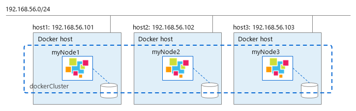

## ---  はじめに ---

## 本書の目的

本書ではGridDB Dockerfileサンプルの利用方法について説明します。

## 注意事項

本サンプルはインターネットへの接続ができることを前提とします。プロキシ経由でインターネットに接続する環境の場合、Dockerfileサンプルのプロキシ設定箇所のコメントを解除してご利用ください。

## ---  GridDB Dockerfileサンプル ---

## 概要

GridDB DockerfileサンプルはGridDBクラスタやクライアントのDockerコンテナを作成するサンプルです。
Dockerホスト上でGridDBクラスタやクライアントを動作させることができます。

## アーキテクチャ

GridDB Dockerfileサンプルは以下の2種類のDockerfileサンプルを提供します。

- GridDBサーバコンテナ用Dockerfile

   GridDBのサーバモジュールが起動するコンテナです。

- GridDBクライアントコンテナ用Dockerfile

   GridDBの運用ツール、SQLインタフェース、Javaライブラリ、WebAPIを利用できるコンテナです。

ユーザはDockerfileサンプルをビルドしてコンテナイメージを生成します。
コンテナイメージをコンテナ実行環境で起動することで、GridDBを動作させます。
また、コンテナレジストリにコンテナイメージを登録し、コンテナ実行環境に呼び出すことができます。

<figure>

<figcaption>GridDB Dockerコンテナの利用形態</figcaption>
</figure>

## ファイル構成
- Docker_server/: GridDBサーバコンテナビルド用ディレクトリ
  - rpm/: GridDBインストーラ格納用ディレクトリ
  - Dockerfile_server
  - docker-entrypoint_server.sh
- Docker_client/: GridDBクライアントコンテナビルド用ディレクトリ
  - 3rd/: 外部ソフトウェア格納用ディレクトリ
  - rpm/: GridDBインストーラ格納用ディレクトリ
  - Dockerfile_client
  - docker-entrypoint_client.sh
- Provider/:
  - Provider
  - provider.json
- sample/:
  - JDBCClient.java
  - MultiNodesClient.java
- docker-compose.yml: Docker compose用コンテナ起動設定ファイル
- .env: GridDBコンテナ用環境変数設定ファイル

## 動作環境

本サンプルは以下の環境で動作を確認しています。

- オンプレミス環境

  - ホストOS: RHEL / CentOS 8.3
  - コンテナランタイム: Docker CE 20.10.10（Docker compose V1.21.2）

本サンプルはGridDB V5.0 Enterprise Editionで動作を確認しています。

## --- オンプレミスサーバ上のGridDB Dockerfileサンプル利用方法 ---

## Dockerコンテナをビルドする

### GridDBサーバコンテナをビルドする

下記のrpmファイルをDocker_server\rpmディレクトリにコピーします。

```
$ ls rpm
griddb-ee-client-5.0.0-linux.x86_64.rpm
griddb-ee-server-5.0.0-linux.x86_64.rpm
```

Docker_serverディレクトリ内で以下のコマンドを実行し、Dockerfileをビルドします。
```
$ docker build -t griddb/griddb-server:5.0 -f Dockerfile_server .
```

### GridDBクライアントコンテナをビルドする

下記のrpmファイルをDocker_client\rpmディレクトリにコピーします。

```
$ ls rpm
griddb-ee-client-5.0.0-linux.x86_64.rpm
griddb-ee-java-lib-5.0.0-linux.x86_64.rpm
griddb-ee-webapi-5.0.0-linux.x86_64.rpm
griddb-ee-webui-5.0.0-linux.x86_64.rpm
```

以下のソフトウェアのモジュールをDocker_client\3rdディレクトリにコピーします。

- Java SE 8 (jdk-8uXXX-linux-x64.rpm)

Docker_clientディレクトリ内で以下のコマンドを実行し、Dockerfileをビルドします。
```
$ docker build -t griddb/griddb-client:5.0 -f Dockerfile_client .
```

## Dockerコンテナを起動する

### GridDBサーバコンテナを起動する

以下のコマンドにより、前節でビルドしたGridDBサーバコンテナを起動します。
```
$ docker run -d --name <docker_container_name> \
    -e GRIDDB_CLUSTERNAME=<cluster_name> \
    -e GRIDDB_NODE_NUM=<node_number> \
    -e NOTIFICATION_ADDRESS=<notification_address> \
    griddb/griddb-server:5.0
```

サーバコンテナの起動時には、以下の環境変数を指定します。

|環境変数名|説明|デフォルト値|
|----------|-------------|------|
|GRIDDB_CLUSTERNAME|クラスタ名|myCluster|
|GRIDDB_NODE_NUM|クラスタに所属するノード数|1|
|NOTIFICATION_ADDRESS|【マルチキャスト方式で指定】マルチキャストアドレス|(*1)|
|NOTIFICATION_MEMBER|【固定リスト方式で指定】各ノードのネットワーク通信IPアドレス一覧（半角カンマ区切り）|(*1)|
|NOTIFICATION_PROVIDER|【プロバイダ方式で指定】プロバイダのURL|(*1)|
|SERVICE_ADDRESS|GridDBノードのIPアドレス（クラスタ内、クライアント間通信用）|-|

(*1) いずれか1種類のみ指定必須

### GridDBクライアントコンテナを起動する

以下のコマンドにより、前節でビルドしたGridDBクライアントコンテナを起動します。
```
$ docker run -d --name <docker_container_name> \
    -e GRIDDB_NODE=<node_ip> \
    -e GRIDDB_PORT=<node_operation_port> \
    griddb/griddb-client:5.0
```

クライアントコンテナの起動時には、以下の環境変数を指定します。

|環境変数名|説明|デフォルト値|
|----------|-------------|------|
|GRIDDB_NODE|クラスタに属するGridDBサーバノードのIPアドレス（いずれか一つ）|-(必須)|
|GRIDDB_PORT|GridDB運用管理操作用ポート|-(必須)|

## GridDBクラスタを起動する（同一Dockerホスト上）

### 単一ノード構成の場合

- GridDBクラスタ起動

  単一のGridDBサーバコンテナを起動し、単一ノード構成のクラスタを構築します。

  以下のコマンドを実行します。コンテナ名はgriddbになります。
  ```
  $ docker run -d --name griddb \
      -e GRIDDB_CLUSTERNAME=<cluster_name> \
      -e GRIDDB_NODE_NUM=1 \
      -e NOTIFICATION_ADDRESS=<notification_address> \
      griddb/griddb-server:5.0
  ```

  GridDBホームディレクトリをDockerボリュームとして永続化する場合は、"--mount"オプションを追加します。
  ```
  $ docker run -d --name griddb \
      -e GRIDDB_CLUSTERNAME=<cluster_name> \
      -e GRIDDB_NODE_NUM=1 \
      -e NOTIFICATION_ADDRESS=<notification_address> \
      --mount source=<volume_name>,target=/var/lib/gridstore/ \
      griddb/griddb-server:5.0
  ```

- GridDBクライアントから接続

  NoSQL APIで接続:
  ```
  $ cd sample
  $ javac -cp /usr/share/java/gridstore.jar SingleNodeClient.java
  $ java -cp .:/usr/share/java/gridstore.jar SingleNodeClient <IP Address> 10001 myCluster
  ```

  JDBCで接続:
  ```
  $ cd sample
  $ javac JDBCClient.java
  $ java -cp .:/usr/share/java/gridstore-jdbc.jar JDBCClient <IP Address> 20001 myCluster
  ```

- GridDBクライアントコンテナから接続

  起動済みのGridDBサーバを指定し、GridDBクライアントコンテナを起動します。
  ```
  $ docker run -d --name griddb-client \
      --link <container_name>:griddb \
      griddb/griddb-client:5.0
  ```

### 複数ノード構成の場合

以下では、3つのGridDBサーバコンテナを起動し、3ノード構成のクラスタを構築します。
同一Dockerホスト上にクライアントコンテナも起動します。また、コンテナそれぞれのGridDBホームディレクトリをDockerボリュームとして永続化します。

<figure>

<figcaption>同一Dockerホスト上のGridDBクラスタ</figcaption>
</figure>

同梱のdocker-compose.ymlを用いて、Docker composeによってクライアントを含む複数コンテナを一度に起動することができます。
```
version: '3'
services:
    griddb1:
        container_name: myNode1
        image: griddb-server:${GRIDDB_VERSION}
        build:
            context: ./Docker_server
            dockerfile: Dockerfile_server
        env_file: .env
        networks:
            griddb_net:
                ipv4_address: ${IPADDR_NODE1}
        volumes:
            - "node1:/var/lib/gridstore/"
    griddb2:
        container_name: myNode2
        image: griddb-server:${GRIDDB_VERSION}
        env_file: .env
        networks:
            griddb_net:
                ipv4_address: ${IPADDR_NODE2}
        volumes:
            - "node2:/var/lib/gridstore/"
    griddb3:
        container_name: myNode3
        image: griddb-server:${GRIDDB_VERSION}
        env_file: .env
        networks:
            griddb_net:
                ipv4_address: ${IPADDR_NODE3}
        volumes:
            - "node3:/var/lib/gridstore/"
    client:
        container_name: client
        image: griddb-client:${GRIDDB_VERSION}
        build:
            context: ./Docker_client
            dockerfile: Dockerfile_client
        env_file: .env
        networks:
            griddb_net:
                ipv4_address: ${IPADDR_CLIENT}
        volumes:
            - "client:/var/lib/gridstore/log"
        depends_on:
            - "griddb1"
            - "griddb2"
            - "griddb3"
        ports:
            - 8080:8080
            - 8081:8081

volumes:
    node1:
    node2:
    node3:
    client:

networks:
    griddb_net:
        driver: bridge
        ipam:
            config:
                - subnet: ${SUBNET}
```

GridDB Dockerfileサンプルでは、3.2節で説明したコンテナ起動用の環境変数およびdocker-compose実行時に使用する環境変数を<code>.env</code>ファイルに定義できます。
構築するGridDBクラスタの接続方式（マルチキャスト、固定リスト、プロバイダ）に応じて、対応する環境変数を定義してください。
<code>.env</code>ファイルに定義できる環境変数は以下です。

|環境変数名|説明|例|
|----------|-------------|------|
|GRIDDB_NODE_NUM|クラスタに所属するノード数|3|
|GRIDDB_CLUSTERNAME|クラスタ名|dockerCluster|
|GRIDDB_VERSION|バージョン|5.0|
|NOTIFICATION_ADDRESS|【マルチキャスト方式で指定】マルチキャストアドレス|239.0.0.1|
|NOTIFICATION_MEMBER|【固定リスト方式で指定】各ノードのネットワーク通信IPアドレス一覧（半角カンマ区切り）|172.18.0.2,172.18.0.3,172.18.0.4|
|NOTIFICATION_PROVIDER|【プロバイダ方式で指定】プロバイダのURL|http\://providerhost/provider.json|
|GRIDDB_NODE|クラスタに属するGridDBノードのIPアドレス（いずれか一つ）|172.18.0.2|
|GRIDDB_PORT|GridDB運用管理操作用ポート|10040|
|IPADDR_NODE1|myNode1のIPアドレス|172.18.0.2|
|IPADDR_NODE2|myNode2のIPアドレス|172.18.0.3|
|IPADDR_NODE3|myNode3のIPアドレス|172.18.0.4|
|IPADDR_CLIENT|clientのIPアドレス|172.18.0.5|
|SUBNET|クラスタが属するサブネット|172.18.0.0/24|

## GridDBクラスタを起動する（複数Dockerホスト上）

前節の同一Dockerホスト上に複数コンテナを起動する方法は、以下の点でクラスタリングのメリットを十分に得られません。

- ノードの冗長性による可用性の担保
- 独立したリソースの並列利用による高速処理

複数のDockerホスト上でGridDBクラスタを構築することで、これらのメリットをより得られるようになります。

### マルチキャスト方式によるクラスタ構築

マルチキャスト方式でクラスタを構築する場合は、Dockerネットワークをhostモードで構築してください。

以下はhostネットワークによる三台のDockerホスト上に、ノード構成のクラスタをマルチキャスト方式で構築する場合のコマンド例です。

<figure>

<figcaption>複数Dockerホスト上のGridDBクラスタ（マルチキャスト方式）</figcaption>
</figure>

host1上で実行：
```
$ docker run --net=host \
    -e GRIDDB_NODE_NUM=3 \
    -e GRIDDB_CLUSTERNAME=dockerCluster \
    -e NOTIFICATION_ADDRESS=239.0.0.2 \
    -e SERVICE_ADDRESS=192.168.56.101 \
    --name myNode1 griddb/griddb-server:5.0
```

host2上で実行：
```
$ docker run --net=host \
    -e GRIDDB_NODE_NUM=3 \
    -e GRIDDB_CLUSTERNAME=dockerCluster \
    -e NOTIFICATION_ADDRESS=239.0.0.2 \
    -e SERVICE_ADDRESS=192.168.56.102 \
    --name myNode2 griddb/griddb-server:5.0
```

host3上で実行：
```
$ docker run --net=host \
    -e GRIDDB_NODE_NUM=3 \
    -e GRIDDB_CLUSTERNAME=dockerCluster \
    -e NOTIFICATION_ADDRESS=239.0.0.2 \
    -e SERVICE_ADDRESS=192.168.56.103 \
    --name myNode3 griddb/griddb-server:5.0
```

### 固定リスト方式によるクラスタ構築

固定リスト方式では、MACVLANネットワークとoverlayネットワークのいずれかのDockerネットワークを使用することができます。
MACVLANネットワークでは、各コンテナはネットワーク外と共通のサブネットを用いるため、ポートの露出（expose）は不要ですが、
overlayネットワークでは、10001、20001(NewSQL使用時)、10040の3種類のポートを露出する必要があります。

以下はoverlayネットワークによる三台のDockerホスト上に、3ノード構成のクラスタを固定リスト方式で構築する場合のコマンド例です。

<figure>

<figcaption>複数Dockerホスト上のGridDBクラスタ（固定リスト方式）</figcaption>
</figure>

- 3台のホストをDocker swarmを用いてクラスタ化します。

  host1上で実行：
  ```
  $ docker swarm init --advertise-addr=192.168.56.101
  ```
  このコマンドにより、ホストを参加させるのに必要なトークンが表示されます。

  host2上で実行：
  ```
  $ docker swarm join --token <TOKEN> \
      --advertise-addr 192.168.56.102 192.168.56.101:2377
  ```

  host3上で実行：
  ```
  $ docker swarm join --token <TOKEN> \
      --advertise-addr 192.168.56.103 192.168.56.101:2377
  ```

- overlayネットワーク（griddb-net）を作成します。
  ```
  $ docker network create -d overlay \
      --subnet 10.0.1.0/24 --attachable griddb-net
  ```

- GridDBサーバコンテナを起動します。

  machine1ノード上で実行：
  ```
  $ docker run \
      -e GRIDDB_NODE_NUM=3 \
      -e GRIDDB_CLUSTERNAME=dockerCluster \
      -e NOTIFICATION_MEMBER=10.0.1.4,10.0.1.5,10.0.1.6 \
      -p 10001:10001 -p 10040:10040 -p 20001:20001 \
      --network griddb-net --ip 10.0.1.4 \
    --name myNode1 griddb/griddb-server:5.0
  ```

  machine2ノード上で実行：
  ```
  $ docker run -e GRIDDB_NODE_NUM=3 \
      -e GRIDDB_NODE_NUM=3 \
      -e GRIDDB_CLUSTERNAME=dockerCluster \
      -e NOTIFICATION_MEMBER=10.0.1.4,10.0.1.5,10.0.1.6 \
      -p 10001:10001 -p 10040:10040 -p 20001:20001 \
      --network griddb-net --ip 10.0.1.5 \
      --name myNode2 griddb/griddb-server:5.0
  ```

  machine3ノード上で実行：
  ```
  $ docker run -e GRIDDB_NODE_NUM=3 \
      -e GRIDDB_NODE_NUM=3 \
      -e GRIDDB_CLUSTERNAME=dockerCluster \
      -e NOTIFICATION_MEMBER=10.0.1.4,10.0.1.5,10.0.1.6 \
      -p 10001:10001 -p 10040:10040 -p 20001:20001 \
      --network griddb-net --ip 10.0.1.6 \
      --name myNode3 griddb/griddb-server:5.0
  ```

- 各コンテナ内で`gs_node.json`と`gs_cluster.json`を編集します。

  myNode1の`gs_node.json`:
  `/transaction/serviceAddress`と`/sql/serviceAddress`を"192.168.56.101"に

  myNode2の`gs_node.json`:
  `/transaction/serviceAddress`と`/sql/serviceAddress`を"192.168.56.102"に

  myNode3の`gs_node.json`:
  `/transaction/serviceAddress`と`/sql/serviceAddress`を"192.168.56.103"に

  myNode1～3の`gs_cluster.json`:
  ```
  {
    ...
    "cluster": {
      ...
      "notificationMember": [
        {
          "cluster": {"address": "10.0.1.4","port": 10010},
          "sync": {"address": "10.0.1.4","port": 10020},
          "system": {"address": "10.0.1.4","port": 10040},
          "transaction": {"address": "192.168.56.101","port": 10001},
          "sql": {"address": "192.168.56.101","port": 20001}
        },
        {
          "cluster": {"address": "10.0.1.5","port": 10010},
          "sync": {"address": "10.0.1.5","port": 10020},
          "system": {"address": "10.0.1.5","port": 10040},
          "transaction": {"address": "192.168.56.102","port": 10001},
          "sql": {"address": "192.168.56.102","port": 20001}
        },
        {
          "cluster": {"address": "10.0.1.6","port": 10010},
          "sync": {"address": "10.0.1.6","port": 10020},
          "system": {"address": "10.0.1.6","port": 10040},
          "transaction": {"address": "192.168.56.103","port": 10001},
          "sql": {"address": "192.168.56.103","port": 20001}
        }
      ]
      ...
    }
    ...
  }
  ```

### プロバイダ方式によるクラスタ構築

プロバイダ方式の場合は固定リスト方式の場合と同様です。
overlayネットワークのDockerホスト上では、10001、20001（NewSQL使用時）、10040ポートを露出する必要があります。

以下はoverlayネットワークによる三台のDockerホスト上に、3ノード構成のクラスタをプロバイダ方式で構築する場合のコマンド例です。

なお、ホストプロバイダがhttp\://192.168.56.104/provider.json で、以下のホスト情報を提供しているとします。
```
$ curl http://192.168.56.104/provider.json
[
  {
    "cluster": {"address": "10.0.1.4","port": 10010},
    "sync": {"address": "10.0.1.4","port": 10020},
    "system": {"address": "10.0.1.4","port": 10040},
    "transaction": {"address": "192.168.56.101","port": 10001},
    "sql": {"address": "192.168.56.101","port": 20001}
  },
  {
    "cluster": {"address": "10.0.1.5","port": 10010},
    "sync": {"address": "10.0.1.5","port": 10020},
    "system": {"address": "10.0.1.5","port": 10040},
    "transaction": {"address": "192.168.56.102","port": 10001},
    "sql": {"address": "192.168.56.102","port": 20001}
  },
  {
    "cluster": {"address": "10.0.1.6","port": 10010},
    "sync": {"address": "10.0.1.6","port": 10020},
    "system": {"address": "10.0.1.6","port": 10040},
    "transaction": {"address": "192.168.56.103","port": 10001},
    "sql": {"address": "192.168.56.103","port": 20001}
  }
]
```

- 3台のホストをDocker swarmを用いてクラスタ化します。

  host1上で実行：
  ```
  $ docker swarm init --advertise-addr=192.168.56.101
  ```
  このコマンドにより、ホストを参加させるのに必要なトークンが表示されます。

  host2上で実行：
  ```
  $ docker swarm join --token <TOKEN> \
      --advertise-addr 192.168.56.102 192.168.56.101:2377
  ```

  host3上で実行：
  ```
  $ docker swarm join --token <TOKEN> \
      --advertise-addr 192.168.56.103 192.168.56.101:2377
  ```

- overlayネットワーク（griddb-net）を作成します。
  ```
  $ docker network create -d overlay \
      --subnet 10.0.1.0/24 --attachable griddb-net
  ```

- GridDBサーバコンテナを起動します。

  host1ノード上で実行：
  ```
  $ docker run -e GRIDDB_NODE_NUM=3 \
      -e GRIDDB_CLUSTERNAME=dockerCluster \
      -e NOTIFICATION_PROVIDER=http://192.168.56.104/provider.json \
      -p 10001:10001 -p 10040:10040 -p 20001:20001 \
      --network griddb-net --ip 10.0.1.4 \
      --name myNode1 griddb/griddb-server:5.0
  ```

  host2ノード上で実行：
  ```
  $ docker run -e GRIDDB_NODE_NUM=3 \
      -e GRIDDB_CLUSTERNAME=dockerCluster \
      -e NOTIFICATION_PROVIDER=http://192.168.56.104/provider.json \
      -p 10001:10001 -p 10040:10040 -p 20001:20001 \
      --network griddb-net --ip 10.0.1.5 \
      --name myNode2 griddb/griddb-server:5.0
  ```

  host3ノード上で実行：
  ```
  $ docker run -e GRIDDB_NODE_NUM=3 \
      -e GRIDDB_CLUSTERNAME=dockerCluster \
      -e NOTIFICATION_PROVIDER=http://192.168.56.104/provider.json \
      -p 10001:10001 -p 10040:10040 -p 20001:20001 \
      --network griddb-net --ip 10.0.1.6 \
      --name myNode3 griddb/griddb-server:5.0
  ```

- 各コンテナ内でgs_node.jsonを編集します。（gs_cluster.jsonは不要）

  myNode1の`gs_node.json`:
  `/transaction/serviceAddress`と`/sql/serviceAddress`を"192.168.56.101"に

  myNode2の`gs_node.json`:
  `/transaction/serviceAddress`と`/sql/serviceAddress`を"192.168.56.102"に

  myNode3の`gs_node.json`:
  `/transaction/serviceAddress`と`/sql/serviceAddress`を"192.168.56.103"に

## --- 主な操作 ---

## コンテナ内でシェルを起動する

```
$ docker exec -it <node_name> bash
```

## GridDBクラスタのステータスを確認する

```
$ docker exec -it <node_name> bash
$ su - gsadm
$ gs_stat -u admin/admin
```

## GridDBクラスタへのアクセス

### Dockerホスト上からマルチキャスト接続でGridDBクラスタにアクセスする

- hostネットワークからコンテナのdocker0インタフェースにマルチキャストルートを設定します。
  ```
  $ ip route add 239.0.0.1/32 dev docker0
  ```

- マルチキャストルートに対してクライアントからアクセスします。
  ```
  $ cd sample
  $ javac -cp /usr/share/java/gridstore.jar MultiNodesClient.java
  $ java -cp .:/usr/share/java/gridstore.jar MultiNodesClient 239.0.0.1 31999 myCluster
  ```

### Dockerホスト外のGridDBクライアントからアクセスする

- コンテナ起動時に必要なポートを露出しておきます。
  ```
  $ docker run -P -d --name griddb griddb/griddb-server:5.0
  ```

  ポートフォワードすることもできます。
  ```
  $ docker run -p 40001:10001 -d --name griddb griddb/griddb-server:5.0
  ```

- 露出されたポートは以下のコマンドで確認できます。
  ```
  $ docker port griddb
  ```

- 露出されているポートに対してクライアントからアクセスします。
  ```
  $ cd sample
  $ javac -cp /usr/share/java/gridstore.jar SingleNodeClient.java
  $ java -cp .:/usr/share/java/gridstore.jar SingleNodeClient <Docker Host IP Address> 40001 myCluster
  ```

## ---  商標 ---

- GridDBは日本国内における東芝デジタルソリューションズ株式会社の登録商標です。
- DockerはDocker Inc.の米国およびその他の国における登録商標です。
