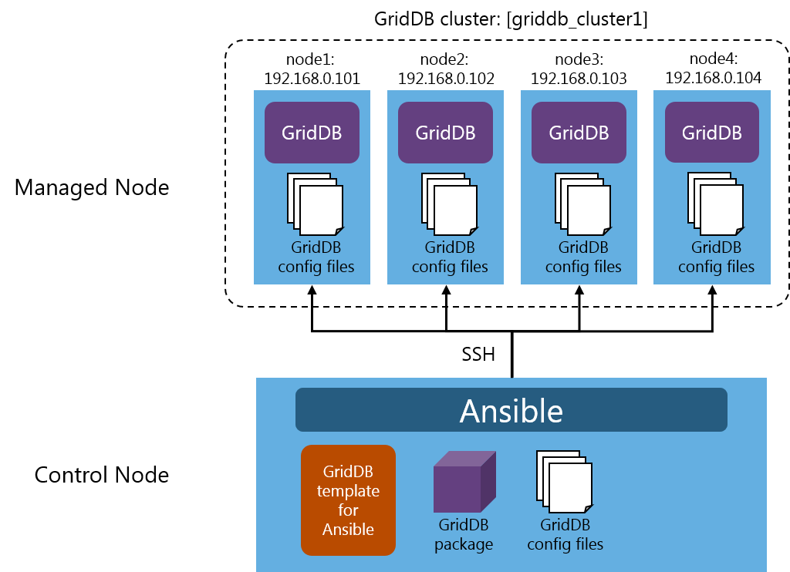
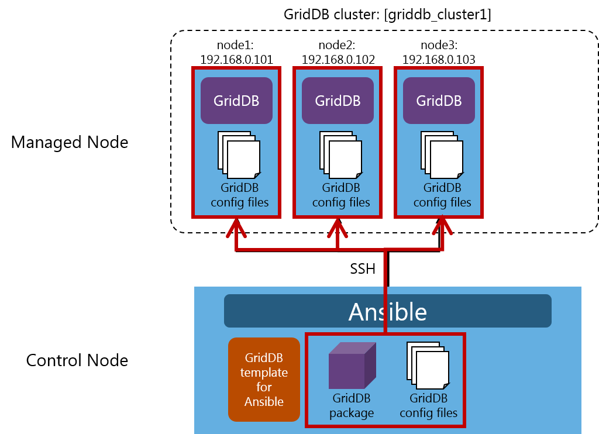
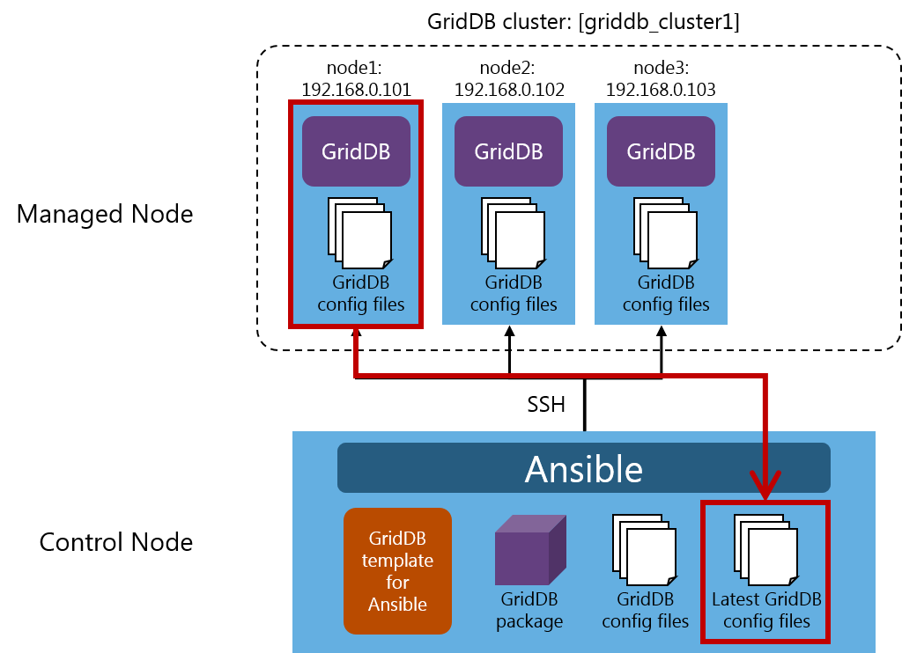
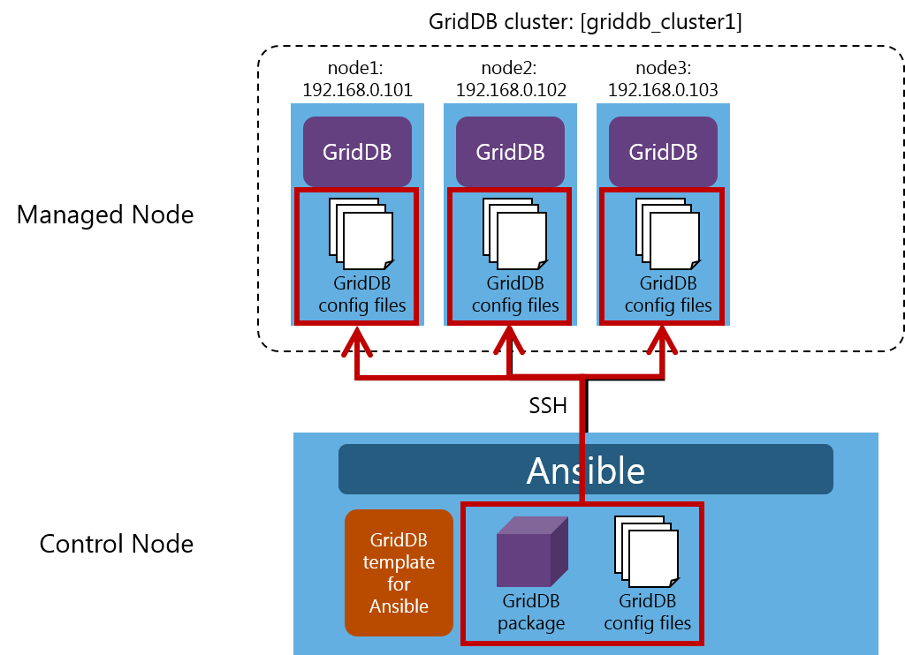

## --- はじめに ---

## 本書の目的

本書ではGridDB 構築テンプレート for Ansibleの設定方法について説明します。

## 注意事項

GridDB 構築テンプレート for AnsibleはGridDBの構築を支援するためのテンプレートです。
運用するシステムに合わせてカスタマイズして利用してください。

なお、本テンプレートを用いたGridDBの運用、動作や、Ansibleに関するお問合せは、GridDBのサポートサービスの範囲外となります。

## --- 概要 ---

## GridDB 構築テンプレート for Ansibleとは

Ansibleはアプリケーションやシステムの構築を支援するツールです。

<figure>

<figcaption>システム構成例</figcaption>
</figure>

Ansibleをインストールしたマシン (Control Node) と管理対象となるマシン (Managed Node) を事前に用意します。

Control NodeにはGridDB 構築テンプレート for Ansible (GridDB template for Ansible)、GridDBパッケージ (GridDB package)、GridDB設定ファイル (GridDB config files) を配置します。

Control NodeでAnsibleを実行すると、Managed NodeにSSHで接続し、GridDBのインストールや設定を行います。

## 対応するユースケース

本テンプレートは、Ansibleを用いてGridDBの初期構築、設定取得、設定変更、ノード追加を行うことを支援するテンプレートです。

クラスタ構成の接続方式は、マルチキャスト方式に対応しています。

|ユースケース|説明|マルチキャスト方式|
|-|-|-|
|初期構築|GridDBクラスタを新規作成します。|○|
|設定取得|GridDBクラスタの設定を取得します。|○|
|設定変更|GridDBクラスタの設定を変更します。|○|
|ノード追加|GridDBクラスタにノードを追加します。|○|

<!--
|ユースケース|説明|マルチキャスト方式|固定リスト方式|プロバイダ方式|
|-|-|-|-|-|
|初期構築|GridDBクラスタを新規作成します。|○|-|-|
|設定取得|GridDBクラスタの設定を取得します。|○|-|-|
|設定変更|GridDBクラスタの設定を変更します。|○|-|-|
|ノード追加|GridDBクラスタにノードを追加します。|○|-|-|
-->

## ファイル構成

本テンプレートはインストールメディアの`/misc/ansible-template/ansible-template.zip`に含まれています。
zipファイルを展開して利用します。

zipファイル展開後のファイル構成は以下の通りです。

```
ansible-template
│  initial-construction.yml (playbookファイル：初期構築)
│  get-setting.yml          (playbookファイル：設定取得)
│  change-setting.yml       (playbookファイル：設定変更)
│  add-node.yml             (playbookファイル：ノード追加)
│  
├─conf (GridDB設定ファイルを配置するディレクトリ)
│      
├─roles (playbookで実行される処理が記述されたファイル)
│  └─toshiba.griddb
│      │  
│      ├─defaults
│      │      main.yml
│      │      
│      ├─handlers
│      │      main.yml
│      │      
│      ├─meta
│      │      main.yml
│      │      
│      ├─tasks
│      │      main.yml                   (タスク一覧)
│      │      variables.yml              (タスクファイル：設定値の検証)
│      │      setup-griddb.yml           (タスクファイル：GridDBパッケージの配布、GridDBのインストール)
│      │      configure.yml              (タスクファイル：GridDB設定ファイルの配布、GridDBクラスタの再起動)
│      │      get-setting.yml            (タスクファイル：GridDB設定ファイルの取得)
│      │      detect-cluster-setting.yml (タスクファイル：GridDBクラスタの情報取得)
│      │      add-node.yml               (タスクファイル：ノードの追加)
│      │      
│      └─vars
│              main.yml
│              griddb.yml
│              
└─vars
        initial-construction.yml (変数定義ファイル：初期構築)
        get-setting.yml          (変数定義ファイル：設定取得)
        change-setting.yml       (変数定義ファイル：設定変更)
        add-node.yml             (変数定義ファイル：ノード追加)
```

## 動作環境

本テンプレートは以下の環境で動作を確認しています。

Control Node

- CentOS 8
- Ansible 2.11.6
- Python 3.6

Managed Node

- GridDBの管理コマンドが実行できる環境

本テンプレートはGridDB 5.0 Enterprise Editionで動作を確認しています。

## --- インストール手順 ---

インストールの手順を説明します。

## SSHの設定

Control NodeからManaged NodeにSSHで接続できることを確認します。

## Pythonのインストール

Control NodeにPythonがインストールされていることを確認します。

Ansibleは`/usr/bin/python`を参照します。パスを確認してください。

## Ansibleのインストール

Control NodeにAnsibleをインストールします。

```
$ sudo yum install ansible
```

インストールされたAnsibleのバージョンを確認します。

```
$ ansible --version
ansible 2.X.X
```

Ansibleのホームディレクトリは`/etc/ansible`です。パスを確認してください。

## テンプレートの設定

Control Nodeでテンプレートファイル`ansible-template.zip`を展開し、Ansibleのホームディレクトリに配置します。

```
/etc/ansible
├── ansible.cfg
├── hosts
├── <playbook.yml>
├── conf
├── roles
│   └── toshiba.griddb
│       └...
└── vars
    └── <vars.yml>
```

## Ansible設定ファイル

Ansible設定ファイルを編集し、実行ログの出力先 (log_path) を設定します。

Ansible設定ファイルは`/etc/ansible/ansible.cfg`です。項目名=値の形式で記述します。

/etc/ansible/ansible.cfg

```
[defaults]
log_path=/var/log/ansible.log
```

設定項目の詳細は[『Ansible Documentation』](https://docs.ansible.com/ansible/2.8/reference_appendices/config.html)を参照してください。

Ansibleの設定は、以下の順番で優先的に適用されます。
設定が適用されない場合は各ファイルを確認してください。

- ANSIBLE_CONFIG (環境変数)
- ansible.cfg    (カレントディレクトリのファイル)
- ~/.ansible.cfg (ホームディレクトリのファイル)
- /etc/ansible/ansible.cfg

以上でインストールは完了です。

## ---  初期構築の実行手順 ---

ノード3台で構成されるGridDBクラスタを作成する手順を説明します。

## 事前準備

<figure>

<figcaption>初期構築</figcaption>
</figure>

事前にManaged Nodeのマシン3台を用意します。

構築するGridDBのクラスタ名は`griddb_cluster1`とします。

クラスタを構成するノードは3台 (node1：`192.168.0.101`、node2：`192.168.0.102`、node3：`192.168.0.103`) とします。

## 初期構築とは

初期構築は以下のステップで実行されます。

|ステップ|説明|
|-|-|
|1|設定値の検証|
|2|GridDBパッケージの配布|
|3|GridDBのインストール|
|4|GridDB設定ファイルの配布|
|5|GridDBクラスタの起動|

## インベントリファイルの編集

Control Nodeでインベントリファイルを編集します。

/etc/ansible/hosts

```
[local]
localhost

[griddb_cluster1]
192.168.0.101
192.168.0.102
192.168.0.103
```

GridDBのクラスタ名は括弧で囲み、`[griddb_cluster1]`と指定します。

ノード名は`192.168.0.101`、`192.168.0.102`、および`192.168.0.103`と指定します。

インベントリファイルの詳細は、[インベントリファイル](#hosts_file)を参照してください。

## playbookファイルの編集

Control Nodeでplaybookファイルを編集します。

初期構築のplaybookファイルは`/etc/ansible/initial-construction.yml`です。

/etc/ansible/initial-construction.yml

```
---
- hosts: griddb_cluster1
  become: yes
  vars_files:
    - vars/initial-construction.yml
  roles:
    - toshiba.griddb
```

`hosts`には、インベントリファイルで指定したクラスタ名`griddb_cluster1`を指定します。

`become`は`yes`と指定し、接続ユーザ以外でManaged Nodeを操作することを許可します。

`vars_files`には、初期構築の変数定義ファイル`vars/initial-construction.yml`を指定します。

`roles`には、playbookで実行される処理が格納されている`toshiba.griddb`を指定します。

playbookファイルの詳細は、[playbookファイル](#playbook_file)を参照してください。

## 変数定義ファイルの編集

Control Nodeで変数定義ファイルを編集します。

初期構築の変数定義ファイルは`/etc/ansible/vars/initial-construction.yml`です。

/etc/ansible/vars/initial-construction.yml

```
---
env: 'on-premises'
griddb_deploy_mode: 'multicast'
griddb_package_path: '/home/griddb/5.0.0'
griddb_config_files: '/etc/ansible/conf'
```

`env`には`on-premises`と指定します。

`griddb_deploy_mode`には、マルチキャスト方式`multicast`を指定します。

`griddb_package_path`には、GridDBパッケージを配置するディレクトリのパス`/home/griddb/5.0.0`を指定します。

`griddb_config_files`には、GridDB設定ファイルを配置するディレクトリのパス`/etc/ansible/conf`を指定します。

変数定義ファイルの詳細は、[変数定義ファイル](#vars_file)を参照してください。

<!--
- マルチキャスト方式の場合は、`griddb_deploy_mode`に`multicast`を指定します。
- 固定リスト方式の場合は、`griddb_deploy_mode`に`fixed_list`を指定します。
- プロバイダ方式の場合は、`griddb_deploy_mode`に`provider`を指定します。
-->

## GridDBパッケージの配置

GridDBパッケージを`griddb_package_path`で指定したディレクトリに配置します。

```
/home/griddb/5.0.0
├── griddb-ee-server-5.0.0-linux.x86_64.rpm
└── griddb-ee-client-5.0.0-linux.x86_64.rpm
```

## GridDB設定ファイルの配置

GridDB設定ファイルを編集し、`griddb_config_files`で指定したディレクトリ`/etc/ansible/conf`に配置します。

配置するGridDB設定ファイルは、gs_cluster.json (クラスタ定義ファイル)、gs_node.json (ノード定義ファイル)、およびgridstore.conf (起動設定ファイル) の3種類です。

```
/etc/ansible/conf
├── gs_cluster.json (クラスタ定義ファイル)
├── gs_node.json    (ノード定義ファイル)
└── gridstore.conf  (起動設定ファイル)
```

### クラスタ定義ファイルの編集

クラスタ定義ファイルでは`クラスタ名`を編集します。

/etc/ansible/conf/gs_cluster.json
```
...
"cluster":{
  "clusterName":"griddb_cluster1",
  ...
```

`clusterName`に`griddb_cluster1`を指定します。

ファイルの詳細は[『GridDB 機能リファレンス』](GridDB_FeaturesReference.html#label_parameters)を参照してください。

### ノード定義ファイルの編集

ノード定義ファイルを編集し、`メモリ使用量`を指定します。

/etc/ansible/conf/gs_node.json
```
...
"dataStore":{
  ...
  "storeMemoryLimit":"1024MB",
  ...
```

`storeMemoryLimit`には、初期値の`1024MB`を指定します。

ファイルの詳細は[『GridDB データベース管理者ガイド』](GridDB_AdministratorsGuide.html)を参照してください。

### 起動設定ファイルの編集

サービスの起動設定ファイルを編集し、`クラスタ名`と`ノードの数`を指定します。

/etc/ansible/conf/gridstore.conf
```
CLUSTER_NAME=griddb_cluster1
MIN_NODE_NUM=3
```

`CLUSTER_NAME`には、`クラスタ名`として`griddb_cluster1`を指定します。

`MIN_NODE_NUM`には、`ノードの数`として`3`を指定します。

ファイルの詳細は[『GridDB 運用ツールリファレンス』](GridDB_OperationToolsReference.html)を参照してください。

## playbookファイルの実行

Ansibleのホームディレクトリで初期構築のplaybookを実行します。

```
$ ansible-playbook -i hosts initial-construction.yml
```

## --- 設定取得の実行手順 ---

ノード3台で構成される既存のGridDBクラスタから設定を取得する手順を説明します。

## 事前準備

<figure>

<figcaption>設定取得</figcaption>
</figure>

GridDBクラスタ`griddb_cluster1`が、ノード3台 (node1：`192.168.0.101`、node2：`192.168.0.102`、node3：`192.168.0.103`) の構成で動作しています。

## 設定取得とは

設定取得は以下のステップで実行されます。

|ステップ|説明|
|-|-|
|1|設定値の検証|
|2|GridDBクラスタの情報取得|
|3|GridDB設定ファイルの取得|

## インベントリファイルの編集

Control Nodeでインベントリファイルを編集します。

/etc/ansible/hosts

```
[local]
localhost

[griddb_cluster1]
192.168.0.101
192.168.0.102
192.168.0.103
```

GridDBのクラスタ名は括弧で囲み、`[griddb_cluster1]`と指定します。

ノード名は`192.168.0.101`、`192.168.0.102`、および`192.168.0.103`と指定します。

インベントリファイルの詳細は、[インベントリファイル](#hosts_file)を参照してください。

## playbookファイルの編集

Control Nodeでplaybookファイルを編集します。

設定取得のplaybookファイルは`/etc/ansible/get-setting.yml`です。

/etc/ansible/get-setting.yml

```
---
- hosts: griddb_cluster1
  become: yes
  vars_files:
    - vars/get-setting.yml
  tasks:
    - name: Get setting
      include_role:
        name: toshiba.griddb
        tasks_from: get-setting.yml
```

`hosts`には、インベントリファイルで指定したクラスタ名`griddb_cluster1`を指定します。

`become`は`yes`と指定し、接続ユーザ以外でManaged Nodeを操作することを許可します。

`vars_files`には、設定取得の変数定義ファイル`vars/get-setting.yml`を指定します。

`tasks`にはplaybookで実行される処理を指定します。`name`には`Get setting`と指定します。

`include_role`の`name`には、playbookで実行される処理が格納されている`toshiba.griddb`を指定します。

`tasks_from`には`roles/toshiba.griddb/tasks/get-setting.yml`を指定するために`get-setting.yml`と記述します。

playbookファイルの詳細は、[playbookファイル](#playbook_file)を参照してください。

## 変数定義ファイルの編集

Control Nodeで変数定義ファイルを編集します。

設定取得の変数定義ファイルは`/etc/ansible/vars/get-setting.yml`です。

/etc/ansible/vars/get-setting.yml

```
---
griddb_get_setting: '/etc/ansible/conf_latest'
```

`griddb_get_setting`には、ノードから取得したGridDB設定ファイルを配置するディレクトリのパス`/etc/ansible/conf_latest`を指定します。

変数定義ファイルの詳細は、[変数定義ファイル](#vars_file)を参照してください。

## playbookファイルの実行

Ansibleのホームディレクトリで設定取得のplaybookを実行します。

```
$ ansible-playbook -i hosts get-setting.yml
```

## GridDB設定ファイルの確認

`griddb_get_setting`で指定したディレクトリ`/etc/ansible/conf_latest`に、ノードから取得したGridDB設定ファイルが配置されます。

取得できるGridDB設定ファイルは、gs_cluster.json (クラスタ定義ファイル)、gs_node.json (ノード定義ファイル)、gridstore.conf (起動設定ファイル) 、およびversion.txt (GridDBバージョンファイル) の4種類です。

```
/etc/ansible/conf_latest
├── gs_cluster.json (クラスタ定義ファイル)
├── gs_node.json    (ノード定義ファイル)
├── gridstore.conf  (起動設定ファイル)
└── version.txt     (GridDBバージョンファイル)
```

## --- 設定変更の実行手順 ---

ノード3台で構成される既存のGridDBクラスタの設定を変更する手順を説明します。

## 事前準備

<figure>

<figcaption>設定変更</figcaption>
</figure>

GridDBクラスタ`griddb_cluster1`が、ノード3台 (node1：`192.168.0.101`、node2：`192.168.0.102`、node3：`192.168.0.103`) の構成で動作しています。

## 設定変更とは

設定変更は以下のステップで実行されます。

|ステップ|説明|
|-|-|
|1|設定値の検証|
|2|GridDB設定ファイルの配布|
|3|GridDBクラスタの再起動|

## インベントリファイルの編集

Control Nodeでインベントリファイルを編集します。

/etc/ansible/hosts

```
[local]
localhost

[griddb_cluster1]
192.168.0.101
192.168.0.102
192.168.0.103
```

GridDBのクラスタ名は括弧で囲み、`[griddb_cluster1]`と指定します。

ノード名は`192.168.0.101`、`192.168.0.102`、および`192.168.0.103`と指定します。

インベントリファイルの詳細は、[インベントリファイル](#hosts_file)を参照してください。

## playbookファイルの編集

Control Nodeでplaybookファイルを編集します。

設定変更のplaybookファイルは`/etc/ansible/change-setting.yml`です。

/etc/ansible/change-setting.yml

```
---
- hosts: griddb_cluster1
  become: yes
  vars_files:
    - vars/change-setting.yml
  tasks:
    - name: Change setting
      include_role:
        name: toshiba.griddb
        tasks_from: configure.yml
```

`hosts`には、インベントリファイルで指定したクラスタ名`griddb_cluster1`を指定します。

`become`は`yes`と指定し、接続ユーザ以外でManaged Nodeを操作することを許可します。

`vars_files`には、設定変更の変数定義ファイル`vars/change-setting.yml`を指定します。

`tasks`にはplaybookで実行される処理を指定します。`name`には`Change setting`と指定します。

`include_role`の`name`には、playbookで実行される処理が格納されている`toshiba.griddb`を指定します。

`tasks_from`には`roles/toshiba.griddb/tasks/configure.yml`を指定するために`configure.yml`と記述します。

playbookファイルの詳細は、[playbookファイル](#playbook_file)を参照してください。

## 変数定義ファイルの編集

Control Nodeで変数定義ファイルを編集します。

設定変更の変数定義ファイルは`/etc/ansible/vars/change-setting.yml`です。

/etc/ansible/vars/change-setting.yml

```
---
griddb_config_files: '/etc/ansible/conf'
```

`griddb_config_files`には、GridDB設定ファイルを配置するディレクトリのパス`/etc/ansible/conf`を指定します。

変数定義ファイルの詳細は、[変数定義ファイル](#vars_file)を参照してください。

## GridDB設定ファイルの配置

GridDB設定ファイルを編集し、`griddb_config_files`で指定したディレクトリ`/etc/ansible/conf`に配置します。

配置するGridDB設定ファイルは、gs_cluster.json (クラスタ定義ファイル)、gs_node.json (ノード定義ファイル)、およびgridstore.conf (起動設定ファイル) の3種類です。

```
/etc/ansible/conf
├── gs_cluster.json (クラスタ定義ファイル)
├── gs_node.json    (ノード定義ファイル)
└── gridstore.conf  (起動設定ファイル)
```

### クラスタ定義ファイルの編集

クラスタ定義ファイルでは`クラスタ名`を編集します。

/etc/ansible/conf/gs_cluster.json
```
...
"cluster":{
  "clusterName":"griddb_cluster1",
  ...
```

`clusterName`に`griddb_cluster1`を指定します。

ファイルの詳細は[『GridDB 機能リファレンス』](GridDB_FeaturesReference.html#label_parameters)を参照してください。

### ノード定義ファイルの編集

ノード定義ファイルを編集し、`メモリ使用量`を指定します。

/etc/ansible/conf/gs_node.json
```
...
"dataStore":{
  ...
  "storeMemoryLimit":"2048MB",
  ...
```

`storeMemoryLimit`には、`2048MB`を指定します。

ファイルの詳細は[『GridDB データベース管理者ガイド』](GridDB_AdministratorsGuide.html)を参照してください。

### 起動設定ファイルの編集

サービスの起動設定ファイルを編集し、`クラスタ名`と`ノードの数`を指定します。

/etc/ansible/conf/gridstore.conf
```
CLUSTER_NAME=griddb_cluster1
MIN_NODE_NUM=3
```

`CLUSTER_NAME`には、`クラスタ名`として`griddb_cluster1`を指定します。

`MIN_NODE_NUM`には、`ノードの数`として`3`を指定します。

ファイルの詳細は[『GridDB 運用ツールリファレンス』](GridDB_OperationToolsReference.html)を参照してください。

## playbookファイルの実行

Ansibleのホームディレクトリで設定変更のplaybookを実行します。

```
$ ansible-playbook -i hosts change-setting.yml
```

## --- ノード追加の実行手順 ---

ノード3台で構成される既存のGridDBクラスタにノード1台を追加する手順を説明します。

## 事前準備

<figure>

<figcaption>ノード追加</figcaption>
</figure>

GridDBクラスタ`griddb_cluster1`が、ノード3台 (node1：`192.168.0.101`、node2：`192.168.0.102`、node3：`192.168.0.103`) の構成で動作しています。

ノード1台 (node4：`192.168.0.104`) を追加すると、GridDBクラスタ`griddb_cluster1`はノード4台構成となります。

## ノード追加とは

ノード追加は以下のステップで実行されます。

|ステップ|説明|
|-|-|
|1|設定値の検証|
|2|GridDBクラスタの情報取得|
|3|追加ノードのグループの作成|
|4|追加ノードにGridDBパッケージの配布|
|5|追加ノードにGridDBのインストール|
|6|追加ノードにGridDB設定ファイルの配布|
|7|追加ノードの起動|
|8|GridDBクラスタ構成への参加 (gs_appendclusterの実行)|

## インベントリファイルの編集

Control Nodeでインベントリファイルを編集します。

/etc/ansible/hosts

```
[local]
localhost

[griddb_cluster1]
192.168.0.101
192.168.0.102
192.168.0.103
192.168.0.104
```

GridDBのクラスタ名は括弧で囲み、`[griddb_cluster1]`と指定します。

ノード名は`192.168.0.101`、`192.168.0.102`、`192.168.0.103`、および`192.168.0.104`と指定します。

インベントリファイルの詳細は、[インベントリファイル](#hosts_file)を参照してください。

## playbookファイルの編集

Control Nodeでplaybookファイルを編集します。

ノード追加のplaybookファイルは`/etc/ansible/add-node.yml`です。

/etc/ansible/add-node.yml

```
---
- hosts: griddb_cluster1
  become: yes
  vars_files:
    - vars/add-node.yml
  tasks:
    - name: Include detect-cluster-setting.yml
      include_role:
        name: toshiba.griddb
        tasks_from: detect-cluster-setting.yml
    - name: Create new host group
      add_host:
        hostname: "{{ item }}"
        groups: new_nodes_for_griddb_cluster1
        griddb_deploy_mode: "{{griddb_deploy_mode}}"
        griddb_svc_user: "{{griddb_svc_user}}"
        griddb_svc_password: "{{griddb_svc_password}}"
        griddb_system_service_port: "{{griddb_system_service_port}}"
        extra_nodes: "{{ extra_nodes }}"
      with_items: "{{ ansible_play_batch + extra_nodes|list }}"
      delegate_to: 127.0.0.1
      run_once: true
- hosts: new_nodes_for_griddb_cluster1
  become: yes
  vars_files:
    - vars/add-node.yml
  tasks:
    - name: Setup new nodes
      include_role:
        name: toshiba.griddb
        tasks_from: add-node.yml
```

`hosts`には、インベントリファイルで指定したクラスタ名`griddb_cluster1`を指定します。

`become`は`yes`と指定し、接続ユーザ以外でManaged Nodeを操作することを許可します。

`vars_files`には、ノード追加の変数定義ファイル`vars/add-node.yml`を指定します。

`tasks`にはplaybookで実行される処理を指定します。

`include_role`の`name`には、playbookで実行される処理が格納されている`toshiba.griddb`を指定します。

`tasks_from`には`roles/toshiba.griddb/tasks/detect-cluster-setting.yml`を指定するために`detect-cluster-setting.yml`と記述します。

次に、一時的に追加ノードのグループを作成するための設定を行います。

`hosts`には、`new_nodes_for_griddb_cluster1`を指定します。

`become`は`yes`と指定し、接続ユーザ以外でManaged Nodeを操作することを許可します。

`vars_files`には、ノード追加の変数定義ファイル`vars/add-node.yml`を指定します。

`tasks`にはplaybookで実行される処理を指定します。

`include_role`の`name`には、playbookで実行される処理が格納されている`toshiba.griddb`を指定します。

`tasks_from`には`roles/toshiba.griddb/tasks/add-node.yml`を指定するために`add-node.yml`と記述します。

playbookファイルの詳細は、[playbookファイル](#playbook_file)を参照してください。

## 変数定義ファイルの編集

Control Nodeで変数定義ファイルを編集します。

ノード追加の変数定義ファイルは`/etc/ansible/vars/add-node.yml`です。

/etc/ansible/vars/add-node.yml

```
---
griddb_package_path: '/home/griddb/5.0.0'
griddb_config_files: '/etc/ansible/conf'
extra_nodes:
  - 192.168.0.104
```

`griddb_package_path`には、GridDBパッケージを配置するディレクトリのパス`/home/griddb/5.0.0`を指定します。

`griddb_config_files`には、GridDB設定ファイルを配置するディレクトリのパス`/etc/ansible/conf`を指定します。

`extra_nodes`には、追加するノード`192.168.0.104`を指定します。

変数定義ファイルの詳細は、[変数定義ファイル](#vars_file)を参照してください。

## GridDBパッケージの配置

GridDBパッケージを`griddb_package_path`で指定したディレクトリに配置します。

```
/home/griddb/5.0.0
├── griddb-ee-server-5.0.0-linux.x86_64.rpm
└── griddb-ee-client-5.0.0-linux.x86_64.rpm
```

## GridDB設定ファイルの配置

GridDB設定ファイルを編集し、`griddb_config_files`で指定したディレクトリ`/etc/ansible/conf`に配置します。

配置するGridDB設定ファイルは、gs_cluster.json (クラスタ定義ファイル)、gs_node.json (ノード定義ファイル)、およびgridstore.conf (起動設定ファイル) の3種類です。

```
/etc/ansible/conf
├── gs_cluster.json (クラスタ定義ファイル)
├── gs_node.json    (ノード定義ファイル)
└── gridstore.conf  (起動設定ファイル)
```

### クラスタ定義ファイルの編集

クラスタ定義ファイルでは`クラスタ名`を編集します。

/etc/ansible/conf/gs_cluster.json
```
...
"cluster":{
  "clusterName":"griddb_cluster1",
  ...
```

`clusterName`に`griddb_cluster1`を指定します。

ファイルの詳細は[『GridDB 機能リファレンス』](GridDB_FeaturesReference.html#label_parameters)を参照してください。

### ノード定義ファイルの編集

ノード定義ファイルを編集し、`メモリ使用量`を指定します。

/etc/ansible/conf/gs_node.json
```
...
"dataStore":{
  ...
  "storeMemoryLimit":"1024MB",
  ...
```

`storeMemoryLimit`には、初期値の`1024MB`を指定します。

ファイルの詳細は[『GridDB データベース管理者ガイド』](GridDB_AdministratorsGuide.html)を参照してください。

### 起動設定ファイルの編集

サービスの起動設定ファイルを編集し、`クラスタ名`と`ノードの数`を指定します。

/etc/ansible/conf/gridstore.conf
```
CLUSTER_NAME=griddb_cluster1
MIN_NODE_NUM=4
```

`CLUSTER_NAME`には、`クラスタ名`として`griddb_cluster1`を指定します。

`MIN_NODE_NUM`には、`ノードの数`として`4`を指定します。

ファイルの詳細は[『GridDB 運用ツールリファレンス』](GridDB_OperationToolsReference.html)を参照してください。

## playbookファイルの実行

Ansibleのホームディレクトリでノード追加のplaybookを実行します。

```
$ ansible-playbook -i hosts add-node.yml
```

<a id="hosts_file"></a>

## ---  インベントリファイル ---

## インベントリファイルとは

インベントリファイルにはクラスタ構成を設定します。

`クラスタ名`と`クラスタを構成するノード名`を指定します。

インベントリファイルは、Ansibleのホームディレクトリにhostsというファイル名で配置します。

/etc/ansible/hosts

```
[local]
localhost

[griddb_cluster1]
192.168.0.101
192.168.0.102
192.168.0.103
192.168.0.104

[griddb_cluster2]
node1
node2
node3
...
```

## インベントリファイルのパラメータ

|項目名|説明|値の設定例|
|-|-|-|
|クラスタ名|GridDBのクラスタ名は括弧[]で囲みます。複数のクラスタを指定する場合は、クラスタ構成の間を改行します。|[griddb_cluster1]|
|ノード名|ノード名はホスト名またはIPアドレスを記述します。複数のノードを指定する場合は、ノードごとに改行します。|192.168.0.101|

<a id="vars_file"></a>

## --- 変数定義ファイル ---

## 変数定義ファイルとは

変数定義ファイルはplaybookファイルで用いる変数を指定するファイルです。YAML形式で記述します。

変数定義ファイルはAnsibleのホームディレクトリのvarsディレクトリに配置します。

/etc/ansible/vars/<vars.yml>

```
---
env: 'on-premises'
griddb_deploy_mode: 'multicast'
griddb_package_path: '/home/griddb/5.0.0'
griddb_config_files: '/etc/ansible/conf'
```

## 変数定義ファイルのパラメータ

|項目名|説明|値の設定例|初期構築|設定取得|設定変更|ノード追加|
|-|-|-|-|-|-|-|
|`env`|GridDBクラスタを配置する環境 (on-premises)|on-premises|✔||||
|`griddb_deploy_mode`|クラスタ構成の接続方式 (multicast)|multicast|✔||||
|`griddb_package_path`|GridDBパッケージを配置したディレクトリのパス|/home/griddb/5.0.0|✔|||✔|
|`griddb_config_files`|GridDB設定ファイル(gs_cluster.json, gs_node.json, gridstore.conf)を配置したディレクトリのパス|/etc/ansible/conf|✔||✔|✔|
|`griddb_get_setting`|設定取得でGridDB設定ファイルを配置するディレクトリのパス|/etc/ansible/conf_latest||✔|||
|`extra_nodes`|GridDBクラスタに追加するノード名 (複数のノードを指定可)|node4||||✔|

<!--
|`env`|GridDBクラスタを配置する環境 (on-premises, awsのいずれか1つ)|on-premises|✔||||
|`griddb_deploy_mode`|クラスタ構成の接続方式 (fixed_list, multicast, providerのいずれか1つ)|multicast|✔||||
-->

<a id="playbook_file"></a>

## --- playbookファイル ---

## playbookファイルとは

playbookファイルはAnsibleの設定ファイルです。YAML形式で記述します。

playbookファイルはAnsibleのホームディレクトリに配置します。

/etc/ansible/<playbook.yml>

```
---
- hosts: griddb_cluster1
  become: yes
  vars_files:
    - vars/get-setting.yml
  roles:
    - toshiba.griddb
  tasks:
    - name: Get setting
      include_role:
        name: toshiba.griddb
        tasks_from: get-setting.yml    
  environment:
    http_proxy: http://proxy.example.com:8080
    https_proxy: http://proxy.example.com:8080
```

## playbookファイルのパラメータ

|項目名|説明|値の設定例|
|-|-|-|
|hosts|インベントリファイルで指定したクラスタ名を指定します。|griddb_cluster1|
|become|接続ユーザ以外でManaged Nodeを操作することを許可します。|yes|
|vars_files|変数定義ファイルを指定します。|vars/initial-construction.yml|
|roles|playbookで実行される処理を指定します。|toshiba.griddb|
|tasks|playbookで実行される複数の処理を指定します。|toshiba.griddb|
|environment|プロキシを設定します。|http://proxy.example.com:8080|

## playbookの実行方法

Ansibleのホームディレクトリでplaybookを実行します。

```
$ ansible-playbook -i hosts <playbook.yml>
```

`ansible-playbook`コマンドで実行します。

オプション`-i`でインベントリファイルの`hosts`ファイルを指定し、末尾にplaybookファイルを指定して実行します。

## エラーコード

playbookの実行時に、エラーコードと共にエラーメッセージが出力されることがあります。

本テンプレートでは設定値を検証します。エラー原因と解決方法を参照し、設定値を見直してください。

|エラーコード|エラーメッセージ|エラー原因|解決方法|
|-|-|-|-|
|E01001|Environment is not valid. It should be `on-premises` or `aws`|`env`の値が不正です。|`env`の値を見直してください。|
|E01002|Deploy mode is not valid. Deploy mode should be `multicast`, `fixed_list` or `provider`.|`griddb_deploy_mode`の値が不正です。|`griddb_deploy_mode`の値を見直してください。|
|E01003|Path to find packages is not defined.|`griddb_package_path`が未設定です。|`griddb_package_path`の値を見直してください。|
|E01004|Path to config files is not defined.|`griddb_config_files`が未設定です。|`griddb_config_files`の値を見直してください。|
|E01006|Path to folder get setting is not defined.|`griddb_get_setting`が未設定です。|`griddb_get_setting`の値を見直してください。|
|E02001|Cannot access RPM package(s) on control node.|`griddb_package_path`に設定されているパスにGridDBパッケージが見つかりません。|GridDBパッケージを`griddb_package_path`のパスに配置してください。|
<!--
|E01005|Deploy mode `multicast` is not supported on AWS|`env`の値が`aws`、且つ `griddb_deploy_mode`の値が`multicast`と設定されているため不正です。AWSではマルチキャスト方式は利用できません。|`griddb_deploy_mode`の値に`fixed_list`または`provider`を設定してください。AWSでは固定リスト方式またはプロバイダ方式が利用できます。|
|E03001|Install packages failed because of conflict target edition.|GridDBパッケージの対象エディションが現状と異なります。|`griddb_target_edition`の値を見直してください。|
-->

また、タスクの実行結果は、Ansibleの仕様に従ってステータス (ok/changed/unreachable/failed/skipped/rescued/ignored) で出力されます。

エラーハンドリングについては[『Ansible Documentation』](https://docs.ansible.com/ansible/2.8/user_guide/playbooks_error_handling.html)を参照してください。
